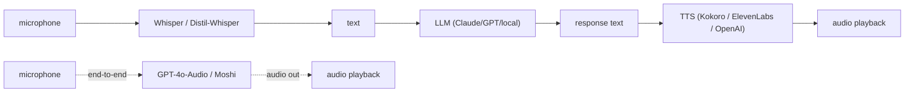

# Audio & Voice

<Mode is="learn">

`whisper.transcribe("podcast.mp3")` returns a JSON of segments with timestamps in three lines of Python, and the model that does it — Whisper-Large-v3 — fits on a 16 GB GPU and is robust enough to handle 99 languages, accents, background noise, and your dog barking. Three years ago this was a research project; in 2026 it's an `import`. Pair it with a 82M-parameter TTS model that runs on a phone and produces audio that fools listeners (Kokoro), and a voice agent goes from a six-month build to a weekend.

The architectural insight: **audio is just another modality the same encoder-decoder shape handles**. Whisper chunks audio into 30-second windows, computes log-mel spectrograms, runs them through a transformer encoder, and the decoder generates text autoregressively with the same <Term name="kv cache">KV-cache</Term> decode you already know. TTS goes the other direction — text in, audio tokens out, vocoded to waveform. Same primitives, swapped axes.

This lesson is the production stack for voice in 2026: the cascaded sandwich (STT → LLM → TTS) that most teams ship, the latency budget that makes it feel real-time, the end-to-end voice models that are starting to replace the cascade, and the ethics work that has to come along when voice cloning takes 5 seconds of sample audio.

## TL;DR

- The 2026 voice-agent stack: **STT (Whisper / Distil-Whisper)** → **LLM (Claude / GPT / open)** → **TTS (Kokoro / OpenAI / ElevenLabs)** → audio out. Latency target: under 1 second total round-trip.
- **Whisper** is OpenAI's open-source STT model — multilingual, extremely robust to noise. Distil-Whisper is a 6× smaller / faster variant with ~95% of Whisper-Large's accuracy.
- **TTS in 2026**: **Kokoro** (~80M params, near-human quality, runs on a phone) is the open frontier; **ElevenLabs / OpenAI Voice / PlayHT** lead on hosted quality and voice cloning.
- **End-to-end voice models** (GPT-4o-Audio, Claude voice mode, Moshi) skip the STT/TTS sandwich — audio in, audio out, no text intermediate. Latency drops below 300 ms but architectural maturity is still 2025-fresh.
- For most product builders: **Whisper + LLM + Kokoro** running locally is the cheapest path; hosted APIs are the fastest-to-ship.

## Mental model



Two architectures: the cascaded sandwich (most common) and the emerging end-to-end models.

## Whisper for STT

```python
import whisper
model = whisper.load_model("large-v3")  # or "medium", "small", "tiny"
result = model.transcribe("audio.mp3", language="en")
print(result["text"])
```

Whisper-Large-v3 (2023): ~99 languages, robust to accents and noise, runs on a single 16GB GPU. Word error rate ~5% on clean speech.

For latency-sensitive use cases: **Distil-Whisper** (6× smaller, ~6× faster, ~5–8% WER on clean speech). Or **faster-whisper** (CTranslate2-optimized Whisper, ~4× faster than reference Python).

For real-time: **WhisperX** adds word-level alignment; **whisper-streaming** does proper streaming with partial transcripts every 200 ms.

## Kokoro for TTS

```python
from kokoro import KPipeline

pipeline = KPipeline(lang_code='a')   # American English
audio = pipeline("Hello, this is a test of the Kokoro TTS model.", voice="af_heart")
# audio is a numpy array; save with soundfile or stream
```

Kokoro (October 2024) is an 82M-param TTS model — small enough to run on a phone — that produces near-human quality. ~30 voices across English, Mandarin, Japanese, French, Italian, Spanish, Portuguese, Hindi.

For higher quality / voice cloning: **ElevenLabs** (best in class), **OpenAI TTS** (5 stock voices, very natural), **PlayHT** (good cloning), **F5-TTS** (open, voice cloning from 5-second samples).

## Latency budget

Voice-agent latency target: ~800 ms end-to-end (the threshold below which conversation feels natural). Budget:

| Stage | Time |
|---|---|
| Mic → audio chunk | 200 ms (chunked streaming) |
| STT (Whisper-streaming) | 100 ms (incremental) |
| LLM (first token) | 300 ms (with prefix caching) |
| TTS (first audio) | 150 ms (Kokoro on local GPU) |
| Audio playback start | 50 ms |
| **Total** | **~800 ms** |

Each stage has to be streaming or you lose. Modern stacks (Pipecat, Vapi) optimize this end-to-end.

## A complete voice loop in 100 lines

```python
import asyncio
import websockets
from anthropic import AsyncAnthropic
from kokoro import KPipeline
import faster_whisper

stt = faster_whisper.WhisperModel("medium", device="cuda")
tts = KPipeline(lang_code='a')
llm = AsyncAnthropic()

async def voice_loop(websocket):
    """Per-connection voice agent."""
    audio_buffer = bytearray()
    history = []

    async for audio_chunk in websocket:
        audio_buffer.extend(audio_chunk)
        if not voice_activity_detected(audio_buffer): continue

        # Transcribe
        segments, _ = stt.transcribe(audio_buffer, language="en")
        text = " ".join(s.text for s in segments)
        if not text: continue

        history.append({"role": "user", "content": text})

        # Stream LLM response
        response_text = ""
        async with llm.messages.stream(
            model="claude-haiku-4-5",
            max_tokens=512,
            messages=history,
        ) as stream:
            async for chunk in stream.text_stream:
                response_text += chunk
                # Once we have a full sentence, generate + send TTS
                while "." in response_text or "?" in response_text or "!" in response_text:
                    sentence, _, response_text = response_text.partition(".")
                    audio = tts(sentence, voice="af_heart")
                    await websocket.send(audio.tobytes())

        history.append({"role": "assistant", "content": response_text})
        audio_buffer.clear()
```

Streaming sentence-by-sentence keeps the perceived latency tight. The user hears the first part of the response before the LLM has finished generating.

## End-to-end voice models

GPT-4o-Audio, Claude voice mode (mobile app), Moshi, Mini-Omni — all skip the STT/TTS cascade and do audio-to-audio directly.

Architecture (Moshi as the open example):
- **Audio tokenizer** (Mimi codec): converts audio to a sequence of discrete tokens at ~12.5 Hz.
- **Joint speech-text transformer**: predicts both speech tokens and text tokens. The text is the model's "inner monologue" that drives the speech.
- **Audio detokenizer**: converts speech tokens back to audio.

End-to-end models capture **prosody, emotion, interruption** that the cascade loses. Latency is genuinely lower (~200 ms first-audio) because there's no STT-LLM-TTS pipeline.

The catch: harder to combine with tool-use, RAG, etc. (which expect text). 2026 is the inflection year for end-to-end voice models in production; expect rapid maturation.

## Voice cloning

ElevenLabs and F5-TTS clone voices from a 5-second sample. The clone is ~95% perceptually accurate. **Massive ethics implications**: deepfake risk, fraud, social engineering. Production deployments increasingly require:
- Consent verification (the speaker authorizes their voice).
- Watermarking the output (Adobe's Content Credentials, or audio watermarks).
- Rate limits + monitoring for abuse.

Most major platforms now require these by policy.

## Run it in your browser — voice-loop simulator

<RunInBrowser
  description="Simulate the cascaded voice loop with hardcoded fake STT/LLM/TTS — see the streaming structure."
  code={`# Pretend STT, LLM, TTS for the loop. No real audio.

def fake_stt(audio_bytes):
    return "What's the weather in San Francisco today?"

def fake_llm_stream(text):
    response = "It's currently 72 degrees Fahrenheit and sunny in San Francisco. A great day for a walk."
    # Stream by word
    for w in response.split():
        yield w + ' '

def fake_tts(text):
    return f"<audio of: {text!r}>"

# The voice loop
def voice_turn(audio_bytes):
    # 1. STT
    text = fake_stt(audio_bytes)
    print(f"USER: {text}")

    # 2. LLM stream + 3. TTS chunked at sentence boundaries
    response_buf = ""
    sentence_breaks = '.?!'
    for token in fake_llm_stream(text):
        response_buf += token
        while any(s in response_buf for s in sentence_breaks):
            for s in sentence_breaks:
                if s in response_buf:
                    sentence, _, response_buf = response_buf.partition(s)
                    sentence = sentence.strip() + s
                    if sentence.strip(s).strip():
                        audio_chunk = fake_tts(sentence)
                        print(f"  TTS chunk: {audio_chunk}")
                    break
    if response_buf.strip():
        print(f"  TTS final: {fake_tts(response_buf.strip())}")

voice_turn(b"<imagined audio of user speaking>")
print()
print("Streaming sentence-by-sentence is the trick that makes voice agents feel responsive.")
print("First TTS chunk plays before the LLM has finished generating.")
`}
/>

The streaming-by-sentence pattern is the perceived-latency trick. Real systems chunk even more aggressively (phrases or commas) for tighter feedback.

## Quick check

<FillIn
  prompt="The 82M-parameter open TTS model (October 2024) that produces near-human quality and runs on a phone:"
  answer="Kokoro"
  accept={["Kokoro TTS", "kokoro"]}
  hint="Six letters; Japanese for 'heart' / 'mind'."
  explanation="Kokoro (released Oct 2024) is the small, open, near-frontier TTS model. ~30 voices across multiple languages. The 2026 default for self-hosted voice agents."
/>

<Quiz
  question="A team builds a voice agent with Whisper-Large + Claude + Kokoro. End-to-end latency is ~3 seconds; users say it feels slow. Best fix:"
  options={[
    'Buy faster GPUs.',
    'Stream every stage: chunked Whisper-streaming, Anthropic streaming API, sentence-chunked TTS. Each stage starts producing output before the previous finishes.',
    'Reduce model sizes.',
    'Use a different LLM.',
  ]}
  answer={1}
  explanation='Voice latency is dominated by sequential waits, not raw compute. Chunked streaming at every stage — Whisper produces partial transcripts, Anthropic streams tokens, TTS starts on the first sentence — gets the first audio out in ~800ms instead of 3s. The same hardware; the same models; just no stage waits for the previous to finish before starting.'
/>

## Key takeaways

1. **The cascade**: STT (Whisper) → LLM → TTS (Kokoro). Stream every stage; target under 1s end-to-end.
2. **Whisper is robust**; Distil-Whisper is faster; faster-whisper is faster still.
3. **Kokoro at 82M params** runs on a phone with near-human quality. Open + small + good = production-ready.
4. **End-to-end voice models** (GPT-4o-Audio, Moshi) skip the cascade for tighter latency + better prosody. 2026 inflection year.
5. **Voice cloning needs ethics + watermarking** baked in. Don't deploy without.

## Go deeper

<Resources
  items={[
    { kind: 'paper', href: 'https://arxiv.org/abs/2212.04356', title: 'Robust Speech Recognition via Large-Scale Weak Supervision (Whisper)', author: 'Radford et al., 2022', note: 'The Whisper paper. Section 4 has the multilingual training that makes it the strongest open STT.' },
    { kind: 'docs', href: 'https://huggingface.co/hexgrad/Kokoro-82M', title: 'Kokoro 82M', note: 'The model card + reference inference code. Read for the surprising "TTS is solved at small scale now" angle.' },
    { kind: 'paper', href: 'https://arxiv.org/abs/2410.00037', title: 'Moshi: a speech-text foundation model for real-time dialogue', author: 'Défossez et al., 2024', note: 'The end-to-end open-source voice model. Section 3 explains the audio tokenization.' },
    { kind: 'docs', href: 'https://platform.openai.com/docs/guides/realtime', title: 'OpenAI — Realtime API', note: 'The API for end-to-end voice (audio in, audio out). The closest commercial product to Moshi.' },
    { kind: 'docs', href: 'https://docs.pipecat.ai/', title: 'Pipecat — Voice AI Framework', note: 'Open-source voice-agent framework. Production-grade pipeline with streaming + interruption handling.' },
    { kind: 'docs', href: 'https://github.com/SYSTRAN/faster-whisper', title: 'SYSTRAN/faster-whisper', note: 'CTranslate2-optimized Whisper. ~4× faster than reference. The default for self-hosted Whisper in 2026.' },
    { kind: 'repo', href: 'https://github.com/SWivid/F5-TTS', title: 'SWivid/F5-TTS', note: 'Open voice-cloning TTS. 5-second sample → cloned voice. State-of-art open quality.' },
  ]}
/>

</Mode>

<Mode is="reference">

## TL;DR

- The 2026 voice-agent stack: **STT (Whisper / Distil-Whisper)** → **LLM (Claude / GPT / open)** → **TTS (Kokoro / OpenAI / ElevenLabs)** → audio out. Latency target: under 1 second total round-trip.
- **Whisper** is OpenAI's open-source STT model — multilingual, extremely robust to noise. Distil-Whisper is a 6× smaller / faster variant with ~95% of Whisper-Large's accuracy.
- **TTS in 2026**: **Kokoro** (~80M params, near-human quality, runs on a phone) is the open frontier; **ElevenLabs / OpenAI Voice / PlayHT** lead on hosted quality and voice cloning.
- **End-to-end voice models** (GPT-4o-Audio, Claude voice mode, Moshi) skip the STT/TTS sandwich — audio in, audio out, no text intermediate. Latency drops below 300 ms but architectural maturity is still 2025-fresh.
- For most product builders: **Whisper + LLM + Kokoro** running locally is the cheapest path; hosted APIs are the fastest-to-ship.

## Why this matters

Voice is the second largest interaction modality after text. Phone calls, voice agents, in-car AI, accessibility — all need a speech stack. The 2024–2026 collapse in TTS quality (Kokoro at 80M params produces audio that fools listeners) plus Whisper's robustness has made "voice agent" a 2-week build instead of a 6-month one. **Knowing the components is the price of building anything voice-shaped in 2026.**

## Mental model


Two architectures: the cascaded sandwich (most common) and the emerging end-to-end models.

## Concrete walkthrough

### Whisper for STT

```python
import whisper
model = whisper.load_model("large-v3")  # or "medium", "small", "tiny"
result = model.transcribe("audio.mp3", language="en")
print(result["text"])
```

Whisper-Large-v3 (2023): ~99 languages, robust to accents and noise, runs on a single 16GB GPU. Word error rate ~5% on clean speech.

For latency-sensitive use cases: **Distil-Whisper** (6× smaller, ~6× faster, ~5–8% WER on clean speech). Or **faster-whisper** (CTranslate2-optimized Whisper, ~4× faster than reference Python).

For real-time: **WhisperX** adds word-level alignment; **whisper-streaming** does proper streaming with partial transcripts every 200 ms.

### Kokoro for TTS

```python
from kokoro import KPipeline

pipeline = KPipeline(lang_code='a')   # American English
audio = pipeline("Hello, this is a test of the Kokoro TTS model.", voice="af_heart")
# audio is a numpy array; save with soundfile or stream
```

Kokoro (October 2024) is an 82M-param TTS model — small enough to run on a phone — that produces near-human quality. ~30 voices across English, Mandarin, Japanese, French, Italian, Spanish, Portuguese, Hindi.

For higher quality / voice cloning: **ElevenLabs** (best in class), **OpenAI TTS** (5 stock voices, very natural), **PlayHT** (good cloning), **F5-TTS** (open, voice cloning from 5-second samples).

### Latency budget

Voice-agent latency target: ~800 ms end-to-end (the threshold below which conversation feels natural). Budget:

| Stage | Time |
|---|---|
| Mic → audio chunk | 200 ms (chunked streaming) |
| STT (Whisper-streaming) | 100 ms (incremental) |
| LLM (first token) | 300 ms (with prefix caching) |
| TTS (first audio) | 150 ms (Kokoro on local GPU) |
| Audio playback start | 50 ms |
| **Total** | **~800 ms** |

Each stage has to be streaming or you lose. Modern stacks (Pipecat, Vapi) optimize this end-to-end.

### A complete voice loop in 100 lines

```python
import asyncio
import websockets
from anthropic import AsyncAnthropic
from kokoro import KPipeline
import faster_whisper

stt = faster_whisper.WhisperModel("medium", device="cuda")
tts = KPipeline(lang_code='a')
llm = AsyncAnthropic()

async def voice_loop(websocket):
    """Per-connection voice agent."""
    audio_buffer = bytearray()
    history = []

    async for audio_chunk in websocket:
        audio_buffer.extend(audio_chunk)
        if not voice_activity_detected(audio_buffer): continue

        # Transcribe
        segments, _ = stt.transcribe(audio_buffer, language="en")
        text = " ".join(s.text for s in segments)
        if not text: continue

        history.append({"role": "user", "content": text})

        # Stream LLM response
        response_text = ""
        async with llm.messages.stream(
            model="claude-haiku-4-5",
            max_tokens=512,
            messages=history,
        ) as stream:
            async for chunk in stream.text_stream:
                response_text += chunk
                # Once we have a full sentence, generate + send TTS
                while "." in response_text or "?" in response_text or "!" in response_text:
                    sentence, _, response_text = response_text.partition(".")
                    audio = tts(sentence, voice="af_heart")
                    await websocket.send(audio.tobytes())

        history.append({"role": "assistant", "content": response_text})
        audio_buffer.clear()
```

Streaming sentence-by-sentence keeps the perceived latency tight. The user hears the first part of the response before the LLM has finished generating.

### End-to-end voice models

GPT-4o-Audio, Claude voice mode (mobile app), Moshi, Mini-Omni — all skip the STT/TTS cascade and do audio-to-audio directly.

Architecture (Moshi as the open example):
- **Audio tokenizer** (Mimi codec): converts audio to a sequence of discrete tokens at ~12.5 Hz.
- **Joint speech-text transformer**: predicts both speech tokens and text tokens. The text is the model's "inner monologue" that drives the speech.
- **Audio detokenizer**: converts speech tokens back to audio.

End-to-end models capture **prosody, emotion, interruption** that the cascade loses. Latency is genuinely lower (~200 ms first-audio) because there's no STT-LLM-TTS pipeline.

The catch: harder to combine with tool-use, RAG, etc. (which expect text). 2026 is the inflection year for end-to-end voice models in production; expect rapid maturation.

### Voice cloning

ElevenLabs and F5-TTS clone voices from a 5-second sample. The clone is ~95% perceptually accurate. **Massive ethics implications**: deepfake risk, fraud, social engineering. Production deployments increasingly require:
- Consent verification (the speaker authorizes their voice).
- Watermarking the output (Adobe's Content Credentials, or audio watermarks).
- Rate limits + monitoring for abuse.

Most major platforms now require these by policy.

## Run it in your browser — voice-loop simulator

<RunInBrowser
  description="Simulate the cascaded voice loop with hardcoded fake STT/LLM/TTS — see the streaming structure."
  code={`# Pretend STT, LLM, TTS for the loop. No real audio.

def fake_stt(audio_bytes):
    return "What's the weather in San Francisco today?"

def fake_llm_stream(text):
    response = "It's currently 72 degrees Fahrenheit and sunny in San Francisco. A great day for a walk."
    # Stream by word
    for w in response.split():
        yield w + ' '

def fake_tts(text):
    return f"<audio of: {text!r}>"

# The voice loop
def voice_turn(audio_bytes):
    # 1. STT
    text = fake_stt(audio_bytes)
    print(f"USER: {text}")

    # 2. LLM stream + 3. TTS chunked at sentence boundaries
    response_buf = ""
    sentence_breaks = '.?!'
    for token in fake_llm_stream(text):
        response_buf += token
        while any(s in response_buf for s in sentence_breaks):
            for s in sentence_breaks:
                if s in response_buf:
                    sentence, _, response_buf = response_buf.partition(s)
                    sentence = sentence.strip() + s
                    if sentence.strip(s).strip():
                        audio_chunk = fake_tts(sentence)
                        print(f"  TTS chunk: {audio_chunk}")
                    break
    if response_buf.strip():
        print(f"  TTS final: {fake_tts(response_buf.strip())}")

voice_turn(b"<imagined audio of user speaking>")
print()
print("Streaming sentence-by-sentence is the trick that makes voice agents feel responsive.")
print("First TTS chunk plays before the LLM has finished generating.")
`}
/>

The streaming-by-sentence pattern is the perceived-latency trick. Real systems chunk even more aggressively (phrases or commas) for tighter feedback.

## Quick check

<FillIn
  prompt="The 82M-parameter open TTS model (October 2024) that produces near-human quality and runs on a phone:"
  answer="Kokoro"
  accept={["Kokoro TTS", "kokoro"]}
  hint="Six letters; Japanese for 'heart' / 'mind'."
  explanation="Kokoro (released Oct 2024) is the small, open, near-frontier TTS model. ~30 voices across multiple languages. The 2026 default for self-hosted voice agents."
/>

<Quiz
  question="A team builds a voice agent with Whisper-Large + Claude + Kokoro. End-to-end latency is ~3 seconds; users say it feels slow. Best fix:"
  options={[
    'Buy faster GPUs.',
    'Stream every stage: chunked Whisper-streaming, Anthropic streaming API, sentence-chunked TTS. Each stage starts producing output before the previous finishes.',
    'Reduce model sizes.',
    'Use a different LLM.',
  ]}
  answer={1}
  explanation='Voice latency is dominated by sequential waits, not raw compute. Chunked streaming at every stage — Whisper produces partial transcripts, Anthropic streams tokens, TTS starts on the first sentence — gets the first audio out in ~800ms instead of 3s. The same hardware; the same models; just no stage waits for the previous to finish before starting.'
/>

## Key takeaways

1. **The cascade**: STT (Whisper) → LLM → TTS (Kokoro). Stream every stage; target under 1s end-to-end.
2. **Whisper is robust**; Distil-Whisper is faster; faster-whisper is faster still.
3. **Kokoro at 82M params** runs on a phone with near-human quality. Open + small + good = production-ready.
4. **End-to-end voice models** (GPT-4o-Audio, Moshi) skip the cascade for tighter latency + better prosody. 2026 inflection year.
5. **Voice cloning needs ethics + watermarking** baked in. Don't deploy without.

## Go deeper

<Resources
  items={[
    { kind: 'paper', href: 'https://arxiv.org/abs/2212.04356', title: 'Robust Speech Recognition via Large-Scale Weak Supervision (Whisper)', author: 'Radford et al., 2022', note: 'The Whisper paper. Section 4 has the multilingual training that makes it the strongest open STT.' },
    { kind: 'docs', href: 'https://huggingface.co/hexgrad/Kokoro-82M', title: 'Kokoro 82M', note: 'The model card + reference inference code. Read for the surprising "TTS is solved at small scale now" angle.' },
    { kind: 'paper', href: 'https://arxiv.org/abs/2410.00037', title: 'Moshi: a speech-text foundation model for real-time dialogue', author: 'Défossez et al., 2024', note: 'The end-to-end open-source voice model. Section 3 explains the audio tokenization.' },
    { kind: 'docs', href: 'https://platform.openai.com/docs/guides/realtime', title: 'OpenAI — Realtime API', note: 'The API for end-to-end voice (audio in, audio out). The closest commercial product to Moshi.' },
    { kind: 'docs', href: 'https://docs.pipecat.ai/', title: 'Pipecat — Voice AI Framework', note: 'Open-source voice-agent framework. Production-grade pipeline with streaming + interruption handling.' },
    { kind: 'docs', href: 'https://github.com/SYSTRAN/faster-whisper', title: 'SYSTRAN/faster-whisper', note: 'CTranslate2-optimized Whisper. ~4× faster than reference. The default for self-hosted Whisper in 2026.' },
    { kind: 'repo', href: 'https://github.com/SWivid/F5-TTS', title: 'SWivid/F5-TTS', note: 'Open voice-cloning TTS. 5-second sample → cloned voice. State-of-art open quality.' },
  ]}
/>

</Mode>

<LessonComplete />
