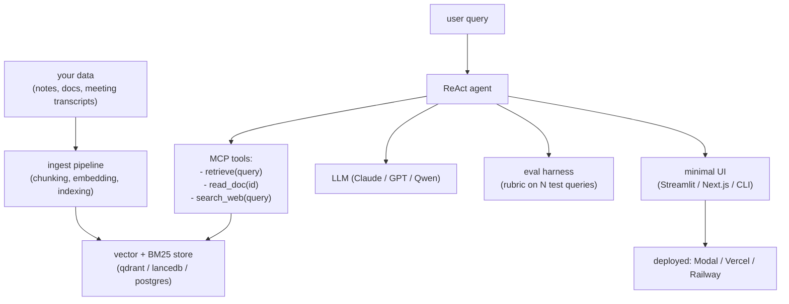

# Capstone — Ship It

> **Prereqs:** every Applied AI module (LLM Basics, RAG & Agents, Serve & Ship, Frontier). This is the assembly project.

## TL;DR

- The Applied AI track culminates here: **build, eval, and deploy a working RAG-agent that you can use in real life**. The lessons up to this point are the parts; this is the assembly.
- Pick a real problem you have. Not a demo. Not a Hello-World. **Something you would actually use weekly** — your reading inbox, your meeting notes, your coding context, your research notes.
- The full stack: ingest pipeline → chunked + indexed (hybrid retrieval) → ReAct agent with MCP tools → structured-output API → minimal UI → deployed somewhere persistent.
- **Eval is the bar.** Without an eval, you have a demo. With an eval, you have a product. Build the eval *before* you start optimizing.
- Most teams fail this not on technical capability but on scoping. **Cut features ruthlessly.** A working v0 in one weekend beats a half-built v3 in a month.

## Why this matters

Reading curriculum is necessary; shipping artifacts is sufficient. The capstone is what separates "I learned about agents" from "I built one and use it daily." When recruiters / managers / collaborators ask "what have you built?", you point at this. **It is the single most useful artifact you produce in the Applied AI track**, more than any individual lesson's exercise.

## What "ship it" actually means

A real shipped project has these properties:

1. **Solves a real problem you have**, not a demo.
2. **Has at least one real user**, even if that user is you.
3. **Persists state**: your data, your conversations, your indices live somewhere durable.
4. **Has a URL or a CLI** that works without you sitting at the keyboard.
5. **Has at least 20 evaluation queries** with rubric-graded answers, run automatically.
6. **Has a README** that someone else could clone and run.

Anything that meets these is shippable. Anything that doesn't is a script.

## The architecture template

Pick one ingest source, one retrieval store, one LLM, one tool set, one UI. Resist scope creep.

## Build it — step by step

This whole module's [Capstone](#capstone-card) below has the rich step-by-step. The summary:

1. **Pick the problem.** Write a one-paragraph product spec. (30 min)
2. **Ingest a small corpus.** 100–1000 docs. Chunk + embed with Nomic Embed v2; index in qdrant or lancedb. (2 hours)
3. **Build the ReAct agent.** Claude or GPT, 2–3 tools (retrieve, read_doc, search_web). MCP-shaped if you want; ad-hoc is fine. (3 hours)
4. **Wrap with structured-output endpoint.** FastAPI, returns Pydantic objects. (1 hour)
5. **Build a minimal UI.** Streamlit takes 30 minutes; Next.js takes 4. Pick. (1–4 hours)
6. **Deploy.** Modal (one command for Python apps), Vercel (Next.js), or a cheap VPS. (1–2 hours)
7. **Build the eval harness.** 20 representative queries, rubric-graded by Claude as judge. Add CI. (2 hours)
8. **Use it for a week.** Find the bugs. Fix the worst ones. (a week of dogfooding)
9. **Write the README.** Architecture diagram, install steps, eval results. (1 hour)

Total: one weekend (~12–16 focused hours) for v0. Iteration fills in the rest.

## What to optimize, in order

When v0 is up, don't optimize randomly. The order:

1. **Retrieval quality.** Run the eval. If retrieval is wrong, nothing else matters. Hybrid retrieval + reranker if dense alone is missing.
2. **Prompt quality.** Tighten the system prompt; few-shot examples in the agent's context.
3. **Tool design.** Consolidate tools the LLM uses awkwardly; split tools that take confusing arguments.
4. **Schema / structured output.** Add Pydantic field descriptions; tighten validators.
5. **Latency.** Streaming, caching, smaller models for cheap calls.
6. **Cost.** Routing (small model for easy queries), prompt caching (Anthropic / OpenAI), aggressive retrieval pruning.

Skip levels at your peril. Optimizing prompts when retrieval is wrong = polishing the wheel that's pointing the wrong way.

## Common scope-creep traps

- **"Let me support all my data sources."** Ship one. Add others later.
- **"Let me make a beautiful UI."** Streamlit is fine for v0. The work that matters is in the agent.
- **"Let me add memory."** ReAct agent loop with full message history is enough memory for v0. Vector-DB-backed memory is v3.
- **"Let me train a custom embedding model."** Off-the-shelf is fine until you've validated the eval.
- **"Let me add multi-agent orchestration."** One ReAct agent. Multi-agent is v5.

The first version of every great project is embarrassing. Ship anyway.

## Examples of successful capstones

(Compiled from learner submissions, anonymized.)

- **Notes assistant**: 3 years of Markdown notes ingested into qdrant, MCP server exposing retrieve / search; used daily via Cursor.
- **Paper triage**: arXiv RSS → Anthropic summarizer → quality filter → Notion. Used daily.
- **Meeting recap bot**: Otter.ai transcripts → ingest → "what did we decide about X?" agent. Replaces note-taker.
- **Code archaeologist**: company codebase → embedded → LLM that answers "where is feature X implemented and who wrote it?". Saves new-hire onboarding time.
- **Customer-support agent**: company docs → RAG → ReAct agent with ticket-creation tool. Deployed to actual customers.

Each took one weekend for v0. Each is now used weekly or more.

<Capstone
  title="Ship a real RAG-agent for a real problem you have"
  pitch="The integrative project. Not a demo, not a tutorial. Use it for a week and tell me what broke."
  what="A working RAG-agent deployed at a URL or available as a CLI. Has its own ingest pipeline, hybrid retrieval, ReAct loop with 2–3 tools, structured-output API, minimal UI, eval harness with 20 queries, and a README. The artifact is the repo + the deployed instance + the eval scores."
  sota={['LLM: Claude / GPT / Qwen2.5', 'Embeddings: Nomic Embed v2 (Matryoshka)', 'Vector store: qdrant / lancedb / pgvector', 'Reranker: bge-reranker-v2-m3 (optional)', 'Agent: ReAct with MCP-shaped tools', 'Eval: judge LLM with rubric', 'Deploy: Modal / Vercel / Railway']}
  device="cloud"
  time="One focused weekend (~14 h) for v0; iterate from there"
  level="frontier"
  steps={[
    {
      title: 'Pick the problem (one paragraph spec)',
      goal: 'Write the spec: who is the user, what is the input, what is the output, what makes it useful. If it\'s not a problem you have, pick a different one. Real-world > toy.',
      checkpoint: 'You can describe the project in one sentence to a friend and they say "oh, that would be useful."',
      trap: 'Picking too broad a problem ("everything in my life"). Pick one corpus, one query type. Add scope later.',
      est: '30 min',
    },
    {
      title: 'Ingest 100–1000 docs',
      goal: 'Pull your corpus into a flat directory. Chunk with semantic-aware chunker (e.g., LlamaIndex SentenceSplitter or Unstructured). Embed with Nomic Embed v2. Index in qdrant (Docker container) or lancedb (file-based).',
      checkpoint: 'You can run `query("find docs about X")` and get top-K results. Spot-check that they\'re relevant.',
      trap: 'Skipping chunking strategy. A 10K-token doc as one chunk is unhelpful; 100-token chunks lose context. ~512–1024 tokens per chunk with 100-token overlap is the sweet spot.',
      est: '2 h',
    },
    {
      title: 'Build the ReAct agent',
      goal: 'Use the [ReAct lesson](../rag-agents/react-agents)\'s 80-line template. Tools: retrieve(query, top_k), read_doc(id), maybe search_web(query). Pick Claude or GPT for the LLM. Test on 5 queries by hand.',
      checkpoint: 'Agent answers 4/5 hand-tested queries reasonably. The chain-of-tool-calls makes sense.',
      trap: 'Over-engineering with multi-agent orchestration. One agent, ≤3 tools, max_iters=10.',
      est: '3 h',
    },
    {
      title: 'Wrap as structured-output API',
      goal: 'FastAPI endpoint. POST /query → AgentResponse Pydantic class. response_format enforces the shape. Add streaming if you have time.',
      checkpoint: 'curl your endpoint and get valid JSON back. No try/except needed; structured output guarantees parseability.',
      est: '1 h',
    },
    {
      title: 'Minimal UI',
      goal: 'Streamlit (Python, 30 lines, no frontend skills) or Next.js + Chakra (4 hours, prettier). Either works. Skip auth for v0.',
      checkpoint: 'You can type a query in a browser and see the agent\'s answer.',
      est: '1–4 h',
    },
    {
      title: 'Deploy',
      goal: 'Modal for Python: `modal deploy app.py` and you have a URL. Or Vercel for Next.js + Vercel functions. Or a $5 VPS with Caddy + systemd. The artifact is "I have a URL someone else can hit."',
      checkpoint: 'You hit the URL from your phone, the agent works.',
      est: '1–2 h',
    },
    {
      title: 'Eval harness',
      goal: 'Write 20 representative queries with reference answers (rubric-graded, not exact-match). Use Claude as judge with a rubric prompt. Run via pytest in CI.',
      checkpoint: 'CI runs eval; you have a baseline score. Each PR shows score delta.',
      trap: 'Skipping the eval and "feeling" whether it\'s good. You will lie to yourself.',
      est: '2 h',
    },
    {
      title: 'Use it for a week',
      goal: 'Actually use the deployed agent in your daily workflow. Note every wrong answer, every confusing UI moment, every cost spike. Fix the top 3 issues.',
      checkpoint: 'Eval score has gone up after fixes. The thing is genuinely useful.',
      est: '7 days of dogfooding',
    },
    {
      title: 'README + push',
      goal: 'Architecture diagram (Excalidraw), install steps, eval scores, demo video. The README is what makes this a portfolio artifact.',
      checkpoint: 'A friend can clone, run, and use the agent in 30 minutes. They send you "oh nice."',
      est: '1 h',
    },
  ]}
  outcomes={[
    'A real, deployed AI agent solving a real problem you have',
    'Hands-on integration of every Applied AI lesson — embeddings, retrieval, agents, structured output, observability',
    'An eval harness you understand and trust',
    'A portfolio artifact that demonstrably works (repo + URL + eval scores + demo video)',
  ]}
/>

## What you walk away with

You finish this capstone with:

1. **A working AI product** you actually use.
2. **An eval methodology** that's transferable to every future LLM project.
3. **A portfolio artifact** more compelling than any course-completion certificate.
4. **The integrative skill** of "I can take an idea and ship it." Most engineers never develop this.

This is the bar. Hit it once, and every future LLM project starts from a position of "I've done this before; what's special about this one?" instead of "where do I start?"

## Key takeaways

1. **Solve a real problem you have.** Not a demo. Not a Hello-World.
2. **Build v0 in one weekend.** Cut features. Ship the integration.
3. **Eval is the bar.** Without it, you have a demo, not a product.
4. **Optimize in order**: retrieval → prompts → tools → schema → latency → cost.
5. **The README is the artifact.** A working agent without a README is invisible. A README without a working agent is a lie.

## Go deeper

<Resources
  items={[
    { kind: 'blog', href: 'https://hamel.dev/blog/posts/evals/', title: 'Hamel Husain — Your AI Product Needs Evals', note: 'The eval discipline applied to LLM products. Read this before writing your eval.' },
    { kind: 'blog', href: 'https://www.anthropic.com/research/building-effective-agents', title: 'Anthropic — Building Effective Agents', note: 'The taxonomy of agent patterns. Useful for "what kind of agent am I building."' },
    { kind: 'docs', href: 'https://modal.com/docs', title: 'Modal Documentation', note: 'The fastest deploy for Python AI apps. `modal deploy app.py` and you have a URL.' },
    { kind: 'docs', href: 'https://docs.streamlit.io/', title: 'Streamlit Documentation', note: 'The "30 lines and you have a UI" framework. The right choice for v0 unless you specifically need React.' },
    { kind: 'blog', href: 'https://eugeneyan.com/writing/llm-patterns/', title: 'Eugene Yan — LLM Patterns', note: 'Six high-leverage patterns for LLM products. The "Caching", "Eval", "Defensive UX" sections are gold.' },
    { kind: 'docs', href: 'https://github.com/jxnl/instructor', title: 'Instructor', note: 'Pydantic-shaped wrapper for every LLM API. The structured-output backbone for the capstone.' },
    { kind: 'docs', href: 'https://qdrant.tech/documentation/', title: 'Qdrant Documentation', note: 'Vector DB used by many production stacks. The free tier is enough for v0.' },
  ]}
/>

<LessonComplete />
