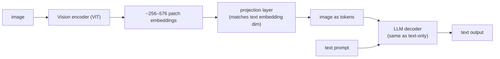

# Multimodal (Vision)

<Mode is="learn">

A scanned PDF invoice lands in your bucket. Twenty years ago you'd reach for Tesseract and a regex; five years ago you'd train a layout-aware OCR model on a thousand labelled examples; in 2026 you write `client.messages.create(content=[{"type":"document",...}, {"type":"text","text":"extract line items as JSON"}])` and a frontier <Term name="vlm">VLM</Term> hands you 99% of what a human would extract. The model doing this is not a vision system bolted onto a language system — it's the same transformer decoder you've already learned, fed token sequences from a vision encoder instead of a tokenizer.

The architectural punchline is that vision is *not a special case*. A ViT chops the image into ~256–576 patches, projects each into the LLM's token-embedding space, and from there the decoder can't tell which tokens were pixels and which were words. Every text-side technique you already know — <Term name="rag">RAG</Term>, <Term name="tool use">tool use</Term>, structured output via Pydantic — composes with vision unchanged. That's why "make it multimodal" went from a research project to a content-block field on the API in three years.

This lesson is the production layer of that fact: which open weights actually work in 2026, what document understanding costs in tokens and dollars, and where VLMs still fail in ways your eval has to catch.

## TL;DR

- A **vision-language model (VLM)** processes images alongside text. Architecture: image encoder (ViT or CNN) → projection layer → transformer decoder. Works exactly like text-only LLMs at the decoder stage.
- **CLIP** (OpenAI, 2021) was the breakthrough — contrastive image-text training producing aligned embeddings. Still the foundation of most vision retrieval; SigLIP (Google, 2023) is the modern improvement.
- **Frontier VLMs** in 2026: **Claude Sonnet/Opus 4 with vision, GPT-4o, Gemini 2.x, Llama 3.2-Vision, Qwen2-VL, InternVL2** — all natively multimodal, not text-then-vision adapters.
- **Document understanding** (PDFs, charts, screenshots) is the killer app: extract structured data from unstructured visual content. Used heavily in agents that need to "see" software UIs.
- For 2026 production: prefer hosted VLMs for general use; self-host **Qwen2-VL** or **InternVL2** when on-device or compliance matters.

## Mental model



Image becomes token sequence; text becomes token sequence; LLM decoder doesn't care which is which.

## What CLIP / SigLIP do

CLIP trains an image encoder and a text encoder **jointly** to produce vectors that are close when the image and text are paired. Output: two <Term name="embedding">embedding</Term> spaces aligned. Used for:

- **Zero-shot image classification**: encode the image, encode candidate labels, pick max cosine similarity.
- **Image search**: encode all images offline; encode the query text; cosine ranking.
- **Image clustering / dedup**: same as text embeddings.

CLIP at ViT-L/14: 512-dim embeddings, ~70% top-1 ImageNet zero-shot. SigLIP (Sigmoid Loss for Image-Pretraining) hits ~80% with better training stability. Both are open and small (~400M params).

CLIP/SigLIP is **not a generative model** — they don't produce text from images. For that, you need a VLM.

## How modern VLMs work (Llama 3.2-Vision, Qwen2-VL, etc.)

The pattern, every 2024+ frontier VLM:

1. **Image encoder**: ViT-L/14 or similar. Input: image. Output: ~256–576 patch embeddings (depending on resolution).
2. **Projection layer**: 1–2 linear layers (sometimes a small MLP) mapping image embeddings into the text token-embedding space.
3. **Decoder LLM**: standard transformer decoder. Image tokens are *interleaved* with text tokens in the input sequence. Decoder generates text autoregressively.

Training: large image-text pair datasets (LAION 5B + filtered web crawls). The vision encoder is sometimes pretrained CLIP/SigLIP-style first, then jointly fine-tuned.

The architectural cleanliness: **image processing is a pre-processing step**; the decoder doesn't know it's "doing vision." This is why all the LLM-side techniques (<Term name="rag">RAG</Term>, <Term name="tool use">tool use</Term>, structured output) compose seamlessly with vision.

## Frontier VLMs (April 2026)

| Model | Open? | Resolution | Strengths |
|---|---|---|---|
| **Claude Sonnet/Opus 4 vision** | Closed (API) | up to 8K | Strong on charts, complex documents |
| **GPT-4o / GPT-5** | Closed | dynamic | High-quality general-purpose; OCR-strong |
| **Gemini 2.x** | Closed | up to 2M context with images | Long-document multimodal |
| **Llama 3.2-Vision (11B / 90B)** | Open | 1024 | Best open general-purpose VLM through 2024 |
| **Qwen2-VL (2B / 7B / 72B)** | Open | up to 2K | Strong on Chinese; great OCR |
| **InternVL2 (2B–76B)** | Open | up to 4K | Best open document-understanding |
| **Pixtral (12B)** | Open (Mistral) | 1024 | Strong general-purpose; recent |

For most products: **Claude Sonnet 4 vision** (API) or **Qwen2-VL-7B / Llama-3.2-Vision-11B** (self-hosted) is the right starting point.

## Document understanding — the production use case

```python
from anthropic import Anthropic
import base64

client = Anthropic()

with open("invoice.pdf", "rb") as f:
    pdf_b64 = base64.b64encode(f.read()).decode()

response = client.messages.create(
    model="claude-sonnet-4-5",
    max_tokens=2048,
    messages=[{
        "role": "user",
        "content": [
            {"type": "document", "source": {"type": "base64", "media_type": "application/pdf", "data": pdf_b64}},
            {"type": "text", "text": "Extract: invoice number, date, total, line items as structured JSON."},
        ],
    }],
)
```

Claude's vision processes the PDF page-by-page, OCRs text, recognizes table structure, returns the requested JSON. **For typical invoices, ~99% accuracy on structured fields.**

Same flow with Qwen2-VL self-hosted: convert PDF to images → feed into the model with the same instruction.

## Charts and graphs

Modern VLMs read charts well. The trick: ask precisely.

```
Bad: "What does the chart show?"
Better: "What was the Q3 2024 revenue in millions? Read the y-axis exactly."
```

Frontier VLMs (Claude, Gemini, GPT-4o) hit ~85% accuracy on benchmark chart-QA tasks (ChartQA). Open VLMs (Qwen2-VL, Llama-3.2-Vision) are at ~75%. **For chart-reading: prefer hosted; if self-hosting, use 70B+ class models.**

## When VLMs fail

- **Tiny text**: dense PDFs at low DPI, model misreads. Convert PDF to high-DPI images first.
- **Hand-drawn diagrams / sketches**: variable; test on representative samples.
- **Math / equations**: better than 2023 but still sometimes hallucinates symbols. For LaTeX extraction, [Mathpix](https://mathpix.com) or specialized models still beat general VLMs.
- **Adversarial images / spoofing**: generally weak. Don't deploy as a security gatekeeper.

## Cost / latency

A hosted VLM call with one ~1MP image:
- ~1500 tokens for the image (varies by provider)
- ~500–2000 tokens output
- ~$0.005–0.02 per call at 2026 rates

Latency: ~2–5 s for the response. **Don't put VLM calls in synchronous request paths**; use background processing.

## Run it in your browser — image-as-tokens shape

<RunInBrowser
  description="Simulate the patch tokenization that turns an image into a sequence of vectors, the way ViT does."
  code={`import numpy as np

# Pretend image: 224x224 RGB
H, W = 224, 224
PATCH = 14   # ViT-L/14 patch size
N_CHANNELS = 3

# Number of patches
n_patches_h = H // PATCH
n_patches_w = W // PATCH
n_patches = n_patches_h * n_patches_w
patch_dim = PATCH * PATCH * N_CHANNELS

print(f"Image: {H}x{W}x{N_CHANNELS}")
print(f"Patches: {n_patches_h}x{n_patches_w} = {n_patches} patches")
print(f"Each patch: {PATCH}x{PATCH}x{N_CHANNELS} = {patch_dim} values flattened")
print()
print("ViT then projects each patch to a fixed embedding dim (e.g., 768).")
print(f"Result: {n_patches} embeddings of dim 768 — a sequence the transformer encoder ingests.")
print()

# Simulate the patch extraction
rng = np.random.default_rng(0)
img = rng.standard_normal((H, W, N_CHANNELS)).astype(np.float32)

# Reshape into patches
patches = img.reshape(n_patches_h, PATCH, n_patches_w, PATCH, N_CHANNELS)
patches = patches.transpose(0, 2, 1, 3, 4).reshape(n_patches, patch_dim)
print(f"After patch extraction: shape={patches.shape}")
print()

# In a real VLM, these patch embeddings then get projected and concatenated
# with text token embeddings before the LLM sees them.
print("In a VLM:")
print(f"  256 image tokens + 50 text tokens = 306 sequence positions for the LLM.")
print("  The LLM treats the entire sequence the same way; image vs text is just a token-position label.")
`}
/>

The shape — image patches as a token sequence — is the entire bridge between vision and language. A 224×224 image at patch=14 is 256 tokens.

## Quick check

<FillIn
  prompt="The 2021 model that pioneered contrastive image-text alignment, still the foundation of most modern vision retrieval:"
  answer="CLIP"
  accept={["OpenAI CLIP", "clip"]}
  hint="Four letters; OpenAI."
  explanation="CLIP (Contrastive Language-Image Pre-training) trained an image encoder and a text encoder to produce aligned embeddings. SigLIP improved on it in 2023. Modern VLMs use CLIP/SigLIP-style encoders as their vision frontend."
/>

<Quiz
  question="A team needs to extract structured data from 100K PDF invoices/month. They tried Tesseract OCR + regex but accuracy is ~60%. Best 2026 path:"
  options={[
    'Train a custom OCR model.',
    'Use a frontier VLM (Claude vision, GPT-4o, or self-hosted Qwen2-VL) with Pydantic-shaped structured-output extraction. ~99% on typical invoices.',
    'Hire human reviewers.',
    'Use Tesseract with better preprocessing.',
  ]}
  answer={1}
  explanation={`VLM + structured output is exactly the modern answer to "extract data from documents." A typical pipeline: rasterize PDF → VLM with response_format=Invoice (Pydantic) → validated JSON. Accuracy near 99% on structured fields like invoice number, date, total. Tesseract regex pipelines are the 2018 approach; they cap at ~60-80% on real-world invoice variation.`}
/>

## Key takeaways

1. **VLMs = image encoder → projection → LLM decoder.** Image becomes token sequence; LLM doesn't care.
2. **CLIP / SigLIP are the embedding-only foundation**; modern VLMs (Llama-3.2-V, Qwen2-VL, Claude vision) are generative.
3. **Document understanding is the killer use case.** PDF → JSON via VLM + structured output, ~99% accuracy.
4. **Hosted (Claude / GPT / Gemini)** for highest quality; **Qwen2-VL / Llama-3.2-V** for self-hosted.
5. **Cost ~$0.005–0.02 per call** for hosted; latency 2–5 s. Use async pipelines.

## Go deeper

<Resources
  items={[
    { kind: 'paper', href: 'https://arxiv.org/abs/2103.00020', title: 'Learning Transferable Visual Models From Natural Language Supervision (CLIP)', author: 'Radford et al., OpenAI 2021', note: 'The CLIP paper. Section 2 has the contrastive loss; section 4 has the zero-shot recipe.' },
    { kind: 'paper', href: 'https://arxiv.org/abs/2303.15343', title: 'Sigmoid Loss for Language Image Pre-Training (SigLIP)', author: 'Zhai et al., Google 2023', note: 'CLIP\'s improved successor. Section 3 explains why sigmoid loss is more training-stable than softmax.' },
    { kind: 'paper', href: 'https://arxiv.org/abs/2409.12191', title: 'Qwen2-VL Technical Report', author: 'Wang et al., Alibaba 2024', note: 'Best open VLM technical paper. The dynamic-resolution strategy is novel.' },
    { kind: 'paper', href: 'https://ai.meta.com/research/publications/llama-32-revolutionizing-edge-ai-and-vision-with-open-customizable-models/', title: 'Llama 3.2 — Vision', author: 'Meta, 2024', note: 'Meta\'s VLM technical writeup; covers the 11B and 90B variants.' },
    { kind: 'docs', href: 'https://docs.anthropic.com/en/docs/build-with-claude/vision', title: 'Anthropic — Vision', note: 'How to use Claude\'s vision API. The cost / token-counting section is essential.' },
    { kind: 'blog', href: 'https://huggingface.co/blog/vlms', title: 'Hugging Face — Vision-Language Model Survey', note: 'Living survey of open VLMs with benchmarks. Updated frequently.' },
    { kind: 'repo', href: 'https://github.com/QwenLM/Qwen2-VL', title: 'QwenLM/Qwen2-VL', note: 'Reference inference + fine-tuning code for the Qwen2-VL family.' },
  ]}
/>

</Mode>

<Mode is="reference">

## TL;DR

- A **vision-language model (VLM)** processes images alongside text. Architecture: image encoder (ViT or CNN) → projection layer → transformer decoder. Works exactly like text-only LLMs at the decoder stage.
- **CLIP** (OpenAI, 2021) was the breakthrough — contrastive image-text training producing aligned embeddings. Still the foundation of most vision retrieval; SigLIP (Google, 2023) is the modern improvement.
- **Frontier VLMs** in 2026: **Claude Sonnet/Opus 4 with vision, GPT-4o, Gemini 2.x, Llama 3.2-Vision, Qwen2-VL, InternVL2** — all natively multimodal, not text-then-vision adapters.
- **Document understanding** (PDFs, charts, screenshots) is the killer app: extract structured data from unstructured visual content. Used heavily in agents that need to "see" software UIs.
- For 2026 production: prefer hosted VLMs for general use; self-host **Qwen2-VL** or **InternVL2** when on-device or compliance matters.

## Why this matters

50% of useful enterprise data is locked in PDFs, screenshots, charts, and PowerPoints. Pre-2024, extracting this required OCR + heuristics — fragile and lossy. Modern VLMs read all of it natively. **Multi-modal is no longer a special case in production AI; it's the default.** Knowing how VLMs work, what they cost, and where they fail is what lets you build "extract everything from this PDF" features that actually work.

## Mental model


Image becomes token sequence; text becomes token sequence; LLM decoder doesn't care which is which.

## Concrete walkthrough

### What CLIP / SigLIP do

CLIP trains an image encoder and a text encoder **jointly** to produce vectors that are close when the image and text are paired. Output: two embedding spaces aligned. Used for:

- **Zero-shot image classification**: encode the image, encode candidate labels, pick max cosine similarity.
- **Image search**: encode all images offline; encode the query text; cosine ranking.
- **Image clustering / dedup**: same as text embeddings.

CLIP at ViT-L/14: 512-dim embeddings, ~70% top-1 ImageNet zero-shot. SigLIP (Sigmoid Loss for Image-Pretraining) hits ~80% with better training stability. Both are open and small (~400M params).

CLIP/SigLIP is **not a generative model** — they don't produce text from images. For that, you need a VLM.

### How modern VLMs work (Llama 3.2-Vision, Qwen2-VL, etc.)

The pattern, every 2024+ frontier VLM:

1. **Image encoder**: ViT-L/14 or similar. Input: image. Output: ~256–576 patch embeddings (depending on resolution).
2. **Projection layer**: 1–2 linear layers (sometimes a small MLP) mapping image embeddings into the text token-embedding space.
3. **Decoder LLM**: standard transformer decoder. Image tokens are *interleaved* with text tokens in the input sequence. Decoder generates text autoregressively.

Training: large image-text pair datasets (LAION 5B + filtered web crawls). The vision encoder is sometimes pretrained CLIP/SigLIP-style first, then jointly fine-tuned.

The architectural cleanliness: **image processing is a pre-processing step**; the decoder doesn't know it's "doing vision." This is why all the LLM-side techniques (RAG, tool use, structured output) compose seamlessly with vision.

### Frontier VLMs (April 2026)

| Model | Open? | Resolution | Strengths |
|---|---|---|---|
| **Claude Sonnet/Opus 4 vision** | Closed (API) | up to 8K | Strong on charts, complex documents |
| **GPT-4o / GPT-5** | Closed | dynamic | High-quality general-purpose; OCR-strong |
| **Gemini 2.x** | Closed | up to 2M context with images | Long-document multimodal |
| **Llama 3.2-Vision (11B / 90B)** | Open | 1024 | Best open general-purpose VLM through 2024 |
| **Qwen2-VL (2B / 7B / 72B)** | Open | up to 2K | Strong on Chinese; great OCR |
| **InternVL2 (2B–76B)** | Open | up to 4K | Best open document-understanding |
| **Pixtral (12B)** | Open (Mistral) | 1024 | Strong general-purpose; recent |

For most products: **Claude Sonnet 4 vision** (API) or **Qwen2-VL-7B / Llama-3.2-Vision-11B** (self-hosted) is the right starting point.

### Document understanding — the production use case

```python
from anthropic import Anthropic
import base64

client = Anthropic()

with open("invoice.pdf", "rb") as f:
    pdf_b64 = base64.b64encode(f.read()).decode()

response = client.messages.create(
    model="claude-sonnet-4-5",
    max_tokens=2048,
    messages=[{
        "role": "user",
        "content": [
            {"type": "document", "source": {"type": "base64", "media_type": "application/pdf", "data": pdf_b64}},
            {"type": "text", "text": "Extract: invoice number, date, total, line items as structured JSON."},
        ],
    }],
)
```

Claude's vision processes the PDF page-by-page, OCRs text, recognizes table structure, returns the requested JSON. **For typical invoices, ~99% accuracy on structured fields.**

Same flow with Qwen2-VL self-hosted: convert PDF to images → feed into the model with the same instruction.

### Charts and graphs

Modern VLMs read charts well. The trick: ask precisely.

```
Bad: "What does the chart show?"
Better: "What was the Q3 2024 revenue in millions? Read the y-axis exactly."
```

Frontier VLMs (Claude, Gemini, GPT-4o) hit ~85% accuracy on benchmark chart-QA tasks (ChartQA). Open VLMs (Qwen2-VL, Llama-3.2-Vision) are at ~75%. **For chart-reading: prefer hosted; if self-hosting, use 70B+ class models.**

### When VLMs fail

- **Tiny text**: dense PDFs at low DPI, model misreads. Convert PDF to high-DPI images first.
- **Hand-drawn diagrams / sketches**: variable; test on representative samples.
- **Math / equations**: better than 2023 but still sometimes hallucinates symbols. For LaTeX extraction, [Mathpix](https://mathpix.com) or specialized models still beat general VLMs.
- **Adversarial images / spoofing**: generally weak. Don't deploy as a security gatekeeper.

### Cost / latency

A hosted VLM call with one ~1MP image:
- ~1500 tokens for the image (varies by provider)
- ~500–2000 tokens output
- ~$0.005–0.02 per call at 2026 rates

Latency: ~2–5 s for the response. **Don't put VLM calls in synchronous request paths**; use background processing.

## Run it in your browser — image-as-tokens shape

<RunInBrowser
  description="Simulate the patch tokenization that turns an image into a sequence of vectors, the way ViT does."
  code={`import numpy as np

# Pretend image: 224x224 RGB
H, W = 224, 224
PATCH = 14   # ViT-L/14 patch size
N_CHANNELS = 3

# Number of patches
n_patches_h = H // PATCH
n_patches_w = W // PATCH
n_patches = n_patches_h * n_patches_w
patch_dim = PATCH * PATCH * N_CHANNELS

print(f"Image: {H}x{W}x{N_CHANNELS}")
print(f"Patches: {n_patches_h}x{n_patches_w} = {n_patches} patches")
print(f"Each patch: {PATCH}x{PATCH}x{N_CHANNELS} = {patch_dim} values flattened")
print()
print("ViT then projects each patch to a fixed embedding dim (e.g., 768).")
print(f"Result: {n_patches} embeddings of dim 768 — a sequence the transformer encoder ingests.")
print()

# Simulate the patch extraction
rng = np.random.default_rng(0)
img = rng.standard_normal((H, W, N_CHANNELS)).astype(np.float32)

# Reshape into patches
patches = img.reshape(n_patches_h, PATCH, n_patches_w, PATCH, N_CHANNELS)
patches = patches.transpose(0, 2, 1, 3, 4).reshape(n_patches, patch_dim)
print(f"After patch extraction: shape={patches.shape}")
print()

# In a real VLM, these patch embeddings then get projected and concatenated
# with text token embeddings before the LLM sees them.
print("In a VLM:")
print(f"  256 image tokens + 50 text tokens = 306 sequence positions for the LLM.")
print("  The LLM treats the entire sequence the same way; image vs text is just a token-position label.")
`}
/>

The shape — image patches as a token sequence — is the entire bridge between vision and language. A 224×224 image at patch=14 is 256 tokens.

## Quick check

<FillIn
  prompt="The 2021 model that pioneered contrastive image-text alignment, still the foundation of most modern vision retrieval:"
  answer="CLIP"
  accept={["OpenAI CLIP", "clip"]}
  hint="Four letters; OpenAI."
  explanation="CLIP (Contrastive Language-Image Pre-training) trained an image encoder and a text encoder to produce aligned embeddings. SigLIP improved on it in 2023. Modern VLMs use CLIP/SigLIP-style encoders as their vision frontend."
/>

<Quiz
  question="A team needs to extract structured data from 100K PDF invoices/month. They tried Tesseract OCR + regex but accuracy is ~60%. Best 2026 path:"
  options={[
    'Train a custom OCR model.',
    'Use a frontier VLM (Claude vision, GPT-4o, or self-hosted Qwen2-VL) with Pydantic-shaped structured-output extraction. ~99% on typical invoices.',
    'Hire human reviewers.',
    'Use Tesseract with better preprocessing.',
  ]}
  answer={1}
  explanation={`VLM + structured output is exactly the modern answer to "extract data from documents." A typical pipeline: rasterize PDF → VLM with response_format=Invoice (Pydantic) → validated JSON. Accuracy near 99% on structured fields like invoice number, date, total. Tesseract regex pipelines are the 2018 approach; they cap at ~60-80% on real-world invoice variation.`}
/>

## Key takeaways

1. **VLMs = image encoder → projection → LLM decoder.** Image becomes token sequence; LLM doesn't care.
2. **CLIP / SigLIP are the embedding-only foundation**; modern VLMs (Llama-3.2-V, Qwen2-VL, Claude vision) are generative.
3. **Document understanding is the killer use case.** PDF → JSON via VLM + structured output, ~99% accuracy.
4. **Hosted (Claude / GPT / Gemini)** for highest quality; **Qwen2-VL / Llama-3.2-V** for self-hosted.
5. **Cost ~$0.005–0.02 per call** for hosted; latency 2–5 s. Use async pipelines.

## Go deeper

<Resources
  items={[
    { kind: 'paper', href: 'https://arxiv.org/abs/2103.00020', title: 'Learning Transferable Visual Models From Natural Language Supervision (CLIP)', author: 'Radford et al., OpenAI 2021', note: 'The CLIP paper. Section 2 has the contrastive loss; section 4 has the zero-shot recipe.' },
    { kind: 'paper', href: 'https://arxiv.org/abs/2303.15343', title: 'Sigmoid Loss for Language Image Pre-Training (SigLIP)', author: 'Zhai et al., Google 2023', note: 'CLIP\'s improved successor. Section 3 explains why sigmoid loss is more training-stable than softmax.' },
    { kind: 'paper', href: 'https://arxiv.org/abs/2409.12191', title: 'Qwen2-VL Technical Report', author: 'Wang et al., Alibaba 2024', note: 'Best open VLM technical paper. The dynamic-resolution strategy is novel.' },
    { kind: 'paper', href: 'https://ai.meta.com/research/publications/llama-32-revolutionizing-edge-ai-and-vision-with-open-customizable-models/', title: 'Llama 3.2 — Vision', author: 'Meta, 2024', note: 'Meta\'s VLM technical writeup; covers the 11B and 90B variants.' },
    { kind: 'docs', href: 'https://docs.anthropic.com/en/docs/build-with-claude/vision', title: 'Anthropic — Vision', note: 'How to use Claude\'s vision API. The cost / token-counting section is essential.' },
    { kind: 'blog', href: 'https://huggingface.co/blog/vlms', title: 'Hugging Face — Vision-Language Model Survey', note: 'Living survey of open VLMs with benchmarks. Updated frequently.' },
    { kind: 'repo', href: 'https://github.com/QwenLM/Qwen2-VL', title: 'QwenLM/Qwen2-VL', note: 'Reference inference + fine-tuning code for the Qwen2-VL family.' },
  ]}
/>

</Mode>

<LessonComplete />
