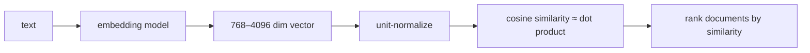

# Embeddings

## TL;DR

- An **embedding** is a fixed-size vector that represents text (or images, audio, anything). Similar inputs get similar vectors. Cosine similarity is the standard distance.
- **Modern dense embeddings**: 768–4096 dimensions, contrastively-trained on hard pairs. Top open models (April 2026): **Nomic Embed v2, BGE-M3, Stella-1.5B, GTE-Qwen2**, all near-frontier OpenAI / Voyage parity.
- **Matryoshka embeddings** can be truncated — a 1024-dim vector still works at 256-dim, just with slightly lower quality. Lets one model serve fast / accurate / storage-cheap variants.
- **Hybrid retrieval (dense + sparse)** beats pure dense or pure BM25 by ~5–10 points NDCG@10 on most retrieval benchmarks. Production pipelines reach for both.
- **Reranking** (a smaller cross-encoder model that scores query/doc pairs) at ~50× the cost per call but ~10× higher precision is the third stage of the 2026 retrieval stack.

## Why this matters

RAG, semantic search, classification, dedup, recommendation — they all run on embeddings. The quality of your retrieval is the ceiling for the quality of your downstream LLM call. Modern embedding models are 10–20% better than they were 18 months ago; switching from "the OpenAI ada-002 model from 2022" to "Nomic Embed v2 from late 2024" is a free quality bump on every retrieval-driven system. **Knowing what's current and how to evaluate matters more than tuning your prompt.**

## Mental model



Embed → unit-normalize → dot-product. The whole game.

## Concrete walkthrough

### What embeddings actually are

Modern text embedding models are encoder transformers (BERT-style or decoder-only fine-tuned). The output is the model's final-layer pooled vector — typically **mean-pooled across tokens**, sometimes the CLS token.

For BGE-M3 / GTE-Qwen2 / Nomic-Embed-v2:
- Input: text (up to 8K tokens for some)
- Architecture: encoder transformer, ~150M–7B params
- Output: a 768–4096 dim float32 vector
- Training: massive contrastive datasets (~1B+ pairs)

The vectors live in a "semantic space" where similar meanings cluster.

### Cosine similarity, in practice

```python
import numpy as np

def cosine(a, b):
    a, b = a / np.linalg.norm(a), b / np.linalg.norm(b)
    return float(a @ b)

# Embed two pieces of text → 768-dim vectors
v1 = embed("the cat sat on the mat")
v2 = embed("a feline was on a rug")
v3 = embed("the stock market crashed")

cosine(v1, v2)   # ~0.85 (similar meaning)
cosine(v1, v3)   # ~0.20 (unrelated)
```

If the embeddings are pre-normalized (most production models normalize at output), cosine similarity collapses to a plain dot product — fast, single-instruction.

### Contrastive training, briefly

The training objective: **anchor + positive + hard negatives**. Anchor: a query. Positive: a relevant document. Hard negatives: documents that look relevant but aren't.

Loss: InfoNCE — maximize `exp(sim(anchor, positive)) / sum(exp(sim(anchor, *)))` across the batch. Small temperature scales the sim. The model learns to push positives close, hard negatives far.

The hard part is mining hard negatives. Random negatives are easy and produce mediocre models. **Hard negatives** — semantically similar but irrelevant docs (often retrieved by a weaker model on the same query) — are what create modern strong embeddings.

### Matryoshka embeddings

Standard embeddings: every dimension contributes equally.

Matryoshka embeddings: trained so that **the first K dimensions are also a usable embedding** for any K. You can truncate without retraining.

```python
v_full = embed(text)              # 1024-dim
v_short = v_full[:256]            # 256-dim, still usable
v_short = v_short / np.linalg.norm(v_short)  # renormalize
```

Why this matters: a 256-dim vector is **4× smaller** in memory and **4× faster** in similarity computation than a 1024-dim. For a vector index with billions of docs, that's the difference between "fits in RAM" and "doesn't."

Matryoshka models published in 2024–2026 (Nomic Embed v2, BGE-M3, Voyage v3): truncate down to 256 with ~3% loss vs full 1024-dim. **Default to using shorter vectors unless you measure a real quality drop.**

### Hybrid retrieval

Dense embeddings capture semantic similarity. **BM25** (sparse, lexical) catches exact-match queries — names, numbers, IDs — that dense models miss.

```python
# Hybrid: combine dense + sparse scores
final_score = alpha * dense_score + (1 - alpha) * bm25_score
# Then sort by final_score; take top K
```

Or use **reciprocal rank fusion (RRF)**:

```python
def rrf(rank_dense, rank_bm25, k=60):
    return 1/(k + rank_dense) + 1/(k + rank_bm25)
```

RRF is parameter-light and robust. Most production stacks use it.

Hybrid retrieval beats pure-dense by **5–10 points NDCG@10** on standard benchmarks (BEIR, MTEB). Free quality.

### Reranking — the third stage

```python
# Stage 1: BM25 retrieves top 100
candidates = bm25_search(query, top=100)

# Stage 2: dense embedding rescores top 100, keeps top 20
dense_scores = [cosine(embed(query), embed(doc)) for doc in candidates]
top20 = sorted(zip(candidates, dense_scores), key=lambda x: -x[1])[:20]

# Stage 3: cross-encoder reranks the top 20, keeps top 5
reranker = CrossEncoder("BAAI/bge-reranker-v2-m3")
final = reranker.rank(query, [doc for doc, _ in top20])[:5]
```

A cross-encoder takes (query, doc) as input together — much more expressive than dot-product, ~50× more compute, ~10× higher precision on the top-K. **Always run on a small candidate pool (top 20–100), not the whole corpus.**

The full three-stage pipeline (BM25 → dense → reranker) is the 2026 standard for high-quality retrieval.

### Picking an embedding model in 2026

The Massive Text Embedding Benchmark (MTEB) leaderboard is the go-to. Top open models:

| Model                           | Dim   | MTEB avg | Notes                                                              |
|---------------------------------|-------|----------|--------------------------------------------------------------------|
| **Nomic Embed v1.5**            | 768   | ~62      | Original Matryoshka; 137M params, MIT-licensed, runs anywhere      |
| **Nomic Embed v2** (MoE)        | 768   | ~64      | 305M-param Mixture-of-Experts; multilingual; v1.5 successor (2025) |
| **BGE-M3**                      | 1024  | ~66      | Multi-functional (dense + sparse + colbert), strong multilingual   |
| **Stella-1.5B-v5**              | 1536  | ~71      | Strong open mid-size; non-Matryoshka                               |
| **GTE-Qwen2-7B-instruct**       | 3584  | ~71      | Highest open MTEB; 7B params, slower / heavier                     |
| Voyage 3 (proprietary)          | 1024  | ~70      | Production API; best ergonomics                                    |
| OpenAI text-embedding-3-large   | 3072  | ~65      | Default cloud option                                               |

(MTEB averages are approximate and shift with the leaderboard; treat as ranking, not absolute.)

**For most products: Nomic Embed v1.5** — 137M params, 768-dim, the model that introduced Matryoshka in this lineage and still the best small-model speed/quality trade-off. Upgrade to **Nomic v2 MoE** if you need multilingual; **BGE-M3** if you need hybrid dense+sparse; **GTE-Qwen2** if you need every last MTEB point.

### When to fine-tune

For domain-specific retrieval (legal, medical, your codebase), an off-the-shelf model still beats a fine-tuned BERT from 2020. But fine-tuning a strong base on domain pairs adds 2–5 MTEB points on the domain. Recipe: take BGE-M3, generate ~10K (query, positive doc) pairs from your domain, fine-tune for 1–2 epochs with InfoNCE. ~$50 in compute.

## Run it in your browser — toy embedding similarity

<RunInBrowser
  description="Use simple TF-IDF as a stand-in (no real embedding model in the browser); demonstrate the cosine-similarity retrieval pattern."
  code={`from collections import Counter
import math

def tokenize(s): return s.lower().split()

def tfidf(docs):
    """Compute TF-IDF vectors for a corpus."""
    vocab = sorted({w for d in docs for w in tokenize(d)})
    df = Counter(w for d in docs for w in set(tokenize(d)))
    n_docs = len(docs)
    vectors = []
    for d in docs:
        tf = Counter(tokenize(d))
        v = []
        for w in vocab:
            tf_v = tf[w] / max(1, len(tokenize(d)))
            idf = math.log(n_docs / (1 + df[w])) + 1
            v.append(tf_v * idf)
        vectors.append(v)
    return vectors, vocab

def cosine(a, b):
    da = math.sqrt(sum(x*x for x in a))
    db = math.sqrt(sum(x*x for x in b))
    if da == 0 or db == 0: return 0.0
    return sum(x*y for x, y in zip(a, b)) / (da * db)

corpus = [
    "the cat sat on the mat",
    "a feline rests on a small rug",
    "stocks crashed after the announcement",
    "the dog chased the ball in the yard",
    "tech company stock surged today",
]

vectors, vocab = tfidf(corpus)

def search(query, top=3):
    q_idx = vectors[corpus.index(query)] if query in corpus else None
    if q_idx is None:
        # Embed the query
        q_tf = Counter(tokenize(query))
        df = Counter(w for d in corpus for w in set(tokenize(d)))
        q_idx = []
        for w in vocab:
            tf = q_tf[w] / max(1, len(tokenize(query)))
            idf = math.log(len(corpus) / (1 + df[w])) + 1
            q_idx.append(tf * idf)
    scored = [(d, cosine(q_idx, v)) for d, v in zip(corpus, vectors)]
    return sorted(scored, key=lambda x: -x[1])[:top]

print("Query: 'pets and animals'")
for doc, score in search("pets and animals"):
    print(f"  {score:.3f}  {doc!r}")
print()
print("Query: 'market news'")
for doc, score in search("market news"):
    print(f"  {score:.3f}  {doc!r}")

print()
print("Real dense embeddings would be far better — they capture 'feline ≈ cat'")
print("which TF-IDF misses entirely. The retrieval pipeline shape is the same.")
`}
/>

The retrieval pattern (embed → cosine → rank) is the same; real dense embeddings just understand semantic similarity at vastly higher fidelity than this toy.

## Quick check

<FillIn
  prompt="The technique that lets an embedding be truncated to lower dimensions without retraining and without major quality loss:"
  answer="Matryoshka"
  accept={["matryoshka", "matryoshka embeddings", "matryoshka representation"]}
  hint="Russian nesting doll — same name."
  explanation="Matryoshka Representation Learning trains so that any prefix of the vector is itself a usable embedding. Lets one model serve fast (256-dim) / accurate (1024-dim) variants without retraining."
/>

<Quiz
  question="A team's RAG pipeline uses pure dense embeddings (Nomic Embed v2). They notice it misses queries with proper nouns (specific names, IDs). Best fix:"
  options={[
    'Train a larger embedding model.',
    'Add BM25 as a parallel retriever; combine via Reciprocal Rank Fusion. Dense for semantics, BM25 for lexical exactness.',
    'Increase the top-K.',
    'Switch from cosine to L2 distance.',
  ]}
  answer={1}
  explanation="Pure dense embeddings systematically miss exact-match queries (names, numeric IDs, codes). BM25 catches them. Hybrid retrieval (dense + BM25 with RRF) typically adds 5–10 NDCG points on real-world queries that mix semantic and lexical needs. The 2026 production default for any retrieval-quality-sensitive product."
/>

## Key takeaways

1. **Embeddings = unit-normalized fixed-size vectors. Cosine similarity is the metric.**
2. **Modern open models (Nomic Embed v2, BGE-M3, GTE-Qwen2)** are MTEB-frontier — beat OpenAI ada-002 by 10+ points.
3. **Matryoshka embeddings** let you truncate to 256-dim with ~3% loss; 4× memory + speed savings.
4. **Hybrid retrieval (dense + BM25 via RRF)** beats either alone by 5–10 NDCG points.
5. **Three-stage retrieval**: BM25 → dense → cross-encoder reranker. The 2026 production default.

## Go deeper

<Resources
  items={[
    { kind: 'docs', href: 'https://huggingface.co/spaces/mteb/leaderboard', title: 'MTEB Leaderboard', note: 'Live ranking of every embedding model. Sort by your task type.' },
    { kind: 'paper', href: 'https://arxiv.org/abs/2205.13147', title: 'Matryoshka Representation Learning', author: 'Kusupati et al., 2022', note: 'The original MRL paper. Section 3 has the truncation math.' },
    { kind: 'paper', href: 'https://arxiv.org/abs/2402.03216', title: 'BGE-M3: Multi-Functional Multi-Lingual Multi-Granularity Text Embeddings', author: 'Chen et al., 2024', note: 'Best-of-class open embedding paper; sections on hybrid retrieval are essential.' },
    { kind: 'blog', href: 'https://www.nomic.ai/blog/posts/nomic-embed-text-v2', title: 'Nomic — Nomic Embed v2', note: 'Production-grade open embedding with Matryoshka. The launch post explains the design tradeoffs.' },
    { kind: 'docs', href: 'https://www.sbert.net/', title: 'sentence-transformers Documentation', note: 'The standard library for embeddings + cross-encoders. The "Semantic Search" + "Cross-Encoder" sections are required reading.' },
    { kind: 'paper', href: 'https://arxiv.org/abs/2104.08663', title: 'BEIR Benchmark', author: 'Thakur et al., 2021', note: 'The retrieval evaluation framework. Useful for understanding the tasks behind MTEB.' },
    { kind: 'repo', href: 'https://github.com/UKPLab/sentence-transformers', title: 'UKPLab/sentence-transformers', note: 'Reference for the framework most production retrieval uses.' },
  ]}
/>

<LessonComplete />
