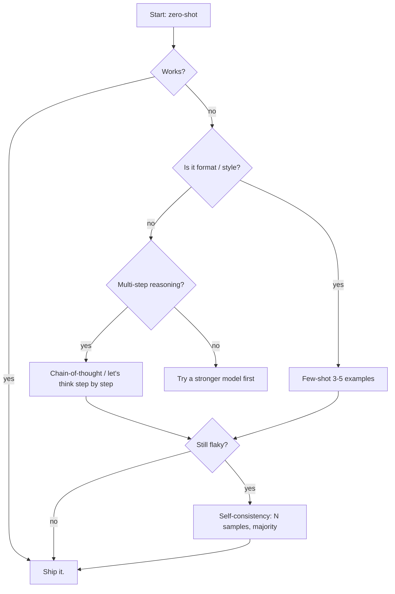

# Prompt Engineering Foundations

## TL;DR

- **Zero-shot is the default.** Add complexity only when the model fails — every extra technique is more tokens, more cost, more places to fail.
- **Few-shot** locks in format and style. It can also lock in *errors* if your examples are wrong; a bad few-shot is worse than zero-shot.
- **Chain-of-thought** helps on multi-step problems (math, planning) and *hurts* on simple classification. Not a free lunch.
- **Self-consistency** = sample N CoT reasonings, take the majority answer. Genuinely better on reasoning tasks; N× cost.
- **Structured output** (JSON mode, Pydantic, Outlines) is how you build real systems. Always prefer schema-validated output over regex.

## Why this matters

Prompting is the cheapest, fastest lever you have. A good prompt is often the difference between a 60% and 90% task accuracy with the *same* model — no fine-tuning, no infrastructure, just words. But there's a cottage industry of prompt advice that's pure superstition. This lesson covers the techniques that actually move the metric, with measurements.

## Mental model

Each technique is a tradeoff between **cost** (tokens, latency, $) and **task fit**. Here's the order I reach for them:



## Concrete walkthrough

The four techniques, written out:

```python
# 1. Zero-shot — the default.
prompt = "Classify the sentiment of this review: 'Great battery, terrible camera.'"

# 2. Few-shot — add 2-5 examples.
prompt = """Review: 'Loved the build, hated the price.'  Sentiment: mixed
Review: 'Best phone I've owned.'                          Sentiment: positive
Review: 'Battery dies in 4 hours.'                        Sentiment: negative
Review: 'Great battery, terrible camera.'                 Sentiment:"""

# 3. Chain-of-thought — ask for reasoning before the answer.
prompt = """Q: A train leaves Boston at 60 mph. Another leaves NYC at 80 mph
toward each other. They're 200 miles apart. When do they meet?
Let's think step by step."""

# 4. Self-consistency — sample N reasonings, vote on the answer.
answers = [model(prompt, temperature=0.7) for _ in range(8)]
final = most_common([extract_answer(a) for a in answers])
```

**Real numbers** (from the GSM8K math benchmark, roughly):

| Technique         | GPT-4o-mini accuracy | Tokens / Q | Cost @ $0.15/1M |
| ----------------- | -------------------- | ---------- | --------------- |
| Zero-shot         | 76%                  | 200        | 1×              |
| 5-shot            | 79%                  | 600        | 3×              |
| Zero-shot CoT     | 88%                  | 400        | 2×              |
| Self-consistency (n=5) | **92%**          | 2000       | 10×             |

CoT triples accuracy on reasoning. Self-consistency adds another point at 5× the cost — sometimes worth it, often not.

**Counterexample.** On a simple sentiment classifier, zero-shot CoT can *hurt* — the model talks itself into wrong answers. CoT is for tasks where the model needs to *do* reasoning, not where it already knows the answer.

## Run it in your browser

A direct comparison you can run right now. (No API key — this is a deterministic local stand-in for how the techniques read; for real model calls use the Colab below.)

<RunInBrowser
  description="Compare prompt structures side-by-side."
  code={`question = "A pen costs $1.50 and a notebook costs $4.20. How much is 3 pens and 2 notebooks?"

zero_shot = f"Q: {question}\\nA:"

few_shot = (
    "Q: A pen costs $1 and a notebook costs $3. Cost of 2 pens and 1 notebook?\\n"
    "A: 2*1 + 1*3 = $5\\n\\n"
    f"Q: {question}\\nA:"
)

cot = f"Q: {question}\\nLet's think step by step.\\nA:"

for label, p in [("zero-shot", zero_shot), ("few-shot", few_shot), ("CoT", cot)]:
    tokens = len(p.split())  # rough
    print(f"--- {label} ({tokens} tokens) ---")
    print(p)
    print()
`}
/>

## Run it on real hardware

<ColabLink
  href="https://colab.research.google.com/github/your-github/mosaic-notebooks/blob/main/prompting.ipynb"
  description="Hits the Anthropic API on 50 GSM8K problems with all 4 techniques. Logs accuracy + cost. Free to run; ~$0.02 in API credits."
/>

## Quick check

<Quiz
  question="You're building a sentiment classifier for short reviews. Zero-shot scores 87%. You add 'Let's think step by step' — accuracy drops to 82%. What's most likely happening?"
  options={[
    'The model is undertrained on short reviews.',
    'CoT is causing the model to over-reason on a task that doesn\'t need it; remove it.',
    'You need more few-shot examples first.',
    'You should switch to a larger model.',
  ]}
  answer={1}
  explanation="CoT is for tasks where the model needs to *do* multi-step reasoning to find the answer. On a short classification, it gives the model room to second-guess and confuse itself. Drop it."
/>

## Key takeaways

1. **Climb the ladder of complexity only when needed.** Zero-shot → few-shot → CoT → self-consistency. Each step adds cost.
2. **CoT is for reasoning, not classification.** Test before assuming it helps.
3. **Few-shot examples must be correct.** A wrong example actively poisons the output.
4. **Always validate structured output with a schema.** Don't `json.loads` and pray.
5. **Measure on a real eval set.** Vibes-based prompt tuning is how teams ship regressions.

## Go deeper

<Resources
  items={[
    { kind: 'paper', href: 'https://arxiv.org/abs/2201.11903', title: 'Chain-of-Thought Prompting Elicits Reasoning in LLMs', author: 'Wei et al., 2022', note: 'The original CoT paper. Short, foundational, still cited daily.' },
    { kind: 'paper', href: 'https://arxiv.org/abs/2203.11171', title: 'Self-Consistency Improves Chain-of-Thought Reasoning', author: 'Wang et al., 2022', note: 'The math behind why majority-vote CoT works.' },
    { kind: 'docs', href: 'https://docs.anthropic.com/en/docs/build-with-claude/prompt-engineering/overview', title: 'Anthropic — Prompt Engineering Overview', note: 'The most opinionated current guide; written by people who actually train these models.' },
    { kind: 'video', href: 'https://www.youtube.com/watch?v=7xTGNNLPyMI', title: 'Karpathy — Deep Dive into LLMs like ChatGPT', author: 'Andrej Karpathy', note: '3-hour deep dive. The prompting section is the best 30 minutes you can spend on the topic.' },
    { kind: 'blog', href: 'https://www.promptingguide.ai/', title: 'Prompt Engineering Guide', note: 'The most comprehensive open survey. Use as a reference, not a manifesto.' },
  ]}
/>

<LessonComplete />
