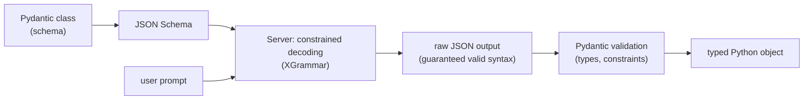

# Structured Output

<Mode is="learn">

> **Prereq:** [Structured Output (LLM Architecture)](../../llm-architecture/inference-time/structured-output) covers what the model does. This lesson covers what you do as the application engineer.

When you write `response_format=Movie` on an OpenAI client call — handing the SDK a Pydantic class and getting back a parsed `Movie` instance — three separate pieces of machinery line up to make that work. The class becomes a JSON Schema. The schema goes to a server that compiles it into a finite-state machine and uses <Term name="constrained decoding">constrained decoding</Term> to mask logits during generation, so the model literally cannot emit malformed JSON. The bytes come back as text, get parsed into a dict, then run through Pydantic's runtime validation to catch anything semantically off — `year=1850` when you said `Field(ge=1900)`.

This is the applied/engineer-side complement to the [LLM-architecture lesson on structured output](../../llm-architecture/inference-time/structured-output) — that one is what the model is doing under the hood; this one is the production stack you sit on top of it. Pre-2024 the standard solution was "ask nicely + try/except + retry." That works at 90% reliability and breaks scaling. Modern stacks make 100% structural correctness *the default* — schema in, validated object out, no retries. **Knowing the layered architecture is what lets you build agents that don't fall over.**

## TL;DR

- Reliable structured output requires three layers: **schema definition** (Pydantic / TypeBox / Zod) → **constrained decoding on the server** (XGrammar, Outlines) → **validation + retry on the client** (Instructor, structured-outputs APIs).
- **Pydantic is the universal frontend.** Define your schema as a Python class; libraries (instructor, openai's `response_format`, anthropic's tool-use, vllm) consume it directly.
- **The server doing constrained decoding is what matters most.** Without it, you're trusting the model to produce valid JSON ~95% of the time, retrying the rest. With it, output is guaranteed.
- For 2026 production: vLLM v1 / SGLang / TensorRT-LLM ship XGrammar; OpenAI / Anthropic APIs enforce schemas natively. **Default to `response_format=PydanticClass`; don't roll your own JSON parsing.**
- Schemas should be **simple, flat, well-named**. Deeply-nested schemas with many enums confuse small models; LLM-friendly schemas align with how training data was shaped.

## Mental model



Three checkpoints — schema, decoding, validation. Get one right and you're at 95%; all three and you're at 100%.

## Pydantic + an LLM API

```python
from pydantic import BaseModel
from openai import OpenAI

class MovieRecommendation(BaseModel):
    title: str
    year: int
    rating: float
    reasoning: str

client = OpenAI()
response = client.beta.chat.completions.parse(
    model="gpt-4o",
    messages=[{"role": "user", "content": "Pick a movie for someone who liked Inception."}],
    response_format=MovieRecommendation,
)

movie: MovieRecommendation = response.choices[0].message.parsed
print(movie.title, movie.rating)
```

`response_format=MovieRecommendation` does three things: extracts the JSON Schema, sends it to the API, the API enforces it via constrained decoding, and the result is validated + parsed into the Pydantic instance. **No try/except, no retry.**

## Anthropic's tool-use shape

```python
import anthropic
from pydantic import BaseModel

class MovieRecommendation(BaseModel):
    title: str
    year: int
    rating: float

client = anthropic.Anthropic()
response = client.messages.create(
    model="claude-sonnet-4",
    max_tokens=1024,
    tools=[{
        "name": "recommend_movie",
        "description": "Recommend a movie",
        "input_schema": MovieRecommendation.model_json_schema(),
    }],
    tool_choice={"type": "tool", "name": "recommend_movie"},
    messages=[{"role": "user", "content": "Pick a movie for someone who liked Inception."}],
)

# Result is in response.content[0].input as a dict
movie = MovieRecommendation.model_validate(response.content[0].input)
```

Different surface, same machinery. The "tool" is actually a way to specify "force the model to produce output matching this schema."

## Instructor — the universal wrapper

[Instructor](https://github.com/jxnl/instructor) wraps every major LLM API behind one Pydantic-first interface:

```python
import instructor
from openai import OpenAI
from pydantic import BaseModel

client = instructor.from_openai(OpenAI())

class Movie(BaseModel):
    title: str
    year: int

movie = client.chat.completions.create(
    model="gpt-4o",
    response_model=Movie,
    messages=[...],
)
# movie is a Movie instance — already parsed and validated
```

Same code works against Anthropic, Cohere, Google, Mistral, locally-served vLLM/SGLang/llama.cpp. Instructor handles the API-specific shape; you write Pydantic.

## vLLM-side enforcement

When self-hosting:

```python
from vllm import LLM, SamplingParams
from outlines.serve.vllm import RegexLogitsProcessor, JSONLogitsProcessor

llm = LLM(model="meta-llama/Llama-3.3-70B-Instruct")

class Movie(BaseModel):
    title: str
    year: int

processor = JSONLogitsProcessor(Movie, llm.get_tokenizer())
params = SamplingParams(logits_processors=[processor], temperature=0.7)
out = llm.generate(prompts, params)
# out[0].outputs[0].text is guaranteed JSON matching Movie
```

vLLM v1 ships XGrammar as the default constrained-decoding backend; the same `response_format` shape from OpenAI works against vLLM with a v1+ engine config flag.

## Schema design — what works and what doesn't

**Works:**

```python
class Order(BaseModel):
    customer_name: str
    items: list[str]
    total_usd: float
    shipping_address: str
```

Flat, descriptive names, simple types. Models produce this at 99%+ reliability.

**Hurts:**

```python
class Address(BaseModel):
    street: str
    city: str
    state: str
    zip: str

class CustomerProfile(BaseModel):
    name: str
    addresses: dict[str, Address]   # nested with arbitrary keys
    preferences: list[dict[str, list[str]]]   # nested unstructured
```

Deeply-nested schemas with arbitrary keys and `dict[str, ...]` are doable but reduce reliability. Small models (≤7B) really struggle. **Flatten when you can.**

**Helpful**: rich descriptions:

```python
class Movie(BaseModel):
    title: str = Field(description="The movie title, in English")
    year: int = Field(description="Release year between 1900 and 2026")
    rating: float = Field(ge=0, le=10, description="Critic rating from 0 to 10")
```

Descriptions get into the JSON Schema and into the model's context. Small models especially benefit.

## Retry on validation failure (the rare case)

Even with constrained decoding, **semantic validation can fail** — the JSON is structurally valid but `year` is 1850 (out of your `Field(ge=1900)` range). For these:

```python
import instructor
from openai import OpenAI
from pydantic import BaseModel, Field

client = instructor.from_openai(OpenAI())

class Movie(BaseModel):
    year: int = Field(ge=1900, le=2026)

movie = client.chat.completions.create(
    model="gpt-4o",
    response_model=Movie,
    max_retries=3,            # instructor handles validation-failure retries
    messages=[...],
)
```

`max_retries=3` automatically re-prompts the model with the validation error on failure. Typically a 2nd attempt succeeds. Clean integration with Pydantic validation rules.

## Streaming structured output

A long Pydantic object can be streamed:

```python
from instructor import partial
from pydantic import BaseModel

class StoryReview(BaseModel):
    title: str
    summary: str
    rating: int
    pros: list[str]
    cons: list[str]

partial_review = client.chat.completions.create_partial(
    model="gpt-4o",
    response_model=StoryReview,
    messages=[...],
)
async for delta in partial_review:
    print(delta)             # incrementally-filled StoryReview as it generates
```

Each yield is a partial Pydantic instance with as many fields as have been generated so far. Useful for UIs that want to show fields as they fill in.

## When NOT to use structured output

For the model's **reasoning trace** (R1-style, o-series), don't constrain — that hurts quality. Constrain only the *final answer* extraction. The two-pass pattern:

```python
# Pass 1: free-form reasoning
reasoning = client.chat.completions.create(model="o3", messages=[...])

# Pass 2: structured extraction from the reasoning
final = client.beta.chat.completions.parse(
    model="gpt-4o",
    response_format=Answer,
    messages=[..., {"role": "assistant", "content": reasoning.content}],
)
```

This gives you the best of both: free reasoning, structured deliverable. Default for any reasoning-heavy product.

## Run it in your browser — schema-shaped JSON validator

<RunInBrowser
  description="Hand-rolled validator with the same shape as Pydantic — no library dependency."
  code={`# Real production: from pydantic import BaseModel, Field, ValidationError
# Toy version below has identical shape.

class ValidationError(Exception): pass

def validate_movie(d):
    """Validate a dict against the Movie schema."""
    if not isinstance(d, dict):
        raise ValidationError(f"expected dict, got {type(d).__name__}")
    for field in ('title', 'year', 'rating', 'reasoning'):
        if field not in d:
            raise ValidationError(f"missing field: {field!r}")
    if not isinstance(d['title'], str):
        raise ValidationError(f"title must be str, got {type(d['title']).__name__}")
    if not isinstance(d['year'], int):
        raise ValidationError(f"year must be int, got {type(d['year']).__name__}")
    if not (1900 <= d['year'] <= 2026):
        raise ValidationError(f"year must be 1900-2026, got {d['year']}")
    if not isinstance(d['rating'], (int, float)):
        raise ValidationError(f"rating must be number, got {type(d['rating']).__name__}")
    if not (0.0 <= d['rating'] <= 10.0):
        raise ValidationError(f"rating must be 0-10, got {d['rating']}")
    return d   # Pydantic returns a typed instance; this returns the dict

candidates = [
    {"title": "Inception", "year": 2010, "rating": 8.8, "reasoning": "Mind-bending sci-fi heist."},
    {"title": "Old Movie", "year": 1850, "rating": 7.0, "reasoning": "Pretend this is real."},
    {"title": "Incomplete", "year": 2024, "rating": 9.0},
    {"title": "Bad Type", "year": "not_a_number", "rating": 8.0, "reasoning": "..."},
]

for i, c in enumerate(candidates, 1):
    try:
        m = validate_movie(c)
        print(f"{i}. OK : {m['title']} ({m['year']})")
    except ValidationError as e:
        print(f"{i}. FAIL: {e}")

print()
print("In production:")
print("  - Constrained decoding eliminates failure modes 3 and 4 (structural).")
print("  - Pydantic validation catches failure mode 2 (semantic).")
print("  - max_retries auto-prompts the model with the validation error.")
`}
/>

The pipeline shape — schema → JSON → validate → retry on semantic-only failures — is the entire structured-output stack in miniature.

## Quick check

<FillIn
  prompt="The Python library that wraps every major LLM API behind a Pydantic-first interface (response_model=YourClass):"
  answer="instructor"
  accept={["Instructor", "jxnl/instructor"]}
  hint="Single word; named after the role of guiding the LLM."
  explanation="Instructor wraps OpenAI, Anthropic, Cohere, Google, Mistral, vLLM, llama.cpp, and more behind one API. The de facto standard for production-grade Pydantic-driven structured output."
/>

<Quiz
  question="A team's chat product needs to output recommendations as structured JSON. They prompt 'respond in JSON' and parse with json.loads. ~5% of responses fail. Best fix:"
  options={[
    'Add 5 retry attempts.',
    'Switch to a server with constrained decoding (vLLM v1 + XGrammar, or use OpenAI/Anthropic with response_format / tools).',
    'Train a custom model.',
    'Increase temperature.',
  ]}
  answer={1}
  explanation="Constrained decoding turns 5% structural failures into 0%. Retry-on-failure works at small scale but is wasted compute and bad UX at any meaningful traffic. The 2026 production answer is server-side enforcement: response_format on hosted APIs, XGrammar / Outlines on self-hosted."
/>

## Key takeaways

1. **Three layers: Pydantic schema → constrained decoding → Pydantic validation.**
2. **`response_format=PydanticClass`** is the canonical OpenAI shape; `tools=[...]` is Anthropic's; **Instructor unifies them.**
3. **Schema design matters**: flat, descriptive, with `Field(description=...)`. Avoid deep nesting and arbitrary dict keys.
4. **Don't constrain reasoning traces**; constrain only the final-answer extraction step.
5. **Streaming partial Pydantic objects** is supported by Instructor — great for progressive UIs.

## Go deeper

<Resources
  items={[
    { kind: 'docs', href: 'https://platform.openai.com/docs/guides/structured-outputs', title: 'OpenAI — Structured Outputs', note: 'Authoritative on response_format. The "Schema" requirements section is essential.' },
    { kind: 'docs', href: 'https://docs.anthropic.com/en/docs/build-with-claude/tool-use', title: 'Anthropic — Tool Use', note: 'How Claude does structured output via the tools shape.' },
    { kind: 'docs', href: 'https://python.useinstructor.com/', title: 'Instructor Documentation', note: 'The Pydantic-first wrapper around every LLM API. The "Production-Grade" section covers retries and streaming.' },
    { kind: 'docs', href: 'https://docs.pydantic.dev/latest/', title: 'Pydantic v2 Documentation', note: 'The schema layer. The "Models" + "Fields" pages cover everything you need.' },
    { kind: 'docs', href: 'https://docs.vllm.ai/en/latest/features/structured_outputs.html', title: 'vLLM — Structured Outputs', note: 'Server-side flag for XGrammar; production knobs.' },
    { kind: 'repo', href: 'https://github.com/jxnl/instructor', title: 'jxnl/instructor', note: 'The library. Read examples/ for production patterns.' },
    { kind: 'repo', href: 'https://github.com/dottxt-ai/outlines', title: 'dottxt-ai/outlines', note: 'The original FSM-based constrained-decoding library; still widely used.' },
  ]}
/>

</Mode>

<Mode is="reference">

> **Prereq:** [Structured Output (LLM Architecture)](../../llm-architecture/inference-time/structured-output) covers what the model does. This lesson covers what you do as the application engineer.

## TL;DR

- Reliable structured output requires three layers: **schema definition** (Pydantic / TypeBox / Zod) → **constrained decoding on the server** (XGrammar, Outlines) → **validation + retry on the client** (Instructor, structured-outputs APIs).
- **Pydantic is the universal frontend.** Define your schema as a Python class; libraries (instructor, openai's `response_format`, anthropic's tool-use, vllm) consume it directly.
- **The server doing constrained decoding is what matters most.** Without it, you're trusting the model to produce valid JSON ~95% of the time, retrying the rest. With it, output is guaranteed.
- For 2026 production: vLLM v1 / SGLang / TensorRT-LLM ship XGrammar; OpenAI / Anthropic APIs enforce schemas natively. **Default to `response_format=PydanticClass`; don't roll your own JSON parsing.**
- Schemas should be **simple, flat, well-named**. Deeply-nested schemas with many enums confuse small models; LLM-friendly schemas align with how training data was shaped.

## Why this matters

Every agent / tool-use / RAG-with-citations / data-extraction product needs structured output. Pre-2024 the standard solution was "ask nicely + try/except + retry." That works at 90% reliability and breaks scaling. Modern stacks make 100% structural correctness *the default* — schema in, validated object out, no retries. **Knowing the layered architecture is what lets you build agents that don't fall over.**

## Mental model


Three checkpoints — schema, decoding, validation. Get one right and you're at 95%; all three and you're at 100%.

## Concrete walkthrough

### Pydantic + an LLM API

```python
from pydantic import BaseModel
from openai import OpenAI

class MovieRecommendation(BaseModel):
    title: str
    year: int
    rating: float
    reasoning: str

client = OpenAI()
response = client.beta.chat.completions.parse(
    model="gpt-4o",
    messages=[{"role": "user", "content": "Pick a movie for someone who liked Inception."}],
    response_format=MovieRecommendation,
)

movie: MovieRecommendation = response.choices[0].message.parsed
print(movie.title, movie.rating)
```

`response_format=MovieRecommendation` does three things: extracts the JSON Schema, sends it to the API, the API enforces it via constrained decoding, and the result is validated + parsed into the Pydantic instance. **No try/except, no retry.**

### Anthropic's tool-use shape

```python
import anthropic
from pydantic import BaseModel

class MovieRecommendation(BaseModel):
    title: str
    year: int
    rating: float

client = anthropic.Anthropic()
response = client.messages.create(
    model="claude-sonnet-4",
    max_tokens=1024,
    tools=[{
        "name": "recommend_movie",
        "description": "Recommend a movie",
        "input_schema": MovieRecommendation.model_json_schema(),
    }],
    tool_choice={"type": "tool", "name": "recommend_movie"},
    messages=[{"role": "user", "content": "Pick a movie for someone who liked Inception."}],
)

# Result is in response.content[0].input as a dict
movie = MovieRecommendation.model_validate(response.content[0].input)
```

Different surface, same machinery. The "tool" is actually a way to specify "force the model to produce output matching this schema."

### Instructor — the universal wrapper

[Instructor](https://github.com/jxnl/instructor) wraps every major LLM API behind one Pydantic-first interface:

```python
import instructor
from openai import OpenAI
from pydantic import BaseModel

client = instructor.from_openai(OpenAI())

class Movie(BaseModel):
    title: str
    year: int

movie = client.chat.completions.create(
    model="gpt-4o",
    response_model=Movie,
    messages=[...],
)
# movie is a Movie instance — already parsed and validated
```

Same code works against Anthropic, Cohere, Google, Mistral, locally-served vLLM/SGLang/llama.cpp. Instructor handles the API-specific shape; you write Pydantic.

### vLLM-side enforcement

When self-hosting:

```python
from vllm import LLM, SamplingParams
from outlines.serve.vllm import RegexLogitsProcessor, JSONLogitsProcessor

llm = LLM(model="meta-llama/Llama-3.3-70B-Instruct")

class Movie(BaseModel):
    title: str
    year: int

processor = JSONLogitsProcessor(Movie, llm.get_tokenizer())
params = SamplingParams(logits_processors=[processor], temperature=0.7)
out = llm.generate(prompts, params)
# out[0].outputs[0].text is guaranteed JSON matching Movie
```

vLLM v1 ships XGrammar as the default constrained-decoding backend; the same `response_format` shape from OpenAI works against vLLM with a v1+ engine config flag.

### Schema design — what works and what doesn't

**Works:**

```python
class Order(BaseModel):
    customer_name: str
    items: list[str]
    total_usd: float
    shipping_address: str
```

Flat, descriptive names, simple types. Models produce this at 99%+ reliability.

**Hurts:**

```python
class Address(BaseModel):
    street: str
    city: str
    state: str
    zip: str

class CustomerProfile(BaseModel):
    name: str
    addresses: dict[str, Address]   # nested with arbitrary keys
    preferences: list[dict[str, list[str]]]   # nested unstructured
```

Deeply-nested schemas with arbitrary keys and `dict[str, ...]` are doable but reduce reliability. Small models (≤7B) really struggle. **Flatten when you can.**

**Helpful**: rich descriptions:

```python
class Movie(BaseModel):
    title: str = Field(description="The movie title, in English")
    year: int = Field(description="Release year between 1900 and 2026")
    rating: float = Field(ge=0, le=10, description="Critic rating from 0 to 10")
```

Descriptions get into the JSON Schema and into the model's context. Small models especially benefit.

### Retry on validation failure (the rare case)

Even with constrained decoding, **semantic validation can fail** — the JSON is structurally valid but `year` is 1850 (out of your `Field(ge=1900)` range). For these:

```python
import instructor
from openai import OpenAI
from pydantic import BaseModel, Field

client = instructor.from_openai(OpenAI())

class Movie(BaseModel):
    year: int = Field(ge=1900, le=2026)

movie = client.chat.completions.create(
    model="gpt-4o",
    response_model=Movie,
    max_retries=3,            # instructor handles validation-failure retries
    messages=[...],
)
```

`max_retries=3` automatically re-prompts the model with the validation error on failure. Typically a 2nd attempt succeeds. Clean integration with Pydantic validation rules.

### Streaming structured output

A long Pydantic object can be streamed:

```python
from instructor import partial
from pydantic import BaseModel

class StoryReview(BaseModel):
    title: str
    summary: str
    rating: int
    pros: list[str]
    cons: list[str]

partial_review = client.chat.completions.create_partial(
    model="gpt-4o",
    response_model=StoryReview,
    messages=[...],
)
async for delta in partial_review:
    print(delta)             # incrementally-filled StoryReview as it generates
```

Each yield is a partial Pydantic instance with as many fields as have been generated so far. Useful for UIs that want to show fields as they fill in.

### When NOT to use structured output

For the model's **reasoning trace** (R1-style, o-series), don't constrain — that hurts quality. Constrain only the *final answer* extraction. The two-pass pattern:

```python
# Pass 1: free-form reasoning
reasoning = client.chat.completions.create(model="o3", messages=[...])

# Pass 2: structured extraction from the reasoning
final = client.beta.chat.completions.parse(
    model="gpt-4o",
    response_format=Answer,
    messages=[..., {"role": "assistant", "content": reasoning.content}],
)
```

This gives you the best of both: free reasoning, structured deliverable. Default for any reasoning-heavy product.

## Run it in your browser — schema-shaped JSON validator

<RunInBrowser
  description="Hand-rolled validator with the same shape as Pydantic — no library dependency."
  code={`# Real production: from pydantic import BaseModel, Field, ValidationError
# Toy version below has identical shape.

class ValidationError(Exception): pass

def validate_movie(d):
    """Validate a dict against the Movie schema."""
    if not isinstance(d, dict):
        raise ValidationError(f"expected dict, got {type(d).__name__}")
    for field in ('title', 'year', 'rating', 'reasoning'):
        if field not in d:
            raise ValidationError(f"missing field: {field!r}")
    if not isinstance(d['title'], str):
        raise ValidationError(f"title must be str, got {type(d['title']).__name__}")
    if not isinstance(d['year'], int):
        raise ValidationError(f"year must be int, got {type(d['year']).__name__}")
    if not (1900 <= d['year'] <= 2026):
        raise ValidationError(f"year must be 1900-2026, got {d['year']}")
    if not isinstance(d['rating'], (int, float)):
        raise ValidationError(f"rating must be number, got {type(d['rating']).__name__}")
    if not (0.0 <= d['rating'] <= 10.0):
        raise ValidationError(f"rating must be 0-10, got {d['rating']}")
    return d   # Pydantic returns a typed instance; this returns the dict

candidates = [
    {"title": "Inception", "year": 2010, "rating": 8.8, "reasoning": "Mind-bending sci-fi heist."},
    {"title": "Old Movie", "year": 1850, "rating": 7.0, "reasoning": "Pretend this is real."},
    {"title": "Incomplete", "year": 2024, "rating": 9.0},
    {"title": "Bad Type", "year": "not_a_number", "rating": 8.0, "reasoning": "..."},
]

for i, c in enumerate(candidates, 1):
    try:
        m = validate_movie(c)
        print(f"{i}. OK : {m['title']} ({m['year']})")
    except ValidationError as e:
        print(f"{i}. FAIL: {e}")

print()
print("In production:")
print("  - Constrained decoding eliminates failure modes 3 and 4 (structural).")
print("  - Pydantic validation catches failure mode 2 (semantic).")
print("  - max_retries auto-prompts the model with the validation error.")
`}
/>

The pipeline shape — schema → JSON → validate → retry on semantic-only failures — is the entire structured-output stack in miniature.

## Quick check

<FillIn
  prompt="The Python library that wraps every major LLM API behind a Pydantic-first interface (response_model=YourClass):"
  answer="instructor"
  accept={["Instructor", "jxnl/instructor"]}
  hint="Single word; named after the role of guiding the LLM."
  explanation="Instructor wraps OpenAI, Anthropic, Cohere, Google, Mistral, vLLM, llama.cpp, and more behind one API. The de facto standard for production-grade Pydantic-driven structured output."
/>

<Quiz
  question="A team's chat product needs to output recommendations as structured JSON. They prompt 'respond in JSON' and parse with json.loads. ~5% of responses fail. Best fix:"
  options={[
    'Add 5 retry attempts.',
    'Switch to a server with constrained decoding (vLLM v1 + XGrammar, or use OpenAI/Anthropic with response_format / tools).',
    'Train a custom model.',
    'Increase temperature.',
  ]}
  answer={1}
  explanation="Constrained decoding turns 5% structural failures into 0%. Retry-on-failure works at small scale but is wasted compute and bad UX at any meaningful traffic. The 2026 production answer is server-side enforcement: response_format on hosted APIs, XGrammar / Outlines on self-hosted."
/>

## Key takeaways

1. **Three layers: Pydantic schema → constrained decoding → Pydantic validation.**
2. **`response_format=PydanticClass`** is the canonical OpenAI shape; `tools=[...]` is Anthropic's; **Instructor unifies them.**
3. **Schema design matters**: flat, descriptive, with `Field(description=...)`. Avoid deep nesting and arbitrary dict keys.
4. **Don't constrain reasoning traces**; constrain only the final-answer extraction step.
5. **Streaming partial Pydantic objects** is supported by Instructor — great for progressive UIs.

## Go deeper

<Resources
  items={[
    { kind: 'docs', href: 'https://platform.openai.com/docs/guides/structured-outputs', title: 'OpenAI — Structured Outputs', note: 'Authoritative on response_format. The "Schema" requirements section is essential.' },
    { kind: 'docs', href: 'https://docs.anthropic.com/en/docs/build-with-claude/tool-use', title: 'Anthropic — Tool Use', note: 'How Claude does structured output via the tools shape.' },
    { kind: 'docs', href: 'https://python.useinstructor.com/', title: 'Instructor Documentation', note: 'The Pydantic-first wrapper around every LLM API. The "Production-Grade" section covers retries and streaming.' },
    { kind: 'docs', href: 'https://docs.pydantic.dev/latest/', title: 'Pydantic v2 Documentation', note: 'The schema layer. The "Models" + "Fields" pages cover everything you need.' },
    { kind: 'docs', href: 'https://docs.vllm.ai/en/latest/features/structured_outputs.html', title: 'vLLM — Structured Outputs', note: 'Server-side flag for XGrammar; production knobs.' },
    { kind: 'repo', href: 'https://github.com/jxnl/instructor', title: 'jxnl/instructor', note: 'The library. Read examples/ for production patterns.' },
    { kind: 'repo', href: 'https://github.com/dottxt-ai/outlines', title: 'dottxt-ai/outlines', note: 'The original FSM-based constrained-decoding library; still widely used.' },
  ]}
/>

</Mode>

<LessonComplete />
