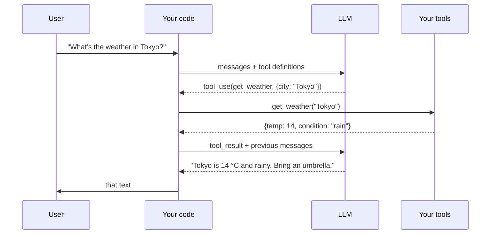

# Function Calling & Tool Use

## TL;DR

- **Tool use is structured output where the model picks a tool name and fills typed arguments.** The model never executes — your code does, then feeds the result back.
- **Modern API schemas (Anthropic, OpenAI) are nearly identical:** define tools with JSON Schema, the model returns `tool_use` blocks with name + arguments.
- **The loop:** user message → model returns tool calls → your code runs them → feed `tool_result` back → model produces the final answer (or another tool call).
- **Parallel tool calls** are now the default: a model can request 3 tools in one turn. Run them in parallel; latency drops by N.
- **Failure modes:** hallucinated tool names (rare on frontier models, common on small ones); coercing string args to numbers (always validate); infinite tool loops (set `max_steps`).

## Why this matters

Tool use is what turns a chat model into an *agent*. Without it, an LLM is a text generator with a knowledge cutoff. With it, it's a system that can search the web, run Python, query a database, or do anything you give it a function for. Every meaningful AI product in 2026 is a wrapper around tool use.

## Mental model



The LLM never has direct access to your tools. It produces a typed *request*; your code routes it.

## Concrete walkthrough — a 3-tool weather assistant

Define the tools as JSON Schema:

```python
tools = [
    {
        "name": "get_current_weather",
        "description": "Get the current weather conditions for a city.",
        "input_schema": {
            "type": "object",
            "properties": {
                "city": {"type": "string", "description": "City name, e.g., 'Tokyo'"},
                "units": {"type": "string", "enum": ["celsius", "fahrenheit"], "default": "celsius"},
            },
            "required": ["city"],
        },
    },
    {
        "name": "get_forecast",
        "description": "Get a 5-day forecast for a city.",
        "input_schema": {
            "type": "object",
            "properties": {
                "city": {"type": "string"},
                "days": {"type": "integer", "minimum": 1, "maximum": 5, "default": 3},
            },
            "required": ["city"],
        },
    },
    {
        "name": "convert_units",
        "description": "Convert temperature between Celsius and Fahrenheit.",
        "input_schema": {
            "type": "object",
            "properties": {
                "value": {"type": "number"},
                "from_unit": {"type": "string", "enum": ["celsius", "fahrenheit"]},
                "to_unit": {"type": "string", "enum": ["celsius", "fahrenheit"]},
            },
            "required": ["value", "from_unit", "to_unit"],
        },
    },
]
```

Implement the tools in plain Python:

```python
def get_current_weather(city: str, units: str = "celsius") -> dict:
    # In a real app, hit a weather API. This is a stand-in.
    fake_db = {"Tokyo": (14, "rain"), "London": (8, "cloudy"), "Lagos": (29, "humid")}
    temp, cond = fake_db.get(city, (20, "unknown"))
    if units == "fahrenheit":
        temp = temp * 9/5 + 32
    return {"city": city, "temperature": temp, "units": units, "condition": cond}

def get_forecast(city: str, days: int = 3) -> dict:
    return {"city": city, "forecast": [{"day": i+1, "high": 18-i, "low": 10-i} for i in range(days)]}

def convert_units(value: float, from_unit: str, to_unit: str) -> dict:
    if from_unit == to_unit: return {"value": value, "unit": to_unit}
    if from_unit == "celsius": return {"value": value * 9/5 + 32, "unit": "fahrenheit"}
    return {"value": (value - 32) * 5/9, "unit": "celsius"}

TOOLS = {"get_current_weather": get_current_weather, "get_forecast": get_forecast, "convert_units": convert_units}
```

The agent loop:

```python
import anthropic

client = anthropic.Anthropic()

def run_agent(user_message: str, max_steps: int = 5) -> str:
    messages = [{"role": "user", "content": user_message}]

    for step in range(max_steps):
        resp = client.messages.create(
            model="claude-3-5-sonnet-20241022",
            max_tokens=1024,
            tools=tools,
            messages=messages,
        )

        # Append the model's full response to the conversation
        messages.append({"role": "assistant", "content": resp.content})

        # If the model didn't call any tools, we're done
        if resp.stop_reason != "tool_use":
            return next(b.text for b in resp.content if hasattr(b, "text"))

        # Run any tool calls (potentially in parallel)
        tool_results = []
        for block in resp.content:
            if block.type == "tool_use":
                fn = TOOLS[block.name]
                result = fn(**block.input)
                tool_results.append({
                    "type": "tool_result",
                    "tool_use_id": block.id,
                    "content": str(result),
                })

        messages.append({"role": "user", "content": tool_results})

    return "Hit max_steps without a final answer."

print(run_agent("Compare today's weather in Tokyo and London. Convert Tokyo's temp to Fahrenheit."))
```

The model will issue **parallel** `get_current_weather` calls for Tokyo and London in one turn, then a `convert_units` call, then summarize. Three steps, ~2 seconds.

## Run it in your browser

Without an API key (Pyodide can't reach external APIs anyway), here's the same loop with a fake LLM that you can step through to see the protocol:

<RunInBrowser
  description="A toy LLM that always emits tool calls — useful for understanding the wire protocol."
  code={`import json

# A toy "LLM" that scripts deterministic tool calls.
def fake_llm(messages):
    if len(messages) == 1:
        return {"stop_reason": "tool_use", "content": [
            {"type": "tool_use", "id": "1", "name": "get_current_weather", "input": {"city": "Tokyo"}},
            {"type": "tool_use", "id": "2", "name": "get_current_weather", "input": {"city": "London"}},
        ]}
    if len(messages) == 3:
        # We've seen the tool results, now finalize.
        return {"stop_reason": "end_turn", "content": [
            {"type": "text", "text": "Tokyo is warmer than London today."},
        ]}
    return {"stop_reason": "end_turn", "content": [{"type": "text", "text": "..."}]}

def get_current_weather(city, units="celsius"):
    return {"city": city, "temp": {"Tokyo": 14, "London": 8}.get(city, 20), "units": units}

TOOLS = {"get_current_weather": get_current_weather}

messages = [{"role": "user", "content": "Compare weather in Tokyo and London."}]

for step in range(5):
    resp = fake_llm(messages)
    print(f"\\n--- step {step}: stop={resp['stop_reason']} ---")
    print(json.dumps(resp["content"], indent=2))
    messages.append({"role": "assistant", "content": resp["content"]})

    if resp["stop_reason"] != "tool_use":
        break

    results = []
    for b in resp["content"]:
        if b["type"] == "tool_use":
            r = TOOLS[b["name"]](**b["input"])
            results.append({"type": "tool_result", "tool_use_id": b["id"], "content": str(r)})

    messages.append({"role": "user", "content": results})
`}
/>

## Quick check

<Quiz
  question="Your tool-using agent occasionally calls a tool that doesn't exist (`get_temperature` instead of `get_current_weather`). What's the most robust fix?"
  options={[
    'Add a system-prompt warning: "Only use tools that exist."',
    'Validate the tool name on receipt; if unknown, return a tool_result error and let the model retry.',
    'Switch to a larger model.',
    'Pre-filter outputs with a regex against the tool list.',
  ]}
  answer={1}
  explanation="The defensible pattern is: validate the tool name, and if it's wrong, return a tool_result with an error message describing the available tools. The model corrects itself on the next turn. This is robust to even occasional hallucinations and works across any model."
/>

## Key takeaways

1. **Tool use is just structured output + a loop.** Don't reach for a framework until you understand the raw protocol.
2. **Implement parallel tool calls** — modern APIs return multiple `tool_use` blocks; running them in series leaves easy latency on the table.
3. **Always validate** tool name and arguments before invoking. Coerce types. Return errors *as tool_results*, not exceptions.
4. **Set `max_steps`.** A bug in your tool can otherwise drive an infinite loop and burn your API budget.
5. **Frontier models hallucinate tools rarely;** small open models hallucinate often. Calibrate your trust to your model.

## Go deeper

<Resources
  items={[
    { kind: 'docs', href: 'https://docs.anthropic.com/en/docs/build-with-claude/tool-use/overview', title: 'Anthropic — Tool Use', note: 'The clearest current guide; the schema is essentially OpenAI-compatible.' },
    { kind: 'docs', href: 'https://platform.openai.com/docs/guides/function-calling', title: 'OpenAI — Function Calling', note: 'The other half of the de facto standard.' },
    { kind: 'paper', href: 'https://arxiv.org/abs/2210.03629', title: 'ReAct: Synergizing Reasoning and Acting in Language Models', author: 'Yao et al., ICLR 2023', note: 'The reasoning-then-acting loop that all modern agents are descendants of.' },
    { kind: 'blog', href: 'https://www.anthropic.com/research/building-effective-agents', title: 'Building Effective Agents', author: 'Anthropic, 2024', note: 'The most opinionated, well-written agent-design guide. Read it twice.' },
    { kind: 'blog', href: 'https://modelcontextprotocol.io/', title: 'Model Context Protocol', note: 'The next-gen open spec for exposing tools across LLM clients. Becoming the standard.' },
  ]}
/>

<LessonComplete />
