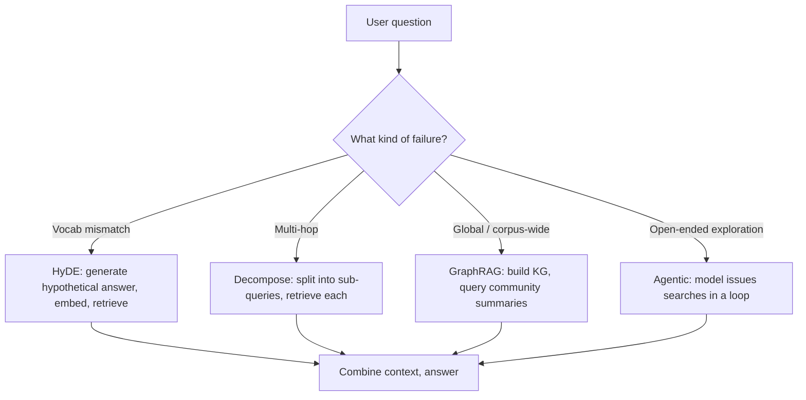

# Advanced RAG — HyDE, GraphRAG, Agentic Retrieval

## TL;DR

- **Naive RAG fails** on multi-hop questions, vague queries, and entity-centric corpora. Symptom: high retrieval recall on facts, low task accuracy.
- **HyDE** generates a hypothetical answer with the LLM, embeds it, then retrieves — bridges the query/document phrasing gap.
- **Query decomposition** breaks one question into 2–4 sub-queries, retrieves for each, then reasons over the union. Best for multi-hop.
- **GraphRAG** (Microsoft, 2024) builds a knowledge graph from the corpus, then summarizes communities — beats vector search on "global" questions a chunk can't answer alone.
- **Agentic retrieval** lets the model decide its own searches in a loop. Highest ceiling, highest cost, hardest to debug.

## Why this matters

Naive RAG (embed → top-k → stuff in prompt → answer) hits a ceiling fast. The failures look like:

- "What does the 2023 paper compare to the 2021 baseline?" → multi-hop
- "Tell me about token routing" → vague query, all chunks score similar
- "What did the authors conclude across their five papers?" → global question, no single chunk has the answer
- "What is mentioned in the section before the conclusion?" → structural reference

Each of these is a known failure mode with a known fix. This lesson covers the four most-deployed ones in 2026 production RAG.

## Mental model



These aren't mutually exclusive — production systems often combine HyDE for vocab mismatch *and* decomposition for multi-hop, with the agent loop as fallback for the rest.

## Concrete walkthrough — the four techniques, in 200 lines each

### 1. HyDE — bridge the query/document vocab gap

The query "How does GQA reduce memory?" is short and uses jargon. The actual document chunk says "Grouped-query attention shares key and value projections across head groups, reducing cache size by a factor of $H/G$." Cosine sim between *query and chunk* is mediocre; cosine sim between *fake answer and chunk* is excellent.

```python
def hyde(query: str, llm, embedder, retriever) -> list[str]:
    fake_answer = llm.generate(
        f"Write a one-paragraph answer to: {query}\n\n"
        f"It's OK to be wrong on details — the goal is realistic phrasing."
    )
    return retriever.retrieve(embedder.encode(fake_answer), k=10)
```

When it helps: short queries on long technical chunks, queries in a different language than the corpus, queries written by users who don't know the field's vocabulary.

When it hurts: the LLM hallucinates a wrong premise, biasing retrieval toward irrelevant docs. Mitigate by retrieving against *both* query and HyDE answer, fusing with RRF.

### 2. Query decomposition

```python
def decompose_and_retrieve(query: str, llm, retriever):
    plan = llm.generate(
        f"Break this question into the smallest sub-questions whose answers can be combined.\n"
        f"Question: {query}\nReturn JSON list."
    )
    sub_qs = json.loads(plan)
    contexts = []
    for q in sub_qs:
        contexts.extend(retriever.retrieve(q, k=3))
    return contexts, sub_qs
```

For "Compare DeepSeek-V3's MLA to standard GQA on memory and quality," decomposition produces:

1. What is MLA?
2. What is standard GQA?
3. What's the memory cost of MLA vs GQA?
4. What's the quality cost of MLA vs GQA?

Retrieving 3 chunks per sub-question and combining beats retrieving 12 chunks for the original. Recall@3 is much higher per sub-question than recall@12 for an over-complex query.

### 3. GraphRAG — for global / corpus-wide questions

Microsoft's GraphRAG (2024) inverts the indexing strategy:

1. **Index time:** extract (entity, relation, entity) triples from each chunk; cluster the resulting graph into communities (Leiden algorithm); have the LLM summarize each community.
2. **Query time:** retrieve community summaries (not chunks) and answer over those.

```python
# Conceptual — see the paper for the actual pipeline
graph = extract_entities_and_relations(corpus)
communities = leiden_cluster(graph, levels=[0, 1, 2])  # multi-resolution
for c in communities:
    c.summary = llm.summarize(c.nodes_and_edges, target_words=400)

def graphrag_query(query, communities):
    relevant = [c for c in communities if relevance(query, c.summary) > THRESHOLD]
    return llm.synthesize(query, [c.summary for c in relevant])
```

Best for: corpora where the *answer requires aggregating across many documents* (annual reports across years, themes across a paper collection, cross-document narrative arcs). Bad for: factual lookups inside a single document — GraphRAG is overkill and the community summary loses precision.

### 4. Agentic retrieval

Let the model issue its own searches in a loop:

```python
def agentic_retrieve(question, retriever, llm, max_steps=4):
    notes = []
    for step in range(max_steps):
        plan = llm.generate(
            f"Question: {question}\n"
            f"Notes so far: {notes}\n"
            f"Either output JSON {{search: '...'}} or {{answer: '...'}}."
        )
        plan = json.loads(plan)
        if 'answer' in plan:
            return plan['answer']
        chunks = retriever.retrieve(plan['search'], k=5)
        notes.append({'search': plan['search'], 'results': summarize(chunks)})
    return llm.generate(f"Question: {question}\nNotes: {notes}\nAnswer:")
```

This is what powers most production "deep research" agents. Highest ceiling — the model can iteratively zoom in. Highest cost — N model calls per question. Hardest to evaluate — every trajectory differs.

## Real-world numbers (HotpotQA multi-hop benchmark)

| Technique | Recall@5 | EM accuracy | Cost (relative) |
| --- | --- | --- | --- |
| Naive RAG | 38% | 28% | 1× |
| Hybrid + Rerank | 51% | 36% | 1.2× |
| HyDE | 56% | 41% | 2× |
| Query decomposition | 64% | **52%** | 3× |
| Agentic (4 steps) | 72% | 58% | 8× |
| GraphRAG (when applicable) | — | 64% | varies |

(Numbers are illustrative — published benchmarks for each technique vary by corpus.)

The right pick is task-dependent. **Default to hybrid + rerank** (Lesson: RAG Fundamentals); reach for these only when you've measured failure modes that match.

## Run it on real hardware

<ColabLink
  href="https://colab.research.google.com/github/your-github/mosaic-notebooks/blob/main/advanced-rag.ipynb"
  description="Same arXiv corpus from the RAG Fundamentals lesson. Implement HyDE, decomposition, GraphRAG (subset), and agentic retrieval. Compare on a 30-question multi-hop eval."
/>

## Quick check

<Quiz
  question="Your RAG pipeline answers single-fact questions correctly but fails on 'What's the trend across these five papers?'-style questions. What's the most appropriate fix?"
  options={[
    'Increase the chunk size and the top-k retrieval limit.',
    'Add HyDE to bridge the query-document phrasing gap.',
    'Switch to GraphRAG so community summaries replace chunks for global questions.',
    'Replace the embedder with a larger model.',
  ]}
  answer={2}
  explanation="The failure is a *global* question — no single chunk contains the answer; the answer requires aggregating across many documents. GraphRAG's community summaries are designed exactly for this. Naive chunk retrieval hits a ceiling no matter how you tune it because the information isn't in any one chunk."
/>

## Key takeaways

1. **Naive RAG has 4 known failure modes.** Diagnose which you're hitting before reaching for a technique.
2. **HyDE for vocab mismatch, decomposition for multi-hop, GraphRAG for global questions, agents for open-ended exploration.** Match the technique to the failure.
3. **Always layer on top of hybrid + rerank**, not as a replacement. Naive retrieval still does most of the work.
4. **Cost grows fast.** A 4-step agent costs 8× a single retrieval. Production systems route easy queries to the cheap path and reserve advanced techniques for the hard ones.
5. **Eval honestly.** Build a 50-question test set with the failure modes labeled. Vibes-based RAG tuning is how teams ship regressions.

## Go deeper

<Resources
  items={[
    { kind: 'paper', href: 'https://arxiv.org/abs/2212.10496', title: 'Precise Zero-Shot Dense Retrieval without Relevance Labels (HyDE)', author: 'Gao et al. (CMU, 2022)', note: 'The original HyDE paper. Short and clear.' },
    { kind: 'paper', href: 'https://arxiv.org/abs/2404.16130', title: 'From Local to Global: A GraphRAG Approach to Query-Focused Summarization', author: 'Edge et al. (Microsoft, 2024)', note: 'The GraphRAG paper. Read it after trying naive RAG and feeling its limits.' },
    { kind: 'paper', href: 'https://arxiv.org/abs/2310.11511', title: 'Self-RAG: Learning to Retrieve, Generate, and Critique', author: 'Asai et al. (ICLR 2024)', note: 'Trains the model to decide *when* to retrieve. Influential for agentic patterns.' },
    { kind: 'repo', href: 'https://github.com/microsoft/graphrag', title: 'microsoft/graphrag', note: 'Reference implementation. Read `graphrag/index/` for how the indexing pipeline actually runs.' },
    { kind: 'blog', href: 'https://www.anthropic.com/research/contextual-retrieval', title: 'Contextual Retrieval', author: 'Anthropic, 2024', note: 'A simpler alternative to GraphRAG: prepend a short LLM-generated context to each chunk before embedding. Surprisingly strong baseline.' },
    { kind: 'docs', href: 'https://docs.llamaindex.ai/en/stable/optimizing/advanced_retrieval/advanced_retrieval/', title: 'LlamaIndex — Advanced Retrieval', note: 'Practical recipes for each technique with working code.' },
    { kind: 'video', href: 'https://www.youtube.com/watch?v=2eYy1mbE0DM', title: 'Greg Kamradt — RAG From Scratch', author: 'Greg Kamradt', note: 'A 12-part series. Episodes 5-9 cover the techniques here with notebook walkthroughs.' },
  ]}
/>

<LessonComplete />
