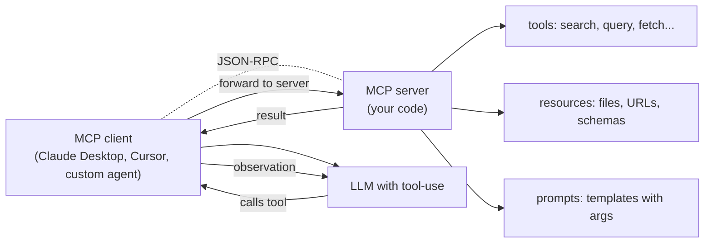

# Model Context Protocol

> **Prereq:** [Build a ReAct Agent](./react-agents). MCP is the standardization layer on top of the agent loop.

## TL;DR

- **MCP (Model Context Protocol)** is an open spec — released by Anthropic in late 2024, adopted broadly through 2025–2026 — for **how an LLM client (Claude Desktop, Cursor, custom agent) discovers and calls tools / reads files / fetches prompts** from an external server.
- Three primitives: **tools** (functions the LLM can invoke), **resources** (files / URLs the LLM can read), **prompts** (parameterized templates the user can invoke).
- One protocol, many transports: stdio (local subprocess), SSE / HTTP (network). Servers can be written in **TypeScript, Python, Go, Rust** — official SDKs in all of these.
- The 2026 ecosystem: hundreds of public MCP servers (databases, APIs, file systems, GitHub, Slack, Linear). **Claude Desktop, Cursor, VS Code, Zed, Continue.dev** all consume MCP. Building an MCP server is the new "build an integration."
- Compared to ad-hoc tool definitions: MCP **decouples** the tool implementation from the client. Write once, ship everywhere.

## Why this matters

Pre-MCP: every LLM agent re-implemented its own tool-discovery and tool-calling protocol. Cursor had its own tool spec; Claude Desktop had its own; LangChain had a third. **MCP collapses this to one standard.** A team that writes a Postgres MCP server gets to ship to every MCP client at once. The product implication is enormous: 2026 is the year "AI integrations" stops being a one-off engineering project per platform and becomes a single open spec.

## Mental model



The client mediates; the server implements; the LLM uses. Same ReAct loop, standardized handshake.

## Concrete walkthrough

### Three primitives

**Tools**: callable functions the LLM may invoke. JSON-Schema input. Returns text or structured data.

**Resources**: read-only handles to data the LLM may fetch as context. Each has a URI (e.g., `file:///path` or `db://table-name`); listing returns IDs, reading returns content.

**Prompts**: pre-canned templates the *user* can invoke (e.g., a slash command in Claude Desktop). Server lists available prompts; user picks one; client renders + sends.

### The simplest MCP server (Python)

```python
# pip install mcp
from mcp.server.fastmcp import FastMCP

mcp = FastMCP("my-server")

@mcp.tool()
def get_weather(city: str) -> str:
    """Get current weather for a city."""
    # Real impl: call a weather API
    return f"In {city}: 72°F, sunny"

@mcp.tool()
def calculate(expression: str) -> str:
    """Evaluate a math expression."""
    return str(eval(expression, {"__builtins__": None}, {}))

@mcp.resource("config://settings")
def get_settings() -> str:
    """Return application settings."""
    return '{"theme": "dark", "model": "claude-sonnet-4"}'

@mcp.prompt()
def code_review(language: str = "python") -> str:
    """Generate a code-review prompt for the given language."""
    return f"Please review the following {language} code for bugs and style:"

if __name__ == "__main__":
    mcp.run()
```

That's a complete server. Three tools, one resource, one prompt. Run it:

```bash
python my_server.py
```

It listens on stdin/stdout for JSON-RPC requests from a client.

### Wiring to Claude Desktop

In `~/Library/Application Support/Claude/claude_desktop_config.json`:

```json
{
  "mcpServers": {
    "my-server": {
      "command": "python",
      "args": ["/absolute/path/to/my_server.py"]
    }
  }
}
```

Restart Claude Desktop. The new tools / resources / prompts appear in the UI; Claude can now call `get_weather` etc. mid-conversation.

### Transports

- **stdio**: server is a subprocess of the client. Cheap, secure (no network), local-only. Default for desktop integrations.
- **HTTP / SSE**: server is a network service. For multi-client / hosted scenarios. Auth via OAuth or simple bearer tokens.
- **WebSocket**: full-duplex variant of HTTP. Used by some IDE integrations.

The protocol is the same; the transport is configurable.

### A real production example: a Postgres MCP server

```python
from mcp.server.fastmcp import FastMCP
import psycopg2

mcp = FastMCP("postgres")
conn = psycopg2.connect("postgresql://localhost/mydb")

@mcp.tool()
def query(sql: str) -> str:
    """Execute a read-only SQL query and return results."""
    if not sql.strip().lower().startswith("select"):
        return "Error: only SELECT queries allowed."
    cur = conn.cursor()
    cur.execute(sql)
    rows = cur.fetchall()
    cols = [d[0] for d in cur.description]
    return "\n".join([" | ".join(cols)] + [" | ".join(map(str, r)) for r in rows[:100]])

@mcp.resource("db://schema")
def schema() -> str:
    """Return the database schema."""
    cur = conn.cursor()
    cur.execute("SELECT table_name, column_name, data_type FROM information_schema.columns WHERE table_schema='public'")
    return "\n".join(f"{t}.{c} {dt}" for t, c, dt in cur.fetchall())
```

Now any MCP client (Claude Desktop, Cursor, your custom agent) can:
- Read `db://schema` to know the database structure.
- Call `query(...)` with safe SELECT statements.

**Built once; works in every MCP client.** This is the value proposition.

### Security considerations

MCP servers run with the privileges of the user who launches them. They can read files, hit APIs, modify state. **Treat them like any other CLI tool**: verify the source before installing, audit what they expose, isolate untrusted servers in containers.

Anthropic's security guidance:
- **Scope tools narrowly.** A `read_file` tool is fine; a `run_shell` tool is dangerous.
- **Distinguish read-only from mutating tools.** UI clients should require confirmation for the latter.
- **Validate all inputs server-side.** Don't trust the LLM to send sensible arguments.
- **Log everything.** Tool invocations are auditable events.

### Public MCP server ecosystem

By 2026 there are hundreds: GitHub, Slack, Linear, Notion, Asana, AWS, Cloudflare, Stripe, Postgres, SQLite, MongoDB, Redis, every major filesystem, browser-automation, image generation, calendar, email. **The MCP servers directory** (modelcontextprotocol.io) lists them.

For most use cases: don't write your own; pick from the list. Write your own for proprietary internal systems.

### Building MCP into your agent

```python
# Pseudocode: an MCP-aware ReAct agent
from mcp.client import StdioClient

async with StdioClient(command="python", args=["./db_server.py"]) as client:
    # Discover tools
    tools = await client.list_tools()
    tools_spec = [t.to_anthropic_format() for t in tools]

    # Pass to your LLM
    response = anthropic_client.messages.create(
        model="claude-sonnet-4",
        tools=tools_spec,
        messages=[...],
    )

    # When the model calls a tool, dispatch via MCP
    for block in response.content:
        if block.type == "tool_use":
            result = await client.call_tool(block.name, block.input)
            # ... feed back to the model ...
```

Your agent becomes provider-of-tools-aware: bring up MCP servers, the agent uses them automatically. This is how Claude Desktop, Cursor, and every emerging agent platform work in 2026.

## Run it in your browser — toy MCP-shaped server

<RunInBrowser
  description="Simulate the MCP message handshake and tool dispatch in pure Python (no real protocol — just the shape)."
  code={`# Minimal stand-in for an MCP server. Real MCP uses JSON-RPC over stdio/HTTP.
# This shows the message shape: list_tools, call_tool, resources.

def make_server():
    tools = {
        'get_weather': {
            'name': 'get_weather',
            'description': 'Get current weather for a city.',
            'input_schema': {'type': 'object', 'properties': {'city': {'type': 'string'}}, 'required': ['city']},
            'fn': lambda city: f"In {city}: 72°F, sunny",
        },
        'calculate': {
            'name': 'calculate',
            'description': 'Evaluate a math expression.',
            'input_schema': {'type': 'object', 'properties': {'expression': {'type': 'string'}}, 'required': ['expression']},
            'fn': lambda expression: str(eval(expression, {'__builtins__': None}, {})),
        },
    }

    def handle(msg):
        if msg['method'] == 'tools/list':
            return {'tools': [{k: v[k] for k in ('name', 'description', 'input_schema')} for v in tools.values()]}
        if msg['method'] == 'tools/call':
            name = msg['params']['name']
            args = msg['params']['arguments']
            return {'content': [{'type': 'text', 'text': tools[name]['fn'](**args)}]}
        return {'error': 'unknown method'}
    return handle

server = make_server()

# Client side: discover, then call
print("--- Client: tools/list ---")
list_resp = server({'method': 'tools/list'})
for t in list_resp['tools']:
    print(f"  {t['name']}: {t['description']}")

print("\\n--- Client: tools/call(get_weather, city=SF) ---")
call_resp = server({'method': 'tools/call', 'params': {'name': 'get_weather', 'arguments': {'city': 'San Francisco'}}})
print(f"  result: {call_resp['content'][0]['text']}")

print("\\n--- Client: tools/call(calculate, 17*23+12) ---")
call_resp = server({'method': 'tools/call', 'params': {'name': 'calculate', 'arguments': {'expression': '17*23+12'}}})
print(f"  result: {call_resp['content'][0]['text']}")

print()
print("Real MCP wraps this in JSON-RPC 2.0 over stdio or HTTP.")
print("The shape — discover, call, return — is the same.")
`}
/>

The handshake is the protocol. Real MCP adds JSON-RPC framing, async, transports, capability negotiation — but the shape is what you simulated.

## Quick check

<FillIn
  prompt="The three primitive types an MCP server exposes:"
  answer="tools, resources, prompts"
  accept={["tools resources prompts", "tools, resources, and prompts", "tools / resources / prompts"]}
  hint="Comma-separated triple."
  explanation="Tools (callable functions), Resources (read-only data sources via URI), Prompts (parameterized templates the user invokes). All three appear in the spec; most servers focus on tools but the broader pattern is what makes MCP general."
/>

<Quiz
  question="A team builds a custom internal tool integration for Claude Desktop, Cursor, and their own agent. Pre-MCP they had three implementations. The 2026 way:"
  options={[
    'Pick one client; commit to it.',
    'Build one MCP server; configure all three clients to use it. One implementation; works everywhere.',
    'Use only the OpenAI API.',
    'Train a custom model.',
  ]}
  answer={1}
  explanation={`That's exactly the MCP value proposition. One server, conforms to the spec, every MCP client can consume it. The team builds the integration once; the tool becomes available across Claude Desktop, Cursor, VS Code, Zed, the team's own agent, and any future MCP-compliant client. This is the 2026 pattern for AI integration.`}
/>

## Key takeaways

1. **MCP = open standard for tool / resource / prompt exposure** to LLM clients.
2. **Three primitives** (tools, resources, prompts), two transports (stdio, HTTP / SSE).
3. **Write a server once; every MCP client (Claude Desktop, Cursor, etc.) gets the integration for free.**
4. **Hundreds of public MCP servers** as of 2026. Default to using existing ones; write your own for proprietary systems.
5. **Security is your responsibility.** Servers run with user privileges; scope narrowly, validate inputs, log everything.

## Go deeper

<Resources
  items={[
    { kind: 'docs', href: 'https://modelcontextprotocol.io/', title: 'Model Context Protocol — Official Site', note: 'The spec, SDK list, server directory.' },
    { kind: 'docs', href: 'https://modelcontextprotocol.io/quickstart/server', title: 'MCP Quickstart — Build a Server', note: 'Hands-on first server in Python or TypeScript.' },
    { kind: 'docs', href: 'https://modelcontextprotocol.io/specification/2024-11-05', title: 'MCP Specification', note: 'The protocol itself. Read once to internalize the message shape.' },
    { kind: 'blog', href: 'https://www.anthropic.com/news/model-context-protocol', title: 'Anthropic — Introducing MCP', note: 'Launch announcement. Useful for the design rationale.' },
    { kind: 'repo', href: 'https://github.com/modelcontextprotocol/servers', title: 'modelcontextprotocol/servers', note: 'Reference implementations: filesystem, GitHub, Slack, Postgres, more. Read for patterns.' },
    { kind: 'repo', href: 'https://github.com/modelcontextprotocol/python-sdk', title: 'modelcontextprotocol/python-sdk', note: 'The official Python SDK. FastMCP is the high-level wrapper most code uses.' },
    { kind: 'repo', href: 'https://github.com/modelcontextprotocol/typescript-sdk', title: 'modelcontextprotocol/typescript-sdk', note: 'TypeScript SDK. Used by most editor integrations.' },
  ]}
/>

<LessonComplete />
