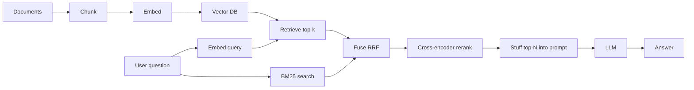

# RAG Fundamentals

## TL;DR

- **RAG = retrieval + generation.** Pull the most relevant chunks for a question, stuff them in the prompt, let the model answer.
- **The pipeline:** chunk documents → embed → store → retrieve top-k → re-rank → stuff into prompt → generate.
- **Hybrid retrieval (dense + BM25 fused via RRF) beats either alone.** Dense gets meaning; BM25 gets exact keywords.
- **A cross-encoder re-ranker is the highest-leverage stage.** It sees the query and chunks together and re-scores. Adds 100 ms, can lift Recall@5 by 15+ points.
- **Chunking is underrated.** Recursive character splitting at ~400 tokens with 50-token overlap is the sane default. Semantic chunking is sometimes worth it; rarely worth it from day one.

## Why this matters

A frontier model's knowledge cutoff is many months ago. Your private documents were never in training. Without retrieval, the model can only fabricate answers about both. RAG is the most-deployed pattern in AI engineering right now because it solves a real problem with off-the-shelf parts: *give the model relevant information at inference time*.

Done well, RAG turns an LLM into a domain expert overnight. Done poorly, it hallucinates with footnotes.

## Mental model



Five stages, each with a knob. Most teams build the diagram once, then tune the knobs forever.

## Concrete walkthrough — RAG over arXiv abstracts

```python
from sentence_transformers import SentenceTransformer, CrossEncoder
import faiss
from rank_bm25 import BM25Okapi
import numpy as np

# ---------- 1. Chunk ----------
def chunk_recursive(text, size=400, overlap=50):
    words = text.split()
    out = []
    i = 0
    while i < len(words):
        out.append(" ".join(words[i:i + size]))
        i += size - overlap
    return out

corpus = [chunk for doc in documents for chunk in chunk_recursive(doc)]

# ---------- 2. Embed ----------
embedder = SentenceTransformer("BAAI/bge-small-en-v1.5")
embeddings = embedder.encode(corpus, normalize_embeddings=True)

# ---------- 3. Store ----------
index = faiss.IndexFlatIP(embeddings.shape[1])  # inner product = cosine since normalized
index.add(embeddings)

# Also build a BM25 index for hybrid search.
bm25 = BM25Okapi([c.split() for c in corpus])

# ---------- 4. Retrieve (hybrid) ----------
def retrieve(query, k=20):
    qv = embedder.encode([query], normalize_embeddings=True)
    _, dense_ids = index.search(qv, k)
    dense_ids = dense_ids[0].tolist()

    bm25_scores = bm25.get_scores(query.split())
    bm25_ids = np.argsort(bm25_scores)[-k:][::-1].tolist()

    # Reciprocal Rank Fusion: 1 / (60 + rank)
    rrf = {}
    for rank, idx in enumerate(dense_ids): rrf[idx] = rrf.get(idx, 0) + 1 / (60 + rank)
    for rank, idx in enumerate(bm25_ids):  rrf[idx] = rrf.get(idx, 0) + 1 / (60 + rank)
    fused = sorted(rrf.items(), key=lambda kv: -kv[1])[:k]
    return [corpus[i] for i, _ in fused]

# ---------- 5. Rerank ----------
reranker = CrossEncoder("BAAI/bge-reranker-v2-m3")
def rerank(query, candidates, top_n=5):
    pairs = [(query, c) for c in candidates]
    scores = reranker.predict(pairs)
    ranked = sorted(zip(candidates, scores), key=lambda x: -x[1])
    return [c for c, _ in ranked[:top_n]]

# ---------- 6. Generate ----------
def answer(query):
    candidates = retrieve(query, k=20)
    top = rerank(query, candidates, top_n=5)
    context = "\\n\\n".join(f"[{i+1}] {c}" for i, c in enumerate(top))
    prompt = f"Use only the context to answer. Cite [n] for each claim.\\n\\nContext:\\n{context}\\n\\nQuestion: {query}\\n\\nAnswer:"
    return call_llm(prompt)
```

**Real numbers** on the SciFact benchmark (claim verification, smaller is harder):

| Stage           | Recall@5 | p50 latency |
| --------------- | -------- | ----------- |
| Dense only      | 64%      | 20 ms       |
| BM25 only       | 58%      | 5 ms        |
| Hybrid + RRF    | 71%      | 25 ms       |
| Hybrid + Rerank | **86%**  | 130 ms      |

The reranker is doing 15 percentage points of work. It's the single highest-leverage component in the stack.

## Run it in your browser

A pure-Python RAG demo using cosine similarity over hand-crafted embeddings. No external APIs.

<RunInBrowser
  description="Toy RAG so you can see the pipeline end-to-end."
  code={`# Toy 2D "embeddings" so we can see retrieval working.
documents = [
    ("ml-1", "Transformers use self-attention to relate every token to every other token."),
    ("ml-2", "RAG retrieves relevant context and gives it to the LM as part of the prompt."),
    ("ml-3", "LoRA fine-tunes a model by training small low-rank adapters."),
    ("food-1", "A baguette is a long, thin loaf of French bread with a crisp crust."),
    ("food-2", "Sourdough bread relies on wild yeast and lactobacilli for fermentation."),
]

import re
from collections import Counter

def tokenize(s): return re.findall(r"\\w+", s.lower())

# Bag-of-words "embedding" — pretend it's a real vector.
def embed(s):
    return Counter(tokenize(s))

def cosine(a, b):
    keys = set(a) | set(b)
    dot = sum(a[k] * b[k] for k in keys)
    na = sum(v*v for v in a.values()) ** 0.5
    nb = sum(v*v for v in b.values()) ** 0.5
    return dot / (na * nb + 1e-9)

corpus_emb = [(doc_id, text, embed(text)) for doc_id, text in documents]

def retrieve(query, k=2):
    qe = embed(query)
    scored = [(doc_id, text, cosine(qe, e)) for doc_id, text, e in corpus_emb]
    scored.sort(key=lambda x: -x[2])
    return scored[:k]

queries = ["how does retrieval work?", "what's a low-rank adapter?", "tell me about French bread"]
for q in queries:
    print(f"\\nQ: {q}")
    for doc_id, text, score in retrieve(q):
        print(f"  [{score:.2f}] {doc_id}: {text[:80]}…")
`}
/>

## Run it on real hardware

<ColabLink
  href="https://colab.research.google.com/github/your-github/mosaic-notebooks/blob/main/rag-basics.ipynb"
  description="Build RAG over 200 arXiv ML papers using llama-index. Hybrid retrieval + bge-reranker + Claude. Includes ragas eval."
/>

## Quick check

<Quiz
  question="Your RAG system retrieves the right document at rank 12, but you only feed the top 3 to the model. What stage do you fix?"
  options={[
    'Use a larger embedding model.',
    'Add a cross-encoder reranker between retrieval and generation.',
    'Increase chunk size.',
    'Switch from FAISS to Pinecone.',
  ]}
  answer={1}
  explanation="The retriever is finding the document; you're losing it to ranking noise. A cross-encoder reranker re-scores the top-20 with much more compute per pair and reliably promotes the right doc. This is the highest-leverage RAG fix and takes ~30 lines of code."
/>

## Key takeaways

1. **Build the simplest RAG first** (recursive chunking + dense retrieval + top-3) before reaching for advanced techniques.
2. **Hybrid + rerank is the real default** for production. Plain dense retrieval has well-known failure modes on numbers, code, and exact identifiers.
3. **Cite your context.** Always instruct the model to attribute claims to context indices. It dramatically reduces hallucinations and gives users something to verify.
4. **Eval honestly.** Use a real eval set (50–200 questions with reference answers) and metrics like faithfulness + answer-relevance. Vibes are not enough.
5. **Chunking changes everything.** When RAG is bad, chunking is the most likely cause; only after fixing chunking should you tune the retriever.

## Go deeper

<Resources
  items={[
    { kind: 'paper', href: 'https://arxiv.org/abs/2005.11401', title: 'Retrieval-Augmented Generation for Knowledge-Intensive NLP', author: 'Lewis et al., NeurIPS 2020', note: 'The original RAG paper. Foundational.' },
    { kind: 'paper', href: 'https://arxiv.org/abs/2312.10997', title: 'Retrieval-Augmented Generation for LLMs: A Survey', author: 'Gao et al., 2024', note: 'The most current literature review. Use as a reference.' },
    { kind: 'blog', href: 'https://www.pinecone.io/learn/series/rag/', title: 'Pinecone RAG learn series', note: 'Strong intro material; ignore the implicit Pinecone bias.' },
    { kind: 'docs', href: 'https://docs.llamaindex.ai/', title: 'LlamaIndex documentation', note: 'The framework that wraps the most RAG idioms; even if you write from scratch, the docs are a useful design reference.' },
    { kind: 'video', href: 'https://www.youtube.com/watch?v=zjkBMFhNj_g', title: 'Karpathy — Let\'s build GPT', author: 'Andrej Karpathy', note: 'Not RAG-specific, but the embedding section is unmatched.' },
    { kind: 'repo', href: 'https://github.com/microsoft/graphrag', title: 'microsoft/graphrag', note: 'When you outgrow chunk-and-embed, the path forward.' },
  ]}
/>

<LessonComplete />
