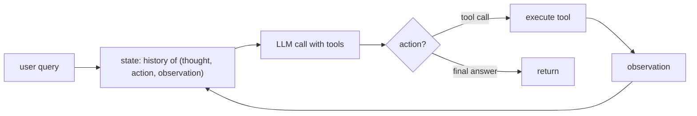

# Build a ReAct Agent

<Mode is="learn">

A <Term name="react">ReAct</Term> agent is a `while` loop with three lines in the body: ask the model what to do next, run the tool it picked, feed the result back. Wrap that in 80 lines of Python and you have an agent that can search the web, run code, and edit files. Wrap it in LangGraph and you have a state machine with checkpoints and replay. Wrap it in Claude Desktop or Cursor and you have a product. The loop is the same.

<Term name="tool use">Tool use</Term> is the primitive — the model emits a typed `tool_use` block, your code dispatches it to a function. ReAct is the *loop* that strings tool calls together with reasoning text in between, so the model has somewhere to think between actions. Yao et al. showed in 2022 that interleaved thought + action beats pure-action prompting on every multi-step benchmark; every modern agent — Cursor, Claude Code, Replit Agent, Devin, deep research — descends from that paper. **Build the loop from scratch once and every agent codebase becomes legible**: ah, that's the loop, those are the tools. This lesson is that build, plus the failure modes that bite production stacks.

## TL;DR

- **ReAct** (Yao et al., 2022) = **Reason + Act**. The agent alternates between *thinking* (free-text reasoning), *acting* (calling a tool), and *observing* (reading the tool's output). Same pattern, every modern LLM agent.
- The architecture is small: an LLM, a list of tools (functions), a loop. **A working ReAct agent is ~80 lines of Python**, no LangChain required.
- **Tool-use APIs** (OpenAI function-calling, Anthropic tools) handle the structured-output side of "the model picks a tool and arguments." Your code dispatches and returns the observation.
- **Termination conditions matter**: max iterations, success-by-the-model-saying-done, or a result-format match. Without them you loop forever.
- LangGraph, OpenAI Assistants API, Anthropic's `messages.create` with tools — all are productionizations of the same loop. **Build it once from scratch and the framework code becomes legible.**

## Mental model



Loop until the model emits a final answer or max iterations is reached.

## A working ReAct agent in 80 lines

```python
import json
from anthropic import Anthropic

client = Anthropic()

# Define tools as Python functions
def web_search(query: str) -> str:
    """Search the web. Returns top results as plain text."""
    # In real impl, call an actual search API
    return f"[Top 5 results for '{query}'...]"

def calculator(expression: str) -> str:
    """Evaluate a math expression. Returns result as a string."""
    try: return str(eval(expression, {"__builtins__": None}, {}))
    except Exception as e: return f"error: {e}"

def write_file(path: str, content: str) -> str:
    """Write content to a file. Returns confirmation."""
    with open(path, 'w') as f: f.write(content)
    return f"wrote {len(content)} bytes to {path}"

TOOLS = {
    "web_search": (web_search, {
        "name": "web_search",
        "description": "Search the web and return top results.",
        "input_schema": {"type": "object", "properties": {"query": {"type": "string"}}, "required": ["query"]},
    }),
    "calculator": (calculator, {
        "name": "calculator",
        "description": "Evaluate a math expression.",
        "input_schema": {"type": "object", "properties": {"expression": {"type": "string"}}, "required": ["expression"]},
    }),
    "write_file": (write_file, {
        "name": "write_file",
        "description": "Write content to a file at the given path.",
        "input_schema": {"type": "object", "properties": {"path": {"type": "string"}, "content": {"type": "string"}}, "required": ["path", "content"]},
    }),
}

def react_loop(user_query: str, max_iters: int = 10) -> str:
    messages = [{"role": "user", "content": user_query}]
    tools_spec = [t[1] for t in TOOLS.values()]

    for i in range(max_iters):
        response = client.messages.create(
            model="claude-sonnet-4-5",
            max_tokens=2048,
            tools=tools_spec,
            messages=messages,
        )

        # Add assistant message to history
        messages.append({"role": "assistant", "content": response.content})

        if response.stop_reason == "end_turn":
            return "".join(b.text for b in response.content if b.type == "text")

        # Execute tool calls
        tool_results = []
        for block in response.content:
            if block.type == "tool_use":
                fn = TOOLS[block.name][0]
                result = fn(**block.input)
                tool_results.append({
                    "type": "tool_result",
                    "tool_use_id": block.id,
                    "content": result,
                })

        if not tool_results:
            return "[no tool calls and no end_turn — bailing]"

        messages.append({"role": "user", "content": tool_results})

    return "[max iterations exceeded]"

if __name__ == "__main__":
    print(react_loop("What's 17 * 23 + sqrt(144)? Then save the result to /tmp/answer.txt."))
```

That's a complete agent. The model decides whether to call a tool or stop; we dispatch tools and pass results back; the loop terminates on `end_turn` or max iterations.

## Tracing through an example run

Query: *"What's 17 × 23 + sqrt(144)? Save to /tmp/answer.txt."*

Iteration 1:
- Model emits: tool_use(`calculator`, `expression="17*23 + 12"`)
- We execute: returns `"403"`.

Iteration 2:
- Model emits: tool_use(`write_file`, `path="/tmp/answer.txt"`, `content="403"`)
- We execute: returns `"wrote 3 bytes to /tmp/answer.txt"`.

Iteration 3:
- Model emits: text(`"Done — 17×23 + √144 = 403, saved to /tmp/answer.txt"`)
- `stop_reason == "end_turn"` → return.

**Three iterations, ~3 seconds, full agent loop.** That's it.

## What ReAct buys you over plain prompting

The original 2022 paper showed that interleaving reasoning ("let me think...") with actions ("let me search...") outperforms pure-action approaches. The reason: the model's text-output channel is where its "deliberation" happens. By letting the model emit reasoning between tool calls, it has a place to think — and that thinking is conditioned on prior observations.

In modern tool-use APIs, ReAct is implicit — the model produces both reasoning text and tool calls in the same response. The "let me think then act" structure is in the training distribution.

## Termination conditions

Without explicit termination, agents loop forever:

```python
# Always set max_iters
react_loop(query, max_iters=10)

# Sometimes add: stop if the last 3 actions are identical
def is_stuck(messages):
    last_actions = [b for m in messages[-6:] if m["role"] == "assistant"
                    for b in m.get("content", []) if getattr(b, "type", None) == "tool_use"]
    return len(last_actions) >= 3 and len({(a.name, str(a.input)) for a in last_actions}) == 1

# Or: stop if tool returned the same observation 3 times
```

In production, typical max_iters is 20–50; the median real query takes 3–8 iterations.

## Memory and context

The simple loop above keeps full message history. Token usage grows with iterations. For long-running agents:

- **Truncate or summarize old history** when the context approaches the model's limit.
- **Vector-store-backed memory**: store observations in a vector DB; retrieve relevant ones on each iteration.
- **Hierarchical agents**: a planner agent that delegates subtasks to worker agents, each with their own bounded context.

LangGraph (Anthropic recommends it for production), OpenAI's Assistants API, and Inngest's Agent Framework all package these patterns.

## MCP — the standardization layer

<Term name="mcp">MCP</Term> (Model Context Protocol — see [MCP](./mcp)) is the open standard for exposing tools to LLMs. Instead of hand-coding tool definitions per provider, you implement an MCP server and any compliant client (Claude Desktop, Cursor, etc.) can use your tools. ReAct agents in 2026 increasingly consume MCP tool definitions rather than hand-rolled ones.

## Common failure modes

- **Hallucinated tool names**: model invents a tool that doesn't exist. <Term name="constrained decoding">Constrained decoding</Term> fixes this.
- **Argument errors**: wrong types, missing fields. Strong JSON schemas + validation help.
- **Loops**: same action repeated forever. Add stuck-detection.
- **Premature termination**: model says "done" before the task is complete. Better tool descriptions + few-shot examples in the system prompt.
- **Cost / time blow-up**: long-context iterations. Set a hard ceiling on tokens or time per task.

## Run it in your browser — toy ReAct loop

<RunInBrowser
  description="Simulated ReAct loop using a hardcoded fake LLM that 'reasons' through a small task."
  code={`# Simulate a ReAct agent without a real LLM API.
# The 'model' is hardcoded to walk through a math+file task.

def fake_llm(messages):
    """A scripted 'LLM' — returns the right thing for our test query."""
    n = len([m for m in messages if m['role'] == 'assistant'])
    if n == 0:
        return {'kind': 'tool_use', 'name': 'calculator', 'input': {'expression': '17*23 + 12'}}
    if n == 1:
        return {'kind': 'tool_use', 'name': 'write_file', 'input': {'path': '/tmp/answer.txt', 'content': '403'}}
    return {'kind': 'final', 'text': 'Done — answer saved to /tmp/answer.txt.'}

def calculator(expression):
    try: return str(eval(expression, {'__builtins__': None}, {}))
    except Exception as e: return f'error: {e}'

def write_file(path, content):
    return f'wrote {len(content)} bytes to {path}'

TOOLS = {'calculator': calculator, 'write_file': write_file}

def react_loop(query, max_iters=10):
    messages = [{'role': 'user', 'content': query}]
    print(f"USER: {query}\\n")
    for i in range(max_iters):
        response = fake_llm(messages)
        if response['kind'] == 'final':
            print(f"FINAL: {response['text']}")
            return response['text']
        # Tool call
        name, args = response['name'], response['input']
        result = TOOLS[name](**args)
        print(f"  iter {i+1}: tool={name}({args!r}) → {result!r}")
        messages.append({'role': 'assistant', 'content': response})
        messages.append({'role': 'user', 'content': {'tool_result': result}})
    return '[max iters]'

react_loop("What's 17 * 23 + sqrt(144)? Save to /tmp/answer.txt.")
`}
/>

The shape — model → tool → observation → repeat → final — is the entire ReAct architecture. Real agents add many tools, memory, planners, but this loop is the heart.

## Quick check

<FillIn
  prompt="The 2022 paper that introduced the ReAct (reason + act) framework for LLM agents:"
  answer="Yao et al."
  accept={["Yao", "Yao 2022", "ReAct paper"]}
  hint="Lead author's surname."
  explanation="Yao et al., 'ReAct: Synergizing Reasoning and Acting in Language Models' (2022). The technique they formalized — interleaving thoughts and actions — became the universal agent pattern."
/>

<Quiz
  question="A team's ReAct agent occasionally loops: it calls the same search tool with the same query 5 times in a row. Best fix:"
  options={[
    'Increase max_iters.',
    'Add stuck-detection: if the last 3 actions are identical (same tool, same args), break out and return current state.',
    'Switch to a larger model.',
    'Disable the search tool.',
  ]}
  answer={1}
  explanation="Repeated identical actions almost always mean the model has decided this is the right next step but the tool isn\'t producing useful new information. Increasing max_iters just lets it loop more. The right move is to detect the stuck pattern and either fall back to a final-answer step or escalate (different tool, more context). Cheap to add; eliminates the most common pathological behavior."
/>

## Key takeaways

1. **ReAct = reason + act loop.** ~80 lines of Python; the foundation of every modern agent.
2. **Tool-use APIs** handle the LLM-side structured output; your code dispatches functions and feeds back observations.
3. **Set termination conditions** (max iters, stuck detection, success match). Without them you loop forever.
4. **Production frameworks (LangGraph, OpenAI Assistants, MCP)** add memory, planning, multi-agent orchestration. The core loop is unchanged.
5. **Build it from scratch once.** Every agent codebase becomes legible.

## Go deeper

<Resources
  items={[
    { kind: 'paper', href: 'https://arxiv.org/abs/2210.03629', title: 'ReAct: Synergizing Reasoning and Acting in Language Models', author: 'Yao et al., 2022', note: 'The original paper. Section 3 has the prompt format that became the standard.' },
    { kind: 'docs', href: 'https://docs.anthropic.com/en/docs/build-with-claude/tool-use', title: 'Anthropic — Tool Use Documentation', note: 'How Claude\'s tool-use API works. The most important reference for the messages-based ReAct loop.' },
    { kind: 'docs', href: 'https://platform.openai.com/docs/guides/function-calling', title: 'OpenAI — Function Calling', note: 'Same pattern, different surface. Read both to internalize the abstraction.' },
    { kind: 'docs', href: 'https://langchain-ai.github.io/langgraph/', title: 'LangGraph Documentation', note: 'Anthropic-recommended production framework. The state-graph abstraction for multi-step agents.' },
    { kind: 'docs', href: 'https://modelcontextprotocol.io/', title: 'Model Context Protocol', note: 'The 2024+ standard for tool definitions. Increasingly the input format for ReAct agents.' },
    { kind: 'blog', href: 'https://www.anthropic.com/research/building-effective-agents', title: 'Anthropic — Building Effective Agents', note: 'Best taxonomy of agent patterns from the team that ships Claude. Distinguishes "workflows" from "agents" usefully.' },
    { kind: 'repo', href: 'https://github.com/anthropics/anthropic-cookbook', title: 'anthropics/anthropic-cookbook', note: 'Worked examples including a ReAct loop with Claude\'s tool-use API.' },
  ]}
/>

</Mode>

<Mode is="reference">

## TL;DR

- **ReAct** (Yao et al., 2022) = **Reason + Act**. The agent alternates between *thinking* (free-text reasoning), *acting* (calling a tool), and *observing* (reading the tool's output). Same pattern, every modern LLM agent.
- The architecture is small: an LLM, a list of tools (functions), a loop. **A working ReAct agent is ~80 lines of Python**, no LangChain required.
- **Tool-use APIs** (OpenAI function-calling, Anthropic tools) handle the structured-output side of "the model picks a tool and arguments." Your code dispatches and returns the observation.
- **Termination conditions matter**: max iterations, success-by-the-model-saying-done, or a result-format match. Without them you loop forever.
- LangGraph, OpenAI Assistants API, Anthropic's `messages.create` with tools — all are productionizations of the same loop. **Build it once from scratch and the framework code becomes legible.**

## Why this matters

Every "AI agent" — Cursor, Claude Code, Replit Agent, Devin, deep research, computer-use, the auto-coding tools that landed in 2024–2025 — runs a ReAct-style loop at its core. The framework on top adds memory, planning, sub-agents, recovery — but the loop is what makes it work. **Until you've built ReAct from scratch, every agent codebase feels like magic; after, every agent codebase reads as "ah, that's the loop, those are the tools."**

## Mental model


Loop until the model emits a final answer or max iterations is reached.

## Concrete walkthrough

### A working ReAct agent in 80 lines

```python
import json
from anthropic import Anthropic

client = Anthropic()

# Define tools as Python functions
def web_search(query: str) -> str:
    """Search the web. Returns top results as plain text."""
    # In real impl, call an actual search API
    return f"[Top 5 results for '{query}'...]"

def calculator(expression: str) -> str:
    """Evaluate a math expression. Returns result as a string."""
    try: return str(eval(expression, {"__builtins__": None}, {}))
    except Exception as e: return f"error: {e}"

def write_file(path: str, content: str) -> str:
    """Write content to a file. Returns confirmation."""
    with open(path, 'w') as f: f.write(content)
    return f"wrote {len(content)} bytes to {path}"

TOOLS = {
    "web_search": (web_search, {
        "name": "web_search",
        "description": "Search the web and return top results.",
        "input_schema": {"type": "object", "properties": {"query": {"type": "string"}}, "required": ["query"]},
    }),
    "calculator": (calculator, {
        "name": "calculator",
        "description": "Evaluate a math expression.",
        "input_schema": {"type": "object", "properties": {"expression": {"type": "string"}}, "required": ["expression"]},
    }),
    "write_file": (write_file, {
        "name": "write_file",
        "description": "Write content to a file at the given path.",
        "input_schema": {"type": "object", "properties": {"path": {"type": "string"}, "content": {"type": "string"}}, "required": ["path", "content"]},
    }),
}

def react_loop(user_query: str, max_iters: int = 10) -> str:
    messages = [{"role": "user", "content": user_query}]
    tools_spec = [t[1] for t in TOOLS.values()]

    for i in range(max_iters):
        response = client.messages.create(
            model="claude-sonnet-4-5",
            max_tokens=2048,
            tools=tools_spec,
            messages=messages,
        )

        # Add assistant message to history
        messages.append({"role": "assistant", "content": response.content})

        if response.stop_reason == "end_turn":
            return "".join(b.text for b in response.content if b.type == "text")

        # Execute tool calls
        tool_results = []
        for block in response.content:
            if block.type == "tool_use":
                fn = TOOLS[block.name][0]
                result = fn(**block.input)
                tool_results.append({
                    "type": "tool_result",
                    "tool_use_id": block.id,
                    "content": result,
                })

        if not tool_results:
            return "[no tool calls and no end_turn — bailing]"

        messages.append({"role": "user", "content": tool_results})

    return "[max iterations exceeded]"

if __name__ == "__main__":
    print(react_loop("What's 17 * 23 + sqrt(144)? Then save the result to /tmp/answer.txt."))
```

That's a complete agent. The model decides whether to call a tool or stop; we dispatch tools and pass results back; the loop terminates on `end_turn` or max iterations.

### Tracing through an example run

Query: *"What's 17 × 23 + sqrt(144)? Save to /tmp/answer.txt."*

Iteration 1:
- Model emits: tool_use(`calculator`, `expression="17*23 + 12"`)
- We execute: returns `"403"`.

Iteration 2:
- Model emits: tool_use(`write_file`, `path="/tmp/answer.txt"`, `content="403"`)
- We execute: returns `"wrote 3 bytes to /tmp/answer.txt"`.

Iteration 3:
- Model emits: text(`"Done — 17×23 + √144 = 403, saved to /tmp/answer.txt"`)
- `stop_reason == "end_turn"` → return.

**Three iterations, ~3 seconds, full agent loop.** That's it.

### What ReAct buys you over plain prompting

The original 2022 paper showed that interleaving reasoning ("let me think...") with actions ("let me search...") outperforms pure-action approaches. The reason: the model's text-output channel is where its "deliberation" happens. By letting the model emit reasoning between tool calls, it has a place to think — and that thinking is conditioned on prior observations.

In modern tool-use APIs, ReAct is implicit — the model produces both reasoning text and tool calls in the same response. The "let me think then act" structure is in the training distribution.

### Termination conditions

Without explicit termination, agents loop forever:

```python
# Always set max_iters
react_loop(query, max_iters=10)

# Sometimes add: stop if the last 3 actions are identical
def is_stuck(messages):
    last_actions = [b for m in messages[-6:] if m["role"] == "assistant"
                    for b in m.get("content", []) if getattr(b, "type", None) == "tool_use"]
    return len(last_actions) >= 3 and len({(a.name, str(a.input)) for a in last_actions}) == 1

# Or: stop if tool returned the same observation 3 times
```

In production, typical max_iters is 20–50; the median real query takes 3–8 iterations.

### Memory and context

The simple loop above keeps full message history. Token usage grows with iterations. For long-running agents:

- **Truncate or summarize old history** when the context approaches the model's limit.
- **Vector-store-backed memory**: store observations in a vector DB; retrieve relevant ones on each iteration.
- **Hierarchical agents**: a planner agent that delegates subtasks to worker agents, each with their own bounded context.

LangGraph (Anthropic recommends it for production), OpenAI's Assistants API, and Inngest's Agent Framework all package these patterns.

### MCP — the standardization layer

**MCP** (Model Context Protocol — see [MCP](./mcp)) is the open standard for exposing tools to LLMs. Instead of hand-coding tool definitions per provider, you implement an MCP server and any compliant client (Claude Desktop, Cursor, etc.) can use your tools. ReAct agents in 2026 increasingly consume MCP tool definitions rather than hand-rolled ones.

### Common failure modes

- **Hallucinated tool names**: model invents a tool that doesn't exist. Constrained decoding fixes this.
- **Argument errors**: wrong types, missing fields. Strong JSON schemas + validation help.
- **Loops**: same action repeated forever. Add stuck-detection.
- **Premature termination**: model says "done" before the task is complete. Better tool descriptions + few-shot examples in the system prompt.
- **Cost / time blow-up**: long-context iterations. Set a hard ceiling on tokens or time per task.

## Run it in your browser — toy ReAct loop

<RunInBrowser
  description="Simulated ReAct loop using a hardcoded fake LLM that 'reasons' through a small task."
  code={`# Simulate a ReAct agent without a real LLM API.
# The 'model' is hardcoded to walk through a math+file task.

def fake_llm(messages):
    """A scripted 'LLM' — returns the right thing for our test query."""
    n = len([m for m in messages if m['role'] == 'assistant'])
    if n == 0:
        return {'kind': 'tool_use', 'name': 'calculator', 'input': {'expression': '17*23 + 12'}}
    if n == 1:
        return {'kind': 'tool_use', 'name': 'write_file', 'input': {'path': '/tmp/answer.txt', 'content': '403'}}
    return {'kind': 'final', 'text': 'Done — answer saved to /tmp/answer.txt.'}

def calculator(expression):
    try: return str(eval(expression, {'__builtins__': None}, {}))
    except Exception as e: return f'error: {e}'

def write_file(path, content):
    return f'wrote {len(content)} bytes to {path}'

TOOLS = {'calculator': calculator, 'write_file': write_file}

def react_loop(query, max_iters=10):
    messages = [{'role': 'user', 'content': query}]
    print(f"USER: {query}\\n")
    for i in range(max_iters):
        response = fake_llm(messages)
        if response['kind'] == 'final':
            print(f"FINAL: {response['text']}")
            return response['text']
        # Tool call
        name, args = response['name'], response['input']
        result = TOOLS[name](**args)
        print(f"  iter {i+1}: tool={name}({args!r}) → {result!r}")
        messages.append({'role': 'assistant', 'content': response})
        messages.append({'role': 'user', 'content': {'tool_result': result}})
    return '[max iters]'

react_loop("What's 17 * 23 + sqrt(144)? Save to /tmp/answer.txt.")
`}
/>

The shape — model → tool → observation → repeat → final — is the entire ReAct architecture. Real agents add many tools, memory, planners, but this loop is the heart.

## Quick check

<FillIn
  prompt="The 2022 paper that introduced the ReAct (reason + act) framework for LLM agents:"
  answer="Yao et al."
  accept={["Yao", "Yao 2022", "ReAct paper"]}
  hint="Lead author's surname."
  explanation="Yao et al., 'ReAct: Synergizing Reasoning and Acting in Language Models' (2022). The technique they formalized — interleaving thoughts and actions — became the universal agent pattern."
/>

<Quiz
  question="A team's ReAct agent occasionally loops: it calls the same search tool with the same query 5 times in a row. Best fix:"
  options={[
    'Increase max_iters.',
    'Add stuck-detection: if the last 3 actions are identical (same tool, same args), break out and return current state.',
    'Switch to a larger model.',
    'Disable the search tool.',
  ]}
  answer={1}
  explanation="Repeated identical actions almost always mean the model has decided this is the right next step but the tool isn\'t producing useful new information. Increasing max_iters just lets it loop more. The right move is to detect the stuck pattern and either fall back to a final-answer step or escalate (different tool, more context). Cheap to add; eliminates the most common pathological behavior."
/>

## Key takeaways

1. **ReAct = reason + act loop.** ~80 lines of Python; the foundation of every modern agent.
2. **Tool-use APIs** handle the LLM-side structured output; your code dispatches functions and feeds back observations.
3. **Set termination conditions** (max iters, stuck detection, success match). Without them you loop forever.
4. **Production frameworks (LangGraph, OpenAI Assistants, MCP)** add memory, planning, multi-agent orchestration. The core loop is unchanged.
5. **Build it from scratch once.** Every agent codebase becomes legible.

## Go deeper

<Resources
  items={[
    { kind: 'paper', href: 'https://arxiv.org/abs/2210.03629', title: 'ReAct: Synergizing Reasoning and Acting in Language Models', author: 'Yao et al., 2022', note: 'The original paper. Section 3 has the prompt format that became the standard.' },
    { kind: 'docs', href: 'https://docs.anthropic.com/en/docs/build-with-claude/tool-use', title: 'Anthropic — Tool Use Documentation', note: 'How Claude\'s tool-use API works. The most important reference for the messages-based ReAct loop.' },
    { kind: 'docs', href: 'https://platform.openai.com/docs/guides/function-calling', title: 'OpenAI — Function Calling', note: 'Same pattern, different surface. Read both to internalize the abstraction.' },
    { kind: 'docs', href: 'https://langchain-ai.github.io/langgraph/', title: 'LangGraph Documentation', note: 'Anthropic-recommended production framework. The state-graph abstraction for multi-step agents.' },
    { kind: 'docs', href: 'https://modelcontextprotocol.io/', title: 'Model Context Protocol', note: 'The 2024+ standard for tool definitions. Increasingly the input format for ReAct agents.' },
    { kind: 'blog', href: 'https://www.anthropic.com/research/building-effective-agents', title: 'Anthropic — Building Effective Agents', note: 'Best taxonomy of agent patterns from the team that ships Claude. Distinguishes "workflows" from "agents" usefully.' },
    { kind: 'repo', href: 'https://github.com/anthropics/anthropic-cookbook', title: 'anthropics/anthropic-cookbook', note: 'Worked examples including a ReAct loop with Claude\'s tool-use API.' },
  ]}
/>

</Mode>

<LessonComplete />
