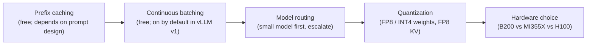

# Cost & Latency

> **Prereqs:** [vLLM & SGLang](./vllm-sglang), [KV Cache Basics](../../llm-architecture/kv-cache/kv-basics), [Chunked Prefill](../../llm-architecture/inference-time/chunked-prefill). This lesson is the *playbook* — the moves you make once you understand the underlying systems.

## TL;DR

- Production LLM serving has **five economic levers**, in roughly increasing implementation cost: prefix caching → continuous batching → model routing → quantization → hardware. Each is multiplicative; doing all five well gets you 10–30× cheaper than naive serving.
- **Prefix caching is the cheapest win and most teams leave it on the table.** Hit-rate-aware prompt design takes a day and pays off forever.
- **Continuous batching is on by default** in vLLM v1, SGLang, TensorRT-LLM. Old TGI / HF transformers servers leave 5× on the floor — switch.
- **Model routing** (small model first, escalate on uncertainty) is the highest-leverage lever for tasks where ~70% of queries are easy. Saves 3–8× on the dollar; no quality loss.
- **FP8 / INT4 quantization** halves to quarters memory and bandwidth costs. Modern open weights take quantization with negligible quality regression.
- **Hardware is last because it's a capex decision.** Use the calculator below to compare B200 vs MI355X vs H100 for *your* workload.

## Why this matters

LLM cost is the single biggest line item for any AI product that's actually used. The first instinct — "throw more GPUs at it" — is the most expensive answer. Every team that achieves a sane cost-per-user has navigated a sequence of lever changes, in roughly the order above. **The order matters**: you don't go shopping for B200s until you've verified prefix caching is on. Skipping levers means buying capacity that better software would have made unnecessary.

This lesson is the canonical 5-step playbook. Run it top to bottom on any new serving deployment.

## Mental model



Each box, in order, is "the cheapest move I haven't made yet." Don't skip ahead — every box is a multiplier on every later box.

## Concrete walkthrough

### Lever 1 — Prefix caching

See [Prefix & RadixAttention](../../llm-architecture/kv-cache/prefix-radix) for the mechanics. The actionable rule:

- **Move all variable bits to the *end* of the prompt.** Timestamps, request IDs, user IDs, A/B feature flags — all at the bottom. Anything that mutates at offset 0 destroys cache sharing.
- **Pin a stable chat template.** Tokenizer drift between client and server is the silent killer of hit rate.
- **Track `prefix_cache_hit_rate` in Grafana.** If it's below 50% on a chat workload, the prompt template is wrong; fix that before doing anything else.

Typical impact on TTFT: **3–10×** on agent / chatbot / eval workloads, where ~80% of the prompt is shared.

### Lever 2 — Continuous batching

The principle: do *not* finish one request before starting the next. The scheduler picks up new sequences mid-batch, evicts finished ones, runs one big packed forward pass per step. Combined with [chunked prefill](../../llm-architecture/inference-time/chunked-prefill), every step is full of useful work.

This is on by default in vLLM v1, SGLang v0.4+, TensorRT-LLM. If you're on legacy Hugging Face TGI or rolling your own with `transformers`, you're paying ~5× more than you need to for decode throughput. **Migrate.**

### Lever 3 — Model routing

Fact: most production traffic is easy. ~70% of customer-support questions, ~80% of code-completion calls, ~60% of summarization tasks can be answered by a 7B model that costs 1/30th of a 70B. The hard 20–40% need the big model.

The pattern:

```python
# Pseudocode for the routing decision.
def route(query):
    small_response = small_model.complete(query, max_tokens=64)
    confidence = score(small_response, query)         # log-prob, judge model, retrieval-overlap, etc.

    if confidence > THRESHOLD:
        return small_response                          # ~70% of traffic, ~3% of cost

    return big_model.complete(query)                   # ~30% of traffic, ~97% of cost — but only when needed
```

How to score confidence (cheapest → most accurate):

| Method                  | Cost                     | Accuracy |
|-------------------------|--------------------------|----------|
| Token log-prob average  | free (already computed)  | medium   |
| Self-reported confidence | one extra small-model call | medium-high |
| Small judge model       | one small-judge call     | high     |
| Retrieval-overlap score | depends on RAG stack     | high (RAG tasks) |

Production stacks (RouteLLM, Anyscale, vLLM proxy plugins) wrap this. Custom logic is fine for 90% of cases.

Real-world saving: **3–8× cheaper average cost-per-query** with no quality regression on a held-out eval. This is usually the biggest single win after prefix caching.

### Lever 4 — Quantization

The 2026 default stack:

- **Weights: FP8** (E4M3 on H100/B200) or **INT4** (AWQ/GPTQ for offline). Weight memory roughly halves (FP8) or quarters (INT4); inference throughput goes up commensurately because decode is bandwidth-bound.
- **KV cache: FP8**. Halves the cache. Quality regression is negligible for chat / reasoning workloads.
- **Activations: BF16 or FP8.** Weights and KV at FP8 with activations at BF16 is the sweet spot for most production stacks.

Quality regression on standard benchmarks (MMLU, GSM8K, HumanEval): typically **under 0.5 points** for FP8, **0.5–2 points** for INT4. Both are well within the noise of model variation across runs. Validate on *your* eval — the regression is task-specific and concentrated in long-tail edge cases.

Throughput uplift on H100: **~1.7×** going BF16 → FP8 on weights alone, **~2.5×** on FP8 weights + FP8 KV. Multiply by your existing batch and the absolute throughput numbers get serious.

### Lever 5 — Hardware

Once the software levers are pulled, hardware is the remaining axis. The honest 2026 comparison: **B200 is ~2.5× the FP8 throughput of H100 at ~2.4× the on-demand price**, so the per-token cost is roughly the same. The B200 win is **consolidation**: a 70B + 7B routing pair fits on a single B200 node where you'd previously need two H100 nodes — fewer hops, simpler ops. **MI355X** matches B200 throughput at meaningfully lower price, with 288 GB HBM that fits even a 405B with comfortable headroom. **TPU v6** is competitive but locked to GCP and JAX.

The lever 5 trade isn't "B200 makes my tokens cheaper" (it doesn't, much, on demand); it's "the right hardware reduces fleet count by 30–50%, which compounds the routing and quantization wins because both small and big models now share KV pools and node-local caches." Confirm on your workload using the calculator below — vary params, tokens, MFU, GPU count.

<CostCalc workload="train-70b" hardware={["b200","mi355x","tpu-v6","h100"]} gpus={1024} />

A quick read of the table for typical 2026 frontier-class training: **B200 wins on time, MI355X wins on memory headroom and often on $-per-FLOP, H100 only wins on availability**. For inference workloads, the same shape applies with even bigger MI355X advantages because of HBM size.

### Stacking the levers — a worked example

A team serves a customer-support chatbot. 1M requests/day, 3K-token system prompt, 500-token average user turn, 150-token average response. Naive baseline on a single 8×H100 node, BF16, vLLM v0.6: **$8,400/day**.

| Step | Change                                                  | Multiplier | New cost |
|------|---------------------------------------------------------|------------|----------|
| 0    | Baseline                                                | 1×         | $8,400/day |
| 1    | Move timestamps to end of prompt → 80% prefix cache hit | ÷ 2.4      | $3,500/day |
| 2    | Migrate to vLLM v1 (chunked prefill on, default settings) | ÷ 1.5    | $2,330/day |
| 3    | Route 70% of queries to a 7B small model first         | ÷ 2.8      | $830/day |
| 4    | FP8 weights + FP8 KV on the 70B fallback                | ÷ 1.6      | $520/day |
| 5    | Consolidate: small + big on one B200 node (8 GPUs → 5)   | ÷ 1.5      | $350/day |

**Total: ~20–30× cheaper end-to-end.** Numbers are illustrative but the *order of magnitude* and *order of operations* hold across most production workloads. Step 5 is roughly cost-neutral on a per-token basis — its real benefit is fleet size and operational simplicity, which compound when you start hosting the small + big routed pair together.

The non-obvious bit is how each step *enables* the next: prefix caching reduces the prefill load so the smaller batch produced by routing still fills the GPU; FP8 means the 70B fallback is fast enough to keep escalation latency in budget; B200's extra memory means you can run the small + big models on the same node without splitting fleets.

## Run it in your browser — try the levers on your numbers

<RunInBrowser
  description="A 5-lever calculator. Plug in your daily traffic; see the stacking effect."
  code={`def cost_per_day(
    requests_per_day,
    avg_input_tokens,
    avg_output_tokens,
    gpu_dollars_per_hour,
    n_gpus,
    tokens_per_sec_per_gpu,
    prefix_hit_rate=0.0,
    routing_small_share=0.0,
    routing_small_cheaper=10.0,
    quant_speedup=1.0,
    hw_speedup=1.0,
):
    """Return $/day for a sustained traffic pattern.
    Each lever is a multiplier on effective throughput or fraction of work."""
    big_share = 1.0 - routing_small_share
    work_units = requests_per_day * (avg_input_tokens * (1 - prefix_hit_rate) + avg_output_tokens)
    effective_tps = tokens_per_sec_per_gpu * quant_speedup * hw_speedup
    gpu_seconds = work_units / effective_tps
    big_seconds = gpu_seconds * big_share
    small_seconds = gpu_seconds * routing_small_share / routing_small_cheaper
    total_seconds = big_seconds + small_seconds
    return (total_seconds / 3600) * gpu_dollars_per_hour * (n_gpus / max(1, n_gpus))

# Customer-support chatbot baseline
base = dict(
    requests_per_day=1_000_000,
    avg_input_tokens=3500, avg_output_tokens=150,
    gpu_dollars_per_hour=2.5, n_gpus=8,
    tokens_per_sec_per_gpu=2500,
)

print(f"{'configuration':<55}  {'$/day':>10}")
print("-" * 70)
print(f"{'naive vLLM v0.6, BF16, 70B':<55}  {cost_per_day(**base):>10.0f}")

s1 = base | dict(prefix_hit_rate=0.80)
print(f"{'+ prefix caching (80% hit)':<55}  {cost_per_day(**s1):>10.0f}")

s2 = s1 | dict(tokens_per_sec_per_gpu=base['tokens_per_sec_per_gpu'] * 1.5)
print(f"{'+ vLLM v1 chunked prefill':<55}  {cost_per_day(**s2):>10.0f}")

s3 = s2 | dict(routing_small_share=0.7, routing_small_cheaper=10.0)
print(f"{'+ small-model routing (70%, 10x cheaper)':<55}  {cost_per_day(**s3):>10.0f}")

s4 = s3 | dict(quant_speedup=1.6)
print(f"{'+ FP8 weights + FP8 KV (1.6x speedup)':<55}  {cost_per_day(**s4):>10.0f}")

s5 = s4 | dict(hw_speedup=2.4, gpu_dollars_per_hour=6.0, n_gpus=5)
print(f"{'+ B200 consolidation: 8 GPUs to 5':<55}  {cost_per_day(**s5):>10.0f}")

print(f"\\ntotal speedup: {cost_per_day(**base) / cost_per_day(**s5):.1f}x cheaper")
`}
/>

The shape is the lesson: each lever multiplies. The full stack is 20–30× cheaper than the baseline. **No team that gets this right does it by accident.**

## Quick check

<FillIn
  prompt="The first lever to pull on a fresh serving deployment, before any others:"
  answer="prefix caching"
  accept={["prefix-cache", "automatic prefix caching", "APC"]}
  hint="It's free; you already paid for the GPU; it just requires getting the prompt template right."
  explanation="Prefix caching costs zero dollars and is the multiplier under which every later lever operates. Continuous batching is also a layup but is on by default in v1 servers; routing/quantization/hardware are bigger lifts. The order matters: each lever amplifies the next."
/>

<Quiz
  question="A team has a 70B chatbot at $5,000/day. They've enabled FP8 + B200 and are still over budget. Which step did they likely skip?"
  options={[
    'Higher batch size.',
    'Model routing — running 70% of easy queries through a 7B model first.',
    'Tensor parallelism = 8 instead of 4.',
    'Speculative decoding.',
  ]}
  answer={1}
  explanation="When the cheap-fix levers (prefix caching, batching, routing) are skipped, hardware bandaids cap out fast. Routing is the typical missed lever — it's a 3–8× cost reduction with no quality cost on most workloads. The other answers help marginally but don't address the fundamental over-spend on the big model."
/>

## Key takeaways

1. **Five levers, in order: prefix caching → continuous batching → routing → quantization → hardware.** Each multiplies the next.
2. **Prefix caching is free; track the hit rate.** If it's below 50%, the prompt template is the bug, not the GPU.
3. **Continuous batching = vLLM v1 default.** If you're not using it, migrate.
4. **Routing is the single biggest multiplier most teams miss.** Small model first, big model on escalation.
5. **Hardware is last.** Don't go shopping for B200s until the software levers are pulled.

## Go deeper

<Resources
  items={[
    { kind: 'paper', href: 'https://arxiv.org/abs/2406.18665', title: 'RouteLLM: Learning to Route LLMs with Preference Data', author: 'Ong et al., 2024', note: 'The systematic study of model routing. Section 4 has the cost-quality Pareto curves.' },
    { kind: 'paper', href: 'https://arxiv.org/abs/2305.14233', title: 'GPTQ: Accurate Post-Training Quantization for Generative Pre-trained Transformers', author: 'Frantar et al., 2023', note: 'INT4 weight quantization; the recipe most production stacks ship.' },
    { kind: 'paper', href: 'https://arxiv.org/abs/2306.00978', title: 'AWQ: Activation-aware Weight Quantization', author: 'Lin et al., 2024', note: 'The AWQ recipe — better at low-bit than GPTQ for many models.' },
    { kind: 'blog', href: 'https://blog.vllm.ai/2024/09/05/perf-update.html', title: 'vLLM v0.6 Performance Update', note: 'Real numbers on the throughput effects of the various levers, on real models.' },
    { kind: 'blog', href: 'https://www.anyscale.com/blog/llm-routing', title: 'Anyscale — LLM Routing in Production', note: 'Authoritative production case study on routing economics.' },
    { kind: 'docs', href: 'https://docs.vllm.ai/en/latest/quantization/index.html', title: 'vLLM — Quantization', note: 'Production knobs for FP8, INT4, AWQ, GPTQ. The exact CLI flags.' },
    { kind: 'repo', href: 'https://github.com/lm-sys/RouteLLM', title: 'lm-sys/RouteLLM', note: 'Reference router implementation. Read `routellm/routers/` for the routing models.' },
  ]}
/>

<LessonComplete />
