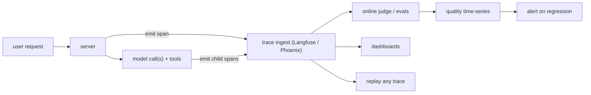

# Observability

> **Prereq:** [Cost & Latency](./cost-latency). Observability is what tells you whether your cost optimizations also broke something.

## TL;DR

- LLM systems need **three layers of observation** that map cleanly to web-app analogues: **traces** (every input, every tool call, every token, every output), **online evals** (a judge that scores live traffic and produces a quality time-series), and **regression detection** (alerts when a deploy moved a metric).
- **Langfuse, Phoenix, and LangSmith** are the 2026 production reference stacks. Langfuse and Phoenix are OSS; LangSmith is paid but tightest with LangChain. They all model the same OpenTelemetry-style trace tree: trace → span → tool/llm call → tokens.
- **Online evals are not unit tests.** Unit tests run on a fixed dataset; online evals score *real user traffic*, surface drift, and feed regressions into your CI loop.
- **Five metrics to track from day one:** latency (TTFT + TPOT), cost ($/request), trace volume, fail rate (parse errors, refusals), and a single quality score from your judge model. Everything else is derivative.
- **Cost-down without observability = quality-down silently.** Every lever from the previous lesson is a regression risk; you cannot ship them safely without the harness on.

## Why this matters

The single most common production-LLM failure mode in 2024–2026 is *silent quality regression* — a routing change, a quantization swap, a prompt update, or a model upgrade lands, average latency improves, the eval doesn't move, and three weeks later support tickets reveal the model started giving wrong answers on a specific class of queries. **Without traces, online evals, and a regression alarm, you wouldn't have caught it.**

Observability is also what unlocks every "we should iterate on the prompt" conversation. You need to be able to grep across last week's traffic, find the failed conversations, replay them, and verify your fix in seconds. A team that can do this iterates 10× faster than one that can't.

## Mental model



The trace tree is the substrate. Everything else — dashboards, evals, alerts, replay — is a query against it.

## Concrete walkthrough

### Layer 1 — Tracing

A trace is a tree of spans. The root is one user request. Children are model calls, tool calls, retrieval calls, sub-LLM calls. Every span has: a name, a start/end time, an input, an output, a status (ok/error), and arbitrary metadata (model name, sampling params, tokens, cost).

The wire format is OpenTelemetry-compatible. Every modern stack (Langfuse, Phoenix, LangSmith) accepts OTel; many production teams emit to multiple sinks at once.

```python
# Langfuse-style instrumentation. The decorator captures inputs/outputs/timing.
from langfuse import observe

@observe(name="answer_user_query")
def answer(query: str) -> str:
    docs = retrieve(query)              # auto-traced as a child span
    plan = small_model.plan(query, docs) # ditto
    if confidence(plan) > 0.7:
        return small_model.answer(plan)
    return big_model.answer(plan)        # different span, different model

# All four function calls show up as nested spans in one trace.
```

In production what matters is **what you put in metadata**. Recommended fields:

| Field          | Why |
|----------------|-----|
| `user_id`      | Per-user quality and cost dashboards. |
| `session_id`   | Multi-turn replay. |
| `prompt_version` | Which template was active. |
| `model`        | Which model answered (small or big in routed setups). |
| `tokens_in/out`| Cost reconciliation. |
| `prefix_hit`   | Did APC hit? Per-trace view of [prefix caching](../../llm-architecture/kv-cache/prefix-radix). |
| `eval_score`   | Filled in async by the judge. |

Skip `user_message` if it's PII-sensitive; redact server-side before emitting.

### Layer 2 — Online evals

A judge — usually a small LLM, sometimes a finetuned classifier — scores **live traces** in the background. Score schemas you'll actually use:

| Score                     | What it measures                                | How |
|---------------------------|-------------------------------------------------|-----|
| **Faithfulness**          | Does the answer match the retrieved docs?       | Judge prompt + RAG context |
| **Helpfulness**           | Does it answer the user's actual question?      | Judge prompt |
| **Refusal correctness**   | Did we refuse correctly (not over-refuse)?      | Judge prompt with task definition |
| **Format compliance**     | Did it emit valid JSON / call the right tool?   | Programmatic check (no LLM needed) |
| **Latency p99**           | TPOT, TTFT distributions                        | From the trace |
| **User signal (sparse)**  | 👍/👎 from the UI                                | Direct user feedback |

The killer move: **your evals run on every production trace, asynchronously, and produce a time-series**. You don't run them only at deploy time on a frozen dataset — you run them continuously on the live traffic distribution.

```python
# Async judge — runs in a worker, scores last 5 minutes of traces.
def judge_recent(window_min=5):
    for trace in langfuse.get_traces(since=now() - window_min * 60):
        if trace.metadata.get("eval_score") is not None: continue
        score = judge_model.complete(
            "Score 1-5: Did the answer faithfully address the question?",
            context=trace.input, answer=trace.output,
        )
        langfuse.update(trace.id, eval_score=parse_score(score))
```

Score histograms over time are what you watch. A 0.2-point drop in faithfulness over a 24-hour window is your alert.

### Layer 3 — Regression detection

Three forms, in increasing rigor:

1. **Threshold alerts.** "Faithfulness below 4.2 for >30 min → page." Cheap, noisy, often disabled within a week.
2. **Time-series anomaly detection.** Compare current 1h window to last 7-day distribution. Slack alert on >2σ drift. Better signal-to-noise.
3. **A/B with shadow traffic.** New deploy gets 5% of traffic; eval scores compared to control's 95%. Statistically meaningful regressions get auto-rolled-back.

Most teams do (1) for the first 6 months, then upgrade to (2). (3) is the "we know what we're doing" final state — typically required before any team feels safe shipping daily.

### What goes on the dashboard

Five panels, in order of importance:

1. **TTFT and TPOT distributions** (P50, P99) over time, broken out by model.
2. **Cost per 1K requests** rolling 24h.
3. **Quality score** (from the judge) — line chart over time, with deploy markers.
4. **Failure rate** — refusals, parse errors, judge-marked low-quality.
5. **Top-N slow traces** of the last hour, with deep-link to the trace tree.

Anything else is optional. These five are what stops a 3 AM page becoming a 3-day incident.

### Replay and prompt iteration

The single largest productivity multiplier on an LLM team is "I can grab any trace, edit the prompt or the routing decision, and re-run it instantly." Both Langfuse and Phoenix ship a "Playground" / "Prompts" view that does exactly this.

The discipline:

1. Find a failed trace via your dashboard or grep.
2. Open it; see inputs, intermediates, outputs.
3. Hit "Replay" with a candidate prompt change.
4. If output is better, save the new prompt version. The trace is automatically tagged with `prompt_version`.
5. Roll out to canary; watch the eval score for that prompt version.

This is the loop. Teams that don't have this loop spend their iteration budget on theory; teams that do iterate on data.

## Run it in your browser — a tiny tracer + judge

<RunInBrowser
  description="A 60-line in-memory tracing stack. Spans, child spans, async judge, and a P99 calculation."
  code={`from dataclasses import dataclass, field
from time import perf_counter
from contextlib import contextmanager
from collections import defaultdict
import random
import statistics

@dataclass
class Span:
    name: str
    start: float
    end: float | None = None
    parent: "Span | None" = None
    metadata: dict = field(default_factory=dict)
    children: list = field(default_factory=list)
    @property
    def duration_ms(self): return ((self.end or self.start) - self.start) * 1000

class Tracer:
    def __init__(self): self.traces, self.stack = [], []
    @contextmanager
    def span(self, name, **md):
        s = Span(name=name, start=perf_counter(), parent=self.stack[-1] if self.stack else None, metadata=md)
        if s.parent: s.parent.children.append(s)
        else: self.traces.append(s)
        self.stack.append(s)
        try: yield s
        finally:
            s.end = perf_counter(); self.stack.pop()

tracer = Tracer()
random.seed(42)

def fake_llm(prompt, latency_ms_mean=80):
    """Pretend LLM call. Sometimes 'fails' (fake refusal) at 5% rate."""
    delay = random.gauss(latency_ms_mean, latency_ms_mean / 4) / 1000
    if delay < 0: delay = 0.001
    perf_counter()
    end = perf_counter() + delay
    while perf_counter() < end: pass
    if random.random() < 0.05:
        return "Sorry, I can't help with that."
    return "Here's the answer."

def answer(query):
    with tracer.span("answer_user_query", user="alice", model="big") as root:
        with tracer.span("retrieve") as r:
            r.metadata["docs"] = 5
            fake_llm("retrieve", latency_ms_mean=20)
        with tracer.span("plan", model="small") as p:
            plan = fake_llm("plan", latency_ms_mean=40)
        with tracer.span("answer", model="big") as a:
            out = fake_llm(plan, latency_ms_mean=120)
            a.metadata["output"] = out
        return out

# Generate 200 fake traces
for _ in range(200):
    answer(f"q-{_}")

# Aggregate stats — what a Grafana panel would show.
all_spans = []
def walk(s):
    all_spans.append(s)
    for c in s.children: walk(c)
for t in tracer.traces: walk(t)

by_name = defaultdict(list)
for s in all_spans: by_name[s.name].append(s.duration_ms)

print(f"{'span':<22} {'count':>6} {'p50ms':>8} {'p99ms':>8}")
print("-" * 50)
for name, ds in sorted(by_name.items()):
    p50 = statistics.median(ds)
    p99 = statistics.quantiles(ds, n=100)[-2] if len(ds) > 50 else max(ds)
    print(f"{name:<22} {len(ds):>6} {p50:>8.1f} {p99:>8.1f}")

# Async judge — score the answers. (Here, just a coin flip of the canned response.)
n_low = sum(1 for s in tracer.traces if s.children and s.children[-1].metadata.get("output", "").startswith("Sorry"))
print(f"\\njudge: {n_low}/{len(tracer.traces)} traces flagged as refusals = {n_low/len(tracer.traces):.1%}")
`}
/>

The shape is what matters: a tracer captures spans; an aggregator turns them into P50/P99; a judge scores the leaves. Production systems are this with persistence, sampling, and a UI on top.

## Quick check

<FillIn
  prompt="The single highest-leverage observability practice — score *what* asynchronously?"
  answer="live production traces"
  accept={["live traffic", "production traffic", "every trace", "real user traces"]}
  hint="Not test-set evals. Not deploy-time evals. The traffic that's actually happening right now."
  explanation="Online evals on live traces produce a continuous quality time-series that catches regressions a frozen test set will miss — distribution drift, prompt-template bugs, model upgrades that break edge cases. The async-on-live-traffic loop is what separates teams that iterate from teams that hope."
/>

<Quiz
  question="A team rolled out FP8 KV cache and saw cost drop 40%. They're celebrating. What's their highest-leverage *next* action?"
  options={[
    'Roll out FP8 to more services.',
    'Verify their online eval score didn\'t move (or canary the rollout while watching the score).',
    'Negotiate a B200 reservation.',
    'Add more dashboards.',
  ]}
  answer={1}
  explanation="A cost win without a quality check is a regression risk. FP8 KV is one of the safer quantization moves but it does occasionally regress on long-context or low-frequency-language workloads. The first thing every cost-down deploy should trigger is an evaluation against the judge time-series; the second is a canary if the rollout was fleet-wide. Celebrating before checking is how silent regressions ship."
/>

## Key takeaways

1. **Three layers: traces, online evals, regression alerts.** Each has an OSS reference (Langfuse / Phoenix) — pick one and instrument from day one.
2. **Online evals run on live traffic, not test sets.** That's the loop that catches drift.
3. **Five-panel dashboard: TTFT/TPOT, $/1K requests, quality score, fail rate, top-N slow traces.** Everything else is optional.
4. **Replay loop is the productivity multiplier.** "Find a failed trace → tweak prompt → re-run" is the daily-driver workflow of any team that ships fast.
5. **Cost-down without quality-up is a trap.** Every lever from the previous lesson is a regression risk; observability is what makes them safe.

## Go deeper

<Resources
  items={[
    { kind: 'docs', href: 'https://langfuse.com/docs', title: 'Langfuse Documentation', note: 'OSS LLM observability stack. The data model section explains the trace tree exactly. Self-host or cloud.' },
    { kind: 'docs', href: 'https://docs.arize.com/phoenix', title: 'Arize Phoenix Documentation', note: 'OSS, OpenTelemetry-native. Stronger evals story than Langfuse; weaker self-hosting story.' },
    { kind: 'docs', href: 'https://docs.smith.langchain.com/', title: 'LangSmith Documentation', note: 'Paid, LangChain-tightest. Best replay/playground UI in 2026; vendor lock-in is real.' },
    { kind: 'paper', href: 'https://arxiv.org/abs/2310.06770', title: 'SWE-bench: Can LM Resolve Real-World GitHub Issues?', author: 'Jimenez et al., 2023', note: 'The eval-on-real-traffic philosophy applied to coding. Read for the eval design intuition.' },
    { kind: 'blog', href: 'https://hamel.dev/blog/posts/evals/', title: 'Hamel Husain — Your AI Product Needs Evals', note: 'The clearest practitioner essay on online vs offline evals. Required reading.' },
    { kind: 'blog', href: 'https://eugeneyan.com/writing/llm-patterns/', title: 'Eugene Yan — LLM Patterns', note: 'Six high-leverage patterns including evals; the regression-loop section is gold.' },
    { kind: 'repo', href: 'https://github.com/langfuse/langfuse', title: 'langfuse/langfuse', note: 'Reference implementation. Read `web/src/server/api/routers/traces.ts` for the data model and `worker/src/queues/` for the async judge.' },
    { kind: 'repo', href: 'https://github.com/Arize-ai/phoenix', title: 'Arize-ai/phoenix', note: 'Phoenix internals; particularly the OpenInference span semantics.' },
  ]}
/>

<LessonComplete />
