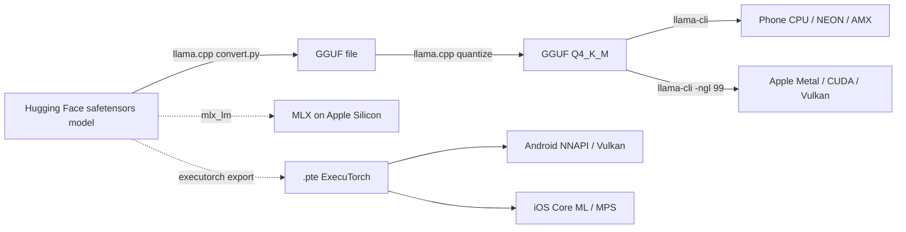

# On-Device Inference

## TL;DR

- **llama.cpp** is the universal runtime: CPU, Apple Metal, CUDA, Vulkan. GGUF format. If you don't know what to run, run llama.cpp.
- **MLX** (Apple) uses unified memory on M-series chips — fastest path on a Mac. PyTorch-shaped Python API.
- **ExecuTorch** is PyTorch's mobile/edge runtime; produces `.pte` files for Android (NNAPI / Vulkan) and iOS (Core ML / MPS).
- **A 4-bit Q4_K_M quantized 8B model fits in ~5 GB and runs at 5–15 tokens/sec on a modern phone.** Genuinely usable.
- The unlock is **K-quants** (mixed precision per row) and Apple/ARM kernels that fuse dequant + matmul.

## Why this matters

Cloud inference has hard limits: latency, privacy, cost, offline. On-device flips them all. A 2026 phone can run an 8B model that, on benchmarks 18 months earlier, only ran in a datacenter. The open-source stack is good enough that anyone can ship a private offline AI assistant — if they know which runtime to pick and how to quantize.

## Mental model



The convergence point is always *quantize, then ship a single binary file*. The runtime decides how to use it.

## Concrete walkthrough — running Llama-3.2-3B-Instruct on a phone

Step 1: get the model. (Skip if you've downloaded a GGUF directly from a community model repo.)

```bash
git clone https://github.com/ggerganov/llama.cpp && cd llama.cpp
make -j  # or `cmake -B build -DGGML_METAL=on && cmake --build build` on Mac

# Convert HF safetensors → GGUF (BF16)
python convert_hf_to_gguf.py /path/to/Llama-3.2-3B-Instruct \
    --outfile llama-3.2-3b-bf16.gguf

# Quantize: BF16 → Q4_K_M (~2.0 GB, sweet spot for quality/size)
./llama-quantize llama-3.2-3b-bf16.gguf llama-3.2-3b-Q4_K_M.gguf Q4_K_M
```

Step 2: run it.

```bash
# CPU / generic
./llama-cli -m llama-3.2-3b-Q4_K_M.gguf -p "Why is the sky blue?" -n 128

# Apple Metal (M-series)
./llama-cli -m llama-3.2-3b-Q4_K_M.gguf -ngl 99 -p "Why is the sky blue?"
```

Step 3: ship to a phone. Two paths:

- **Android**: build llama.cpp for ARM64, ship the binary in your app, drop the GGUF in app storage. There are pre-built JNI wrappers (e.g., `llama-jni`, `llama.cpp-android` examples in the repo's `examples/llama.android/`).
- **iOS**: same, but build with `-DGGML_METAL=on`. The `examples/llama.swiftui/` example ships a working SwiftUI chat app you can compile in Xcode.

**Real numbers** on consumer hardware (Q4_K_M, 8B model, prompt eval + decode):

| Device                      | Decode tok/s | Notes |
| --------------------------- | ------------ | ----- |
| iPhone 15 Pro (A17 Pro)     | 12–18        | Metal backend; warm thermals matter |
| Pixel 8 Pro (Tensor G3)     | 8–12         | CPU only; GPU compute uneven |
| MacBook Air M3              | 35–50        | Metal; 8GB unified memory tight |
| Raspberry Pi 5              | 2–4          | NEON CPU only; usable for tiny models |
| RTX 4090 (desktop CUDA)     | 130–200      | reference |

## Run it in your browser

You can't run a 3B model in the browser yet — you can run a tiny one. This snippet computes how big a model your specific phone can handle.

<RunInBrowser
  description="Plug in your device's RAM and see what fits."
  code={`def fits_on_device(model_params_b, bits=4, ram_gb=8, headroom_gb=2):
    """How much RAM a quantized model needs, vs. how much your device has."""
    bytes_per_weight = bits / 8
    weight_gb = model_params_b * 1e9 * bytes_per_weight / 1024**3
    kv_overhead_gb = 0.5  # rough, for short contexts
    needed = weight_gb + kv_overhead_gb
    available = ram_gb - headroom_gb
    return weight_gb, needed, available, needed <= available

# Common model sizes × your phone
for params_b in [1, 3, 7, 8, 13, 70]:
    for ram in [4, 6, 8, 12, 16]:
        wgt, need, avail, ok = fits_on_device(params_b, bits=4, ram_gb=ram)
        flag = "✓" if ok else "✗"
        print(f"{flag} {params_b:>3}B @ Q4 needs {need:>4.1f} GB | "
              f"device w/ {ram:>2} GB RAM has {avail:>4.1f} GB free")
    print()
`}
/>

Rule of thumb: you need ~`params_B × 0.6 GB` for a Q4_K_M model plus ~1 GB headroom. An 8 GB phone can run up to ~7B; 12 GB can run 13B; 70B is desktop-only without aggressive quantization.

## Run it on real hardware

<ColabLink
  href="https://colab.research.google.com/github/your-github/mosaic-notebooks/blob/main/on-device.ipynb"
  description="Quantize Llama-3.2-3B to Q4_K_M, run inference, measure tok/s on Colab CPU. Then we walk through getting it onto your phone."
/>

## Quick check

<Quiz
  question="You want to ship a private offline chat app on iPhones with 8 GB of RAM. Which is the most realistic plan for 2026?"
  options={[
    'Run a 70B model with INT8 weights via Core ML.',
    'Run a 7–8B model with Q4_K_M quantization via llama.cpp + Metal.',
    'Stream a cloud model and cache responses locally.',
    'Use ExecuTorch to compile the model into a single 100 MB binary.',
  ]}
  answer={1}
  explanation="A 7B Q4_K_M model is ~4 GB on disk and fits in iPhone RAM with headroom. llama.cpp's Metal backend delivers ~12-18 tok/s on A17 Pro. Plenty for a chat UX. 70B even at INT4 (35 GB) won't fit; ExecuTorch can't compress weights below the format limit; cloud streaming defeats the offline goal."
/>

## Key takeaways

1. **Quantize aggressively.** Q4_K_M is the standard sweet spot; Q5_K_M if quality matters more than size; Q3_K_S for the absolute smallest viable run.
2. **Pick a runtime by your platform.** Apple → MLX or llama.cpp+Metal. Android → llama.cpp+Vulkan or ExecuTorch+NNAPI. Cross-platform → llama.cpp.
3. **Memory bandwidth, not compute, is the bottleneck.** On phone hardware, decode speed is set by how fast you can read the weights — which is exactly why quantization works.
4. **Test on the real device.** Phone thermals throttle hard after 30 seconds — sustained tok/s is often half of peak.

## Go deeper

<Resources
  items={[
    { kind: 'repo', href: 'https://github.com/ggerganov/llama.cpp', title: 'ggerganov/llama.cpp', note: 'The reference. Read the README and the `examples/` folder.' },
    { kind: 'repo', href: 'https://github.com/ml-explore/mlx-examples', title: 'ml-explore/mlx-examples', note: 'Apple\'s MLX with worked examples for Llama, Mistral, Whisper.' },
    { kind: 'docs', href: 'https://pytorch.org/executorch/stable/index.html', title: 'ExecuTorch documentation', note: 'PyTorch\'s mobile/edge runtime. The path of least resistance for production Android/iOS.' },
    { kind: 'blog', href: 'https://huggingface.co/docs/hub/gguf', title: 'GGUF format on Hugging Face', note: 'What\'s actually in a GGUF file. Useful when debugging conversion issues.' },
    { kind: 'video', href: 'https://www.youtube.com/watch?v=zjkBMFhNj_g', title: 'Karpathy — Let\'s build GPT', author: 'Andrej Karpathy', note: 'For why the math reduces to weight-streaming and why quantization wins.' },
  ]}
/>

<LessonComplete />
