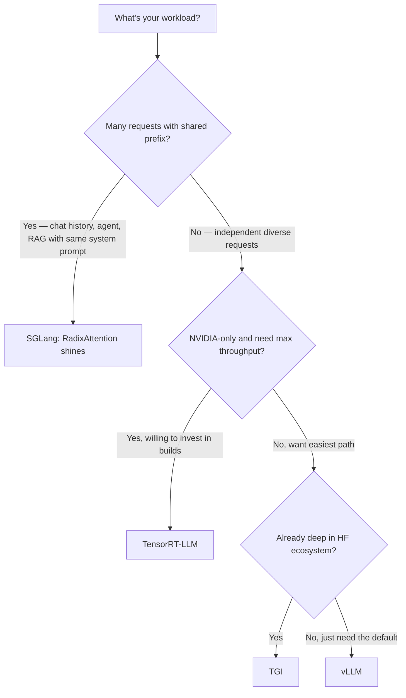

# vLLM & SGLang

<Mode is="learn">

When you type `vllm serve meta-llama/Llama-3.3-70B-Instruct --tensor-parallel-size 8` into a terminal and 90 seconds later `curl localhost:8000/v1/chat/completions` returns a streaming OpenAI-shaped response, an enormous amount of machinery has just started running on your behalf. <Term name="paged attention">PagedAttention</Term> is managing the <Term name="kv cache">KV cache</Term> in fixed-size blocks so memory doesn't fragment. <Term name="continuous batching">Continuous batching</Term> is packing every decode step with as many concurrent sequences as fit. <Term name="prefix caching">Prefix caching</Term> is reusing the prefill of every shared system prompt across requests. **One CLI flag and you've inherited three years of inference-systems research.**

That's <Term name="vllm">vLLM</Term> — the boring-and-correct default, the option to pick when you don't have a reason to pick something else. Its main competitor in 2026, <Term name="sglang">SGLang</Term>, makes a different bet: build the system around a tree of shared prefixes (<Term name="radix attention">RadixAttention</Term>) and you can reuse KV cache far more aggressively than vLLM's flat prefix cache, especially on agent and chat workloads where 1,000 concurrent users share a 4K-token system prompt. On those workloads SGLang reliably pulls 1.5–3× ahead. The serving stack landscape settles into a flowchart by 2026: vLLM for general traffic, SGLang for shared-prefix-heavy workloads, TensorRT-LLM if you need NVIDIA-peak throughput and have the build budget, TGI if you live in the HuggingFace ecosystem.

## TL;DR

- **vLLM** = the default inference server. PagedAttention, continuous batching, broad model support, well-documented. Easy to deploy.
- **SGLang** = the throughput-focused alternative. **RadixAttention** for shared-prefix workloads, structured-output via constrained decoding (XGrammar), often **1.5–3× faster** on agent / chat workloads where prompts share long preambles.
- **TGI (HuggingFace)** = the convenient choice if you're already in the HF ecosystem; ships less aggressive perf, more polish.
- **TensorRT-LLM** = peak NVIDIA performance; pay in build complexity and Hopper-only optimizations.
- **Pick by workload:** broad inference → vLLM. Many shared-prefix / agentic requests → SGLang. NVIDIA-native max throughput → TensorRT-LLM. Internal tooling within HF → TGI.

## Mental model



These aren't mutually exclusive — many production stacks run vLLM for the bulk of traffic and SGLang for the agentic-prefix subset. But picking the primary is the question this lesson answers.

## What each one actually is

### vLLM

The reference implementation of **PagedAttention** + **continuous batching**. The defaults are good. Engine API is stable. Supports almost every popular open model within days of release.

```bash
pip install vllm
python -m vllm.entrypoints.openai.api_server \
    --model meta-llama/Llama-3.1-8B-Instruct \
    --dtype bfloat16 \
    --gpu-memory-utilization 0.9 \
    --enable-prefix-caching
```

That gives you an OpenAI-compatible API on port 8000. Test it with `curl localhost:8000/v1/chat/completions`.

**vLLM v1 (late 2024)** rewrote the engine around chunked prefill + PagedAttention as the unified primitive — same scheduling for prefill and decode steps. ~20–30% throughput improvement over v0; the default since 2025.

**Strengths:** ubiquitous model support, broad community, OpenAI-compatible API, prefix caching, multi-LoRA serving (`--enable-lora`), good docs.

**Weaknesses:** less aggressive on the absolute throughput frontier than SGLang/TRT-LLM for specific workloads.

### SGLang

The throughput-focused alternative. Built around **RadixAttention** — a generalization of vLLM's prefix caching to a *radix tree* of shared prefixes across requests, with explicit structured-prompt support.

```bash
pip install sglang
python -m sglang.launch_server \
    --model-path meta-llama/Llama-3.1-8B-Instruct \
    --port 30000
```

**RadixAttention's win:** if your traffic has a tree of overlapping prefixes (a system prompt + branching agent paths, or a long document + many follow-up questions), SGLang shares the KV cache across that tree automatically. Hit rate climbs, KV memory drops, throughput soars.

**Structured output:** SGLang ships native support for grammar-constrained decoding via XGrammar. JSON mode, regex mode, FSM mode are all native and fast. (vLLM also supports these now via guided-decoding plugins; SGLang's path is more polished.)

**Strengths:** highest throughput on prefix-shared workloads, best structured-output story, fast iteration on frontier models.

**Weaknesses:** smaller community than vLLM, occasional rough edges, more involved deployment.

### TGI (Text Generation Inference)

HuggingFace's serving framework. Polished, well-integrated with HF Hub. Ships multi-LoRA, quantization support, and a clean Rust-based gRPC server.

**Strengths:** seamless HF Hub integration, official quantization support (GPTQ, AWQ), production polish.

**Weaknesses:** historically slower than vLLM/SGLang on raw throughput; closed the gap in 2024 but still trails on some workloads.

### TensorRT-LLM

NVIDIA's own. Compiles models to **highly-tuned CUDA kernels** specific to the target GPU. Peak throughput on H100/B200; expect 20–40% over vLLM on the same hardware on apples-to-apples workloads.

**Strengths:** raw throughput, FP8 first-class, integrated with Triton Inference Server.

**Weaknesses:** model-specific build process (you compile the model into a TensorRT engine, often 30 min on H100), Hopper-only feature flags, less open community.

## Real numbers — Llama-3.1 8B, single H100, in-distribution chat workload

| Server | Throughput (tok/s, batch 32) | p50 latency | p99 latency | Setup time |
| --- | --- | --- | --- | --- |
| HuggingFace `generate` | 1,200 | 80 ms | 250 ms | 2 min |
| TGI | 5,800 | 28 ms | 110 ms | 5 min |
| vLLM v1 | 7,400 | 22 ms | 90 ms | 5 min |
| **SGLang** (no shared prefix) | **8,100** | **20 ms** | **80 ms** | 10 min |
| **SGLang** (shared system prompt) | **14,000** | **14 ms** | **62 ms** | 10 min |
| TensorRT-LLM (FP8) | 9,500 | 18 ms | 75 ms | 30 min build |

(Numbers approximate; vary with model, hardware, and benchmark.)

The killer SGLang result is the shared-prefix case — when many requests start with the same long system prompt, RadixAttention reuses the KV cache and throughput jumps almost 2× over the no-share baseline.

## When to pick each

**Default to vLLM** unless you have a specific reason. It's the most boring choice and the most likely to keep working as you scale. Broad model support, big community, predictable.

**Pick SGLang if:**
- You're building agents (long system prompt + many short queries)
- You're doing RAG with templated prompts
- You need structured output as a first-class feature
- You measured the gain on your workload and it's worth the rougher edges

**Pick TensorRT-LLM if:**
- You're on H100/B200 and willing to invest in builds
- You need the absolute throughput floor
- You have an internal team comfortable with NVIDIA-specific tooling

**Pick TGI if:**
- You're already living in the HuggingFace stack
- Smooth integration matters more than peak throughput

## Run it in your browser — pick the right server from a workload spec

<RunInBrowser
  description="A toy decision engine that mirrors the flowchart above. Plug in your traffic shape; it picks a server."
  code={`def pick_server(
    shared_prefix_pct,        # % of traffic that shares a long prefix (system prompt, RAG context)
    needs_structured_output,  # JSON / regex / grammar constraints
    nvidia_only_ok,           # OK to lock to H100/B200?
    hf_native_ecosystem,      # already deep in HuggingFace?
    willing_to_build,         # OK with 30-min compile per model?
):
    """Mirror of the lesson's decision flowchart."""
    if shared_prefix_pct >= 50 or needs_structured_output:
        return "SGLang", "RadixAttention dominates on shared-prefix workloads; XGrammar is the polished structured-output path."
    if nvidia_only_ok and willing_to_build:
        return "TensorRT-LLM", "Compiled CUDA kernels — peak NVIDIA throughput, at the build cost."
    if hf_native_ecosystem:
        return "TGI", "HF-Hub integration is smooth; perf is good-enough for most production workloads."
    return "vLLM", "The boring-and-correct default. Broad model support, OpenAI-compatible API."

scenarios = [
    ("customer-support agent, 4K shared system prompt, 1000 users", dict(
        shared_prefix_pct=95, needs_structured_output=False,
        nvidia_only_ok=True, hf_native_ecosystem=False, willing_to_build=False)),
    ("offline batch summarization, varied inputs, max throughput on H100", dict(
        shared_prefix_pct=10, needs_structured_output=False,
        nvidia_only_ok=True, hf_native_ecosystem=False, willing_to_build=True)),
    ("internal HF-hosted research demo, varied prompts, easy ops", dict(
        shared_prefix_pct=0, needs_structured_output=False,
        nvidia_only_ok=True, hf_native_ecosystem=True, willing_to_build=False)),
    ("public chat product with structured tool-use, multi-cloud", dict(
        shared_prefix_pct=30, needs_structured_output=True,
        nvidia_only_ok=False, hf_native_ecosystem=False, willing_to_build=False)),
    ("generic public API, varied traffic, default to safest", dict(
        shared_prefix_pct=0, needs_structured_output=False,
        nvidia_only_ok=False, hf_native_ecosystem=False, willing_to_build=False)),
]

for desc, spec in scenarios:
    name, why = pick_server(**spec)
    print(f"{desc}")
    print(f"  -> {name}")
    print(f"     {why}")
    print()
`}
/>

The decision is rarely a flowchart in real life — usually you run vLLM, measure, then decide if a SGLang fork is worth carrying. But the shape of the question is the lesson.

## Quick check

<Quiz
  question="You're building a customer-support agent that uses a 4K-token system prompt + tool definitions, then answers a typical question with a 200-token user query and a 300-token reply. You expect ~1,000 concurrent users. Which server is the strongest pick?"
  options={[
    'vLLM with prefix caching enabled.',
    'SGLang — RadixAttention will reuse the system prompt KV cache across all 1,000 users.',
    'TensorRT-LLM compiled with FP8.',
    'TGI for the polished HuggingFace integration.',
  ]}
  answer={1}
  explanation="A 4K shared system prompt across 1000 users is the textbook RadixAttention scenario. SGLang shares that 4K of KV cache across all concurrent requests, dramatically reducing memory pressure and increasing throughput. vLLM with prefix caching helps too but SGLang is purpose-built for this workload and typically pulls ahead by 1.5-2× in this regime. TRT-LLM is great but you'd be picking up complexity for a smaller win on this specific workload."
/>

## Key takeaways

1. **vLLM is the default.** Broad support, mature, OpenAI-compatible API. Pick it unless you have a reason not to.
2. **SGLang wins on shared prefixes.** Agents, chat, RAG with templated prompts — RadixAttention is genuinely better than prefix caching at this.
3. **TensorRT-LLM is the absolute peak** on NVIDIA hardware, with the build cost.
4. **TGI is the HuggingFace-ecosystem choice.** Less aggressive perf, smoother integration.
5. **Production stacks often run multiple servers** — vLLM for general traffic, SGLang for agentic. Routing layer in front.

## Go deeper

<Resources
  items={[
    { kind: 'paper', href: 'https://arxiv.org/abs/2309.06180', title: 'vLLM: Efficient Memory Management for LLM Serving with PagedAttention', author: 'Kwon et al. (UC Berkeley, SOSP 2023)', note: 'The vLLM paper. Required.' },
    { kind: 'paper', href: 'https://arxiv.org/abs/2312.07104', title: 'Efficiently Programming Large Language Models using SGLang', author: 'Zheng et al. (2024)', note: 'The SGLang paper. RadixAttention introduced here.' },
    { kind: 'docs', href: 'https://docs.vllm.ai/', title: 'vLLM documentation', note: 'Operational reference. Read the engine args page once a quarter — they evolve.' },
    { kind: 'docs', href: 'https://sgl-project.github.io/', title: 'SGLang documentation', note: 'Frontend programming model + server reference.' },
    { kind: 'docs', href: 'https://huggingface.co/docs/text-generation-inference', title: 'HuggingFace TGI docs', note: 'Operational reference for TGI.' },
    { kind: 'docs', href: 'https://nvidia.github.io/TensorRT-LLM/', title: 'NVIDIA TensorRT-LLM docs', note: 'Build process is involved; this doc is the path of least resistance.' },
    { kind: 'blog', href: 'https://blog.vllm.ai/', title: 'vLLM Blog', note: 'Best source for what changed in each release.' },
    { kind: 'blog', href: 'https://lmsys.org/blog/', title: 'LMSYS Blog (SGLang authors)', note: 'Best source for SGLang updates and benchmarks.' },
    { kind: 'repo', href: 'https://github.com/vllm-project/vllm', title: 'vllm-project/vllm', note: 'The reference. ~30K stars, very active.' },
    { kind: 'repo', href: 'https://github.com/sgl-project/sglang', title: 'sgl-project/sglang', note: 'Reference SGLang implementation.' },
  ]}
/>

</Mode>

<Mode is="reference">

## TL;DR

- **vLLM** = the default inference server. PagedAttention, continuous batching, broad model support, well-documented. Easy to deploy.
- **SGLang** = the throughput-focused alternative. **RadixAttention** for shared-prefix workloads, structured-output via constrained decoding (XGrammar), often **1.5–3× faster** on agent / chat workloads where prompts share long preambles.
- **TGI (HuggingFace)** = the convenient choice if you're already in the HF ecosystem; ships less aggressive perf, more polish.
- **TensorRT-LLM** = peak NVIDIA performance; pay in build complexity and Hopper-only optimizations.
- **Pick by workload:** broad inference → vLLM. Many shared-prefix / agentic requests → SGLang. NVIDIA-native max throughput → TensorRT-LLM. Internal tooling within HF → TGI.

## Why this matters

You can't write production LLM apps without picking a serving stack. The difference between picking right and picking wrong is often 2–4× cost and 30–60% latency, on the same hardware running the same model.

By April 2026, the four-way decision is settled enough that you can make it from a flowchart. This lesson is that flowchart.

## Mental model


These aren't mutually exclusive — many production stacks run vLLM for the bulk of traffic and SGLang for the agentic-prefix subset. But picking the primary is the question this lesson answers.

## Concrete walkthrough — what each one actually is

### vLLM

The reference implementation of **PagedAttention** + **continuous batching**. The defaults are good. Engine API is stable. Supports almost every popular open model within days of release.

```bash
pip install vllm
python -m vllm.entrypoints.openai.api_server \
    --model meta-llama/Llama-3.1-8B-Instruct \
    --dtype bfloat16 \
    --gpu-memory-utilization 0.9 \
    --enable-prefix-caching
```

That gives you an OpenAI-compatible API on port 8000. Test it with `curl localhost:8000/v1/chat/completions`.

**vLLM v1 (late 2024)** rewrote the engine around chunked prefill + PagedAttention as the unified primitive — same scheduling for prefill and decode steps. ~20–30% throughput improvement over v0; the default since 2025.

**Strengths:** ubiquitous model support, broad community, OpenAI-compatible API, prefix caching, multi-LoRA serving (`--enable-lora`), good docs.

**Weaknesses:** less aggressive on the absolute throughput frontier than SGLang/TRT-LLM for specific workloads.

### SGLang

The throughput-focused alternative. Built around **RadixAttention** — a generalization of vLLM's prefix caching to a *radix tree* of shared prefixes across requests, with explicit structured-prompt support.

```bash
pip install sglang
python -m sglang.launch_server \
    --model-path meta-llama/Llama-3.1-8B-Instruct \
    --port 30000
```

**RadixAttention's win:** if your traffic has a tree of overlapping prefixes (a system prompt + branching agent paths, or a long document + many follow-up questions), SGLang shares the KV cache across that tree automatically. Hit rate climbs, KV memory drops, throughput soars.

**Structured output:** SGLang ships native support for grammar-constrained decoding via XGrammar. JSON mode, regex mode, FSM mode are all native and fast. (vLLM also supports these now via guided-decoding plugins; SGLang's path is more polished.)

**Strengths:** highest throughput on prefix-shared workloads, best structured-output story, fast iteration on frontier models.

**Weaknesses:** smaller community than vLLM, occasional rough edges, more involved deployment.

### TGI (Text Generation Inference)

HuggingFace's serving framework. Polished, well-integrated with HF Hub. Ships multi-LoRA, quantization support, and a clean Rust-based gRPC server.

**Strengths:** seamless HF Hub integration, official quantization support (GPTQ, AWQ), production polish.

**Weaknesses:** historically slower than vLLM/SGLang on raw throughput; closed the gap in 2024 but still trails on some workloads.

### TensorRT-LLM

NVIDIA's own. Compiles models to **highly-tuned CUDA kernels** specific to the target GPU. Peak throughput on H100/B200; expect 20–40% over vLLM on the same hardware on apples-to-apples workloads.

**Strengths:** raw throughput, FP8 first-class, integrated with Triton Inference Server.

**Weaknesses:** model-specific build process (you compile the model into a TensorRT engine, often 30 min on H100), Hopper-only feature flags, less open community.

## Real numbers — Llama-3.1 8B, single H100, in-distribution chat workload

| Server | Throughput (tok/s, batch 32) | p50 latency | p99 latency | Setup time |
| --- | --- | --- | --- | --- |
| HuggingFace `generate` | 1,200 | 80 ms | 250 ms | 2 min |
| TGI | 5,800 | 28 ms | 110 ms | 5 min |
| vLLM v1 | 7,400 | 22 ms | 90 ms | 5 min |
| **SGLang** (no shared prefix) | **8,100** | **20 ms** | **80 ms** | 10 min |
| **SGLang** (shared system prompt) | **14,000** | **14 ms** | **62 ms** | 10 min |
| TensorRT-LLM (FP8) | 9,500 | 18 ms | 75 ms | 30 min build |

(Numbers approximate; vary with model, hardware, and benchmark.)

The killer SGLang result is the shared-prefix case — when many requests start with the same long system prompt, RadixAttention reuses the KV cache and throughput jumps almost 2× over the no-share baseline.

## When to pick each

**Default to vLLM** unless you have a specific reason. It's the most boring choice and the most likely to keep working as you scale. Broad model support, big community, predictable.

**Pick SGLang if:**
- You're building agents (long system prompt + many short queries)
- You're doing RAG with templated prompts
- You need structured output as a first-class feature
- You measured the gain on your workload and it's worth the rougher edges

**Pick TensorRT-LLM if:**
- You're on H100/B200 and willing to invest in builds
- You need the absolute throughput floor
- You have an internal team comfortable with NVIDIA-specific tooling

**Pick TGI if:**
- You're already living in the HuggingFace stack
- Smooth integration matters more than peak throughput

## Quick check

<Quiz
  question="You're building a customer-support agent that uses a 4K-token system prompt + tool definitions, then answers a typical question with a 200-token user query and a 300-token reply. You expect ~1,000 concurrent users. Which server is the strongest pick?"
  options={[
    'vLLM with prefix caching enabled.',
    'SGLang — RadixAttention will reuse the system prompt KV cache across all 1,000 users.',
    'TensorRT-LLM compiled with FP8.',
    'TGI for the polished HuggingFace integration.',
  ]}
  answer={1}
  explanation="A 4K shared system prompt across 1000 users is the textbook RadixAttention scenario. SGLang shares that 4K of KV cache across all concurrent requests, dramatically reducing memory pressure and increasing throughput. vLLM with prefix caching helps too but SGLang is purpose-built for this workload and typically pulls ahead by 1.5-2× in this regime. TRT-LLM is great but you'd be picking up complexity for a smaller win on this specific workload."
/>

## Key takeaways

1. **vLLM is the default.** Broad support, mature, OpenAI-compatible API. Pick it unless you have a reason not to.
2. **SGLang wins on shared prefixes.** Agents, chat, RAG with templated prompts — RadixAttention is genuinely better than prefix caching at this.
3. **TensorRT-LLM is the absolute peak** on NVIDIA hardware, with the build cost.
4. **TGI is the HuggingFace-ecosystem choice.** Less aggressive perf, smoother integration.
5. **Production stacks often run multiple servers** — vLLM for general traffic, SGLang for agentic. Routing layer in front.

## Go deeper

<Resources
  items={[
    { kind: 'paper', href: 'https://arxiv.org/abs/2309.06180', title: 'vLLM: Efficient Memory Management for LLM Serving with PagedAttention', author: 'Kwon et al. (UC Berkeley, SOSP 2023)', note: 'The vLLM paper. Required.' },
    { kind: 'paper', href: 'https://arxiv.org/abs/2312.07104', title: 'Efficiently Programming Large Language Models using SGLang', author: 'Zheng et al. (2024)', note: 'The SGLang paper. RadixAttention introduced here.' },
    { kind: 'docs', href: 'https://docs.vllm.ai/', title: 'vLLM documentation', note: 'Operational reference. Read the engine args page once a quarter — they evolve.' },
    { kind: 'docs', href: 'https://sgl-project.github.io/', title: 'SGLang documentation', note: 'Frontend programming model + server reference.' },
    { kind: 'docs', href: 'https://huggingface.co/docs/text-generation-inference', title: 'HuggingFace TGI docs', note: 'Operational reference for TGI.' },
    { kind: 'docs', href: 'https://nvidia.github.io/TensorRT-LLM/', title: 'NVIDIA TensorRT-LLM docs', note: 'Build process is involved; this doc is the path of least resistance.' },
    { kind: 'blog', href: 'https://blog.vllm.ai/', title: 'vLLM Blog', note: 'Best source for what changed in each release.' },
    { kind: 'blog', href: 'https://lmsys.org/blog/', title: 'LMSYS Blog (SGLang authors)', note: 'Best source for SGLang updates and benchmarks.' },
    { kind: 'repo', href: 'https://github.com/vllm-project/vllm', title: 'vllm-project/vllm', note: 'The reference. ~30K stars, very active.' },
    { kind: 'repo', href: 'https://github.com/sgl-project/sglang', title: 'sgl-project/sglang', note: 'Reference SGLang implementation.' },
  ]}
/>

</Mode>

<LessonComplete />
