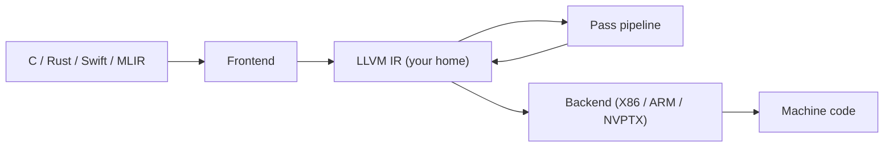

# LLVM IR Tour

<Mode is="learn">

In a managed-runtime language, you write code, the runtime executes it, and somewhere in the middle a JIT or interpreter does the work — but you never *see* the boundary. In a compiled language, the boundary is a real artifact: a textual intermediate representation the compiler emits and the optimizer chews on. In the LLVM-based world (Clang, Rustc, Swift, every modern AI compiler) that artifact is **<Term name="llvm ir">LLVM IR</Term>**.

LLVM IR is a small, RISC-like, strongly-typed virtual instruction set. It has the shape of assembly but the rigor of a typed language: every value is in <Term name="ssa">SSA</Term> form (defined exactly once), every integer carries its width, every memory access carries its type. It's the language all the front-ends speak in common — and the language every modern AI compiler eventually lowers to. Read a `.ll` dump from `clang -O0 -S -emit-llvm`, then again from `-O2`, and you can *see* the optimizer at work.

This lesson is the reading-fluency version: enough IR to read what `torch.compile`, IREE, Triton, and any modern AI compiler are actually generating.

## TL;DR

- LLVM IR is a **strongly-typed, SSA, RISC-like virtual instruction set**. The "language" between your source compiler and the actual machine. Once you can read it, you can read what every modern compiler is actually doing.
- It has **three forms**: the `.ll` text format (human-readable), the `.bc` bitcode binary, and the in-memory C++ `Module` API. They are all the same IR — round-trip lossless.
- Three building blocks: **Module → Function → BasicBlock → Instruction**. SSA means each value is defined exactly once. PHI nodes pick up control-flow merges.
- The **type system** is small but rigid: `i1, i8, i32, i64, float, double, half, bfloat`, plus pointers, vectors, structs, arrays. **No bare ints** — every integer carries its width.
- Almost every AI compiler eventually lowers to LLVM IR. MLIR's `llvm` dialect is *literally* this IR. Triton emits LLVM IR. JAX/XLA emits LLVM IR through StableHLO. **Knowing LLVM is the universal floor.**

## Mental model



Every box on the left and right is a different language. **The middle is one IR**, and it's the only language all the boxes have in common. Learn it once, read every compiler.

## Hello, IR

The smallest interesting program — adding two ints — in C and its LLVM IR:

```c
// add.c
int add(int a, int b) { return a + b; }
```

```
$ clang -O0 -S -emit-llvm add.c
```

```llvm
define i32 @add(i32 %0, i32 %1) {
  %3 = alloca i32
  %4 = alloca i32
  store i32 %0, ptr %3
  store i32 %1, ptr %4
  %5 = load i32, ptr %3
  %6 = load i32, ptr %4
  %7 = add nsw i32 %5, %6
  ret i32 %7
}
```

Things to notice immediately:
- `define i32 @add(i32 %0, i32 %1)` — function takes two `i32`s, returns one.
- `%3 = alloca i32` — stack-allocate space; this is what `-O0` does for every parameter.
- `store` and `load` move data into and out of memory.
- `add nsw i32 %5, %6` — `nsw` = "no signed wrap"; the front-end is asserting the C semantics that signed overflow is UB.
- `ret i32 %7` — return.

Now compile with `-O2`:

```llvm
define i32 @add(i32 %0, i32 %1) {
  %3 = add nsw i32 %1, %0
  ret i32 %3
}
```

The optimizer eliminated the `alloca`s and `store`/`load`s — *those were never doing useful work*. This is what compiler passes (next lesson) do all day.

## SSA: every value defined exactly once

LLVM IR is in **<Term name="ssa">Static Single Assignment</Term>** form. Every register-like value (`%3, %5, %7, ...`) is the result of exactly one instruction. You never re-assign `%5`. If a variable changes across blocks, you write a **PHI node** at the merge point that picks the right version based on which block you came from.

```llvm
define i32 @abs(i32 %x) {
entry:
  %neg = icmp slt i32 %x, 0
  br i1 %neg, label %negate, label %done

negate:
  %nx = sub i32 0, %x
  br label %done

done:
  %result = phi i32 [ %x, %entry ], [ %nx, %negate ]
  ret i32 %result
}
```

The PHI says: "if you came from `entry`, take `%x`; if from `negate`, take `%nx`." Reading PHI nodes is a 5-minute skill that unlocks reading any optimized IR.

## The type system

LLVM types are explicit and narrow.

| Family       | Examples                              |
|--------------|----------------------------------------|
| Integers     | `i1, i8, i16, i32, i64, i128`         |
| Floats       | `half, bfloat, float, double, fp128`  |
| Pointers     | `ptr` (opaque since LLVM 16; before that, `i32*`, `float*`, etc.) |
| Vectors      | `<4 x float>`, `<8 x i16>` (SIMD lanes) |
| Aggregates   | `[ 16 x i32 ]` (array), `{ i32, float }` (struct) |
| Function refs| `i32 (i32, i32)*`                     |

**Pointers are now opaque** in LLVM 16+. This was a big change: the type pointed-to is no longer encoded in the pointer; the loads and stores carry the type. So `load i32, ptr %p` instead of `load i32, i32* %p`.

## Reading a real ML compiler dump

Every modern AI compiler emits LLVM IR at the bottom. Triton's:

```
$ python -c "import triton; ..." 2>/dev/null  # generates a .ll
$ cat /tmp/triton-*/your_kernel.ll
```

Or for `torch.compile`'s lowering chain, you can dump `TORCH_LOGS=output_code python script.py` to see the C++ wrapper, and the underlying CUDA kernels emit PTX (which is itself an LLVM-IR-shaped target language). Every step is a transformation of basically what you've seen above.

The single most useful debugging move when a generated kernel is wrong: dump the LLVM IR at every pass boundary (`opt --print-after-all`), find where it stopped looking like what you expected.

## `opt` — your IR Swiss army knife

The `opt` tool runs passes on `.ll` files. You'll use it constantly:

```bash
# Run all -O2 passes
opt -O2 add.ll -S -o add.opt.ll

# Run just one pass
opt -passes='instcombine' add.ll -S -o add.combined.ll

# Print IR after every pass — slow but reveals everything
opt -O2 -print-after-all add.ll 2>&1 | less

# Verify IR is well-formed (catches malformed handwritten IR)
opt -passes='verify' add.ll -o /dev/null
```

The next lesson is exactly about which passes exist, how they compose, and how to write your own.

## Run it in your browser — IR mini-interpreter

We can't run actual `clang` in Pyodide, but we can build a toy SSA interpreter that demonstrates the model.

<RunInBrowser
  description="A 50-line interpreter for a tiny LLVM-IR-shaped language. Add, branch, phi."
  code={`from collections import defaultdict

def run(program, args):
    """program: dict of basic-block -> list of (op, dst, *operands).
       Each value is %name. Branches: ('br', cond, then_lbl, else_lbl) or ('jmp', lbl).
       Phi: ('phi', dst, [(value, from_block), ...]).
       Return: ('ret', value)."""
    env = {}
    env.update(args)
    block = 'entry'
    prev_block = None
    while True:
        for instr in program[block]:
            op = instr[0]
            if op == 'add':
                _, d, a, b = instr
                env[d] = env[a] + env[b]
            elif op == 'sub':
                _, d, a, b = instr
                env[d] = env[a] - env[b]
            elif op == 'cmp_lt':
                _, d, a, b = instr
                env[d] = env[a] < env[b]
            elif op == 'phi':
                _, d, choices = instr
                env[d] = next(env[v] for v, src in choices if src == prev_block)
            elif op == 'br':
                _, cond, t, e = instr
                prev_block = block
                block = t if env[cond] else e
                break
            elif op == 'jmp':
                _, t = instr
                prev_block = block
                block = t
                break
            elif op == 'ret':
                _, v = instr
                return env[v]

# define i32 @abs(i32 %x):
abs_program = {
    'entry':  [('cmp_lt', '%neg', '%x', '%zero'),
               ('br', '%neg', 'negate', 'done')],
    'negate': [('sub', '%nx', '%zero', '%x'),
               ('jmp', 'done')],
    'done':   [('phi', '%result', [('%x', 'entry'), ('%nx', 'negate')]),
               ('ret', '%result')],
}
for x in (-5, -1, 0, 1, 7):
    out = run(abs_program, {'%x': x, '%zero': 0})
    print(f"abs({x:>3}) = {out}")
`}
/>

The phi-node selection logic is the heart of SSA. Once you can write that interpreter, real LLVM IR reads like English.

## Quick check

<FillIn
  prompt="In LLVM IR, the construct that picks a value based on which predecessor block you came from:"
  answer="phi"
  accept={["phi node", "PHI", "phi-node"]}
  hint="Two letters."
  explanation="PHI nodes are how SSA represents control-flow merges. Without them, you couldn't have SSA + branches; with them, every block boundary's incoming values are explicit and the optimizer can reason about them."
/>

<Quiz
  question="Why does LLVM IR have a 'no signed wrap' (`nsw`) flag on integer arithmetic?"
  options={[
    'To enable use of CPU SIMD instructions.',
    'To assert that the front-end\'s language semantics make signed overflow undefined behavior, so the optimizer can assume it never happens.',
    'To distinguish signed from unsigned operations.',
    'To enable wrapping arithmetic on signed types.',
  ]}
  answer={1}
  explanation="In C, signed overflow is undefined behavior — so an optimizer can assume `a + 1 > a` is always true. The `nsw` flag carries that assumption into IR. Languages like Rust, where overflow wraps in release, would emit IR *without* `nsw`. Reading that flag tells you what the front-end was promising."
/>

## Key takeaways

1. **LLVM IR is the universal compiler floor.** Read it once; read every modern compiler.
2. **Module → Function → BasicBlock → Instruction.** SSA, with PHI at merge points.
3. **Strict typing — no bare ints.** Pointers are opaque since LLVM 16.
4. **`-O0` is verbose; `-O2` is what you actually study.** The optimizer-removed instructions are the lesson.
5. **Every AI compiler eventually emits LLVM IR.** Knowing this language is non-optional for serious compiler work.

## Go deeper

<Resources
  items={[
    { kind: 'docs', href: 'https://llvm.org/docs/LangRef.html', title: 'LLVM Language Reference Manual', note: 'Authoritative. Sections 4 (high-level structure) and 9 (instruction reference) are the canonical reference. Bookmark this.' },
    { kind: 'docs', href: 'https://llvm.org/docs/tutorial/index.html', title: 'LLVM Tutorial — Implementing Kaleidoscope', note: 'The classic introduction. Builds a small language end-to-end through the LLVM C++ API.' },
    { kind: 'blog', href: 'https://mukulrathi.com/create-your-own-programming-language/llvm-ir-cpp-api-tutorial/', title: 'A LLVM IR API tutorial', author: 'Mukul Rathi', note: 'Practical walkthrough of generating IR programmatically (rather than via clang).' },
    { kind: 'blog', href: 'https://www.cs.cornell.edu/~asampson/blog/llvm.html', title: 'LLVM for Grad Students', author: 'Adrian Sampson', note: 'The clearest non-tutorial overview of why LLVM IR looks the way it does.' },
    { kind: 'video', href: 'https://www.youtube.com/watch?v=SY4PMwskQOE', title: 'LLVM in 100 Seconds', note: 'Fastest possible motivation for the IR. Watch this before reading anything else.' },
    { kind: 'repo', href: 'https://github.com/llvm/llvm-project', title: 'llvm/llvm-project', note: 'The source. `llvm/lib/IR/` is where the C++ class hierarchy for the IR lives.' },
  ]}
/>

</Mode>

<Mode is="reference">

## TL;DR

- LLVM IR is a **strongly-typed, SSA, RISC-like virtual instruction set**. The "language" between your source compiler and the actual machine. Once you can read it, you can read what every modern compiler is actually doing.
- It has **three forms**: the `.ll` text format (human-readable), the `.bc` bitcode binary, and the in-memory C++ `Module` API. They are all the same IR — round-trip lossless.
- Three building blocks: **Module → Function → BasicBlock → Instruction**. SSA means each value is defined exactly once. PHI nodes pick up control-flow merges.
- The **type system** is small but rigid: `i1, i8, i32, i64, float, double, half, bfloat`, plus pointers, vectors, structs, arrays. **No bare ints** — every integer carries its width.
- Almost every AI compiler eventually lowers to LLVM IR. MLIR's `llvm` dialect is *literally* this IR. Triton emits LLVM IR. JAX/XLA emits LLVM IR through StableHLO. **Knowing LLVM is the universal floor.**

## Why this matters

If you want to read what `torch.compile`, IREE, Triton, or any modern AI compiler actually generates — you read LLVM IR. Compiler vendors publish papers in terms of "passes on LLVM IR." Optimization tools (`opt`, `llc`) speak it natively. When a kernel is slow, the path from "I think it's slow" to "I see why it's slow" goes through `clang -S -emit-llvm` or `mlir-opt --print-ir-before-all`. Knowing the language is non-optional for compiler work.

## Mental model


Every box on the left and right is a different language. **The middle is one IR**, and it's the only language all the boxes have in common. Learn it once, read every compiler.

## Concrete walkthrough

### Hello, IR

The smallest interesting program — adding two ints — in C and its LLVM IR:

```c
// add.c
int add(int a, int b) { return a + b; }
```

```
$ clang -O0 -S -emit-llvm add.c
```

```llvm
define i32 @add(i32 %0, i32 %1) {
  %3 = alloca i32
  %4 = alloca i32
  store i32 %0, ptr %3
  store i32 %1, ptr %4
  %5 = load i32, ptr %3
  %6 = load i32, ptr %4
  %7 = add nsw i32 %5, %6
  ret i32 %7
}
```

Things to notice immediately:
- `define i32 @add(i32 %0, i32 %1)` — function takes two `i32`s, returns one.
- `%3 = alloca i32` — stack-allocate space; this is what `-O0` does for every parameter.
- `store` and `load` move data into and out of memory.
- `add nsw i32 %5, %6` — `nsw` = "no signed wrap"; the front-end is asserting the C semantics that signed overflow is UB.
- `ret i32 %7` — return.

Now compile with `-O2`:

```llvm
define i32 @add(i32 %0, i32 %1) {
  %3 = add nsw i32 %1, %0
  ret i32 %3
}
```

The optimizer eliminated the `alloca`s and `store`/`load`s — *those were never doing useful work*. This is what compiler passes (next lesson) do all day.

### SSA: every value defined exactly once

LLVM IR is in **Static Single Assignment** form. Every register-like value (`%3, %5, %7, ...`) is the result of exactly one instruction. You never re-assign `%5`. If a variable changes across blocks, you write a **PHI node** at the merge point that picks the right version based on which block you came from.

```llvm
define i32 @abs(i32 %x) {
entry:
  %neg = icmp slt i32 %x, 0
  br i1 %neg, label %negate, label %done

negate:
  %nx = sub i32 0, %x
  br label %done

done:
  %result = phi i32 [ %x, %entry ], [ %nx, %negate ]
  ret i32 %result
}
```

The PHI says: "if you came from `entry`, take `%x`; if from `negate`, take `%nx`." Reading PHI nodes is a 5-minute skill that unlocks reading any optimized IR.

### The type system

LLVM types are explicit and narrow.

| Family       | Examples                              |
|--------------|----------------------------------------|
| Integers     | `i1, i8, i16, i32, i64, i128`         |
| Floats       | `half, bfloat, float, double, fp128`  |
| Pointers     | `ptr` (opaque since LLVM 16; before that, `i32*`, `float*`, etc.) |
| Vectors      | `<4 x float>`, `<8 x i16>` (SIMD lanes) |
| Aggregates   | `[ 16 x i32 ]` (array), `{ i32, float }` (struct) |
| Function refs| `i32 (i32, i32)*`                     |

**Pointers are now opaque** in LLVM 16+. This was a big change: the type pointed-to is no longer encoded in the pointer; the loads and stores carry the type. So `load i32, ptr %p` instead of `load i32, i32* %p`.

### Reading a real ML compiler dump

Every modern AI compiler emits LLVM IR at the bottom. Triton's:

```
$ python -c "import triton; ..." 2>/dev/null  # generates a .ll
$ cat /tmp/triton-*/your_kernel.ll
```

Or for `torch.compile`'s lowering chain, you can dump `TORCH_LOGS=output_code python script.py` to see the C++ wrapper, and the underlying CUDA kernels emit PTX (which is itself an LLVM-IR-shaped target language). Every step is a transformation of basically what you've seen above.

The single most useful debugging move when a generated kernel is wrong: dump the LLVM IR at every pass boundary (`opt --print-after-all`), find where it stopped looking like what you expected.

### `opt` — your IR Swiss army knife

The `opt` tool runs passes on `.ll` files. You'll use it constantly:

```bash
# Run all -O2 passes
opt -O2 add.ll -S -o add.opt.ll

# Run just one pass
opt -passes='instcombine' add.ll -S -o add.combined.ll

# Print IR after every pass — slow but reveals everything
opt -O2 -print-after-all add.ll 2>&1 | less

# Verify IR is well-formed (catches malformed handwritten IR)
opt -passes='verify' add.ll -o /dev/null
```

The next lesson is exactly about which passes exist, how they compose, and how to write your own.

## Run it in your browser — IR mini-interpreter

We can't run actual `clang` in Pyodide, but we can build a toy SSA interpreter that demonstrates the model.

<RunInBrowser
  description="A 50-line interpreter for a tiny LLVM-IR-shaped language. Add, branch, phi."
  code={`from collections import defaultdict

def run(program, args):
    """program: dict of basic-block -> list of (op, dst, *operands).
       Each value is %name. Branches: ('br', cond, then_lbl, else_lbl) or ('jmp', lbl).
       Phi: ('phi', dst, [(value, from_block), ...]).
       Return: ('ret', value)."""
    env = {}
    env.update(args)
    block = 'entry'
    prev_block = None
    while True:
        for instr in program[block]:
            op = instr[0]
            if op == 'add':
                _, d, a, b = instr
                env[d] = env[a] + env[b]
            elif op == 'sub':
                _, d, a, b = instr
                env[d] = env[a] - env[b]
            elif op == 'cmp_lt':
                _, d, a, b = instr
                env[d] = env[a] < env[b]
            elif op == 'phi':
                _, d, choices = instr
                env[d] = next(env[v] for v, src in choices if src == prev_block)
            elif op == 'br':
                _, cond, t, e = instr
                prev_block = block
                block = t if env[cond] else e
                break
            elif op == 'jmp':
                _, t = instr
                prev_block = block
                block = t
                break
            elif op == 'ret':
                _, v = instr
                return env[v]

# define i32 @abs(i32 %x):
abs_program = {
    'entry':  [('cmp_lt', '%neg', '%x', '%zero'),
               ('br', '%neg', 'negate', 'done')],
    'negate': [('sub', '%nx', '%zero', '%x'),
               ('jmp', 'done')],
    'done':   [('phi', '%result', [('%x', 'entry'), ('%nx', 'negate')]),
               ('ret', '%result')],
}
for x in (-5, -1, 0, 1, 7):
    out = run(abs_program, {'%x': x, '%zero': 0})
    print(f"abs({x:>3}) = {out}")
`}
/>

The phi-node selection logic is the heart of SSA. Once you can write that interpreter, real LLVM IR reads like English.

## Quick check

<FillIn
  prompt="In LLVM IR, the construct that picks a value based on which predecessor block you came from:"
  answer="phi"
  accept={["phi node", "PHI", "phi-node"]}
  hint="Two letters."
  explanation="PHI nodes are how SSA represents control-flow merges. Without them, you couldn't have SSA + branches; with them, every block boundary's incoming values are explicit and the optimizer can reason about them."
/>

<Quiz
  question="Why does LLVM IR have a 'no signed wrap' (`nsw`) flag on integer arithmetic?"
  options={[
    'To enable use of CPU SIMD instructions.',
    'To assert that the front-end\'s language semantics make signed overflow undefined behavior, so the optimizer can assume it never happens.',
    'To distinguish signed from unsigned operations.',
    'To enable wrapping arithmetic on signed types.',
  ]}
  answer={1}
  explanation="In C, signed overflow is undefined behavior — so an optimizer can assume `a + 1 > a` is always true. The `nsw` flag carries that assumption into IR. Languages like Rust, where overflow wraps in release, would emit IR *without* `nsw`. Reading that flag tells you what the front-end was promising."
/>

## Key takeaways

1. **LLVM IR is the universal compiler floor.** Read it once; read every modern compiler.
2. **Module → Function → BasicBlock → Instruction.** SSA, with PHI at merge points.
3. **Strict typing — no bare ints.** Pointers are opaque since LLVM 16.
4. **`-O0` is verbose; `-O2` is what you actually study.** The optimizer-removed instructions are the lesson.
5. **Every AI compiler eventually emits LLVM IR.** Knowing this language is non-optional for serious compiler work.

## Go deeper

<Resources
  items={[
    { kind: 'docs', href: 'https://llvm.org/docs/LangRef.html', title: 'LLVM Language Reference Manual', note: 'Authoritative. Sections 4 (high-level structure) and 9 (instruction reference) are the canonical reference. Bookmark this.' },
    { kind: 'docs', href: 'https://llvm.org/docs/tutorial/index.html', title: 'LLVM Tutorial — Implementing Kaleidoscope', note: 'The classic introduction. Builds a small language end-to-end through the LLVM C++ API.' },
    { kind: 'blog', href: 'https://mukulrathi.com/create-your-own-programming-language/llvm-ir-cpp-api-tutorial/', title: 'A LLVM IR API tutorial', author: 'Mukul Rathi', note: 'Practical walkthrough of generating IR programmatically (rather than via clang).' },
    { kind: 'blog', href: 'https://www.cs.cornell.edu/~asampson/blog/llvm.html', title: 'LLVM for Grad Students', author: 'Adrian Sampson', note: 'The clearest non-tutorial overview of why LLVM IR looks the way it does.' },
    { kind: 'video', href: 'https://www.youtube.com/watch?v=SY4PMwskQOE', title: 'LLVM in 100 Seconds', note: 'Fastest possible motivation for the IR. Watch this before reading anything else.' },
    { kind: 'repo', href: 'https://github.com/llvm/llvm-project', title: 'llvm/llvm-project', note: 'The source. `llvm/lib/IR/` is where the C++ class hierarchy for the IR lives.' },
  ]}
/>

</Mode>

<LessonComplete />
