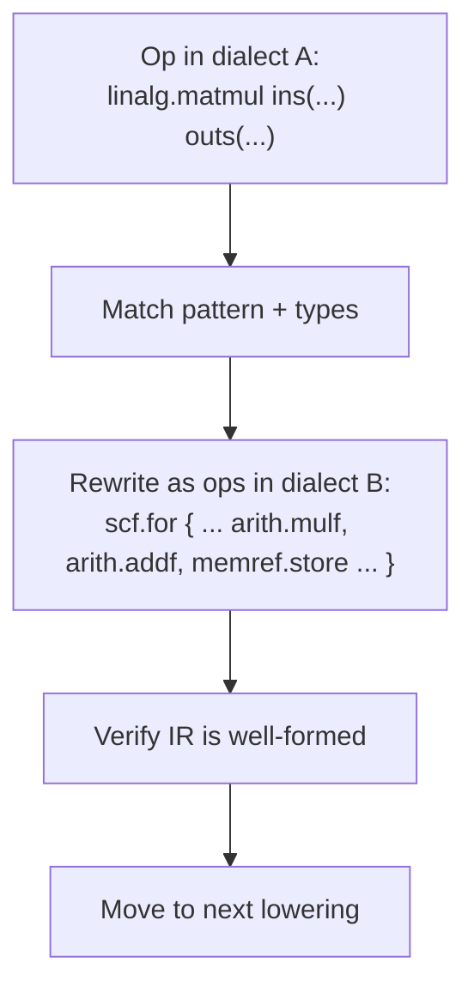

# Dialects & Lowering

> **Prereq:** [MLIR Overview](./mlir-overview). This lesson is the *operational* view: what actually happens during a lowering pass.

## TL;DR

- **Lowering** = a pass that rewrites IR from one dialect to a *lower-level* dialect. The semantics stay the same; the representation changes.
- Most lowerings are written as **rewrite patterns**: "match this op pattern in dialect A; replace with this set of ops in dialect B." MLIR's `RewritePatternSet` + dialect-conversion driver compose them.
- The full pipeline of an AI compiler is a **stack of lowerings**: `linalg → scf → vector → gpu → nvgpu → llvm`. Each step keeps just enough structure for the next pass to optimize against.
- **Type conversion** is half the work: `tensor` becomes `memref` becomes `llvm.ptr`. Every op needs a corresponding rewrite for its operand types.
- **Bufferization** is the most important specific lowering in AI compilers — turning value-typed tensors into memory-typed `memref`s, which is when allocation decisions get made.

## Why this matters

If you understand lowering, you understand how every modern AI compiler works. **The compiler is the lowerings**. Bug in your kernel? Probably a lowering produced wrong IR. Performance regression? Probably a lowering missed an optimization opportunity. New hardware? You're going to write a new lowering from `gpu` to your `mychip` dialect. Every interesting compiler-engineering question reduces to "what does this lowering do, and how can I make it do something better?"

## Mental model



Pattern → match → rewrite → verify. Repeat until target dialect.

## Concrete walkthrough

### Lowering as pattern rewriting

The smallest example: lowering `arith.addi` (integer add in MLIR's arith dialect) to `llvm.add`.

In MLIR/C++ pseudocode:

```cpp
struct AddIOpLowering : OpConversionPattern<arith::AddIOp> {
  using OpConversionPattern::OpConversionPattern;
  LogicalResult matchAndRewrite(arith::AddIOp op, OpAdaptor adaptor,
                                 ConversionPatternRewriter &rewriter) const override {
    rewriter.replaceOpWithNewOp<LLVM::AddOp>(op, adaptor.getLhs(), adaptor.getRhs());
    return success();
  }
};
```

Three things happening:
1. **Match**: `OpConversionPattern<arith::AddIOp>` says "match operations of type `arith.addi`."
2. **Adapt**: `OpAdaptor adaptor` gives access to the operation's operands *after type conversion*. So if `arith.addi` was on `i32` and we're converting to `llvm`, `adaptor.getLhs()` is the LLVM-typed converted operand.
3. **Rewrite**: replace the matched op with a new `llvm.add`.

The rewriter handles all the bookkeeping: ensuring users of the old op now refer to the new one, deleting the old op, recording metadata for verification.

### Conversion vs ordinary rewrite

MLIR has two distinct rewrite systems:

| | Ordinary rewrite (`RewritePatternSet`) | Dialect conversion (`ConversionPatternSet`) |
|---|---|---|
| Input/output types | Same dialects on both sides | Source dialect → target dialect |
| Use case | Within-dialect cleanup (peephole, canonicalization) | Cross-dialect lowering |
| Driver | `applyPatternsAndFoldGreedily` | `applyPartialConversion` / `applyFullConversion` |
| Type conversion | Manual | Automatic via `TypeConverter` |

For lowering work, you almost always want the **conversion** version. It handles the type-conversion automatically: register a `TypeConverter` saying "tensor → memref" and "i32 → i32" (no-op), and the driver propagates conversions through every op signature.

### Bufferization — the lowering that allocates

The most important specific lowering in AI compilers: **bufferization** turns value-typed tensors (immutable, no concrete memory) into memory-typed `memref`s (concrete buffers).

Before bufferization:

```mlir
%result = linalg.matmul ins(%A, %B : tensor<128x256xf32>, tensor<256x64xf32>)
                         outs(%C : tensor<128x64xf32>) -> tensor<128x64xf32>
```

After (one-shot bufferization):

```mlir
%a_buf = bufferization.to_memref %A : memref<128x256xf32>
%b_buf = bufferization.to_memref %B : memref<256x64xf32>
%c_buf = memref.alloc() : memref<128x64xf32>
linalg.copy %C : tensor<128x64xf32>, memref<128x64xf32>  // bias init
linalg.matmul ins(%a_buf, %b_buf : memref<...>, memref<...>)
              outs(%c_buf : memref<128x64xf32>)
%result = bufferization.to_tensor %c_buf : tensor<128x64xf32>
```

The structural changes:
- Every tensor is allocated explicit storage.
- The matmul now operates on memory, not values — destination-passing-style.
- Allocation is now *visible*. Pre-bufferization, the compiler doesn't even know how many allocs the program needs.

After bufferization, you can run **buffer allocation optimizations** (reuse buffers, avoid copies, hoist allocations out of loops). These are huge for memory-bound workloads — exactly what every LLM serving stack cares about.

### A real-world lowering chain

What `mlir-opt` does to lower `gemm.mlir` end-to-end (rough but representative):

```bash
mlir-opt gemm.mlir \
  --linalg-fuse-elementwise-ops \           # before bufferization, while it's cheap
  --one-shot-bufferize \                    # tensor → memref
  --buffer-deallocation \                   # insert frees
  --convert-linalg-to-loops \               # linalg.matmul → scf.for nest
  --convert-scf-to-cf \                     # structured loops → CFG branches
  --convert-vector-to-llvm \                # SIMD to LLVM intrinsics
  --convert-memref-to-llvm \                # memref → llvm.ptr
  --convert-func-to-llvm \                  # functions in llvm dialect
  --convert-arith-to-llvm \                 # scalar math
  --reconcile-unrealized-casts              # clean up bookkeeping
```

Nine separate lowerings. Each is a `ConversionPatternSet` plus a `TypeConverter`. Each takes a different chunk of the program down a level. By the end, the IR is pure `llvm` dialect and ready to hand off to `mlir-translate --mlir-to-llvmir` for actual LLVM IR.

This pipeline isn't fixed — different compilers (IREE, XLA, Triton, Modular MAX) pick different orders, skip some, add others. But the shape is universal.

### When a lowering is wrong

Two failure modes you'll see constantly:

1. **A pattern doesn't match.** Your op stays in the high-level dialect; the conversion driver complains "legalization failed." Usually because you wrote `OpConversionPattern<X>` for X but your input has type Y. Fix: handle both.
2. **A lowering produces invalid IR.** Verification fails after the pass. Usually because you forgot to convert one of the operand types correctly. Fix: trace the operand from input to output.

Both are caught by `mlir-opt --mlir-print-ir-after-all` (the same flag from the LLVM lesson, with `mlir-` prefix). Watch the IR after each pass; the first one that produces something that doesn't validate is the culprit.

## Run it in your browser — pattern-rewrite simulator

<RunInBrowser
  description="Tiny rewrite-pattern engine. Matches a high-level op, replaces with two low-level ops."
  code={`# Two "dialects":
#   high-level: ('matmul_bias', d, A, B, bias)
#   low-level:  ('matmul', t, A, B), ('add', d, t, bias)

# Pattern: matmul_bias -> matmul + add
def lower_matmul_bias(op, fresh):
    if op[0] != 'matmul_bias': return None
    _, dst, A, B, bias = op
    tmp = next(fresh)
    return [('matmul', tmp, A, B), ('add', dst, tmp, bias)]

def apply_patterns(prog, patterns):
    fresh = (f'%t{i}' for i in range(1000))
    out = []
    for op in prog:
        replaced = False
        for p in patterns:
            r = p(op, fresh)
            if r is not None:
                out.extend(r)
                replaced = True
                break
        if not replaced:
            out.append(op)
    return out

# Input: high-level dialect
prog = [
    ('matmul_bias', '%y1', '%A', '%B', '%bias'),
    ('relu',        '%y2', '%y1'),
    ('matmul_bias', '%y3', '%y2', '%C', '%bias2'),
]
print("--- INPUT (high-level) ---")
for op in prog: print(' ', op)

prog = apply_patterns(prog, [lower_matmul_bias])

print("\\n--- AFTER LOWERING (low-level) ---")
for op in prog: print(' ', op)

# Each matmul_bias replaced by matmul + add. The 'relu' op stays untouched
# because no pattern matched it — that would be a separate lowering.
print("\\nNotice: relu is still untouched — a real lowering chain would have")
print("a pattern for it too. Lowering is the union of patterns; missing patterns")
print("leave high-level ops in the output, which is the 'legalization failed' bug.")
`}
/>

This is the engine. Real MLIR conversion adds: type conversion, ordering of patterns, partial vs full conversion modes, dependency analysis. Same shape.

## Quick check

<FillIn
  prompt="The lowering pass that turns immutable tensors into mutable memrefs (allocating concrete memory):"
  answer="bufferization"
  accept={["bufferize", "one-shot-bufferize"]}
  hint="The pass name in mlir-opt: --one-shot-bufferize."
  explanation="Bufferization is when allocation decisions get made. Before it, the compiler doesn\'t know how many buffers the program needs; after it, every tensor has an explicit `memref` and the allocator can reason about reuse."
/>

<Quiz
  question="A new hardware vendor wants to add a backend to a JAX-based compiler. The fundamental work is:"
  options={[
    'Reimplement JAX from scratch.',
    'Define a new MLIR dialect for the chip and write lowerings from gpu / nvgpu to that dialect.',
    'Patch LLVM\'s codegen.',
    'Write a Python wrapper that calls the chip\'s native runtime.',
  ]}
  answer={1}
  explanation="A new hardware backend in the MLIR world is a dialect plus a stack of lowerings. The vendor defines ops that match their chip's primitives (tile-based matmul, async DMA, etc.), then writes lowerings that target those ops from upstream dialects. JAX itself is unchanged; you just slot in at the bottom of the pipeline."
/>

## Key takeaways

1. **Lowering = pattern-rewrite from one dialect to a lower one.** Match → rewrite → verify.
2. **Conversion patterns handle types automatically** via a `TypeConverter`. Use them for cross-dialect work.
3. **Bufferization is the single most consequential lowering** in AI compilers — it's where allocation decisions get made.
4. **A full AI-compiler pipeline is 5–10 lowerings stacked.** Each step keeps just enough structure for the next.
5. **New hardware → new dialect + lowering chain.** That's the entire model for adding a backend.

## Go deeper

<Resources
  items={[
    { kind: 'docs', href: 'https://mlir.llvm.org/docs/DialectConversion/', title: 'MLIR — Dialect Conversion', note: 'Authoritative on `OpConversionPattern`, `TypeConverter`, partial vs full conversion. Read once, return often.' },
    { kind: 'docs', href: 'https://mlir.llvm.org/docs/PatternRewriter/', title: 'MLIR — Pattern Rewriter', note: 'The lower-level rewrite engine; use this for within-dialect canonicalization.' },
    { kind: 'docs', href: 'https://mlir.llvm.org/docs/Bufferization/', title: 'MLIR — Bufferization', note: 'How tensor → memref actually works. Includes the one-shot bufferize design and its trade-offs.' },
    { kind: 'paper', href: 'https://arxiv.org/abs/2202.03293', title: 'Composable and Modular Code Generation in MLIR', author: 'Vasilache et al., 2022', note: 'The seminal paper on the linalg + transform-dialect approach to AI codegen. Long but worth it.' },
    { kind: 'blog', href: 'https://www.jeremykun.com/2023/08/10/mlir-running-and-testing-a-lowering/', title: 'MLIR — Running and Testing a Lowering', author: 'Jeremy Kun, 2023', note: 'Practical, end-to-end walkthrough of writing and testing a lowering. The clearest blog on the open web.' },
    { kind: 'repo', href: 'https://github.com/llvm/llvm-project/tree/main/mlir/lib/Conversion', title: 'mlir/lib/Conversion', note: 'The source of every standard lowering. Reading these is the fastest way to internalize the pattern.' },
    { kind: 'repo', href: 'https://github.com/iree-org/iree', title: 'iree-org/iree', note: '`compiler/src/iree/compiler/Codegen/` is the largest production lowering pipeline in OSS — read it after you\'re comfortable with upstream MLIR.' },
  ]}
/>

<LessonComplete />
