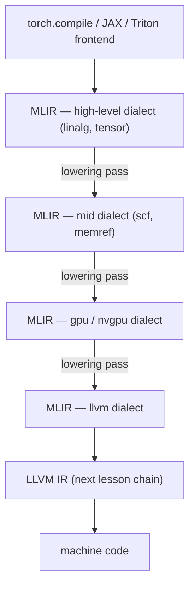

# MLIR Overview

<Mode is="learn">

> **Prereqs:** [LLVM IR Tour](./llvm-ir), [Passes & Pipelines](./passes). MLIR builds on LLVM's pass machinery; if those are in your head, MLIR is mostly new vocabulary.

LLVM IR is brilliant for what it is — a small, RISC-like, scalar-CPU-shaped instruction set the C/Rust/Swift world all share. But if you've spent any time around AI compilers, you've felt the mismatch: LLVM doesn't know what a tensor is, doesn't know what a loop is as a structured object, doesn't know what a GPU thread block is. By the time your AI kernel reaches LLVM IR, the structural information that makes interesting optimizations possible — tile shapes, fusion opportunities, layout choices — is gone.

<Term name="mlir">**MLIR**</Term> exists to keep that information around long enough to optimize against it. Same pass-pipeline philosophy as LLVM, but generalized: instead of one fixed instruction set, MLIR is a *framework* for representing programs at *many* levels of abstraction simultaneously, each a different <Term name="dialect">**dialect**</Term>. A `linalg.matmul` at the top, an `scf.for` in the middle, an `nvgpu.wgmma` near the bottom, an `llvm.add` at the floor. <Term name="lowering">**Lowering**</Term> rewrites IR from a higher dialect to a lower one. Stack 5–10 of those and you have an AI compiler.

Every modern AI compiler — Triton, IREE, JAX/XLA, ExecuTorch, ONNX-MLIR, Modular MAX — is built on this idea. This lesson is the framework, not any one compiler.

## TL;DR

- **MLIR** = Multi-Level IR. One framework for representing programs at *many* levels of abstraction simultaneously: linear-algebra ops at the top, GPU ops in the middle, LLVM IR at the bottom. Every level is just a different **dialect**.
- Every modern AI compiler — **Triton, IREE, JAX/XLA, ExecuTorch, OpenXLA, ONNX-MLIR, Modular's MAX** — is built on MLIR. PyTorch's `torch.compile` lowers through it (via Inductor → Triton → MLIR → LLVM).
- The **dialect** is the unit of vocabulary. `linalg`, `tensor`, `arith`, `scf` (structured control flow), `memref`, `gpu`, `nvgpu`, `vector`, `llvm` are the canonical built-in dialects. Custom domains (TPU, NPU, your hardware) ship their own.
- **Lowering** is the central operation: rewrite IR from a higher-level dialect to a lower one, repeatedly, until you're at `llvm` and can hand off to LLVM. Every AI compiler is essentially a stack of lowerings.
- MLIR is younger than LLVM (Google, 2019) but moves much faster. **The API churns** — code from 2022 often doesn't compile against current main. Pin your version.

## Mental model



The same IR file holds different dialects at each stage. Lowering = rewrite from the higher dialect to the lower one. Repeat 4–6 times.

## A trivial MLIR program at three levels

A tiny matmul-add written first in `linalg`:

```mlir
func.func @gemm_bias(%A: tensor<128x256xf32>, %B: tensor<256x64xf32>,
                     %bias: tensor<128x64xf32>) -> tensor<128x64xf32> {
  %c0 = arith.constant 0.0 : f32
  %init = tensor.empty() : tensor<128x64xf32>
  %zero = linalg.fill ins(%c0 : f32) outs(%init : tensor<128x64xf32>)
            -> tensor<128x64xf32>
  %mm = linalg.matmul ins(%A, %B : tensor<128x256xf32>, tensor<256x64xf32>)
                       outs(%zero : tensor<128x64xf32>) -> tensor<128x64xf32>
  %out = linalg.add ins(%mm, %bias : tensor<128x64xf32>, tensor<128x64xf32>)
                     outs(%init : tensor<128x64xf32>) -> tensor<128x64xf32>
  return %out : tensor<128x64xf32>
}
```

Notice: tensors are first-class. Operations like `linalg.matmul` understand the math. `%init` is "fresh empty memory of this shape" — no concrete allocation yet.

After lowering through `convert-linalg-to-loops`, the same function looks like nested loops in `scf` (structured control flow):

```mlir
func.func @gemm_bias(%A: memref<128x256xf32>, %B: memref<256x64xf32>,
                     %bias: memref<128x64xf32>, %out: memref<128x64xf32>) {
  scf.for %i = 0 to 128 {
    scf.for %j = 0 to 64 {
      %acc_init = memref.load %bias[%i, %j] : memref<128x64xf32>
      %acc = scf.for %k = 0 to 256 iter_args(%a = %acc_init) -> f32 {
        %a_elem = memref.load %A[%i, %k] : memref<128x256xf32>
        %b_elem = memref.load %B[%k, %j] : memref<256x64xf32>
        %m = arith.mulf %a_elem, %b_elem : f32
        %sum = arith.addf %a, %m : f32
        scf.yield %sum : f32
      }
      memref.store %acc, %out[%i, %j] : memref<128x64xf32>
    }
  }
  return
}
```

Tensors became `memref`s (concrete buffers). `linalg.matmul` exploded into three nested loops. We can now apply loop-level optimizations: tiling, vectorization, parallelization.

After more lowering (`convert-scf-to-cf`, `convert-arith-to-llvm`, `convert-memref-to-llvm`), the function becomes pure `llvm` dialect — basically LLVM IR wearing an MLIR jacket — and ready to hand off to the LLVM backend.

**Same program, three different dialects.** Each level kept around exactly the structure the next pass needed.

## Dialects you'll meet

| Dialect    | What it represents                                          | Where it lives in the stack |
|------------|------------------------------------------------------------|-------------------------------|
| `tensor`   | Immutable tensors as values                                | Top — frontend handoff        |
| `linalg`   | Structured linear-algebra ops over tensors / memrefs       | Top                           |
| `func`     | Functions, calls                                           | All levels                    |
| `arith`    | Scalar arithmetic                                          | All levels                    |
| `scf`      | Structured control flow (for, while, if)                  | Middle                        |
| `memref`   | Buffers in memory with strided layout                      | Middle                        |
| `vector`   | SIMD-shaped operations                                     | Middle                        |
| `affine`   | Polyhedral-friendly loops with affine bounds              | Middle (loop optimization)    |
| `gpu`      | GPU kernel structure (grids, blocks, threads)             | Middle-low                    |
| `nvgpu`    | NVIDIA-specific (TMA, mma)                                 | Low                           |
| `llvm`     | LLVM IR as an MLIR dialect                                 | Bottom                        |

Custom hardware ships its own: AMD has `rocdl`, Apple has private dialects, every NPU vendor has theirs. The point of MLIR is **adding a new dialect is cheap**, so each piece of hardware represents itself in the level of detail it needs.

## What torch.compile actually emits

Inside Inductor, after autograd and dispatch, the IR is FX (PyTorch's own graph IR). Inductor lowers FX to a Triton kernel. Triton's compiler lowers to MLIR (TritonGPU dialect → TritonNvidiaGPU → llvm), then to LLVM IR, then to PTX, then to SASS. Five lowerings. Each can be inspected:

```python
import torch
import torch._inductor.config as config
config.trace.enabled = True

@torch.compile
def f(x, y): return torch.relu(x @ y)
f(x, y)
# Generated artifacts dropped under torch_compile_debug/
# Look for *.ll (LLVM IR), *.mlir, *.ptx, output_code.py.
```

This is the pipeline — six representations of the same kernel. MLIR is the middle three.

## The IR has *regions*

LLVM IR has functions and basic blocks. MLIR generalizes: an **operation** can carry **regions** of nested IR. A `scf.for` is one operation whose region holds the loop body. A `func.func` is one operation whose region is the function body. This compositionality is what makes MLIR so flexible — your `gpu.launch` op can have a region that's the kernel body, your custom `tpu.matmul_block` can have a region for the schedule.

The cost: API churn. The benefit: you can express any control structure as just-another-op.

## `mlir-opt` — the workhorse

Like `opt` for LLVM, but for MLIR. The big move:

```bash
# Run a single lowering pass
mlir-opt --convert-linalg-to-loops gemm.mlir

# Compose lowerings
mlir-opt --convert-linalg-to-loops --convert-scf-to-cf --convert-arith-to-llvm --convert-memref-to-llvm gemm.mlir

# Or use a curated pipeline
mlir-opt --pass-pipeline='builtin.module(convert-linalg-to-loops, ...)' gemm.mlir
```

`mlir-opt --help` lists every pass. Most have shape `--convert-X-to-Y` for X-to-Y lowerings, or `--Y-vectorize`, `--Y-tile` for transformations within a dialect.

## Run it in your browser — toy dialect lowerer

<RunInBrowser
  description="A miniature multi-level IR with two dialects (matmul and loop) and a lowering."
  code={`from dataclasses import dataclass

# Two "dialects": high-level matmul, low-level loop nest.
@dataclass
class MatmulOp:
    M: int; N: int; K: int

@dataclass
class ForOp:
    var: str; lo: int; hi: int; body: list

@dataclass
class MulAccOp:
    pass  # leaf op

def print_ir(ir, indent=0):
    pad = '  ' * indent
    for op in ir:
        if isinstance(op, MatmulOp):
            print(f"{pad}linalg.matmul ({op.M}x{op.K}) * ({op.K}x{op.N})")
        elif isinstance(op, ForOp):
            print(f"{pad}scf.for {op.var} in [{op.lo}, {op.hi}) {{")
            print_ir(op.body, indent + 1)
            print(f"{pad}}}")
        elif isinstance(op, MulAccOp):
            print(f"{pad}arith.mulf + arith.addf  // accumulate")

def lower_matmul(op):
    """Lower MatmulOp into nested for loops."""
    return [
        ForOp('i', 0, op.M, [
            ForOp('j', 0, op.N, [
                ForOp('k', 0, op.K, [MulAccOp()])
            ])
        ])
    ]

def apply_lowering(ir):
    out = []
    for op in ir:
        if isinstance(op, MatmulOp):
            out.extend(lower_matmul(op))
        else:
            out.append(op)
    return out

ir = [MatmulOp(M=128, N=64, K=256)]
print("--- BEFORE LOWERING (high-level dialect) ---")
print_ir(ir)
ir = apply_lowering(ir)
print("\\n--- AFTER LOWERING (low-level dialect) ---")
print_ir(ir)
`}
/>

The shape — high-level op gets *replaced* by an equivalent tree of lower-level ops — is exactly what every MLIR conversion pass does, just with much richer types.

## Quick check

<FillIn
  prompt="In MLIR, the unit of vocabulary that bundles related operations and types together (e.g., linalg, tensor, gpu):"
  answer="dialect"
  accept={["dialects"]}
  hint="The thing that makes MLIR multi-level."
  explanation="A dialect is a namespace containing related operations and types. `linalg.matmul`, `tensor.empty`, `gpu.launch` — same IR file, three different dialects. Lowering is the act of rewriting from one dialect to another."
/>

<Quiz
  question="Why does MLIR exist alongside LLVM IR rather than being absorbed into it?"
  options={[
    'LLVM IR can\'t represent tensors.',
    'MLIR is general-purpose and supports many concurrent levels of abstraction (dialects), while LLVM IR is one fixed level designed for scalar code generation.',
    'MLIR is faster than LLVM IR.',
    'Different language frontends (C, Rust, Swift) couldn\'t agree on LLVM extensions.',
  ]}
  answer={1}
  explanation="LLVM IR is one specific level — RISC-like SSA designed for traditional CPU codegen. MLIR is a *framework* in which you can define many levels (dialects) and rewrite between them. The conceptual generalization is what made it useful for ML where you genuinely need representations at the tensor/loop/GPU/LLVM levels simultaneously."
/>

## Key takeaways

1. **MLIR = Multi-Level IR.** One framework, many dialects. Every level is a dialect.
2. **Lowering is the core operation:** rewrite IR from a higher dialect to a lower one. Repeat until LLVM.
3. **Every modern AI compiler runs on it:** Triton, IREE, XLA, ExecuTorch, ONNX-MLIR, Modular MAX.
4. **Dialects you'll meet:** `tensor` and `linalg` (top), `scf` and `memref` (middle), `gpu` and `nvgpu` (low), `llvm` (bottom).
5. **API churns. Pin your LLVM/MLIR version.** Tutorials more than 6 months old often don't compile.

## Go deeper

<Resources
  items={[
    { kind: 'docs', href: 'https://mlir.llvm.org/', title: 'MLIR Project Home', note: 'Start here. The "Tutorials" section walks you through Toy (a tiny language) — the closest thing to a Kaleidoscope-style intro.' },
    { kind: 'docs', href: 'https://mlir.llvm.org/docs/Dialects/Linalg/', title: 'MLIR — linalg Dialect', note: 'The high-level dialect that frontends target. Section "Generic Op" is the most-used construct in the AI world.' },
    { kind: 'docs', href: 'https://mlir.llvm.org/docs/Tutorials/Toy/', title: 'MLIR Toy Tutorial', note: 'The canonical end-to-end tutorial: a Python-shaped language compiled through several dialects.' },
    { kind: 'paper', href: 'https://arxiv.org/abs/2002.11054', title: 'MLIR: A Compiler Infrastructure for the End of Moore\'s Law', author: 'Lattner et al., 2020', note: 'The original paper. Sections 2–3 explain the design philosophy.' },
    { kind: 'blog', href: 'https://www.lei.chat/', title: 'Lei Zhang\'s blog (Modular)', note: 'One of the few practitioner blogs that consistently writes about MLIR internals at a useful level.' },
    { kind: 'video', href: 'https://www.youtube.com/watch?v=Y4SvqTtOIDk', title: 'Chris Lattner — The MLIR Story', note: 'The story of why MLIR exists, from the person who built it.' },
    { kind: 'repo', href: 'https://github.com/llvm/llvm-project', title: 'llvm/llvm-project — `mlir/`', note: 'The source. `mlir/lib/Dialect/Linalg/` and `mlir/lib/Conversion/` are where you spend most of your reading time.' },
    { kind: 'repo', href: 'https://github.com/iree-org/iree', title: 'iree-org/iree', note: 'The largest production MLIR-based compiler outside Google. Best real-world reading for how dialects compose.' },
  ]}
/>

</Mode>

<Mode is="reference">

> **Prereqs:** [LLVM IR Tour](./llvm-ir), [Passes & Pipelines](./passes). MLIR builds on LLVM's pass machinery; if those are in your head, MLIR is mostly new vocabulary.

## TL;DR

- **MLIR** = Multi-Level IR. One framework for representing programs at *many* levels of abstraction simultaneously: linear-algebra ops at the top, GPU ops in the middle, LLVM IR at the bottom. Every level is just a different **dialect**.
- Every modern AI compiler — **Triton, IREE, JAX/XLA, ExecuTorch, OpenXLA, ONNX-MLIR, Modular's MAX** — is built on MLIR. PyTorch's `torch.compile` lowers through it (via Inductor → Triton → MLIR → LLVM).
- The **dialect** is the unit of vocabulary. `linalg`, `tensor`, `arith`, `scf` (structured control flow), `memref`, `gpu`, `nvgpu`, `vector`, `llvm` are the canonical built-in dialects. Custom domains (TPU, NPU, your hardware) ship their own.
- **Lowering** is the central operation: rewrite IR from a higher-level dialect to a lower one, repeatedly, until you're at `llvm` and can hand off to LLVM. Every AI compiler is essentially a stack of lowerings.
- MLIR is younger than LLVM (Google, 2019) but moves much faster. **The API churns** — code from 2022 often doesn't compile against current main. Pin your version.

## Why this matters

LLVM IR is too low-level for AI: it doesn't know about tensors, doesn't know about loops as first-class objects, doesn't know about GPU programming models. By the time your kernel is in LLVM IR, the structural information that made interesting optimizations possible (loop tiling, fusion, layout selection) is gone. **MLIR exists to keep that information around long enough to optimize against it.** Every AI compiler today builds on MLIR for exactly this reason.

If you want to write a custom hardware backend, do graph-level optimization, or even just understand what `torch.compile` is doing, the answer goes through MLIR.

## Mental model


The same IR file holds different dialects at each stage. Lowering = rewrite from the higher dialect to the lower one. Repeat 4–6 times.

## Concrete walkthrough

### A trivial MLIR program at three levels

A tiny matmul-add written first in `linalg`:

```mlir
func.func @gemm_bias(%A: tensor<128x256xf32>, %B: tensor<256x64xf32>,
                     %bias: tensor<128x64xf32>) -> tensor<128x64xf32> {
  %c0 = arith.constant 0.0 : f32
  %init = tensor.empty() : tensor<128x64xf32>
  %zero = linalg.fill ins(%c0 : f32) outs(%init : tensor<128x64xf32>)
            -> tensor<128x64xf32>
  %mm = linalg.matmul ins(%A, %B : tensor<128x256xf32>, tensor<256x64xf32>)
                       outs(%zero : tensor<128x64xf32>) -> tensor<128x64xf32>
  %out = linalg.add ins(%mm, %bias : tensor<128x64xf32>, tensor<128x64xf32>)
                     outs(%init : tensor<128x64xf32>) -> tensor<128x64xf32>
  return %out : tensor<128x64xf32>
}
```

Notice: tensors are first-class. Operations like `linalg.matmul` understand the math. `%init` is "fresh empty memory of this shape" — no concrete allocation yet.

After lowering through `convert-linalg-to-loops`, the same function looks like nested loops in `scf` (structured control flow):

```mlir
func.func @gemm_bias(%A: memref<128x256xf32>, %B: memref<256x64xf32>,
                     %bias: memref<128x64xf32>, %out: memref<128x64xf32>) {
  scf.for %i = 0 to 128 {
    scf.for %j = 0 to 64 {
      %acc_init = memref.load %bias[%i, %j] : memref<128x64xf32>
      %acc = scf.for %k = 0 to 256 iter_args(%a = %acc_init) -> f32 {
        %a_elem = memref.load %A[%i, %k] : memref<128x256xf32>
        %b_elem = memref.load %B[%k, %j] : memref<256x64xf32>
        %m = arith.mulf %a_elem, %b_elem : f32
        %sum = arith.addf %a, %m : f32
        scf.yield %sum : f32
      }
      memref.store %acc, %out[%i, %j] : memref<128x64xf32>
    }
  }
  return
}
```

Tensors became `memref`s (concrete buffers). `linalg.matmul` exploded into three nested loops. We can now apply loop-level optimizations: tiling, vectorization, parallelization.

After more lowering (`convert-scf-to-cf`, `convert-arith-to-llvm`, `convert-memref-to-llvm`), the function becomes pure `llvm` dialect — basically LLVM IR wearing an MLIR jacket — and ready to hand off to the LLVM backend.

**Same program, three different dialects.** Each level kept around exactly the structure the next pass needed.

### Dialects you'll meet

| Dialect    | What it represents                                          | Where it lives in the stack |
|------------|------------------------------------------------------------|-------------------------------|
| `tensor`   | Immutable tensors as values                                | Top — frontend handoff        |
| `linalg`   | Structured linear-algebra ops over tensors / memrefs       | Top                           |
| `func`     | Functions, calls                                           | All levels                    |
| `arith`    | Scalar arithmetic                                          | All levels                    |
| `scf`      | Structured control flow (for, while, if)                  | Middle                        |
| `memref`   | Buffers in memory with strided layout                      | Middle                        |
| `vector`   | SIMD-shaped operations                                     | Middle                        |
| `affine`   | Polyhedral-friendly loops with affine bounds              | Middle (loop optimization)    |
| `gpu`      | GPU kernel structure (grids, blocks, threads)             | Middle-low                    |
| `nvgpu`    | NVIDIA-specific (TMA, mma)                                 | Low                           |
| `llvm`     | LLVM IR as an MLIR dialect                                 | Bottom                        |

Custom hardware ships its own: AMD has `rocdl`, Apple has private dialects, every NPU vendor has theirs. The point of MLIR is **adding a new dialect is cheap**, so each piece of hardware represents itself in the level of detail it needs.

### What torch.compile actually emits

Inside Inductor, after autograd and dispatch, the IR is FX (PyTorch's own graph IR). Inductor lowers FX to a Triton kernel. Triton's compiler lowers to MLIR (TritonGPU dialect → TritonNvidiaGPU → llvm), then to LLVM IR, then to PTX, then to SASS. Five lowerings. Each can be inspected:

```python
import torch
import torch._inductor.config as config
config.trace.enabled = True

@torch.compile
def f(x, y): return torch.relu(x @ y)
f(x, y)
# Generated artifacts dropped under torch_compile_debug/
# Look for *.ll (LLVM IR), *.mlir, *.ptx, output_code.py.
```

This is the pipeline — six representations of the same kernel. MLIR is the middle three.

### The IR has *regions*

LLVM IR has functions and basic blocks. MLIR generalizes: an **operation** can carry **regions** of nested IR. A `scf.for` is one operation whose region holds the loop body. A `func.func` is one operation whose region is the function body. This compositionality is what makes MLIR so flexible — your `gpu.launch` op can have a region that's the kernel body, your custom `tpu.matmul_block` can have a region for the schedule.

The cost: API churn. The benefit: you can express any control structure as just-another-op.

### `mlir-opt` — the workhorse

Like `opt` for LLVM, but for MLIR. The big move:

```bash
# Run a single lowering pass
mlir-opt --convert-linalg-to-loops gemm.mlir

# Compose lowerings
mlir-opt --convert-linalg-to-loops --convert-scf-to-cf --convert-arith-to-llvm --convert-memref-to-llvm gemm.mlir

# Or use a curated pipeline
mlir-opt --pass-pipeline='builtin.module(convert-linalg-to-loops, ...)' gemm.mlir
```

`mlir-opt --help` lists every pass. Most have shape `--convert-X-to-Y` for X-to-Y lowerings, or `--Y-vectorize`, `--Y-tile` for transformations within a dialect.

## Run it in your browser — toy dialect lowerer

<RunInBrowser
  description="A miniature multi-level IR with two dialects (matmul and loop) and a lowering."
  code={`from dataclasses import dataclass

# Two "dialects": high-level matmul, low-level loop nest.
@dataclass
class MatmulOp:
    M: int; N: int; K: int

@dataclass
class ForOp:
    var: str; lo: int; hi: int; body: list

@dataclass
class MulAccOp:
    pass  # leaf op

def print_ir(ir, indent=0):
    pad = '  ' * indent
    for op in ir:
        if isinstance(op, MatmulOp):
            print(f"{pad}linalg.matmul ({op.M}x{op.K}) * ({op.K}x{op.N})")
        elif isinstance(op, ForOp):
            print(f"{pad}scf.for {op.var} in [{op.lo}, {op.hi}) {{")
            print_ir(op.body, indent + 1)
            print(f"{pad}}}")
        elif isinstance(op, MulAccOp):
            print(f"{pad}arith.mulf + arith.addf  // accumulate")

def lower_matmul(op):
    """Lower MatmulOp into nested for loops."""
    return [
        ForOp('i', 0, op.M, [
            ForOp('j', 0, op.N, [
                ForOp('k', 0, op.K, [MulAccOp()])
            ])
        ])
    ]

def apply_lowering(ir):
    out = []
    for op in ir:
        if isinstance(op, MatmulOp):
            out.extend(lower_matmul(op))
        else:
            out.append(op)
    return out

ir = [MatmulOp(M=128, N=64, K=256)]
print("--- BEFORE LOWERING (high-level dialect) ---")
print_ir(ir)
ir = apply_lowering(ir)
print("\\n--- AFTER LOWERING (low-level dialect) ---")
print_ir(ir)
`}
/>

The shape — high-level op gets *replaced* by an equivalent tree of lower-level ops — is exactly what every MLIR conversion pass does, just with much richer types.

## Quick check

<FillIn
  prompt="In MLIR, the unit of vocabulary that bundles related operations and types together (e.g., linalg, tensor, gpu):"
  answer="dialect"
  accept={["dialects"]}
  hint="The thing that makes MLIR multi-level."
  explanation="A dialect is a namespace containing related operations and types. `linalg.matmul`, `tensor.empty`, `gpu.launch` — same IR file, three different dialects. Lowering is the act of rewriting from one dialect to another."
/>

<Quiz
  question="Why does MLIR exist alongside LLVM IR rather than being absorbed into it?"
  options={[
    'LLVM IR can\'t represent tensors.',
    'MLIR is general-purpose and supports many concurrent levels of abstraction (dialects), while LLVM IR is one fixed level designed for scalar code generation.',
    'MLIR is faster than LLVM IR.',
    'Different language frontends (C, Rust, Swift) couldn\'t agree on LLVM extensions.',
  ]}
  answer={1}
  explanation="LLVM IR is one specific level — RISC-like SSA designed for traditional CPU codegen. MLIR is a *framework* in which you can define many levels (dialects) and rewrite between them. The conceptual generalization is what made it useful for ML where you genuinely need representations at the tensor/loop/GPU/LLVM levels simultaneously."
/>

## Key takeaways

1. **MLIR = Multi-Level IR.** One framework, many dialects. Every level is a dialect.
2. **Lowering is the core operation:** rewrite IR from a higher dialect to a lower one. Repeat until LLVM.
3. **Every modern AI compiler runs on it:** Triton, IREE, XLA, ExecuTorch, ONNX-MLIR, Modular MAX.
4. **Dialects you'll meet:** `tensor` and `linalg` (top), `scf` and `memref` (middle), `gpu` and `nvgpu` (low), `llvm` (bottom).
5. **API churns. Pin your LLVM/MLIR version.** Tutorials more than 6 months old often don't compile.

## Go deeper

<Resources
  items={[
    { kind: 'docs', href: 'https://mlir.llvm.org/', title: 'MLIR Project Home', note: 'Start here. The "Tutorials" section walks you through Toy (a tiny language) — the closest thing to a Kaleidoscope-style intro.' },
    { kind: 'docs', href: 'https://mlir.llvm.org/docs/Dialects/Linalg/', title: 'MLIR — linalg Dialect', note: 'The high-level dialect that frontends target. Section "Generic Op" is the most-used construct in the AI world.' },
    { kind: 'docs', href: 'https://mlir.llvm.org/docs/Tutorials/Toy/', title: 'MLIR Toy Tutorial', note: 'The canonical end-to-end tutorial: a Python-shaped language compiled through several dialects.' },
    { kind: 'paper', href: 'https://arxiv.org/abs/2002.11054', title: 'MLIR: A Compiler Infrastructure for the End of Moore\'s Law', author: 'Lattner et al., 2020', note: 'The original paper. Sections 2–3 explain the design philosophy.' },
    { kind: 'blog', href: 'https://www.lei.chat/', title: 'Lei Zhang\'s blog (Modular)', note: 'One of the few practitioner blogs that consistently writes about MLIR internals at a useful level.' },
    { kind: 'video', href: 'https://www.youtube.com/watch?v=Y4SvqTtOIDk', title: 'Chris Lattner — The MLIR Story', note: 'The story of why MLIR exists, from the person who built it.' },
    { kind: 'repo', href: 'https://github.com/llvm/llvm-project', title: 'llvm/llvm-project — `mlir/`', note: 'The source. `mlir/lib/Dialect/Linalg/` and `mlir/lib/Conversion/` are where you spend most of your reading time.' },
    { kind: 'repo', href: 'https://github.com/iree-org/iree', title: 'iree-org/iree', note: 'The largest production MLIR-based compiler outside Google. Best real-world reading for how dialects compose.' },
  ]}
/>

</Mode>

<LessonComplete />
