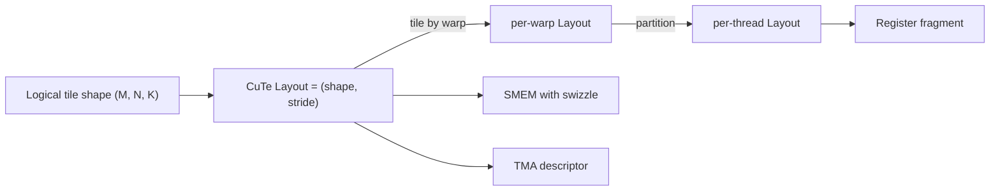

# CuTe & CUTLASS 4

> **Prereqs:** [SM Architecture](../../ml-execution/gpu-fundamentals/sm-architecture), [Shared Memory](../../ml-execution/gpu-fundamentals/shared-memory), [Triton](./triton). CUTLASS is what you reach for when Triton's last 5% isn't good enough — and when you need to read NVIDIA's reference kernels.

## TL;DR

- **CUTLASS** = NVIDIA's open-source C++ template library for GEMM-class kernels. The reference for *how to write a fast tensor-core kernel*. Every cuBLAS kernel from Hopper onward shares its design language with CUTLASS.
- **CuTe** = the layout sublanguage inside CUTLASS 3.x+. A small, expressive type system for *tile shapes* and *layouts* — the maps between logical tile coordinates and physical memory.
- The mental shift: **everything is a layout.** A SMEM tile, a register fragment, a TMA descriptor, a swizzle pattern — all are CuTe `Layout` values composed by `tile`, `partition`, `coalesce`, etc.
- **CUTLASS 4** (2024–2025) is the Hopper/Blackwell native version. Adds first-class TMA, WGMMA, warp specialization, persistent kernels, FP8/FP4. Older CUTLASS 2.x is now legacy.
- Hand-written CUTLASS still beats Triton by 5–10% on edge shapes and is the only way to access certain NVIDIA-specific instructions immediately at launch. The cost is real C++ template depth.

## Why this matters

Triton is great for ~95% of kernel work, but the remaining 5% is where the most impactful kernels live: cuBLAS, FlashAttention-3 (its CUTLASS variant), the kernels NVIDIA's CUDA team ships, anything that needs to land on day-one of a new architecture before Triton's backend catches up. **Reading CUTLASS is the only way to fully understand modern GPU performance.** Even if you write Triton, the layouts CuTe expresses (interleaved, swizzled, partitioned) are the same layouts Triton emits underneath — knowing CuTe makes Triton's IR dumps legible.

## Mental model



A tile's shape is a *Layout*, which is a `(shape, stride)` pair. Operations on layouts (tile, partition, slice, compose) are how you derive everything else: per-warp views, per-thread fragments, SMEM stores with swizzle, TMA descriptors. **One algebra, many uses.**

## Concrete walkthrough

### What's CUTLASS, structurally

The library is a stack:

| Layer        | What lives there                                              |
|--------------|---------------------------------------------------------------|
| `cute/`      | Layout primitives, MMA atoms, copy atoms, swizzle, TMA descs  |
| `cutlass/gemm/`| Tiled GEMM kernels parameterized by collective + epilogue   |
| `cutlass/conv/`| Implicit-GEMM convolutions                                  |
| `cutlass/epilogue/`| Per-tile output transforms (bias, activations, etc.)    |
| `python/cutlass/`| Python interface for emitting kernels at call sites       |

A CUTLASS GEMM is built from **collectives**: a `CollectiveMainloop` (the K-loop tile streaming) plus a `CollectiveEpilogue` (the per-output-tile finalizer). Both are templated on layouts, types, and tile shapes. Mix and match → tens of thousands of kernels from a few hundred lines of declarations.

### A tiny CuTe layout, by example

```cpp
#include <cute/tensor.hpp>
using namespace cute;

// A 4×8 tile with stride (8, 1) — rows are the slow axis (row-major).
auto layout = make_layout(make_shape(_4{}, _8{}), make_stride(_8{}, _1{}));
print_layout(layout);
// Output:
// (4,8):(8,1)
//      0    1    2    3    4    5    6    7
//   +----+----+----+----+----+----+----+----+
// 0 |  0 |  1 |  2 |  3 |  4 |  5 |  6 |  7 |
//   +----+----+----+----+----+----+----+----+
// 1 |  8 |  9 | 10 | 11 | 12 | 13 | 14 | 15 |
//   ...
```

`(4,8):(8,1)` — shape `(4,8)`, stride `(8,1)`. Element at logical coord `(i,j)` is at offset `8*i + 1*j`. That's row-major. Switch the strides to `(1,4)` and you get column-major. Compose two layouts and you get a tiled layout. This algebra is the entire vocabulary of CuTe.

### Why layouts matter so much

A modern Hopper GEMM has *six* simultaneously-live layouts:

1. The **global tile** of A in HBM (row-major or column-major).
2. The **SMEM tile** of A after a TMA load (often **swizzled** to avoid bank conflicts).
3. The **register fragment** of A held by each warp during mma.
4. Same three for B.

Plus accumulators, output, etc. CuTe lets you express each one as a `Layout`, and the conversion from one to another (e.g., SMEM→registers via `cp.async.bulk` then `ldmatrix`) is a layout transform. You write the *algebra*; CuTe expands to the right hardware instructions.

### A production GEMM, in shape

The canonical CUTLASS 4 Hopper GEMM:

```cpp
using ProblemShape = Shape<int, int, int>;
using ElementA = cutlass::half_t;
using ElementB = cutlass::half_t;
using ElementC = cutlass::half_t;
using ElementAcc = float;
using LayoutA = cutlass::layout::RowMajor;
using LayoutB = cutlass::layout::ColumnMajor;
using LayoutC = cutlass::layout::RowMajor;

using TileShape = Shape<_128, _128, _64>;       // CTA tile
using ClusterShape = Shape<_2, _1, _1>;         // 2-CTA cluster

using KernelSchedule = cutlass::gemm::KernelTmaWarpSpecializedPingpong;

using CollectiveMainloop = typename cutlass::gemm::collective::CollectiveBuilder<
  cutlass::arch::Sm90, cutlass::arch::OpClassTensorOp,
  ElementA, LayoutA, 16, ElementB, LayoutB, 16,
  ElementAcc, TileShape, ClusterShape,
  cutlass::gemm::collective::StageCountAuto,
  KernelSchedule
>::CollectiveOp;

using CollectiveEpilogue = typename cutlass::epilogue::collective::CollectiveBuilder<
  cutlass::arch::Sm90, cutlass::arch::OpClassTensorOp,
  TileShape, ClusterShape,
  cutlass::epilogue::collective::EpilogueTileAuto,
  ElementAcc, ElementAcc, ElementC, LayoutC, 16,
  cutlass::epilogue::TmaWarpSpecialized
>::CollectiveOp;

using GemmKernel = cutlass::gemm::kernel::GemmUniversal<ProblemShape, CollectiveMainloop, CollectiveEpilogue>;
using Gemm = cutlass::gemm::device::GemmUniversalAdapter<GemmKernel>;
```

Looks like a lot, but every line is a knob: types, layouts, tile shape, cluster shape, schedule (TMA + warp-specialized + ping-pong). The **CollectiveBuilder** picks the kernel implementation that matches all those constraints. There's no per-kernel hand-rolled C++ — it's all template instantiation against a few thousand lines of generic CUTLASS.

### Reading CUTLASS source — the survival kit

The directories that matter most:

- `include/cute/atom/` — primitive operations (mma traits, copy traits, layout traits).
- `include/cute/tensor.hpp` — the Tensor type and its operations.
- `include/cutlass/gemm/collective/` — the mainloop implementations (per-architecture).
- `include/cutlass/epilogue/collective/` — output transforms.
- `examples/cute/` — runnable CUTLASS-only examples; these are your tutorials.
- `examples/48_hopper_*` etc — the H100-specific examples.

The single best on-ramp: read `examples/cute/tutorial/tiled_copy.cu`. It walks you through layouts, tile shapes, partitioning across warps, and async copies, all in one file. Once that file makes sense, the rest of CUTLASS is patterns of the same operations.

### Triton vs CUTLASS, decision tree

```
Are you writing a GEMM-class kernel for an NVIDIA GPU?
├── Yes
│   ├── Do you need it within 1 day? → Triton.
│   ├── Do you need to land on launch day for new hardware? → CUTLASS (NVIDIA team ships CUTLASS first).
│   ├── Is the last 5% of perf worth a week of effort? → CUTLASS.
│   └── Otherwise → Triton, then upgrade to CUTLASS only if benchmarks demand.
└── No (AMD MI355X / TPU / etc) → Pallas, ROCm Composable Kernel, ThunderKittens-AMD-port.
```

In production AI labs, Triton ships fast, CUTLASS ships best. Both are real careers.

## Run it in your browser — toy CuTe layout

<RunInBrowser
  description="Implement the (shape, stride) → offset map; compose two layouts to make a tile-of-tiles."
  code={`from dataclasses import dataclass
from itertools import product

@dataclass
class Layout:
    shape: tuple
    stride: tuple

    def offset(self, *coords):
        return sum(c * s for c, s in zip(coords, self.stride))

    def size(self):
        out = 1
        for s in self.shape: out *= s
        return out

def print_layout(name, L):
    print(f"--- {name}: shape={L.shape}, stride={L.stride} ---")
    if len(L.shape) == 2:
        for i in range(L.shape[0]):
            print(' '.join(f"{L.offset(i,j):>3}" for j in range(L.shape[1])))
        print()

# Row-major 4x8: stride (8, 1)
row_major = Layout((4, 8), (8, 1))
print_layout("row-major (4,8)", row_major)

# Column-major 4x8: stride (1, 4)
col_major = Layout((4, 8), (1, 4))
print_layout("column-major (4,8)", col_major)

# Tile-of-tiles: 4 tiles of (2,4) laid out row-major within a (2,2) grid.
# Outer (2,2): stride (16, 8); inner (2,4): stride (4,1).
# Compose by adding offsets: outer_layout.offset(io, jo) * 1 + inner.offset(ii, ji)
outer = Layout((2,2), (16,8))
inner = Layout((2,4), (4,1))
print("--- composed (2,2)(2,4) ---")
print("(io, jo) (ii, ji) -> offset")
for io, jo, ii, ji in product(range(2), range(2), range(2), range(4)):
    off = outer.offset(io, jo) + inner.offset(ii, ji)
    if (io, jo, ii, ji) in [(0,0,0,0), (0,0,1,3), (0,1,0,0), (1,0,0,0), (1,1,1,3)]:
        print(f"({io},{jo}) ({ii},{ji}) -> {off}")

# A swizzled SMEM tile: row r, col c -> offset r*32 + (c XOR (r & 0x3))
print("\\n--- swizzled SMEM (4,32), XOR row & 3 ---")
for r in range(4):
    print(' '.join(f"{r*32 + (c ^ (r & 3)):>3}" for c in range(8)))  # first 8 cols
print("\\nNotice: each row's first column shifts by row; banks scatter, conflicts disappear.")
`}
/>

The composition pattern (outer layout selects which tile, inner layout walks within it) is the central CuTe idiom. Real CuTe adds compile-time shape-checks, partitioning across warps and threads, and hardware-specific atom matching — but the algebra is what you saw.

## Quick check

<FillIn
  prompt="The CuTe sublanguage is best described as a small algebra over what data structure?"
  answer="layout"
  accept={["layouts", "(shape, stride)"]}
  hint="Same word as the title of this lesson."
  explanation="A `Layout` is a `(shape, stride)` pair. CuTe operations (tile, partition, compose, coalesce) all take and return Layouts. Once you can read CuTe layouts, every modern NVIDIA GEMM is legible."
/>

<Quiz
  question="A team's Triton kernel hits 92% of cuBLAS. They're considering rewriting in CUTLASS. The most reasonable rule of thumb:"
  options={[
    'Always rewrite — CUTLASS is faster.',
    'Don\'t rewrite — at 92% the remaining gap is rarely worth a week of CUTLASS development unless the kernel is very hot.',
    'Always rewrite — CUTLASS templates auto-tune better.',
    'Rewrite half the kernel and benchmark.',
  ]}
  answer={1}
  explanation="92% of cuBLAS in Triton is a fine answer for almost any production workload — the remaining 8% is rarely the bottleneck unless the kernel runs in a tight inner loop. CUTLASS rewrites pay off for: (a) kernels NVIDIA hasn\'t shipped a tuned cuBLAS for, (b) day-one-of-new-architecture work, (c) something where CUTLASS already has a near-perfect kernel that you can paste in. Otherwise the engineer-time cost is rarely worth it."
/>

## Key takeaways

1. **CUTLASS is the C++ kernel framework.** CuTe is its layout sublanguage. Together they're how cuBLAS-class kernels get written.
2. **Everything is a Layout.** `(shape, stride)` is the entire universe; operations on layouts produce all the views you need.
3. **CUTLASS 4 is Hopper-/Blackwell-native** with TMA, WGMMA, warp specialization, FP8/FP4 first-class.
4. **`CollectiveMainloop` + `CollectiveEpilogue` + a Builder** is the structural pattern. Mix and match → infinite kernels.
5. **Reach for CUTLASS when the last 5% matters or for day-one new-arch work.** Otherwise Triton wins on engineer time.

## Go deeper

<Resources
  items={[
    { kind: 'docs', href: 'https://github.com/NVIDIA/cutlass/blob/main/media/docs/cute/00_quickstart.md', title: 'CuTe Quickstart', note: 'NVIDIA\'s own intro. Read this before any CUTLASS examples.' },
    { kind: 'docs', href: 'https://github.com/NVIDIA/cutlass/blob/main/media/docs/cute/01_layout.md', title: 'CuTe Layouts', note: 'Section 1–3 cover the layout algebra. The single most important reading for working with CUTLASS 3.x+.' },
    { kind: 'blog', href: 'https://research.colfax-intl.com/cutlass-tutorial/', title: 'Colfax — CUTLASS Tutorial Series', note: 'Best modern (2024) blog series on CUTLASS internals. Hopper-specific.' },
    { kind: 'video', href: 'https://www.youtube.com/watch?v=xkgbzwG1XAU', title: 'GTC 2024 — CUTLASS 3.0', note: 'NVIDIA team\'s walkthrough of the rewrite that introduced CuTe. The "before/after" framing makes the design choices obvious.' },
    { kind: 'paper', href: 'https://arxiv.org/abs/2407.08608', title: 'FlashAttention-3: Fast and Accurate Attention with Asynchrony and Low-precision', author: 'Shah et al., 2024', note: 'The CUTLASS-based FA-3. Section 4 explains the warp-specialized pingpong schedule that CUTLASS 4 ships as a template.' },
    { kind: 'repo', href: 'https://github.com/NVIDIA/cutlass', title: 'NVIDIA/cutlass', note: 'The library. Start with `examples/cute/tutorial/`, then `examples/48_hopper_warp_specialized_gemm/`.' },
  ]}
/>

<LessonComplete />
