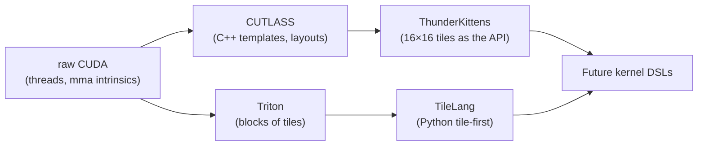

# ThunderKittens & TileLang

<Mode is="learn">

> **Prereqs:** [Triton](./triton), [CuTe & CUTLASS 4](./cute-cutlass). This lesson is about what comes *after* both: kernel DSLs designed for the modern (Hopper+) world from the start.

The GPU programming world has converged on three answers: *raw CUDA* (most control, most code), *<Term name="triton">Triton</Term>* (good defaults, ergonomic), *<Term name="cutlass">CUTLASS</Term>* (NVIDIA-blessed, template-heavy). **ThunderKittens** and **TileLang** are a fourth answer: what if the API was tile-first and the tile algebra was complete from the start?

ThunderKittens (Stanford's Hazy Research) makes the bet most provocatively: a 16×16 tile of `bf16` is the *only* primitive your kernel really needs — build everything from that. TileLang (Microsoft Research) makes the same bet in Python ergonomics. Both pitch the same idea: Triton is great but its tile algebra is partial; TK and TileLang make tiles explicit primitives with full hardware acceleration baked in. Result: kernels that are *shorter* than Triton and *faster*. ThunderKittens shipped the fastest-known FlashAttention-2 forward (April 2024) in **~80 lines** of C++.

These DSLs are 2024–2026 frontier work. They're production-used in HazyResearch's stack, in some labs' kernel teams, and in OSS work like FlexAttention. **Worth knowing because it's where things are going**, not because they replaced Triton in 2026.

## TL;DR

- **ThunderKittens (TK)** is a Stanford (Hazy Research) C++ embedded DSL for tile-shaped GPU kernels. The thesis: a 16×16 tile of `bf16` is the **only** primitive your kernel really needs. Build everything from that.
- **TileLang** (Microsoft Research) is the Python-syntax cousin: a tile-first kernel language designed for AI workloads, with first-class TMA / WGMMA / warp specialization.
- Both pitch the same idea: Triton is great but its tile algebra is partial — TK and TileLang make tiles explicit primitives with full hardware acceleration baked in. Result: kernels that are *shorter* than Triton and *faster*.
- ThunderKittens shipped the fastest-known FlashAttention-2 forward (April 2024) in **~80 lines** of C++. The maintained version supports H100, B200, and AMD MI300X.
- These DSLs are 2024–2026 frontier work. They're production-used in HazyResearch's stack, in some labs' kernel teams, and in OSS work like FlexAttention. **Worth knowing because it's where things are going**, not because they replaced Triton in 2026.

## Mental model



CUTLASS made the tile *expressible*; Triton made the block *programmable*; TK and TileLang make the tile *the primitive*. The trend is clear: tiles all the way down.

## A ThunderKittens kernel — what's the API actually like

The canonical TK example: 16-bit MMA accumulation with TMA loads, in C++.

```cpp
#include "kittens.cuh"
using namespace kittens;

__global__ void simple_mma(half *A, half *B, float *C, int M, int N, int K) {
    // 64×64 tile of half precision in registers; 16×16 sub-tiles for the mma.
    rt_bf<64, 64> a, b;
    rt_fl<64, 64> acc;
    zero(acc);

    // SMEM tiles for staging
    __shared__ st_bf<64, 32> a_smem[2];   // two-stage pipeline
    __shared__ st_bf<32, 64> b_smem[2];

    int bx = blockIdx.x, by = blockIdx.y;
    int K_tiles = K / 32;

    for (int k_tile = 0; k_tile < K_tiles; ++k_tile) {
        // Async TMA load into SMEM stage k_tile % 2
        load_async(a_smem[k_tile & 1], &A[(by*64)*K + k_tile*32], K);
        load_async(b_smem[k_tile & 1], &B[(k_tile*32)*N + bx*64], N);
        load_async_wait();

        load(a, a_smem[k_tile & 1]);
        load(b, b_smem[k_tile & 1]);
        mma_AB(acc, a, b, acc);             // tensor-core mma, accumulating
    }

    // Write back
    store(&C[(by*64)*N + bx*64], acc, N);
}
```

The thing to notice: **`rt_bf<64,64>` is the type of a register tile.** Not "an array of 64×64 floats" — a *tile*, with hardware-aware layout, fragmentation across the warp's lanes, and built-in `mma_AB` operation. The kernel is essentially a sequence of tile operations: zero, load, mma, store. Everything below the abstraction (PTX `mma.sync.aligned.m16n8k16.row.col`, `cp.async.bulk.tensor`, `ldmatrix.x4`) is generated.

Compare to writing the same kernel in CUDA: ~600 lines of C++, manual `cp.async`, manual `mma.sync` per-warp, manual `ldmatrix` to populate registers. TK does it in ~30.

## TileLang — the Python version

TileLang's same-shape example:

```python
import tilelang as tl

@tl.prim_func
def simple_mma(A: tl.Buffer, B: tl.Buffer, C: tl.Buffer, M: tl.int32, N: tl.int32, K: tl.int32):
    with tl.Kernel(grid=(N//64, M//64), block=(128,)) as ctx:
        a_smem = tl.alloc_shared((64, 32), 'half')
        b_smem = tl.alloc_shared((32, 64), 'half')
        acc    = tl.alloc_fragment((64, 64), 'float')
        tl.clear(acc)

        for k_tile in tl.serial(K // 32):
            tl.copy(A[ctx.by*64:ctx.by*64+64, k_tile*32:(k_tile+1)*32], a_smem)
            tl.copy(B[k_tile*32:(k_tile+1)*32, ctx.bx*64:ctx.bx*64+64], b_smem)
            tl.gemm(a_smem, b_smem, acc)

        tl.copy(acc, C[ctx.by*64:ctx.by*64+64, ctx.bx*64:ctx.bx*64+64])
```

`tl.alloc_shared`, `tl.alloc_fragment`, `tl.copy` (auto-uses <Term name="tma">TMA</Term> on Hopper), `tl.gemm` (auto-WGMMA on Hopper) — every primitive matches a hardware operation. The Python-style ergonomics make iteration fast; the underlying compiler emits CUTLASS-quality kernels.

## Where the wins come from

**Fewer abstraction leaks.** In Triton, you write `tl.dot(a, b)` and the compiler decides on layouts, swizzles, async pipelines. Sometimes it picks something suboptimal. In TK/TileLang, the *type* (e.g., `rt_bf<64, 64>`) carries the layout, so the compiler doesn't have to guess.

**Warp specialization is first-class.** TK has `producer_warps` and `consumer_warps` as basic primitives. TileLang has `tl.disable_warp_specialize` to opt out, with the assumption that you want it. In Triton (3.x), warp specialization is opt-in via `num_consumer_groups` and the API is less flexible.

**Cluster awareness.** Both DSLs handle Hopper's distributed shared memory (DSMEM) clusters natively. Triton 3.x added cluster support but it's still a sharper edge than in TK or TileLang.

## Reading benchmarks (carefully)

ThunderKittens posted FA-2 forward at over 770 TF/s on H100 in 2024 — at the time, faster than the official FA-2 CUDA implementation, in 80 lines of C++. That's the "wow" benchmark people remember.

But: TK is a research-quality codebase. Most teams using it have a kernel engineer who can debug compilation errors that look like template instantiation walls of text. TileLang is younger but Python ergonomics make it easier to onboard.

For 2026 production work: **default to Triton, reach for TK/TileLang when Triton has obvious abstraction leaks** (e.g., you can see the unwanted layout choice in the dump but can't easily override). For research, where shipping the fastest variant fast matters, TK is genuinely competitive.

## The "tiles all the way down" thesis

The deep architectural observation TK makes: every modern AI computation, top to bottom, is *tiles of tiles of tiles*. A model is tiles of layers; a layer is tiles of attention or matmul; a matmul is tiles of WGMMA; a WGMMA is tiles of `mma.sync`; an `mma.sync` is tiles of registers. **If the API has tile as a first-class type, the entire stack becomes uniform**, and you can compose at any level. That's the bet.

Whether that bet pays off in five years (does Triton add the missing primitives? do TK/TileLang win? does some new DSL emerge?) is open. But knowing the bet exists, and what it argues, is what makes you a forward-looking kernel engineer rather than just a current one.

## Run it in your browser — tile-of-tiles algebra

<RunInBrowser
  description="A small simulator: a 64×64 register tile is composed of 4×4 = 16 sub-tiles of 16×16 (the mma unit). See the layout."
  code={`# A 64x64 register tile is treated as a 4x4 grid of 16x16 sub-tiles.
# Each 16x16 sub-tile is one mma.sync.

def regtile_layout(name, RT_M=64, RT_N=64, MMA_M=16, MMA_N=16):
    print(f"--- {name}: register tile {RT_M}x{RT_N}, mma sub-tile {MMA_M}x{MMA_N} ---")
    n_subs_m = RT_M // MMA_M
    n_subs_n = RT_N // MMA_N
    print(f"  outer grid: {n_subs_m} x {n_subs_n} = {n_subs_m * n_subs_n} mma calls per tile")
    print(f"  each mma: 16x8x16 = 2048 FP16 FLOPs (or 4096 FLOPs counting the add)")
    total_flops = n_subs_m * n_subs_n * 16 * 8 * 16 * 2
    print(f"  total per tile: {n_subs_m * n_subs_n} mma calls => {total_flops:>5} FLOPs (FP16)")
    print()

regtile_layout("ThunderKittens default", 64, 64, 16, 16)
regtile_layout("Larger tile", 128, 128, 16, 16)
regtile_layout("Wider mma (Hopper WGMMA)", 64, 64, 64, 16)

print("Mental model: a kernel is a sequence of tile-level ops. Each tile op")
print("is internally a 4x4 grid of mma.sync calls (or 1x4 for WGMMA).")
print("TK/TileLang make this explicit; the compiler emits the unrolled mma sequence.")
`}
/>

The "tiles within tiles" structure is the same one CuTe expresses with composed Layouts — TK encodes it in the *type system* (a `rt_bf<64,64>` knows it's 4×4 = 16 mma sub-tiles), TileLang in the *language* (one `tl.gemm` is a tiled set of mma calls).

## Quick check

<FillIn
  prompt="The lab that originated ThunderKittens, named for one of its papers:"
  answer="Hazy Research"
  accept={["hazy research", "hazyresearch", "stanford hazy research"]}
  hint="Stanford lab. Same group that wrote FlashAttention."
  explanation="HazyResearch (Stanford CS) — same group that produced FlashAttention, Mamba, and many systems-ML papers. ThunderKittens fits their pattern of 'redesign the abstraction, ship the implementation.'"
/>

<Quiz
  question="A kernel author writes a Triton kernel and is unhappy with the layout the compiler picked for one specific tensor. They look at the IR dump and see the issue but Triton's API doesn't let them override that layout cleanly. The best escalation:"
  options={[
    'Switch to ThunderKittens or TileLang where layouts can be specified directly via types or annotations.',
    'Write the whole kernel in CUDA.',
    'Add more autotune configs to Triton.',
    'Wait for Triton to add the feature.',
  ]}
  answer={0}
  explanation="The exact failure mode TK/TileLang were designed for. When Triton\'s default layout choice is wrong and you can\'t easily override, a tile-first DSL with explicit layout types lets you fix it precisely without dropping all the way to raw CUDA. CUTLASS is also viable but has a much larger learning curve."
/>

## Key takeaways

1. **ThunderKittens and TileLang are the post-Triton kernel DSLs.** Tile is the primitive type; everything composes from there.
2. **Same hardware target as CUTLASS** — TMA, WGMMA, warp specialization, clusters — but in shorter, more readable code.
3. **TK is C++ template-heavy; TileLang is Python.** Both compile to CUTLASS-quality kernels.
4. **In 2026, Triton is still the default.** TK/TileLang are where to look when Triton's abstraction leaks or you want the last 5% in fewer lines than CUTLASS.
5. **The "tiles all the way down" thesis is worth understanding** even if you don't use these tools daily — it tells you where kernel programming is going.

## Go deeper

<Resources
  items={[
    { kind: 'blog', href: 'https://hazyresearch.stanford.edu/blog/2024-05-12-tk', title: 'ThunderKittens — A Simple Embedded DSL for AI Kernels', author: 'Spector, Arora, Singhal, Fu, Dao, Ré (Hazy Research, 2024)', note: 'The launch post. The clearest motivation for why "16×16 tile is the right primitive" exists on the web.' },
    { kind: 'blog', href: 'https://hazyresearch.stanford.edu/blog/2024-12-23-tk2', title: 'ThunderKittens 2 — Faster, Cleaner, AMD-Ready', author: 'Hazy Research, 2024', note: 'TK on H100 + B200 + AMD MI300X. The portability story.' },
    { kind: 'paper', href: 'https://arxiv.org/abs/2410.20399', title: 'ThunderKittens: Simple, Fast, and Adorable AI Kernels', author: 'Spector et al., 2024', note: 'The arXiv paper. Section 4 has the layout-as-type design.' },
    { kind: 'paper', href: 'https://arxiv.org/abs/2504.17442', title: 'TileLang: A Composable Tile Programming Model', author: 'Microsoft Research, 2025', note: 'The TileLang paper. Section 3 explains the tile-first IR.' },
    { kind: 'docs', href: 'https://tilelang.com/', title: 'TileLang Documentation', note: 'Up-to-date, with tutorials including FA-2 and INT4 GEMM.' },
    { kind: 'repo', href: 'https://github.com/HazyResearch/ThunderKittens', title: 'HazyResearch/ThunderKittens', note: 'Reference. The `kernels/attn/` directory has the FA-2 + FA-3 implementations in under 100 lines each.' },
    { kind: 'repo', href: 'https://github.com/microsoft/TileLang', title: 'microsoft/TileLang', note: 'Reference. `tilelang/python/tilelang/language.py` is the API; `examples/` has GEMM, FA, dequantize-GEMM.' },
  ]}
/>

</Mode>

<Mode is="reference">

> **Prereqs:** [Triton](./triton), [CuTe & CUTLASS 4](./cute-cutlass). This lesson is about what comes *after* both: kernel DSLs designed for the modern (Hopper+) world from the start.

## TL;DR

- **ThunderKittens (TK)** is a Stanford (Hazy Research) C++ embedded DSL for tile-shaped GPU kernels. The thesis: a 16×16 tile of `bf16` is the **only** primitive your kernel really needs. Build everything from that.
- **TileLang** (Microsoft Research) is the Python-syntax cousin: a tile-first kernel language designed for AI workloads, with first-class TMA / WGMMA / warp specialization.
- Both pitch the same idea: Triton is great but its tile algebra is partial — TK and TileLang make tiles explicit primitives with full hardware acceleration baked in. Result: kernels that are *shorter* than Triton and *faster*.
- ThunderKittens shipped the fastest-known FlashAttention-2 forward (April 2024) in **~80 lines** of C++. The maintained version supports H100, B200, and AMD MI300X.
- These DSLs are 2024–2026 frontier work. They're production-used in HazyResearch's stack, in some labs' kernel teams, and in OSS work like FlexAttention. **Worth knowing because it's where things are going**, not because they replaced Triton in 2026.

## Why this matters

The GPU programming world has converged on three answers: *raw CUDA* (most control, most code), *Triton* (good defaults, ergonomic), *CUTLASS* (NVIDIA-blessed, template-heavy). ThunderKittens and TileLang are a fourth answer: **what if the API was tile-first and the tile algebra was complete?** They're not theoretical — TK consistently posts kernels at or above CUTLASS speed in fewer lines than Triton. The reason to learn them is they reveal what the *next* iteration of GPU programming looks like, and a couple of years from now they (or their direct descendants) will likely be where new kernel work starts.

## Mental model


CUTLASS made the tile *expressible*; Triton made the block *programmable*; TK and TileLang make the tile *the primitive*. The trend is clear: tiles all the way down.

## Concrete walkthrough

### A ThunderKittens kernel — what's the API actually like

The canonical TK example: 16-bit MMA accumulation with TMA loads, in C++.

```cpp
#include "kittens.cuh"
using namespace kittens;

__global__ void simple_mma(half *A, half *B, float *C, int M, int N, int K) {
    // 64×64 tile of half precision in registers; 16×16 sub-tiles for the mma.
    rt_bf<64, 64> a, b;
    rt_fl<64, 64> acc;
    zero(acc);

    // SMEM tiles for staging
    __shared__ st_bf<64, 32> a_smem[2];   // two-stage pipeline
    __shared__ st_bf<32, 64> b_smem[2];

    int bx = blockIdx.x, by = blockIdx.y;
    int K_tiles = K / 32;

    for (int k_tile = 0; k_tile < K_tiles; ++k_tile) {
        // Async TMA load into SMEM stage k_tile % 2
        load_async(a_smem[k_tile & 1], &A[(by*64)*K + k_tile*32], K);
        load_async(b_smem[k_tile & 1], &B[(k_tile*32)*N + bx*64], N);
        load_async_wait();

        load(a, a_smem[k_tile & 1]);
        load(b, b_smem[k_tile & 1]);
        mma_AB(acc, a, b, acc);             // tensor-core mma, accumulating
    }

    // Write back
    store(&C[(by*64)*N + bx*64], acc, N);
}
```

The thing to notice: **`rt_bf<64,64>` is the type of a register tile.** Not "an array of 64×64 floats" — a *tile*, with hardware-aware layout, fragmentation across the warp's lanes, and built-in `mma_AB` operation. The kernel is essentially a sequence of tile operations: zero, load, mma, store. Everything below the abstraction (PTX `mma.sync.aligned.m16n8k16.row.col`, `cp.async.bulk.tensor`, `ldmatrix.x4`) is generated.

Compare to writing the same kernel in CUDA: ~600 lines of C++, manual `cp.async`, manual `mma.sync` per-warp, manual `ldmatrix` to populate registers. TK does it in ~30.

### TileLang — the Python version

TileLang's same-shape example:

```python
import tilelang as tl

@tl.prim_func
def simple_mma(A: tl.Buffer, B: tl.Buffer, C: tl.Buffer, M: tl.int32, N: tl.int32, K: tl.int32):
    with tl.Kernel(grid=(N//64, M//64), block=(128,)) as ctx:
        a_smem = tl.alloc_shared((64, 32), 'half')
        b_smem = tl.alloc_shared((32, 64), 'half')
        acc    = tl.alloc_fragment((64, 64), 'float')
        tl.clear(acc)

        for k_tile in tl.serial(K // 32):
            tl.copy(A[ctx.by*64:ctx.by*64+64, k_tile*32:(k_tile+1)*32], a_smem)
            tl.copy(B[k_tile*32:(k_tile+1)*32, ctx.bx*64:ctx.bx*64+64], b_smem)
            tl.gemm(a_smem, b_smem, acc)

        tl.copy(acc, C[ctx.by*64:ctx.by*64+64, ctx.bx*64:ctx.bx*64+64])
```

`tl.alloc_shared`, `tl.alloc_fragment`, `tl.copy` (auto-uses TMA on Hopper), `tl.gemm` (auto-WGMMA on Hopper) — every primitive matches a hardware operation. The Python-style ergonomics make iteration fast; the underlying compiler emits CUTLASS-quality kernels.

### Where the wins come from

**Fewer abstraction leaks.** In Triton, you write `tl.dot(a, b)` and the compiler decides on layouts, swizzles, async pipelines. Sometimes it picks something suboptimal. In TK/TileLang, the *type* (e.g., `rt_bf<64, 64>`) carries the layout, so the compiler doesn't have to guess.

**Warp specialization is first-class.** TK has `producer_warps` and `consumer_warps` as basic primitives. TileLang has `tl.disable_warp_specialize` to opt out, with the assumption that you want it. In Triton (3.x), warp specialization is opt-in via `num_consumer_groups` and the API is less flexible.

**Cluster awareness.** Both DSLs handle Hopper's distributed shared memory (DSMEM) clusters natively. Triton 3.x added cluster support but it's still a sharper edge than in TK or TileLang.

### Reading benchmarks (carefully)

ThunderKittens posted FA-2 forward at over 770 TF/s on H100 in 2024 — at the time, faster than the official FA-2 CUDA implementation, in 80 lines of C++. That's the "wow" benchmark people remember.

But: TK is a research-quality codebase. Most teams using it have a kernel engineer who can debug compilation errors that look like template instantiation walls of text. TileLang is younger but Python ergonomics make it easier to onboard.

For 2026 production work: **default to Triton, reach for TK/TileLang when Triton has obvious abstraction leaks** (e.g., you can see the unwanted layout choice in the dump but can't easily override). For research, where shipping the fastest variant fast matters, TK is genuinely competitive.

### The "tiles all the way down" thesis

The deep architectural observation TK makes: every modern AI computation, top to bottom, is *tiles of tiles of tiles*. A model is tiles of layers; a layer is tiles of attention or matmul; a matmul is tiles of WGMMA; a WGMMA is tiles of `mma.sync`; an `mma.sync` is tiles of registers. **If the API has tile as a first-class type, the entire stack becomes uniform**, and you can compose at any level. That's the bet.

Whether that bet pays off in five years (does Triton add the missing primitives? do TK/TileLang win? does some new DSL emerge?) is open. But knowing the bet exists, and what it argues, is what makes you a forward-looking kernel engineer rather than just a current one.

## Run it in your browser — tile-of-tiles algebra

<RunInBrowser
  description="A small simulator: a 64×64 register tile is composed of 4×4 = 16 sub-tiles of 16×16 (the mma unit). See the layout."
  code={`# A 64x64 register tile is treated as a 4x4 grid of 16x16 sub-tiles.
# Each 16x16 sub-tile is one mma.sync.

def regtile_layout(name, RT_M=64, RT_N=64, MMA_M=16, MMA_N=16):
    print(f"--- {name}: register tile {RT_M}x{RT_N}, mma sub-tile {MMA_M}x{MMA_N} ---")
    n_subs_m = RT_M // MMA_M
    n_subs_n = RT_N // MMA_N
    print(f"  outer grid: {n_subs_m} x {n_subs_n} = {n_subs_m * n_subs_n} mma calls per tile")
    print(f"  each mma: 16x8x16 = 2048 FP16 FLOPs (or 4096 FLOPs counting the add)")
    total_flops = n_subs_m * n_subs_n * 16 * 8 * 16 * 2
    print(f"  total per tile: {n_subs_m * n_subs_n} mma calls => {total_flops:>5} FLOPs (FP16)")
    print()

regtile_layout("ThunderKittens default", 64, 64, 16, 16)
regtile_layout("Larger tile", 128, 128, 16, 16)
regtile_layout("Wider mma (Hopper WGMMA)", 64, 64, 64, 16)

print("Mental model: a kernel is a sequence of tile-level ops. Each tile op")
print("is internally a 4x4 grid of mma.sync calls (or 1x4 for WGMMA).")
print("TK/TileLang make this explicit; the compiler emits the unrolled mma sequence.")
`}
/>

The "tiles within tiles" structure is the same one CuTe expresses with composed Layouts — TK encodes it in the *type system* (a `rt_bf<64,64>` knows it's 4×4 = 16 mma sub-tiles), TileLang in the *language* (one `tl.gemm` is a tiled set of mma calls).

## Quick check

<FillIn
  prompt="The lab that originated ThunderKittens, named for one of its papers:"
  answer="Hazy Research"
  accept={["hazy research", "hazyresearch", "stanford hazy research"]}
  hint="Stanford lab. Same group that wrote FlashAttention."
  explanation="HazyResearch (Stanford CS) — same group that produced FlashAttention, Mamba, and many systems-ML papers. ThunderKittens fits their pattern of 'redesign the abstraction, ship the implementation.'"
/>

<Quiz
  question="A kernel author writes a Triton kernel and is unhappy with the layout the compiler picked for one specific tensor. They look at the IR dump and see the issue but Triton's API doesn't let them override that layout cleanly. The best escalation:"
  options={[
    'Switch to ThunderKittens or TileLang where layouts can be specified directly via types or annotations.',
    'Write the whole kernel in CUDA.',
    'Add more autotune configs to Triton.',
    'Wait for Triton to add the feature.',
  ]}
  answer={0}
  explanation="The exact failure mode TK/TileLang were designed for. When Triton\'s default layout choice is wrong and you can\'t easily override, a tile-first DSL with explicit layout types lets you fix it precisely without dropping all the way to raw CUDA. CUTLASS is also viable but has a much larger learning curve."
/>

## Key takeaways

1. **ThunderKittens and TileLang are the post-Triton kernel DSLs.** Tile is the primitive type; everything composes from there.
2. **Same hardware target as CUTLASS** — TMA, WGMMA, warp specialization, clusters — but in shorter, more readable code.
3. **TK is C++ template-heavy; TileLang is Python.** Both compile to CUTLASS-quality kernels.
4. **In 2026, Triton is still the default.** TK/TileLang are where to look when Triton's abstraction leaks or you want the last 5% in fewer lines than CUTLASS.
5. **The "tiles all the way down" thesis is worth understanding** even if you don't use these tools daily — it tells you where kernel programming is going.

## Go deeper

<Resources
  items={[
    { kind: 'blog', href: 'https://hazyresearch.stanford.edu/blog/2024-05-12-tk', title: 'ThunderKittens — A Simple Embedded DSL for AI Kernels', author: 'Spector, Arora, Singhal, Fu, Dao, Ré (Hazy Research, 2024)', note: 'The launch post. The clearest motivation for why "16×16 tile is the right primitive" exists on the web.' },
    { kind: 'blog', href: 'https://hazyresearch.stanford.edu/blog/2024-12-23-tk2', title: 'ThunderKittens 2 — Faster, Cleaner, AMD-Ready', author: 'Hazy Research, 2024', note: 'TK on H100 + B200 + AMD MI300X. The portability story.' },
    { kind: 'paper', href: 'https://arxiv.org/abs/2410.20399', title: 'ThunderKittens: Simple, Fast, and Adorable AI Kernels', author: 'Spector et al., 2024', note: 'The arXiv paper. Section 4 has the layout-as-type design.' },
    { kind: 'paper', href: 'https://arxiv.org/abs/2504.17442', title: 'TileLang: A Composable Tile Programming Model', author: 'Microsoft Research, 2025', note: 'The TileLang paper. Section 3 explains the tile-first IR.' },
    { kind: 'docs', href: 'https://tilelang.com/', title: 'TileLang Documentation', note: 'Up-to-date, with tutorials including FA-2 and INT4 GEMM.' },
    { kind: 'repo', href: 'https://github.com/HazyResearch/ThunderKittens', title: 'HazyResearch/ThunderKittens', note: 'Reference. The `kernels/attn/` directory has the FA-2 + FA-3 implementations in under 100 lines each.' },
    { kind: 'repo', href: 'https://github.com/microsoft/TileLang', title: 'microsoft/TileLang', note: 'Reference. `tilelang/python/tilelang/language.py` is the API; `examples/` has GEMM, FA, dequantize-GEMM.' },
  ]}
/>

</Mode>

<LessonComplete />
