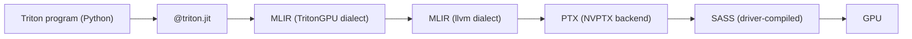

# Triton

<Mode is="learn">

> **Prereqs:** [SM Architecture](../../ml-execution/gpu-fundamentals/sm-architecture), [Thread Hierarchy](../../ml-execution/gpu-fundamentals/thread-hierarchy), [Shared Memory](../../ml-execution/gpu-fundamentals/shared-memory). Triton hides threads but not blocks; you need the SM picture in your head.

Before <Term name="triton">Triton</Term>, fast GPU code meant CUDA: 800 lines of C++ with intrinsics, template metaprogramming, manual `cp.async` orchestration, and a multi-day debugging cycle for every shape change. Hand-written tensor-core kernels were a specialist sport. Then OpenAI shipped Triton — a Python-syntax DSL where you program the *block* (one CTA's worth of work), operate on whole *tiles* (vectors and matrices), and let the compiler pick the threads-per-warp distribution and emit register-tiled, SMEM-staged, <Term name="tensor core">tensor-core</Term>-using kernels.

The mental shift is the lesson: **you write what looks like NumPy on tiles, and the compiler turns it into the C++ you'd have hand-written**. A kernel engineer who could ship one new optimized op per quarter in CUDA can ship one per week in Triton. Almost every modern open-source kernel project — vLLM, FlashAttention(-3), liger-kernel, Unsloth, the entirety of `torch.compile`'s code generation — uses Triton as its primary authoring surface. Knowing Triton fluently is table stakes for kernel work in 2026.

## TL;DR

- **Triton** is a Python-syntax kernel DSL that compiles via MLIR (TritonGPU dialect → llvm) to PTX. You write what looks like NumPy on tiles; the compiler emits register-tiled, SMEM-staged, tensor-core-using kernels.
- The mental shift: **you program the block, not the thread.** A Triton "program" is one CTA's worth of work. Inside it you operate on whole tiles (vectors, matrices); the compiler picks the threads-per-warp distribution.
- **`@triton.autotune`** picks the best (BLOCK_M, BLOCK_N, BLOCK_K, num_warps, num_stages) per-shape on first run. This is the feature that makes Triton competitive with hand-tuned CUTLASS without the maintenance.
- Triton is the *daily-driver* kernel language of OpenAI, the Triton-using parts of PyTorch (`torch.compile` lowers to it), and most performance-critical OSS work in 2025–2026. Hand-written CUTLASS still wins by 5–10% on edge cases.
- The 2024 frontier: Triton 3.x adds Hopper TMA and warp specialization. Triton on Blackwell (5th-gen tensor cores, FP4) lands incrementally through 2025–2026.

## Mental model



Same compilation chain as the [Foundation](../foundation) lessons taught — Triton just gives you an ergonomic frontend.

## Hello, Triton

The single canonical example: vector add.

```python
import triton
import triton.language as tl
import torch

@triton.jit
def add_kernel(x_ptr, y_ptr, out_ptr, n_elements,
               BLOCK_SIZE: tl.constexpr):
    pid = tl.program_id(axis=0)                       # this CTA's id along axis 0
    offsets = pid * BLOCK_SIZE + tl.arange(0, BLOCK_SIZE)
    mask = offsets < n_elements
    x = tl.load(x_ptr + offsets, mask=mask)
    y = tl.load(y_ptr + offsets, mask=mask)
    tl.store(out_ptr + offsets, x + y, mask=mask)

def add(x, y):
    out = torch.empty_like(x)
    n = x.numel()
    BLOCK = 1024
    grid = ((n + BLOCK - 1) // BLOCK,)
    add_kernel[grid](x, y, out, n, BLOCK_SIZE=BLOCK)
    return out
```

Things to notice:
- **`pid = tl.program_id(0)`** — this is the CTA's index along axis 0 of the launch grid. There's no `threadIdx`. The compiler picks the threads-per-warp layout.
- **`tl.arange(0, BLOCK_SIZE)`** — a vector of integers `[0, 1, ..., BLOCK_SIZE-1]`. This is your *tile axis*.
- **`mask`** — boundary tiles get partially-filled; the mask hides the off-end lanes during loads/stores. Skip the mask and you crash.
- **`tl.load`, `tl.store`** — vector ops over the tile. The compiler emits coalesced loads, often via cp.async on Hopper.
- **`BLOCK_SIZE: tl.constexpr`** — compile-time constant. Different `BLOCK_SIZE` → different compiled kernel.

## Matmul in 25 lines

Block-per-tile, identical to the CUDA version from [Thread Hierarchy](../../ml-execution/gpu-fundamentals/thread-hierarchy), much shorter:

```python
@triton.autotune(
    configs=[
        triton.Config({'BLOCK_M':128,'BLOCK_N':128,'BLOCK_K':32}, num_warps=4, num_stages=3),
        triton.Config({'BLOCK_M':128,'BLOCK_N':64, 'BLOCK_K':32}, num_warps=4, num_stages=4),
        triton.Config({'BLOCK_M':64, 'BLOCK_N':128,'BLOCK_K':32}, num_warps=4, num_stages=4),
        triton.Config({'BLOCK_M':128,'BLOCK_N':128,'BLOCK_K':64}, num_warps=8, num_stages=3),
    ],
    key=['M', 'N', 'K'],   # autotune cache keyed on these shape values
)
@triton.jit
def matmul_kernel(A, B, C, M, N, K,
                  stride_am, stride_ak, stride_bk, stride_bn, stride_cm, stride_cn,
                  BLOCK_M: tl.constexpr, BLOCK_N: tl.constexpr, BLOCK_K: tl.constexpr):
    pid_m = tl.program_id(0)
    pid_n = tl.program_id(1)

    offs_m = pid_m * BLOCK_M + tl.arange(0, BLOCK_M)
    offs_n = pid_n * BLOCK_N + tl.arange(0, BLOCK_N)
    offs_k = tl.arange(0, BLOCK_K)

    a_ptrs = A + (offs_m[:, None] * stride_am + offs_k[None, :] * stride_ak)
    b_ptrs = B + (offs_k[:, None] * stride_bk + offs_n[None, :] * stride_bn)

    acc = tl.zeros((BLOCK_M, BLOCK_N), dtype=tl.float32)
    for _ in range(0, K, BLOCK_K):
        a = tl.load(a_ptrs)
        b = tl.load(b_ptrs)
        acc += tl.dot(a, b)                         # this is one tensor-core mma
        a_ptrs += BLOCK_K * stride_ak
        b_ptrs += BLOCK_K * stride_bk

    c_ptrs = C + offs_m[:, None] * stride_cm + offs_n[None, :] * stride_cn
    tl.store(c_ptrs, acc.to(tl.float16))
```

That `tl.dot(a, b)` line is the entire tensor-core call. Triton emits `mma.sync` instructions; on Hopper it emits WGMMA; on Blackwell, 5th-gen tensor cores. **You don't change a line of code.** This is the productivity story.

## Autotuning — what's actually happening

<Term name="autotune">`@triton.autotune`</Term> compiles each config the first time the kernel is called with new shape values matching `key=`. It runs each config a few times, picks the fastest, caches the choice. Subsequent calls with matching shapes use the cached winner.

```python
out = matmul_func(A, B)             # first call: ~5–30 s as it tunes
out = matmul_func(A2, B2)           # same shapes: instant, uses cached config
out = matmul_func(A3, B3)           # different shapes: tunes again
```

The configs in your list aren't magic — they're the bands you've decided are reasonable. Standard recipe: include 4–8 configs spanning small/large block sizes and 4/8 warps. Triton picks. The compile time is real (especially with many configs); cache aggressively.

## TritonGPU and the IR

Internally, Triton compiles your code to **TritonGPU dialect** in MLIR. You can see this:

```bash
TRITON_INTERPRET=0 TRITON_KERNEL_DUMP=/tmp/triton_dump python script.py
```

In `/tmp/triton_dump/<your_kernel>/` you'll find `*.ttir` (high-level Triton IR), `*.ttgir` (TritonGPU IR with thread/tile layout), `*.llir` (LLVM IR), `*.ptx`, `*.cubin`. Reading these dumps is how kernel engineers debug "why is my kernel slow" — usually it's a layout choice the autotuner made that's wrong for your shapes.

## When Triton wins, when it loses

**Wins:**
- Shapes the autotune covers well (typical AI workloads: matmul, attention, reductions).
- Anything with regular tiling.
- Anywhere developer time matters more than the last 5%.
- Cross-architecture (a Triton kernel runs on Ampere, Hopper, AMD MI300X, in principle Blackwell) without source change.

**Loses to CUTLASS or hand-written CUDA:**
- Edge shapes (very small N, weird strides, mixed-precision oddities).
- Kernels needing precise control over warp specialization, async pipelines, register banking.
- Anything pre-existing in CUTLASS that you can paste in.

In practice, ~95% of new production kernel work in 2025–2026 starts in Triton; <Term name="cutlass">CUTLASS</Term> is the fallback when the last 5–10% matters.

## Run it in your browser — Triton-shaped tile algebra

Pyodide doesn't have CUDA, but we can demonstrate the *programming model* — vectorized tile ops, masked loads, accumulator patterns — in numpy.

<RunInBrowser
  description="Simulate a Triton matmul program: tile-shaped numpy ops, blockwise accumulation."
  code={`import numpy as np

def matmul_program(A, B, BLOCK_M=64, BLOCK_N=64, BLOCK_K=32):
    """Mimic a Triton kernel by iterating CTAs and accumulating per tile."""
    M, K = A.shape
    K2, N = B.shape
    assert K == K2
    out = np.zeros((M, N), dtype=np.float32)
    n_blocks_m = (M + BLOCK_M - 1) // BLOCK_M
    n_blocks_n = (N + BLOCK_N - 1) // BLOCK_N
    for pid_m in range(n_blocks_m):
        for pid_n in range(n_blocks_n):
            # === one CTA / one Triton program ===
            offs_m = pid_m * BLOCK_M + np.arange(BLOCK_M)
            offs_n = pid_n * BLOCK_N + np.arange(BLOCK_N)
            mask_m = offs_m < M
            mask_n = offs_n < N
            acc = np.zeros((BLOCK_M, BLOCK_N), dtype=np.float32)
            for k0 in range(0, K, BLOCK_K):
                offs_k = k0 + np.arange(BLOCK_K)
                mask_k = offs_k < K
                # load tiles with masking
                a = np.where(mask_m[:, None] & mask_k[None, :],
                             A[np.minimum(offs_m[:, None], M-1),
                               np.minimum(offs_k[None, :], K-1)], 0)
                b = np.where(mask_k[:, None] & mask_n[None, :],
                             B[np.minimum(offs_k[:, None], K-1),
                               np.minimum(offs_n[None, :], N-1)], 0)
                acc += a @ b                       # the "tl.dot" — tensor-core in Triton
            # store
            for i, mi in enumerate(offs_m[mask_m]):
                for j, mj in enumerate(offs_n[mask_n]):
                    out[mi, mj] = acc[i, j]
    return out

# Try it
rng = np.random.default_rng(0)
A = rng.standard_normal((200, 100)).astype(np.float32)
B = rng.standard_normal((100, 150)).astype(np.float32)

ours = matmul_program(A, B, BLOCK_M=64, BLOCK_N=64, BLOCK_K=32)
ref  = A @ B
print(f"max abs error vs np.matmul: {np.abs(ours - ref).max():.6e}")
print(f"shape: {ours.shape}, ref shape: {ref.shape}")
print(f"\\nThis is the program a Triton CTA runs.")
print(f"In real Triton, tl.dot is one tensor-core mma; here it's np matmul on a tile.")
`}
/>

The shape — outer loop over tiles, inner accumulator, masked loads at boundaries — is exactly the structure you'll write in Triton. The only difference on the GPU is `tl.dot` becomes a tensor-core call and the entire tile lives in registers.

## Quick check

<FillIn
  prompt="The Triton intrinsic that maps to one tensor-core matmul-and-accumulate:"
  answer="tl.dot"
  accept={["triton.dot", "tl.dot(a, b)"]}
  hint="Two-letter prefix; one word."
  explanation="`tl.dot(a, b)` lowers to `mma.sync` on Ampere, `wgmma` on Hopper, 5th-gen mma on Blackwell. Triton picks per-architecture; you don't change source."
/>

<Quiz
  question="A Triton kernel runs slowly on the first call but fast on subsequent calls with similar shapes. The most likely cause:"
  options={[
    'A bug.',
    '@triton.autotune is benchmarking configs the first time and caching the winner; subsequent calls use the cached choice.',
    'GPU is warming up.',
    'PyTorch is allocating workspace.',
  ]}
  answer={1}
  explanation="First-call latency on autotuned kernels is the autotuner running each config and timing it. Cache by setting `key=['M','N','K']` so similar shapes reuse the result. Pre-warming for production: invoke the kernel on representative shapes during deployment startup so the cache is populated before user traffic."
/>

## Key takeaways

1. **Triton = block-programming.** `program_id` instead of threadIdx; tile-shaped tensors instead of per-thread scalars.
2. **`tl.dot` is the tensor-core call.** One line, all the mma machinery.
3. **`@triton.autotune` is what makes it ship.** It picks (BLOCK_M, BLOCK_N, BLOCK_K, num_warps, num_stages) per shape. Cache aggressively.
4. **TritonGPU dialect → llvm → PTX → SASS.** When debugging, dump the IR at every level.
5. **Triton wins on developer time, CUTLASS wins on the last 5%.** Most new production kernel work in 2026 starts here.

## Go deeper

<Resources
  items={[
    { kind: 'paper', href: 'https://www.eecs.harvard.edu/~htk/publication/2019-mapl-tillet-kung-cox.pdf', title: 'Triton: An Intermediate Language and Compiler for Tiled Neural Network Computations', author: 'Tillet et al., MAPL 2019', note: 'The original paper. Section 4 has the tile-IR design that became TritonGPU.' },
    { kind: 'docs', href: 'https://triton-lang.org/main/', title: 'Triton Documentation', note: 'Up-to-date for Triton 3.x. The "Tutorials" pages are the canonical entry point — vector add, matmul, fused softmax, dropout, attention.' },
    { kind: 'blog', href: 'https://openai.com/index/triton/', title: 'OpenAI Blog — Introducing Triton', note: 'The original announcement. Useful for the "why" before diving into the tutorials.' },
    { kind: 'video', href: 'https://www.youtube.com/watch?v=DdTsX6DQk24', title: 'Phil Tillet — Triton: Programming Models for Hardware Accelerators', note: 'Talk by Triton\'s author. Best motivation for the design choices.' },
    { kind: 'blog', href: 'https://research.colfax-intl.com/triton-deep-dive/', title: 'Colfax — Triton Deep Dive Series', note: 'Modern (2024) walkthroughs of Hopper-specific Triton features (TMA, WGMMA).' },
    { kind: 'repo', href: 'https://github.com/triton-lang/triton', title: 'triton-lang/triton', note: 'The compiler. `python/triton/` is the frontend; `lib/Conversion/` is where the lowerings live.' },
    { kind: 'repo', href: 'https://github.com/Dao-AILab/flash-attention', title: 'Dao-AILab/flash-attention', note: 'The Triton FlashAttention reference — a real-world frontier kernel readable in an evening.' },
  ]}
/>

</Mode>

<Mode is="reference">

> **Prereqs:** [SM Architecture](../../ml-execution/gpu-fundamentals/sm-architecture), [Thread Hierarchy](../../ml-execution/gpu-fundamentals/thread-hierarchy), [Shared Memory](../../ml-execution/gpu-fundamentals/shared-memory). Triton hides threads but not blocks; you need the SM picture in your head.

## TL;DR

- **Triton** is a Python-syntax kernel DSL that compiles via MLIR (TritonGPU dialect → llvm) to PTX. You write what looks like NumPy on tiles; the compiler emits register-tiled, SMEM-staged, tensor-core-using kernels.
- The mental shift: **you program the block, not the thread.** A Triton "program" is one CTA's worth of work. Inside it you operate on whole tiles (vectors, matrices); the compiler picks the threads-per-warp distribution.
- **`@triton.autotune`** picks the best (BLOCK_M, BLOCK_N, BLOCK_K, num_warps, num_stages) per-shape on first run. This is the feature that makes Triton competitive with hand-tuned CUTLASS without the maintenance.
- Triton is the *daily-driver* kernel language of OpenAI, the Triton-using parts of PyTorch (`torch.compile` lowers to it), and most performance-critical OSS work in 2025–2026. Hand-written CUTLASS still wins by 5–10% on edge cases.
- The 2024 frontier: Triton 3.x adds Hopper TMA and warp specialization. Triton on Blackwell (5th-gen tensor cores, FP4) lands incrementally through 2025–2026.

## Why this matters

Before Triton, fast GPU code meant CUDA: 800 lines of C++ with intrinsics, template metaprogramming, and a multi-day debugging cycle for every shape change. After Triton, fast GPU code means 80 lines of Python that *the compiler* turns into the C++ you'd have hand-written. The productivity multiplier is real — a kernel engineer who could ship one new optimized op per quarter in CUDA can ship one per week in Triton. Almost every modern open-source kernel project — vLLM, FlashAttention(-3), liger-kernel, Unsloth, the entirety of `torch.compile`'s code generation — uses Triton as its primary authoring surface.

Knowing Triton fluently is the table stakes for kernel work in 2026.

## Mental model


Same compilation chain as the [Foundation](../foundation) lessons taught — Triton just gives you an ergonomic frontend.

## Concrete walkthrough

### Hello, Triton

The single canonical example: vector add.

```python
import triton
import triton.language as tl
import torch

@triton.jit
def add_kernel(x_ptr, y_ptr, out_ptr, n_elements,
               BLOCK_SIZE: tl.constexpr):
    pid = tl.program_id(axis=0)                       # this CTA's id along axis 0
    offsets = pid * BLOCK_SIZE + tl.arange(0, BLOCK_SIZE)
    mask = offsets < n_elements
    x = tl.load(x_ptr + offsets, mask=mask)
    y = tl.load(y_ptr + offsets, mask=mask)
    tl.store(out_ptr + offsets, x + y, mask=mask)

def add(x, y):
    out = torch.empty_like(x)
    n = x.numel()
    BLOCK = 1024
    grid = ((n + BLOCK - 1) // BLOCK,)
    add_kernel[grid](x, y, out, n, BLOCK_SIZE=BLOCK)
    return out
```

Things to notice:
- **`pid = tl.program_id(0)`** — this is the CTA's index along axis 0 of the launch grid. There's no `threadIdx`. The compiler picks the threads-per-warp layout.
- **`tl.arange(0, BLOCK_SIZE)`** — a vector of integers `[0, 1, ..., BLOCK_SIZE-1]`. This is your *tile axis*.
- **`mask`** — boundary tiles get partially-filled; the mask hides the off-end lanes during loads/stores. Skip the mask and you crash.
- **`tl.load`, `tl.store`** — vector ops over the tile. The compiler emits coalesced loads, often via cp.async on Hopper.
- **`BLOCK_SIZE: tl.constexpr`** — compile-time constant. Different `BLOCK_SIZE` → different compiled kernel.

### Matmul in 25 lines

Block-per-tile, identical to the CUDA version from [Thread Hierarchy](../../ml-execution/gpu-fundamentals/thread-hierarchy), much shorter:

```python
@triton.autotune(
    configs=[
        triton.Config({'BLOCK_M':128,'BLOCK_N':128,'BLOCK_K':32}, num_warps=4, num_stages=3),
        triton.Config({'BLOCK_M':128,'BLOCK_N':64, 'BLOCK_K':32}, num_warps=4, num_stages=4),
        triton.Config({'BLOCK_M':64, 'BLOCK_N':128,'BLOCK_K':32}, num_warps=4, num_stages=4),
        triton.Config({'BLOCK_M':128,'BLOCK_N':128,'BLOCK_K':64}, num_warps=8, num_stages=3),
    ],
    key=['M', 'N', 'K'],   # autotune cache keyed on these shape values
)
@triton.jit
def matmul_kernel(A, B, C, M, N, K,
                  stride_am, stride_ak, stride_bk, stride_bn, stride_cm, stride_cn,
                  BLOCK_M: tl.constexpr, BLOCK_N: tl.constexpr, BLOCK_K: tl.constexpr):
    pid_m = tl.program_id(0)
    pid_n = tl.program_id(1)

    offs_m = pid_m * BLOCK_M + tl.arange(0, BLOCK_M)
    offs_n = pid_n * BLOCK_N + tl.arange(0, BLOCK_N)
    offs_k = tl.arange(0, BLOCK_K)

    a_ptrs = A + (offs_m[:, None] * stride_am + offs_k[None, :] * stride_ak)
    b_ptrs = B + (offs_k[:, None] * stride_bk + offs_n[None, :] * stride_bn)

    acc = tl.zeros((BLOCK_M, BLOCK_N), dtype=tl.float32)
    for _ in range(0, K, BLOCK_K):
        a = tl.load(a_ptrs)
        b = tl.load(b_ptrs)
        acc += tl.dot(a, b)                         # this is one tensor-core mma
        a_ptrs += BLOCK_K * stride_ak
        b_ptrs += BLOCK_K * stride_bk

    c_ptrs = C + offs_m[:, None] * stride_cm + offs_n[None, :] * stride_cn
    tl.store(c_ptrs, acc.to(tl.float16))
```

That `tl.dot(a, b)` line is the entire tensor-core call. Triton emits `mma.sync` instructions; on Hopper it emits WGMMA; on Blackwell, 5th-gen tensor cores. **You don't change a line of code.** This is the productivity story.

### Autotuning — what's actually happening

`@triton.autotune` compiles each config the first time the kernel is called with new shape values matching `key=`. It runs each config a few times, picks the fastest, caches the choice. Subsequent calls with matching shapes use the cached winner.

```python
out = matmul_func(A, B)             # first call: ~5–30 s as it tunes
out = matmul_func(A2, B2)           # same shapes: instant, uses cached config
out = matmul_func(A3, B3)           # different shapes: tunes again
```

The configs in your list aren't magic — they're the bands you've decided are reasonable. Standard recipe: include 4–8 configs spanning small/large block sizes and 4/8 warps. Triton picks. The compile time is real (especially with many configs); cache aggressively.

### TritonGPU and the IR

Internally, Triton compiles your code to **TritonGPU dialect** in MLIR. You can see this:

```bash
TRITON_INTERPRET=0 TRITON_KERNEL_DUMP=/tmp/triton_dump python script.py
```

In `/tmp/triton_dump/<your_kernel>/` you'll find `*.ttir` (high-level Triton IR), `*.ttgir` (TritonGPU IR with thread/tile layout), `*.llir` (LLVM IR), `*.ptx`, `*.cubin`. Reading these dumps is how kernel engineers debug "why is my kernel slow" — usually it's a layout choice the autotuner made that's wrong for your shapes.

### When Triton wins, when it loses

**Wins:**
- Shapes the autotune covers well (typical AI workloads: matmul, attention, reductions).
- Anything with regular tiling.
- Anywhere developer time matters more than the last 5%.
- Cross-architecture (a Triton kernel runs on Ampere, Hopper, AMD MI300X, in principle Blackwell) without source change.

**Loses to CUTLASS or hand-written CUDA:**
- Edge shapes (very small N, weird strides, mixed-precision oddities).
- Kernels needing precise control over warp specialization, async pipelines, register banking.
- Anything pre-existing in CUTLASS that you can paste in.

In practice, ~95% of new production kernel work in 2025–2026 starts in Triton; CUTLASS is the fallback when the last 5–10% matters.

## Run it in your browser — Triton-shaped tile algebra

Pyodide doesn't have CUDA, but we can demonstrate the *programming model* — vectorized tile ops, masked loads, accumulator patterns — in numpy.

<RunInBrowser
  description="Simulate a Triton matmul program: tile-shaped numpy ops, blockwise accumulation."
  code={`import numpy as np

def matmul_program(A, B, BLOCK_M=64, BLOCK_N=64, BLOCK_K=32):
    """Mimic a Triton kernel by iterating CTAs and accumulating per tile."""
    M, K = A.shape
    K2, N = B.shape
    assert K == K2
    out = np.zeros((M, N), dtype=np.float32)
    n_blocks_m = (M + BLOCK_M - 1) // BLOCK_M
    n_blocks_n = (N + BLOCK_N - 1) // BLOCK_N
    for pid_m in range(n_blocks_m):
        for pid_n in range(n_blocks_n):
            # === one CTA / one Triton program ===
            offs_m = pid_m * BLOCK_M + np.arange(BLOCK_M)
            offs_n = pid_n * BLOCK_N + np.arange(BLOCK_N)
            mask_m = offs_m < M
            mask_n = offs_n < N
            acc = np.zeros((BLOCK_M, BLOCK_N), dtype=np.float32)
            for k0 in range(0, K, BLOCK_K):
                offs_k = k0 + np.arange(BLOCK_K)
                mask_k = offs_k < K
                # load tiles with masking
                a = np.where(mask_m[:, None] & mask_k[None, :],
                             A[np.minimum(offs_m[:, None], M-1),
                               np.minimum(offs_k[None, :], K-1)], 0)
                b = np.where(mask_k[:, None] & mask_n[None, :],
                             B[np.minimum(offs_k[:, None], K-1),
                               np.minimum(offs_n[None, :], N-1)], 0)
                acc += a @ b                       # the "tl.dot" — tensor-core in Triton
            # store
            for i, mi in enumerate(offs_m[mask_m]):
                for j, mj in enumerate(offs_n[mask_n]):
                    out[mi, mj] = acc[i, j]
    return out

# Try it
rng = np.random.default_rng(0)
A = rng.standard_normal((200, 100)).astype(np.float32)
B = rng.standard_normal((100, 150)).astype(np.float32)

ours = matmul_program(A, B, BLOCK_M=64, BLOCK_N=64, BLOCK_K=32)
ref  = A @ B
print(f"max abs error vs np.matmul: {np.abs(ours - ref).max():.6e}")
print(f"shape: {ours.shape}, ref shape: {ref.shape}")
print(f"\\nThis is the program a Triton CTA runs.")
print(f"In real Triton, tl.dot is one tensor-core mma; here it's np matmul on a tile.")
`}
/>

The shape — outer loop over tiles, inner accumulator, masked loads at boundaries — is exactly the structure you'll write in Triton. The only difference on the GPU is `tl.dot` becomes a tensor-core call and the entire tile lives in registers.

## Quick check

<FillIn
  prompt="The Triton intrinsic that maps to one tensor-core matmul-and-accumulate:"
  answer="tl.dot"
  accept={["triton.dot", "tl.dot(a, b)"]}
  hint="Two-letter prefix; one word."
  explanation="`tl.dot(a, b)` lowers to `mma.sync` on Ampere, `wgmma` on Hopper, 5th-gen mma on Blackwell. Triton picks per-architecture; you don't change source."
/>

<Quiz
  question="A Triton kernel runs slowly on the first call but fast on subsequent calls with similar shapes. The most likely cause:"
  options={[
    'A bug.',
    '@triton.autotune is benchmarking configs the first time and caching the winner; subsequent calls use the cached choice.',
    'GPU is warming up.',
    'PyTorch is allocating workspace.',
  ]}
  answer={1}
  explanation="First-call latency on autotuned kernels is the autotuner running each config and timing it. Cache by setting `key=['M','N','K']` so similar shapes reuse the result. Pre-warming for production: invoke the kernel on representative shapes during deployment startup so the cache is populated before user traffic."
/>

## Key takeaways

1. **Triton = block-programming.** `program_id` instead of threadIdx; tile-shaped tensors instead of per-thread scalars.
2. **`tl.dot` is the tensor-core call.** One line, all the mma machinery.
3. **`@triton.autotune` is what makes it ship.** It picks (BLOCK_M, BLOCK_N, BLOCK_K, num_warps, num_stages) per shape. Cache aggressively.
4. **TritonGPU dialect → llvm → PTX → SASS.** When debugging, dump the IR at every level.
5. **Triton wins on developer time, CUTLASS wins on the last 5%.** Most new production kernel work in 2026 starts here.

## Go deeper

<Resources
  items={[
    { kind: 'paper', href: 'https://www.eecs.harvard.edu/~htk/publication/2019-mapl-tillet-kung-cox.pdf', title: 'Triton: An Intermediate Language and Compiler for Tiled Neural Network Computations', author: 'Tillet et al., MAPL 2019', note: 'The original paper. Section 4 has the tile-IR design that became TritonGPU.' },
    { kind: 'docs', href: 'https://triton-lang.org/main/', title: 'Triton Documentation', note: 'Up-to-date for Triton 3.x. The "Tutorials" pages are the canonical entry point — vector add, matmul, fused softmax, dropout, attention.' },
    { kind: 'blog', href: 'https://openai.com/index/triton/', title: 'OpenAI Blog — Introducing Triton', note: 'The original announcement. Useful for the "why" before diving into the tutorials.' },
    { kind: 'video', href: 'https://www.youtube.com/watch?v=DdTsX6DQk24', title: 'Phil Tillet — Triton: Programming Models for Hardware Accelerators', note: 'Talk by Triton\'s author. Best motivation for the design choices.' },
    { kind: 'blog', href: 'https://research.colfax-intl.com/triton-deep-dive/', title: 'Colfax — Triton Deep Dive Series', note: 'Modern (2024) walkthroughs of Hopper-specific Triton features (TMA, WGMMA).' },
    { kind: 'repo', href: 'https://github.com/triton-lang/triton', title: 'triton-lang/triton', note: 'The compiler. `python/triton/` is the frontend; `lib/Conversion/` is where the lowerings live.' },
    { kind: 'repo', href: 'https://github.com/Dao-AILab/flash-attention', title: 'Dao-AILab/flash-attention', note: 'The Triton FlashAttention reference — a real-world frontier kernel readable in an evening.' },
  ]}
/>

</Mode>

<LessonComplete />
