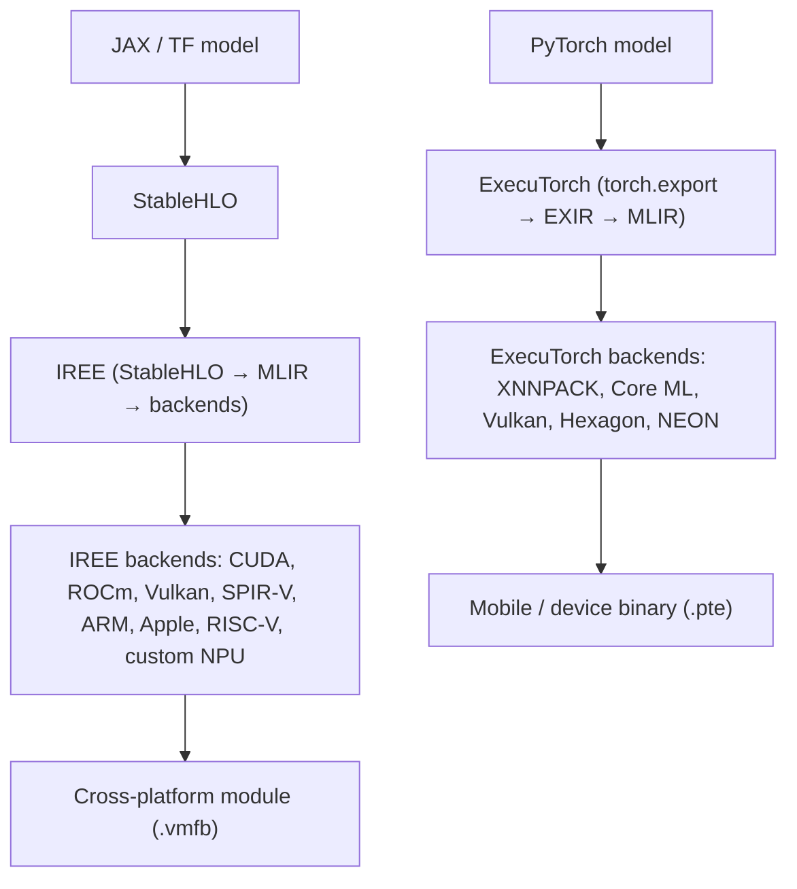

# IREE & ExecuTorch

> **Prereqs:** [MLIR Overview](../foundation/mlir-overview), [Dialects & Lowering](../foundation/lowering). These are MLIR-based compilers in production.

## TL;DR

- **IREE** (Intermediate Representation Execution Environment) is Google's open-source compiler + runtime. Compiles models (any frontend that emits StableHLO/MLIR) to a portable artifact that runs on CPU, GPU, NPU, edge silicon. Strongest production story for AMD, Apple, embedded.
- **ExecuTorch** is PyTorch's *mobile* runtime. Takes a `torch.export()`-d model graph, lowers through an MLIR-based path, produces a `.pte` (PyTorch ExecuTorch) artifact you ship in an app bundle.
- Both compile **ahead of time**. There's no Python at runtime; the deployable artifact is a tiny binary.
- Both are **MLIR-native** — they compose with the dialects you saw in [MLIR Overview](../foundation/mlir-overview), and accept custom dialects from hardware vendors. This is how Apple, Qualcomm, and AMD ship their NPU support.
- For 2026 deployment: ExecuTorch is the path for PyTorch → mobile (Meta, OEM partners). IREE is the path for cross-framework, cross-hardware deployment, especially edge.

## Why this matters

Once your model leaves the GPU cluster and starts living on a phone, an AR headset, a robot, or a $30 microcontroller, you're not running Python. You're running a binary the deployment compiler produced. **IREE and ExecuTorch are how that binary gets made.** They're also the bridge between the AI research stack (PyTorch, JAX) and the device-vendor ecosystem (Apple Neural Engine, Qualcomm Hexagon, ARM Ethos, etc.) — vendors plug their NPU support in as MLIR dialects on top of these compilers.

If you're going to do edge AI work, knowing one of these two is the gate.

## Mental model



Both stacks: model → MLIR → device-specific backend → AOT artifact. IREE is hardware-broader; ExecuTorch is PyTorch-native.

## Concrete walkthrough

### ExecuTorch — the PyTorch story

The mobile-friendly successor to PyTorch Mobile. Workflow:

```python
import torch
from executorch.exir import to_edge
from executorch.backends.xnnpack.partition.xnnpack_partitioner import XnnpackPartitioner

class MyModel(torch.nn.Module):
    def __init__(self):
        super().__init__()
        self.linear = torch.nn.Linear(128, 128)

    def forward(self, x):
        return torch.relu(self.linear(x))

model = MyModel().eval()
example_input = (torch.randn(1, 128),)

# Step 1: torch.export — captures a static FX graph.
exported = torch.export.export(model, example_input)

# Step 2: Lower to EXIR (Edge IR). Quantize if desired.
edge = to_edge(exported)

# Step 3: Pick backends. XNNPACK for CPU; Vulkan for Android GPU; Core ML for iOS NPU.
edge = edge.to_backend(XnnpackPartitioner())

# Step 4: Compile + serialize. Output is a .pte file.
program = edge.to_executorch()
with open("model.pte", "wb") as f:
    f.write(program.buffer)
```

The artifact is the `.pte` file — typically ~MB-scale, no Python, no dynamic-shape tracing at runtime. You load it via the C++ runtime (or one of the language bindings — Swift for iOS, Kotlin/Java for Android).

The **partitioner** decides which subgraph runs on which backend. For example: matmuls on Apple Neural Engine, control flow on CPU, custom op on a vendor NPU. Partitioning is done at compile time; the runtime just dispatches per-subgraph.

### IREE — the cross-framework story

IREE accepts StableHLO (from JAX, TF, ONNX, or PyTorch via `torch-mlir`), lowers through MLIR dialects, and emits a self-contained "VM module" (`.vmfb`) plus a hardware-specific binary blob.

Workflow:

```bash
# 1. Get model into StableHLO. From JAX:
python -c "import jax; ... export.export(my_jax_function).export_to_stablehlo()"

# 2. Compile with IREE for a chosen backend.
iree-compile --iree-hal-target-backends=cuda --iree-hal-cuda-llvm-target-arch=sm_90a my_model.mlirbc -o my_model.vmfb

# 3. Run via the IREE runtime.
iree-run-module --module=my_model.vmfb --device=cuda --function=forward --input=1x128xf32=...
```

What `iree-compile` runs internally:
1. Parse StableHLO.
2. Convert to IREE's input dialects.
3. Run high-level optimizations (op fusion, layout selection).
4. Lower to dispatch dialects (one dispatch per fused kernel).
5. Lower per-dispatch to the target backend (LLVM-CPU, NVVM, ROCm, Vulkan/SPIR-V, custom).
6. Serialize as VMFB.

Same MLIR pipeline as in [Dialects & Lowering](../foundation/lowering), just with IREE-specific high-level dialects on top.

### Why two compilers exist

ExecuTorch was created (2023–2024) because PyTorch needed a mobile-first answer with tight integration to `torch.export`. IREE was created (2020) as a generally-portable AI runtime. They overlap but serve different audiences:

| | ExecuTorch | IREE |
|---|---|---|
| Frontend | PyTorch only | StableHLO (JAX/TF/ONNX/torch-mlir) |
| Mobile story | First-class | Good; less polished than ExecuTorch |
| Vendor NPU support | Fast (Meta partnerships) | Broader (any NPU vendor can write an MLIR backend) |
| Quantization | Built-in via `torch.ao.quantization` | Per-backend; less unified |
| Best fit | PyTorch + iOS / Android | Cross-framework + custom hardware |

In 2026: ExecuTorch dominates PyTorch-on-phone deployments (Meta uses it, OEM partners ship with it). IREE is the answer when you need a JAX model on a custom chip, or when you want one compiler to target many heterogeneous devices.

### Quantization — where the deployable wins

Both compilers support int8 / int4 quantization integrated with the lowering pipeline:

- **ExecuTorch + PT2E quantization**: a calibration pass during `to_edge()` produces a quantized graph with quantize/dequantize ops at boundaries; the partitioner decides which backend handles the quantized math.
- **IREE + StableHLO/MHLO quantization**: similar story; integer ops travel down the lowering chain to the target.

A 4-bit Llama-3.2-3B compiled via ExecuTorch is ~2 GB and runs at ~15 tokens/sec on a recent iPhone Pro using the Core ML backend. The same model compiled via IREE for a Qualcomm Hexagon NPU lands at similar throughput on Snapdragon. **The compiler is what makes this size and speed possible** — the model file is just weights; the kernels that run them on each chip come from these MLIR pipelines.

### What "deploying via IREE" looks like in production

The model gets compiled once, ahead of time, on a developer machine. The `.vmfb` ships with the app. The runtime is small (a few hundred KB statically linked), with no Python, no PyTorch. The runtime exposes a C API; you wrap it in Swift / Kotlin / Rust / whatever your app uses. This is roughly the same shape as the [Serve & Ship capstone](../../applied/serve) — but instead of llama.cpp doing the GGUF interpretation, IREE or ExecuTorch is doing the generated-kernel dispatch.

## Run it in your browser — toy partitioning simulator

<RunInBrowser
  description="Decide which ops run on which backend, the way ExecuTorch's partitioner does."
  code={`# Simulate: a graph of ops, each with a 'cost' on each backend (or None if unsupported).
graph = [
    ('input',   {}),
    ('matmul',  {'cpu': 100, 'npu': 10,  'gpu': 5}),
    ('relu',    {'cpu': 5,   'npu': 1,   'gpu': 1}),
    ('softmax', {'cpu': 30,  'gpu': 5}),                 # not on NPU
    ('matmul',  {'cpu': 100, 'npu': 10,  'gpu': 5}),
    ('topk',    {'cpu': 20}),                              # CPU only — control flow / sort
    ('output',  {}),
]

def partition(graph, switch_cost=8):
    """Greedy partitioner: pick the cheapest backend per op, but pay 'switch_cost'
       every time the backend changes between consecutive ops (transfer overhead)."""
    last_be = None
    total = 0
    plan = []
    for name, costs in graph:
        if not costs:
            plan.append((name, '—', 0)); continue
        candidates = [(be, c + (switch_cost if last_be and be != last_be else 0))
                      for be, c in costs.items()]
        be, cost = min(candidates, key=lambda x: x[1])
        plan.append((name, be, cost))
        total += cost
        last_be = be
    return plan, total

plan, total = partition(graph, switch_cost=8)
print(f"{'op':<10} {'backend':<8} {'cost':>6}")
print('-' * 28)
for name, be, c in plan:
    print(f"{name:<10} {be:<8} {c:>6}")
print(f"{'-' * 28}\\n{'total':<10} {'':<8} {total:>6}")
print()
print("Notice: softmax forces a switch off NPU because the NPU doesn't support it,")
print("paying the switch cost each way. A real partitioner uses cost models like this.")
`}
/>

The shape (one backend per op, costs include transfer-on-switch) is precisely what ExecuTorch's `Partitioner` and IREE's dispatch-formation pass do. Real partitioners use much richer cost models (fused-kernel memory traffic, batch effects, hardware utilization), but the algorithm is structurally the same.

## Quick check

<FillIn
  prompt="ExecuTorch's compiled artifact extension:"
  answer=".pte"
  accept={["pte", "*.pte"]}
  hint="Three letters; PyTorch ExecuTorch."
  explanation="`.pte` files are the deployable: weights + kernel-dispatch graph + backend-specific blobs. Load via the ExecuTorch C++ runtime; ~few hundred KB to ship the runtime, then your model size."
/>

<Quiz
  question="A startup wants to run a custom PyTorch model on a brand-new Qualcomm Hexagon NPU. The right path:"
  options={[
    'Hand-rewrite the model in C++ for Hexagon.',
    'Use ExecuTorch with the Hexagon backend, or IREE with a Qualcomm-provided MLIR backend — both lower the PyTorch model through MLIR to Hexagon-native code.',
    'Train the model in TensorFlow.',
    'Run PyTorch with TorchServe on the device.',
  ]}
  answer={1}
  explanation="ExecuTorch + Hexagon delegate is the standard path; IREE + a Qualcomm MLIR backend is the alternative. Both are how AI models actually reach NPUs in 2025–2026: PyTorch → MLIR-based deployment compiler → vendor-specific kernels. PyTorch + TorchServe is for cloud serving, not on-device. C++ rewrites die under the maintenance cost of every model update."
/>

## Key takeaways

1. **IREE and ExecuTorch are the two MLIR-based deployment compilers.** They take a research-framework model and produce a small, fast, no-Python deployable.
2. **ExecuTorch is PyTorch-native** with the strongest mobile story. **IREE is cross-framework** with the broadest hardware backend support.
3. **Both AOT-compile.** The model + kernels are baked into a single artifact; runtime is tiny and Python-free.
4. **The partitioner is the magic.** It decides which subgraph runs on which backend (CPU, GPU, NPU, custom) given vendor constraints.
5. **Vendor NPU support arrives via MLIR backends.** Apple, Qualcomm, AMD, and the long tail of edge silicon all plug in here.

## Go deeper

<Resources
  items={[
    { kind: 'docs', href: 'https://pytorch.org/executorch/stable/index.html', title: 'ExecuTorch Documentation', note: 'Authoritative. The "Concepts" + "Quick Start" pages walk you from `torch.export` to a deployed `.pte` in 30 minutes.' },
    { kind: 'docs', href: 'https://iree.dev/', title: 'IREE Documentation', note: 'Up-to-date. The "Getting Started" + "Compiler" sections cover the StableHLO → VMFB pipeline.' },
    { kind: 'paper', href: 'https://arxiv.org/abs/2509.04701', title: 'ExecuTorch: From PyTorch to On-Device AI', author: 'Meta, 2025', note: 'The system paper. Section 3 has the partitioner cost model; section 5 has real deployment numbers across iOS, Android, and embedded.' },
    { kind: 'blog', href: 'https://pytorch.org/blog/executorch-alpha/', title: 'PyTorch Blog — ExecuTorch Alpha', note: 'Original announcement; useful for the design motivation.' },
    { kind: 'video', href: 'https://www.youtube.com/watch?v=2pLp9RaIcZ4', title: 'IREE — Cross-Platform AI Compilation', note: 'Talk by core IREE devs. Best motivation for "why a separate compiler from XLA".' },
    { kind: 'repo', href: 'https://github.com/pytorch/executorch', title: 'pytorch/executorch', note: '`backends/` for Apple/Vulkan/Hexagon/XNNPACK; `examples/` for end-to-end recipes.' },
    { kind: 'repo', href: 'https://github.com/iree-org/iree', title: 'iree-org/iree', note: '`compiler/src/iree/compiler/Codegen/` is the codegen pipeline; `samples/` has working PyTorch + JAX + ONNX examples.' },
  ]}
/>

<LessonComplete />
