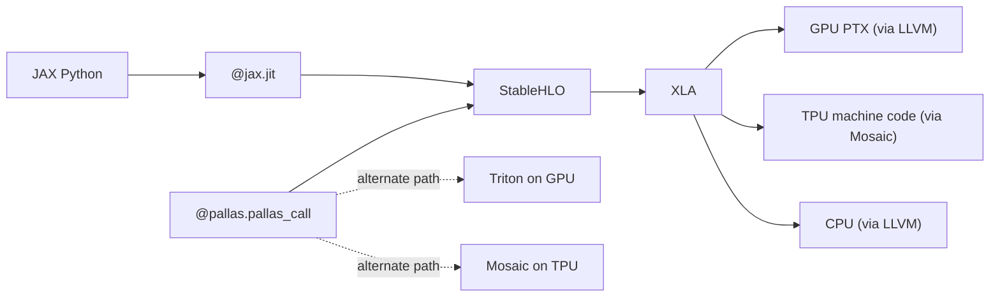

# JAX & Pallas

> **Prereqs:** [Triton](../kernels/triton), [MLIR Overview](../foundation/mlir-overview), [Operator Fusion](./operator-fusion). Pallas is "Triton, but for the JAX/XLA stack."

## TL;DR

- **JAX** uses a different compiler stack than PyTorch. `jit`-decorated functions trace to **StableHLO** (a stable subset of HLO, the XLA op set), then XLA compiles to GPU/TPU.
- **XLA** is the long-standing graph compiler (Google, ~2017+). It does fusion, layout assignment, code-gen for GPU/TPU/CPU. It's the production compiler that runs Gemini, every Google production model, and JAX-based research everywhere.
- **Pallas** is JAX's *kernel DSL* — Triton-like, but inside JAX. You write a JAX function, decorate it with `pallas.pallas_call`, and it lowers to a hand-written kernel for GPU (via Triton) *or* TPU (via Mosaic, a TPU-specific kernel emitter).
- The single most distinctive thing about Pallas: **the same kernel source can target both GPU and TPU**. The dtype/layout primitives are the same; the backend chooses how to lower.
- For 2026 production: JAX is the dominant choice for TPU work, neck-and-neck with PyTorch on GPU. Pallas is the kernel escape hatch — used heavily inside Google for Gemini training, increasingly used externally for high-perf JAX kernels.

## Why this matters

The JAX/XLA stack is the *other* world of AI compilation. PyTorch dominates research-volume in 2026; JAX dominates TPU work and a meaningful slice of frontier training (Anthropic, Google, parts of OpenAI). Knowing how XLA differs from Inductor — and how Pallas differs from Triton — is the price of admission for working in any JAX-using lab.

## Mental model



XLA is the umbrella; StableHLO is its IR; Pallas is the user-written-kernel escape hatch that hooks into the same lowering chain.

## Concrete walkthrough

### A JAX function and what XLA does to it

```python
import jax
import jax.numpy as jnp

@jax.jit
def f(x, w, b):
    return jax.nn.relu(x @ w + b)

# First call: trace + compile (slow). Subsequent calls: cached, fast.
out = f(jnp.ones((128, 256)), jnp.ones((256, 64)), jnp.zeros(64))
```

What happens in order:
1. JAX's tracer runs `f` with abstract values, producing a **jaxpr** (JAX's internal IR).
2. The jaxpr lowers to **StableHLO** — `dot`, `add`, `maximum` (relu).
3. XLA receives the StableHLO module. Runs ~100 passes: fusion, layout assignment, autotune, codegen.
4. Output: a binary kernel cached for this `(input_shapes, dtypes)` signature.
5. Subsequent calls of `f` with matching signatures: invoke the cached kernel directly.

You can dump every stage:

```python
print(jax.make_jaxpr(f)(x, w, b))                     # jaxpr
print(jax.jit(f).lower(x, w, b).compile().as_text())  # compiled HLO
```

The HLO dump is the JAX equivalent of `torch.compile`'s `output_code.py`.

### XLA fusion vs Inductor fusion

Both fuse pointwise ops. Differences:

| | Inductor (PyTorch) | XLA (JAX/TF) |
|---|---|---|
| Default kernel codegen | Triton | LLVM (CPU/GPU) + Mosaic (TPU) |
| Aggression | Greedy, often correct | More conservative, but very strong on TPU |
| Custom kernel | `torch.library.custom_op` + Triton | Pallas |
| Ahead-of-time compilation | Limited | First-class (XLA is AOT-by-default) |
| Cross-platform | GPU-mostly | GPU + TPU + CPU equally |

A subtle structural difference: **XLA expects shapes at compile time** (concrete or abstract via a `tracing_shape`). PyTorch dynamism is more flexible — a `torch.compile`'d function gracefully handles dynamic shapes via Dynamo's guards. XLA pays for its perf on TPU with this rigidity.

### Pallas — the kernel escape hatch

When XLA's fusion doesn't get you the performance you need, Pallas lets you write the kernel directly:

```python
import jax
import jax.numpy as jnp
from jax.experimental import pallas as pl

def matmul_kernel(x_ref, w_ref, o_ref):
    """Inner kernel — runs once per program (block in Triton terminology)."""
    x = x_ref[:, :]                          # load full block of x
    w = w_ref[:, :]
    o_ref[:, :] = pl.dot(x, w)               # one tensor-core call

@jax.jit
def matmul(x, w):
    return pl.pallas_call(
        matmul_kernel,
        out_shape=jax.ShapeDtypeStruct((x.shape[0], w.shape[1]), x.dtype),
        grid=(x.shape[0] // 128, w.shape[1] // 128),
        in_specs=[pl.BlockSpec((128, x.shape[1]), lambda i, j: (i, 0)),
                  pl.BlockSpec((x.shape[1], 128), lambda i, j: (0, j))],
        out_specs=pl.BlockSpec((128, 128), lambda i, j: (i, j)),
    )(x, w)
```

The structure is **exactly Triton's**: a kernel function operating on tile-shaped views, a grid spec, block specs that describe the slicing. The Python is JAX-flavored (uses `jax.ShapeDtypeStruct`), but the model is the same.

The gift: this same kernel runs on GPU (via Triton) and TPU (via Mosaic). On TPU you get tile sizes that map to the systolic array; on GPU you get tensor-core mma. Same source.

### The JAX → TPU story

Pallas TPU support is the reason JAX is the production language inside Google. TPU has a fundamentally different programming model from GPU — wide systolic arrays, explicit MXU (matrix unit) tiles, no thread-level parallelism in the GPU sense. Pallas-on-TPU compiles via **Mosaic**, an MLIR-based TPU kernel emitter. The Pallas program describes a tile-level computation; Mosaic emits TPU-native code that schedules the systolic array.

For non-TPU work, the choice between Triton and Pallas is mostly stylistic — both are tile-DSLs over Triton's lowering chain on GPU. For TPU work, **Pallas is the only ergonomic option** outside writing raw XLA/HLO.

### Picking JAX vs PyTorch

Decision tree, brutally:

- TPU pod, frontier training, Google ecosystem → **JAX**.
- GPU-only, fast iteration, large existing PyTorch codebase → **PyTorch + torch.compile**.
- Research where you need the absolute lowest-overhead trace → **JAX** (the AOT-compile model has lower per-call overhead than Dynamo).
- Production serving with tight latency → **PyTorch / vLLM** (better OSS serving stack maturity in 2026).

Both are excellent. The skill of moving between them is increasingly common; the underlying compiler concepts (fusion, lowering, kernel escape hatches) are the same.

## Run it in your browser — XLA-style HLO simulator

<RunInBrowser
  description="A tiny HLO-shaped IR with fusion. Lower a JAX-style program to HLO ops, then fuse pointwise."
  code={`from dataclasses import dataclass

@dataclass
class HLO:
    op: str
    operands: tuple
    shape: tuple

def trace_jax_program(x_shape, w_shape, b_shape):
    """Emulate jax.jit(f) where f = relu(x @ w + b)."""
    x  = HLO('parameter', ('x',),     x_shape)
    w  = HLO('parameter', ('w',),     w_shape)
    b  = HLO('parameter', ('b',),     b_shape)
    mm = HLO('dot',       (x, w),     (x_shape[0], w_shape[1]))
    a  = HLO('add',       (mm, b),    mm.shape)
    r  = HLO('maximum',   (a, 0),     a.shape)
    return r

def print_module(node, depth=0):
    if isinstance(node, HLO):
        print('  ' * depth + f"{node.op}{node.shape}")
        for op in node.operands:
            print_module(op, depth + 1)
    else:
        print('  ' * depth + repr(node))

print("--- jaxpr-shaped trace of relu(x @ w + b) ---")
root = trace_jax_program((128, 256), (256, 64), (64,))
print_module(root)

# Fuse: collapse all pointwise ops downstream of the matmul into a 'fused_dot' op
def fuse_pointwise(node):
    if isinstance(node, HLO):
        if node.op in ('add', 'maximum') and isinstance(node.operands[0], HLO):
            # Walk the elementwise chain backwards to a non-pointwise root
            chain = [node.op]
            cur = node
            while isinstance(cur, HLO) and cur.op in ('add', 'maximum') and isinstance(cur.operands[0], HLO):
                cur = cur.operands[0]
                chain.append(cur.op)
            return HLO('fused_' + '_'.join(reversed(chain)), (cur,), node.shape)
        return HLO(node.op, tuple(fuse_pointwise(o) for o in node.operands if isinstance(o, HLO)), node.shape)
    return node

print("\\n--- after pointwise fusion ---")
print_module(fuse_pointwise(root))
`}
/>

The shape — pointwise chains collapse into one fused op — is exactly what XLA's `Fusion` pass produces in real HLO dumps.

## Quick check

<FillIn
  prompt="The JAX kernel-DSL that compiles to Triton on GPU and Mosaic on TPU:"
  answer="Pallas"
  accept={["pallas", "pl.pallas_call"]}
  hint="Greek goddess of wisdom and warfare; appropriate for kernel work."
  explanation="Pallas is the JAX equivalent of Triton — but with a TPU backend (Mosaic) in addition to GPU. Same source, two targets."
/>

<Quiz
  question="An engineer wants to write a custom flash-attention variant that runs identically on both H100 and TPU v5p. The right tool:"
  options={[
    'Triton (only).',
    'CUTLASS.',
    'Pallas — emits Triton on GPU and Mosaic on TPU from the same source.',
    'Hand-written CUDA + hand-written XLA HLO.',
  ]}
  answer={2}
  explanation="Pallas is exactly the cross-target kernel DSL. The same Pallas function lowers to Triton on GPU (where you get tensor-core mma) and Mosaic on TPU (where you get MXU systolic-array operations). Triton is GPU-only; CUTLASS is NVIDIA-GPU-only; raw XLA is too low-level for kernel-style work."
/>

## Key takeaways

1. **JAX → StableHLO → XLA → GPU/TPU/CPU.** The mirror image of PyTorch's Dynamo → Inductor → Triton.
2. **XLA fusion is conservative but powerful**, especially on TPU. Inductor is greedier; the trade is GPU-mostly vs cross-platform.
3. **Pallas is JAX's kernel escape hatch** — Triton-shaped, with a TPU backend (Mosaic). Same source, two targets.
4. **JAX wins for TPU and frontier training inside Google ecosystem; PyTorch wins for fast iteration on GPU.** Both are real careers in 2026.
5. **The compiler concepts transfer.** Fusion, lowering, autotune are the same words in both stacks; only the spelling changes.

## Go deeper

<Resources
  items={[
    { kind: 'docs', href: 'https://jax.readthedocs.io/en/latest/pallas/index.html', title: 'JAX — Pallas Documentation', note: 'Up-to-date. Section "Pallas Quickstart" + the matmul tutorial are the right starting point.' },
    { kind: 'docs', href: 'https://openxla.org/stablehlo', title: 'StableHLO — OpenXLA', note: 'The IR JAX lowers to. Section "StableHLO Specification" has the op-by-op semantics.' },
    { kind: 'docs', href: 'https://openxla.org/xla', title: 'XLA Documentation', note: 'The compiler. The "Architecture" section is the JAX-side analog of Inductor\'s fusion docs.' },
    { kind: 'paper', href: 'https://arxiv.org/abs/2403.08540', title: 'Pallas: A Programming Model for AI Accelerators', author: 'Google, 2024', note: 'The Pallas paper. Section 3 explains the GPU + TPU lowering split.' },
    { kind: 'blog', href: 'https://blog.jax.dev/2024-08-29-pallas.html', title: 'JAX Blog — Pallas: Bringing Triton-like Power to JAX/TPU', note: 'Practitioner intro with worked examples.' },
    { kind: 'repo', href: 'https://github.com/google/jax', title: 'google/jax', note: 'The reference. `jax/_src/pallas/` for the Pallas implementation; `jax/experimental/mosaic/` for the TPU codegen.' },
    { kind: 'repo', href: 'https://github.com/openxla/xla', title: 'openxla/xla', note: 'The XLA compiler. `xla/service/gpu/` for the GPU pipeline; `xla/service/cpu/` for CPU.' },
  ]}
/>

<LessonComplete />
