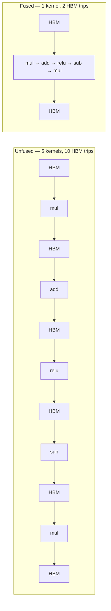

# Operator Fusion

<Mode is="learn">

> **Prereqs:** [SM Architecture](../../ml-execution/gpu-fundamentals/sm-architecture), [Shared Memory](../../ml-execution/gpu-fundamentals/shared-memory). Fusion exists because HBM is slow and SMEM/registers are fast.

Almost every "we made the model 2× faster" win in production AI compilers is actually a fusion win. The math didn't get faster; the *memory traffic* dropped. A pointwise op like `add`, `mul`, `relu`, `sigmoid` reads its inputs from <Term name="hbm">HBM</Term> and writes its outputs back. Doing this for 5 chained ops means 10 HBM trips and ~5× the bandwidth a single-pass implementation would need. **<Term name="fusion">Operator fusion</Term>** generates one kernel that does the whole chain, keeping intermediates in registers — typically 2–10× speedup on bandwidth-bound chains.

This is the lesson where reading `torch.compile`'s output and seeing one big fused kernel where there used to be ten small ones starts making sense. Knowing what fuses and what doesn't is what lets you reason about why your model is fast or slow without reading PTX.

## TL;DR

- A **pointwise op** like `add`, `mul`, `relu`, `sigmoid` reads its inputs from HBM and writes its outputs to HBM. Doing this for 5 chained ops means 10 HBM trips and ~5× the bandwidth a single-pass implementation would need.
- **Operator fusion** = generate one kernel that does the whole chain, keeping intermediates in registers. **2–10× speedup on bandwidth-bound chains**, often more on long ones.
- **Inductor** (PyTorch's `torch.compile`), **XLA** (JAX/TF), **TVM**, **IREE** all do this automatically. They differ in how aggressive they are and what they fuse.
- Three fusion classes:
  1. **Pointwise + pointwise** — trivial; always done.
  2. **Reduction + pointwise** (epilogue fusion) — a softmax fused with the multiply that follows it; the canonical attention optimization.
  3. **Matmul + pointwise** (output-tile fusion) — a GEMM with bias-add or activation in the same kernel; what CUTLASS calls "epilogue."
- The **fusion boundary** is a memory-format change or a non-fusable op (random sample, sort, complex control flow). Compilers cluster fusable ops between these boundaries.

## Mental model



Same math, 5× less memory traffic. On bandwidth-bound chains (i.e., almost all pointwise) the fused version runs ~5× faster.

## Three classes of fusion

**1. Pointwise + pointwise** — the canonical case.

```python
y = torch.relu(x * w + b)
```

Naive: three kernels (mul, add, relu). Each one reads its operands from HBM, computes one elementwise op, writes back. **Total HBM traffic = 6 reads + 3 writes**.

Fused: one kernel does `y[i] = max(0, x[i]*w[i] + b[i])` in registers. **Total HBM traffic = 3 reads + 1 write**. ~2.5× less.

Every modern AI compiler does this trivially. The question is *how far* it can extend the fusion before it has to break.

**2. Reduction + pointwise (epilogue fusion).**

```python
y = torch.exp(x) / torch.exp(x).sum(dim=-1, keepdim=True)   # softmax
```

The reduction (sum) and the divide can be fused: one pass that computes the row sum, then a second tile-traversal that divides each element. With **online softmax** (the FlashAttention trick — running max + running sum in one pass), even tighter.

**3. Matmul + pointwise (output-tile fusion).**

```python
y = torch.relu(x @ W + b)
```

The matmul writes its output tile to SMEM/registers. Before writing to HBM, we apply `+ b` and `relu` in-place. This is what <Term name="cutlass">CUTLASS</Term> calls an **epilogue** — a transformation applied to the output tile before final store. Inductor and XLA do it automatically; CUTLASS lets you specify it via the `CollectiveEpilogue` template (see [CuTe & CUTLASS 4](../kernels/cute-cutlass)).

## What blocks fusion

Three categories of fusion-breakers:

- **Reductions across the wrong axis.** A sum over the last axis fuses with downstream pointwise; a sum that crosses the tile boundary doesn't, easily.
- **Nondeterministic ops.** Random sampling, dropout (without a fused-dropout kernel), top-k. The op needs its full output in HBM before the next op can sample from it.
- **Memory-format / dtype changes.** Casting from FP16 to FP32 mid-chain, transposing, reshaping with stride changes — these often break fusion because the next op needs a different view of memory.
- **Control flow.** A `torch.where(x > 0, f(x), g(x))` that calls different functions per element is hard to fuse cleanly; compilers may evaluate both and select, or break the fusion.

## What torch.compile actually does

<Term name="inductor">Inductor</Term>'s lowering pipeline (simplified):

1. Receive an FX graph from Dynamo (Python tracing).
2. Decompose composite ops into elementary ones.
3. **Cluster** fusable ops together. The clustering is greedy: walk the graph, group ops that are pointwise-compatible, break clusters at boundaries.
4. **Lower** each cluster to a Triton kernel template. Inductor's templates are parameterized by the ops in the cluster — the kernel body is generated from the FX subgraph.
5. Autotune the resulting kernel.

You can see this:

```python
import torch
torch._inductor.config.trace.enabled = True

@torch.compile
def f(x, w, b): return torch.relu(x @ w + b)

f(x, w, b)  # produces /tmp/torchinductor_*/output_code.py
```

In `output_code.py` you'll see one Triton kernel doing matmul + bias + relu, instead of three separate calls. Open it and you can read the fusion in plain Python.

## Inductor's fusion heuristic, briefly

Inductor scores potential fusions by an estimate of **HBM bytes saved**. Two ops fuse if:

- Their inputs/outputs share a memory layout (or can be made to).
- One's output is the other's input (no extra users) — or they're sibling reads of the same tensor.
- The combined kernel's register pressure is below a threshold.
- The combined kernel doesn't exceed the runtime's max kernel size.

Most useful debug knob: `TORCH_LOGS=fusion python script.py` — prints the fusion decisions and why some pairs were rejected. When `torch.compile` "should have fused something but didn't," this is where you look.

## When to override

Sometimes the compiler picks a worse fusion than you would. Three escape hatches:

- **Decomposition tweaks.** Reshape your model to be more fusable: `relu(x * (x > 0))` is harder to fuse than `torch.relu(x)` because the compiler must prove they're equivalent.
- **`@torch.compile(mode='max-autotune')`.** Tries more fusion configs.
- **Hand-write the kernel in Triton or CUTLASS.** The tools you've already met. Write the fused version, drop it in via `torch.library.custom_op`.

In practice: trust Inductor for 90% of cases; reach for hand-fusion only when profiling shows the auto-fusion missed a clear opportunity.

## Run it in your browser — fuse a tiny graph

<RunInBrowser
  description="A toy fusion engine: scan a graph for pointwise ops, cluster them, count HBM trips before vs after."
  code={`from dataclasses import dataclass
from collections import defaultdict

# Each op: (name, inputs_list, kind)
# kind in {'pointwise', 'reduction', 'matmul'}
graph = [
    ('x',  [],            'input'),
    ('w',  [],            'input'),
    ('b',  [],            'input'),
    ('mm', ['x', 'w'],    'matmul'),
    ('a',  ['mm', 'b'],   'pointwise'),     # add bias
    ('r',  ['a'],         'pointwise'),     # relu
    ('s',  ['r'],         'pointwise'),     # scale
    ('out',['s'],         'pointwise'),     # final cast
]

def hbm_trips_unfused(g):
    """Each non-input op costs 1 read per input + 1 write."""
    cost = 0
    for name, ins, kind in g:
        if kind == 'input': continue
        cost += len(ins) + 1
    return cost

def cluster_pointwise(g):
    """Greedy: cluster consecutive pointwise ops whose only consumer is the next op."""
    name_to_kind = {n: k for n, _, k in g}
    name_to_users = defaultdict(int)
    for n, ins, _ in g:
        for i in ins: name_to_users[i] += 1

    clusters = []
    i = 0
    while i < len(g):
        name, ins, kind = g[i]
        if kind == 'input':
            i += 1; continue
        cur = [(name, ins, kind)]
        j = i + 1
        while j < len(g):
            n2, ins2, k2 = g[j]
            # Fuse if pointwise AND its only input from this cluster has only one user (us)
            if k2 == 'pointwise' and any(p in [c[0] for c in cur] for p in ins2):
                if all(name_to_users[p] == 1 or p not in [c[0] for c in cur] for p in ins2):
                    cur.append((n2, ins2, k2)); j += 1
                else: break
            else: break
        clusters.append(cur); i = j
    return clusters

def hbm_trips_fused(clusters, g):
    """Each cluster: reads each input from outside the cluster + writes the final output."""
    cost = 0
    for cluster in clusters:
        cluster_names = {c[0] for c in cluster}
        external_inputs = set()
        for _, ins, _ in cluster:
            for i in ins:
                if i not in cluster_names: external_inputs.add(i)
        cost += len(external_inputs) + 1
    return cost

unfused = hbm_trips_unfused(graph)
clusters = cluster_pointwise(graph)
fused = hbm_trips_fused(clusters, graph)

print(f"Unfused HBM trips: {unfused}")
print(f"Fused HBM trips:   {fused}")
print(f"Speedup factor:    {unfused / fused:.1f}×\\n")
print("Clusters:")
for c in clusters:
    names = [op[0] for op in c]
    print(f"  [{', '.join(names)}]  ({c[0][2]} → {len(c)} ops fused)")
`}
/>

The output mirrors how Inductor reports fusion: a graph of clusters with HBM saving estimates per cluster.

## Quick check

<FillIn
  prompt="The CUTLASS term for a fusion that combines a matmul with the pointwise op that follows it (bias add, activation):"
  answer="epilogue"
  accept={["epilogue fusion", "collective epilogue"]}
  hint="Latin for 'after speech'."
  explanation="CUTLASS's `CollectiveEpilogue` is the template for the per-output-tile transformation applied before the matmul writes to HBM. Inductor calls the same fusion 'output-tile fusion'; XLA calls it 'epilogue fusion'."
/>

<Quiz
  question="A model has 12 elementwise ops chained between two large matmuls. The student adds `@torch.compile`. The expected speedup at the chain level:"
  options={[
    'About 1.1×.',
    'About 5–10× (the elementwise chain becomes one fused kernel).',
    'About 2× (just from kernel-launch reduction).',
    'No change (Inductor doesn\'t fuse pointwise ops).',
  ]}
  answer={1}
  explanation="A 12-op pointwise chain unfused costs 12 + 1 = 13 HBM trips. Fused, it\'s 1 read + 1 write = 2. That\'s a ~6.5× HBM-traffic reduction; on bandwidth-bound chains throughput goes up by roughly the same factor. The kernel-launch reduction is real but secondary; the HBM saving is the main story."
/>

## Key takeaways

1. **Fusion saves HBM, not FLOPs.** The math is the same; the bandwidth traffic drops. That's where the speedup lives.
2. **Three classes:** pointwise+pointwise (trivial), reduction+pointwise (e.g., softmax), matmul+pointwise (epilogue / output-tile).
3. **Inductor / XLA / TVM all auto-fuse.** They differ in aggressiveness; Inductor's `mode='max-autotune'` tries harder.
4. **Fusion-breakers:** memory-format changes, nondeterministic ops, complex control flow.
5. **Trust the compiler for 90% of cases**; hand-fuse via Triton when profiling shows a clearly-missed opportunity.

## Go deeper

<Resources
  items={[
    { kind: 'docs', href: 'https://pytorch.org/docs/stable/torch.compiler.html', title: 'PyTorch — torch.compiler', note: 'Authoritative. The "Inductor" section explains the fusion pass and the templates Triton kernels are generated from.' },
    { kind: 'blog', href: 'https://pytorch.org/blog/training-production-ai-models/', title: 'PyTorch Blog — torch.compile production cases', note: 'Real numbers on what fusion gets you on real models. Section "Inductor performance" has the breakdowns.' },
    { kind: 'paper', href: 'https://www.usenix.org/system/files/osdi18-chen.pdf', title: 'TVM: An Automated End-to-End Optimizing Compiler for Deep Learning', author: 'Chen et al., OSDI 2018', note: 'The original paper that formalized AI-compiler fusion. Section 4 covers operator fusion in graph IR.' },
    { kind: 'paper', href: 'https://www.usenix.org/system/files/osdi18-rotem.pdf', title: 'Glow: Graph Lowering Compiler Techniques for Neural Networks', author: 'Rotem et al., 2018', note: 'The Facebook side of the same story. Different fusion heuristic; instructive comparison.' },
    { kind: 'blog', href: 'https://horace.io/brrr_intro.html', title: 'Making Deep Learning Go Brrrr — Horace He', note: 'Hands-on view from PyTorch dev. The fusion section explains exactly what `torch.compile` is doing in production.' },
    { kind: 'repo', href: 'https://github.com/pytorch/pytorch', title: 'pytorch/pytorch', note: '`torch/_inductor/codegen/triton.py` is the generator that emits fused Triton kernels. `torch/_inductor/scheduler.py` is the fusion heuristic.' },
  ]}
/>

</Mode>

<Mode is="reference">

> **Prereqs:** [SM Architecture](../../ml-execution/gpu-fundamentals/sm-architecture), [Shared Memory](../../ml-execution/gpu-fundamentals/shared-memory). Fusion exists because HBM is slow and SMEM/registers are fast.

## TL;DR

- A **pointwise op** like `add`, `mul`, `relu`, `sigmoid` reads its inputs from HBM and writes its outputs to HBM. Doing this for 5 chained ops means 10 HBM trips and ~5× the bandwidth a single-pass implementation would need.
- **Operator fusion** = generate one kernel that does the whole chain, keeping intermediates in registers. **2–10× speedup on bandwidth-bound chains**, often more on long ones.
- **Inductor** (PyTorch's `torch.compile`), **XLA** (JAX/TF), **TVM**, **IREE** all do this automatically. They differ in how aggressive they are and what they fuse.
- Three fusion classes:
  1. **Pointwise + pointwise** — trivial; always done.
  2. **Reduction + pointwise** (epilogue fusion) — a softmax fused with the multiply that follows it; the canonical attention optimization.
  3. **Matmul + pointwise** (output-tile fusion) — a GEMM with bias-add or activation in the same kernel; what CUTLASS calls "epilogue."
- The **fusion boundary** is a memory-format change or a non-fusable op (random sample, sort, complex control flow). Compilers cluster fusable ops between these boundaries.

## Why this matters

Almost every "we made the model 2× faster" win in production AI compilers is actually a fusion win. The math didn't get faster; the *memory traffic* dropped. Reading `torch.compile`'s output and seeing one big fused kernel where there used to be ten small ones is the visible payoff. Knowing what fuses and what doesn't is what lets you reason about why your model is fast or slow without reading PTX.

## Mental model


Same math, 5× less memory traffic. On bandwidth-bound chains (i.e., almost all pointwise) the fused version runs ~5× faster.

## Concrete walkthrough

### Three classes of fusion

**1. Pointwise + pointwise** — the canonical case.

```python
y = torch.relu(x * w + b)
```

Naive: three kernels (mul, add, relu). Each one reads its operands from HBM, computes one elementwise op, writes back. **Total HBM traffic = 6 reads + 3 writes**.

Fused: one kernel does `y[i] = max(0, x[i]*w[i] + b[i])` in registers. **Total HBM traffic = 3 reads + 1 write**. ~2.5× less.

Every modern AI compiler does this trivially. The question is *how far* it can extend the fusion before it has to break.

**2. Reduction + pointwise (epilogue fusion).**

```python
y = torch.exp(x) / torch.exp(x).sum(dim=-1, keepdim=True)   # softmax
```

The reduction (sum) and the divide can be fused: one pass that computes the row sum, then a second tile-traversal that divides each element. With **online softmax** (the FlashAttention trick — running max + running sum in one pass), even tighter.

**3. Matmul + pointwise (output-tile fusion).**

```python
y = torch.relu(x @ W + b)
```

The matmul writes its output tile to SMEM/registers. Before writing to HBM, we apply `+ b` and `relu` in-place. This is what CUTLASS calls an **epilogue** — a transformation applied to the output tile before final store. Inductor and XLA do it automatically; CUTLASS lets you specify it via the `CollectiveEpilogue` template (see [CuTe & CUTLASS 4](../kernels/cute-cutlass)).

### What blocks fusion

Three categories of fusion-breakers:

- **Reductions across the wrong axis.** A sum over the last axis fuses with downstream pointwise; a sum that crosses the tile boundary doesn't, easily.
- **Nondeterministic ops.** Random sampling, dropout (without a fused-dropout kernel), top-k. The op needs its full output in HBM before the next op can sample from it.
- **Memory-format / dtype changes.** Casting from FP16 to FP32 mid-chain, transposing, reshaping with stride changes — these often break fusion because the next op needs a different view of memory.
- **Control flow.** A `torch.where(x > 0, f(x), g(x))` that calls different functions per element is hard to fuse cleanly; compilers may evaluate both and select, or break the fusion.

### What torch.compile actually does

Inductor's lowering pipeline (simplified):

1. Receive an FX graph from Dynamo (Python tracing).
2. Decompose composite ops into elementary ones.
3. **Cluster** fusable ops together. The clustering is greedy: walk the graph, group ops that are pointwise-compatible, break clusters at boundaries.
4. **Lower** each cluster to a Triton kernel template. Inductor's templates are parameterized by the ops in the cluster — the kernel body is generated from the FX subgraph.
5. Autotune the resulting kernel.

You can see this:

```python
import torch
torch._inductor.config.trace.enabled = True

@torch.compile
def f(x, w, b): return torch.relu(x @ w + b)

f(x, w, b)  # produces /tmp/torchinductor_*/output_code.py
```

In `output_code.py` you'll see one Triton kernel doing matmul + bias + relu, instead of three separate calls. Open it and you can read the fusion in plain Python.

### Inductor's fusion heuristic, briefly

Inductor scores potential fusions by an estimate of **HBM bytes saved**. Two ops fuse if:

- Their inputs/outputs share a memory layout (or can be made to).
- One's output is the other's input (no extra users) — or they're sibling reads of the same tensor.
- The combined kernel's register pressure is below a threshold.
- The combined kernel doesn't exceed the runtime's max kernel size.

Most useful debug knob: `TORCH_LOGS=fusion python script.py` — prints the fusion decisions and why some pairs were rejected. When `torch.compile` "should have fused something but didn't," this is where you look.

### When to override

Sometimes the compiler picks a worse fusion than you would. Three escape hatches:

- **Decomposition tweaks.** Reshape your model to be more fusable: `relu(x * (x > 0))` is harder to fuse than `torch.relu(x)` because the compiler must prove they're equivalent.
- **`@torch.compile(mode='max-autotune')`.** Tries more fusion configs.
- **Hand-write the kernel in Triton or CUTLASS.** The tools you've already met. Write the fused version, drop it in via `torch.library.custom_op`.

In practice: trust Inductor for 90% of cases; reach for hand-fusion only when profiling shows the auto-fusion missed a clear opportunity.

## Run it in your browser — fuse a tiny graph

<RunInBrowser
  description="A toy fusion engine: scan a graph for pointwise ops, cluster them, count HBM trips before vs after."
  code={`from dataclasses import dataclass
from collections import defaultdict

# Each op: (name, inputs_list, kind)
# kind in {'pointwise', 'reduction', 'matmul'}
graph = [
    ('x',  [],            'input'),
    ('w',  [],            'input'),
    ('b',  [],            'input'),
    ('mm', ['x', 'w'],    'matmul'),
    ('a',  ['mm', 'b'],   'pointwise'),     # add bias
    ('r',  ['a'],         'pointwise'),     # relu
    ('s',  ['r'],         'pointwise'),     # scale
    ('out',['s'],         'pointwise'),     # final cast
]

def hbm_trips_unfused(g):
    """Each non-input op costs 1 read per input + 1 write."""
    cost = 0
    for name, ins, kind in g:
        if kind == 'input': continue
        cost += len(ins) + 1
    return cost

def cluster_pointwise(g):
    """Greedy: cluster consecutive pointwise ops whose only consumer is the next op."""
    name_to_kind = {n: k for n, _, k in g}
    name_to_users = defaultdict(int)
    for n, ins, _ in g:
        for i in ins: name_to_users[i] += 1

    clusters = []
    i = 0
    while i < len(g):
        name, ins, kind = g[i]
        if kind == 'input':
            i += 1; continue
        cur = [(name, ins, kind)]
        j = i + 1
        while j < len(g):
            n2, ins2, k2 = g[j]
            # Fuse if pointwise AND its only input from this cluster has only one user (us)
            if k2 == 'pointwise' and any(p in [c[0] for c in cur] for p in ins2):
                if all(name_to_users[p] == 1 or p not in [c[0] for c in cur] for p in ins2):
                    cur.append((n2, ins2, k2)); j += 1
                else: break
            else: break
        clusters.append(cur); i = j
    return clusters

def hbm_trips_fused(clusters, g):
    """Each cluster: reads each input from outside the cluster + writes the final output."""
    cost = 0
    for cluster in clusters:
        cluster_names = {c[0] for c in cluster}
        external_inputs = set()
        for _, ins, _ in cluster:
            for i in ins:
                if i not in cluster_names: external_inputs.add(i)
        cost += len(external_inputs) + 1
    return cost

unfused = hbm_trips_unfused(graph)
clusters = cluster_pointwise(graph)
fused = hbm_trips_fused(clusters, graph)

print(f"Unfused HBM trips: {unfused}")
print(f"Fused HBM trips:   {fused}")
print(f"Speedup factor:    {unfused / fused:.1f}×\\n")
print("Clusters:")
for c in clusters:
    names = [op[0] for op in c]
    print(f"  [{', '.join(names)}]  ({c[0][2]} → {len(c)} ops fused)")
`}
/>

The output mirrors how Inductor reports fusion: a graph of clusters with HBM saving estimates per cluster.

## Quick check

<FillIn
  prompt="The CUTLASS term for a fusion that combines a matmul with the pointwise op that follows it (bias add, activation):"
  answer="epilogue"
  accept={["epilogue fusion", "collective epilogue"]}
  hint="Latin for 'after speech'."
  explanation="CUTLASS's `CollectiveEpilogue` is the template for the per-output-tile transformation applied before the matmul writes to HBM. Inductor calls the same fusion 'output-tile fusion'; XLA calls it 'epilogue fusion'."
/>

<Quiz
  question="A model has 12 elementwise ops chained between two large matmuls. The student adds `@torch.compile`. The expected speedup at the chain level:"
  options={[
    'About 1.1×.',
    'About 5–10× (the elementwise chain becomes one fused kernel).',
    'About 2× (just from kernel-launch reduction).',
    'No change (Inductor doesn\'t fuse pointwise ops).',
  ]}
  answer={1}
  explanation="A 12-op pointwise chain unfused costs 12 + 1 = 13 HBM trips. Fused, it\'s 1 read + 1 write = 2. That\'s a ~6.5× HBM-traffic reduction; on bandwidth-bound chains throughput goes up by roughly the same factor. The kernel-launch reduction is real but secondary; the HBM saving is the main story."
/>

## Key takeaways

1. **Fusion saves HBM, not FLOPs.** The math is the same; the bandwidth traffic drops. That's where the speedup lives.
2. **Three classes:** pointwise+pointwise (trivial), reduction+pointwise (e.g., softmax), matmul+pointwise (epilogue / output-tile).
3. **Inductor / XLA / TVM all auto-fuse.** They differ in aggressiveness; Inductor's `mode='max-autotune'` tries harder.
4. **Fusion-breakers:** memory-format changes, nondeterministic ops, complex control flow.
5. **Trust the compiler for 90% of cases**; hand-fuse via Triton when profiling shows a clearly-missed opportunity.

## Go deeper

<Resources
  items={[
    { kind: 'docs', href: 'https://pytorch.org/docs/stable/torch.compiler.html', title: 'PyTorch — torch.compiler', note: 'Authoritative. The "Inductor" section explains the fusion pass and the templates Triton kernels are generated from.' },
    { kind: 'blog', href: 'https://pytorch.org/blog/training-production-ai-models/', title: 'PyTorch Blog — torch.compile production cases', note: 'Real numbers on what fusion gets you on real models. Section "Inductor performance" has the breakdowns.' },
    { kind: 'paper', href: 'https://www.usenix.org/system/files/osdi18-chen.pdf', title: 'TVM: An Automated End-to-End Optimizing Compiler for Deep Learning', author: 'Chen et al., OSDI 2018', note: 'The original paper that formalized AI-compiler fusion. Section 4 covers operator fusion in graph IR.' },
    { kind: 'paper', href: 'https://www.usenix.org/system/files/osdi18-rotem.pdf', title: 'Glow: Graph Lowering Compiler Techniques for Neural Networks', author: 'Rotem et al., 2018', note: 'The Facebook side of the same story. Different fusion heuristic; instructive comparison.' },
    { kind: 'blog', href: 'https://horace.io/brrr_intro.html', title: 'Making Deep Learning Go Brrrr — Horace He', note: 'Hands-on view from PyTorch dev. The fusion section explains exactly what `torch.compile` is doing in production.' },
    { kind: 'repo', href: 'https://github.com/pytorch/pytorch', title: 'pytorch/pytorch', note: '`torch/_inductor/codegen/triton.py` is the generator that emits fused Triton kernels. `torch/_inductor/scheduler.py` is the fusion heuristic.' },
  ]}
/>

</Mode>

<LessonComplete />
