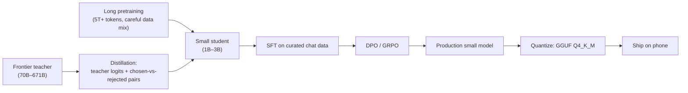

# Small LLMs & Distillation

> **Prereqs:** [INT4 / AWQ / GPTQ](../../ml-execution/quantization/int4-and-awq), [SFT & Instruction Tune](../../training/post-training/sft). This lesson is about model design and training, not deployment.

## TL;DR

- **Small LLMs (≤4B params)** are not just "shrunk frontier models" — they're produced via deliberate recipes that maximize signal per parameter. The 2024–2026 standard: train longer, distill from a frontier teacher, post-train carefully.
- **Distillation** = train a small "student" to match a larger "teacher's" outputs (logits, hidden states, or chosen-vs-rejected preferences). Most modern small LLMs are distilled from a same-family large model — DeepSeek-V3-distill, Llama-3.3-distill, etc.
- **Long pretraining matters more than data quality**: MiniCPM-3 (2.4B) trained on 5T tokens beats some 7B models trained on 1.5T. The "scaling laws say small needs less" intuition is wrong for small-but-deep training.
- **Post-training is the gap closer**: SFT + DPO (or GRPO) with carefully-curated chat data closes most of the small-vs-large gap on the workloads people actually care about.
- **TinyLlama (1.1B), MiniCPM-3 (2.4B), Qwen2.5-1.5B/3B, Phi-3.5-mini, Llama-3.2-1B/3B** are the 2026 reference small models. Each represents a slightly different recipe; understanding them is understanding the edge-LLM design space.

## Why this matters

The phone-runnable LLM era is a small-model era. Every iOS Intelligence on-device call, every offline ChatGPT-class app, every robot's local language module — all run on 1B–4B parameters. **Knowing how these get made — what training recipes, what distillation tricks, what post-training — is the price of admission for designing a custom small LLM** for any vertical (medical, legal, code, tool-use, etc.). Off-the-shelf 3Bs cover the chat case; custom-distilled small LLMs are the next product wave.

## Mental model

The right shape: a long, carefully-distilled pretraining of a small student, then strong post-training, then quantization. Skip any step and quality drops a lot.

## Concrete walkthrough

### What "distillation" means concretely

The classical Hinton (2015) version: train the student to match the teacher's *softmax output distribution* (not just the argmax) on a shared training set. Soft targets carry more information than hard labels.

For LLMs in 2024+, the practical recipe is broader:

1. **Logit distillation**: KL-divergence between teacher logits and student logits at every position. Computationally expensive (need teacher forward passes), highest quality.
2. **Hidden-state distillation**: also match intermediate hidden states (layer-by-layer). Higher capacity transfer; needs architectural alignment.
3. **Chosen-vs-rejected distillation**: feed the student preference pairs from the teacher (teacher A is better than teacher B); use DPO-style training on those pairs.
4. **On-policy data distillation**: have the teacher generate responses to prompts; train the student to match those responses. Cheapest, very common.

Modern recipes mix several. DeepSeek-R1-Distill-Llama-8B uses a combination of (1) and (4); Phi-3 uses heavy synthetic data from GPT-4. The shared idea: **the student isn't learning from raw text, it's learning from the teacher's interpretation of the text**.

### Training-token math

The "Chinchilla" scaling law (Hoffmann et al., 2022) suggested a roughly 1:20 ratio of parameters to training tokens for compute-optimal training. For frontier models that's still roughly right. For *small* models targeting deployment quality, the math is different:

| Model              | Params | Training tokens | Tokens / param |
|--------------------|--------|-----------------|------------------|
| Chinchilla optimal | 1B     | ~20B            | 20               |
| Llama-3.1 8B       | 8B     | 15T             | 1875             |
| **MiniCPM-3 2.4B** | 2.4B   | 5T              | 2083             |
| **Llama-3.2 1B**   | 1B     | 9T              | 9000             |
| **Llama-3.2 3B**   | 3B     | 9T              | 3000             |
| **Phi-3.5-mini**   | 3.8B   | 3.3T            | 870              |

Modern small LLMs train on 100–500× the Chinchilla-optimal token count. Why? Because for *deployment* you don't care about FLOP-optimal; you care about quality-per-parameter. The model is going to run for billions of inference tokens on devices; spending more training tokens to make those better is the right trade.

The DeepMind / MiniCPM team's 2024 paper formalized this as "training small for deployment" — different optimum than training small for research.

### Data mix

Modern small-LLM recipes are aggressive about data quality:

- **Filter aggressively**: remove low-quality web text, duplicates, formatting noise.
- **Boost code, math, reasoning**: small models benefit disproportionately from densely-formatted reasoning data.
- **Synthetic data from a teacher**: especially Phi-3's recipe — GPT-4 generates millions of textbook-style explanations; the student trains on them. Controversial but empirically effective.
- **Multi-stage data schedules**: WSD-style (Warmup-Stable-Decay, see [LR Schedules](../../training/optimization/lr-schedules)) where the *content* of the data changes across stages — broad pretraining first, high-quality reasoning content during decay.

### Architecture: what's special about small-LLM design

Most ≤4B models stick close to the frontier architectural choices: GQA, RoPE, SwiGLU, RMSNorm. A few small-specific tweaks:

- **Tied input/output embeddings**: saves a lot of parameters at small scale (the embedding matrix is a meaningful fraction of total params).
- **Smaller head dimension**: sometimes 64 instead of 128, balanced against more heads.
- **No FFN expansion ratio of 4**: typically 2.5–3 for small models.
- **Sometimes more layers, narrower hidden**: depth-over-width has been shown to help small-scale reasoning quality (MiniCPM's 64-layer 2.4B is an example).

None of these are revolutionary; the architecture isn't where small-LLM quality lives. The training recipe is.

### Post-training is the gap closer

A pretrained 3B is usable for completion but feels stupid as a chat partner. Post-training is what makes it competitive on the workloads that matter:

1. **SFT** on ~100K–1M curated chat / instruction examples — see [SFT & Instruction Tune](../../training/post-training/sft).
2. **Preference optimization** via [DPO / IPO / KTO](../../training/post-training/dpo).
3. **For reasoning**: [GRPO](../../training/post-training/grpo-reasoning) on verifiable-reward problems.

For a 3B, a strong post-training pass typically lifts MMLU by 2–4 pts and dramatically improves instruction-following / chat quality. **Most of the difference between "raw small LM" and "ships in a product" is post-training**, not pretraining.

### Reference recipes (April 2026)

| Model                | Pretrain tokens | Distillation source | Post-training | MMLU | Notes |
|----------------------|------------------|---------------------|----------------|------|-------|
| **TinyLlama 1.1B**   | 3T               | None (raw pretrain) | SFT           | ~28  | Open recipe; great for studying |
| **MiniCPM-3 2.4B**   | 5T               | Some teacher data   | SFT + DPO     | ~52  | Strong open Chinese-bilingual baseline |
| **Phi-3.5-mini 3.8B**| 3.3T             | GPT-4 synthetic     | SFT + DPO     | ~69  | Phi family; "textbooks-only" controversial |
| **Llama-3.2 1B**     | 9T               | Llama-3.1-405B logit| SFT + DPO     | ~49  | Distilled from frontier |
| **Llama-3.2 3B**     | 9T               | Llama-3.1-405B logit| SFT + DPO     | ~63  | Default for phone apps |
| **Qwen2.5-1.5B**     | 18T              | Qwen2.5-72B-distill | SFT + DPO + GRPO | ~60 | Best per-param 2026 |
| **Qwen2.5-3B**       | 18T              | Qwen2.5-72B-distill | SFT + DPO + GRPO | ~67 | Best per-param 2026 |
| **DeepSeek-R1-Distill-Qwen-1.5B** | inherited | DeepSeek-R1 reasoning | SFT on R1 traces | ~47 + reasoning | Reasoning-strong 1.5B |

The Qwen2.5 family is currently the per-parameter Pareto frontier for open small LLMs in 2026; Llama-3.2 is the most-deployed; Phi family is the controversial-but-effective outlier.

### The build-your-own path

If you want a custom small LLM (medical, legal, code, etc.), the 2026 production recipe:

1. Start from Qwen2.5-1.5B or Llama-3.2-3B base.
2. Continue-pretrain on ~100B–500B tokens of your domain corpus (~$5K–50K compute).
3. Distill from a larger expert in your domain (or a frontier general model with a domain prompt).
4. SFT on ~100K curated domain chat examples.
5. DPO on ~10K preference pairs from the same domain.
6. Quantize with i-matrix calibration on a domain calibration set.
7. Ship via [llama.cpp](../on-device/llama-cpp-internals) or [ExecuTorch](../on-device/executorch).

Total cost: $20K–100K compute + months of data work. For verticals where the unit economics make sense (every legal practice, every clinic, every robot fleet), this is well under the cost of the team.

## Run it in your browser — Pareto picker

<RunInBrowser
  description="Score small LLMs on quality-per-MB to find the per-byte Pareto."
  code={`models = [
    # (name, params_b, mmlu, q4_size_mb)
    ('TinyLlama-1.1B',          1.1,  28, 622),
    ('MiniCPM-3 2.4B',          2.4,  52, 1380),
    ('Phi-3.5-mini 3.8B',       3.8,  69, 2185),
    ('Llama-3.2 1B',            1.24, 49, 713),
    ('Llama-3.2 3B',            3.21, 63, 1846),
    ('Qwen2.5-1.5B',            1.5,  60, 862),
    ('Qwen2.5-3B',              3.1,  67, 1782),
    ('DeepSeek-R1-Distill-Qwen-1.5B', 1.5, 47, 862),  # reasoning, not pure MMLU
]

print(f"{'model':<32} {'params':>7} {'MMLU':>6} {'Q4 MB':>8} {'MMLU/MB':>10}")
print('-' * 70)
for name, p, mmlu, mb in sorted(models, key=lambda x: -x[2]/x[3]):
    print(f"{name:<32} {p:>6.2f}B {mmlu:>5} {mb:>7.0f}  {mmlu/mb:>10.4f}")

print()
print("MMLU per MB shows the per-byte Pareto. Qwen2.5-1.5B leads — best quality")
print("for the smallest deployable footprint. For chat-like UX, Qwen2.5-3B is the")
print("better sweet spot since it crosses the 'feels capable' line at ~65 MMLU.")
`}
/>

The output shape — Qwen2.5 leading on per-byte quality, with the 3B variant crossing the "feels good" threshold — matches the public local-LLM rankings on r/LocalLLaMA and equivalent forums.

## Quick check

<FillIn
  prompt="The 1.5B / 3B family that leads the per-parameter open Pareto in 2026:"
  answer="Qwen2.5"
  accept={["qwen 2.5", "Qwen 2.5", "Qwen2.5-Mobile"]}
  hint="Alibaba's open-model family."
  explanation="Qwen2.5-1.5B and Qwen2.5-3B trained on 18T tokens with strong distillation from Qwen2.5-72B + GRPO post-training currently lead the per-parameter open Pareto. Llama-3.2 is more widely deployed; Phi has a controversial recipe; Qwen2.5 is the per-param leader."
/>

<Quiz
  question="A team wants to ship a code-completion model on phones. Their best path in 2026:"
  options={[
    'Train a 7B from scratch on code.',
    'Take Qwen2.5-Coder-1.5B, continue-pretrain on their proprietary code corpus, distill from a 32B coder, SFT + DPO, ship as Q4_K_M GGUF.',
    'Use the API of a frontier model.',
    'Use Llama-3.2-1B without modification.',
  ]}
  answer={1}
  explanation="The custom-distilled small-LLM recipe — start from a strong base like Qwen2.5-Coder-1.5B, continue-pretrain on domain data, distill from a larger same-family model, post-train, quantize, ship — is the 2026 production path for vertical small LLMs. Training from scratch wastes the strong base; off-the-shelf without domain fit underperforms; the API breaks the offline + privacy story."
/>

## Key takeaways

1. **Small LLMs (≤4B) are deliberate constructions, not shrunken big ones.** Long pretraining + distillation + post-training.
2. **Distillation transfers more than weights** — logits, hidden states, preference pairs, and on-policy data.
3. **Train on 1000+ tokens per parameter** for deployment-targeted small models (way beyond Chinchilla-optimal).
4. **Post-training is the gap closer.** SFT + DPO / GRPO is what makes small models actually usable.
5. **Qwen2.5 + Llama-3.2 + Phi-3.5 are the 2026 reference points.** Custom-distilled vertical small LLMs are the next product wave.

## Go deeper

<Resources
  items={[
    { kind: 'paper', href: 'https://arxiv.org/abs/2404.06395', title: 'MiniCPM: Unveiling the Potential of Small Language Models', author: 'Hu et al., 2024', note: 'The most useful single paper on small-LLM training recipes. WSD scheduling, data mix, post-training all detailed.' },
    { kind: 'paper', href: 'https://arxiv.org/abs/2404.14219', title: 'Phi-3 Technical Report', author: 'Microsoft, 2024', note: 'The "textbook quality" approach. Controversial; empirically effective.' },
    { kind: 'paper', href: 'https://arxiv.org/abs/2501.12948', title: 'DeepSeek-R1 Technical Report (and the Distill series)', author: 'DeepSeek-AI, 2025', note: 'Section on R1-Distill-Qwen-1.5B / 7B / 32B is the modern reasoning-distillation recipe.' },
    { kind: 'paper', href: 'https://arxiv.org/abs/2401.02385', title: 'TinyLlama: An Open-Source Small Language Model', author: 'Zhang et al., 2024', note: 'Fully open recipe. Best for "study how this is built" since the entire pretraining loop is documented.' },
    { kind: 'blog', href: 'https://qwenlm.github.io/blog/qwen2.5/', title: 'Qwen2.5 Blog', note: 'Alibaba\'s own writeup of the Qwen2.5 family. Covers the 1.5B and 3B variants in detail.' },
    { kind: 'blog', href: 'https://huggingface.co/blog/Llama-3.2-quantization', title: 'Hugging Face — Llama-3.2 quantization', note: 'How Meta\'s 1B / 3B variants quantize, with i-matrix calibration discussed.' },
    { kind: 'paper', href: 'https://arxiv.org/abs/1503.02531', title: 'Distilling the Knowledge in a Neural Network', author: 'Hinton et al., 2015', note: 'The original distillation paper. Still required reading for the "soft targets" intuition.' },
    { kind: 'repo', href: 'https://github.com/jzhang38/TinyLlama', title: 'TinyLlama reference repo', note: 'Open training code. The clearest entry point if you want to actually run a small-LLM pretraining experiment.' },
  ]}
/>

<LessonComplete />
