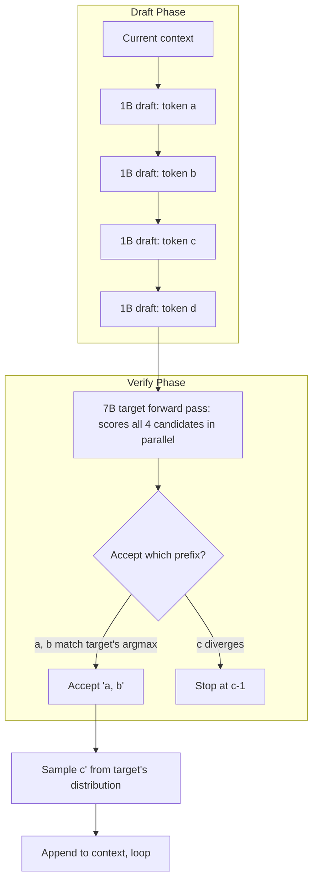

# Speculative Decoding

## TL;DR

- **Speculative decoding** makes an LLM generate tokens 2–4× faster *without changing the output*. The trick: a small **draft model** proposes K tokens; the **target model** verifies all K in one parallel forward pass; the longest accepted prefix is the new context. Tokens are bit-identical to running the target alone.
- The math: instead of one forward per token at the slow model, you do one forward per K candidates — and the target model is bandwidth-bound on a phone, so verifying K tokens costs almost the same as decoding 1.
- **Three families**: classic draft-target (Llama-3.2-1B → Llama-3.2-7B), **self-speculative** (Medusa, EAGLE — the model has additional heads that draft from itself), and **lookahead** (no draft model; an n-gram cache predicts).
- On a phone the typical speedup is **1.8–2.5×** for matched-family pairs (1B drafting 7B), with **acceptance rate 60–80%** on chat workloads. Higher on code (where output is predictable), lower on creative writing.
- llama.cpp ships speculative decoding as a first-class API (`llama_speculative_*`); it's a few lines of code on top of an existing setup. **Outputs are bit-identical to non-speculative.**

## Why this matters

A 7B model on a phone runs at ~5 tok/s — readable but slow. Speculative decoding bumps that to ~10 tok/s without changing the model, the quality, or the memory budget meaningfully. **It's the only way to get real-time 7B chat on phones in 2026** that doesn't require a smaller model.

The 2026 reality: every serious local-LLM runtime (llama.cpp, MLX, Ollama, vLLM-on-Apple-Silicon) has speculative decoding. The technique is mature, the bit-identical guarantee makes it production-safe, and the speedup is consistent. **Not knowing how this works in 2026 is like not knowing how KV-caching works.**

## Mental model



Per-step bookkeeping:

- The draft model proposes K=4–8 tokens autoregressively (cheap; small model is fast).
- The target model runs one forward pass over all K. **This is the critical insight**: a single forward pass over K tokens costs nearly the same as a single forward over 1 token, because it's memory-bandwidth-bound, not FLOP-bound.
- For each draft token, compare its position's argmax against the draft's pick. The first divergence position is where you stop accepting.
- The target's distribution at the divergence position is used to sample the *replacement* token — preserving the exact distribution as if you'd run the target alone.

The math (Leviathan et al., Google 2022) proves the output distribution is identical. Not "approximately the same" — *bit-identical with the right hyperparameters*.

## Concrete walkthrough

### Why one target forward over K tokens is "free"

A transformer forward pass moves all the weights from RAM to GPU/CPU caches once per pass. The compute (FLOPs) scales with the sequence length and is small relative to the memory cost on a phone.

Roughly:

| Phase | Memory traffic | Compute |
|---|---|---|
| 1 token decode at 7B Q4 | ~4 GB read | ~7 G FLOPs |
| 4 token verify at 7B Q4 | ~4 GB read | ~28 G FLOPs |

The 4-token verify reads the same 4 GB of weights — just runs them on a 4× longer sequence. On phone hardware with low FLOPs/byte ratios, this is barely slower than decoding 1 token. **You get 4 tokens of inference for ~1.1× the cost of 1 token.**

If even 60% of those 4 tokens get accepted (typical for chat), that's 2.4 tokens output per target call — **~2× speedup**.

### Acceptance rate is the whole game

The expected speedup is:

$$\text{Speedup} \approx \frac{1 + \alpha + \alpha^2 + ... + \alpha^{K-1}}{1 + \frac{c_{draft}}{c_{target}} \cdot K}$$

where $\alpha$ is the per-position acceptance probability and $c_{draft}/c_{target}$ is the draft-to-target cost ratio.

Practical numbers:

- Llama-3.2-1B drafting Llama-3.2-7B: $\alpha \approx 0.75$ on chat, $c_{draft}/c_{target} \approx 0.15$.
- K=4: speedup ≈ 2.0×
- K=8: speedup ≈ 2.4× (diminishing returns; long drafts get rejected more)
- Codes (predictable next tokens): $\alpha \approx 0.85$ → 2.5–3.0×.
- Creative writing: $\alpha \approx 0.55$ → 1.4–1.6×.

### Picking a draft model

Three rules:

1. **Same family.** Llama draft for Llama target; Phi draft for Phi target; Qwen draft for Qwen. Different families have different tokenizers, different prior distributions — acceptance rate craters.
2. **5–10% of target params.** Llama-3.2-1B for Llama-3-7B (14%), Llama-3.2-3B for Llama-3-70B (4%). Smaller draft = faster but lower acceptance; bigger draft = higher acceptance but draft cost eats the savings.
3. **Same finetune.** If your target is `Llama-3-7B-Instruct`, your draft should be `Llama-3.2-1B-Instruct`, not the base model. The instruction tuning shifts the output distribution; matching it bumps $\alpha$ by 0.1–0.15.

### Self-speculative: Medusa and EAGLE

What if you don't want to ship two models?

**Medusa** (Cai et al., 2024) adds extra heads to the target model that predict tokens N+2, N+3, N+4. Each head is small (~0.5% of model params). Train the heads briefly on the target's own outputs. Now the target *itself* drafts.

**EAGLE-2** (Li et al., 2024) goes further: a small auto-regressive head that uses the target's hidden states to draft, achieving 80%+ acceptance on chat. **EAGLE-3** (Li et al., 2025) refines the recipe with multi-step training and dynamic draft trees, pushing acceptance rates higher and achieving 3–4× speedup with no separate draft model.

Both add ~3–10% to model size and require fine-tuning of the draft heads (a few hours on a single GPU). Output is bit-identical to vanilla decoding.

For phone deployment, EAGLE-2 / EAGLE-3 are the right pick when memory is tight (one model, not two). Use a separate draft model when memory is comfortable and you can pick a high-quality off-the-shelf small model.

### Lookahead — no draft model at all

**Lookahead decoding** (Fu et al., 2024) uses an n-gram cache populated from the target model's own past output. No draft model, no extra training. Works best when the output has *internal repetition* — citations, code with repeated identifier patterns, structured text. On free-form chat the speedup is modest (1.2–1.5×); on code it can hit 2× without any extra weights.

Use lookahead when you genuinely cannot afford to ship a second model or train heads. It's the minimum-effort variant.

### llama.cpp speculative API

```c
// Load both target and draft.
llama_model* target_model = llama_model_load_from_file("Llama-3-7B-Instruct.Q4_K_M.gguf", ...);
llama_model* draft_model  = llama_model_load_from_file("Llama-3.2-1B-Instruct.Q4_K_M.gguf", ...);

llama_context* target_ctx = llama_new_context_with_model(target_model, ...);
llama_context* draft_ctx  = llama_new_context_with_model(draft_model, ...);

// Run speculative decoding (the API does the loop internally).
struct llama_speculative_params spec_p = llama_speculative_default_params();
spec_p.n_draft = 4;            // K (number of draft tokens)
spec_p.p_accept = 0.4;         // sampling acceptance threshold

llama_speculative* spec = llama_speculative_init(target_ctx, draft_ctx, spec_p);
while (n_generated < n_predict) {
    llama_token tok = llama_speculative_next(spec, /* sampling params */);
    if (tok == EOS) break;
    print_token(tok);
    n_generated++;
}
```

The bit-identicalness is verified — llama.cpp has unit tests asserting that speculative output matches non-speculative output character-for-character at temperature 0.

### When NOT to use speculative decoding

- **Temperature > ~1.0**: the target's high-temp distribution is broad enough that draft predictions almost never match. Acceptance rate plummets.
- **Beam search**: speculative is incompatible with beam search (it's a sampling-side optimization).
- **You're memory-pinned**: shipping a second 1B model costs ~600 MB of phone RAM. If you're already squeezing the 7B in, dropping to 3B is the better fix.
- **Output is short** (single sentence answers): the speculative-decoding overhead per first token may exceed the savings.

For chat-style multi-turn 256+ token responses at temperature 0–1, speculative is essentially always a win.

## Run it in your browser

A useful demo: simulate the speculative-decoding speedup math. Tweak acceptance rate and K to see when speculative wins and when it doesn't.

<RunInBrowser
  description="Speedup math by Leviathan et al. — try different alpha values to see when speculative is worth shipping vs not."
  code={`# Speedup math: see when speculative actually wins.
def expected_speedup(alpha, K, c_ratio):
    """
    alpha: per-position acceptance probability (0..1)
    K: number of draft tokens per step
    c_ratio: c_draft / c_target (cost ratio)
    """
    # Expected accepted tokens per step: sum_{k=0}^{K} alpha^k
    expected_accepted = sum(alpha ** k for k in range(K + 1))
    # Cost per step: 1 target call + K draft calls
    cost_per_step = 1 + c_ratio * K
    return expected_accepted / cost_per_step

print(f"{'workload':<22} {'alpha':>6} {'K':>3} {'speedup':>10}")
print("-" * 50)

scenarios = [
    ("Code (predictable)",     0.85, 6),
    ("Code (predictable)",     0.85, 8),
    ("Chat (typical)",         0.75, 4),
    ("Chat (typical)",         0.75, 6),
    ("Chat (typical)",         0.75, 8),
    ("Creative writing",       0.55, 4),
    ("Creative writing",       0.55, 6),
    ("Bad: small alpha, big K",0.45, 8),
]
for name, alpha, K in scenarios:
    s = expected_speedup(alpha, K, c_ratio=0.15)
    print(f"{name:<22} {alpha:>6.2f} {K:>3} {s:>9.2f}×")

print("\\nTakeaways:")
print("- Code workloads: bigger K is better (high alpha tolerates long drafts)")
print("- Chat: K=4-6 is the sweet spot")
print("- Creative writing: K=4 or skip speculative entirely")
`}
/>

The math makes the K hyperparameter selection concrete: pick K based on workload, not by tuning.

## Quick check

<Quiz
  question="You add speculative decoding to your llama.cpp iPhone app: Llama-3-7B-Instruct as target, Llama-3.2-1B-Instruct as draft. Speedup is 2× on chat. You then point the same draft at Llama-3-7B-Code (a different fine-tune of the same base). The speedup drops to 1.1×. Why?"
  options={[
    "Code generation has lower temperature; speculative requires temperature ≥ 0.7.",
    "The draft (Instruct) and target (Code) have diverged distributions — the draft's predictions match the target much less often. Use Llama-3.2-1B-Code as the draft instead.",
    "Llama-3-7B-Code is too large for the phone; the model is being swapped to disk, dominating latency.",
    "Speculative decoding doesn't work on code because of the structured output.",
  ]}
  answer={1}
  explanation="Same family + same fine-tune is the rule. The Instruct draft and Code target have different output distributions because instruction tuning and code tuning push the model in different directions — acceptance rate crashes from ~0.75 to ~0.4. The fix is matching the draft to the same fine-tune as the target. Code WORKS great with speculative (option d is wrong — it's actually the BEST workload for it, with matched models). Memory swap (c) would slow the whole inference, not just speculative; the puzzle is specifically the tiny speedup, not slow inference. Temperature (a) is the opposite — speculative is BETTER at low temperature, not worse."
/>

## Key takeaways

1. **Speculative decoding makes a 7B feel 2× faster on a phone with bit-identical output.** Free performance.
2. **The math works because target verification of K tokens costs ~1.1× a single token** on phone hardware (memory-bandwidth-bound).
3. **Acceptance rate (α) is the whole game** — same family + same fine-tune + 5–10% draft size = α ≈ 0.75 = ~2× speedup.
4. **K=4–6 is the chat sweet spot**; K=6–8 for code; K=4 or skip for creative writing.
5. **Self-speculative variants (Medusa, EAGLE-2/EAGLE-3)** ship one model with extra heads instead of two models — better when memory is tight.
6. **Lookahead** is the no-draft, no-training fallback; modest speedup, zero overhead.
7. **llama.cpp ships this natively** (`llama_speculative_*`); it's a few lines on top of an existing chat app.

## Go deeper

<Resources
  items={[
    { kind: 'paper', href: 'https://arxiv.org/abs/2211.17192', title: 'Fast Inference from Transformers via Speculative Decoding', author: 'Leviathan et al., 2022', note: 'The original paper. The bit-identical proof is the load-bearing math.' },
    { kind: 'paper', href: 'https://arxiv.org/abs/2401.10774', title: 'Medusa: Simple LLM Inference Acceleration Framework with Multiple Decoding Heads', author: 'Cai et al., 2024', note: 'Self-speculative — extra heads on the target model. The "no separate draft model" path.' },
    { kind: 'paper', href: 'https://arxiv.org/abs/2406.16858', title: 'EAGLE-2: Faster Inference of Language Models with Dynamic Draft Trees', author: 'Li et al., 2024', note: 'The dynamic-draft-tree refinement; widely deployed.' },
    { kind: 'paper', href: 'https://arxiv.org/abs/2503.01840', title: 'EAGLE-3: Scaling up Inference Acceleration of Large Language Models', author: 'Li et al., 2025', note: 'Current frontier — multi-step training, 80%+ acceptance, ~3× speedup on production workloads.' },
    { kind: 'paper', href: 'https://arxiv.org/abs/2402.02057', title: 'Lookahead Decoding: A Parallel Decoding Algorithm', author: 'Fu et al., 2024', note: 'No draft model. Reads target model\'s own n-gram cache.' },
    { kind: 'blog', href: 'https://huggingface.co/blog/whisper-speculative-decoding', title: 'Speculative Decoding for 2× Faster Whisper Inference', author: 'Sanchit Gandhi (HuggingFace), 2023', note: 'Same trick applied to Whisper — speech recognition is just another transformer.' },
    { kind: 'docs', href: 'https://github.com/ggerganov/llama.cpp/tree/master/examples/speculative', title: 'llama.cpp speculative example', author: 'Georgi Gerganov', note: 'The reference implementation in C. ~300 lines, the canonical pattern.' },
    { kind: 'video', href: 'https://www.youtube.com/watch?v=hm7VEgxhOvk', title: 'Speculative Decoding: Practical Implementation', author: 'Yam Peleg', note: 'Walks the algorithm on a real Llama setup. Shows the acceptance-rate behavior in production.' },
  ]}
/>

<LessonComplete />
