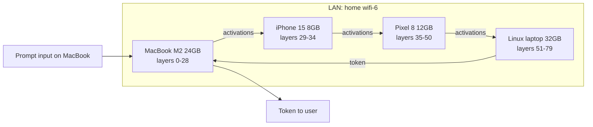

# EXO & Swarm Inference

## TL;DR

- **Swarm inference** is pipeline-parallel inference applied at the device-fleet level: shard a model's layers across N devices on a LAN, send activations between them, run a model none of them could run alone.
- **EXO** (`exo-explore/exo`) is the open-source reference: Python framework, mDNS discovery, dynamic partitioning across iOS / Android / macOS / Linux. Uses `tinygrad` and `mlx` as backends. Released early 2024, ~12K GitHub stars.
- **Petals** (`bigscience/petals`) is the BitTorrent-of-LLMs cousin — a public swarm where strangers share unused compute. Slower and less private than EXO but useful for genuinely large models (Llama-3.1-405B).
- The math: a 4-device LAN running pipeline-parallel inference on a 70B model averages **3–5 tok/s** — readable but not snappy. The bottleneck is **per-hop network latency**, not compute.
- **Wifi-6 or wired ethernet, ~12–30 ms per hop**. Wifi-5 (.11ac) hits 50–100 ms tail latency under contention and tanks tok/s.

## Why this matters

Single-device LLM inference is bounded by what fits in one device's memory. A phone fits a 7B; a laptop fits a 30B. **Nothing single fits a 70B at any quantization that keeps quality.** Yet 4 devices on a wifi network combined have ~50 GB of usable memory — easily enough.

The 2026 reality: small startups (and engineers in countries with patchy or expensive cloud access) are running 70B and 405B inference across LANs of cheap phones and laptops. The OSS tools made it real. **Knowing how the network determines the throughput is the load-bearing skill** — the rest is software engineering.

This is also the answer to "what's the future of distributed inference at the edge?" — sharded across the devices users already own, not on a cloud GPU. Privacy by default (the model weights are local; the activations cross your own LAN). Cost by default (hardware you bought; no per-token fees).

## Mental model



The pipeline-parallel pattern at fleet scale:

1. **Partition by memory budget**: each device's available memory determines how many layers it gets. Memory-rich devices get more layers.
2. **One forward pass = one full pipeline traversal**. Token N requires activation hand-off across all devices.
3. **The slowest hop dominates**. If one device or one network link is slow, the whole pipeline is slow.

## Concrete walkthrough

### How EXO partitions a model

EXO inspects each peer at startup and gets:

- Total memory.
- Estimated TFLOPS (heuristic from chip identifier).
- Network position (mDNS-derived hop estimate).

Then it solves a partition problem: assign layers $L_0, ..., L_{n-1}$ to devices $D_0, ..., D_{m-1}$ minimizing the longest device's load. The straightforward greedy works well enough — sort devices by memory descending, assign layers proportionally.

A typical 4-device partition for Llama-3.3-70B Q4 (~40 GB):

| Device | Memory | Layers | Layer count |
|---|---|---|---|
| MacBook M2 24 GB | 18 GB usable | 0–28 | 29 |
| Linux laptop 32 GB | 24 GB usable | 51–79 | 29 |
| Pixel 8 12 GB | 8 GB usable | 35–50 | 16 |
| iPhone 15 Pro 8 GB | 5 GB usable | 29–34 | 6 |

Total: 80 layers across 4 devices. The phone's 6 layers consume ~3 GB; the bigger devices each take ~14 GB.

EXO supports re-partitioning when a device joins or leaves the cluster. Re-partition takes 10–60 s (the displaced layers stream from disk to the new device).

### Per-token latency math

For pipeline-parallel inference, the per-token latency is the sum of:

- Per-device compute on the assigned layers.
- Per-hop network transfer of the activations.

The activation tensor between layers is small for transformers — `(batch, seq, hidden_dim)` of FP16 = at hidden_dim 8192 (Llama-3.3-70B), seq=1, batch=1, that's 16 KB per layer boundary. Across 4 device-boundaries: ~64 KB total over the network per token.

At wifi-6 (~1 Gbps with 5–10 ms RTT under no contention):

- Network: ~5 ms × 4 hops = ~20 ms per token of network overhead.
- Compute: 80 layers / 4 devices × ~5 ms per layer (M2-class) = ~100 ms total, but parallelized → critical-path is one device's share = ~40 ms.

Per-token: ~60 ms ≈ **17 tok/s** in theory.

Reality: 3–5 tok/s in EXO's published benchmarks. The gap is overhead — Python serialization, mDNS bookkeeping, scheduling jitter, the slowest phone hitting thermal throttle.

Still: a 70B running at 3–5 tok/s on $2K of consumer hardware *fully offline* is qualitatively a different product than "cloud-only".

### Network is the bottleneck — and the failure mode

Wifi performance under contention:

| Network | Median RTT | Tail (p99) | EXO tok/s on 70B |
|---|---|---|---|
| Wifi-6 (.11ax), no contention | 5 ms | 12 ms | 4–5 |
| Wifi-6, 5 active devices | 8 ms | 30 ms | 3–4 |
| Wifi-5 (.11ac), no contention | 10 ms | 25 ms | 3–4 |
| Wifi-5, contended apartment | 15 ms | 60 ms | 1–2 (often stalls) |
| Wired ethernet | 0.5 ms | 1 ms | 5–6 |
| Tailscale over WAN | 30–80 ms | 200 ms | under 1 |

If you can wire one device, do it — the host coordinator (the device facing the user) wired via ethernet alone bumps tok/s ~30%.

### The phone problem

The phone in the cluster is usually the bottleneck. Reasons:

1. **Smaller compute**: phone = 1 TFLOPS-class, laptop = 5–15 TFLOPS-class.
2. **Aggressive thermal throttling**: phones throttle hard after 60 s of compute.
3. **Background app suspension**: iOS may suspend the EXO process if the user switches apps. Pin EXO with `UIApplication.shared.beginBackgroundTask`.

**The pragmatic pattern**: assign the phone the minimum viable layer set (embedding + a few decoder blocks). Don't put hot layers (e.g., the layer with the heavy MoE expert) on the phone.

### Petals — the public-swarm cousin

Petals takes EXO's pattern public: a global swarm where anyone can host part of a model and anyone can use the swarm. Run by BigScience; primarily hosts Llama-3.1-405B and a few other very-large models.

Trade-offs vs EXO:

- **Petals can run 405B**, EXO usually can't (you need 50+ devices on your own LAN, which nobody has).
- **Petals is slower** — hops cross the public internet (50–200 ms RTT vs 5–10 ms LAN).
- **Petals is less private** — your activations transit through someone else's GPU. Use only for non-sensitive prompts.
- **Petals is free** — no compute cost.

Use Petals when the model is genuinely too large for your LAN and you don't mind the slower / less-private trade-off. Use EXO for everything else.

### Hybrid edge-to-cloud

EXO also supports a "cloud peer" mode: one peer is a rented GPU (Modal, Lambda) handling the heaviest layers, while the rest of the model runs on local devices. This recovers most of the privacy benefit (the activation tensors crossing the cloud are still derived from your prompt; not the prompt itself) while letting you run models the LAN alone can't fit.

Pattern: cloud handles the embedding + first few layers + last few layers (the parts where activations carry the most semantic info); local devices handle the middle "bulk" layers (which are mostly mechanical transformations). Tune the split based on your privacy-vs-cost preferences.

### Verifying the cluster is actually distributed (not silently centralized)

A common failure mode: one peer fails to load its assigned layers, and EXO falls back to running the *entire* model on the remaining peer with enough memory. The cluster is "running" but it's actually a single-device fallback. **Always verify with `exo --trace`**:

```bash
$ exo --trace
[peer macos-1] forward layer 0..28 took 12 ms
[peer macos-1] sent activations to ios-1 (4096 bytes, 8 ms)
[peer ios-1] forward layer 29..34 took 18 ms
[peer ios-1] sent activations to pixel-1 (4096 bytes, 11 ms)
...
```

The trace should show *all* peers receiving activations on every token. If only one peer's name appears, you've silently centralized.

## Run it in your browser

A useful demo: run the partitioning math, see how device choices change tok/s. The lessons jump out fast.

<RunInBrowser
  description="Partition a 70B across hypothetical devices and predict throughput. The phone vs no-phone difference is dramatic."
  code={`# Partition a 70B model across N devices on a LAN.
def predict_tps(devices, model_layers, hop_ms_per_link):
    """
    devices: list of (name, mem_gb, tflops, max_layers_their_mem_supports)
    Returns predicted tok/s assuming pipeline-parallel.
    """
    # Greedy partition: assign layers proportional to memory.
    total_mem = sum(d[3] for d in devices)
    assignments = []
    layers_left = model_layers
    for name, mem, tflops, max_layers in devices:
        take = min(max_layers, int(round(model_layers * max_layers / total_mem)))
        take = min(take, layers_left)
        assignments.append((name, take, tflops))
        layers_left -= take
    # Distribute remainder
    if layers_left > 0:
        assignments[0] = (assignments[0][0], assignments[0][1] + layers_left, assignments[0][2])

    # Per-device compute time per token (ms)
    # Rough: 70B Q4 = 0.5 GB/layer; phone TFLOPs / mem-bandwidth gives ~25ms/layer on laptop, ~80ms/layer on phone
    layer_time = {0.8: 80, 1.5: 50, 5.0: 25, 10.0: 18, 15.0: 14}
    def t_layer(tflops):
        # Pick the closest tflops bucket
        keys = sorted(layer_time.keys())
        for k in keys:
            if tflops <= k:
                return layer_time[k]
        return layer_time[keys[-1]]

    # Critical path: max device's compute + sum of network hops
    max_device_time = max(n_layers * t_layer(tf) for _, n_layers, tf in assignments)
    network_time = (len(devices) - 1) * hop_ms_per_link
    total_per_token_ms = max_device_time + network_time
    return assignments, 1000 / total_per_token_ms

# Llama-3.3-70B has 80 layers
model_layers = 80

print("--- Configuration A: 4 mixed devices on wifi-6 ---")
devs = [
    ("MacBook M2 24GB",  18, 5.0, 36),  # mem-gb-usable, tflops, max-layers-fits
    ("iPhone 15 Pro 8G",  5, 0.8, 10),
    ("Pixel 8 12GB",      8, 1.5, 16),
    ("Linux 32GB i7",    24, 5.0, 48),
]
assigns, tps = predict_tps(devs, model_layers, hop_ms_per_link=8)
for n, k, tf in assigns: print(f"  {n:<22} {k} layers ({tf} TFLOPS)")
print(f"  → predicted: {tps:.1f} tok/s")

print("\\n--- Configuration B: same but no phone (3 devices) ---")
devs_no_phone = [d for d in devs if "iPhone" not in d[0]]
# Re-distribute the phone's layers
assigns, tps = predict_tps(devs_no_phone, model_layers, hop_ms_per_link=8)
for n, k, tf in assigns: print(f"  {n:<22} {k} layers ({tf} TFLOPS)")
print(f"  → predicted: {tps:.1f} tok/s")

print("\\n--- Configuration C: 4 devices but on contended wifi-5 (40ms hop) ---")
assigns, tps = predict_tps(devs, model_layers, hop_ms_per_link=40)
for n, k, tf in assigns: print(f"  {n:<22} {k} layers ({tf} TFLOPS)")
print(f"  → predicted: {tps:.1f} tok/s")
`}
/>

The math says: dropping the phone often helps despite removing 5 GB of memory budget — the phone is on the critical path. And bad wifi can erase the entire benefit of the cluster.

## Quick check

<Quiz
  question="You set up an EXO cluster on a home wifi-6 network with a MacBook M2 (24 GB), an iPhone 15 (8 GB), and a Linux desktop (32 GB) — running Llama-3.3-70B Q4 (~40 GB). Cluster reports peer-discovery success but tok/s is 0.8 — barely usable. What's the most likely cause?"
  options={[
    "The model is too large; switch to Llama-3.2-30B.",
    "The phone is on a different SSID (a guest IoT network) and EXO's mDNS discovery is bridging via the router. Per-hop latency is now 60+ ms instead of 5 ms; pipeline traversal is dominated by network. Put all devices on the same SSID or wire the laptops via ethernet.",
    "iPhone's thermal throttle is kicking in immediately.",
    "EXO's Python overhead is too high; rewrite in Rust.",
  ]}
  answer={1}
  explanation="A working cluster at 0.8 tok/s on hardware that should hit 4 tok/s is the textbook 'network is much worse than expected' signature. The most common cause is multi-SSID setups (especially common when phones are on a 'guest' network that bridges through the router). Same SSID drops per-hop latency from 60 ms back to 5 ms. Option a (model too large) wouldn't show 'cluster works at low speed' — it'd OOM. Option c (thermal throttle) takes 30–60 s to kick in; this is from the first token. Option d (Python overhead) isn't the bottleneck for sub-1-tok/s; that's the network."
/>

## Key takeaways

1. **Swarm inference is pipeline-parallel inference applied to a device fleet** — same algorithm as data-center training, applied across phones and laptops on a LAN.
2. **EXO is the open-source reference**, supports iOS/Android/macOS/Linux, dynamic partitioning, mDNS discovery.
3. **Petals is the public-swarm variant** — slower, less private, but runs models that don't fit any single LAN.
4. **The network is the bottleneck** — wifi-6 with no contention is the floor for usable performance; wifi-5 contended is unusable.
5. **The phone is usually the bottleneck device** — assign minimum viable layers; pin to background-task entitlement.
6. **3–5 tok/s on 70B across a 4-device LAN** is the realistic performance envelope. Not snappy, but viable for non-real-time workloads.
7. **Hybrid edge-cloud** (one rented GPU + your devices) recovers most privacy while running models the LAN alone can't fit.

## Go deeper

<Resources
  items={[
    { kind: 'repo', href: 'https://github.com/exo-explore/exo', title: 'exo-explore/exo', author: 'EXO Labs', note: 'The reference framework. Read `exo/networking/peer.py` and `exo/inference/inference_engine.py` for the partition + dispatch logic.' },
    { kind: 'paper', href: 'https://arxiv.org/abs/2209.01188', title: 'Petals: Collaborative Inference and Fine-tuning of Large Models', author: 'Borzunov et al., 2022', note: 'The Petals paper. Public-swarm dynamics, Byzantine resilience, the math behind the BitTorrent-style protocol.' },
    { kind: 'blog', href: 'https://blog.exolabs.net/day-1/', title: 'EXO Day 1: Running Llama-3.1-405B on Macs', author: 'EXO Labs, 2024', note: 'The launch post. Concrete numbers from a real cluster.' },
    { kind: 'paper', href: 'https://arxiv.org/abs/1811.06965', title: 'GPipe: Efficient Training of Giant Neural Networks Using Pipeline Parallelism', author: 'Huang et al., 2018', note: 'The original pipeline-parallel paper. Inference pipelining is a simpler version of this.' },
    { kind: 'docs', href: 'https://github.com/bigscience-workshop/petals', title: 'bigscience-workshop/petals', author: 'BigScience', note: 'The Petals client + reference. Useful to read for the network-protocol design.' },
    { kind: 'video', href: 'https://www.youtube.com/watch?v=k8KfdHM5gN4', title: 'Distributed Inference at the Edge: EXO Walkthrough', author: 'Alex Cheema (EXO co-founder)', note: 'Talk explaining the design choices. Helpful for understanding the partitioning heuristic.' },
    { kind: 'blog', href: 'https://huggingface.co/blog/petals-2', title: 'How Petals Achieves 6× Speedup', author: 'Hugging Face, 2023', note: 'Implementation tricks: chunked transmission, attention-mask compression, the prefetch protocol.' },
  ]}
/>

<LessonComplete />
