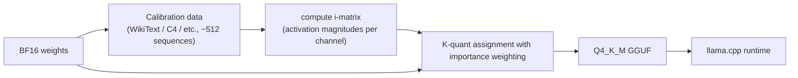

# GGUF & i-matrix

<Mode is="learn">

> **Prereqs:** [llama.cpp Internals](../on-device/llama-cpp-internals), [INT4 / AWQ / GPTQ](../../ml-execution/quantization/int4-and-awq). This lesson is about what makes the local-LLM 4-bit experience actually high-quality.

In a cloud-serving stack, "the model" is a directory of FP16 or BF16 safetensors with a config.json next to it. The runtime loads the whole thing into HBM and runs it as-is. There's no quantization step on the deployment path — quantization, if any, lives somewhere upstream in your training pipeline.

On a phone or laptop, FP16 isn't on the table — a 70B model in FP16 is 140 GB, a 7B model is 14 GB, neither fits in user-grade RAM. So the local-LLM ecosystem has spent three years building a quantization story that gets you 4-bit weights without making the model feel measurably stupider. The format is <Term name="gguf">GGUF</Term>; the recipe is <Term name="k-quants">K-quants</Term>; and the secret sauce that pushes Q4_K_M from "okay" to "indistinguishable from FP16" is a per-channel calibration vector called the **i-matrix**.

The shift from cloud thinking is subtle but important. **In the cloud, the file is the weights. On the device, the file carries weights *plus* the recipe that quantized them — and a careful enough recipe is the difference between a 3B model that feels stupid and one that feels like the API.** This lesson is about that recipe.

## TL;DR

- **GGUF** carries quantized weights *plus* the recipe that quantized them. The K-quant variants (Q4_K_M, Q5_K_M, etc.) are baked into the format spec.
- **K-quants store per-super-block (256 weights) statistics** plus per-sub-block (16/32 weights) refinements. More precision than naive INT4, no calibration data needed for "OK" results.
- **The i-matrix (importance matrix)** is a calibration-driven addition. Compute activation statistics on a calibration dataset; weight the quantization-error metric *by importance* per channel; feed back into the K-quant chooser. **Bumps quality of Q4_K_M / Q3_K from "OK" to "indistinguishable from FP16."**
- The i-matrix is **optional but essentially free** to compute (~5 minutes on a calibration set). Most modern GGUF releases on Hugging Face ship i-matrix-quantized variants.
- Reading per-quant size and quality numbers fluently — Q4_K_M ≈ 4.5 bits, Q5_K_M ≈ 5.5, Q6_K ≈ 6.6, Q8_0 ≈ 8.5 — is the price of admission for any local-LLM conversation in 2026.

## Why this matters

The local-LLM ecosystem (llama.cpp, Ollama, LM Studio, Jan, the entire Hugging Face GGUF tag) lives on K-quants and i-matrix calibration. **The difference between "free Llama-3.2-3B feels stupid" and "feels like the API" is almost entirely the quantization recipe**, not the model. Engineers who ship to consumer-facing local AI need to know which quant to ship, why, and how the i-matrix flow works.

## Mental model



The i-matrix is what makes "important" channels get more bits and "unimportant" ones get fewer — same total bit budget, less perplexity loss.

## K-quant structure recap

A K-quant lays out weights as **super-blocks of 256**. Within each super-block:

- A **super-block header** — typically a few bytes of statistics (min, max, scale, zero-point).
- **Sub-blocks of 16 or 32 weights**, each with their own refined parameters.
- The 4-bit (or 3-bit, 5-bit) weight indices, packed.

For Q4_K_M:
- Super-block: 256 weights.
- Each super-block: 12 bytes of header (FP16 + extras).
- Sub-blocks: 8 sub-blocks of 32 weights, each with a 6-bit min and 6-bit scale.
- Weight bits: 4 per weight × 256 = 128 bytes per super-block.
- **Total: 12 (header) + 8×6/4 + 8×6/4 (mins/scales packed) + 128 (weights) = ~150 bytes per 256 weights ≈ 4.5 bits/weight effective.**

Compare to bare INT4 with one BF16 scale per group of 128: ~4.125 bits/weight. The K-quants pay 0.4 bits/weight for the sub-block refinement — and that 0.4 bits buys most of the accuracy back.

The "M" variant (Q4_K_M, Q5_K_M) goes further: it stores some "important" weights — typically the FFN down-projection — at 6 bits while the rest stay at 4 bits. Adaptive precision per layer.

## Why i-matrix?

Without an i-matrix, K-quants pick which weights to give more bits via *static heuristics* (this layer is FFN, that one is attention, etc.). Heuristics are decent but blind to the *actual* weight-to-activation interaction in the model.

The i-matrix is a per-input-channel weight (literally: a vector per layer) that captures **how much each channel matters** based on calibration activations. The math:

$$
\text{importance}_i = \mathbb{E}_{x \sim D_{\text{calib}}} \left[ x_i^2 \right]
$$

where $x_i$ is the i-th input channel of activations on the <Term name="calibration data">calibration set</Term> $D_{\text{calib}}$. Channels that consistently have large activations are "important" — quantizing their weights badly causes large output errors.

The K-quant chooser, given an i-matrix, scales the per-block error metric:

$$
\text{block\_err}_b = \sum_{w \in b} (w_q - w)^2 \cdot \text{importance}(\text{input\_channel}(w))
$$

and picks scales/zero-points that minimize this *weighted* error. Important weights get tighter scales (less rounding error); unimportant weights tolerate looser scales.

The shape is similar to <Term name="awq">AWQ</Term>'s per-channel scaling but the implementation is simpler — no offline weight rescaling, just a different inner-loop metric during the same K-quant procedure.

## Computing the i-matrix in practice

The CLI is part of llama.cpp — written in C, runs on the same `ggml` core that does inference. Calibration is a one-time offline step:

```bash
# 1. Convert your model to a base GGUF (this Python script ships with llama.cpp)
python convert_hf_to_gguf.py meta-llama/Llama-3.2-3B-Instruct

# 2. Compute the i-matrix on a calibration set
./imatrix -m llama-3.2-3b-f16.gguf -f calibration.txt -o llama-3.2-3b.imatrix

# 3. Quantize using the i-matrix
./quantize --imatrix llama-3.2-3b.imatrix llama-3.2-3b-f16.gguf llama-3.2-3b-q4_k_m.gguf Q4_K_M
```

Calibration set: 100–500 sequences from the same domain as your target use case. WikiText is a generic default; for code-heavy use cases, calibrate on code; for chat, on chat.

The i-matrix file is small (~MB scale). It's computed once per model and reused across quant levels — the same i-matrix can produce Q4_K_M, Q5_K_M, Q3_K, etc.

## Quality impact, with numbers

Approximate MMLU drops vs FP16 (median across recent Llama / Qwen / DeepSeek-distill checkpoints):

| Quant         | Without i-matrix | With i-matrix |
|---------------|------------------|---------------|
| Q8_0          | -0.1             | -0.1          |
| Q6_K          | -0.3             | -0.2          |
| Q5_K_M        | -0.7             | -0.4          |
| **Q4_K_M**    | **-1.5**         | **-0.8**      |
| Q3_K_M        | -3.5             | -2.0          |
| Q2_K          | -8.0             | -5.5          |

The i-matrix gives back roughly half the regression. For Q4_K_M, the production sweet spot, that's the difference between "noticeable" and "imperceptible" in chat use.

## Picking a quant in 2026

- **Q4_K_M with i-matrix**: the universal default for local LLMs ≥ 3B.
- **Q5_K_M with i-matrix**: when you have headroom (memory or disk) and want lossless-feeling quality.
- **Q6_K**: near-lossless; rarely worth it vs Q5_K_M.
- **Q8_0**: a "sanity baseline" — basically as good as FP16, twice the file size of Q4_K_M.
- **Q3_K_M**: only when you can't fit Q4 (typically low-RAM devices). With i-matrix, Q3_K is usable.
- **Q2_K**: aggressive edge; only when the device can't afford anything else. Visible quality drop.

## Hugging Face GGUF ecosystem

The `bartowski` and `LoneStriker` users on Hugging Face publish thousands of quantized GGUF variants per popular base model — typically all the K-quant levels with i-matrix calibration. Convention:

- `Llama-3.2-3B-Instruct-Q4_K_M.gguf` — pre-computed i-matrix-quantized.
- `Llama-3.2-3B-Instruct.imatrix` — the i-matrix file, separately.

For most engineers in 2026, "computing your own i-matrix" is unnecessary — the community has done it for every model that matters. **Knowing the format and the recipe is what lets you debug or recompute when you need to.**

## Run it in your browser — bit-budget calculator with i-matrix

<RunInBrowser
  description="Compute effective bits/weight for a GGUF and the resulting file size. Sweep across quants."
  code={`def gguf_size_mb(params_b, bits_per_weight):
    """Approximate GGUF file size for a model. Adds ~5% overhead for tokenizer + metadata."""
    weight_bytes = params_b * 1e9 * bits_per_weight / 8
    return weight_bytes / 1024 / 1024 * 1.05

quants = [
    ('Q2_K',     2.6),
    ('Q3_K_M',   3.4),
    ('Q4_K_M',   4.5),
    ('Q5_K_M',   5.5),
    ('Q6_K',     6.6),
    ('Q8_0',     8.5),
    ('FP16',     16.0),
]

models = [
    ('Llama-3.2-1B', 1.24),
    ('Llama-3.2-3B', 3.21),
    ('Llama-3.1-8B', 8.0),
    ('Llama-3.1-70B', 70.55),
]

for name, p in models:
    print(f"\\n=== {name} ({p} B params) ===")
    print(f"{'quant':<8} {'bits/w':>7} {'size':>10}")
    for q, bits in quants:
        s = gguf_size_mb(p, bits)
        if s < 1024:
            print(f"{q:<8} {bits:>7.1f} {s:>7.0f} MB")
        else:
            print(f"{q:<8} {bits:>7.1f} {s/1024:>7.1f} GB")

print()
print("Pocket cheat sheet for what fits where:")
print("  iPhone 15 Pro (8 GB RAM): Q4_K_M up to 7B, Q5 up to 5B")
print("  Macbook Pro M3 (16 GB): Q4 up to 14B, Q5 up to 10B")
print("  Macbook Pro M3 Max (64 GB): Q4 up to 70B (!), Q5 up to 50B")
`}
/>

The output is the same memory-fit table local-LLM enthusiasts memorize. Knowing it cold (or having this calculator handy) is half of "ship to a phone" engineering.

## Quick check

<FillIn
  prompt="The calibration-derived per-channel weight that improves K-quant accuracy:"
  answer="i-matrix"
  accept={["importance matrix", "imatrix", "imatrix calibration"]}
  hint="Two characters separated by a hyphen, like the file extension."
  explanation="The i-matrix (importance matrix) captures per-input-channel activation magnitudes from calibration data. K-quants use it to weight the per-block error metric so important channels get tighter scales. Bumps Q4_K_M from -1.5 to -0.8 MMLU regression."
/>

<Quiz
  question="A team ships Llama-3.2-3B to their iOS app at Q4_K_M but users report it feels noticeably worse than the cloud-hosted Llama-3.1-405B. The product manager wonders if 4-bit was the wrong choice. Best technical response:"
  options={[
    'Switch to Q8_0 (will feel better but app is now 3.4 GB).',
    'Use a Q4_K_M variant produced *with* an i-matrix on a chat-style calibration set — recovers most of the perceived gap; same file size.',
    'Drop to Q3_K to save more space.',
    'Switch to a different model.',
  ]}
  answer={1}
  explanation={`Without i-matrix calibration, Q4_K_M can drop ~1.5 pts MMLU; with i-matrix on a representative calibration set, that's ~0.8 pts. The "feels worse" gap on chat is often the chat-domain shift, which i-matrix calibration on chat sequences directly addresses. Same file size, much closer to FP16 quality. Most public GGUF uploads on Hugging Face already include i-matrix calibration; check the model card.`}
/>

## Key takeaways

1. **GGUF carries the quantization recipe inside the file.** K-quants are baked into the format.
2. **Q4_K_M ≈ 4.5 effective bits/weight; M variants store some weights at 6-bit.** Memorize the bits-per-weight table.
3. **The i-matrix is calibration-driven importance weighting.** Cuts Q4_K_M's MMLU regression roughly in half.
4. **Computing an i-matrix is cheap (~5 min)** and usually pre-computed by the Hugging Face community per model.
5. **Q4_K_M with i-matrix is the 2026 universal default** for local LLMs ≥ 3B.

## Go deeper

<Resources
  items={[
    { kind: 'docs', href: 'https://github.com/ggerganov/llama.cpp/blob/master/docs/quantize.md', title: 'llama.cpp — Quantization Guide', note: 'Authoritative. The K-quant table + i-matrix flow + recommendations per model size.' },
    { kind: 'docs', href: 'https://github.com/ggerganov/llama.cpp/tree/master/examples/imatrix', title: 'llama.cpp — imatrix tool', note: 'The CLI that computes i-matrices. README has the calibration-set advice.' },
    { kind: 'blog', href: 'https://github.com/ggerganov/llama.cpp/discussions/5263', title: 'llama.cpp — i-matrix Quantization Discussion', note: 'The original discussion thread that introduced i-matrix to the codebase. Useful for the "why" rather than the "what."' },
    { kind: 'docs', href: 'https://huggingface.co/docs/transformers/main/en/gguf', title: 'Hugging Face — GGUF Documentation', note: 'How GGUF integrates with transformers (load GGUF directly into a HF pipeline).' },
    { kind: 'blog', href: 'https://huggingface.co/blog/llamafile', title: 'Hugging Face Blog — llamafile', note: 'Mozilla\'s single-binary llama.cpp distribution. The most ergonomic way to ship GGUFs to non-developer users.' },
    { kind: 'repo', href: 'https://huggingface.co/bartowski', title: 'bartowski on Hugging Face', note: 'The most prolific GGUF re-quantizer; high-quality i-matrix-calibrated variants for nearly every popular base model. The de facto index.' },
  ]}
/>

</Mode>

<Mode is="reference">

> **Prereqs:** [llama.cpp Internals](../on-device/llama-cpp-internals), [INT4 / AWQ / GPTQ](../../ml-execution/quantization/int4-and-awq). This lesson is about what makes the local-LLM 4-bit experience actually high-quality.

## TL;DR

- **GGUF** carries quantized weights *plus* the recipe that quantized them. The K-quant variants (Q4_K_M, Q5_K_M, etc.) are baked into the format spec.
- **K-quants store per-super-block (256 weights) statistics** plus per-sub-block (16/32 weights) refinements. More precision than naive INT4, no calibration data needed for "OK" results.
- **The i-matrix (importance matrix)** is a calibration-driven addition. Compute activation statistics on a calibration dataset; weight the quantization-error metric *by importance* per channel; feed back into the K-quant chooser. **Bumps quality of Q4_K_M / Q3_K from "OK" to "indistinguishable from FP16."**
- The i-matrix is **optional but essentially free** to compute (~5 minutes on a calibration set). Most modern GGUF releases on Hugging Face ship i-matrix-quantized variants.
- Reading per-quant size and quality numbers fluently — Q4_K_M ≈ 4.5 bits, Q5_K_M ≈ 5.5, Q6_K ≈ 6.6, Q8_0 ≈ 8.5 — is the price of admission for any local-LLM conversation in 2026.

## Why this matters

The local-LLM ecosystem (llama.cpp, Ollama, LM Studio, Jan, the entire Hugging Face GGUF tag) lives on K-quants and i-matrix calibration. **The difference between "free Llama-3.2-3B feels stupid" and "feels like the API" is almost entirely the quantization recipe**, not the model. Engineers who ship to consumer-facing local AI need to know which quant to ship, why, and how the i-matrix flow works.

## Mental model


The i-matrix is what makes "important" channels get more bits and "unimportant" ones get fewer — same total bit budget, less perplexity loss.

## Concrete walkthrough

### K-quant structure recap

A K-quant lays out weights as **super-blocks of 256**. Within each super-block:

- A **super-block header** — typically a few bytes of statistics (min, max, scale, zero-point).
- **Sub-blocks of 16 or 32 weights**, each with their own refined parameters.
- The 4-bit (or 3-bit, 5-bit) weight indices, packed.

For Q4_K_M:
- Super-block: 256 weights.
- Each super-block: 12 bytes of header (FP16 + extras).
- Sub-blocks: 8 sub-blocks of 32 weights, each with a 6-bit min and 6-bit scale.
- Weight bits: 4 per weight × 256 = 128 bytes per super-block.
- **Total: 12 (header) + 8×6/4 + 8×6/4 (mins/scales packed) + 128 (weights) = ~150 bytes per 256 weights ≈ 4.5 bits/weight effective.**

Compare to bare INT4 with one BF16 scale per group of 128: ~4.125 bits/weight. The K-quants pay 0.4 bits/weight for the sub-block refinement — and that 0.4 bits buys most of the accuracy back.

The "M" variant (Q4_K_M, Q5_K_M) goes further: it stores some "important" weights — typically the FFN down-projection — at 6 bits while the rest stay at 4 bits. Adaptive precision per layer.

### Why i-matrix?

Without an i-matrix, K-quants pick which weights to give more bits via *static heuristics* (this layer is FFN, that one is attention, etc.). Heuristics are decent but blind to the *actual* weight-to-activation interaction in the model.

The i-matrix is a per-input-channel weight (literally: a vector per layer) that captures **how much each channel matters** based on calibration activations. The math:

$$
\text{importance}_i = \mathbb{E}_{x \sim D_{\text{calib}}} \left[ x_i^2 \right]
$$

where $x_i$ is the i-th input channel of activations on the calibration set $D_{\text{calib}}$. Channels that consistently have large activations are "important" — quantizing their weights badly causes large output errors.

The K-quant chooser, given an i-matrix, scales the per-block error metric:

$$
\text{block\_err}_b = \sum_{w \in b} (w_q - w)^2 \cdot \text{importance}(\text{input\_channel}(w))
$$

and picks scales/zero-points that minimize this *weighted* error. Important weights get tighter scales (less rounding error); unimportant weights tolerate looser scales.

The shape is similar to AWQ's per-channel scaling but the implementation is simpler — no offline weight rescaling, just a different inner-loop metric during the same K-quant procedure.

### Computing the i-matrix in practice

```bash
# 1. Convert your model to a base GGUF
python convert_hf_to_gguf.py meta-llama/Llama-3.2-3B-Instruct

# 2. Compute the i-matrix on a calibration set
./imatrix -m llama-3.2-3b-f16.gguf -f calibration.txt -o llama-3.2-3b.imatrix

# 3. Quantize using the i-matrix
./quantize --imatrix llama-3.2-3b.imatrix llama-3.2-3b-f16.gguf llama-3.2-3b-q4_k_m.gguf Q4_K_M
```

Calibration set: 100–500 sequences from the same domain as your target use case. WikiText is a generic default; for code-heavy use cases, calibrate on code; for chat, on chat.

The i-matrix file is small (~MB scale). It's computed once per model and reused across quant levels — the same i-matrix can produce Q4_K_M, Q5_K_M, Q3_K, etc.

### Quality impact, with numbers

Approximate MMLU drops vs FP16 (median across recent Llama / Qwen / DeepSeek-distill checkpoints):

| Quant         | Without i-matrix | With i-matrix |
|---------------|------------------|---------------|
| Q8_0          | -0.1             | -0.1          |
| Q6_K          | -0.3             | -0.2          |
| Q5_K_M        | -0.7             | -0.4          |
| **Q4_K_M**    | **-1.5**         | **-0.8**      |
| Q3_K_M        | -3.5             | -2.0          |
| Q2_K          | -8.0             | -5.5          |

The i-matrix gives back roughly half the regression. For Q4_K_M, the production sweet spot, that's the difference between "noticeable" and "imperceptible" in chat use.

### Picking a quant in 2026

- **Q4_K_M with i-matrix**: the universal default for local LLMs ≥ 3B.
- **Q5_K_M with i-matrix**: when you have headroom (memory or disk) and want lossless-feeling quality.
- **Q6_K**: near-lossless; rarely worth it vs Q5_K_M.
- **Q8_0**: a "sanity baseline" — basically as good as FP16, twice the file size of Q4_K_M.
- **Q3_K_M**: only when you can't fit Q4 (typically low-RAM devices). With i-matrix, Q3_K is usable.
- **Q2_K**: aggressive edge; only when the device can't afford anything else. Visible quality drop.

### Hugging Face GGUF ecosystem

The `bartowski` and `LoneStriker` users on Hugging Face publish thousands of quantized GGUF variants per popular base model — typically all the K-quant levels with i-matrix calibration. Convention:

- `Llama-3.2-3B-Instruct-Q4_K_M.gguf` — pre-computed i-matrix-quantized.
- `Llama-3.2-3B-Instruct.imatrix` — the i-matrix file, separately.

For most engineers in 2026, "computing your own i-matrix" is unnecessary — the community has done it for every model that matters. **Knowing the format and the recipe is what lets you debug or recompute when you need to.**

## Run it in your browser — bit-budget calculator with i-matrix

<RunInBrowser
  description="Compute effective bits/weight for a GGUF and the resulting file size. Sweep across quants."
  code={`def gguf_size_mb(params_b, bits_per_weight):
    """Approximate GGUF file size for a model. Adds ~5% overhead for tokenizer + metadata."""
    weight_bytes = params_b * 1e9 * bits_per_weight / 8
    return weight_bytes / 1024 / 1024 * 1.05

quants = [
    ('Q2_K',     2.6),
    ('Q3_K_M',   3.4),
    ('Q4_K_M',   4.5),
    ('Q5_K_M',   5.5),
    ('Q6_K',     6.6),
    ('Q8_0',     8.5),
    ('FP16',     16.0),
]

models = [
    ('Llama-3.2-1B', 1.24),
    ('Llama-3.2-3B', 3.21),
    ('Llama-3.1-8B', 8.0),
    ('Llama-3.1-70B', 70.55),
]

for name, p in models:
    print(f"\\n=== {name} ({p} B params) ===")
    print(f"{'quant':<8} {'bits/w':>7} {'size':>10}")
    for q, bits in quants:
        s = gguf_size_mb(p, bits)
        if s < 1024:
            print(f"{q:<8} {bits:>7.1f} {s:>7.0f} MB")
        else:
            print(f"{q:<8} {bits:>7.1f} {s/1024:>7.1f} GB")

print()
print("Pocket cheat sheet for what fits where:")
print("  iPhone 15 Pro (8 GB RAM): Q4_K_M up to 7B, Q5 up to 5B")
print("  Macbook Pro M3 (16 GB): Q4 up to 14B, Q5 up to 10B")
print("  Macbook Pro M3 Max (64 GB): Q4 up to 70B (!), Q5 up to 50B")
`}
/>

The output is the same memory-fit table local-LLM enthusiasts memorize. Knowing it cold (or having this calculator handy) is half of "ship to a phone" engineering.

## Quick check

<FillIn
  prompt="The calibration-derived per-channel weight that improves K-quant accuracy:"
  answer="i-matrix"
  accept={["importance matrix", "imatrix", "imatrix calibration"]}
  hint="Two characters separated by a hyphen, like the file extension."
  explanation="The i-matrix (importance matrix) captures per-input-channel activation magnitudes from calibration data. K-quants use it to weight the per-block error metric so important channels get tighter scales. Bumps Q4_K_M from -1.5 to -0.8 MMLU regression."
/>

<Quiz
  question="A team ships Llama-3.2-3B to their iOS app at Q4_K_M but users report it feels noticeably worse than the cloud-hosted Llama-3.1-405B. The product manager wonders if 4-bit was the wrong choice. Best technical response:"
  options={[
    'Switch to Q8_0 (will feel better but app is now 3.4 GB).',
    'Use a Q4_K_M variant produced *with* an i-matrix on a chat-style calibration set — recovers most of the perceived gap; same file size.',
    'Drop to Q3_K to save more space.',
    'Switch to a different model.',
  ]}
  answer={1}
  explanation={`Without i-matrix calibration, Q4_K_M can drop ~1.5 pts MMLU; with i-matrix on a representative calibration set, that's ~0.8 pts. The "feels worse" gap on chat is often the chat-domain shift, which i-matrix calibration on chat sequences directly addresses. Same file size, much closer to FP16 quality. Most public GGUF uploads on Hugging Face already include i-matrix calibration; check the model card.`}
/>

## Key takeaways

1. **GGUF carries the quantization recipe inside the file.** K-quants are baked into the format.
2. **Q4_K_M ≈ 4.5 effective bits/weight; M variants store some weights at 6-bit.** Memorize the bits-per-weight table.
3. **The i-matrix is calibration-driven importance weighting.** Cuts Q4_K_M's MMLU regression roughly in half.
4. **Computing an i-matrix is cheap (~5 min)** and usually pre-computed by the Hugging Face community per model.
5. **Q4_K_M with i-matrix is the 2026 universal default** for local LLMs ≥ 3B.

## Go deeper

<Resources
  items={[
    { kind: 'docs', href: 'https://github.com/ggerganov/llama.cpp/blob/master/docs/quantize.md', title: 'llama.cpp — Quantization Guide', note: 'Authoritative. The K-quant table + i-matrix flow + recommendations per model size.' },
    { kind: 'docs', href: 'https://github.com/ggerganov/llama.cpp/tree/master/examples/imatrix', title: 'llama.cpp — imatrix tool', note: 'The CLI that computes i-matrices. README has the calibration-set advice.' },
    { kind: 'blog', href: 'https://github.com/ggerganov/llama.cpp/discussions/5263', title: 'llama.cpp — i-matrix Quantization Discussion', note: 'The original discussion thread that introduced i-matrix to the codebase. Useful for the "why" rather than the "what."' },
    { kind: 'docs', href: 'https://huggingface.co/docs/transformers/main/en/gguf', title: 'Hugging Face — GGUF Documentation', note: 'How GGUF integrates with transformers (load GGUF directly into a HF pipeline).' },
    { kind: 'blog', href: 'https://huggingface.co/blog/llamafile', title: 'Hugging Face Blog — llamafile', note: 'Mozilla\'s single-binary llama.cpp distribution. The most ergonomic way to ship GGUFs to non-developer users.' },
    { kind: 'repo', href: 'https://huggingface.co/bartowski', title: 'bartowski on Hugging Face', note: 'The most prolific GGUF re-quantizer; high-quality i-matrix-calibrated variants for nearly every popular base model. The de facto index.' },
  ]}
/>

</Mode>

<LessonComplete />
