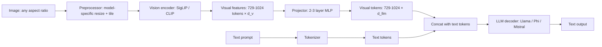

# Mobile VLMs

<Mode is="learn">

In a managed cloud world, "ship a vision-language model" usually means: stand up an A100, install `transformers`, point it at a HuggingFace VLM, expose an HTTP endpoint, charge per token. The vision side is just one more PyTorch module the runtime loads.

On a phone, the picture cracks open. The user's camera is constantly producing frames you cannot reasonably round-trip to the cloud (60% of phone usage involves the camera; the screenshot folder is most users' second-largest app data). Privacy and latency say: run the model locally. But a single image, after the vision encoder runs, lands roughly **729 visual tokens** in the LLM's context — before the user has typed anything. Two images consume a third of MiniCPM-V's 4K context. **Every image you show the model is an aggressive consumer of the same KV cache the text decode lives in.**

The 2024–2026 inflection is real: MiniCPM-V-2.6 (8B) crosses GPT-4V on several benchmarks while running on an iPhone 15 Pro at ~3 tok/s. The art has migrated from "can we train a VLM" to runtime engineering — getting the preprocessing right, sizing the KV-cache budget for visual tokens, and quantizing without losing visual fidelity. **Python is the SDK; <Term name="ggml">ggml</Term> + a `clip` extension + an mmproj file is what runs on the device.**

## TL;DR

- A **VLM (vision-language model)** is an LLM with a vision encoder and a learned **projector** glued in front. Image goes through CLIP/SigLIP → projector → tokens → LLM. Output is text. Fits in any chat-shaped runtime.
- The 2026 mobile zoo: **MiniCPM-V-2.6** (8B, ~5 GB at Q4_K_M, the practical pick), **Phi-3.5-Vision** (4.2B, ~3 GB, faster but less accurate), **LLaVA-Mobile / MobileVLM** (1–3B, ~2 GB), **PaliGemma** (3B, Google's open VLM, hard to beat for OCR).
- The **projector** is a 2- or 3-layer MLP that maps CLIP/SigLIP features (1152-dim) to LLM token-embedding space (4096-dim for Llama-3-8B). It's tiny — ~10 MB. Most of the size is still the LLM.
- Image preprocessing is the silent failure mode. **Each VLM uses a specific resolution and aspect-ratio scheme** (Phi-3.5-Vision: dynamic 336×336 tiling; MiniCPM-V: 448×448 with adaptive aspect ratios). Use the wrong preprocessor and accuracy collapses without erroring.
- Mobile VLMs ship in `ggml`/llama.cpp via separate `mmproj` files (the projector + image encoder packaged separately from the LLM weights). Both files are required at load time.

## Why this matters

Vision is the always-on phone modality. The camera is open in 60% of phone usage; the screenshot folder is most users' second-largest app data. A VLM on-device unlocks features you literally can't ship via cloud (always-on accessibility narration, OCR for sensitive documents, image search of personal photos) without a privacy story that breaks shipping.

The 2024–2026 inflection: mobile VLMs got *good*. MiniCPM-V-2.6 (8B) crosses GPT-4V on several benchmarks while running on an iPhone 15 Pro at ~3 tok/s. The art is now in the runtime — getting the preprocessing right, managing the memory budget, and quantizing without losing visual fidelity.

## Mental model



Three separate weight blobs in a typical mobile VLM:

1. **Vision encoder** (SigLIP-base-384 or CLIP-ViT-L: ~400 MB FP16, ~100 MB at Q4).
2. **Projector** (2–3 layer MLP: ~5–10 MB, almost always full-precision).
3. **LLM** (3B–8B, the bulk: 1.5–4 GB at Q4).

Total mobile budget: 2–5 GB on disk, 2.5–6 GB in working memory once <Term name="kv cache">KV cache</Term> is allocated for the typical 1024-token context.

## The projector trick — why VLMs are small

A naive vision-text model would learn vision and language jointly from scratch — billions of params, trillions of training tokens. **The projector trick (Liu et al., LLaVA, 2023) instead reuses pretrained models and only trains the glue.**

The recipe (this is offline training, runs in PyTorch on a research GPU — Python user surface):

1. Take a frozen pretrained vision encoder (SigLIP, ~400 M params).
2. Take a frozen pretrained LLM (Llama-3-8B).
3. Train *only* a 2-layer MLP between them on ~600 K image-caption pairs.
4. Optionally fine-tune the LLM on visual-question-answering pairs.

Step 3 trains for hours on a single GPU, not weeks on hundreds. The projector is ~10 MB, vs. the 8 GB LLM. Almost all the work was already done in the pretrained components.

This is why mobile VLMs are realistic — you're not training a new modality, you're stitching two existing ones.

## What the visual tokens actually look like

A 384×384 image goes into SigLIP-base-384 → 729 patches of 14×14 → 729 visual feature vectors of dim 1152. Projector → 729 tokens of dim 4096. **These get concatenated with the text tokens and the LLM treats them identically** — no special attention, no separate embedding table.

So a mobile VLM call with a single image at the start of context burns ~729 tokens of context length before you even type a question. Two-image multi-turn = ~1500 tokens. Plan KV-cache budget accordingly.

## Image preprocessing — the silent killer

Each VLM ships a specific preprocessor. Get it wrong and the model "still works" — produces a confident, fluent caption — but it's caption of garbled features. Some examples:

| Model | Resolution | Aspect-ratio scheme | If you skip this |
|---|---|---|---|
| **MiniCPM-V-2.6** | 448×448 | Adaptive: 1×1, 1×2, 2×1, 2×2, 1×3, 3×1, 1×4, 4×1, etc. tile to preserve aspect | Tall photos lose vertical info; OCR fails on receipts |
| **Phi-3.5-Vision** | 336×336 | Dynamic-tile up to 16 tiles | Long screenshots lose half their text |
| **LLaVA-1.5/1.6** | 336×336 | Pad-and-resize (1.5) / dynamic-tile (1.6) | Severe quality drop on non-square inputs |
| **PaliGemma** | 224×224 | Pad-and-resize (square) | Less affected — it's trained on padded inputs |

**Always use the model's bundled preprocessor.** The HuggingFace `AutoProcessor.from_pretrained(...)` does this; for llama.cpp, the `mmproj` file encodes the preprocessing config and `llava_image_embed_make_with_filename` applies it correctly.

## Quantization for VLMs — the vision encoder is fragile

The LLM half quantizes like a normal LLM (Q4_K_M is fine, Q5_K_M for headroom). The vision encoder is more sensitive:

- **SigLIP/CLIP at Q4** drops detection accuracy 3–5 points on benchmark VQA. Not catastrophic but noticeable for OCR.
- **SigLIP at Q5_K** or Q8 is the production sweet spot — minimal quality loss.
- **The projector** should always stay FP16. It's 10 MB; the savings aren't worth the quality risk.

For MiniCPM-V-2.6 on iPhone, the realistic config is:

- LLM: Q4_K_M (~4 GB)
- Vision encoder: Q5_K_M (~250 MB)
- Projector: FP16 (~10 MB)
- Total: ~4.3 GB on disk, ~5 GB working

## Running MiniCPM-V via llama.cpp on iPhone

Conversion runs on the dev machine (Python). On the device, it's the `ggml` C runtime with the `clip` extension:

```bash
# On a build machine: convert + quantize.
python convert_hf_to_gguf.py minicpm-v-2.6/  # creates ggml-model-f16.gguf + mmproj-model-f16.gguf
./llama-quantize ggml-model-f16.gguf ggml-model-q4_k_m.gguf Q4_K_M
# Don't quantize the mmproj — keep it FP16.
```

```c
// In your iOS app, wire the standard llama.cpp Metal API but with both files:
llama_model* model = llama_model_load_from_file("ggml-model-q4_k_m.gguf", ...);
llama_clip_ctx* clip = clip_model_load("mmproj-model-f16.gguf", ...);

// To caption an image:
llava_image_embed* embed = llava_image_embed_make_with_filename(clip, "/path/photo.jpg");
// embed contains 729 visual tokens already in LLM-token-space.

// Decode normally — the embed is prepended like any other token batch.
llama_decode(ctx, embed_to_batch(embed));
const char* prompt = "What's in this image?";
llama_tokenize(...);
// stream tokens out as usual.
```

The whole pipeline reuses the llama.cpp runtime + adds a small `clip` extension. Total app code: ~150 lines on top of the basic chat app.

## Performance honestly

MiniCPM-V-2.6 (8B) on iPhone 15 Pro:

- First-token latency (after image): **~4 s** (image encode + projector + first decoder token).
- Steady-state: **~3 tok/s** on Metal.
- Memory: ~5 GB peak (close to the 6 GB usable cap on 8 GB phones).

Phi-3.5-Vision (4.2B) on iPhone 15 Pro:

- First-token latency: **~2 s**.
- Steady-state: **~6 tok/s**.
- Memory: ~3 GB peak (comfortable).

If you need fast responses, Phi-3.5-Vision is the right pick. If you need quality (multi-image reasoning, OCR, charts), MiniCPM-V is worth the latency cost.

## Run it in your browser

A useful demo: see how visual tokens consume your context budget — VLMs eat KV cache fast, and the budget math determines what kind of conversation is possible.

<RunInBrowser
  description="Plan a mobile VLM context budget. The visual tokens add up fast — multi-image chat is mostly a memory problem, not a compute one."
  code={`# Plan VLM context budgets — visual tokens are not free.
def context_budget(model_name, llm_ctx_max, vis_tok_per_image, kv_bytes_per_token):
    print(f"\\n{model_name}  (ctx_max={llm_ctx_max}, {vis_tok_per_image} tokens/image)")
    for n_images in [0, 1, 2, 4]:
        used = n_images * vis_tok_per_image
        text_budget = llm_ctx_max - used
        kv_mb = (used * kv_bytes_per_token) / (1024 * 1024)
        text_words = text_budget // 1.3  # rough words/token
        print(f"  {n_images} image(s): {used:>5} vis tok, "
              f"~{text_words:>5.0f} words of text room, "
              f"KV for visuals: {kv_mb:>5.1f} MB")

# Llama-3.2-3B with KV at FP16: 2 (k) * 2 (v) bytes/elem * 32 layers * 32 heads * 96 head-dim
# Roughly ~400 KB per token of KV at 3B. Phi-3.5-V is ~600 KB/tok. MiniCPM-V is ~800 KB/tok.

context_budget("Phi-3.5-Vision (4.2B)", llm_ctx_max=8192,
               vis_tok_per_image=576, kv_bytes_per_token=600 * 1024)
context_budget("MiniCPM-V-2.6 (8B)", llm_ctx_max=4096,
               vis_tok_per_image=729, kv_bytes_per_token=800 * 1024)
`}
/>

The lesson: 2 images already use a third of MiniCPM-V's context. Multi-image chat needs a small LLM + big context, not a big LLM + small context.

## Quick check

<Quiz
  question="You ship MiniCPM-V-2.6 on iPhone. The model gives correct captions for square photos but produces garbled descriptions for tall portraits and wide landscapes. What's the most likely bug?"
  options={[
    "The vision encoder is quantized too aggressively (Q4); upgrade to Q5_K.",
    "Your preprocessor is pad-and-resize-to-square instead of MiniCPM-V's adaptive aspect-ratio tiling. Use the bundled `mmproj` preprocessor.",
    "The LLM context is too short for non-square images; bump the context window.",
    "The projector is being applied incorrectly; the FP16 weights are loading as Q4.",
  ]}
  answer={1}
  explanation="MiniCPM-V's adaptive aspect-ratio tiling is essential. A naive pad-to-square preprocessor strips out the structure that lets the model handle tall (receipts, screenshots) and wide (landscape, panoramas) images — the model still produces fluent output but it's confidently wrong. The fix is always 'use the bundled preprocessor', not 'change the model config'. Quantization (a) and projector loading (d) would degrade ALL outputs, not just non-square ones; context length (c) doesn't affect image-shape handling."
/>

## Key takeaways

1. **A VLM is an LLM + frozen vision encoder + small projector** — the projector is the only part trained from scratch and it's tiny.
2. **The 2026 mobile zoo**: Phi-3.5-Vision (fast), MiniCPM-V-2.6 (best quality), LLaVA-Mobile (small), PaliGemma (best OCR).
3. **Image preprocessing is model-specific** — adaptive aspect-ratio tiling vs pad-and-resize matters a lot. Always use the bundled preprocessor.
4. **Visual tokens cost real KV-cache budget** — 729 tokens per MiniCPM-V image = ~600 MB of KV at 8B Q4.
5. **The projector should stay FP16**, the vision encoder benefits from Q5_K, and the LLM is fine at Q4_K_M.
6. **llama.cpp's `mmproj` packaging** is the production path — same Metal/Vulkan runtime, with `clip` extension and `llava_image_embed_make_with_filename`.

## Go deeper

<Resources
  items={[
    { kind: 'paper', href: 'https://arxiv.org/abs/2304.08485', title: 'Visual Instruction Tuning (LLaVA)', author: 'Liu et al., 2023', note: 'The projector trick paper. Foundational; everything since builds on this.' },
    { kind: 'paper', href: 'https://arxiv.org/abs/2403.18814', title: 'MiniCPM-V: A GPT-4V Level MLLM on Your Phone', author: 'Yao et al., 2024', note: 'Adaptive aspect-ratio tiling, the iPhone-specific optimizations. The 2026 mobile-VLM reference.' },
    { kind: 'paper', href: 'https://arxiv.org/abs/2404.14219', title: 'Phi-3 Technical Report', author: 'Abdin et al., 2024', note: 'Phi-3 family including Phi-3.5-Vision. Useful for the small-LLM training recipe.' },
    { kind: 'blog', href: 'https://www.adept.ai/blog/fuyu-8b', title: 'Fuyu-8B — A New Architecture for Multimodal AI', author: 'Adept AI, 2023', note: 'An alternative to the projector trick — patch projection directly. Worth understanding for context.' },
    { kind: 'docs', href: 'https://huggingface.co/openbmb/MiniCPM-V-2_6', title: 'MiniCPM-V-2.6 Model Card', author: 'OpenBMB', note: 'The exact preprocessor + chat template you need to match.' },
    { kind: 'repo', href: 'https://github.com/ggerganov/llama.cpp/tree/master/examples/llava', title: 'llama.cpp/examples/llava', author: 'Georgi Gerganov', note: 'Reference VLM runtime — `mmproj` loading, `clip_image_load_from_file`, `llava_image_embed_make_with_filename`.' },
    { kind: 'video', href: 'https://www.youtube.com/watch?v=XR0YR0HzAJk', title: 'A Practical Guide to Mobile VLMs', author: 'OpenBMB engineering', note: 'Walks through MiniCPM-V on an actual iPhone — preprocessor gotchas, memory budget, latency numbers.' },
  ]}
/>

</Mode>

<Mode is="reference">

## TL;DR

- A **VLM (vision-language model)** is an LLM with a vision encoder and a learned **projector** glued in front. Image goes through CLIP/SigLIP → projector → tokens → LLM. Output is text. Fits in any chat-shaped runtime.
- The 2026 mobile zoo: **MiniCPM-V-2.6** (8B, ~5 GB at Q4_K_M, the practical pick), **Phi-3.5-Vision** (4.2B, ~3 GB, faster but less accurate), **LLaVA-Mobile / MobileVLM** (1–3B, ~2 GB), **PaliGemma** (3B, Google's open VLM, hard to beat for OCR).
- The **projector** is a 2- or 3-layer MLP that maps CLIP/SigLIP features (1152-dim) to LLM token-embedding space (4096-dim for Llama-3-8B). It's tiny — ~10 MB. Most of the size is still the LLM.
- Image preprocessing is the silent failure mode. **Each VLM uses a specific resolution and aspect-ratio scheme** (Phi-3.5-Vision: dynamic 336×336 tiling; MiniCPM-V: 448×448 with adaptive aspect ratios). Use the wrong preprocessor and accuracy collapses without erroring.
- Mobile VLMs ship in `ggml`/llama.cpp via separate `mmproj` files (the projector + image encoder packaged separately from the LLM weights). Both files are required at load time.

## Why this matters

Vision is the always-on phone modality. The camera is open in 60% of phone usage; the screenshot folder is most users' second-largest app data. A VLM on-device unlocks features you literally can't ship via cloud (always-on accessibility narration, OCR for sensitive documents, image search of personal photos) without a privacy story that breaks shipping.

The 2024–2026 inflection: mobile VLMs got *good*. MiniCPM-V-2.6 (8B) crosses GPT-4V on several benchmarks while running on an iPhone 15 Pro at ~3 tok/s. The art is now in the runtime — getting the preprocessing right, managing the memory budget, and quantizing without losing visual fidelity.

## Mental model


Three separate weight blobs in a typical mobile VLM:

1. **Vision encoder** (SigLIP-base-384 or CLIP-ViT-L: ~400 MB FP16, ~100 MB at Q4).
2. **Projector** (2–3 layer MLP: ~5–10 MB, almost always full-precision).
3. **LLM** (3B–8B, the bulk: 1.5–4 GB at Q4).

Total mobile budget: 2–5 GB on disk, 2.5–6 GB in working memory once KV cache is allocated for the typical 1024-token context.

## Concrete walkthrough

### The projector trick — why VLMs are small

A naive vision-text model would learn vision and language jointly from scratch — billions of params, trillions of training tokens. **The projector trick (Liu et al., LLaVA, 2023) instead reuses pretrained models and only trains the glue.**

The recipe:

1. Take a frozen pretrained vision encoder (SigLIP, ~400 M params).
2. Take a frozen pretrained LLM (Llama-3-8B).
3. Train *only* a 2-layer MLP between them on ~600 K image-caption pairs.
4. Optionally fine-tune the LLM on visual-question-answering pairs.

Step 3 trains for hours on a single GPU, not weeks on hundreds. The projector is ~10 MB, vs. the 8 GB LLM. Almost all the work was already done in the pretrained components.

This is why mobile VLMs are realistic — you're not training a new modality, you're stitching two existing ones.

### What the visual tokens actually look like

A 384×384 image goes into SigLIP-base-384 → 729 patches of 14×14 → 729 visual feature vectors of dim 1152. Projector → 729 tokens of dim 4096. **These get concatenated with the text tokens and the LLM treats them identically** — no special attention, no separate embedding table.

So a mobile VLM call with a single image at the start of context burns ~729 tokens of context length before you even type a question. Two-image multi-turn = ~1500 tokens. Plan KV-cache budget accordingly.

### Image preprocessing — the silent killer

Each VLM ships a specific preprocessor. Get it wrong and the model "still works" — produces a confident, fluent caption — but it's caption of garbled features. Some examples:

| Model | Resolution | Aspect-ratio scheme | If you skip this |
|---|---|---|---|
| **MiniCPM-V-2.6** | 448×448 | Adaptive: 1×1, 1×2, 2×1, 2×2, 1×3, 3×1, 1×4, 4×1, etc. tile to preserve aspect | Tall photos lose vertical info; OCR fails on receipts |
| **Phi-3.5-Vision** | 336×336 | Dynamic-tile up to 16 tiles | Long screenshots lose half their text |
| **LLaVA-1.5/1.6** | 336×336 | Pad-and-resize (1.5) / dynamic-tile (1.6) | Severe quality drop on non-square inputs |
| **PaliGemma** | 224×224 | Pad-and-resize (square) | Less affected — it's trained on padded inputs |

**Always use the model's bundled preprocessor.** The HuggingFace `AutoProcessor.from_pretrained(...)` does this; for llama.cpp, the `mmproj` file encodes the preprocessing config and `llava_image_embed_make_with_filename` applies it correctly.

### Quantization for VLMs — the vision encoder is fragile

The LLM half quantizes like a normal LLM (Q4_K_M is fine, Q5_K_M for headroom). The vision encoder is more sensitive:

- **SigLIP/CLIP at Q4** drops detection accuracy 3–5 points on benchmark VQA. Not catastrophic but noticeable for OCR.
- **SigLIP at Q5_K** or Q8 is the production sweet spot — minimal quality loss.
- **The projector** should always stay FP16. It's 10 MB; the savings aren't worth the quality risk.

For MiniCPM-V-2.6 on iPhone, the realistic config is:

- LLM: Q4_K_M (~4 GB)
- Vision encoder: Q5_K_M (~250 MB)
- Projector: FP16 (~10 MB)
- Total: ~4.3 GB on disk, ~5 GB working

### Running MiniCPM-V via llama.cpp on iPhone

```bash
# On a build machine: convert + quantize.
python convert_hf_to_gguf.py minicpm-v-2.6/  # creates ggml-model-f16.gguf + mmproj-model-f16.gguf
./llama-quantize ggml-model-f16.gguf ggml-model-q4_k_m.gguf Q4_K_M
# Don't quantize the mmproj — keep it FP16.
```

```c
// In your iOS app, wire the standard llama.cpp Metal API but with both files:
llama_model* model = llama_model_load_from_file("ggml-model-q4_k_m.gguf", ...);
llama_clip_ctx* clip = clip_model_load("mmproj-model-f16.gguf", ...);

// To caption an image:
llava_image_embed* embed = llava_image_embed_make_with_filename(clip, "/path/photo.jpg");
// embed contains 729 visual tokens already in LLM-token-space.

// Decode normally — the embed is prepended like any other token batch.
llama_decode(ctx, embed_to_batch(embed));
const char* prompt = "What's in this image?";
llama_tokenize(...);
// stream tokens out as usual.
```

The whole pipeline reuses the llama.cpp runtime + adds a small `clip` extension. Total app code: ~150 lines on top of the basic chat app.

### Performance honestly

MiniCPM-V-2.6 (8B) on iPhone 15 Pro:

- First-token latency (after image): **~4 s** (image encode + projector + first decoder token).
- Steady-state: **~3 tok/s** on Metal.
- Memory: ~5 GB peak (close to the 6 GB usable cap on 8 GB phones).

Phi-3.5-Vision (4.2B) on iPhone 15 Pro:

- First-token latency: **~2 s**.
- Steady-state: **~6 tok/s**.
- Memory: ~3 GB peak (comfortable).

If you need fast responses, Phi-3.5-Vision is the right pick. If you need quality (multi-image reasoning, OCR, charts), MiniCPM-V is worth the latency cost.

## Run it in your browser

A useful demo: see how visual tokens consume your context budget — VLMs eat KV cache fast, and the budget math determines what kind of conversation is possible.

<RunInBrowser
  description="Plan a mobile VLM context budget. The visual tokens add up fast — multi-image chat is mostly a memory problem, not a compute one."
  code={`# Plan VLM context budgets — visual tokens are not free.
def context_budget(model_name, llm_ctx_max, vis_tok_per_image, kv_bytes_per_token):
    print(f"\\n{model_name}  (ctx_max={llm_ctx_max}, {vis_tok_per_image} tokens/image)")
    for n_images in [0, 1, 2, 4]:
        used = n_images * vis_tok_per_image
        text_budget = llm_ctx_max - used
        kv_mb = (used * kv_bytes_per_token) / (1024 * 1024)
        text_words = text_budget // 1.3  # rough words/token
        print(f"  {n_images} image(s): {used:>5} vis tok, "
              f"~{text_words:>5.0f} words of text room, "
              f"KV for visuals: {kv_mb:>5.1f} MB")

# Llama-3.2-3B with KV at FP16: 2 (k) * 2 (v) bytes/elem * 32 layers * 32 heads * 96 head-dim
# Roughly ~400 KB per token of KV at 3B. Phi-3.5-V is ~600 KB/tok. MiniCPM-V is ~800 KB/tok.

context_budget("Phi-3.5-Vision (4.2B)", llm_ctx_max=8192,
               vis_tok_per_image=576, kv_bytes_per_token=600 * 1024)
context_budget("MiniCPM-V-2.6 (8B)", llm_ctx_max=4096,
               vis_tok_per_image=729, kv_bytes_per_token=800 * 1024)
`}
/>

The lesson: 2 images already use a third of MiniCPM-V's context. Multi-image chat needs a small LLM + big context, not a big LLM + small context.

## Quick check

<Quiz
  question="You ship MiniCPM-V-2.6 on iPhone. The model gives correct captions for square photos but produces garbled descriptions for tall portraits and wide landscapes. What's the most likely bug?"
  options={[
    "The vision encoder is quantized too aggressively (Q4); upgrade to Q5_K.",
    "Your preprocessor is pad-and-resize-to-square instead of MiniCPM-V's adaptive aspect-ratio tiling. Use the bundled `mmproj` preprocessor.",
    "The LLM context is too short for non-square images; bump the context window.",
    "The projector is being applied incorrectly; the FP16 weights are loading as Q4.",
  ]}
  answer={1}
  explanation="MiniCPM-V's adaptive aspect-ratio tiling is essential. A naive pad-to-square preprocessor strips out the structure that lets the model handle tall (receipts, screenshots) and wide (landscape, panoramas) images — the model still produces fluent output but it's confidently wrong. The fix is always 'use the bundled preprocessor', not 'change the model config'. Quantization (a) and projector loading (d) would degrade ALL outputs, not just non-square ones; context length (c) doesn't affect image-shape handling."
/>

## Key takeaways

1. **A VLM is an LLM + frozen vision encoder + small projector** — the projector is the only part trained from scratch and it's tiny.
2. **The 2026 mobile zoo**: Phi-3.5-Vision (fast), MiniCPM-V-2.6 (best quality), LLaVA-Mobile (small), PaliGemma (best OCR).
3. **Image preprocessing is model-specific** — adaptive aspect-ratio tiling vs pad-and-resize matters a lot. Always use the bundled preprocessor.
4. **Visual tokens cost real KV-cache budget** — 729 tokens per MiniCPM-V image = ~600 MB of KV at 8B Q4.
5. **The projector should stay FP16**, the vision encoder benefits from Q5_K, and the LLM is fine at Q4_K_M.
6. **llama.cpp's `mmproj` packaging** is the production path — same Metal/Vulkan runtime, with `clip` extension and `llava_image_embed_make_with_filename`.

## Go deeper

<Resources
  items={[
    { kind: 'paper', href: 'https://arxiv.org/abs/2304.08485', title: 'Visual Instruction Tuning (LLaVA)', author: 'Liu et al., 2023', note: 'The projector trick paper. Foundational; everything since builds on this.' },
    { kind: 'paper', href: 'https://arxiv.org/abs/2403.18814', title: 'MiniCPM-V: A GPT-4V Level MLLM on Your Phone', author: 'Yao et al., 2024', note: 'Adaptive aspect-ratio tiling, the iPhone-specific optimizations. The 2026 mobile-VLM reference.' },
    { kind: 'paper', href: 'https://arxiv.org/abs/2404.14219', title: 'Phi-3 Technical Report', author: 'Abdin et al., 2024', note: 'Phi-3 family including Phi-3.5-Vision. Useful for the small-LLM training recipe.' },
    { kind: 'blog', href: 'https://www.adept.ai/blog/fuyu-8b', title: 'Fuyu-8B — A New Architecture for Multimodal AI', author: 'Adept AI, 2023', note: 'An alternative to the projector trick — patch projection directly. Worth understanding for context.' },
    { kind: 'docs', href: 'https://huggingface.co/openbmb/MiniCPM-V-2_6', title: 'MiniCPM-V-2.6 Model Card', author: 'OpenBMB', note: 'The exact preprocessor + chat template you need to match.' },
    { kind: 'repo', href: 'https://github.com/ggerganov/llama.cpp/tree/master/examples/llava', title: 'llama.cpp/examples/llava', author: 'Georgi Gerganov', note: 'Reference VLM runtime — `mmproj` loading, `clip_image_load_from_file`, `llava_image_embed_make_with_filename`.' },
    { kind: 'video', href: 'https://www.youtube.com/watch?v=XR0YR0HzAJk', title: 'A Practical Guide to Mobile VLMs', author: 'OpenBMB engineering', note: 'Walks through MiniCPM-V on an actual iPhone — preprocessor gotchas, memory budget, latency numbers.' },
  ]}
/>

</Mode>

<LessonComplete />
