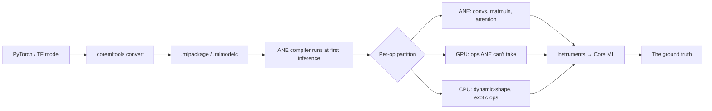

# Apple Neural Engine

<Mode is="learn">

In a managed-runtime cloud world, "the GPU runs my model" is a complete enough sentence. PyTorch dispatches to CUDA, CUDA dispatches to a tensor core, and you mostly just need to know that the tensor core exists. The runtime hides the silicon's idiosyncrasies; the docs tell you everything you need.

The <Term name="ane">Apple Neural Engine</Term> is the opposite case. It's the most-shipped NPU in human history — it lives on every iPhone since 2017 and every Apple Silicon Mac, around two billion devices in total — and Apple has never publicly documented its op set. What runs on the ANE is decided empirically: the Core ML compiler partitions your graph at first inference, and the only ground truth is what shows up in the Instruments profiler. **The Python is the SDK; the C++ Core ML compiler running on the user's device is the thing that decides where each op lands.**

So this lesson is the field guide. Not "what does the ANE do" in the abstract, but "what does the ANE *actually accept*, what makes it bail, and how do you read the trace that tells you which it did?"

## TL;DR

- The **Apple Neural Engine (ANE)** is a fixed-function NPU on every iPhone since A11 (2017) and every M-series Mac. 16-core in A17/M3 at ~35 TOPS (INT8); M4 bumps the same 16-core ANE to ~38 TOPS. Lives next to the CPU and GPU on the same SoC die. (When you see "100+ TOPS" in Apple marketing, that's the *full SoC* aggregate across CPU + GPU + ANE; the ANE silicon itself is ~38 TOPS.)
- Apple does **not document the ANE op set publicly.** What runs on ANE is determined empirically — Core ML's compiler decides, you observe via Instruments.
- ANE prefers: **convs, matmuls, FP16 attention, INT8 quantized weight-only, fixed-shape inputs**, and tensors with **fewer than 16K elements per dimension**. It rejects: dynamic shapes, exotic activations (gelu-fast variants), some attention layouts, large embedding tables.
- Models compiled with `compute_units=ALL` automatically partition between ANE / GPU / CPU. Use `compute_units=CPU_AND_NE` to force "ANE or fail" — the right setting for benchmarking.
- The **ANE profiler** (Xcode → Instruments → Core ML template) is the only ground truth. It shows per-op compute-unit assignment and timing. Anything else is guessing.

## Why this matters

The ANE is the most-shipped NPU in human history (~2 billion devices). Every iOS Intelligence feature, every on-device Core ML model, every iPhone camera "magic" runs on the ANE when it can. **If you ship anything on iOS, your model lands on the ANE or it doesn't — and the difference is 5–10× in performance per watt.**

But the ANE is also the worst-documented NPU. Apple's official guidance is "use Core ML and trust the compiler." For 80% of models that works. The remaining 20% — your model — needs you to know the actual rules.

## Mental model



Three things to internalize:

1. **The compiler decides at first inference**, not at convert time. A model that *looks* ANE-ready at conversion can still bail to GPU at runtime.
2. **Partitioning is per-op**. A 32-layer transformer might run 30 layers on ANE and 2 (with the layer-norm Apple doesn't like) on GPU. Total throughput = throughput of slowest-class section + transfer overhead.
3. **The ANE has its own SRAM** (~16 MB on M3-class). Tensors that don't fit get spilled to system memory through the ANE's narrow port — drastically slowing things down. This is the "16K element cap" gotcha.

## What the ANE actually is

The ANE is an array of fixed-function matrix-multiply-add tiles. Each tile does an INT8 or FP16 mac in one cycle. The hardware supports a small set of ops natively:

- Convolution (conv2d, depthwise conv, transposed conv)
- Matmul / dense
- Element-wise: add, multiply, ReLU, sigmoid, tanh
- Layer norm (sometimes — depends on dims)
- Softmax (sometimes)
- Attention (sometimes — see below)

Anything else: bail to GPU/CPU. This is why running "MobileNet" on ANE is trivial (all conv) but running "Llama" is finicky (the attention block has shape patterns that fall in and out of the supported set).

## The 16K-element cap

Each tensor dimension above ~16K elements forces ANE to split the op into multiple passes (re-tiling through SRAM). For LLM context that means:

- Sequence length 2048 with hidden dim 4096 = 8.4M elements per tensor. ANE handles fine via internal tiling.
- Sequence length 16384 with hidden dim 4096 = the seq dim crosses 16K — the attention's `seq×seq` score matrix becomes 16K×16K. ANE refuses or runs at a small fraction of peak.

For this reason, Llama-style long-context (over 4K) typically falls back to GPU on iPhone, even when the model "fits". This is **expected behavior** — don't chase it.

## Quantization for ANE

ANE prefers FP16 throughout. Apple's compiler can lower FP16 to ANE; FP32 won't go to ANE.

For weight-only quantization, the supported scheme is offline Python:

```python
import coremltools.optimize.coreml as cto
quantized_model = cto.linear_quantize_weights(
    mlmodel,
    config=cto.OptimizationConfig(
        global_config=cto.OpLinearQuantizerConfig(mode="linear_symmetric", weight_threshold=512)
    )
)
```

**Symmetric, per-tensor INT8 weight-only quantization** is the ANE-friendly default. The ANE dequantizes weights to FP16 on the fly. This gets you ~50% memory savings without losing ANE residency.

What does *not* work: per-channel quantization (ANE supports per-tensor only on most paths), INT4 weight quantization (unsupported as of Core ML 7), mixed-precision activation quantization (FP16 activations is the rule).

## Attention on ANE

The transformer attention block is the make-or-break for LLMs on ANE.

**What lands on ANE:**

- QKV projections (matmul → ANE).
- Scaled-dot-product with **fixed sequence length** — typically chunked to 256 or 512 token windows.
- The output projection (matmul → ANE).

**What bails to GPU:**

- Dynamic-length attention (variable sequence per call).
- Long-context attention (seq over 1024 token at d_model over 4096 → exceeds tile budget).
- Custom attention masks (some patterns).

The MLX team's iOS LLM examples typically chunk the <Term name="kv cache">KV cache</Term> into fixed-size windows specifically to keep attention on ANE. This is the LLM-specific ANE optimization.

## Profiling — the only source of truth

Open Xcode → Product → Profile (⌘I) → choose the "Core ML" template. Run your app on a real device. The trace shows:

- A timeline per compute unit (ANE / GPU / CPU).
- For each Core ML inference call, a per-op breakdown showing which unit each ran on.
- Power per unit.

This is the only way to know what actually ran on ANE. Documentation can't tell you because Apple's compiler decisions change between iOS versions.

## Reading the trace

Common patterns in Instruments:

| Pattern | Meaning | What to do |
|---|---|---|
| 100% ANE for the whole model | Ideal | Ship it |
| 95% ANE, 5% GPU spike at the layer norm | Layer norm fell back; usually fine | If model is fast enough, leave it |
| 70% ANE, 30% GPU alternating | Attention or some structural op bailing | Try chunking attention; check seq length |
| 0% ANE despite `compute_units=ALL` | Whole model rejected by ANE compiler | Re-check FP16 conversion; check for dynamic shapes |
| ANE active but throughput is low | Likely 16K-cap tiling overhead | Reduce hidden dim or sequence length |

## A typical conversion + verification flow

The conversion is offline Python (your dev machine). The verification is on-device, in Instruments.

```python
import torch
import coremltools as ct

# 1. Trace the model with sample inputs
model = MyModel()
example = torch.randn(1, 512, 768)
traced = torch.jit.trace(model, example)

# 2. Convert with FP16 (ANE precision)
mlmodel = ct.convert(
    traced,
    inputs=[ct.TensorType(shape=(1, 512, 768))],
    compute_precision=ct.precision.FLOAT16,
    compute_units=ct.ComputeUnit.CPU_AND_NE,  # force ANE or fail
    convert_to="mlprogram",
    minimum_deployment_target=ct.target.iOS17,
)

# 3. (Optional) INT8 weight-only quantization
import coremltools.optimize.coreml as cto
mlmodel = cto.linear_quantize_weights(
    mlmodel,
    config=cto.OptimizationConfig(
        global_config=cto.OpLinearQuantizerConfig(mode="linear_symmetric")
    ),
)
mlmodel.save("MyModel.mlpackage")
```

Then in your iOS app, run the model once, open Instruments, confirm ANE residency. **No model is "shipped to ANE" until you've seen it in Instruments.**

## When to use ANE vs GPU vs CPU

| Workload | Best target |
|---|---|
| MobileNet / EfficientNet / image classification | ANE — easy 100% residency |
| Whisper.cpp speech | GPU (Metal) — Whisper's attention falls outside ANE's friendly zone |
| Llama-3.2-1B / 3B chat | GPU (Metal via llama.cpp) — same reason |
| Stable Diffusion image gen | Mixed — UNet on ANE, decoder on GPU |
| Object detection (YOLO) | ANE for the backbone, CPU for NMS |
| Custom CNN | ANE almost always |

The general heuristic: **classic CNN-shaped workloads → ANE. Modern LLM-shaped workloads → GPU.** ANE is best on the workloads that defined "mobile ML" pre-2023; LLMs broke many of its assumptions.

## Run it in your browser

A useful demo: simulate the per-op partitioning decision the ANE compiler makes. Lets you see why some models hit 100% ANE and others hit 60%.

<RunInBrowser
  description="Sim the ANE partition decision tree. Most LLM transformers split GPU/ANE; CNN-shaped models hit 100% ANE."
  code={`# Simulate per-op compute-unit assignment.
def assign(op_name, op_kwargs):
    """Return (compute_unit, reason)."""
    name = op_name.lower()
    seq = op_kwargs.get("seq", 0)
    hidden = op_kwargs.get("hidden", 0)
    dynamic_shape = op_kwargs.get("dynamic", False)

    if dynamic_shape:
        return ("CPU", "ANE rejects dynamic shapes")
    if "conv" in name or "matmul" in name or "linear" in name:
        return ("ANE", "matmul-shaped: native ANE op")
    if "attention" in name and seq > 1024 and hidden > 4096:
        return ("GPU", "long-context attention exceeds ANE tile budget")
    if "attention" in name:
        return ("ANE", "fixed-length attention fits ANE")
    if name in ("relu", "sigmoid", "tanh", "softmax", "add", "mul"):
        return ("ANE", "elementwise: native ANE op")
    if "layernorm" in name or "rms_norm" in name:
        return ("ANE" if hidden in (768, 1024, 4096) else "GPU",
                "layernorm: ANE for power-of-2-friendly hidden dims")
    return ("CPU", "unsupported op")

# Llama-3.2-1B-Instruct decoder block, 16-token chunked attention
ops = [
    ("Linear", {"name": "q_proj"}),
    ("Linear", {"name": "k_proj"}),
    ("Linear", {"name": "v_proj"}),
    ("Attention", {"seq": 512, "hidden": 2048}),
    ("Linear", {"name": "o_proj"}),
    ("RMSNorm", {"hidden": 2048}),
    ("Linear", {"name": "gate_proj"}),
    ("Linear", {"name": "up_proj"}),
    ("Mul", {}),
    ("Linear", {"name": "down_proj"}),
]
print(f"Llama-3.2-1B (one decoder block):")
ane = gpu = cpu = 0
for op_name, kwargs in ops:
    unit, reason = assign(op_name, kwargs)
    print(f"  {op_name:<12} -> {unit:<3}  ({reason})")
    if unit == "ANE": ane += 1
    elif unit == "GPU": gpu += 1
    else: cpu += 1
print(f"\\n  Block summary: {ane} ANE / {gpu} GPU / {cpu} CPU")
print("  → Long-context (seq>1024) flips Attention to GPU and tanks ANE residency.")
`}
/>

The pattern is the answer to "why does my LLM's ANE residency drop when I bump max_context?" — attention crosses the cap.

## Quick check

<Quiz
  question="You convert a small CNN to Core ML with `compute_units=ALL`. Instruments shows 100% ANE. You convert the same CNN with one extra layer — a custom GELU variant from a recent paper. Now Instruments shows 0% ANE for the entire model. What's happening?"
  options={[
    "The custom GELU is too compute-heavy for ANE; lower the input resolution.",
    "Adding any unsupported op causes the ANE compiler to bail on the *whole* model partition because the cost of switching compute units mid-graph exceeds ANE's gain. Either replace the custom GELU with a supported activation, or accept the GPU fallback.",
    "Custom ops require a Metal Performance Shader implementation; supply a custom MPS kernel.",
    "ANE quantization mode changed because of the new op; force `compute_precision=FLOAT16` explicitly.",
  ]}
  answer={1}
  explanation="The ANE compiler doesn't always partition gracefully. Some scenarios cause it to fall back the entire model rather than mix compute units — particularly when the unsupported op is in the middle of a chain. The fix is either (a) replace the custom op with a standard one (the right call for GELU specifically — use the standard `gelu` not `gelu_fast` or a custom variant), or (b) accept the GPU fallback explicitly with `compute_units=CPU_AND_GPU`. Option a (compute) isn't the issue — same input. Option c (custom MPS) is for *Metal* extensions, not ANE — you can't write custom ANE kernels at all. Option d (precision) is unrelated."
/>

## Key takeaways

1. **The ANE is the most-shipped NPU on Earth** (~2 B devices) but its op set is undocumented; everything is empirical.
2. **`compute_units=CPU_AND_NE`** for benchmarking; `compute_units=ALL` for production. Always verify residency in Instruments.
3. **The 16K-element cap** breaks long-context attention; expect LLMs over 4K context to fall back to GPU. This is normal.
4. **FP16 throughout, INT8 weight-only via `linear_quantize_weights`, symmetric per-tensor** is the ANE-friendly quantization recipe.
5. **CNN-shaped workloads → ANE. LLM-shaped workloads → GPU.** The original 2017 ANE design predates the transformer era.
6. **One unsupported op can sink whole-model ANE residency** — be conservative with custom activations.

## Go deeper

<Resources
  items={[
    { kind: 'docs', href: 'https://developer.apple.com/documentation/coreml', title: 'Core ML Documentation', author: 'Apple', note: 'Official guidance — useful but deliberately abstract about ANE specifics. Read the "Performance" section.' },
    { kind: 'docs', href: 'https://apple.github.io/coremltools/docs-guides/source/optimizecoreml-api-overview.html', title: 'Core ML Tools — Optimization Guide', author: 'Apple', note: 'Quantization recipes specifically for ANE residency.' },
    { kind: 'blog', href: 'https://machinelearning.apple.com/research/neural-engine-transformers', title: 'Deploying Transformers on the Apple Neural Engine', author: 'Apple ML Research, 2022', note: 'Apple\'s own guide to making transformers ANE-friendly. Cited in every iOS LLM project.' },
    { kind: 'blog', href: 'https://github.com/apple/ml-ane-transformers', title: 'apple/ml-ane-transformers (reference impl)', author: 'Apple', note: 'The reference attention rewrite that maximizes ANE residency. Read the README + the attention diff.' },
    { kind: 'paper', href: 'https://arxiv.org/abs/2502.13546', title: 'iLLM: Efficient On-Device LLM Inference on Apple Neural Engine', author: 'Apple, 2025', note: 'Apple\'s recent paper on quantization and chunking to keep LLMs on ANE. The frontier reference for 2026.' },
    { kind: 'video', href: 'https://developer.apple.com/videos/play/wwdc2024/10160/', title: 'WWDC24 — Bring Your ML Model to Apple Silicon', author: 'Apple', note: 'The 2024 WWDC session — what\'s new in coremltools 7, the optimization workflow.' },
    { kind: 'docs', href: 'https://developer.apple.com/documentation/instruments/profiling-machine-learning-models', title: 'Profiling ML Models with Instruments', author: 'Apple', note: 'How to read the Core ML trace in Instruments — the only source of ground truth.' },
  ]}
/>

</Mode>

<Mode is="reference">

## TL;DR

- The **Apple Neural Engine (ANE)** is a fixed-function NPU on every iPhone since A11 (2017) and every M-series Mac. 16-core in A17/M3 at ~35 TOPS (INT8); M4 bumps the same 16-core ANE to ~38 TOPS. Lives next to the CPU and GPU on the same SoC die. (When you see "100+ TOPS" in Apple marketing, that's the *full SoC* aggregate across CPU + GPU + ANE; the ANE silicon itself is ~38 TOPS.)
- Apple does **not document the ANE op set publicly.** What runs on ANE is determined empirically — Core ML's compiler decides, you observe via Instruments.
- ANE prefers: **convs, matmuls, FP16 attention, INT8 quantized weight-only, fixed-shape inputs**, and tensors with **fewer than 16K elements per dimension**. It rejects: dynamic shapes, exotic activations (gelu-fast variants), some attention layouts, large embedding tables.
- Models compiled with `compute_units=ALL` automatically partition between ANE / GPU / CPU. Use `compute_units=CPU_AND_NE` to force "ANE or fail" — the right setting for benchmarking.
- The **ANE profiler** (Xcode → Instruments → Core ML template) is the only ground truth. It shows per-op compute-unit assignment and timing. Anything else is guessing.

## Why this matters

The ANE is the most-shipped NPU in human history (~2 billion devices). Every iOS Intelligence feature, every on-device Core ML model, every iPhone camera "magic" runs on the ANE when it can. **If you ship anything on iOS, your model lands on the ANE or it doesn't — and the difference is 5–10× in performance per watt.**

But the ANE is also the worst-documented NPU. Apple's official guidance is "use Core ML and trust the compiler." For 80% of models that works. The remaining 20% — your model — needs you to know the actual rules.

## Mental model


Three things to internalize:

1. **The compiler decides at first inference**, not at convert time. A model that *looks* ANE-ready at conversion can still bail to GPU at runtime.
2. **Partitioning is per-op**. A 32-layer transformer might run 30 layers on ANE and 2 (with the layer-norm Apple doesn't like) on GPU. Total throughput = throughput of slowest-class section + transfer overhead.
3. **The ANE has its own SRAM** (~16 MB on M3-class). Tensors that don't fit get spilled to system memory through the ANE's narrow port — drastically slowing things down. This is the "16K element cap" gotcha.

## Concrete walkthrough

### What the ANE actually is

The ANE is an array of fixed-function matrix-multiply-add tiles. Each tile does an INT8 or FP16 mac in one cycle. The hardware supports a small set of ops natively:

- Convolution (conv2d, depthwise conv, transposed conv)
- Matmul / dense
- Element-wise: add, multiply, ReLU, sigmoid, tanh
- Layer norm (sometimes — depends on dims)
- Softmax (sometimes)
- Attention (sometimes — see below)

Anything else: bail to GPU/CPU. This is why running "MobileNet" on ANE is trivial (all conv) but running "Llama" is finicky (the attention block has shape patterns that fall in and out of the supported set).

### The 16K-element cap

Each tensor dimension above ~16K elements forces ANE to split the op into multiple passes (re-tiling through SRAM). For LLM context that means:

- Sequence length 2048 with hidden dim 4096 = 8.4M elements per tensor. ANE handles fine via internal tiling.
- Sequence length 16384 with hidden dim 4096 = the seq dim crosses 16K — the attention's `seq×seq` score matrix becomes 16K×16K. ANE refuses or runs at a small fraction of peak.

For this reason, Llama-style long-context (over 4K) typically falls back to GPU on iPhone, even when the model "fits". This is **expected behavior** — don't chase it.

### Quantization for ANE

ANE prefers FP16 throughout. Apple's compiler can lower FP16 to ANE; FP32 won't go to ANE.

For weight-only quantization, the supported scheme is:

```python
import coremltools.optimize.coreml as cto
quantized_model = cto.linear_quantize_weights(
    mlmodel,
    config=cto.OptimizationConfig(
        global_config=cto.OpLinearQuantizerConfig(mode="linear_symmetric", weight_threshold=512)
    )
)
```

**Symmetric, per-tensor INT8 weight-only quantization** is the ANE-friendly default. The ANE dequantizes weights to FP16 on the fly. This gets you ~50% memory savings without losing ANE residency.

What does *not* work: per-channel quantization (ANE supports per-tensor only on most paths), INT4 weight quantization (unsupported as of Core ML 7), mixed-precision activation quantization (FP16 activations is the rule).

### Attention on ANE

The transformer attention block is the make-or-break for LLMs on ANE.

**What lands on ANE:**

- QKV projections (matmul → ANE).
- Scaled-dot-product with **fixed sequence length** — typically chunked to 256 or 512 token windows.
- The output projection (matmul → ANE).

**What bails to GPU:**

- Dynamic-length attention (variable sequence per call).
- Long-context attention (seq over 1024 token at d_model over 4096 → exceeds tile budget).
- Custom attention masks (some patterns).

The MLX team's iOS LLM examples typically chunk the KV cache into fixed-size windows specifically to keep attention on ANE. This is the LLM-specific ANE optimization.

### Profiling — the only source of truth

Open Xcode → Product → Profile (⌘I) → choose the "Core ML" template. Run your app on a real device. The trace shows:

- A timeline per compute unit (ANE / GPU / CPU).
- For each Core ML inference call, a per-op breakdown showing which unit each ran on.
- Power per unit.

This is the only way to know what actually ran on ANE. Documentation can't tell you because Apple's compiler decisions change between iOS versions.

### Reading the trace

Common patterns in Instruments:

| Pattern | Meaning | What to do |
|---|---|---|
| 100% ANE for the whole model | Ideal | Ship it |
| 95% ANE, 5% GPU spike at the layer norm | Layer norm fell back; usually fine | If model is fast enough, leave it |
| 70% ANE, 30% GPU alternating | Attention or some structural op bailing | Try chunking attention; check seq length |
| 0% ANE despite `compute_units=ALL` | Whole model rejected by ANE compiler | Re-check FP16 conversion; check for dynamic shapes |
| ANE active but throughput is low | Likely 16K-cap tiling overhead | Reduce hidden dim or sequence length |

### A typical conversion + verification flow

```python
import torch
import coremltools as ct

# 1. Trace the model with sample inputs
model = MyModel()
example = torch.randn(1, 512, 768)
traced = torch.jit.trace(model, example)

# 2. Convert with FP16 (ANE precision)
mlmodel = ct.convert(
    traced,
    inputs=[ct.TensorType(shape=(1, 512, 768))],
    compute_precision=ct.precision.FLOAT16,
    compute_units=ct.ComputeUnit.CPU_AND_NE,  # force ANE or fail
    convert_to="mlprogram",
    minimum_deployment_target=ct.target.iOS17,
)

# 3. (Optional) INT8 weight-only quantization
import coremltools.optimize.coreml as cto
mlmodel = cto.linear_quantize_weights(
    mlmodel,
    config=cto.OptimizationConfig(
        global_config=cto.OpLinearQuantizerConfig(mode="linear_symmetric")
    ),
)
mlmodel.save("MyModel.mlpackage")
```

Then in your iOS app, run the model once, open Instruments, confirm ANE residency. **No model is "shipped to ANE" until you've seen it in Instruments.**

### When to use ANE vs GPU vs CPU

| Workload | Best target |
|---|---|
| MobileNet / EfficientNet / image classification | ANE — easy 100% residency |
| Whisper.cpp speech | GPU (Metal) — Whisper's attention falls outside ANE's friendly zone |
| Llama-3.2-1B / 3B chat | GPU (Metal via llama.cpp) — same reason |
| Stable Diffusion image gen | Mixed — UNet on ANE, decoder on GPU |
| Object detection (YOLO) | ANE for the backbone, CPU for NMS |
| Custom CNN | ANE almost always |

The general heuristic: **classic CNN-shaped workloads → ANE. Modern LLM-shaped workloads → GPU.** ANE is best on the workloads that defined "mobile ML" pre-2023; LLMs broke many of its assumptions.

## Run it in your browser

A useful demo: simulate the per-op partitioning decision the ANE compiler makes. Lets you see why some models hit 100% ANE and others hit 60%.

<RunInBrowser
  description="Sim the ANE partition decision tree. Most LLM transformers split GPU/ANE; CNN-shaped models hit 100% ANE."
  code={`# Simulate per-op compute-unit assignment.
def assign(op_name, op_kwargs):
    """Return (compute_unit, reason)."""
    name = op_name.lower()
    seq = op_kwargs.get("seq", 0)
    hidden = op_kwargs.get("hidden", 0)
    dynamic_shape = op_kwargs.get("dynamic", False)

    if dynamic_shape:
        return ("CPU", "ANE rejects dynamic shapes")
    if "conv" in name or "matmul" in name or "linear" in name:
        return ("ANE", "matmul-shaped: native ANE op")
    if "attention" in name and seq > 1024 and hidden > 4096:
        return ("GPU", "long-context attention exceeds ANE tile budget")
    if "attention" in name:
        return ("ANE", "fixed-length attention fits ANE")
    if name in ("relu", "sigmoid", "tanh", "softmax", "add", "mul"):
        return ("ANE", "elementwise: native ANE op")
    if "layernorm" in name or "rms_norm" in name:
        return ("ANE" if hidden in (768, 1024, 4096) else "GPU",
                "layernorm: ANE for power-of-2-friendly hidden dims")
    return ("CPU", "unsupported op")

# Llama-3.2-1B-Instruct decoder block, 16-token chunked attention
ops = [
    ("Linear", {"name": "q_proj"}),
    ("Linear", {"name": "k_proj"}),
    ("Linear", {"name": "v_proj"}),
    ("Attention", {"seq": 512, "hidden": 2048}),
    ("Linear", {"name": "o_proj"}),
    ("RMSNorm", {"hidden": 2048}),
    ("Linear", {"name": "gate_proj"}),
    ("Linear", {"name": "up_proj"}),
    ("Mul", {}),
    ("Linear", {"name": "down_proj"}),
]
print(f"Llama-3.2-1B (one decoder block):")
ane = gpu = cpu = 0
for op_name, kwargs in ops:
    unit, reason = assign(op_name, kwargs)
    print(f"  {op_name:<12} -> {unit:<3}  ({reason})")
    if unit == "ANE": ane += 1
    elif unit == "GPU": gpu += 1
    else: cpu += 1
print(f"\\n  Block summary: {ane} ANE / {gpu} GPU / {cpu} CPU")
print("  → Long-context (seq>1024) flips Attention to GPU and tanks ANE residency.")
`}
/>

The pattern is the answer to "why does my LLM's ANE residency drop when I bump max_context?" — attention crosses the cap.

## Quick check

<Quiz
  question="You convert a small CNN to Core ML with `compute_units=ALL`. Instruments shows 100% ANE. You convert the same CNN with one extra layer — a custom GELU variant from a recent paper. Now Instruments shows 0% ANE for the entire model. What's happening?"
  options={[
    "The custom GELU is too compute-heavy for ANE; lower the input resolution.",
    "Adding any unsupported op causes the ANE compiler to bail on the *whole* model partition because the cost of switching compute units mid-graph exceeds ANE's gain. Either replace the custom GELU with a supported activation, or accept the GPU fallback.",
    "Custom ops require a Metal Performance Shader implementation; supply a custom MPS kernel.",
    "ANE quantization mode changed because of the new op; force `compute_precision=FLOAT16` explicitly.",
  ]}
  answer={1}
  explanation="The ANE compiler doesn't always partition gracefully. Some scenarios cause it to fall back the entire model rather than mix compute units — particularly when the unsupported op is in the middle of a chain. The fix is either (a) replace the custom op with a standard one (the right call for GELU specifically — use the standard `gelu` not `gelu_fast` or a custom variant), or (b) accept the GPU fallback explicitly with `compute_units=CPU_AND_GPU`. Option a (compute) isn't the issue — same input. Option c (custom MPS) is for *Metal* extensions, not ANE — you can't write custom ANE kernels at all. Option d (precision) is unrelated."
/>

## Key takeaways

1. **The ANE is the most-shipped NPU on Earth** (~2 B devices) but its op set is undocumented; everything is empirical.
2. **`compute_units=CPU_AND_NE`** for benchmarking; `compute_units=ALL` for production. Always verify residency in Instruments.
3. **The 16K-element cap** breaks long-context attention; expect LLMs over 4K context to fall back to GPU. This is normal.
4. **FP16 throughout, INT8 weight-only via `linear_quantize_weights`, symmetric per-tensor** is the ANE-friendly quantization recipe.
5. **CNN-shaped workloads → ANE. LLM-shaped workloads → GPU.** The original 2017 ANE design predates the transformer era.
6. **One unsupported op can sink whole-model ANE residency** — be conservative with custom activations.

## Go deeper

<Resources
  items={[
    { kind: 'docs', href: 'https://developer.apple.com/documentation/coreml', title: 'Core ML Documentation', author: 'Apple', note: 'Official guidance — useful but deliberately abstract about ANE specifics. Read the "Performance" section.' },
    { kind: 'docs', href: 'https://apple.github.io/coremltools/docs-guides/source/optimizecoreml-api-overview.html', title: 'Core ML Tools — Optimization Guide', author: 'Apple', note: 'Quantization recipes specifically for ANE residency.' },
    { kind: 'blog', href: 'https://machinelearning.apple.com/research/neural-engine-transformers', title: 'Deploying Transformers on the Apple Neural Engine', author: 'Apple ML Research, 2022', note: 'Apple\'s own guide to making transformers ANE-friendly. Cited in every iOS LLM project.' },
    { kind: 'blog', href: 'https://github.com/apple/ml-ane-transformers', title: 'apple/ml-ane-transformers (reference impl)', author: 'Apple', note: 'The reference attention rewrite that maximizes ANE residency. Read the README + the attention diff.' },
    { kind: 'paper', href: 'https://arxiv.org/abs/2502.13546', title: 'iLLM: Efficient On-Device LLM Inference on Apple Neural Engine', author: 'Apple, 2025', note: 'Apple\'s recent paper on quantization and chunking to keep LLMs on ANE. The frontier reference for 2026.' },
    { kind: 'video', href: 'https://developer.apple.com/videos/play/wwdc2024/10160/', title: 'WWDC24 — Bring Your ML Model to Apple Silicon', author: 'Apple', note: 'The 2024 WWDC session — what\'s new in coremltools 7, the optimization workflow.' },
    { kind: 'docs', href: 'https://developer.apple.com/documentation/instruments/profiling-machine-learning-models', title: 'Profiling ML Models with Instruments', author: 'Apple', note: 'How to read the Core ML trace in Instruments — the only source of ground truth.' },
  ]}
/>

</Mode>

<LessonComplete />
