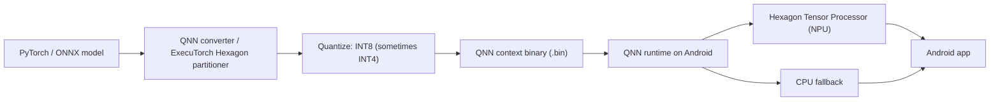

# Qualcomm Hexagon

<Mode is="learn">

> **Prereqs:** [Core ML & ANE](../on-device/coreml) (analogue), [INT4 / AWQ / GPTQ](../../ml-execution/quantization/int4-and-awq). Hexagon is the Android-side parallel to Apple's ANE.

Apple's <Term name="ane">ANE</Term> gets the press because Apple controls the entire stack — silicon, OS, framework, App Store — and ships it in a fully integrated bundle. Qualcomm's Hexagon ships in *more devices*: every flagship Android phone, the Meta Quest 3 / 3S, ARM Windows laptops with Snapdragon X, and a long tail of robots and IoT. **Outside iOS, NPU usually means Hexagon.**

The programming model is also less polished. There is no Apple-style "trust the compiler"; you write Python conversion scripts, run a Qualcomm-shipped C/C++ converter, and ship a context binary that the device's QNN runtime executes. The Python is the dev-machine SDK; what runs on the device is Hexagon machine code generated by Qualcomm's compiler. **Python is the SDK; HVX (Hexagon Vector Extensions) is what actually runs on the silicon.**

The other contrast worth holding in your head: where the ANE prefers FP16 with weight-only INT8 dequantization, Hexagon's fast path is INT8 native — sometimes INT4 — with FP16 as the slower fallback. So <Term name="quantization">quantization</Term>-aware training matters more on Snapdragon than on Apple silicon. That single difference shapes every production recipe in this lesson.

## TL;DR

- **Hexagon** is Qualcomm's DSP / NPU lineage. Every Snapdragon (and many Qualcomm IoT chips) ships with a Hexagon Tensor Processor (HTP). On Snapdragon 8 Gen 3 / 8 Gen 4: ~45 TOPS at INT8.
- The programming model is **QNN — Qualcomm Neural Network SDK**. Models lower to a Hexagon-specific binary (`.bin`) executed by the QNN runtime on Android.
- **INT8 is the bread and butter; INT4 is supported on the latest generations.** FP16 works but is generally slower than INT8 on this NPU. Quantization-aware training (QAT) is more important here than on Apple silicon.
- Frameworks plug in as **delegates**: <Term name="executorch">ExecuTorch</Term> ships a Hexagon delegate; ONNX Runtime + QNN execution provider is widely used; TFLite has Hexagon support since 2019.
- Snapdragon-shipped phones cover ~80% of high-end Android in 2026. Knowing Hexagon is the price of "ship LLMs to Android" outside the iPhone bubble.

## Why this matters

Apple's ANE is famous because Apple controls the stack and ships it. Qualcomm's Hexagon ships in *more devices*: every flagship Android phone, the Meta Quest 3 / 3S, many ARM laptops (Snapdragon X Elite), and a long tail of robots and IoT. **Outside iOS, NPU = Hexagon for most production-deployed AI**. If you're shipping to Android phones, Quest, or anything Snapdragon-based, this is the stack.

## Mental model



Same shape as Core ML: convert, quantize, partition, ship a runtime that dispatches to NPU + CPU.

## What's in a Hexagon HTP

The Hexagon Tensor Processor in Snapdragon 8 Gen 4 (2024) and similar:

| Property                   | Value                              |
|----------------------------|--------------------------------------|
| Peak INT8 throughput       | ~45 TOPS                             |
| Peak INT4 throughput       | ~70 TOPS (newer generations)         |
| Peak FP16 throughput       | ~10 TFLOPs                           |
| On-chip memory (TCM)       | 8–32 MB (varies by SKU)              |
| Memory bandwidth (LPDDR5x) | ~70 GB/s                             |
| Power envelope             | ~1–4 W sustained                     |

Compared to Apple's ANE on M3: similar TOPS at INT8, slightly less at FP16. Compared to a desktop GPU: 100× less power, 10× less throughput. Compared to the CPU on the same chip: 5–10× faster on quantized matmul.

## The QNN SDK

Qualcomm's Neural Network SDK is the C/C++ library + tools for building Hexagon-targeted models. The CLI flow:

```bash
# 1. Convert from your source framework
qnn-onnx-converter --input_network=model.onnx \
                    --quantization_overrides=quant.json \
                    --output_path=model.cpp

# 2. Generate a context binary for the target Hexagon DSP
qnn-context-binary-generator --backend=libQnnHtp.so \
                              --model=libModel.so \
                              --output_dir=./output \
                              --binary_file=model_ctx

# 3. On the Android device, load and run via QNN runtime
```

The **context binary** is the deployable. It's a Hexagon-specific blob containing the compiled graph, weights, and runtime metadata. Targeted at a specific HTP architecture (HTP v68, v73, etc.).

## Quantization is mandatory for the NPU path

Hexagon's INT8 path is the fast path. FP16 works but at meaningfully lower throughput. INT4 is supported on Snapdragon 8 Gen 3+ but with stricter constraints (specific block sizes, particular activation distributions).

This makes **QAT (quantization-aware training) more important on Hexagon** than on ANE — the ANE's palettized FP16 path tolerates weight-only post-training quantization; Hexagon often wants the model to have been *trained* with INT8 quant in mind for best results on hard-to-quantize models.

QNN ships its own quantizer (in the converter pipeline) plus integrates with PyTorch's PT2E quantizer. The recipe a typical Snapdragon team uses:

1. Convert PyTorch → ONNX or torch.export.
2. Run QNN's quantizer with calibration data.
3. Profile via `qnn-profile-viewer`. Check for ops falling back to CPU.
4. Iterate: rewrite incompatible ops, add custom INT8 implementations, etc.

## Frameworks that target Hexagon

- **ExecuTorch + Hexagon delegate**: PyTorch-native; ships Llama-3.2-1B / 3B recipes. Most modern path; integrates with PT2E.
- **ONNX Runtime + QNN EP**: widely used; broad framework compatibility.
- **TFLite + Hexagon delegate**: classic path, mature, used in many production Android apps.
- **MediaPipe**: Google's mobile-AI framework; uses TFLite + Hexagon under the hood.
- **Qualcomm AI Hub (qai-hub)**: Qualcomm's own service for compile-once-run-on-Hexagon; useful for prototyping.

For a 2026 PyTorch team shipping to Android: **ExecuTorch + Hexagon** is the standard path.

## Real-world Hexagon LLM recipe

Llama-3.2-3B on Snapdragon 8 Gen 3:

| Stage                          | Configuration                              | Result                  |
|--------------------------------|---------------------------------------------|--------------------------|
| Convert from PyTorch           | torch.export → ExecuTorch                   | EXIR graph               |
| Quantize                       | INT4 weights + INT8 activations via PT2E    | ~1.6 GB                  |
| Partition                      | HexagonPartitioner first, XNNPACK fallback  | ~80% on HTP, 20% on CPU  |
| Compile                        | ExecuTorch → .pte with Hexagon binaries     | single deployable        |
| Runtime on Pixel 8 / S24       | Stream tokens via Android Java API          | ~12–18 tok/s steady-state |

These numbers will shift with new Snapdragon generations and ExecuTorch releases; check the qai-hub model zoo for up-to-date recipes per chip.

## Custom ops and the long tail

Anything the QNN converter can't recognize gets stuck. Common failure modes:

- **Custom attention variants** that don't match QNN's pattern matchers.
- **Dynamic shapes** beyond what QNN handles (it prefers static).
- **FP32 ops in the middle of a quantized graph** — forces a roundtrip that often falls to CPU.
- **Unsupported activations** (less common in 2026 but historically common; modern QNN handles GELU, SwiGLU, etc.).

The escape hatch: write a **custom op** in Hexagon C / HVX intrinsics (HVX = Hexagon Vector Extensions, the SIMD ISA). This is a real engineering investment — Hexagon kernel work is closer to writing CUDA than writing Python — but it's how teams hit production-grade perf on novel architectures.

```c
// Sketch of an HVX intrinsic kernel — INT8 matmul tile.
// hvx.h provides Q6/HVX intrinsics; types like HVX_Vector are 1024-bit vectors.
#include <hexagon_protos.h>

void hvx_int8_gemm_tile(const int8_t* A, const int8_t* B, int32_t* C,
                         int M, int N, int K) {
  for (int m = 0; m < M; m++) {
    for (int n = 0; n < N; n += 128) {       // 128 INT8 lanes per HVX vector
      HVX_Vector acc = Q6_V_vzero();
      for (int k = 0; k < K; k += 4) {
        HVX_Vector va = *(HVX_Vector*)(A + m*K + k);
        HVX_Vector vb = *(HVX_Vector*)(B + k*N + n);
        // vrmpyacc accumulates 4-element INT8 dot-products into INT32 lanes.
        acc = Q6_Vw_vrmpyacc_VwVbVb(acc, va, vb);
      }
      *(HVX_Vector*)(C + m*N + n) = acc;
    }
  }
}
```

That's what the bottom of the Hexagon stack looks like — closer to writing CUDA than to writing Python.

## What's coming

Snapdragon X Elite (2024) brings Hexagon NPU to Windows ARM laptops. Snapdragon 8 Gen 5 (2025) adds wider INT4 paths and improved memory hierarchies. Qualcomm's roadmap explicitly targets *on-device LLM* as a primary workload — every generation ships more transformer-friendly hardware.

For 2026 production: ExecuTorch + Hexagon delegate is the right path; the underlying runtime is converging fast.

## Run it in your browser — Hexagon op-coverage simulator

<RunInBrowser
  description="Decide which ops fall to NPU vs CPU; compute the resulting throughput."
  code={`# An LLM forward pass, simplified to op classes.
# Each op: (name, supported_on_npu, op_cost_in_GFLOPs)
graph = [
    ('embedding_lookup', False, 0.5),    # gather — usually CPU
    ('rmsnorm',          True,  0.1),
    ('q_proj',           True,  20.0),
    ('k_proj',           True,  5.0),
    ('v_proj',           True,  5.0),
    ('rope',             True,  0.2),
    ('attention',        True,  10.0),    # static-cache supported on modern HTP
    ('attn_out',         True,  20.0),
    ('rmsnorm2',         True,  0.1),
    ('ffn_up',           True,  60.0),
    ('ffn_act',          True,  0.5),
    ('ffn_down',         True,  60.0),
    ('logit_proj',       True,  20.0),
    ('sampling',         False, 0.5),     # custom logic — CPU
]

NPU_TFLOPS = 45     # INT8 TOPS, treat as int-quant-equivalent FLOPs
CPU_TFLOPS = 0.05   # rough single-socket CPU throughput

cpu_only_time = sum(c / CPU_TFLOPS for _, _, c in graph)
mixed_time = sum(c / NPU_TFLOPS if npu else c / CPU_TFLOPS for _, npu, c in graph)

# Account for switch cost (NPU↔CPU) — ~0.5 ms each
last = None
switches = 0
for _, npu, _ in graph:
    if last is not None and npu != last: switches += 1
    last = npu
switch_cost_ms = switches * 0.5

print(f"all-CPU time:    {cpu_only_time:>6.2f} ms")
print(f"NPU-where-able:  {mixed_time:>6.2f} ms (compute) + {switch_cost_ms} ms (switches)")
print(f"effective speedup: {cpu_only_time / (mixed_time + switch_cost_ms):.1f}x")
print()
print("Rule of thumb: NPU is 5-15x faster than CPU on quantized matmul.")
print("Two CPU-fallback ops (embedding, sampling) bracket the graph and are fine.")
print("If a fallback lands in the middle of a chain, switch costs erode the win.")
`}
/>

The output shape — most heavy ops on NPU, embedding and sampling on CPU, with a small switch tax — is what a healthy Hexagon-deployed LLM looks like. ~10× speedup over CPU is typical.

## Quick check

<FillIn
  prompt="Qualcomm's SDK for compiling models to the Hexagon NPU:"
  answer="QNN"
  accept={["Qualcomm Neural Network SDK", "qnn", "QNN SDK"]}
  hint="Three-letter abbreviation."
  explanation="QNN = Qualcomm Neural Network SDK. The C/C++ library + converter tools that take ONNX / PyTorch graphs and emit Hexagon-targeted context binaries."
/>

<Quiz
  question="A team is shipping Llama-3.2-3B to Android via Snapdragon. Their PT2E-quantized model is mostly running on CPU instead of the NPU. The most likely cause:"
  options={[
    'Their model is too large for Hexagon.',
    'Their attention pattern doesn\'t match QNN\'s recognizers — patterns like sliding-window or unusual masking force fallback.',
    'Snapdragon 8 Gen 3 doesn\'t support INT4.',
    'Hexagon doesn\'t support transformers.',
  ]}
  answer={1}
  explanation="QNN\'s pattern matchers are the gatekeeper. If your attention uses a non-standard mask or KV cache layout, the converter doesn\'t recognize it and the subgraph falls to CPU. Fix: rewrite to use the standard static-cache attention pattern, or write a custom Hexagon op for the variant. Snapdragon 8 Gen 3 supports INT4 fine; transformer support is mature."
/>

## Key takeaways

1. **Hexagon = Qualcomm's NPU**, in every Snapdragon chip and ARM laptop. ~45 TOPS INT8 on flagship.
2. **QNN is the SDK; HTP is the silicon; .bin is the deployable.**
3. **INT8 is the fast path; INT4 supported on latest gen.** FP16 works but slower. QAT helps more here than on Apple silicon.
4. **ExecuTorch + Hexagon delegate** is the modern PyTorch path. ONNX Runtime + QNN EP is the broad-framework alternative.
5. **Fallback patterns matter.** A custom attention or sampling op forces NPU↔CPU switches that erode the speedup.

## Go deeper

<Resources
  items={[
    { kind: 'docs', href: 'https://docs.qualcomm.com/bundle/publicresource/topics/80-63442-50/overview.html', title: 'Qualcomm Neural Network SDK Documentation', note: 'Authoritative. The "Quantization" + "Converter" sections cover the production pipeline.' },
    { kind: 'docs', href: 'https://aihub.qualcomm.com/', title: 'Qualcomm AI Hub', note: 'Pre-compiled model recipes for every Snapdragon variant. The fastest way to see what works.' },
    { kind: 'docs', href: 'https://pytorch.org/executorch/stable/backends-qualcomm.html', title: 'ExecuTorch — Qualcomm Backend', note: 'PyTorch-side path: the partitioner, the build flow, the supported ops list.' },
    { kind: 'blog', href: 'https://www.qualcomm.com/news/onq/2024/02/the-future-of-ai-is-hybrid-with-on-device-genai', title: 'Qualcomm — On-Device GenAI Hybrid', note: 'Vendor-side framing of the on-device + cloud split. Useful for product context.' },
    { kind: 'paper', href: 'https://arxiv.org/abs/2406.06282', title: 'Hexagon Vector Extensions: Architecture and Compiler', author: 'Qualcomm research', note: 'For deep custom-kernel work — the HVX ISA reference.' },
    { kind: 'repo', href: 'https://github.com/quic/ai-hub-models', title: 'quic/ai-hub-models', note: 'Qualcomm\'s reference model collection with end-to-end Hexagon recipes. Llama, Whisper, Stable Diffusion, etc.' },
    { kind: 'repo', href: 'https://github.com/pytorch/executorch/tree/main/backends/qualcomm', title: 'pytorch/executorch — backends/qualcomm', note: 'The Hexagon delegate source. Read the partitioner to see which patterns get matched.' },
  ]}
/>

</Mode>

<Mode is="reference">

> **Prereqs:** [Core ML & ANE](../on-device/coreml) (analogue), [INT4 / AWQ / GPTQ](../../ml-execution/quantization/int4-and-awq). Hexagon is the Android-side parallel to Apple's ANE.

## TL;DR

- **Hexagon** is Qualcomm's DSP / NPU lineage. Every Snapdragon (and many Qualcomm IoT chips) ships with a Hexagon Tensor Processor (HTP). On Snapdragon 8 Gen 3 / 8 Gen 4: ~45 TOPS at INT8.
- The programming model is **QNN — Qualcomm Neural Network SDK**. Models lower to a Hexagon-specific binary (`.bin`) executed by the QNN runtime on Android.
- **INT8 is the bread and butter; INT4 is supported on the latest generations.** FP16 works but is generally slower than INT8 on this NPU. Quantization-aware training (QAT) is more important here than on Apple silicon.
- Frameworks plug in as **delegates**: ExecuTorch ships a Hexagon delegate; ONNX Runtime + QNN execution provider is widely used; TFLite has Hexagon support since 2019.
- Snapdragon-shipped phones cover ~80% of high-end Android in 2026. Knowing Hexagon is the price of "ship LLMs to Android" outside the iPhone bubble.

## Why this matters

Apple's ANE is famous because Apple controls the stack and ships it. Qualcomm's Hexagon ships in *more devices*: every flagship Android phone, the Meta Quest 3 / 3S, many ARM laptops (Snapdragon X Elite), and a long tail of robots and IoT. **Outside iOS, NPU = Hexagon for most production-deployed AI**. If you're shipping to Android phones, Quest, or anything Snapdragon-based, this is the stack.

## Mental model


Same shape as Core ML: convert, quantize, partition, ship a runtime that dispatches to NPU + CPU.

## Concrete walkthrough

### What's in a Hexagon HTP

The Hexagon Tensor Processor in Snapdragon 8 Gen 4 (2024) and similar:

| Property                   | Value                              |
|----------------------------|--------------------------------------|
| Peak INT8 throughput       | ~45 TOPS                             |
| Peak INT4 throughput       | ~70 TOPS (newer generations)         |
| Peak FP16 throughput       | ~10 TFLOPs                           |
| On-chip memory (TCM)       | 8–32 MB (varies by SKU)              |
| Memory bandwidth (LPDDR5x) | ~70 GB/s                             |
| Power envelope             | ~1–4 W sustained                     |

Compared to Apple's ANE on M3: similar TOPS at INT8, slightly less at FP16. Compared to a desktop GPU: 100× less power, 10× less throughput. Compared to the CPU on the same chip: 5–10× faster on quantized matmul.

### The QNN SDK

Qualcomm's Neural Network SDK is the C/C++ library + tools for building Hexagon-targeted models. The flow:

```bash
# 1. Convert from your source framework
qnn-onnx-converter --input_network=model.onnx \
                    --quantization_overrides=quant.json \
                    --output_path=model.cpp

# 2. Generate a context binary for the target Hexagon DSP
qnn-context-binary-generator --backend=libQnnHtp.so \
                              --model=libModel.so \
                              --output_dir=./output \
                              --binary_file=model_ctx

# 3. On the Android device, load and run via QNN runtime
```

The **context binary** is the deployable. It's a Hexagon-specific blob containing the compiled graph, weights, and runtime metadata. Targeted at a specific HTP architecture (HTP v68, v73, etc.).

### Quantization is mandatory for the NPU path

Hexagon's INT8 path is the fast path. FP16 works but at meaningfully lower throughput. INT4 is supported on Snapdragon 8 Gen 3+ but with stricter constraints (specific block sizes, particular activation distributions).

This makes **QAT (quantization-aware training) more important on Hexagon** than on ANE — the ANE's palettized FP16 path tolerates weight-only post-training quantization; Hexagon often wants the model to have been *trained* with INT8 quant in mind for best results on hard-to-quantize models.

QNN ships its own quantizer (in the converter pipeline) plus integrates with PyTorch's PT2E quantizer. The recipe a typical Snapdragon team uses:

1. Convert PyTorch → ONNX or torch.export.
2. Run QNN's quantizer with calibration data.
3. Profile via `qnn-profile-viewer`. Check for ops falling back to CPU.
4. Iterate: rewrite incompatible ops, add custom INT8 implementations, etc.

### Frameworks that target Hexagon

- **ExecuTorch + Hexagon delegate**: PyTorch-native; ships Llama-3.2-1B / 3B recipes. Most modern path; integrates with PT2E.
- **ONNX Runtime + QNN EP**: widely used; broad framework compatibility.
- **TFLite + Hexagon delegate**: classic path, mature, used in many production Android apps.
- **MediaPipe**: Google's mobile-AI framework; uses TFLite + Hexagon under the hood.
- **Qualcomm AI Hub (qai-hub)**: Qualcomm's own service for compile-once-run-on-Hexagon; useful for prototyping.

For a 2026 PyTorch team shipping to Android: **ExecuTorch + Hexagon** is the standard path.

### Real-world Hexagon LLM recipe

Llama-3.2-3B on Snapdragon 8 Gen 3:

| Stage                          | Configuration                              | Result                  |
|--------------------------------|---------------------------------------------|--------------------------|
| Convert from PyTorch           | torch.export → ExecuTorch                   | EXIR graph               |
| Quantize                       | INT4 weights + INT8 activations via PT2E    | ~1.6 GB                  |
| Partition                      | HexagonPartitioner first, XNNPACK fallback  | ~80% on HTP, 20% on CPU  |
| Compile                        | ExecuTorch → .pte with Hexagon binaries     | single deployable        |
| Runtime on Pixel 8 / S24       | Stream tokens via Android Java API          | ~12–18 tok/s steady-state |

These numbers will shift with new Snapdragon generations and ExecuTorch releases; check the qai-hub model zoo for up-to-date recipes per chip.

### Custom ops and the long tail

Anything the QNN converter can't recognize gets stuck. Common failure modes:

- **Custom attention variants** that don't match QNN's pattern matchers.
- **Dynamic shapes** beyond what QNN handles (it prefers static).
- **FP32 ops in the middle of a quantized graph** — forces a roundtrip that often falls to CPU.
- **Unsupported activations** (less common in 2026 but historically common; modern QNN handles GELU, SwiGLU, etc.).

The escape hatch: write a **custom op** in Hexagon C / HVX intrinsics (HVX = Hexagon Vector Extensions, the SIMD ISA). This is a real engineering investment — Hexagon kernel work is closer to writing CUDA than writing Python — but it's how teams hit production-grade perf on novel architectures.

### What's coming

Snapdragon X Elite (2024) brings Hexagon NPU to Windows ARM laptops. Snapdragon 8 Gen 5 (2025) adds wider INT4 paths and improved memory hierarchies. Qualcomm's roadmap explicitly targets *on-device LLM* as a primary workload — every generation ships more transformer-friendly hardware.

For 2026 production: ExecuTorch + Hexagon delegate is the right path; the underlying runtime is converging fast.

## Run it in your browser — Hexagon op-coverage simulator

<RunInBrowser
  description="Decide which ops fall to NPU vs CPU; compute the resulting throughput."
  code={`# An LLM forward pass, simplified to op classes.
# Each op: (name, supported_on_npu, op_cost_in_GFLOPs)
graph = [
    ('embedding_lookup', False, 0.5),    # gather — usually CPU
    ('rmsnorm',          True,  0.1),
    ('q_proj',           True,  20.0),
    ('k_proj',           True,  5.0),
    ('v_proj',           True,  5.0),
    ('rope',             True,  0.2),
    ('attention',        True,  10.0),    # static-cache supported on modern HTP
    ('attn_out',         True,  20.0),
    ('rmsnorm2',         True,  0.1),
    ('ffn_up',           True,  60.0),
    ('ffn_act',          True,  0.5),
    ('ffn_down',         True,  60.0),
    ('logit_proj',       True,  20.0),
    ('sampling',         False, 0.5),     # custom logic — CPU
]

NPU_TFLOPS = 45     # INT8 TOPS, treat as int-quant-equivalent FLOPs
CPU_TFLOPS = 0.05   # rough single-socket CPU throughput

cpu_only_time = sum(c / CPU_TFLOPS for _, _, c in graph)
mixed_time = sum(c / NPU_TFLOPS if npu else c / CPU_TFLOPS for _, npu, c in graph)

# Account for switch cost (NPU↔CPU) — ~0.5 ms each
last = None
switches = 0
for _, npu, _ in graph:
    if last is not None and npu != last: switches += 1
    last = npu
switch_cost_ms = switches * 0.5

print(f"all-CPU time:    {cpu_only_time:>6.2f} ms")
print(f"NPU-where-able:  {mixed_time:>6.2f} ms (compute) + {switch_cost_ms} ms (switches)")
print(f"effective speedup: {cpu_only_time / (mixed_time + switch_cost_ms):.1f}x")
print()
print("Rule of thumb: NPU is 5-15x faster than CPU on quantized matmul.")
print("Two CPU-fallback ops (embedding, sampling) bracket the graph and are fine.")
print("If a fallback lands in the middle of a chain, switch costs erode the win.")
`}
/>

The output shape — most heavy ops on NPU, embedding and sampling on CPU, with a small switch tax — is what a healthy Hexagon-deployed LLM looks like. ~10× speedup over CPU is typical.

## Quick check

<FillIn
  prompt="Qualcomm's SDK for compiling models to the Hexagon NPU:"
  answer="QNN"
  accept={["Qualcomm Neural Network SDK", "qnn", "QNN SDK"]}
  hint="Three-letter abbreviation."
  explanation="QNN = Qualcomm Neural Network SDK. The C/C++ library + converter tools that take ONNX / PyTorch graphs and emit Hexagon-targeted context binaries."
/>

<Quiz
  question="A team is shipping Llama-3.2-3B to Android via Snapdragon. Their PT2E-quantized model is mostly running on CPU instead of the NPU. The most likely cause:"
  options={[
    'Their model is too large for Hexagon.',
    'Their attention pattern doesn\'t match QNN\'s recognizers — patterns like sliding-window or unusual masking force fallback.',
    'Snapdragon 8 Gen 3 doesn\'t support INT4.',
    'Hexagon doesn\'t support transformers.',
  ]}
  answer={1}
  explanation="QNN\'s pattern matchers are the gatekeeper. If your attention uses a non-standard mask or KV cache layout, the converter doesn\'t recognize it and the subgraph falls to CPU. Fix: rewrite to use the standard static-cache attention pattern, or write a custom Hexagon op for the variant. Snapdragon 8 Gen 3 supports INT4 fine; transformer support is mature."
/>

## Key takeaways

1. **Hexagon = Qualcomm's NPU**, in every Snapdragon chip and ARM laptop. ~45 TOPS INT8 on flagship.
2. **QNN is the SDK; HTP is the silicon; .bin is the deployable.**
3. **INT8 is the fast path; INT4 supported on latest gen.** FP16 works but slower. QAT helps more here than on Apple silicon.
4. **ExecuTorch + Hexagon delegate** is the modern PyTorch path. ONNX Runtime + QNN EP is the broad-framework alternative.
5. **Fallback patterns matter.** A custom attention or sampling op forces NPU↔CPU switches that erode the speedup.

## Go deeper

<Resources
  items={[
    { kind: 'docs', href: 'https://docs.qualcomm.com/bundle/publicresource/topics/80-63442-50/overview.html', title: 'Qualcomm Neural Network SDK Documentation', note: 'Authoritative. The "Quantization" + "Converter" sections cover the production pipeline.' },
    { kind: 'docs', href: 'https://aihub.qualcomm.com/', title: 'Qualcomm AI Hub', note: 'Pre-compiled model recipes for every Snapdragon variant. The fastest way to see what works.' },
    { kind: 'docs', href: 'https://pytorch.org/executorch/stable/backends-qualcomm.html', title: 'ExecuTorch — Qualcomm Backend', note: 'PyTorch-side path: the partitioner, the build flow, the supported ops list.' },
    { kind: 'blog', href: 'https://www.qualcomm.com/news/onq/2024/02/the-future-of-ai-is-hybrid-with-on-device-genai', title: 'Qualcomm — On-Device GenAI Hybrid', note: 'Vendor-side framing of the on-device + cloud split. Useful for product context.' },
    { kind: 'paper', href: 'https://arxiv.org/abs/2406.06282', title: 'Hexagon Vector Extensions: Architecture and Compiler', author: 'Qualcomm research', note: 'For deep custom-kernel work — the HVX ISA reference.' },
    { kind: 'repo', href: 'https://github.com/quic/ai-hub-models', title: 'quic/ai-hub-models', note: 'Qualcomm\'s reference model collection with end-to-end Hexagon recipes. Llama, Whisper, Stable Diffusion, etc.' },
    { kind: 'repo', href: 'https://github.com/pytorch/executorch/tree/main/backends/qualcomm', title: 'pytorch/executorch — backends/qualcomm', note: 'The Hexagon delegate source. Read the partitioner to see which patterns get matched.' },
  ]}
/>

</Mode>

<LessonComplete />
