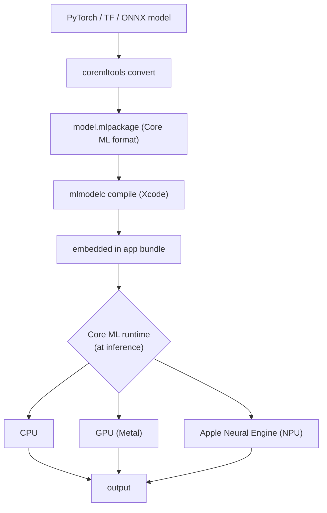

# Core ML & ANE

> **Prereqs:** [llama.cpp Internals](./llama-cpp-internals), [ExecuTorch](./executorch). This lesson is the Apple-specific deep dive.

## TL;DR

- **Core ML** is Apple's on-device ML framework. Models are `.mlpackage` (the modern format, replaces `.mlmodel`). Run on CPU, GPU (via Metal), or **Apple Neural Engine** (ANE) — Apple's NPU. The framework dispatches per-op based on what the chosen compute unit can do.
- The **Apple Neural Engine** is the silicon that Apple's iOS Intelligence runs on. ~38 TOPS on A17/M3, ~100+ TOPS on M4. Privacy-preserving (on-device, never the cloud). **Heavily optimized for transformer inference** in M3/M4 generation.
- **`coremltools`** is the conversion toolkit: PyTorch / TensorFlow / ONNX → `.mlpackage`. The 2024+ version supports `torch.export`-shaped graphs and palettized (LUT-quantized) weights.
- **MLX** is Apple's research-grade framework — like PyTorch but Apple-native, lazy-evaluated, runs on Apple silicon's unified memory. Used for training and prototyping; deploy via Core ML for production.
- For 2026 iOS apps: Core ML is the path when you need ANE; ExecuTorch (with Core ML delegate) is the path when authoring fluency wins; llama.cpp is the path when binary size and ANE-independence matter.

## Why this matters

Apple ships AI to >2 billion devices. iOS Intelligence (rolled out 2024–2025) runs entirely on Core ML + ANE for the on-device portion. Every iOS app that wants to run a model with the lowest power and the least visible thermal cost goes through this stack. **Knowing Core ML is non-optional for iOS-mobile-AI work**, and the ANE programming model — the constraints, the tooling, what it accelerates — is something the rest of the industry doesn't generalize from.

## Mental model



The conversion is offline; the dispatch is per-op at runtime; the developer's lever is the **compute unit selection** (`.cpuOnly`, `.cpuAndGPU`, `.all`).

## Concrete walkthrough

### Convert a PyTorch model

```python
import torch
import coremltools as ct

class M(torch.nn.Module):
    def __init__(self):
        super().__init__()
        self.linear = torch.nn.Linear(768, 768)
    def forward(self, x):
        return torch.relu(self.linear(x))

m = M().eval()
example_input = torch.randn(1, 768)
traced = torch.jit.trace(m, example_input)        # or torch.export for newer flow

mlmodel = ct.convert(
    traced,
    inputs=[ct.TensorType(name="x", shape=example_input.shape)],
    convert_to="mlprogram",                         # .mlpackage format
    compute_precision=ct.precision.FLOAT16,         # ANE prefers FP16
    minimum_deployment_target=ct.target.iOS17,
)
mlmodel.save("my_model.mlpackage")
```

Things to know:
- **`convert_to="mlprogram"`** produces the modern format that supports ANE properly. The older `"neuralnetwork"` format is legacy.
- **FP16** is what the ANE wants. Native FP32 mostly falls back to GPU. INT8 / palettized weights work but with caveats.
- **`minimum_deployment_target`** matters because newer iOS versions add ops; older models can run on newer targets but not vice-versa.

### `mlmodelc` — the device-side compile

`.mlpackage` is the source-of-truth artifact. Before runtime it gets compiled into `.mlmodelc` (Core ML compiled) — a directory of binary blobs optimized for the *specific* chip the user's device has. Xcode does this for you when you build the app:

- For an iPhone 15 Pro target: `.mlmodelc` includes ANE-optimized weight layouts.
- For a Mac M3: includes M3-tuned compute graph.
- For older iPhone SE: falls back to CPU-friendly layout.

A single `.mlpackage` produces multiple `.mlmodelc` variants — one per supported architecture — bundled into the app. iOS picks the right one at install time.

### Loading and running

Swift:

```swift
import CoreML

let model = try! MyModel(configuration: MLModelConfiguration())
let input = MyModelInput(x: try! MLMultiArray(shape: [1, 768], dataType: .float16))
let output = try! model.prediction(input: input)

// Or with manual compute-unit selection:
let config = MLModelConfiguration()
config.computeUnits = .all              // try ANE first, fall back to GPU/CPU
let model2 = try! MyModel(configuration: config)
```

`computeUnits = .all` means "use whatever is fastest for this graph." `.cpuOnly` is for testing; `.cpuAndNeuralEngine` is for "force-ANE-or-CPU" if you want to skip GPU.

### What runs on ANE (and what doesn't)

The ANE is fast but picky. As of M4 / A18 generation:

**Yes:**
- Conv (1×1, 3×3, depthwise) at FP16
- Matmul at FP16 (and now also at INT4 with palettized weights)
- Pointwise (relu, gelu, sigmoid, layernorm at common shapes)
- Common transformer patterns (Q/K/V projections, attention with static cache)

**No / falls back:**
- Dynamic shapes (the ANE wants compile-time shapes)
- FP32 (mostly falls to GPU)
- Operations on unaligned memory layouts
- Some attention variants with unusual masking
- Certain reductions / softmax in specific shapes

Apple publishes a list of ANE-friendly op patterns; `coremltools.optimize` includes passes that rewrite eligible subgraphs to the ANE-friendly form.

The practical recipe: convert with `compute_precision=FP16` and `compute_units=.all`, then check Instruments' Core ML profiler to see which ops actually landed on ANE. If too many fall back, rewrite the model's attention / softmax to use Core ML's native KV-cache pattern (added in 2024+).

### Palettization — Apple's quantization

Core ML supports **palettization**: instead of storing weights as INT4/INT8, store them as **lookup-table indices**. Each tensor has a small palette (e.g., 16 unique FP16 values), and weights are 4-bit indices into the palette.

```python
from coremltools.optimize.coreml import OpPalettizerConfig, palettize_weights

config = OpPalettizerConfig(mode="kmeans", n_bits=4)
palettized = palettize_weights(mlmodel, config)
```

Why palettization vs INT4? The ANE has hardware support for LUT lookups during convolution. Palettized weights run *natively* on ANE; INT4 weights must dequantize-to-FP16 in software. So **for ANE-targeted models, palettize, not quantize.**

### MLX — the research framework

MLX is Apple's NumPy-flavored framework, optimized for Apple Silicon. Runs on unified memory (CPU and GPU share the same RAM, no copies). Lazy evaluation, similar to JAX. **Used for research-grade work and as a faster prototyping path** than PyTorch on Apple hardware.

```python
import mlx.core as mx
import mlx.nn as nn

class MLP(nn.Module):
    def __init__(self):
        super().__init__()
        self.linear = nn.Linear(768, 768)
    def __call__(self, x):
        return mx.maximum(self.linear(x), 0)

model = MLP()
x = mx.random.normal((1, 768))
y = model(x)                                   # lazy
mx.eval(y)                                     # forces evaluation
```

For deployment to iOS production, you typically train in MLX (or PyTorch), convert via coremltools, ship as `.mlpackage`. **MLX is the Apple-research-stack equivalent of JAX**, not a deployment runtime.

### iOS Intelligence — what's running

Apple's **on-device** Intelligence (Apple Intelligence, 2024+) runs:
- Generalized rewriting / summarization: a ~3B distilled model on ANE.
- Image generation (Genmoji, Image Playground): on-device diffusion models.
- Notification summaries: small LM on ANE.
- The Cloud-side larger models route through **Private Cloud Compute** when on-device isn't enough.

The on-device portion uses Core ML + ANE end-to-end. Reading the WWDC sessions on this is unusually instructive for any production edge-AI work.

## Run it in your browser — model-size simulator

<RunInBrowser
  description="Estimate iOS app footprint for a Core ML LLM. Vary model size, quantization, runtime overhead."
  code={`def app_size_mb(params_b, bits_per_weight=16, runtime_kb=400, tokenizer_mb=2):
    """Estimate app footprint when shipping a Core ML LLM."""
    weight_mb = params_b * 1e9 * bits_per_weight / 8 / 1024 / 1024
    return weight_mb + runtime_kb / 1024 + tokenizer_mb

cases = [
    ("Llama-3.2-1B FP16",            1.0, 16),
    ("Llama-3.2-1B INT8",            1.0, 8),
    ("Llama-3.2-1B INT4 palettized", 1.0, 4),
    ("Llama-3.2-3B FP16",            3.0, 16),
    ("Llama-3.2-3B INT8",            3.0, 8),
    ("Llama-3.2-3B INT4 palettized", 3.0, 4),
    ("Phi-3.5-mini INT4",            3.8, 4),
    ("Llama-3.1-8B INT4 (laptop only)", 8.0, 4),
]

print(f"{'config':<35} {'app footprint':>15}")
print('-' * 55)
for name, p, bits in cases:
    s = app_size_mb(p, bits)
    print(f"{name:<35} {s:>10.0f} MB")

print()
print("iOS app-store cap: 4 GB IPA download (in 2026; varies historically).")
print("App-store-friendly LLM = INT4-palettized Llama-3.2-3B (~1.4 GB).")
print("Models above ~2.5 GB usually ship via on-demand resources or first-launch download.")
`}
/>

The shape — INT4-palettized 3B as the iOS-app-bundleable sweet spot — matches Apple's own intelligence recipe for the ~3B models that ship in the OS.

## Quick check

<FillIn
  prompt="Apple's on-device NPU, used by iOS Intelligence and accelerated by Core ML:"
  answer="Apple Neural Engine"
  accept={["ANE", "Apple Neural Engine (ANE)", "neural engine"]}
  hint="Three letters; the chip that started shipping with the A11 (2017) and got LLM-focused in M3/M4."
  explanation="The ANE is Apple's NPU. ~38 TOPS on A17/M3, 100+ TOPS on M4. Optimized for FP16 matmul and conv; the 2024+ generation added strong support for transformer patterns and palettized weights."
/>

<Quiz
  question="A team is targeting iPhone-only and wants their LLM to run on the ANE for max battery life. The right quantization scheme:"
  options={[
    'INT8 weights with FP32 activations.',
    'INT4 weights using bitsandbytes-style format.',
    '4-bit palettized weights via coremltools.optimize.coreml — runs natively on ANE\'s LUT hardware.',
    'FP32 throughout.',
  ]}
  answer={2}
  explanation="The ANE has dedicated LUT-lookup hardware that accelerates palettized (LUT-quantized) weights natively. Generic INT4 (bitsandbytes) requires software dequantization to FP16 — falls off the ANE to GPU. coremltools.optimize.coreml palettization is the Apple-native quantization for ANE-targeted models."
/>

## Key takeaways

1. **Core ML = Apple's on-device ML framework.** `.mlpackage` source, `.mlmodelc` device-compiled, runs on CPU/GPU/ANE.
2. **The ANE is Apple's NPU** — fast, picky. Wants FP16, static shapes, ANE-friendly patterns.
3. **Palettization, not generic INT4**, for ANE-targeted models. Hardware LUT lookups.
4. **MLX is the research framework**, Core ML is the deployment path. Same as JAX vs IREE in spirit.
5. **iOS Intelligence runs on this stack.** Reading the WWDC sessions is the highest-signal preparation.

## Go deeper

<Resources
  items={[
    { kind: 'docs', href: 'https://developer.apple.com/documentation/coreml', title: 'Apple Developer — Core ML', note: 'Authoritative API reference. The "Run a model" + "Optimize a Core ML model" guides are the right starting point.' },
    { kind: 'docs', href: 'https://apple.github.io/coremltools/', title: 'coremltools Documentation', note: 'The conversion toolkit. The 2024+ docs cover torch.export-shaped graphs and palettization.' },
    { kind: 'docs', href: 'https://developer.apple.com/machine-learning/core-ml/', title: 'Apple — Core ML Hub', note: 'Sample apps, guides, the "deploy a transformer" tutorial.' },
    { kind: 'video', href: 'https://developer.apple.com/wwdc24/', title: 'WWDC 2024 — On-Device ML Sessions', note: 'Apple\'s own talks on iOS Intelligence, ANE optimization, and Core ML 2024 features. The single most useful video corpus for this lesson.' },
    { kind: 'docs', href: 'https://github.com/ml-explore/mlx', title: 'MLX Documentation', note: 'Apple\'s research framework. The README + examples are enough to start prototyping.' },
    { kind: 'blog', href: 'https://machinelearning.apple.com/research/introducing-apple-foundation-models', title: 'Apple — Introducing the Apple Foundation Models', note: 'Apple\'s system paper on the on-device + Private Cloud Compute architecture. Read for the production design.' },
    { kind: 'repo', href: 'https://github.com/apple/ml-stable-diffusion', title: 'apple/ml-stable-diffusion', note: 'Apple\'s own SD reference. Best worked example of Core ML + ANE for a non-LLM model.' },
  ]}
/>

<LessonComplete />
