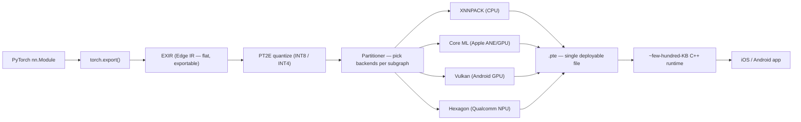

# ExecuTorch

> **Prereqs:** [IREE & ExecuTorch](../../compilers/production/iree-executorch) (background), [INT4 / AWQ / GPTQ](../../ml-execution/quantization/int4-and-awq). This lesson goes deep on the *deployment* path.

## TL;DR

- **ExecuTorch** is PyTorch's mobile runtime — the answer to "I have a PyTorch model, how do I run it on iOS / Android with no Python?"
- The pipeline: `torch.export()` → **EXIR** (Edge IR) → quantize via PT2E → partition to backends (XNNPACK CPU, Core ML ANE, Vulkan GPU, Hexagon NPU) → serialize as `.pte`.
- The `.pte` file is **everything** the device needs: serialized graph + per-backend kernels + weights. Few-hundred-KB runtime + your model size = total app footprint.
- **Vendor backends plug in as MLIR-shaped delegates** — Apple ships a Core ML delegate, Qualcomm ships a Hexagon delegate, MediaTek ships a Genio delegate. The partitioner decides which subgraph runs where.
- For 2026 production: ExecuTorch is the **default for PyTorch → mobile** at Meta and many OEM partners (Samsung, Asus). It's where new mobile-AI work in the PyTorch ecosystem starts.

## Why this matters

Until ExecuTorch (released 2023, mature 2024–2025), shipping a PyTorch model on mobile meant either: (a) export to ONNX → ONNX Runtime, (b) convert to Core ML / TFLite via lossy converters, or (c) reimplement in C++. None of these preserved PyTorch's authoring experience. ExecuTorch closes the gap: same model code, AOT-compiled, native runtime. It's the difference between *one* mobile-AI engineer and *every* PyTorch engineer being able to ship to mobile.

## Mental model



Every stage is replaceable. New backends plug in at the partitioner; new quantization modes plug in at PT2E.

## Concrete walkthrough

### `torch.export` — the AOT trace

Pre-ExecuTorch, the standard way to capture a PyTorch model for export was TorchScript (deprecated) or ONNX (lossy). `torch.export()` is the modern replacement:

```python
import torch
from torch.export import export

class MyModel(torch.nn.Module):
    def __init__(self):
        super().__init__()
        self.linear = torch.nn.Linear(128, 64)
    def forward(self, x):
        return torch.relu(self.linear(x))

m = MyModel().eval()
example_input = (torch.randn(1, 128),)

exported = export(m, example_input)
# `exported` is now a flat, deterministic graph of aten:: ops.
# No Python control flow, no untraced dynamic shapes, no dispatching.
print(exported.graph_module.code)
```

The output is **statically traced** at the example shape (or with explicit `dynamic_shapes` declaration). This is more restrictive than PyTorch's eager mode but gives you a graph the compiler can reason about. Anything dynamic that survives export survives via guards or explicit shape variables.

### EXIR — the edge IR

`exported` then lowers to **EXIR** (Edge IR), an MLIR-based representation that's *flatter* than aten:: — every op is one of a small core set, ready for backend-specific transformations.

```python
from executorch.exir import to_edge

edge = to_edge(exported)
# edge.exported_program() gives you the EXIR-level graph
```

EXIR is the IR backends operate on. It's deliberately small — a few dozen core ops — so backend implementers don't have to support the entire PyTorch op set.

### PT2E quantization

Quantization in ExecuTorch is **PyTorch 2 Export quantization** (PT2E) — the new replacement for the old FX-based quant flow. The pattern:

```python
from torch.ao.quantization.quantize_pt2e import prepare_pt2e, convert_pt2e
from torch.ao.quantization.quantizer.xnnpack_quantizer import XNNPACKQuantizer, get_symmetric_quantization_config

# 1. Insert observers
quantizer = XNNPACKQuantizer().set_global(get_symmetric_quantization_config())
prepared = prepare_pt2e(exported.module(), quantizer)

# 2. Calibrate
for batch in calibration_data:
    prepared(*batch)

# 3. Convert to quantized graph
quantized = convert_pt2e(prepared)

# 4. Re-export the quantized model
exported_q = export(quantized, example_input)
```

The quantizer is *backend-aware*: `XNNPACKQuantizer` produces patterns XNNPACK can run; `Coreml Quantizer` produces patterns the ANE accepts. Mixing quantizers per-subgraph lets you say "INT8 on CPU, FP16 on ANE" cleanly.

### Partitioning — the backend chooser

Once you have a quantized EXIR graph, you tell ExecuTorch which backends to consider:

```python
from executorch.backends.xnnpack.partition.xnnpack_partitioner import XnnpackPartitioner
from executorch.backends.apple.coreml.partition.coreml_partitioner import CoreMLPartitioner

edge = to_edge(exported_q)
edge = edge.to_backend(CoreMLPartitioner())     # ANE-eligible subgraphs go to Core ML
edge = edge.to_backend(XnnpackPartitioner())    # rest go to XNNPACK CPU
```

Each partitioner walks the graph, identifies subgraphs its backend can run, and **delegates them to the backend**. The remaining ops fall back to the next partitioner in the chain (often XNNPACK as universal CPU fallback). The result is a graph where each node is either a primitive op or a "delegate call" with the backend's compiled blob attached.

The order of partitioners matters: prefer the most-accelerated backend first.

### `.pte` — the deployable

```python
program = edge.to_executorch()
with open("model.pte", "wb") as f:
    f.write(program.buffer)
```

The `.pte` is a flatbuffer containing:
- The graph (which delegate calls go in what order).
- Per-delegate compiled blobs (e.g., a Core ML `.mlmodelc` for the ANE-routed subgraph; XNNPACK opcodes for the CPU-routed subgraph).
- Weights (quantized).

Total size: roughly the same as the quantized weights + a few hundred KB of metadata. For a 4-bit Llama-3.2-3B: ~2.1 GB.

### Loading on the device

iOS Swift:

```swift
import ExecutorchKit

let path = Bundle.main.path(forResource: "model", ofType: "pte")!
let module = try ExecutorchModule.load(from: path)
let output = try module.forward(inputs: [.tensor(input)])
```

Android Kotlin:

```kotlin
import org.pytorch.executorch.Module

val module = Module.load(assetFilePath(this, "model.pte"))
val output = module.forward(EValue.from(input))
```

The runtime is ~few-hundred-KB statically linked. No Python, no PyTorch, no autograd machinery. Just enough to interpret the `.pte` and dispatch to delegates.

### Quantization recipes that work

| Model class            | Recipe                                                    | Result on iPhone 15 Pro |
|------------------------|-----------------------------------------------------------|--------------------------|
| Vision model (ResNet)  | XNNPACKQuantizer + symmetric INT8                         | ~3× CPU speedup, lossless |
| Llama-3.2-1B          | INT8 weights + FP16 activations, ANE via Core ML delegate | ~50 tok/s                |
| Llama-3.2-3B          | INT4 weights (PT2E) + ANE fallback                       | ~15 tok/s                |
| Llama-3.1-8B          | INT4 weights, CPU only                                    | ~3 tok/s (memory-bound)   |
| Whisper-medium        | FP16, Core ML delegate                                    | ~5× real time             |

These numbers move with each ExecuTorch release; check the recipes repo for current best practices.

### Where ExecuTorch wins (and where it doesn't)

**Wins:**
- PyTorch-native authoring; no model rewrites.
- Multi-backend partitioning; can use ANE + CPU + GPU on the same model.
- First-class quantization via PT2E.
- Strong Apple support (Core ML delegate is the most production-mature).

**Loses to:**
- **llama.cpp** for pure LLM inference: smaller binary, faster cold start, more mature K-quant story. ExecuTorch's LLM path is good but llama.cpp is the consumer-app default.
- **Native Core ML** for Apple-only deployment when ANE compatibility matters more than authoring convenience.
- **TFLite** for some classical-ML and audio cases where the TFLite ecosystem is more mature.

The right framing: ExecuTorch is the *deployment compiler*; llama.cpp is the *inference runtime*. They overlap on LLMs but have different design centers.

## Run it in your browser — partition simulator

<RunInBrowser
  description="Simulate ExecuTorch's per-op partitioning across three backends. See the dispatch decisions."
  code={`# Each op: (name, backends_supporting_it, cpu_cost)
graph = [
    ('embedding',     ['cpu'],                       30),
    ('matmul',        ['cpu', 'gpu', 'ane'],         100),   # large; ANE wins
    ('layernorm',     ['cpu', 'gpu', 'ane'],         8),
    ('attention_qkv', ['cpu', 'gpu', 'ane'],         80),
    ('softmax',       ['cpu', 'gpu'],                15),    # ANE softmax is iffy
    ('matmul_out',    ['cpu', 'gpu', 'ane'],         80),
    ('ffn_up',        ['cpu', 'gpu', 'ane'],         100),
    ('ffn_act',       ['cpu', 'gpu', 'ane'],         12),
    ('ffn_down',      ['cpu', 'gpu', 'ane'],         100),
    ('topk',          ['cpu'],                       20),
]

backend_relative_speed = {'cpu': 1.0, 'gpu': 3.0, 'ane': 7.0}
switch_cost = 5      # roundtrip overhead when switching backend mid-graph

def partition(graph, switch_cost):
    last_be = None
    plan = []
    total_time = 0
    for name, supported, cost in graph:
        # Pick the fastest backend that supports this op.
        candidates = [(be, cost / backend_relative_speed[be]) for be in supported]
        be, t = min(candidates, key=lambda x: x[1])
        if last_be and be != last_be:
            t += switch_cost
        plan.append((name, be, round(t, 1)))
        total_time += t
        last_be = be
    return plan, total_time

plan, total = partition(graph, switch_cost)
print(f"{'op':<14} {'backend':<6} {'cost':>6}")
print('-' * 30)
for name, be, t in plan:
    print(f"{name:<14} {be:<6} {t:>6}")
print('-' * 30)
print(f"{'total':<14} {'':<6} {total:>6.1f}")
print()
print("Notice: softmax does not run on ANE, so the partitioner pays a switch")
print("cost to bounce out and back. A real partitioner reports this in TORCH_LOGS.")
`}
/>

The output shape — most ops on ANE, a few falling back to GPU/CPU with switch costs — is exactly what you'll see in ExecuTorch's `print_partition_summary()` output on real models.

## Quick check

<FillIn
  prompt="The PyTorch 2 Export quantization API:"
  answer="PT2E"
  accept={["pt2e", "PT2E quantization"]}
  hint="Four characters."
  explanation="PT2E = PyTorch 2 Export quantization. Replaces the older FX-based quant flow. Backend-aware quantizers (XNNPACK, Core ML, Hexagon) emit patterns the corresponding delegate can consume."
/>

<Quiz
  question="A team has a PyTorch model running well on a server. They want it on iOS without rewriting. The cleanest 2026 path:"
  options={[
    'Reimplement in Swift + Metal.',
    'torch.export() → ExecuTorch with the Core ML delegate; .pte ships with the app.',
    'Convert to ONNX, then to Core ML manually.',
    'Cloud-host it and add an API call.',
  ]}
  answer={1}
  explanation="The ExecuTorch path is exactly what the framework was built for: PyTorch nn.Module → exported graph → Core ML delegate (ANE-aware) → .pte. No model rewrite, no lossy ONNX conversion, no cloud dependency. The Swift API loads the .pte directly."
/>

## Key takeaways

1. **ExecuTorch is PyTorch's mobile compiler.** torch.export → EXIR → quantize → partition → .pte.
2. **PT2E is the modern PyTorch quantization API.** Backend-aware quantizers; replaces FX quant.
3. **Vendor delegates plug in as MLIR-shaped backends.** Core ML, Vulkan, Hexagon, XNNPACK all live in `backends/`.
4. **The runtime is tiny** — few hundred KB. Total app footprint is dominated by your model size.
5. **For PyTorch → mobile, ExecuTorch is the default in 2026.** llama.cpp wins for pure-LLM consumer apps; ExecuTorch wins everywhere else PyTorch authoring matters.

## Go deeper

<Resources
  items={[
    { kind: 'docs', href: 'https://pytorch.org/executorch/stable/index.html', title: 'ExecuTorch Documentation', note: 'Authoritative. "Concepts" + "Tutorials" cover the full pipeline.' },
    { kind: 'docs', href: 'https://pytorch.org/executorch/stable/quantization-overview.html', title: 'ExecuTorch — Quantization', note: 'PT2E flow with worked examples for vision and LLM models.' },
    { kind: 'paper', href: 'https://arxiv.org/abs/2509.04701', title: 'ExecuTorch: From PyTorch to On-Device AI', author: 'Meta, 2025', note: 'The system paper. Section 3 has the partitioner cost model; section 5 the production deployment numbers across iOS, Android, embedded.' },
    { kind: 'blog', href: 'https://pytorch.org/blog/executorch-alpha/', title: 'PyTorch Blog — ExecuTorch Alpha', note: 'Original announcement; useful for the design motivation.' },
    { kind: 'docs', href: 'https://pytorch.org/executorch/stable/llm/intro.html', title: 'ExecuTorch — LLM Tutorials', note: 'End-to-end recipes for shipping Llama on iOS / Android.' },
    { kind: 'repo', href: 'https://github.com/pytorch/executorch', title: 'pytorch/executorch', note: 'Reference. `examples/models/llama/` for the LLM recipe; `backends/apple/coreml/` for the Core ML delegate; `backends/xnnpack/` for the universal CPU.' },
  ]}
/>

<LessonComplete />
