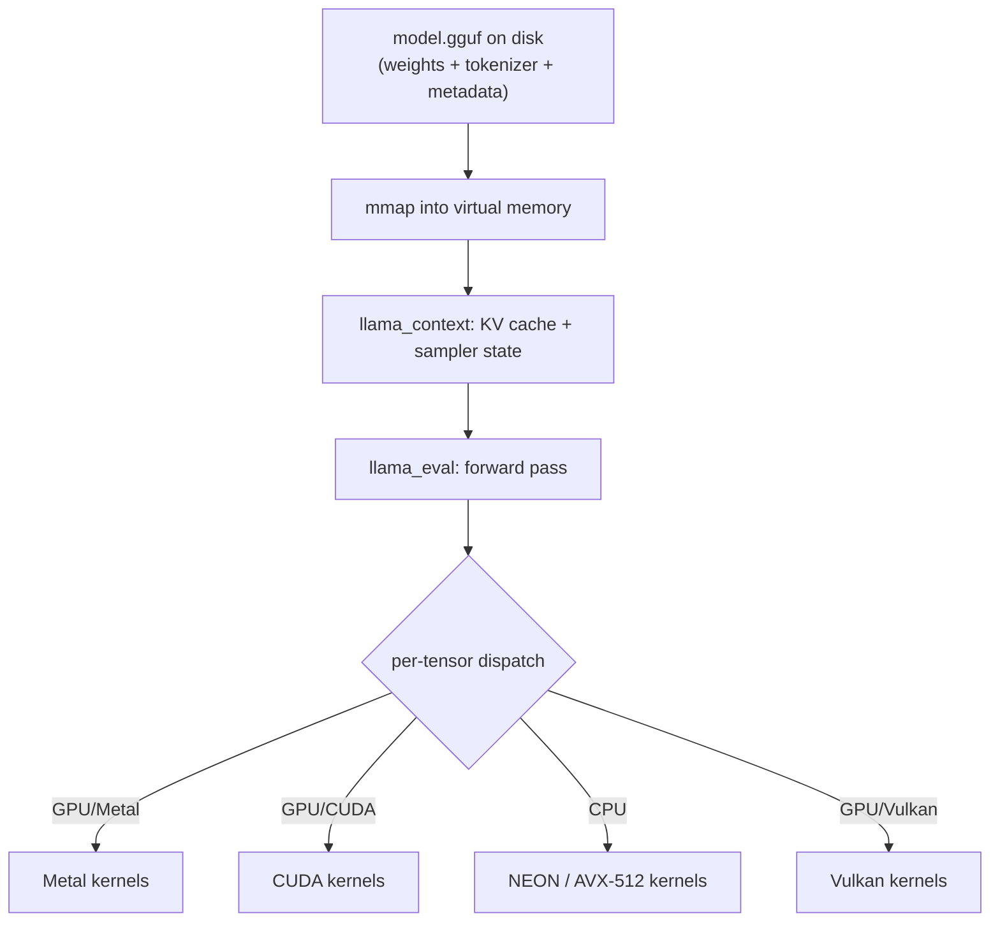

# llama.cpp Internals

<Mode is="learn">

> **Prereqs:** [INT4 / AWQ / GPTQ](../../ml-execution/quantization/int4-and-awq), [KV Cache Basics](../../llm-architecture/kv-cache/kv-basics). llama.cpp is a self-contained re-implementation of these concepts in C++ for portability.

In cloud serving, the runtime that runs your model is Python. PyTorch, vLLM, an HTTP server — gigabytes of RAM, a Python process tree, a GC, and a CUDA driver underneath. The runtime is so fat you barely notice it; the *model weights* are the thing you ship.

On a phone, that whole stack disappears. There is no Python. There is no PyTorch. There is no installer that pulls down a 3 GB conda environment. There is one C++ binary linked into your app, a few hundred KB of code, and a model file the user downloaded once. The binary loads the model, runs the kernels, samples the next token, and exits when the user puts the phone down. **Python is the SDK; C/C++ is what runs on the device.**

`llama.cpp` is the canonical example of this shift. It's a pure-C++ inference runtime that runs Llama-class models on a Raspberry Pi, an iPhone, a gaming laptop, or a bare-metal H100 — same source, same binary shape, different backend. Reading its source teaches you more about pragmatic ML systems engineering than any other single codebase, because every line had to defend its own existence on a constrained device.

## TL;DR

- **llama.cpp** is a pure-C++ inference runtime (started by ggerganov, 2023). No PyTorch. No Python. ~50K lines of code; runs Llama-class models on every reasonable platform from a Raspberry Pi to a server GPU.
- **<Term name="gguf">GGUF</Term>** is the file format: weights + tokenizer + chat template + metadata in a single mmappable file. Quantized formats (Q4_K_M, Q5_K_M, Q8_0) are baked in. **The format is the standard for local LLMs in 2026** — every consumer-facing tool reads GGUF.
- **<Term name="mmap">mmap</Term>-first design**: the model file is `mmap()`'d, not read. The OS pages weights in on demand. **Cold-start to first token in seconds, not minutes**, even for a 70B model on disk.
- **Backends compose**: a single binary runs the same model on CPU (AVX-512, NEON), Apple Metal, Vulkan, CUDA, ROCm. The framework dispatches per-tensor based on the available backend.
- **<Term name="k-quants">K-quants</Term>** are the format's killer feature: better quality than naive INT4 at the same bit budget, baked into the binary, no calibration data needed. Q4_K_M is the universal default.

## Why the C++ runtime exists at all

In a managed-runtime world, "deploy a model" means "ship Python + PyTorch + CUDA + the weights." That's fine on a server with 80 GB of RAM and a network connection to pip. It's a non-starter for a phone, a watch, a microcontroller, or even a desktop app where the user doesn't want a 3 GB install.

The job of llama.cpp is to be **the thing you ship instead**. One static library. No interpreter. No allocator surprises on the hot path. A binary you can wrap in a Swift app, an Android NDK module, or a CLI tool that runs on a Raspberry Pi 5. The whole runtime, including all backends, fits in a few MB. The model file is what the user actually downloads.

## Mental model



GGUF on disk → mmap → context → eval → per-tensor dispatch to a backend. Every layer is small and replaceable.

## The GGUF format

A GGUF file is a single binary with three sections:

1. **Magic + version** (8 bytes).
2. **Metadata** — KV pairs as (string key, typed value). Stores tokenizer vocab + merges, chat template, RoPE scaling, model architecture, every hyperparameter.
3. **Tensor data** — for each tensor: name, shape, dtype, offset into the file. Followed by the raw bytes, alignment-padded.

Loading is essentially: parse metadata, build a name → (shape, dtype, file_offset) table, mmap the whole file. No deserialization of the weights themselves; they're read directly from the mmap'd region when first accessed.

The advantages over PyTorch's `.pt` (pickle) or HF Safetensors:

| Property | GGUF | Safetensors | .pt |
|---|---|---|---|
| Single file (weights + tokenizer) | ✓ | ✗ | ✗ |
| mmap-friendly | ✓ | ✓ | ✗ |
| Quantized formats baked in | ✓ | partial | ✗ |
| Chat template stored | ✓ | ✗ | ✗ |
| Self-describing metadata | ✓ | ✗ | ✗ |
| Pickle-free (no code execution) | ✓ | ✓ | ✗ |

**For local-LLM consumer use, GGUF wins on every dimension that matters.**

## mmap-first

The classic alternative is `read()` the whole 4 GB file into a buffer. That:
- Takes ~5–30 seconds depending on disk speed.
- Doubles peak memory (file + heap copy) until the file buffer is freed.
- Forces the OS to commit RAM that may not be needed yet (e.g., embedding rows for tokens never used).

`mmap()` instead:
- Returns instantly (it's a virtual-memory operation).
- Pages are loaded on demand: the first time you read a weight tensor, the OS faults the <Term name="page fault">page</Term> in.
- Multiple processes loading the same model share the page cache.
- The OS can discard cold pages under memory pressure (returning the file mapping is free).

For a 4 GB Q4_K_M model, mmap'd cold start to first token is typically **under 1 second**. Production-grade.

## The K-quant lineage

llama.cpp's K-quants — Q2_K, Q3_K_M, Q4_K_M, Q5_K_M, Q6_K — are different from naive INT4/INT8. The "K" stands for *k-means*-like grouping with sub-block refinement. Roughly:

- **Super-block of 256 weights** carries the global scale + mins.
- **Sub-blocks of 16 or 32 weights** within the super-block carry refined per-block parameters.
- The format mixes 4-bit and 6-bit quants for "important" vs "ordinary" weights (the M variants).

The result: **0.5–1 pt better MMLU than naive INT4** at the same bit budget, *without <Term name="calibration data">calibration data</Term>*. The recipe is baked in; just convert and quantize.

```bash
python convert_hf_to_gguf.py meta-llama/Llama-3.2-3B-Instruct
./quantize llama-3.2-3b.gguf llama-3.2-3b-q4_k_m.gguf Q4_K_M
```

That's it. Output: a 2 GB file ready to deploy.

## Backend dispatch

The <Term name="ggml">`ggml`</Term> library inside llama.cpp is a tiny tensor framework. Every operation has a per-backend implementation:

- `ggml-cpu.c` — scalar + AVX2/AVX-512/NEON paths for x86 and ARM.
- `ggml-metal.m` — Metal Performance Shaders kernels for Apple silicon.
- `ggml-cuda.cu` — CUDA kernels for NVIDIA.
- `ggml-vulkan.cpp` — Vulkan compute shaders for cross-platform GPU (Intel, AMD, Adreno).
- `ggml-rpc.cpp` — distribute across multiple machines.

At kernel time, llama.cpp dispatches based on which backend the tensor lives on (set when the model is loaded). **You can mix**: keep some layers on GPU, others on CPU. This is how llama.cpp serves models that don't fit in VRAM — overflow to RAM, with the CPU running the spilled layers.

## The inference loop, simplified

```c
llama_context * ctx = llama_init_from_model(model_path);

// Tokenize the prompt
llama_token tokens[1024];
int n = llama_tokenize(model, prompt, /* tokens_out= */ tokens);

// Prefill: process all prompt tokens in one batch
llama_decode(ctx, llama_batch_get_one(tokens, n));

// Decode: one token at a time, sampling from logits
while (...) {
    float * logits = llama_get_logits(ctx);
    llama_token next = sample(logits, vocab_size);  // your sampler from Sampling lesson
    if (next == eos) break;
    print_token(next);
    llama_decode(ctx, llama_batch_get_one(&next, 1));
}
```

Half a page of code is a complete inference loop. The <Term name="kv cache">KV cache</Term> is implicit (managed by `llama_context`). Sampling is your responsibility (llama.cpp ships standard samplers in `common/sampling.cpp` — see [Sampling](../../llm-architecture/inference-time/sampling)).

## Mobile build paths

- **iOS**: build with `cmake -DLLAMA_METAL=ON`, produce a static library + Metal shader bundle. Embed via Swift Package Manager. Runtime: `./build/llama` binary or `libllama.a` linked into your Swift code.
- **Android**: build with NDK + Vulkan or NEON. Binary size ~3 MB; the model file dominates.
- **Linux/macOS desktop**: vanilla CMake. Runs the `main` CLI.
- **Windows**: builds via MSVC or MinGW; same flags.
- **Raspberry Pi 5**: NEON path; runs 3B Q4_K_M at ~5 tok/s.

The portability is real and is the reason consumer apps converge on this runtime.

## Run it in your browser — GGUF parser

<RunInBrowser
  description="Parse the GGUF header structure (in plain Python, no real model file). See the metadata + tensor table layout."
  code={`# Simplified GGUF v3 parser. Real format spec at:
# https://github.com/ggerganov/ggml/blob/master/docs/gguf.md
#
# Layout:
#   magic[4] = b'GGUF'
#   version: u32
#   tensor_count: u64
#   metadata_kv_count: u64
#   metadata_kv[N]
#   tensor_info[T]
#   alignment-padded tensor data

import struct
from io import BytesIO

# Build a tiny synthetic GGUF in memory for demonstration
def build_synthetic_gguf():
    buf = BytesIO()
    buf.write(b'GGUF')
    buf.write(struct.pack('<I', 3))             # version
    buf.write(struct.pack('<Q', 2))             # tensor_count
    buf.write(struct.pack('<Q', 3))             # metadata_kv_count

    # Metadata: 3 keys
    def write_str(s):
        b = s.encode('utf-8')
        buf.write(struct.pack('<Q', len(b)))
        buf.write(b)
    def write_u32_kv(k, v):
        write_str(k)
        buf.write(struct.pack('<I', 4))         # GGUF type 4 = u32
        buf.write(struct.pack('<I', v))
    def write_str_kv(k, v):
        write_str(k)
        buf.write(struct.pack('<I', 8))         # GGUF type 8 = string
        write_str(v)

    write_str_kv('general.architecture', 'llama')
    write_u32_kv('llama.context_length', 4096)
    write_u32_kv('llama.embedding_length', 768)

    # Tensor info: 2 tensors
    def write_tensor_info(name, shape, dtype, offset):
        write_str(name)
        buf.write(struct.pack('<I', len(shape)))   # n_dims
        for d in shape: buf.write(struct.pack('<Q', d))
        buf.write(struct.pack('<I', dtype))
        buf.write(struct.pack('<Q', offset))

    write_tensor_info('token_embd.weight', [768, 32000], 0, 0)
    write_tensor_info('output.weight', [768, 32000], 0, 768 * 32000 * 4)

    return buf.getvalue()

GGUF_TYPES = {0: 'u8', 1: 'i8', 2: 'u16', 3: 'i16', 4: 'u32', 5: 'i32',
              6: 'f32', 7: 'bool', 8: 'string', 9: 'array', 10: 'u64', 11: 'i64', 12: 'f64'}

def parse_gguf(data):
    f = BytesIO(data)
    assert f.read(4) == b'GGUF'
    version = struct.unpack('<I', f.read(4))[0]
    n_tensors = struct.unpack('<Q', f.read(8))[0]
    n_meta = struct.unpack('<Q', f.read(8))[0]
    print(f"GGUF v{version}: {n_tensors} tensors, {n_meta} metadata keys")
    print()

    def read_str():
        n = struct.unpack('<Q', f.read(8))[0]
        return f.read(n).decode('utf-8')

    print("--- METADATA ---")
    for _ in range(n_meta):
        k = read_str()
        t = struct.unpack('<I', f.read(4))[0]
        if t == 4:    # u32
            v = struct.unpack('<I', f.read(4))[0]
        elif t == 8:  # string
            v = read_str()
        else:
            v = '<...>'
        print(f"  {k:<30} ({GGUF_TYPES.get(t, '?'):<6}) = {v}")

    print("\\n--- TENSORS ---")
    for _ in range(n_tensors):
        name = read_str()
        n_dims = struct.unpack('<I', f.read(4))[0]
        shape = [struct.unpack('<Q', f.read(8))[0] for _ in range(n_dims)]
        dtype = struct.unpack('<I', f.read(4))[0]
        offset = struct.unpack('<Q', f.read(8))[0]
        size = 1
        for d in shape: size *= d
        print(f"  {name:<25} shape={shape}  dtype={dtype}  offset={offset}  ({size:,} elements)")

parse_gguf(build_synthetic_gguf())
print()
print("Real GGUF files have hundreds of tensors and dozens of metadata keys.")
print("The parser is ~150 lines of C; everything is trivially streamable.")
`}
/>

The shape — header → metadata KV → tensor info table → padded data region — is the entire GGUF spec. Reading the real format spec after this code is a 20-minute exercise.

## Quick check

<FillIn
  prompt="The format llama.cpp uses for model files (replaces .pt and .safetensors for local-LLM workflows):"
  answer="GGUF"
  accept={["gguf", ".gguf"]}
  hint="Four letters; the local-LLM file format."
  explanation="GGUF (GGML Universal File) replaced the older GGML format in 2023. Single mmappable file, weights + tokenizer + metadata, K-quants baked in, every consumer LLM tool reads it."
/>

<Quiz
  question="A team wants the fastest possible cold-start latency for a 4 GB local LLM on a phone. The right design choice:"
  options={[
    'Read the full file into a buffer at app launch.',
    'mmap the GGUF file and let the OS page weights in on demand.',
    'Stream the model from a server.',
    'Pre-allocate VRAM for all weights before loading.',
  ]}
  answer={1}
  explanation="mmap returns essentially instantly (virtual-memory operation, no I/O). The OS faults pages in lazily as the inference touches them. For a 4 GB GGUF on flash storage, time-to-first-token is typically under 1 second cold. Reading the whole file upfront takes 5–30 seconds and doubles peak memory."
/>

## Key takeaways

1. **GGUF is the local-LLM file format** — single file, mmappable, K-quants baked in, no pickle.
2. **mmap-first cold start** is the unsung performance feature. Pages load lazily.
3. **K-quants beat naive INT4** by 0.5–1 pt MMLU at the same bit budget. Q4_K_M is the universal default.
4. **Backend dispatch is per-tensor** — you can mix CPU + GPU layers, which is how llama.cpp serves "doesn't-fit-in-VRAM" models.
5. **Reading llama.cpp's source is the fastest way to internalize pragmatic ML systems engineering.** Start with `llama.cpp` (the file), then `ggml.c`, then a backend.

## Go deeper

<Resources
  items={[
    { kind: 'docs', href: 'https://github.com/ggerganov/ggml/blob/master/docs/gguf.md', title: 'GGUF Format Specification', note: 'Authoritative. The single page that defines what every consumer LLM app reads.' },
    { kind: 'docs', href: 'https://github.com/ggerganov/llama.cpp/blob/master/docs/quantize.md', title: 'llama.cpp — Quantization Guide', note: 'Which K-quant to use, why, and the size/quality tradeoffs.' },
    { kind: 'blog', href: 'https://news.ycombinator.com/item?id=37941117', title: 'HN: llama.cpp 2-month retrospective (ggerganov)', note: 'Author\'s own writeup on the design decisions; rare insight into pragmatic systems thinking.' },
    { kind: 'blog', href: 'https://justine.lol/matmul/', title: 'Justine Tunney — Matrix Multiplication on CPU', note: 'How llama.cpp\'s CPU matmul beats OpenBLAS on Apple Silicon. Required reading.' },
    { kind: 'video', href: 'https://www.youtube.com/watch?v=80bIUggRJf4', title: 'Andrej Karpathy — How llama.cpp does Inference', note: 'The mental model walkthrough.' },
    { kind: 'repo', href: 'https://github.com/ggerganov/llama.cpp', title: 'ggerganov/llama.cpp', note: 'The source. Start with `llama.cpp` (file), then `ggml.c`, then `ggml-metal.m` or your favorite backend.' },
    { kind: 'repo', href: 'https://github.com/ggerganov/ggml', title: 'ggerganov/ggml', note: 'The tensor library at the bottom. ~10K lines of focused C; readable in a weekend.' },
  ]}
/>

</Mode>

<Mode is="reference">

> **Prereqs:** [INT4 / AWQ / GPTQ](../../ml-execution/quantization/int4-and-awq), [KV Cache Basics](../../llm-architecture/kv-cache/kv-basics). llama.cpp is a self-contained re-implementation of these concepts in C++ for portability.

## TL;DR

- **llama.cpp** is a pure-C++ inference runtime (started by ggerganov, 2023). No PyTorch. No Python. ~50K lines of code; runs Llama-class models on every reasonable platform from a Raspberry Pi to a server GPU.
- **GGUF** is the file format: weights + tokenizer + chat template + metadata in a single mmappable file. Quantized formats (Q4_K_M, Q5_K_M, Q8_0) are baked in. **The format is the standard for local LLMs in 2026** — every consumer-facing tool reads GGUF.
- **mmap-first design**: the model file is `mmap()`'d, not read. The OS pages weights in on demand. **Cold-start to first token in seconds, not minutes**, even for a 70B model on disk.
- **Backends compose**: a single binary runs the same model on CPU (AVX-512, NEON), Apple Metal, Vulkan, CUDA, ROCm. The framework dispatches per-tensor based on the available backend.
- **K-quants** are the format's killer feature: better quality than naive INT4 at the same bit budget, baked into the binary, no calibration data needed. Q4_K_M is the universal default.

## Why this matters

Every consumer LLM app — Ollama, LM Studio, Jan.ai, the Hugging Face desktop chatbot, every "run Llama on your laptop" project — wraps llama.cpp. It is the *de facto* standard for local LLM inference, and reading its source teaches you more about pragmatic ML systems engineering than any other single codebase. A team building anything edge-LLM that doesn't start by reading llama.cpp is reinventing five years of solved problems.

## Mental model


GGUF on disk → mmap → context → eval → per-tensor dispatch to a backend. Every layer is small and replaceable.

## Concrete walkthrough

### The GGUF format

A GGUF file is a single binary with three sections:

1. **Magic + version** (8 bytes).
2. **Metadata** — KV pairs as (string key, typed value). Stores tokenizer vocab + merges, chat template, RoPE scaling, model architecture, every hyperparameter.
3. **Tensor data** — for each tensor: name, shape, dtype, offset into the file. Followed by the raw bytes, alignment-padded.

Loading is essentially: parse metadata, build a name → (shape, dtype, file_offset) table, mmap the whole file. No deserialization of the weights themselves; they're read directly from the mmap'd region when first accessed.

The advantages over PyTorch's `.pt` (pickle) or HF Safetensors:

| Property | GGUF | Safetensors | .pt |
|---|---|---|---|
| Single file (weights + tokenizer) | ✓ | ✗ | ✗ |
| mmap-friendly | ✓ | ✓ | ✗ |
| Quantized formats baked in | ✓ | partial | ✗ |
| Chat template stored | ✓ | ✗ | ✗ |
| Self-describing metadata | ✓ | ✗ | ✗ |
| Pickle-free (no code execution) | ✓ | ✓ | ✗ |

**For local-LLM consumer use, GGUF wins on every dimension that matters.**

### mmap-first

The classic alternative is `read()` the whole 4 GB file into a buffer. That:
- Takes ~5–30 seconds depending on disk speed.
- Doubles peak memory (file + heap copy) until the file buffer is freed.
- Forces the OS to commit RAM that may not be needed yet (e.g., embedding rows for tokens never used).

`mmap()` instead:
- Returns instantly (it's a virtual-memory operation).
- Pages are loaded on demand: the first time you read a weight tensor, the OS faults the page in.
- Multiple processes loading the same model share the page cache.
- The OS can discard cold pages under memory pressure (returning the file mapping is free).

For a 4 GB Q4_K_M model, mmap'd cold start to first token is typically **under 1 second**. Production-grade.

### The K-quant lineage

llama.cpp's K-quants — Q2_K, Q3_K_M, Q4_K_M, Q5_K_M, Q6_K — are different from naive INT4/INT8. The "K" stands for *k-means*-like grouping with sub-block refinement. Roughly:

- **Super-block of 256 weights** carries the global scale + mins.
- **Sub-blocks of 16 or 32 weights** within the super-block carry refined per-block parameters.
- The format mixes 4-bit and 6-bit quants for "important" vs "ordinary" weights (the M variants).

The result: **0.5–1 pt better MMLU than naive INT4** at the same bit budget, *without calibration data*. The recipe is baked in; just convert and quantize.

```bash
python convert_hf_to_gguf.py meta-llama/Llama-3.2-3B-Instruct
./quantize llama-3.2-3b.gguf llama-3.2-3b-q4_k_m.gguf Q4_K_M
```

That's it. Output: a 2 GB file ready to deploy.

### Backend dispatch

The `ggml` library inside llama.cpp is a tiny tensor framework. Every operation has a per-backend implementation:

- `ggml-cpu.c` — scalar + AVX2/AVX-512/NEON paths for x86 and ARM.
- `ggml-metal.m` — Metal Performance Shaders kernels for Apple silicon.
- `ggml-cuda.cu` — CUDA kernels for NVIDIA.
- `ggml-vulkan.cpp` — Vulkan compute shaders for cross-platform GPU (Intel, AMD, Adreno).
- `ggml-rpc.cpp` — distribute across multiple machines.

At kernel time, llama.cpp dispatches based on which backend the tensor lives on (set when the model is loaded). **You can mix**: keep some layers on GPU, others on CPU. This is how llama.cpp serves models that don't fit in VRAM — overflow to RAM, with the CPU running the spilled layers.

### The inference loop, simplified

```c
llama_context * ctx = llama_init_from_model(model_path);

// Tokenize the prompt
llama_token tokens[1024];
int n = llama_tokenize(model, prompt, /* tokens_out= */ tokens);

// Prefill: process all prompt tokens in one batch
llama_decode(ctx, llama_batch_get_one(tokens, n));

// Decode: one token at a time, sampling from logits
while (...) {
    float * logits = llama_get_logits(ctx);
    llama_token next = sample(logits, vocab_size);  // your sampler from Sampling lesson
    if (next == eos) break;
    print_token(next);
    llama_decode(ctx, llama_batch_get_one(&next, 1));
}
```

Half a page of code is a complete inference loop. The KV cache is implicit (managed by `llama_context`). Sampling is your responsibility (llama.cpp ships standard samplers in `common/sampling.cpp` — see [Sampling](../../llm-architecture/inference-time/sampling)).

### Mobile build paths

- **iOS**: build with `cmake -DLLAMA_METAL=ON`, produce a static library + Metal shader bundle. Embed via Swift Package Manager. Runtime: `./build/llama` binary or `libllama.a` linked into your Swift code.
- **Android**: build with NDK + Vulkan or NEON. Binary size ~3 MB; the model file dominates.
- **Linux/macOS desktop**: vanilla CMake. Runs the `main` CLI.
- **Windows**: builds via MSVC or MinGW; same flags.
- **Raspberry Pi 5**: NEON path; runs 3B Q4_K_M at ~5 tok/s.

The portability is real and is the reason consumer apps converge on this runtime.

## Run it in your browser — GGUF parser

<RunInBrowser
  description="Parse the GGUF header structure (in plain Python, no real model file). See the metadata + tensor table layout."
  code={`# Simplified GGUF v3 parser. Real format spec at:
# https://github.com/ggerganov/ggml/blob/master/docs/gguf.md
#
# Layout:
#   magic[4] = b'GGUF'
#   version: u32
#   tensor_count: u64
#   metadata_kv_count: u64
#   metadata_kv[N]
#   tensor_info[T]
#   alignment-padded tensor data

import struct
from io import BytesIO

# Build a tiny synthetic GGUF in memory for demonstration
def build_synthetic_gguf():
    buf = BytesIO()
    buf.write(b'GGUF')
    buf.write(struct.pack('<I', 3))             # version
    buf.write(struct.pack('<Q', 2))             # tensor_count
    buf.write(struct.pack('<Q', 3))             # metadata_kv_count

    # Metadata: 3 keys
    def write_str(s):
        b = s.encode('utf-8')
        buf.write(struct.pack('<Q', len(b)))
        buf.write(b)
    def write_u32_kv(k, v):
        write_str(k)
        buf.write(struct.pack('<I', 4))         # GGUF type 4 = u32
        buf.write(struct.pack('<I', v))
    def write_str_kv(k, v):
        write_str(k)
        buf.write(struct.pack('<I', 8))         # GGUF type 8 = string
        write_str(v)

    write_str_kv('general.architecture', 'llama')
    write_u32_kv('llama.context_length', 4096)
    write_u32_kv('llama.embedding_length', 768)

    # Tensor info: 2 tensors
    def write_tensor_info(name, shape, dtype, offset):
        write_str(name)
        buf.write(struct.pack('<I', len(shape)))   # n_dims
        for d in shape: buf.write(struct.pack('<Q', d))
        buf.write(struct.pack('<I', dtype))
        buf.write(struct.pack('<Q', offset))

    write_tensor_info('token_embd.weight', [768, 32000], 0, 0)
    write_tensor_info('output.weight', [768, 32000], 0, 768 * 32000 * 4)

    return buf.getvalue()

GGUF_TYPES = {0: 'u8', 1: 'i8', 2: 'u16', 3: 'i16', 4: 'u32', 5: 'i32',
              6: 'f32', 7: 'bool', 8: 'string', 9: 'array', 10: 'u64', 11: 'i64', 12: 'f64'}

def parse_gguf(data):
    f = BytesIO(data)
    assert f.read(4) == b'GGUF'
    version = struct.unpack('<I', f.read(4))[0]
    n_tensors = struct.unpack('<Q', f.read(8))[0]
    n_meta = struct.unpack('<Q', f.read(8))[0]
    print(f"GGUF v{version}: {n_tensors} tensors, {n_meta} metadata keys")
    print()

    def read_str():
        n = struct.unpack('<Q', f.read(8))[0]
        return f.read(n).decode('utf-8')

    print("--- METADATA ---")
    for _ in range(n_meta):
        k = read_str()
        t = struct.unpack('<I', f.read(4))[0]
        if t == 4:    # u32
            v = struct.unpack('<I', f.read(4))[0]
        elif t == 8:  # string
            v = read_str()
        else:
            v = '<...>'
        print(f"  {k:<30} ({GGUF_TYPES.get(t, '?'):<6}) = {v}")

    print("\\n--- TENSORS ---")
    for _ in range(n_tensors):
        name = read_str()
        n_dims = struct.unpack('<I', f.read(4))[0]
        shape = [struct.unpack('<Q', f.read(8))[0] for _ in range(n_dims)]
        dtype = struct.unpack('<I', f.read(4))[0]
        offset = struct.unpack('<Q', f.read(8))[0]
        size = 1
        for d in shape: size *= d
        print(f"  {name:<25} shape={shape}  dtype={dtype}  offset={offset}  ({size:,} elements)")

parse_gguf(build_synthetic_gguf())
print()
print("Real GGUF files have hundreds of tensors and dozens of metadata keys.")
print("The parser is ~150 lines of C; everything is trivially streamable.")
`}
/>

The shape — header → metadata KV → tensor info table → padded data region — is the entire GGUF spec. Reading the real format spec after this code is a 20-minute exercise.

## Quick check

<FillIn
  prompt="The format llama.cpp uses for model files (replaces .pt and .safetensors for local-LLM workflows):"
  answer="GGUF"
  accept={["gguf", ".gguf"]}
  hint="Four letters; the local-LLM file format."
  explanation="GGUF (GGML Universal File) replaced the older GGML format in 2023. Single mmappable file, weights + tokenizer + metadata, K-quants baked in, every consumer LLM tool reads it."
/>

<Quiz
  question="A team wants the fastest possible cold-start latency for a 4 GB local LLM on a phone. The right design choice:"
  options={[
    'Read the full file into a buffer at app launch.',
    'mmap the GGUF file and let the OS page weights in on demand.',
    'Stream the model from a server.',
    'Pre-allocate VRAM for all weights before loading.',
  ]}
  answer={1}
  explanation="mmap returns essentially instantly (virtual-memory operation, no I/O). The OS faults pages in lazily as the inference touches them. For a 4 GB GGUF on flash storage, time-to-first-token is typically under 1 second cold. Reading the whole file upfront takes 5–30 seconds and doubles peak memory."
/>

## Key takeaways

1. **GGUF is the local-LLM file format** — single file, mmappable, K-quants baked in, no pickle.
2. **mmap-first cold start** is the unsung performance feature. Pages load lazily.
3. **K-quants beat naive INT4** by 0.5–1 pt MMLU at the same bit budget. Q4_K_M is the universal default.
4. **Backend dispatch is per-tensor** — you can mix CPU + GPU layers, which is how llama.cpp serves "doesn't-fit-in-VRAM" models.
5. **Reading llama.cpp's source is the fastest way to internalize pragmatic ML systems engineering.** Start with `llama.cpp` (the file), then `ggml.c`, then a backend.

## Go deeper

<Resources
  items={[
    { kind: 'docs', href: 'https://github.com/ggerganov/ggml/blob/master/docs/gguf.md', title: 'GGUF Format Specification', note: 'Authoritative. The single page that defines what every consumer LLM app reads.' },
    { kind: 'docs', href: 'https://github.com/ggerganov/llama.cpp/blob/master/docs/quantize.md', title: 'llama.cpp — Quantization Guide', note: 'Which K-quant to use, why, and the size/quality tradeoffs.' },
    { kind: 'blog', href: 'https://news.ycombinator.com/item?id=37941117', title: 'HN: llama.cpp 2-month retrospective (ggerganov)', note: 'Author\'s own writeup on the design decisions; rare insight into pragmatic systems thinking.' },
    { kind: 'blog', href: 'https://justine.lol/matmul/', title: 'Justine Tunney — Matrix Multiplication on CPU', note: 'How llama.cpp\'s CPU matmul beats OpenBLAS on Apple Silicon. Required reading.' },
    { kind: 'video', href: 'https://www.youtube.com/watch?v=80bIUggRJf4', title: 'Andrej Karpathy — How llama.cpp does Inference', note: 'The mental model walkthrough.' },
    { kind: 'repo', href: 'https://github.com/ggerganov/llama.cpp', title: 'ggerganov/llama.cpp', note: 'The source. Start with `llama.cpp` (file), then `ggml.c`, then `ggml-metal.m` or your favorite backend.' },
    { kind: 'repo', href: 'https://github.com/ggerganov/ggml', title: 'ggerganov/ggml', note: 'The tensor library at the bottom. ~10K lines of focused C; readable in a weekend.' },
  ]}
/>

</Mode>

<LessonComplete />
