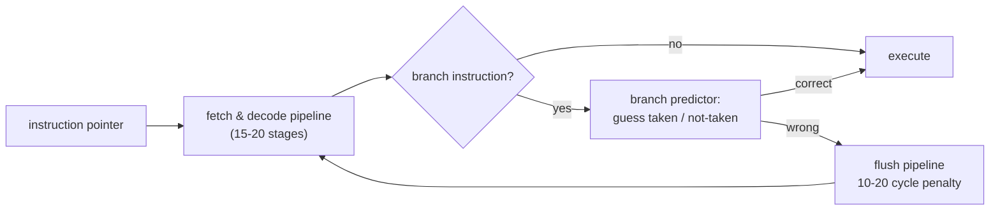

# Branch Prediction

> **Prereq:** [Cache Lines](./cache-lines). Branch prediction is the *other* major non-obvious cost on modern CPUs.

## TL;DR

- Modern CPUs are **deeply pipelined** — 15–20 instructions in flight simultaneously. When the CPU hits a branch (`if`, `for`, `while`), it doesn't *know* which path will execute, so it **guesses** and starts speculatively running.
- If the guess is right: ~free, the speculation commits.
- If the guess is wrong: pipeline gets flushed, ~10–20 cycles wasted. **A misprediction costs 5–10× a regular instruction.**
- Modern predictors are **really good** — branches that follow patterns (always taken, predictable loops, simple conditions) hit ~99% accuracy.
- Branches that depend on data with no pattern (sorting random values, hash lookups, RNG branches) hit ~50%. **A 1B-iteration loop with 50% mispredict can spend half its time in pipeline stalls.**

## Why this matters

If you've ever sorted an array and seen subsequent code run faster on the sorted version than the unsorted one, that's branch prediction. Branch-mispredict-heavy code can be 2–10× slower than a branch-free equivalent. The fix is sometimes algorithmic (avoid the branch entirely), sometimes a data-layout choice (group similar branches together), sometimes intrinsic-level (`cmov`, predication). Knowing that branch prediction exists is the price of writing performance-critical code on any modern CPU.

## Mental model



Speculation is the engine that lets modern CPUs sustain ~3 IPC. Mispredicts break it.

## Concrete walkthrough

### The famous Stack Overflow benchmark

The most-cited example (Stack Overflow, ~2012):

```cpp
const unsigned arraySize = 32768;
int data[arraySize];
for (auto& x : data) x = rand() % 256;

// std::sort(data, data + arraySize);  // <-- uncomment to make this 6× faster

int sum = 0;
for (int n = 0; n < 100000; ++n) {
    for (int i = 0; i < arraySize; ++i) {
        if (data[i] >= 128) sum += data[i];
    }
}
```

With sorted data: the branch is *predictable* (first half always not-taken, second half always taken). Prediction accuracy ~100%. Runs fast.

With unsorted data: every iteration's `data[i] >= 128` is a coin flip. Prediction accuracy ~50%. **Same code runs 6× slower** because half the branches stall the pipeline.

### Real misprediction costs

| Operation             | Cycles |
|-----------------------|---------|
| Add / subtract        | 1       |
| Multiply              | 3       |
| L1 cache hit          | 4       |
| Predicted branch      | 0–1     |
| **Mispredicted branch**| **15–20** |
| L2 cache hit          | 12      |
| L3 cache hit          | 40      |
| DRAM access           | 100–300 |

A misprediction is ~5× the cost of an L1 hit and ~15× the cost of an add. **A loop running 1B iterations with 50% misprediction wastes ~10 seconds in pipeline stalls.** That's why this stuff matters.

### How modern predictors work

The hardware tracks branch *history*: for each branch (identified by its instruction address), it remembers the recent pattern of taken / not-taken. Two-level predictors (Smith, Yeh) extend this to "for this branch, given the last 16 branches' history, what was the outcome?" Modern Intel / AMD use even more elaborate schemes (TAGE, perceptron predictors).

Result: **patterns are easy.** "Always taken" is trivial. "Alternating taken/not-taken" works. "Taken 3 times then not-taken" within 16 history bits works. **Random-looking branches based on data values can't be predicted** — they hit the 50% baseline.

### Branchless code

When a branch is unpredictable, *don't branch at all*:

```cpp
// Branchful: misprediction-prone
int abs_branchful(int x) {
    if (x < 0) return -x; else return x;
}

// Branchless: arithmetic + bitwise
int abs_branchless(int x) {
    int mask = x >> 31;       // -1 if x < 0, 0 otherwise (arithmetic shift)
    return (x + mask) ^ mask;  // negates if x < 0, else identity
}
```

The branchless version always runs the same instructions; no speculation needed. **Faster on unpredictable inputs; slightly slower on predictable inputs** (the branchful version has the misprediction cost amortized to ~0 when prediction is correct).

The compiler often does this for you — `cmov` (conditional move) is an x86 instruction that lets you compute both branches and pick the result without a real branch. Compilers emit `cmov` automatically when they think it'll help.

### Predication

Closely related: **predication** evaluates both branches and uses the condition as a mask:

```cpp
// Naive
for (int i = 0; i < N; ++i) {
    if (cond[i]) y[i] = a[i] * 2;
    else y[i] = a[i] + 1;
}

// Predicated (branch-free, vectorizable)
for (int i = 0; i < N; ++i) {
    int taken = cond[i];
    int v_taken = a[i] * 2;
    int v_else = a[i] + 1;
    y[i] = taken ? v_taken : v_else;   // compiles to cmov / select
}
```

The compiler hoists the branch out and produces a vectorizable predicated loop. SIMD intrinsics (`_mm256_blendv_ps` etc.) are explicit predication.

### Sort first, then process

When the branch outcome correlates with a sortable key, **sorting first** is sometimes a net win:

```cpp
// Bad: random tags → mispredict-heavy loop
for (auto& item : items) {
    if (item.tag == TAG_FAST) fast_path(item);
    else slow_path(item);
}

// Better: sort by tag once, then two predictable loops
std::sort(items.begin(), items.end(), [](auto& a, auto& b) { return a.tag < b.tag; });
auto split = std::find_if(items.begin(), items.end(), [](auto& i) { return i.tag != TAG_FAST; });
for (auto it = items.begin(); it != split; ++it) fast_path(*it);
for (auto it = split; it != items.end(); ++it) slow_path(*it);
```

The sort cost (`O(N log N)`) plus two perfectly-predicted loops (`O(N)`) sometimes beats the original `O(N)` mispredict-heavy loop. Profile to know.

### Branch hints (rarely needed)

Compilers accept hints:

```cpp
if (__builtin_expect(rare_condition, 0)) {
    // ...rare path...
}

[[likely]] if (common_condition) { /* ... */ }   // C++20 attribute
```

These let the compiler arrange code so the predicted-fast path stays in instruction cache. **Mostly unnecessary** — modern predictors learn the right behavior in microseconds. Useful in *very* hot inner loops or when you have data-driven knowledge the compiler doesn't.

## Run it in your browser — sorted vs unsorted branch cost

<RunInBrowser
  description="The classic sorted-vs-unsorted benchmark in pure Python (effect is muted by the interpreter, but visible)."
  code={`import time, random

random.seed(42)
N = 100_000
data = [random.randint(0, 255) for _ in range(N)]

def sum_above_128(arr):
    s = 0
    for x in arr:
        if x >= 128: s += x
    return s

def benchmark(label, arr, iters=50):
    t0 = time.perf_counter()
    for _ in range(iters): sum_above_128(arr)
    return (time.perf_counter() - t0) * 1000 / iters

unsorted_time = benchmark('unsorted', data)
sorted_time   = benchmark('sorted', sorted(data))

print(f"unsorted (random data): {unsorted_time:>6.2f} ms")
print(f"sorted   (predictable): {sorted_time:>6.2f} ms")
print(f"speedup from sorting:   {unsorted_time / sorted_time:.2f}×")
print()
print("Python's interpreter does not predict branches the way a CPU does,")
print("so the speedup is small here. On compiled C++, the same benchmark shows ~6× speedup.")
print("The structural lesson — branchful loops on random data are slow — is the same.")
`}
/>

In compiled code, the same benchmark gives ~6× speedup just from sorting. Pure Python damps the effect because the interpreter overhead dominates the branch cost. On real CPU code, the gap is the headline number.

## Quick check

<FillIn
  prompt="The CPU instruction (x86) that lets the compiler avoid a branch by conditionally moving a value:"
  answer="cmov"
  accept={["CMOV", "conditional move", "cmov instruction"]}
  hint="Four letters; conditional + move."
  explanation="`cmov` (conditional move) selects a value based on a flag without branching. Compilers emit it for ternary expressions and small if/else blocks when they think branchless is faster than branched. The whole point: avoid the misprediction risk."
/>

<Quiz
  question="A team's hot loop processes packets with two types — `tag == FAST` and `tag == SLOW` — randomly interleaved. The branch hits 50% mispredict. Best fix:"
  options={[
    'Switch to a different language.',
    'Pre-sort packets by tag, then run two perfectly-predicted loops over the sorted partition.',
    'Add branch hints with __builtin_expect.',
    'Disable speculative execution.',
  ]}
  answer={1}
  explanation={`The classic "sort first, then process" win. Sort is O(N log N); the two follow-up loops have ~100% prediction accuracy and run at full IPC. For random branches in a hot loop, this typically delivers 2–5× wall-clock improvement. Branch hints help only if one path is genuinely much rarer; here both are 50/50 so hints don't help.`}
/>

## Key takeaways

1. **CPUs speculate aggressively.** A right guess is ~free; a wrong guess costs 15–20 cycles.
2. **Patterns are predictable; random data isn't.** Modern predictors hit ~99% on patterns, ~50% on random.
3. **Branchless / predicated code** is the workaround when you can't make branches predictable.
4. **Sorting first** can beat a mispredict-heavy loop on the cost-of-sort + cost-of-loop.
5. **The compiler often does the right thing** with `cmov` and predication. Don't reach for `__builtin_expect` until profiling shows the branch matters.

## Go deeper

<Resources
  items={[
    { kind: 'blog', href: 'https://stackoverflow.com/q/11227809/your-eyes', title: 'Stack Overflow — Why is processing a sorted array faster than an unsorted array?', note: 'The famous question. The accepted answer is the canonical introduction to branch prediction.' },
    { kind: 'paper', href: 'https://www.cs.cmu.edu/~crpalmer/files/sebastian-tage.pdf', title: 'TAGE: A Case for Tagged Geometric History Length Branch Predictor', author: 'Seznec & Michaud, 2006', note: 'The predictor design used in modern Intel CPUs. Heavy reading; useful only if you really care.' },
    { kind: 'blog', href: 'https://danluu.com/branch-prediction/', title: 'Dan Luu — Branch Prediction', note: 'Practitioner overview with numbers from real CPUs.' },
    { kind: 'blog', href: 'https://en.algorithmica.org/hpc/pipelining/branchless/', title: 'Algorithmica HPC — Branchless Programming', note: 'Hands-on guide to writing branch-free code with measured speedups.' },
    { kind: 'docs', href: 'https://www.intel.com/content/www/us/en/developer/articles/technical/intel-sdm.html', title: 'Intel SDM — Branch Prediction (Vol 1, §2.5.2)', note: 'Reference. Not pedagogical.' },
  ]}
/>

<LessonComplete />
