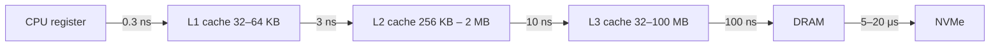

# Cache Lines

## TL;DR

- A **cache line** is the unit of memory transfer between RAM and CPU caches: typically **64 bytes** on x86 / ARM, occasionally 128. **You never read 1 byte from RAM; you always read 64.**
- Sequential access uses every byte of each cache line you fetch → bandwidth-efficient. Strided access wastes 87% of the bandwidth (using 8 bytes of every 64-byte fetch).
- L1 (32–64 KB), L2 (256 KB – 2 MB), L3 (32 MB – 100+ MB), DRAM (TB) — each level is ~5–10× slower and ~10× larger than the one above. **Knowing this hierarchy is the entire CPU performance story.**
- **Cache-friendly = arrays > pointer chasing**. Linked lists, hash tables with chaining, tree traversal all suffer from cache misses; flat arrays and contiguous structs win on modern hardware.
- ML systems engineering applies the same idea on GPU: HBM cache lines are 32–128 bytes; the same locality discipline that wins on CPU wins on GPU coalescing.

## Why this matters

The single largest source of "code that should be fast but isn't" on modern hardware is cache misses. A pointer-chase that misses L1 is ~5 ns. Missing L2 is ~15 ns. Missing L3 (a true DRAM read) is **~100–300 ns**. **A function that does one DRAM read per element on a 1M-element array spends 100 ms just waiting for memory.** The compiler can't fix this — it's a data-layout issue. Knowing how cache lines work is the first lens for any "why is my code slow" investigation.

## Mental model



Each level is roughly 10× slower than the one above it. **Code that fits in L1 runs ~300× faster than code that misses to DRAM.**

## Concrete walkthrough

### The 64-byte unit

When the CPU wants byte at address `0x1234`, the memory controller doesn't fetch one byte — it fetches the whole 64-byte cache line containing `0x1234`. That entire line gets put into L1. Subsequent reads of bytes in the same line are free.

For a 4-byte float, **one cache line = 16 floats**.

```python
# Sequential walk: 1 cache miss per 16 elements
for i in range(N):
    sum += data[i]              # i=0 misses, i=1..15 hit, i=16 misses again

# Strided walk: 1 cache miss per element when stride > 16
for i in range(0, N, 32):
    sum += data[i]              # every read misses
```

The strided walk does fewer total operations but does 32× more cache misses → ~10× slower in practice (memory-bound).

### Real numbers

| Cache level | Size           | Latency     | Bandwidth (per core) |
|-------------|----------------|-------------|------------------------|
| L1d         | 32–48 KB       | 1 ns         | ~200 GB/s             |
| L2          | 256 KB – 2 MB  | 3 ns         | ~150 GB/s             |
| L3          | 32 MB – 100 MB | 10 ns        | ~80 GB/s              |
| DRAM        | TB             | 100–300 ns   | ~30 GB/s (single core) |

These vary by CPU generation but the ratios are stable. The latency gap from L1 to DRAM is the gap between "fast" and "slow" code.

### Why arrays beat linked lists

Linked list traversal:

```cpp
struct Node { int val; Node* next; };
Node* p = head;
while (p) { sum += p->val; p = p->next; }
```

Each `p->next` is a different DRAM address (assuming the list was built by pushing). Every iteration: cache miss. **For a 1M-node list, ~100 ms of DRAM-wait time.**

Array traversal:

```cpp
std::vector<int> v(1'000'000);
for (int x : v) sum += x;
```

Sequential reads → 1 miss per 16 elements (L1 prefetch eats the rest). For 1M elements: ~62K misses × 100 ns = ~6 ms. **17× faster on the same total data.**

This is why C++ veterans always reach for `std::vector` over `std::list`. Linked lists are correct; they're almost never fast.

### Struct layout matters

```cpp
// Bad: sizeof = 80. Reading {x, y, z, mass} per step pulls TWO cache lines —
// the cold tag/padding sits between the hot fields and pushes `mass` past byte 64.
struct Particle {
    double x, y, z;       // bytes 0..23   (line 1)
    char tag;              // byte 24
    char padding[47];     // bytes 25..71 (cold metadata)
    double mass;           // bytes 72..79 (line 2 — second cache miss per step)
};

// Good: hot fields adjacent. sizeof = 32, fits in one 64-byte line. Cold
// metadata moves to a parallel array or a trailing struct.
struct Particle {
    double x, y, z, mass;  // bytes 0..31 — all in one cache line
};
```

Order struct fields by access frequency. Hot fields together; cold fields after. Tools like `cache-conscious data structures` and the Linux `pahole` (struct layout pretty-printer) help.

### Structure-of-Arrays (SoA) vs Array-of-Structures (AoS)

```cpp
// AoS: layout is x0, y0, z0, x1, y1, z1, ...
struct Particle { float x, y, z; };
std::vector<Particle> particles;

// SoA: layout is x0, x1, x2, ..., y0, y1, ..., z0, z1, ...
struct Particles {
    std::vector<float> x, y, z;
};
```

If your hot loop only touches `x` (e.g., a sort by x), SoA is much better — every cache line is full of x-values. If your hot loop touches all three, AoS may be better — each iteration reads a contiguous (x, y, z) triple.

Most ML / numerics code is SoA-shaped. Most game code is AoS or a mix. The choice depends on your access pattern.

### Cache lines on GPU

A GPU "cache line" is the **memory transaction size** — 32 bytes (Hopper L2) or 128 bytes (Hopper HBM). For coalesced loads to be efficient, the 32 threads of a warp must read 32 *adjacent* 4-byte words → one transaction.

This is the same cache-line discipline, scaled up: on CPU, sequential access wins; on GPU, coalesced access wins. The principles transfer directly.

### False sharing

A subtle multi-threaded gotcha:

```cpp
// Two threads each update their own counter
struct Counters {
    std::atomic<int> a, b;     // both fit in one 64-byte cache line!
};

// Thread 1 increments .a; Thread 2 increments .b. The cache line ping-pongs
// between the two CPU cores, even though they're updating different fields.
```

Fix: pad to ensure each counter has its own cache line:

```cpp
struct alignas(64) PaddedCounter { std::atomic<int> v; };
struct Counters {
    PaddedCounter a;
    PaddedCounter b;
};
```

The `alignas(64)` guarantees the counter is on its own cache line. Slowdowns from false sharing can be **2–10×**; the fix is cheap.

## Run it in your browser — sequential vs strided cost

<RunInBrowser
  description="Time sequential vs strided list access. Stride > cache_line_size / element_size triggers a miss per access."
  code={`import time

N = 1_000_000
data = list(range(N))

def sequential_sum():
    s = 0
    for x in data: s += x
    return s

def strided_sum(stride):
    s = 0
    for i in range(0, N, stride):
        s += data[i]
    return s

def benchmark(label, fn, iters=20):
    t0 = time.perf_counter()
    for _ in range(iters): fn()
    return (time.perf_counter() - t0) * 1000 / iters  # ms per iter

print(f"sequential sum (N=1M):           {benchmark('seq', sequential_sum):>7.1f} ms")
for s in (16, 64, 256, 1024, 16384):
    fn = lambda s=s: strided_sum(s)
    print(f"strided sum (stride={s:>5}):       {benchmark('s', fn):>7.1f} ms  ({N//s:>5} reads)")

print()
print("Higher strides → fewer total reads, but each one misses the cache.")
print("On real hardware (no Python interpreter overhead), the gap is much wider.")
print("On C++ raw memory: sequential ~6 ms / 1M floats; strided every cache line ~60 ms.")
`}
/>

The Python overhead damps the effect, but the *shape* (more strided → more misses → more time per byte) is right. In compiled code on a real CPU, the gap is 5–10×.

## Quick check

<FillIn
  prompt="The size of a cache line on most modern CPUs (x86 and ARM):"
  answer="64 bytes"
  accept={["64", "64 bytes", "64B"]}
  hint="A power of 2; the unit of every memory transfer."
  explanation="64 bytes is the cache-line size on virtually every x86 and ARM CPU since the early 2000s. Some Apple Silicon variants use 128. The number drives every cache-conscious design decision."
/>

<Quiz
  question="A team's particle-simulation hot loop touches only the x-coordinate of millions of particles. They use Array-of-Structs (each Particle has x, y, z). Profiling shows ~75% of time in cache misses. The right fix:"
  options={[
    'Add more cores.',
    'Refactor to Structure-of-Arrays so the x array is contiguous in memory.',
    'Switch to a faster CPU.',
    'Cache the result in a hash map.',
  ]}
  answer={1}
  explanation={`AoS wastes ~67% of each cache line when only x is accessed (you load 12 bytes of (x,y,z) per particle, use 4). SoA stores all x's contiguously — 100% cache utilization for the hot loop. This is one of the canonical "data layout matters" optimizations; ~3× speedup is typical.`}
/>

## Key takeaways

1. **64-byte cache lines** are the unit of every memory transfer.
2. **Sequential access wins** because it uses every byte of each line. Strided access wastes bandwidth.
3. **Latency hierarchy is brutal**: L1 (1 ns) → DRAM (100+ ns). Code that fits in cache runs hundreds of times faster.
4. **Arrays beat linked lists** for any hot path. AoS vs SoA is workload-specific.
5. **False sharing in multi-threaded code** is the cache-line-aware gotcha — pad shared atomics to cache-line boundaries.

## Go deeper

<Resources
  items={[
    { kind: 'paper', href: 'https://www.akkadia.org/drepper/cpumemory.pdf', title: 'What Every Programmer Should Know About Memory', author: 'Ulrich Drepper, 2007', note: 'The canonical 100-page treatment. Sections 3 and 6 are most relevant. Slightly dated on numbers but the model is timeless.' },
    { kind: 'blog', href: 'https://en.algorithmica.org/hpc/cpu-cache/', title: 'Algorithmica HPC — CPU Cache', note: 'Modern, hands-on. Includes microbenchmarks and the cache-friendly algorithm catalog.' },
    { kind: 'video', href: 'https://www.youtube.com/watch?v=BP6NxVxDQIs', title: 'Mike Acton — Data-Oriented Design and C++', note: 'CppCon 2014, the definitive "the data layout is the program" talk.' },
    { kind: 'docs', href: 'https://www.intel.com/content/www/us/en/developer/articles/technical/intel-sdm.html', title: 'Intel Software Developer Manual', note: 'Volume 3 covers cache architecture. Reference, not tutorial.' },
    { kind: 'docs', href: 'https://github.com/acmel/dwarves', title: 'pahole (dwarves)', note: 'The struct-layout introspection tool. Run on a binary to see padding, alignment, and cache-line straddling.' },
  ]}
/>

<LessonComplete />
