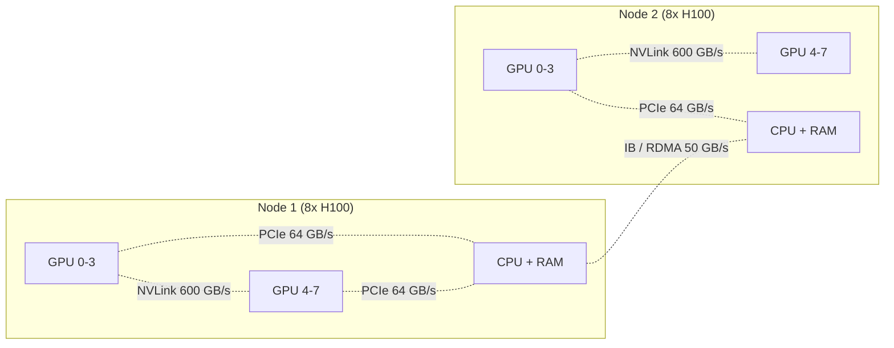

# NUMA & Topology

## TL;DR

- A modern server is **multiple sockets** (CPUs), each with its own memory controller. Memory attached to one socket is **local** to it; memory on the other socket is **remote** — accessing it costs ~2× more latency and ~50% bandwidth.
- This is **NUMA** (Non-Uniform Memory Access). Linux exposes it via `/sys/devices/system/node/`. Tools: `numactl`, `lstopo`, `numastat`. **Pinning processes to NUMA nodes can be a 1.5–3× win on memory-bound workloads.**
- The same idea scales to GPUs: a multi-GPU node has a topology (NVLink mesh, NVSwitch, PCIe). GPU 0 and GPU 1 might be 600 GB/s apart (NVLink); GPU 0 and GPU 7 might be 200 GB/s (one NVSwitch hop).
- Across nodes, **InfiniBand / Ethernet RDMA** add another tier: 25–400 Gb/s between nodes. The topology of a frontier training cluster matters as much as raw GPU count.
- **CXL** (Compute Express Link, 2019+) is the emerging fabric for cache-coherent shared memory across CPUs and accelerators. Production rollout 2024–2026; reshaping how multi-host AI systems are built.

## Why this matters

A 70B-model serving deployment that ignores topology can be 2× slower than the same hardware properly configured. Frontier training stacks (TorchTitan, Megatron-Core, NeMo) all encode topology into their parallelism mesh — TP within NVLink, PP across nodes, etc. Knowing how to read `lstopo` output, what `numactl --cpunodebind` does, and how NCCL discovers GPU topology is the foundation for any serious multi-GPU work.

## Mental model



Bandwidth varies by 10× across the topology hierarchy. **Where data lives determines what speed you actually run at.**

## Concrete walkthrough

### CPU NUMA basics

A dual-socket Xeon server: each socket has 4–8 memory channels feeding ~200 GB/s of local DRAM bandwidth. Memory across the socket boundary travels via UPI (Ultra Path Interconnect) at ~40 GB/s. **5× bandwidth gap; 2× latency gap.**

```bash
$ numactl --hardware
available: 2 nodes (0-1)
node 0 cpus: 0-23 48-71
node 0 size: 192 GB
node 1 cpus: 24-47 72-95
node 1 size: 192 GB
node distances:
node   0   1
  0:  10  21
  1:  21  10
```

The "distance" matrix: `10` = local (1.0×), `21` = remote (2.1× the latency).

A process spawned on node 1 but allocating from node 0's memory pays the cross-socket cost on every memory access. Pinning fixes this:

```bash
numactl --cpunodebind=0 --membind=0 ./my_process
```

Or in code:

```c
#include <numa.h>
numa_run_on_node(0);
numa_set_preferred(0);
```

For ML workloads, the typical setup is one process per NUMA node, GPU bindings matching CPU bindings ("GPU 0–3 on socket 0" type configs).

### `lstopo` — see your machine

```bash
$ lstopo --of png > topology.png
```

`lstopo` (from `hwloc`) generates a diagram showing CPU cores, caches, memory channels, PCIe links, GPUs. The single best tool for understanding "what is connected to what" on a server. Reading it once is enough for most decisions.

### GPU topology

`nvidia-smi topo --matrix`:

```
        GPU0    GPU1    GPU2    GPU3    GPU4    GPU5    GPU6    GPU7
GPU0     X      NV4     NV4     NV4     NV4     NV4     NV4     NV4
GPU1    NV4      X      NV4     NV4     NV4     NV4     NV4     NV4
...
```

`NV4` = 4 NVLink connections direct (intra-NVSwitch fabric). On older topologies you might see:
- `NV2` — 2 NVLink connections.
- `PIX` — same PCIe switch.
- `PHB` — PCIe Host Bridge (across CPU socket).
- `SYS` — across NUMA nodes via CPU.

A `PIX`-connected pair has ~64 GB/s; a `SYS`-connected pair drops to ~10 GB/s. **NCCL automatically uses the best path** but you can hint via `NCCL_TOPO_DUMP_FILE` and `NCCL_NET_GDR_*`.

### NVLink Switch (NVSwitch)

NVIDIA's H100 / H200 / B200 nodes use NVSwitch — a chip that gives every-GPU-to-every-GPU full-bandwidth connectivity. **600 GB/s any-to-any** within a node. This is what makes TP=8 work efficiently across 8 H100s.

Pre-NVSwitch (e.g., DGX-1 V100): GPUs were connected pairwise via NVLinks; some pairs had 4× links, some had 2×. AllReduce algorithms had to be topology-aware.

For Blackwell GB200 (NVL72), the NVSwitch fabric extends across **72 GPUs** with full NVLink bandwidth between any pair. Effectively turns 72 GPUs into "one big GPU" from the comm perspective. Why GB200 NVL72 racks dominate frontier training conversations in 2025–2026.

### Cross-node networking

Two big options for connecting nodes:

- **InfiniBand (IB)**: 200–400 Gb/s. Lower latency, RDMA-native. Standard in AI clusters.
- **RoCEv2 (RDMA over Ethernet)**: 200–400 Gb/s on Ethernet hardware. Cheaper; Meta uses this at scale.

Both support GPU-Direct RDMA: GPU memory on one node can be read directly by another node's GPU without crossing the host CPU. **Roughly half the bandwidth of NVLink (~50–100 GB/s) but vastly better than PCIe-only paths.**

Topology-aware comm (NCCL on H100 + InfiniBand): DP and PP traffic tunneled over IB; TP stays within NVSwitch. This is exactly the parallelism-mesh decision from [Tensor Parallel](../../training/distributed/tensor-parallel) — pinned by topology.

### CXL — the next layer

CXL (Compute Express Link, 1.x in 2019, 3.x in 2024) is a cache-coherent fabric that lets CPUs and accelerators share memory at PCIe-link speeds. Three classes:

- **CXL.io**: PCIe-equivalent device I/O.
- **CXL.cache**: device caches host memory (or vice versa) coherently.
- **CXL.mem**: extend host memory with attached CXL memory devices.

Production CXL (PCIe Gen 5 / 6, ~64 / 128 GB/s) lets you build systems with **shared memory pools** spanning hundreds of GBs across many hosts. Big AI training stacks are starting to evaluate CXL as an alternative to (or complement of) RDMA. As of April 2026, deployment is still early — but it's the architecture conversation worth tracking.

### Production checklist

For any new multi-GPU deployment:

1. `nvidia-smi topo --matrix` — read the GPU connectivity.
2. `numactl --hardware` + `lstopo` — read the CPU/memory topology.
3. Pin processes: one per NUMA node, GPU affinity matching socket affinity.
4. Verify NCCL is using the right transport (`NCCL_DEBUG=INFO`).
5. Match parallelism dims to topology: TP within NVSwitch, PP / DP across.
6. For >1 node: confirm IB / RoCE is in use (not falling back to TCP).

Do these once during system setup; they're foundational to every later perf tuning.

## Run it in your browser — topology cost simulator

<RunInBrowser
  description="Compute the time to AllReduce 1 GB across 8 GPUs given different topologies."
  code={`bandwidth_gbps = {
    'NVLink mesh (NVSwitch)': 600,
    'NVLink pair (NV4)':       400,
    'PCIe Gen 4 (PIX)':         32,
    'PCIe Host Bridge (PHB)':   16,
    'Cross-NUMA (SYS)':         10,
    'IB / RDMA (cross-node)':   50,
    'Ethernet 25 Gbps':          3,
}

def allreduce_time_ms(payload_gb, n_gpus, link_gbps):
    """Ring-AllReduce: 2(N-1)/N × payload bytes per GPU."""
    bytes_total = 2 * (n_gpus - 1) / n_gpus * payload_gb * 1e9
    return bytes_total / (link_gbps * 1e9 / 1000) * 1000

print(f"{'topology':<35} {'1 GB on 8 GPUs':>20} {'ratio':>8}")
print('-' * 65)
ref_t = allreduce_time_ms(1.0, 8, 600)
for name, bw in bandwidth_gbps.items():
    t = allreduce_time_ms(1.0, 8, bw)
    print(f"{name:<35} {t:>15.0f} ms     {t/ref_t:>5.0f}×")

print()
print("AllReduce on 1 GB:")
print("  NVSwitch (intra-node):     2.3 ms — invisible")
print("  Cross-NUMA (CPU-mediated): 140 ms — feels slow")
print("  Plain Ethernet:            470 ms — your training run won't scale")
print()
print("This is why frontier training pins TP within NVLink. The 60× gap is real.")
`}
/>

The shape — orders-of-magnitude bandwidth differences across the topology — is what every training-systems decision encodes. Get the parallelism-to-topology mapping wrong and you're paying the cross-NUMA / Ethernet cost on every layer.

## Quick check

<FillIn
  prompt="The Linux command-line tool for binding a process to a specific NUMA node:"
  answer="numactl"
  accept={["numactl --cpunodebind", "numactl --membind"]}
  hint="Eight letters; combines numa + ctl."
  explanation="`numactl --cpunodebind=0 --membind=0 ./prog` pins both CPU scheduling and memory allocation to NUMA node 0. The single most important command for multi-socket Linux performance work."
/>

<Quiz
  question="A team trains a 70B model on 16 H100s split across 2 nodes (NVLink intra-node, 200 Gb InfiniBand inter-node). Throughput is 40% of expected. Topology check that matters first:"
  options={[
    'Verify NCCL_DEBUG=INFO shows NVLink intra-node AllReduce and IB inter-node — not falling back to TCP/Ethernet.',
    'Increase batch size.',
    'Update CUDA driver.',
    'Switch to a different model.',
  ]}
  answer={0}
  explanation={`The most common "throughput is way below spec" failure mode in distributed training is NCCL falling back to TCP because IB / RoCE wasn't configured. NCCL_DEBUG=INFO shows the transport per channel. If you see "TCP" or "Socket" instead of "IB" or "NCCL_NET=Plugin", that's the bug. Fix: configure IB libraries / firewall / NIC affinity. Often a 3–5× recovery.`}
/>

## Key takeaways

1. **NUMA on CPUs:** local memory is fast, remote is ~2× slower. Pin processes with `numactl`.
2. **GPU topology:** NVLink/NVSwitch within node; PCIe/IB across. ~60× bandwidth gap from best to worst path.
3. **Parallelism-mesh decisions follow topology**: TP within NVLink, PP across nodes, DP everywhere.
4. **`lstopo`, `numactl --hardware`, `nvidia-smi topo --matrix`** are the diagnostic commands. Run them on every new system.
5. **CXL is the emerging fabric** for cache-coherent shared memory across hosts; watch it through 2026–2027.

## Go deeper

<Resources
  items={[
    { kind: 'docs', href: 'https://docs.kernel.org/admin-guide/mm/numa_memory_policy.html', title: 'Linux Kernel — NUMA Memory Policy', note: 'Authoritative on the kernel-side policy: bind, preferred, interleave.' },
    { kind: 'docs', href: 'https://www.open-mpi.org/projects/hwloc/', title: 'hwloc & lstopo', note: 'The portable topology library + visualizer.' },
    { kind: 'docs', href: 'https://docs.nvidia.com/deeplearning/nccl/user-guide/docs/index.html', title: 'NCCL User Guide', note: '"Topology" section explains how NCCL discovers and uses GPU connectivity. NCCL_TOPO_DUMP_FILE is the debugging starting point.' },
    { kind: 'blog', href: 'https://www.nvidia.com/en-us/data-center/nvlink/', title: 'NVIDIA — NVLink and NVSwitch', note: 'Vendor-side architecture overview. Useful for the GB200-NVL72 picture.' },
    { kind: 'docs', href: 'https://www.computeexpresslink.org/', title: 'CXL Consortium', note: 'CXL spec home. Read the high-level docs; the spec itself is dense.' },
    { kind: 'paper', href: 'https://arxiv.org/abs/2409.04497', title: 'A Survey of CXL-Enabled Memory Systems', author: 'Liu et al., 2024', note: 'Modern survey of where CXL is in 2024. Sections 3–4 cover the production deployment status.' },
  ]}
/>

<LessonComplete />
