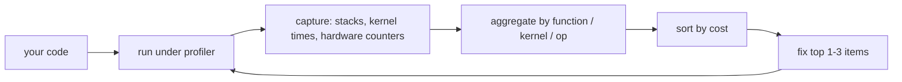

# Profiling Tools

## TL;DR

- **You can't optimize what you can't measure.** Profiling is the discipline of turning "this is slow" into "this specific thing is using N% of cycles for reason X."
- **CPU profilers**: `perf` (Linux), `Instruments` (macOS), VTune (Intel). Sample-based — interrupt periodically, record the call stack, aggregate.
- **GPU profilers**: NVIDIA Nsight Systems (`nsys`) for whole-program timeline; Nsight Compute (`ncu`) for per-kernel deep dive. AMD has rocm-smi + rocprof.
- **eBPF tools** — bpftrace, BCC, Pixie — let you instrument the running kernel without modifying source. Modern Linux observability.
- **PyTorch `torch.profiler`** is the AI-specific tool: layer-level traces, kernel attribution, memory snapshots, integration with Chrome's perfetto for visualization.
- **Always profile before optimizing.** "I thought it was the matmul; turned out it was a Python list comprehension" is the most common debugging story.

## Why this matters

Performance work follows a simple rule: **the bottleneck is never where you expect**. Mosaic's earlier lessons gave you mental models for cache misses, branch prediction, allocator overhead, comm patterns — but applying them blindly is rearranging deck chairs. The first 30% of any optimization session is profiling: capture a representative workload, sort hot paths, identify the costliest contributions, *then* apply the right knowledge. Engineers who skip the profile stage burn weeks on the wrong thing.

## Mental model



Profile → diagnose → fix → re-profile. Skip the loop and you'll optimize the wrong thing.

## Concrete walkthrough

### `perf` — the Linux CPU profiler

```bash
# Sample the running program for 10 seconds; capture call stacks
perf record -F 999 -g -p $(pidof my_program) -- sleep 10

# Show the hot functions
perf report

# Or generate a flame graph (FlameGraph project on GitHub)
perf script | stackcollapse-perf.pl | flamegraph.pl > flame.svg
```

`perf` interrupts the program ~1000 times per second, records the call stack at each interrupt, and reports which functions appear most. Free, low-overhead (~3% slowdown), the default Linux profiler.

The flame graph (Brendan Gregg's invention) is the canonical visualization: x-axis = sample count (proportional to time), y-axis = call-stack depth. Wide stacks = hot. **Read flame graphs once and you'll never want a flat profile again.**

### Hardware counters via `perf`

`perf` also exposes CPU performance counters:

```bash
# Cache misses, branch mispredicts, IPC
perf stat -e cache-misses,branch-misses,instructions,cycles ./my_program

# Output:
#    23,000,000      cache-misses              #    8.5% of all cache refs
#     1,200,000      branch-misses             #    1.5% of all branches
# 9,800,000,000      instructions              #    2.5  insn per cycle
# 3,900,000,000      cycles
```

Counters reveal *why* code is slow:
- High `cache-misses` rate → check data layout, [Cache Lines](./cache-lines).
- High `branch-misses` rate → unpredictable conditionals, see [Branch Prediction](./branch-prediction).
- IPC < 1.0 → likely memory-bound. IPC > 2.0 → compute-bound, work harder on FLOPs.

### Nsight Systems (`nsys`) — GPU timeline

```bash
nsys profile --trace=cuda,nvtx,osrt -o report.qdrep python train.py
nsys-ui report.qdrep    # GUI; or report.qdrep can be opened in a web viewer
```

`nsys` captures every CUDA API call, kernel launch, and CPU-side event into a timeline. Open it; see your training step laid out in time:

- Forward pass kernels in order, with names from cuBLAS / cuDNN / Triton.
- Backward pass, ditto.
- AllReduce / AllGather (NCCL) calls, with bandwidth.
- CPU-side Python overhead (dataloader, optimizer step Python code).
- Idle time between steps.

The single best way to see "where is time going" in a real training run. Production debugging always starts here.

### Nsight Compute (`ncu`) — per-kernel deep dive

When `nsys` shows kernel X is slow, `ncu` tells you why:

```bash
ncu --set full --kernel-name my_kernel python script.py
```

Output (per kernel invocation): tensor-core utilization, SMEM bank conflicts, occupancy, warp scheduler stalls, DRAM bandwidth, L1/L2 hit rates. Hundreds of metrics. **The single tool every kernel author uses.**

Key sections to read:
- `sm__pipe_tensor_op_cycles_active.avg.pct_of_peak_sustained_active` — tensor-core utilization. >70% = healthy.
- `l1tex__shared_st_bank_conflict.sum` and `_ld_bank_conflict.sum` — SMEM conflicts. >0 = fix.
- `smsp__sass_average_data_bytes_per_sector_mem_global_op_ld.pct_of_peak_sustained_elapsed` — coalesced load efficiency.
- Occupancy breakdown — which resource (registers, SMEM, warp slots) is the limit.

### `torch.profiler` — the AI-specific lens

```python
from torch.profiler import profile, ProfilerActivity, schedule

with profile(
    activities=[ProfilerActivity.CPU, ProfilerActivity.CUDA],
    schedule=schedule(wait=2, warmup=2, active=10),
    on_trace_ready=lambda p: p.export_chrome_trace("trace.json"),
    record_shapes=True,
) as prof:
    for batch in loader:
        train_step(batch)
        prof.step()
```

The output `trace.json` opens in Chrome's `chrome://tracing` (or perfetto.dev) with PyTorch op names, shapes, kernel attribution. **The right level of abstraction for ML perf work**: aggregates above raw kernels, attributable to your model code.

Key views:
- **Tracer view**: timeline of ops. Look for gaps (CPU bottleneck) or huge ops (kernel issue).
- **Operator stats**: aggregate time per torch op. The "self CUDA time" column is what to sort by.
- **Memory profile** (`profile_memory=True`): allocations / frees over time. Spot fragmentation.

### eBPF — observability without instrumentation

Modern Linux supports running BPF programs in the kernel that hook into syscalls, function entries, hardware counters. Tools:

- **`bpftrace`**: ad-hoc one-liners. `bpftrace -e 'tracepoint:syscalls:sys_enter_read { @[comm] = count(); }'` counts read() calls per process.
- **BCC**: Python wrapper for BPF. Many ready-to-use tools: `tcptracer`, `gpuperf`, etc.
- **Pixie / Parca / Polar Signals**: production-grade always-on profilers built on eBPF.

For ML production, eBPF profilers (Parca, Polar Signals) let you see live CPU profiles of every process in a Kubernetes cluster with ~1% overhead. The 2024+ standard for "what is my fleet doing right now."

### A complete profiling session

For "training run is slow":

1. **Wall-clock per step**: Add `start.record(); step(); end.record(); torch.cuda.synchronize(); print(start.elapsed_time(end))`. Establish baseline.
2. **`nsys profile`**: capture 100 steps. Open the timeline.
3. **Identify gaps**: CPU bottleneck? GPU idle? Skewed across nodes (DP imbalance)?
4. **If GPU compute is hot**: identify the slowest kernel via `nsys`, then `ncu` it.
5. **If CPU is the bottleneck**: `py-spy` on the Python process. Often dataloader.
6. **If comm is the bottleneck**: NCCL_DEBUG=INFO; check topology + transport.
7. **Fix the top thing**, re-profile.

This loop is what every distributed-training engineer runs through monthly.

## Run it in your browser — toy profiler

<RunInBrowser
  description="A 30-line Python sampler that counts time per function. The same idea perf uses, much simpler."
  code={`import time, sys, signal, threading
from collections import Counter
import inspect

class SamplingProfiler:
    def __init__(self, interval=0.001):
        self.samples = Counter()
        self.interval = interval
        self.running = False

    def _sample(self):
        while self.running:
            time.sleep(self.interval)
            for tid, frame in sys._current_frames().items():
                stack = []
                while frame:
                    stack.append(frame.f_code.co_name)
                    frame = frame.f_back
                # Top of the call stack is most recent
                self.samples[tuple(stack)] += 1

    def __enter__(self):
        self.running = True
        self.thread = threading.Thread(target=self._sample, daemon=True)
        self.thread.start()
        return self

    def __exit__(self, *args):
        self.running = False
        self.thread.join(timeout=1)

    def report(self, top=10):
        # Aggregate by leaf function (most-recent frame)
        leaves = Counter()
        for stack, count in self.samples.items():
            if stack: leaves[stack[0]] += count
        total = sum(leaves.values())
        print(f"\\n{'function':<30} {'samples':>8} {'pct':>6}")
        print('-' * 50)
        for fn, n in leaves.most_common(top):
            print(f"{fn:<30} {n:>8} {n/total:>5.1%}")

# Test workload: hot loop + occasional slow op
def hot_loop():
    s = 0
    for i in range(2_000_000): s += i
    return s

def slow_op():
    time.sleep(0.05)

def workload():
    for _ in range(10):
        hot_loop()
        slow_op()

with SamplingProfiler(interval=0.001) as prof:
    workload()

prof.report()
print()
print("hot_loop dominates total samples; slow_op shows up as 'sleep' calls.")
print("Real perf does the same thing but with C-level signals and µs precision.")
`}
/>

This 30-line sampler is the conceptual core of `perf`. Real profilers add: kernel-side stack capture (no GIL), hardware counters, kernel symbols, multi-process aggregation. The algorithm is the same.

## Quick check

<FillIn
  prompt="The NVIDIA tool for capturing a whole-program GPU timeline (forward, backward, NCCL, kernel names):"
  answer="Nsight Systems"
  accept={["nsys", "Nsight Systems (nsys)"]}
  hint="Two-word product name; CLI is `nsys`."
  explanation={`Nsight Systems (nsys) captures CUDA API calls, kernel launches, NVTX ranges, and CPU activity into a timeline that opens in nsys-ui. The first tool to reach for in any "training is slow" investigation.`}
/>

<Quiz
  question="A team's training run is at 30% scaling efficiency on 8 GPUs. They suspect the model. The right first move:"
  options={[
    'Rewrite the model in C++.',
    '`nsys profile` a few steps, open the timeline, see whether the bottleneck is GPU compute, CPU dataloader, or NCCL comm.',
    'Switch to a different framework.',
    'Reduce batch size.',
  ]}
  answer={1}
  explanation='30% scaling efficiency could be any of: dataloader-CPU bottleneck, comm-bound DP, kernel-level inefficiency, NCCL falling back to TCP, etc. The timeline tells you which immediately. Without profiling, you guess. The "rewrite the model" reflex is the most-skipped middle step in optimization work.'
/>

## Key takeaways

1. **Profile before you optimize.** It is *always* cheaper than guessing.
2. **`perf` for CPU, `nsys` for GPU timeline, `ncu` for per-kernel.** Plus `torch.profiler` for ML-specific.
3. **Hardware counters reveal cause**: cache-misses, branch-misses, IPC, tensor-core utilization.
4. **eBPF is the modern Linux observability layer** — tools like Parca and Polar Signals make always-on production profiling cheap.
5. **The loop is profile → fix top item → re-profile.** Don't skip the re-profile — fixes often surface a new bottleneck.

## Go deeper

<Resources
  items={[
    { kind: 'blog', href: 'https://www.brendangregg.com/perf.html', title: 'Brendan Gregg — perf Examples', note: 'Canonical reference. Memorize the FlameGraph workflow.' },
    { kind: 'docs', href: 'https://developer.nvidia.com/nsight-systems', title: 'NVIDIA — Nsight Systems', note: 'The product. "Quick Start" + "Best Practices" are the right pages.' },
    { kind: 'docs', href: 'https://developer.nvidia.com/nsight-compute', title: 'NVIDIA — Nsight Compute', note: 'For per-kernel deep dive. The "Metrics Reference" is huge but you only need to know ~20 metrics for daily work.' },
    { kind: 'docs', href: 'https://pytorch.org/docs/stable/profiler.html', title: 'PyTorch torch.profiler', note: 'Authoritative. Section on "Holistic Trace Analysis" covers the multi-step workflow.' },
    { kind: 'blog', href: 'https://www.brendangregg.com/flamegraphs.html', title: 'FlameGraphs — Brendan Gregg', note: 'The visualization technique that changed how every engineer reads profiler output.' },
    { kind: 'docs', href: 'https://ebpf.io/', title: 'eBPF.io', note: 'Modern Linux observability. The "What is eBPF" intro is the right starting point.' },
    { kind: 'repo', href: 'https://github.com/iovisor/bcc', title: 'iovisor/bcc', note: 'Battle-tested BPF tools. `tools/` directory is a treasure chest.' },
  ]}
/>

<LessonComplete />
