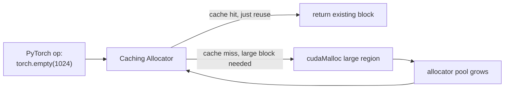

# PyTorch Caching Allocator

<Mode is="learn">

`cudaMalloc` is shockingly slow. Asking the GPU driver for a fresh chunk of memory costs about **50 microseconds** — a glacial eternity in GPU time, where individual matrix multiplications complete in single-digit microseconds. If every PyTorch call to `torch.empty(...)` actually went to the driver, training a 7B model would spend more time waiting for memory than doing math.

This is the same problem the [Stack vs Heap](./stack-vs-heap) lesson set up: **don't touch the allocator on the hot path**. The trick is to grab a giant region of memory once at startup and hand out little pieces of it ourselves. When a tensor is freed, we keep its memory in our own pool and reuse it for the next allocation.

That's the **PyTorch caching allocator**. Steady-state allocation cost: ~1 microsecond. Same job, 50× faster. The same pattern shows up in every other production system that needs fast malloc: jemalloc, tcmalloc, slab allocators, <Term name="arena">arena allocators</Term>. This lesson is the canonical example.

## TL;DR

- **`cudaMalloc` and `cudaFree` are slow** — ~50 μs and ~10 μs respectively. Calling them on every forward / backward step would dominate small-model training.
- **The PyTorch caching allocator** is a userspace pool: it grabs large chunks from `cudaMalloc` upfront, hands out sub-allocations, and reuses them as tensors come and go. **`torch.empty(N)` typically costs 0–1 μs** in steady state.
- The same pattern shows up everywhere production C++ goes fast: jemalloc, tcmalloc, <Term name="arena">arena allocators</Term>, slab allocators. **"Don't call malloc on the hot path"** is the universal performance discipline.
- The PyTorch allocator splits, merges, recycles blocks; tracks per-stream allocations to avoid hazards on async work; offers an "expandable segments" mode (2024+) that grows as needed.
- **Read `torch.cuda.memory_summary()`** to see what the allocator is doing. Fragmentation, peak allocation, and reserved-vs-allocated are the metrics that matter.

## The lifecycle of one tensor allocation



99% of allocations hit the cache. 1% (warmup, growth events, OOM-recovery) call into `cudaMalloc`.

```python
x = torch.empty(1024, 1024, device='cuda')   # 4 MB allocation
```

Behind that one line:

1. PyTorch's allocator looks for a free block of >= 4 MB in its pool, on the right device + <Term name="cuda stream">stream</Term>.
2. **Cache hit**: returns the block. Cost: ~1 μs.
3. **Cache miss**: allocator calls `cudaMalloc` for a *larger* chunk (say 64 MB), splits off 4 MB, returns it. Cost: ~50 μs (the cudaMalloc).
4. When `x` goes out of scope: the block is *not* freed back to CUDA — it's returned to the allocator's pool, marked free, available for reuse.

The pool grows under demand and never shrinks (until process exit) by default. That's actually fine for training: peak memory is allocated once, then reused forever.

## Splitting and merging

The allocator maintains free blocks of various sizes. When a request comes in:

- Find the smallest free block >= the request.
- If it's exactly the right size: take it.
- If it's larger: split into (request) + (remainder); add the remainder back to the free list.

When a block is freed:

- Mark it free.
- Try to coalesce with adjacent free blocks (forming larger free regions).

This is **buddy-allocator-like** but with PyTorch-specific tweaks (alignment, stream-awareness, fragmentation heuristics).

## Stream awareness — the GPU twist

GPUs are async. Two CUDA streams can run kernels concurrently. If thread A frees a tensor while thread B's kernel is *still using it* (because B's kernel hasn't completed yet), you have a use-after-free that won't blow up immediately — it will silently corrupt your results.

The caching allocator solves this by **tagging each block with the stream that allocated it**. A block freed on stream A can only be reused by an allocation on stream A — until A's events have synchronized. Cross-stream reuse requires explicit `record_stream()` calls.

For most users this is invisible. For multi-stream code (custom kernels, overlapping data loading with compute), getting it wrong manifests as race conditions and memory corruption.

## The two big environment knobs

```bash
PYTORCH_CUDA_ALLOC_CONF=expandable_segments:True
PYTORCH_CUDA_ALLOC_CONF=garbage_collection_threshold:0.8,max_split_size_mb:128
```

- **`expandable_segments`**: enables a 2024+ allocator mode where memory regions grow on demand instead of being fixed-size. Reduces fragmentation; usually a win for training.
- **`max_split_size_mb`**: don't split blocks above this size. Prevents fragmenting a giant pool into many small pieces. Useful when you have one big tensor + many small ones.
- **`garbage_collection_threshold`**: when the allocator approaches OOM, force a GC pass freeing unused cached blocks back to CUDA before retrying.

These knobs matter when you hit "CUDA OOM but `nvidia-smi` shows free memory." That's almost always fragmentation — the allocator has the bytes but no contiguous block big enough.

## Reading the memory summary

```python
print(torch.cuda.memory_summary())
```

Three numbers worth knowing:

- **Allocated memory**: bytes the allocator has handed out to live tensors.
- **Reserved memory**: bytes the allocator has grabbed from CUDA (≥ allocated; the difference is cached free blocks).
- **Active vs Inactive blocks**: allocated vs freed-but-cached.

Healthy training: allocated < reserved by a moderate margin (~10–30%); slowly-changing across steps.
Unhealthy: reserved bloats while allocated stays flat → fragmentation.

## Same pattern, other places

The general pattern — pool memory upfront, reuse — appears in:

- **jemalloc** / **tcmalloc**: replacement CPU allocators. Production C++ standard.
- **Linux slab allocator**: kernel object allocator.
- **<Term name="arena">Arena allocators</Term>** in Rust (`bumpalo`), C++ (`std::pmr::monotonic_buffer_resource`), Go (`sync.Pool`).
- **Custom AI kernel pools** (cuBLAS workspace, FlashAttention scratch, etc.).

If you're writing performance-critical code, an arena or pool is usually somewhere in your design.

## Custom allocators in C++

```cpp
#include <memory_resource>

std::pmr::monotonic_buffer_resource pool(1 << 20);  // 1 MB pool
std::pmr::vector<float> v{&pool};                    // allocates from pool
```

`monotonic_buffer_resource` allocates from a pre-sized buffer and never frees individual blocks (it frees the whole pool at end). Perfect for "transient" data with bounded lifetime — e.g., a per-request workspace in a serving system.

For tensor-heavy workloads, the production move is something like PyTorch's allocator: a free-list of chunks, refcounted blocks, stream-aware. The C++ standard library doesn't ship a perfect equivalent; teams roll their own.

## Run it in your browser — pool allocator simulator

<RunInBrowser
  description="A toy pool allocator. Watch hits/misses as we churn through allocations."
  code={`from collections import defaultdict

class PoolAllocator:
    def __init__(self):
        # Free blocks indexed by size, simplistic
        self._pool = defaultdict(list)
        self.allocations = 0
        self.cudaMalloc_calls = 0

    def allocate(self, size):
        self.allocations += 1
        # Try to find a free block of >= size
        for sz in sorted(self._pool):
            if sz >= size and self._pool[sz]:
                block = self._pool[sz].pop()
                # If much larger, split (skip splitting in this toy)
                return block
        # Cache miss — call cudaMalloc
        self.cudaMalloc_calls += 1
        block = f"block_{self.allocations}_size{size}"
        return block

    def free(self, block, size):
        self._pool[size].append(block)

    def stats(self):
        return f"allocations={self.allocations}, cudaMalloc_calls={self.cudaMalloc_calls}, hit_rate={1 - self.cudaMalloc_calls/max(1,self.allocations):.1%}"

alloc = PoolAllocator()

# Simulate 100 training steps; each step allocates 5 tensors of varying sizes
import random
random.seed(42)
for step in range(100):
    blocks = []
    for _ in range(5):
        size = random.choice([1024, 4096, 16384, 65536, 262144])
        blocks.append((alloc.allocate(size), size))
    # End-of-step: free everything
    for b, s in blocks:
        alloc.free(b, s)

print(alloc.stats())
print()
print("After warmup, hit rate is essentially 100% — the pool's stable size matches the workload.")
print("PyTorch's caching allocator is exactly this idea, with stream-awareness and splitting.")
`}
/>

You'll typically see ~95–100% hit rate after a few iterations of the warmup loop — exactly how the PyTorch caching allocator behaves once your model's memory pattern stabilizes.

## Quick check

<FillIn
  prompt="The PYTORCH_CUDA_ALLOC_CONF flag that helps prevent fragmentation by allowing memory regions to grow on demand:"
  answer="expandable_segments"
  accept={["expandable_segments:True", "expandable segments"]}
  hint="One environment variable name; you toggle it to True."
  explanation="Setting `PYTORCH_CUDA_ALLOC_CONF=expandable_segments:True` lets the allocator grow memory regions instead of pre-sizing them. The 2024+ default for fragmentation-prone workloads."
/>

<Quiz
  question="A user reports `CUDA out of memory` but `nvidia-smi` shows 12 GB free. The most likely cause:"
  options={[
    'GPU hardware fault.',
    'Allocator fragmentation: PyTorch has the bytes, but no single contiguous free block is large enough for the request.',
    'They forgot to call `torch.cuda.empty_cache()`.',
    'Driver mismatch.',
  ]}
  answer={1}
  explanation="Classic fragmentation. Try: enable `expandable_segments:True`, lower `max_split_size_mb`, or call `torch.cuda.empty_cache()` (which forcibly returns cached blocks to CUDA — slow but unblocks). Long-term: keep peak memory pattern stable; mixing very-large and very-small allocations in the same workload aggravates fragmentation."
/>

## Key takeaways

1. **`cudaMalloc` is slow; the caching allocator amortizes it.** Steady-state allocation is ~1 μs.
2. **Pool, split, merge, recycle.** Same pattern as jemalloc, slab allocators, arenas.
3. **Stream-aware** to prevent use-after-free across async streams.
4. **`expandable_segments` and `max_split_size_mb` are the OOM-debugging knobs.** Fragmentation is the usual failure mode.
5. **`torch.cuda.memory_summary()` is your friend.** Check allocated vs reserved; high reserved/low allocated = fragmentation.

## Go deeper

<Resources
  items={[
    { kind: 'docs', href: 'https://pytorch.org/docs/stable/notes/cuda.html#memory-management', title: 'PyTorch — CUDA Memory Management', note: 'Authoritative. The "Caching Allocator" + "Memory Snapshot" sections.' },
    { kind: 'blog', href: 'https://pytorch.org/blog/understanding-gpu-memory-1/', title: 'PyTorch Blog — Understanding GPU Memory', note: 'Two-part series with profiling and debugging recipes.' },
    { kind: 'docs', href: 'https://pytorch.org/docs/stable/torch_cuda_memory.html', title: 'PyTorch — torch.cuda.memory APIs', note: 'memory_snapshot, memory_summary, memory_stats — the introspection toolkit.' },
    { kind: 'blog', href: 'https://google.github.io/tcmalloc/overview.html', title: 'tcmalloc Overview', note: 'CPU-side analogue. Reading helps cement the pool-allocator design pattern.' },
    { kind: 'repo', href: 'https://github.com/pytorch/pytorch/blob/main/c10/cuda/CUDACachingAllocator.cpp', title: 'PyTorch — CUDACachingAllocator', note: 'The source. ~3000 lines of C++; the most-read PyTorch internals file. Worth reading once.' },
    { kind: 'video', href: 'https://www.youtube.com/watch?v=B8mP_uvqRqo', title: 'PyTorch DevCon — Inside the CUDA Caching Allocator', note: 'PyTorch core devs walk through the implementation.' },
  ]}
/>

</Mode>

<Mode is="reference">

> **Prereqs:** [Stack vs Heap](./stack-vs-heap), [Smart Pointers & RAII](./smart-pointers). This lesson is about the "you're not actually calling `cudaMalloc`" piece.

## TL;DR

- **`cudaMalloc` and `cudaFree` are slow** — ~50 μs and ~10 μs respectively. Calling them on every forward / backward step would dominate small-model training.
- **The PyTorch caching allocator** is a userspace pool: it grabs large chunks from `cudaMalloc` upfront, hands out sub-allocations, and reuses them as tensors come and go. **`torch.empty(N)` typically costs 0–1 μs** in steady state.
- The same pattern shows up everywhere production C++ goes fast: jemalloc, tcmalloc, arena allocators, slab allocators. **"Don't call malloc on the hot path"** is the universal performance discipline.
- The PyTorch allocator splits, merges, recycles blocks; tracks per-stream allocations to avoid hazards on async work; offers an "expandable segments" mode (2024+) that grows as needed.
- **Read `torch.cuda.memory_summary()`** to see what the allocator is doing. Fragmentation, peak allocation, and reserved-vs-allocated are the metrics that matter.

## Why this matters

A 7B-model training step allocates and frees thousands of intermediate tensors. If each `cudaMalloc` took 50 μs, just allocations would consume hundreds of ms per step — more than the actual math. **The caching allocator amortizes this to near zero.** Knowing that it exists, what its failure modes are (fragmentation, OOM that's not actually OOM), and how to read its stats is the first move when debugging memory in any modern ML system.

## Mental model


99% of allocations hit the cache. 1% (warmup, growth events, OOM-recovery) call into `cudaMalloc`.

## Concrete walkthrough

### The lifecycle of one tensor allocation

```python
x = torch.empty(1024, 1024, device='cuda')   # 4 MB allocation
```

What happens under the hood:

1. PyTorch's allocator looks for a free block of >= 4 MB in its pool, on the right device + stream.
2. **Cache hit**: returns the block. Cost: ~1 μs.
3. **Cache miss**: allocator calls `cudaMalloc` for a *larger* chunk (say 64 MB), splits off 4 MB, returns it. Cost: ~50 μs (the cudaMalloc).
4. When `x` goes out of scope: the block is *not* freed — it's returned to the allocator pool, marked free, available for reuse.

The pool grows under demand and never shrinks (until process exit) by default. This is fine for training: peak memory is allocated once, reused forever.

### Splitting and merging

The allocator maintains free blocks of various sizes. When a request comes in:

- Find the smallest free block >= the request.
- If exactly the size: take it.
- If larger: split into (request) + (remainder); add remainder back to the free list.

When a block is freed:

- Mark it free.
- Try to coalesce with adjacent free blocks (forming larger free regions).

This is **buddy-allocator-like** but with PyTorch-specific tweaks (alignment, stream-awareness, fragmentation heuristics).

### Stream awareness

GPUs are async. Two CUDA streams can run kernels concurrently. If thread A frees a tensor while thread B's kernel is *still using it* (because the kernel hasn't completed), you have a use-after-free.

The caching allocator solves this by **tagging each block with its stream**. A block freed on stream A can only be reused by an allocation on stream A — until A's events have synchronized. Cross-stream reuse requires explicit `record_stream()` calls.

For most users this is invisible. For multi-stream code (custom kernels, overlapping data loading with compute), getting it wrong manifests as race conditions and memory corruption.

### The two big environment knobs

```bash
PYTORCH_CUDA_ALLOC_CONF=expandable_segments:True
PYTORCH_CUDA_ALLOC_CONF=garbage_collection_threshold:0.8,max_split_size_mb:128
```

- **`expandable_segments`**: enables a 2024+ allocator mode where memory regions grow on demand instead of being fixed-size. Reduces fragmentation; usually a win for training. Default is being made True over time but check your version.
- **`max_split_size_mb`**: don't split blocks above this size. Prevents fragmenting a giant pool into many small pieces. Useful when you have one big tensor + many small ones.
- **`garbage_collection_threshold`**: when allocator approaches OOM, force a GC pass freeing unused cached blocks back to CUDA before retrying.

These knobs matter when you hit "CUDA OOM but `nvidia-smi` shows free memory." That's almost always fragmentation — the allocator has the bytes but no contiguous block big enough.

### Reading the memory summary

```python
print(torch.cuda.memory_summary())
```

Key sections:
- **Allocated memory**: bytes the allocator has handed out to live tensors.
- **Reserved memory**: bytes the allocator has grabbed from CUDA (≥ allocated; the difference is cached free blocks).
- **Active vs Inactive blocks**: allocated vs freed-but-cached.
- **Allocations / Frees per stream**: high values per step → heavy alloc churn.

Healthy training: allocated < reserved by a moderate margin (~10–30%); slowly-changing across steps.
Unhealthy: reserved bloats while allocated stays flat → fragmentation.

### Same pattern, other places

The general pattern — pool memory upfront, reuse — appears in:

- **jemalloc** / **tcmalloc**: replacement CPU allocators. Production C++ standard.
- **Linux slab allocator**: kernel object allocator.
- **Arena allocators** in Rust (`bumpalo`), C++ (`std::pmr::monotonic_buffer_resource`), Go (`sync.Pool`).
- **Custom AI kernel pools** (cuBLAS workspace, FlashAttention scratch, etc.).

If you write performance-critical code, an arena or pool is usually somewhere in your design.

### Custom allocators in C++

```cpp
#include <memory_resource>

std::pmr::monotonic_buffer_resource pool(1 << 20);  // 1 MB pool
std::pmr::vector<float> v{&pool};                    // allocates from pool
```

`monotonic_buffer_resource` allocates from a pre-sized buffer and never frees individual blocks (it frees the whole pool at end). Perfect for "transient" data with bounded lifetime — e.g., a per-request workspace in a serving system.

For tensor-heavy workloads, the production move is something like PyTorch's allocator: a free-list of chunks, refcounted blocks, stream-aware. The C++ standard library doesn't ship a perfect equivalent; teams roll their own.

## Run it in your browser — pool allocator simulator

<RunInBrowser
  description="A toy pool allocator. Watch hits/misses as we churn through allocations."
  code={`from collections import defaultdict

class PoolAllocator:
    def __init__(self):
        # Free blocks indexed by size, simplistic
        self._pool = defaultdict(list)
        self.allocations = 0
        self.cudaMalloc_calls = 0

    def allocate(self, size):
        self.allocations += 1
        # Try to find a free block of >= size
        for sz in sorted(self._pool):
            if sz >= size and self._pool[sz]:
                block = self._pool[sz].pop()
                # If much larger, split (skip splitting in this toy)
                return block
        # Cache miss — call cudaMalloc
        self.cudaMalloc_calls += 1
        block = f"block_{self.allocations}_size{size}"
        return block

    def free(self, block, size):
        self._pool[size].append(block)

    def stats(self):
        return f"allocations={self.allocations}, cudaMalloc_calls={self.cudaMalloc_calls}, hit_rate={1 - self.cudaMalloc_calls/max(1,self.allocations):.1%}"

alloc = PoolAllocator()

# Simulate 100 training steps; each step allocates 5 tensors of varying sizes
import random
random.seed(42)
for step in range(100):
    blocks = []
    for _ in range(5):
        size = random.choice([1024, 4096, 16384, 65536, 262144])
        blocks.append((alloc.allocate(size), size))
    # End-of-step: free everything
    for b, s in blocks:
        alloc.free(b, s)

print(alloc.stats())
print()
print("After warmup, hit rate is essentially 100% — the pool's stable size matches the workload.")
print("PyTorch's caching allocator is exactly this idea, with stream-awareness and splitting.")
`}
/>

You'll typically see ~95–100% hit rate after a few iterations of the warmup loop — exactly how the PyTorch caching allocator behaves once your model's memory pattern stabilizes.

## Quick check

<FillIn
  prompt="The PYTORCH_CUDA_ALLOC_CONF flag that helps prevent fragmentation by allowing memory regions to grow on demand:"
  answer="expandable_segments"
  accept={["expandable_segments:True", "expandable segments"]}
  hint="One environment variable name; you toggle it to True."
  explanation="Setting `PYTORCH_CUDA_ALLOC_CONF=expandable_segments:True` lets the allocator grow memory regions instead of pre-sizing them. The 2024+ default for fragmentation-prone workloads."
/>

<Quiz
  question="A user reports `CUDA out of memory` but `nvidia-smi` shows 12 GB free. The most likely cause:"
  options={[
    'GPU hardware fault.',
    'Allocator fragmentation: PyTorch has the bytes, but no single contiguous free block is large enough for the request.',
    'They forgot to call `torch.cuda.empty_cache()`.',
    'Driver mismatch.',
  ]}
  answer={1}
  explanation="Classic fragmentation. Try: enable `expandable_segments:True`, lower `max_split_size_mb`, or call `torch.cuda.empty_cache()` (which forcibly returns cached blocks to CUDA — slow but unblocks). Long-term: keep peak memory pattern stable; mixing very-large and very-small allocations in the same workload aggravates fragmentation."
/>

## Key takeaways

1. **`cudaMalloc` is slow; the caching allocator amortizes it.** Steady-state allocation is ~1 μs.
2. **Pool, split, merge, recycle.** Same pattern as jemalloc, slab allocators, arenas.
3. **Stream-aware** to prevent use-after-free across async streams.
4. **`expandable_segments` and `max_split_size_mb` are the OOM-debugging knobs.** Fragmentation is the usual failure mode.
5. **`torch.cuda.memory_summary()` is your friend.** Check allocated vs reserved; high reserved/low allocated = fragmentation.

## Go deeper

<Resources
  items={[
    { kind: 'docs', href: 'https://pytorch.org/docs/stable/notes/cuda.html#memory-management', title: 'PyTorch — CUDA Memory Management', note: 'Authoritative. The "Caching Allocator" + "Memory Snapshot" sections.' },
    { kind: 'blog', href: 'https://pytorch.org/blog/understanding-gpu-memory-1/', title: 'PyTorch Blog — Understanding GPU Memory', note: 'Two-part series with profiling and debugging recipes.' },
    { kind: 'docs', href: 'https://pytorch.org/docs/stable/torch_cuda_memory.html', title: 'PyTorch — torch.cuda.memory APIs', note: 'memory_snapshot, memory_summary, memory_stats — the introspection toolkit.' },
    { kind: 'blog', href: 'https://google.github.io/tcmalloc/overview.html', title: 'tcmalloc Overview', note: 'CPU-side analogue. Reading helps cement the pool-allocator design pattern.' },
    { kind: 'repo', href: 'https://github.com/pytorch/pytorch/blob/main/c10/cuda/CUDACachingAllocator.cpp', title: 'PyTorch — CUDACachingAllocator', note: 'The source. ~3000 lines of C++; the most-read PyTorch internals file. Worth reading once.' },
    { kind: 'video', href: 'https://www.youtube.com/watch?v=B8mP_uvqRqo', title: 'PyTorch DevCon — Inside the CUDA Caching Allocator', note: 'PyTorch core devs walk through the implementation.' },
  ]}
/>

</Mode>

<LessonComplete />
