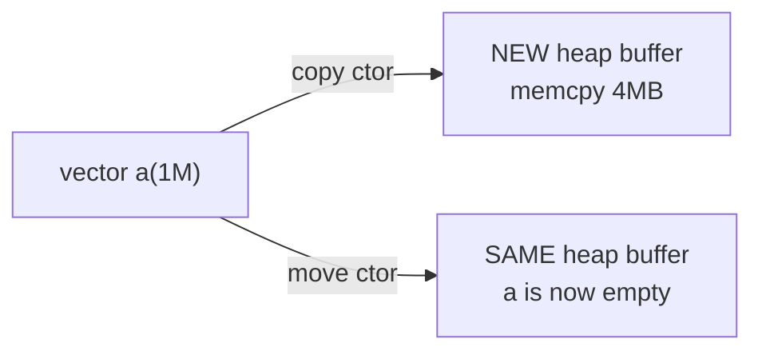

# Move Semantics

> **Prereq:** [Stack vs Heap](./stack-vs-heap). Move semantics are a way to avoid the heap traffic that a naive copy would cause.

## TL;DR

- A **copy** of a `vector<float>` of size N allocates a fresh heap buffer and `memcpy`s N floats. **A move** swaps internal pointers and leaves the source empty. **Same result; ~10000× faster.**
- C++11 added **rvalue references (`T&&`)** and `std::move` to express "I'm done with this; you can take its guts." Modern C++ depends on them everywhere — every standard container, every smart pointer.
- The **rule of zero** is the modern C++ design ideal: write classes that don't need a destructor, copy constructor, or move constructor — let the compiler synthesize them from member types. PyTorch's tensor classes follow this almost completely.
- **Return-value optimization (RVO)** has made many naive returns "free" for years; move semantics fill in the gaps RVO can't reach (e.g., returning one of two locals).
- For ML systems code: **heap allocations on a hot path are the enemy.** Move semantics + small-buffer optimization + arena allocators are the toolkit for keeping tensors out of malloc.

## Why this matters

A naïve `std::vector<float> y = compute(x)` could allocate a fresh buffer and copy data. With moves, it doesn't. Across a transformer forward pass with thousands of intermediate tensors, the difference between "every result is a move" and "every result is a copy" is tens of milliseconds per token. **All modern PyTorch internals, every CUDA kernel wrapper, every model-loading path is built on move semantics.** Without them, the same code would run an order of magnitude slower.

## Mental model



A copy duplicates the buffer. A move steals the buffer pointer and zeroes the source. Same observable outcome; very different cost.

## Concrete walkthrough

### Lvalues, rvalues, and `T&&`

Every C++ expression is either an **lvalue** (named, has an address) or an **rvalue** (temporary, no address you can name).

```cpp
int x = 5;
int&  l = x;     // OK — bind lvalue ref to lvalue
int&& r = 5;     // OK — bind rvalue ref to rvalue
int&  bad = 5;   // ERROR — can't bind lvalue ref to rvalue
int&& bad2 = x;  // ERROR — x is an lvalue (named)
```

`T&&` is the type that says "I want a temporary." Function overloads on `T&&` get called when the argument is an rvalue:

```cpp
void take(const std::vector<float>& v);  // copy version
void take(std::vector<float>&& v);       // move version

std::vector<float> a(1000);
take(a);             // calls copy version (a is an lvalue)
take(std::move(a));  // calls move version; a is now in a "moved-from" state
```

`std::move(a)` is just a cast — it produces an rvalue from `a`. After it, `a` is *valid but unspecified* (per the standard). Don't read from it; do destroy it.

### Move constructors and assignment

A class with a heap buffer should provide:

```cpp
struct Buffer {
  float* data;
  size_t n;

  // Copy: allocate + memcpy. SLOW.
  Buffer(const Buffer& other) : n(other.n) {
    data = new float[n];
    std::memcpy(data, other.data, n * sizeof(float));
  }

  // Move: steal pointer. FAST.
  Buffer(Buffer&& other) noexcept : data(other.data), n(other.n) {
    other.data = nullptr;
    other.n = 0;
  }

  ~Buffer() { delete[] data; }
};
```

`std::vector`, `std::unique_ptr`, `std::string`, and every well-behaved C++ container has roughly this shape. `noexcept` on the move constructor matters — without it, `vector::resize` falls back to copying for safety.

### Rule of zero, three, and five

- **Rule of zero**: don't define any of (destructor, copy ctor, move ctor, copy assignment, move assignment). Let the compiler synthesize them from members.
- **Rule of three**: if you need one of (destructor, copy ctor, copy assignment), you probably need all three.
- **Rule of five**: same with move ctor + move assignment added.

Modern C++ favors rule-of-zero design: have your class hold its resources via `std::vector`, `std::unique_ptr`, etc., and the compiler does the right thing. Hand-written destructors are a sign you should reach for one of those wrappers.

### Return-value optimization

```cpp
std::vector<float> make_big() {
  std::vector<float> v(1'000'000);
  // ... fill v ...
  return v;          // RVO: constructed directly in caller's frame, no copy
}

auto x = make_big(); // no allocation, no copy
```

The compiler is allowed (and required, since C++17 for some cases) to elide the copy here. Even without `std::move`, returning a local by value is essentially free. **Don't write `return std::move(v)`** — it can defeat RVO and force a move when the compiler would have done zero copies.

### Where it shows up in ML

Every PyTorch op returns a Tensor by value. Internally the tensor is a small struct (~64 bytes) wrapping a refcounted storage pointer. Move semantics let you write:

```python
y = relu(x @ w + b)
```

and have it produce one final tensor with no intermediate-tensor copies. The C++ side moves intermediates as it goes; the Python side never knows.

When you call `.contiguous()` on a non-contiguous tensor, that *does* allocate. Most other ops operate via views or in-place. Knowing which ops allocate (and which don't) is the [Contiguous vs Non-Contiguous](../../ml-execution/tensors-in-memory/contiguous-vs-non) discipline.

## Run it in your browser — the cost of a copy

<RunInBrowser
  description="Time list-copy vs list-swap in pure Python (no C++ compiler in the browser, but the proportion is the same)."
  code={`import time

def benchmark(label, fn, iters=10000):
    t0 = time.perf_counter()
    for _ in range(iters): fn()
    return (time.perf_counter() - t0) * 1e6 / iters  # microseconds per iter

big = list(range(100_000))

# "Copy": full duplicate
def copy():
    return list(big)

# "Move": just rebind the name (no allocation)
def move():
    nonlocal_big = big
    return nonlocal_big

print(f"copy 100K-element list: {benchmark('copy', copy):>7.1f} μs / call")
print(f"'move' (rebind):        {benchmark('move', move):>7.1f} μs / call")
print()
print("In C++, the analogue of 'move' is one pointer assignment + setting source to null.")
print("The cost ratio of copy:move scales with N for copy and stays at O(1) for move.")
print()

# Same shape on bigger inputs
for n in (10_000, 100_000, 1_000_000):
    big = list(range(n))
    print(f"n={n:>7}:  copy={benchmark('copy', copy, iters=100):>8.1f} μs   move={benchmark('move', move, iters=100):>5.1f} μs")
`}
/>

The shape — copy scales with N, move stays O(1) — is exactly the C++ vector picture, just with Python's GIL adding overhead.

## Quick check

<FillIn
  prompt="The cast that converts an lvalue into an rvalue (so a move constructor will be selected):"
  answer="std::move"
  accept={["move", "std::move(...)"]}
  hint="Two words including the namespace; canonical name."
  explanation="`std::move(x)` is *just a cast* — it produces an rvalue reference to x. The actual data movement happens in the move constructor that gets selected by overload resolution."
/>

<Quiz
  question="A function returns a `std::vector<float>` by value. Should you `return std::move(v)`?"
  options={[
    'Yes, it makes the return faster.',
    'No — the compiler is required (in many cases) to elide the copy entirely (RVO). `return std::move(v)` defeats this and forces a move where there was zero copy.',
    'Only if v is large.',
    'Only if compiling with C++11.',
  ]}
  answer={1}
  explanation="Return-value optimization (NRVO) and copy elision (mandatory since C++17 in some cases) usually beat any explicit move. `return v;` is the right answer; the compiler will elide the copy. `return std::move(v);` defeats elision because the rvalue cast produces a different expression class."
/>

## Key takeaways

1. **Copies allocate; moves swap pointers.** ~10000× speed gap on big buffers.
2. **`T&&` and `std::move`** are the language machinery. Every standard container provides both copy and move.
3. **Rule of zero** is the modern design ideal — let compiler-synthesized members do the work.
4. **Don't `return std::move(v)`** — it defeats copy elision.
5. **All modern ML systems code is built on this.** PyTorch, every CUDA wrapper, every tensor library.

## Go deeper

<Resources
  items={[
    { kind: 'docs', href: 'https://en.cppreference.com/w/cpp/utility/move', title: 'cppreference — std::move', note: 'Canonical reference. The "Notes" section covers when std::move is and isn\'t the right call.' },
    { kind: 'video', href: 'https://www.youtube.com/watch?v=St0MNEU5b0o', title: 'Howard Hinnant — Everything You Ever Wanted to Know About Move Semantics', note: 'The author of std::move and unique_ptr. Long but the canonical talk.' },
    { kind: 'blog', href: 'https://herbsutter.com/2013/04/05/gotw-93-solution-auto-variables-part-1/', title: 'Herb Sutter — GotW #93: Auto Variables', note: 'Best practical guide to when copies happen and when they\'re elided.' },
    { kind: 'paper', href: 'https://www.open-std.org/jtc1/sc22/wg21/docs/papers/2002/n1377.htm', title: 'A Proposal to Add Move Semantics to C++ (N1377)', author: 'Hinnant, 2002', note: 'The original proposal. Useful for understanding the design space.' },
    { kind: 'docs', href: 'https://isocpp.org/wiki/faq/cpp11-language', title: 'isocpp FAQ — C++11 Language Features', note: 'Move semantics in context with the rest of C++11.' },
  ]}
/>

<LessonComplete />
