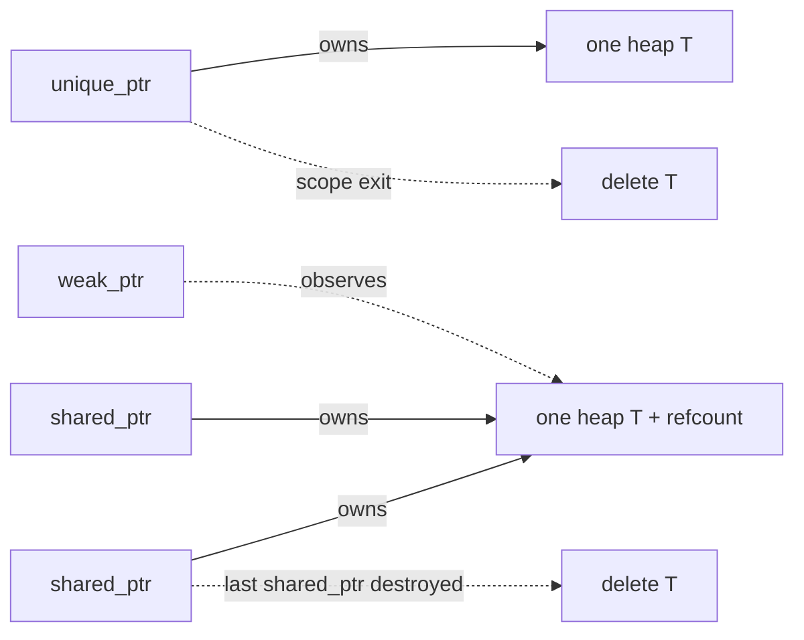

# Smart Pointers & RAII

> **Prereqs:** [Stack vs Heap](./stack-vs-heap), [Move Semantics](./move-semantics). Smart pointers are how move semantics get applied to ownership.

## TL;DR

- **RAII** = Resource Acquisition Is Initialization. The C++ pattern where a resource (memory, file, lock, mutex) is owned by an object whose destructor releases it. **The single most important C++ idea.**
- **`std::unique_ptr<T>`** owns a heap allocation. Non-copyable, movable. Destructor calls `delete`. Zero overhead vs raw pointer. Default for "this is mine."
- **`std::shared_ptr<T>`** is reference-counted ownership — destructor decrements the refcount; when it hits 0, `delete`. ~24 bytes overhead per pointer + atomic refcount operations on copy / destroy. Default for "shared between threads / scopes."
- **`std::weak_ptr<T>`** is a non-owning observer for `shared_ptr`. Used to break cycles.
- ML systems code uses `unique_ptr` for owned buffers, `shared_ptr` for tensor storage (PyTorch's `intrusive_ptr` is a custom variant), and *almost never* raw `new` / `delete`.

## Why this matters

Modern C++ doesn't have a garbage collector but doesn't need one — RAII gives you deterministic destruction in scope-exit order, which is faster *and* safer than most GC schemes. Smart pointers are the encoding. **A C++ codebase with raw `new`/`delete` everywhere is a 2002 codebase**; modern PyTorch, llama.cpp, every Triton kernel runtime is smart-pointer-only. Knowing the cost model and the ownership semantics of each is the price of reading any modern C++ ML code.

## Mental model



`unique_ptr` is single ownership; `shared_ptr` shares; `weak_ptr` watches without owning.

## Concrete walkthrough

### `unique_ptr` — the default

```cpp
auto buf = std::make_unique<float[]>(1024);     // heap-allocate 1024 floats
buf[0] = 3.14f;                                  // operator[] forwards
// Destructor at scope exit calls delete[] buf
```

`unique_ptr<T[]>` is the array variant — it calls `delete[]` correctly. Use `make_unique` (C++14) instead of `unique_ptr<T>(new T(...))` — exception-safe, less typing, same code.

`unique_ptr` is **movable but not copyable**. Pass by value to transfer ownership, or by reference if the callee shouldn't take ownership:

```cpp
void process(std::unique_ptr<Tensor> t);    // takes ownership
void inspect(const Tensor& t);              // borrows; doesn't own

auto t = std::make_unique<Tensor>(/* ... */);
inspect(*t);                                 // pass by ref
process(std::move(t));                       // transfer ownership; t is now null
```

After `process(std::move(t))`, the local `t` is empty. The function's `t` parameter owns the buffer until *its* scope exits.

**Cost: zero.** A `unique_ptr<T>` is the same size as a raw `T*` and generates the same machine code in optimized builds. The destructor is the only added behavior, and it's just a `delete`.

### `shared_ptr` — when ownership is shared

```cpp
auto t = std::make_shared<Tensor>(/* ... */);
// Internally: a 'control block' allocated alongside Tensor
// holds: refcount (atomic int), weak count, deleter

auto t2 = t;                  // refcount → 2 (atomic increment)
{
  auto t3 = t;                // refcount → 3
}                             // t3 destroyed; refcount → 2

// When the last shared_ptr dies, deleter runs.
```

Use `make_shared` instead of `shared_ptr<T>(new T(...))` — it allocates the control block and the object together, halving the allocation count.

**Cost:**
- Pointer size: 16 bytes (vs 8 for raw / unique_ptr) — two pointers (object + control block).
- Copy: one atomic increment.
- Destroy: one atomic decrement; possibly destroy.
- Per-thread overhead from the atomic ops can matter on hot paths.

**When to use:** the object outlives any single scope, OR multiple owners, OR threads share ownership. Otherwise prefer `unique_ptr`.

### `weak_ptr` — break cycles

A `shared_ptr` cycle leaks. If A holds a `shared_ptr<B>` and B holds a `shared_ptr<A>`, neither's refcount ever hits zero. `weak_ptr` breaks the cycle:

```cpp
struct Node {
    std::shared_ptr<Node> child;
    std::weak_ptr<Node> parent;       // doesn't keep parent alive
};
```

To use a `weak_ptr`, call `.lock()` to get a `shared_ptr`:

```cpp
if (auto p = node.parent.lock()) {
    // p is shared_ptr<Node>, valid until end of this scope
} // p destroyed; refcount adjusted
```

If the parent has been destroyed, `.lock()` returns null. This is exactly the observer pattern, encoded in the type system.

### PyTorch's `c10::intrusive_ptr`

PyTorch uses a custom shared pointer (`c10::intrusive_ptr`) instead of `std::shared_ptr` for tensor storage. The trick: the refcount lives *inside the object* rather than in a separately-allocated control block. Saves one allocation per tensor, halves the pointer size to 8 bytes. **Standard pattern in performance-critical C++ codebases** (LLVM, Chromium, PyTorch). Your default for general C++ is `std::shared_ptr`; intrusive_ptr is the "I really care about this" variant.

### RAII generalizes beyond memory

The pattern works for any resource:

```cpp
{
  std::lock_guard<std::mutex> guard(mu);    // acquires mutex
  // ... critical section ...
}                                              // releases mutex (destructor)

{
  std::ofstream f("output.bin");              // opens file
  f.write(buf, n);
} // f closed (destructor)
```

`lock_guard`, `unique_lock`, `ofstream`, `cuda::stream` (NVIDIA), `cublasHandle` (with custom deleter) — all RAII. **Every well-designed C++ resource handle follows this pattern.**

### Custom deleters

`unique_ptr` and `shared_ptr` accept a deleter:

```cpp
auto handle = std::unique_ptr<cublasHandle_t, decltype(&cublasDestroy)>(
    new_handle, &cublasDestroy
);
```

This is how RAII wraps C-API resources (cuBLAS, NCCL, CUDA streams). When `handle` goes out of scope, your custom deleter runs.

### When raw pointers are fine

A non-owning, never-null pointer to something with a longer lifetime: just use `T*` (or `T&` if you can). Smart pointers convey *ownership*; if the callee doesn't own, don't make it look like it does.

```cpp
// Pass by reference for non-null, non-owning
void inspect(const Tensor& t);

// Or raw pointer for nullable, non-owning
void maybe_inspect(const Tensor* t);  // nullptr-allowed
```

## Run it in your browser — refcount lifecycle simulator

<RunInBrowser
  description="Simulate shared_ptr semantics in Python — refcount, copy, destroy, weak observation."
  code={`class ControlBlock:
    def __init__(self, value):
        self.value = value
        self.shared_count = 0
        self.weak_count = 0
    def __repr__(self):
        return f"<ControlBlock value={self.value!r} shared={self.shared_count} weak={self.weak_count}>"

class SharedPtr:
    def __init__(self, cb):
        self.cb = cb
        cb.shared_count += 1
    def __del__(self):
        if self.cb is None: return
        self.cb.shared_count -= 1
        print(f"  shared_ptr destroyed; refcount → {self.cb.shared_count}")
        if self.cb.shared_count == 0:
            print(f"  ⚡ deleting object: {self.cb.value!r}")
            if self.cb.weak_count == 0:
                self.cb = None
    def reset(self):
        self.__del__()
        self.cb = None

class WeakPtr:
    def __init__(self, cb):
        self.cb = cb
        cb.weak_count += 1
    def lock(self):
        if self.cb.shared_count == 0:
            return None
        return SharedPtr(self.cb)

# Demo
print("--- create object via make_shared ---")
cb = ControlBlock("Tensor[1024]")
p1 = SharedPtr(cb)
print(f"after p1 = make_shared: {cb}")

print("\\n--- copy to p2 ---")
p2 = SharedPtr(cb)
print(f"refcount: {cb.shared_count}")

print("\\n--- weak_ptr observes ---")
w = WeakPtr(cb)
print(f"after weak_ptr: shared={cb.shared_count}, weak={cb.weak_count}")

print("\\n--- locked weak gives a shared again ---")
p3 = w.lock()
print(f"refcount: {cb.shared_count}")

print("\\n--- p1, p2, p3 all destroy ---")
del p1, p2, p3
# Object should now be deleted

print("\\n--- weak_ptr.lock() now fails ---")
print(f"  lock returned: {w.lock()}")
`}
/>

The shape — refcount up on copy, refcount down on destroy, deleter fires at zero, weak_ptr observes without keeping alive — is exactly `shared_ptr` semantics in miniature.

## Quick check

<FillIn
  prompt="The smart pointer that owns a single object and is movable but not copyable:"
  answer="unique_ptr"
  accept={["std::unique_ptr"]}
  hint="Single ownership; matches its name."
  explanation="`unique_ptr` enforces single ownership at the type level — no copy constructor, but a move constructor. Default for owned heap objects in modern C++. Zero runtime overhead vs raw pointers."
/>

<Quiz
  question="A team's C++ code uses `shared_ptr` for every tensor. Profiling shows ~5% of CPU time in atomic refcount operations. The right move:"
  options={[
    'Switch all `shared_ptr` to raw pointers.',
    'Where ownership is genuinely single, switch to `unique_ptr` (no atomic overhead). For tensors that need shared ownership, consider `intrusive_ptr` to save a pointer-deref + the second allocation.',
    'Use `weak_ptr` everywhere.',
    'Disable atomics with a compiler flag.',
  ]}
  answer={1}
  explanation="Atomic refcount ops on hot paths are a real cost. `unique_ptr` for single-owned data eliminates them entirely. `intrusive_ptr` (PyTorch-style) keeps shared semantics but saves a pointer hop. Going to raw pointers loses RAII safety; weak_ptr is for the cycle problem, not the perf problem."
/>

## Key takeaways

1. **RAII = resource lifetime tied to scope.** The single most important C++ idea.
2. **`unique_ptr` is the default** for owned heap objects. Zero overhead vs raw pointer.
3. **`shared_ptr` for shared ownership** — pays in size + atomic refcount ops.
4. **`weak_ptr` to break cycles** and observe without owning.
5. **Modern C++ ML code is smart-pointer-only.** Raw `new`/`delete` is a smell.

## Go deeper

<Resources
  items={[
    { kind: 'docs', href: 'https://en.cppreference.com/w/cpp/memory/unique_ptr', title: 'cppreference — std::unique_ptr', note: 'Canonical. The "Notes" section covers conversion to/from raw pointers.' },
    { kind: 'docs', href: 'https://en.cppreference.com/w/cpp/memory/shared_ptr', title: 'cppreference — std::shared_ptr', note: 'Includes the make_shared performance discussion.' },
    { kind: 'video', href: 'https://www.youtube.com/watch?v=PZ-1at9j1NY', title: 'Herb Sutter — Leak-Freedom in C++... By Default', note: 'The "smart pointers as the rule, raw pointers as exceptions" doctrine.' },
    { kind: 'blog', href: 'https://www.modernescpp.com/index.php/c-core-guidelines-rules-for-smart-pointers/', title: 'Modernes C++ — Smart Pointer Guidelines', note: 'Practitioner guide; covers the unique_ptr-first discipline well.' },
    { kind: 'repo', href: 'https://github.com/pytorch/pytorch/blob/main/c10/util/intrusive_ptr.h', title: 'PyTorch c10::intrusive_ptr', note: 'Production-grade intrusive smart pointer. Read for the "shared_ptr but with embedded refcount" design.' },
  ]}
/>

<LessonComplete />
