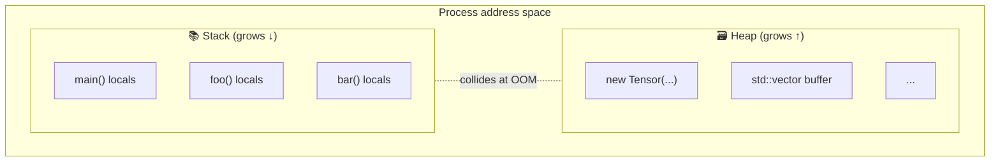

# Stack vs Heap

## TL;DR

- The **stack** is a fast, LIFO region of memory tied to function calls. Allocation is one register decrement; deallocation is automatic when the function returns.
- The **heap** is a general-purpose region you allocate from explicitly (`new`, `malloc`). Allocation involves bookkeeping, can fragment, and you're responsible for freeing.
- A stack allocation is typically **~1 ns**; a heap allocation is **~50–500 ns** depending on the allocator and contention.
- ML systems code stays on the stack as much as possible — heap traffic on a hot path is a known performance killer.

## Why this matters

When you write `vector<float> x(1024)` inside a hot inference loop, you're not just creating a vector — you're invoking the heap allocator, possibly taking a global lock, possibly faulting in a fresh page from the OS. Do this once per token and you've capped your throughput long before any matrix multiplication runs.

Understanding which region a variable lives in is what separates code that runs at 2 ms per token from code that runs at 200 ms per token. It's the first lens through which to read systems code.

## Mental model



The stack is a contiguous region that grows and shrinks with function calls — push on entry, pop on return. The heap is a free-form pool managed by an allocator (typically `glibc`'s ptmalloc, or a library replacement like jemalloc / tcmalloc).

**The stack is fast because allocation is just `sp -= n`.** The heap is slow because the allocator has to find a free block of the right size, possibly split or merge blocks, and update bookkeeping structures — all while being thread-safe.

## Concrete walkthrough

Look at where each variable lives:

```cpp
void run_inference() {
  float scratch[256];                       // STACK — 1024 bytes, free
  std::array<float, 256> arr;               // STACK — same as above
  Tensor t(256);                            // STACK header, but t's *data* is HEAP
  std::vector<float> v(256);                // STACK header, HEAP buffer
  auto p = std::make_unique<float[]>(256);  // STACK pointer, HEAP buffer

  // Cost roughly:
  //   scratch  → 1 instruction
  //   arr      → 1 instruction
  //   v        → ~100 ns malloc
  //   p        → ~100 ns malloc
}
// All four are cleaned up automatically when run_inference returns.
// scratch and arr never touched the heap — pure stack work.
```

A common ML systems pattern: **pre-allocate once, reuse forever.**

```cpp
class InferenceEngine {
  // Allocated ONCE at startup. Lives on the heap, but stays put.
  std::vector<float> kv_cache_;
  std::vector<float> scratch_;

  void forward_token(/* ... */) {
    // Hot path: zero allocations.
    // Use scratch_.data() as a working buffer.
  }
};
```

This pattern — *hoist allocations out of the hot path* — is everywhere in production ML runtimes (vLLM, llama.cpp, ONNX Runtime, TensorRT). The stack is too small for tensors, but the heap is too slow to touch repeatedly. So you pay the heap cost once, then operate from stable buffers.

### The numbers

Rough cost model on a modern x86 server, single thread, allocator warm:

| Operation                                | Cost        |
| ---------------------------------------- | ----------- |
| Stack allocation (`int x;`)              | ~0.3 ns     |
| `malloc(64)` / `new int`                 | ~30–80 ns   |
| `malloc(1MB)` (likely needs `mmap`)      | ~1–10 µs    |
| Page fault on first touch (4 KB page)    | ~1 µs       |
| First-time TLB miss after allocation     | ~100 ns     |

If your generation loop runs 100 tokens/sec and each token does 5 small `malloc`s, that's 500 allocations per second — fine. But if it does 5 _per layer per token_ across 32 layers, that's 16 000/sec — and now allocator overhead is ~1 ms/token, eating a meaningful chunk of latency.

## Hands-on (optional)

A 5-line benchmark you can run locally:

```cpp
#include <chrono>
#include <vector>
#include <cstdio>
int main() {
  using clk = std::chrono::high_resolution_clock;
  constexpr int N = 1'000'000;

  auto t0 = clk::now();
  for (int i = 0; i < N; i++) { volatile float a[64]; (void)a; }
  auto t1 = clk::now();
  for (int i = 0; i < N; i++) { auto* a = new float[64]; delete[] a; }
  auto t2 = clk::now();

  std::printf("stack: %.1f ns/iter\n", std::chrono::duration<double, std::nano>(t1 - t0).count() / N);
  std::printf("heap:  %.1f ns/iter\n", std::chrono::duration<double, std::nano>(t2 - t1).count() / N);
}
```

Compile with `g++ -O2 stackheap.cpp -o stackheap && ./stackheap`. Expect a 30–100× ratio.

## Quick check

<Quiz
  question="You're profiling an inference loop and see 40% of CPU time inside `malloc`. What's the most likely fix?"
  options={[
    'Switch to a faster allocator like jemalloc.',
    'Move the allocations out of the hot path by pre-allocating reusable buffers at startup.',
    'Use `std::make_unique` instead of `new`.',
    'Reduce the size of each allocation.',
  ]}
  answer={1}
  explanation="A faster allocator helps incrementally, but the real win is to stop allocating at all on the hot path. Pre-allocating long-lived scratch buffers turns N allocations per request into 1 allocation at startup."
/>

## Key takeaways

1. **Stack alloc ≈ free; heap alloc ≈ 100 ns.** The 100× gap is what makes "no allocations on the hot path" a hard rule in ML runtimes.
2. **A `std::vector<float> v` puts the *header* on the stack but the *buffer* on the heap.** Don't be fooled by the variable's apparent locality.
3. **Pre-allocate once, reuse forever.** Production ML engines hoist all allocations to startup or to a memory arena.
4. **The heap can fault, fragment, and lock.** It's not just slow — it's also unpredictable. The stack is deterministic.

## Further reading

- [What every programmer should know about memory](https://people.freebsd.org/~lstewart/articles/cpumemory.pdf) — Ulrich Drepper, the canonical reference. Long, but the early chapters on memory hierarchy reward rereading.
- [jemalloc design notes](https://jemalloc.net/) — how a production allocator actually works under contention.
- [`std::pmr` — Polymorphic Memory Resources](https://en.cppreference.com/w/cpp/header/memory_resource) — the modern C++ way to plug in your own allocator on a per-container basis.

<LessonComplete />
