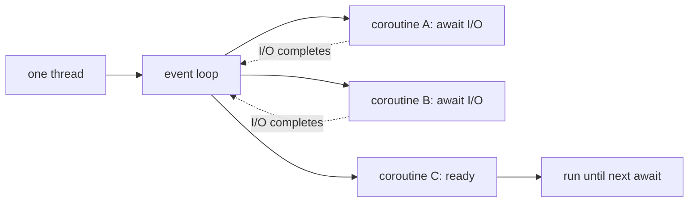

# Async Runtimes

<Mode is="learn">

Threads are the right tool when you have actual CPU work to do in parallel. They are the *wrong* tool when you have a thousand things sitting around waiting for the network. Spawning a thread per HTTP request — at ~10 μs and 8 MB of stack each — collapses long before you reach a thousand.

The alternative is **async**. One thread, one <Term name="event loop">event loop</Term>, and a fleet of <Term name="coroutine">coroutines</Term> that suspend themselves whenever they're waiting and let the next ready one run. When the awaited thing (a socket, a timer, an LLM API response) finishes, the coroutine resumes from exactly where it stopped. The thread never blocks. The throughput is "thousands of concurrent operations" instead of "however many threads your kernel allows."

This is the same model whether you write Python `asyncio`, JavaScript event-loop code, Rust `tokio`, or C++ coroutines. Only the syntax differs. And in 2026, every modern serving stack — vLLM, SGLang, FastAPI, TGI — is async at its core. Understanding the suspend/resume mechanic is what lets you reason about why your serving system has the latency profile it does.

## TL;DR

- **Async** lets one thread juggle thousands of concurrent operations by **suspending** when blocked (waiting for I/O, a future, a timer) and **resuming** when ready. <Term name="coroutine">Coroutines</Term> are the language-level mechanism.
- A **runtime** schedules suspended coroutines onto threads. Python's `asyncio`, Rust's `tokio`, C++ coroutines + executors, JavaScript's <Term name="event loop">event loop</Term> — all the same model with different syntax.
- Async wins when **most of your time is spent waiting** — network I/O, database queries, LLM API calls, file reads. For pure CPU work, threads (or processes) are still the right choice.
- **<Term name="cuda stream">CUDA streams</Term> are GPU async**: a stream is an ordered queue of GPU operations; multiple streams run concurrently on the same GPU. Every modern PyTorch / CUDA program implicitly uses streams; explicit stream control unlocks overlap-comm-with-compute optimizations.
- **Modern serving stacks (vLLM, FastAPI, SGLang) are entirely async on the orchestration side**. Hundreds of concurrent connections handled by one process; the heavy compute is dispatched to threads/GPUs that run in the background.

## Mental model



The event loop polls for ready I/O, resumes whichever coroutine is unblocked, runs until the next await, repeats. **One thread; thousands of concurrent operations.**

## Python `asyncio` basics

```python
import asyncio
import aiohttp

async def fetch(session, url):
    async with session.get(url) as resp:
        return await resp.text()

async def main():
    async with aiohttp.ClientSession() as session:
        # Launch 100 concurrent fetches
        tasks = [fetch(session, f"https://api.example.com/{i}") for i in range(100)]
        results = await asyncio.gather(*tasks)
    print(f"Got {len(results)} responses")

asyncio.run(main())
```

The 100 fetches run concurrently. None of them spawn threads. The single event-loop thread juggles all 100 by:

1. Calling `session.get` → returns a future immediately, registers a callback for when the HTTP response is ready.
2. When code says `await resp.text()` → suspends this coroutine, schedules the next ready one.
3. When the response arrives, the OS notifies the event loop; the suspended coroutine is resumed.

For 100 concurrent network requests at 200 ms each: synchronous = 20 seconds; async = ~200 ms.

## `await` and the suspension model

`await` is a suspension point. The function "pauses" — its local state is saved on the heap (stack frames are turned into a struct), the event loop reclaims the thread, the function resumes later when the awaited future completes.

```python
async def slow_op():
    print("start")
    await asyncio.sleep(1.0)         # SUSPENDS for 1s; thread is free
    print("after 1s")
    await asyncio.sleep(1.0)
    print("after 2s")

# Multiple slow_ops run concurrently:
await asyncio.gather(slow_op(), slow_op(), slow_op())
# Total time: ~2s (not 6s).
```

The cost of a suspend/resume is ~100 ns–1 μs on most runtimes. Way cheaper than a thread context switch.

## `async` infects the call stack

```python
async def fetch_data(): ...
def main():
    fetch_data()                # ❌ creates a coroutine, doesn't run it

# Must be:
async def main():
    await fetch_data()
asyncio.run(main())
```

This is the famous "function color" problem (red/blue functions). Once you're async, the whole call stack must be async. Mixing sync and async needs `asyncio.run()` (sync wraps async) or `loop.run_in_executor()` (async wraps sync).

## When async helps and when it doesn't

| Scenario | Sync threads | Async |
|---|---|---|
| 1000 concurrent HTTP requests | 1000 threads, ~few GB stacks | 1 thread, ~few MB |
| 100 concurrent DB queries | 100 threads | 1 thread |
| Pure CPU sum of N integers | 1 thread, fast | 1 thread, fast (no win) |
| Image decode + matmul | thread per image is OK | Background thread + async API around it |

**Async wins on I/O concurrency, not CPU parallelism.** For CPU-bound work, threads or processes still win.

## C++20 coroutines — the same model in C++

C++20 added `co_await` / `co_yield` / `co_return` — the same suspend/resume mechanic at the language level. Unlike Python, the C++ standard library doesn't ship a runtime, so production code uses an executor library (`folly::coro`, `cppcoro`, Asio with coroutines, or NVIDIA's stdexec).

```cpp
#include <coroutine>
#include <iostream>

// A trivial Task<T> coroutine type. Production code uses folly/cppcoro.
struct Task {
    struct promise_type {
        Task get_return_object() { return {}; }
        std::suspend_never initial_suspend() noexcept { return {}; }
        std::suspend_never final_suspend()   noexcept { return {}; }
        void return_void() {}
        void unhandled_exception() {}
    };
};

Task fetch(const std::string& url) {
    auto response = co_await http_get(url);   // SUSPEND until I/O completes
    auto body     = co_await response.body(); // SUSPEND again
    co_return;                                 // resumes the caller
}
```

Same model as Python `asyncio`: a `co_await` is a suspension point; the executor parks the coroutine; some I/O completion handler resumes it later. The cost of a suspension is ~20 ns — cheaper than Python's ~1 μs because there's no interpreter overhead and the compiler has inlined the state machine.

Production C++ async serving stacks (parts of vLLM's C++ scheduler, NVIDIA Triton Inference Server, Ray's object store) are built on this, sometimes paired with `liburing` for the I/O side.

## <Term name="cuda stream">CUDA streams</Term> — async on the GPU

Every CUDA kernel launch happens on a **stream**:

```cpp
cudaStream_t s;
cudaStreamCreate(&s);

// Launch on stream `s`. Returns immediately; kernel starts when the stream is free.
my_kernel<<<grid, block, 0, s>>>(args);

// The launch is async. To wait:
cudaStreamSynchronize(s);
```

Multiple streams run concurrently on a single GPU (subject to resources). The standard pattern:

```cpp
// Stream 1: data load
cudaMemcpyAsync(d_in, h_in, n_bytes, cudaMemcpyHostToDevice, s1);

// Stream 2: compute on previous data
my_kernel<<<grid, block, 0, s2>>>(prev_data);

// They run in parallel — copy + compute overlap.
```

This is what comm-compute overlap in distributed training looks like at the kernel level: NCCL launches AllReduce on one stream, the next layer's compute runs on another, the GPU executes both concurrently.

PyTorch wraps this in `torch.cuda.Stream`:

```python
import torch
s = torch.cuda.Stream()
with torch.cuda.stream(s):
    output = some_kernel(input)
torch.cuda.current_stream().wait_stream(s)
```

Most user code uses the default stream and gets implicit serialization. Custom streams are how you express "these two operations are independent; let the GPU schedule them in parallel."

## Production async serving

A vLLM-style serving loop:

```python
async def handle_request(req):
    sequence = await scheduler.admit(req)         # might wait if queue is full
    async for token in scheduler.generate(sequence):  # yields tokens as model runs
        yield token

@app.post("/generate")
async def generate(request: Request):
    return StreamingResponse(handle_request(request))
```

One Python process, many concurrent HTTP requests, one shared model on the GPU. The async machinery interleaves request processing; the GPU runs the [continuous-batched](../../llm-architecture/inference-time/chunked-prefill) forward pass under the hood. **The whole architecture only works because both layers are async**.

## Rust `tokio`

Rust's `tokio` is the canonical production async runtime — type-safe, zero-cost suspensions, work-stealing scheduler. Same model as Python's asyncio but with much tighter performance. Used in serving infra (e.g., parts of Hugging Face's TGI, Anthropic's serving layer, much of OpenAI's stack).

```rust
async fn fetch(url: &str) -> Result<String> {
    let response = reqwest::get(url).await?.text().await?;
    Ok(response)
}

#[tokio::main]
async fn main() {
    let urls: Vec<_> = (0..100).map(|i| format!("https://api.example.com/{i}")).collect();
    let futures = urls.iter().map(|u| fetch(u));
    let results = futures::future::join_all(futures).await;
}
```

Same model, much faster. ~20 ns per await suspension.

## Run it in your browser — async vs sync

<RunInBrowser
  description="Concurrent simulated I/O calls — sequential vs gather. The wall-clock gap is the entire async story."
  code={`import asyncio, time

async def fake_request(delay=0.05):
    await asyncio.sleep(delay)
    return "ok"

async def sequential(n):
    results = []
    for _ in range(n):
        results.append(await fake_request())
    return results

async def concurrent(n):
    return await asyncio.gather(*(fake_request() for _ in range(n)))

async def main():
    n = 100
    t0 = time.perf_counter()
    await sequential(n)
    seq_t = time.perf_counter() - t0

    t0 = time.perf_counter()
    await concurrent(n)
    conc_t = time.perf_counter() - t0

    print(f"sequential ({n} requests of 50ms): {seq_t*1000:>6.0f} ms")
    print(f"concurrent (gather):              {conc_t*1000:>6.0f} ms")
    print(f"speedup:                           {seq_t/conc_t:>5.1f}×")
    print()
    print("Single thread, no parallelism — just suspending while one is waiting")
    print("and running others. This is the entire async value proposition.")

asyncio.run(main())
`}
/>

100 fake-50ms requests: sequential ~5000 ms, concurrent ~50 ms. Same single Python thread; no extra cores; just the suspend-and-resume mechanic.

## Quick check

<FillIn
  prompt="The CUDA primitive that lets two GPU operations run concurrently — also the unit that PyTorch's torch.cuda.Stream wraps:"
  answer="stream"
  accept={["streams", "CUDA stream", "cuda stream"]}
  hint="Single word; ordered queue of GPU operations."
  explanation="A CUDA stream is an ordered queue of operations; operations on different streams can run concurrently. The default stream is implicit; custom streams (torch.cuda.Stream) are how you express overlap."
/>

<Quiz
  question="A team's FastAPI inference server handles ~10 req/s and is bottlenecked at 100% CPU on the event loop. The right diagnostic:"
  options={[
    'Add more replicas.',
    'Profile what\'s blocking the event loop. Most common cause: a CPU-heavy step (tokenization? JSON parsing?) running synchronously in the handler. Move it to a thread executor.',
    'Switch to Rust.',
    'Disable async.',
  ]}
  answer={1}
  explanation="Async only works if the event loop yields. A sync CPU-heavy step inside an async handler hogs the loop and blocks every other request. The fix is `await loop.run_in_executor(thread_pool, cpu_work, args)` — runs the heavy step in a thread, lets the loop continue. Common culprits: tokenization, JSON parsing of huge payloads, image decoding."
/>

## Key takeaways

1. **Async = one thread, many concurrent operations** via suspend/resume on `await`.
2. **Wins on I/O-bound concurrency**, not CPU parallelism. Use threads / processes for CPU.
3. **Async colors functions** — once async, the whole call stack must be. Bridge with `run_in_executor` and `asyncio.run`.
4. **CUDA streams are the GPU equivalent** — async kernel queue. Multiple streams overlap.
5. **Every modern serving stack is async at the orchestration layer.** Understanding the event loop is foundational.

## Go deeper

<Resources
  items={[
    { kind: 'docs', href: 'https://docs.python.org/3/library/asyncio.html', title: 'Python — asyncio', note: 'Authoritative. The "Coroutines and Tasks" page is the right starting point.' },
    { kind: 'blog', href: 'https://www.aeracode.org/2018/02/19/python-async-simplified/', title: 'Python async, simplified — Andrew Godwin', note: 'Best plain-language explanation of the event loop and the function-color problem.' },
    { kind: 'docs', href: 'https://tokio.rs/tokio/tutorial', title: 'Tokio Tutorial', note: 'Rust\'s production async runtime. The tutorial is the cleanest explanation of executors and tasks.' },
    { kind: 'docs', href: 'https://docs.nvidia.com/cuda/cuda-c-programming-guide/index.html#asynchronous-concurrent-execution', title: 'CUDA Programming Guide — Streams', note: 'Authoritative on stream semantics and overlap rules.' },
    { kind: 'docs', href: 'https://pytorch.org/docs/stable/notes/cuda.html#cuda-streams', title: 'PyTorch — CUDA Streams', note: 'How to use streams from Python; the implicit-default-stream gotchas.' },
    { kind: 'blog', href: 'https://journal.stuffwithstuff.com/2015/02/01/what-color-is-your-function/', title: 'What Color is Your Function? — Bob Nystrom', note: 'The classic essay on async function coloring. Read once; understand the design forever.' },
  ]}
/>

</Mode>

<Mode is="reference">

> **Prereq:** [Threading](./threading). Async is what you reach for when threads are too heavy.

## TL;DR

- **Async** lets one thread juggle thousands of concurrent operations by **suspending** when blocked (waiting for I/O, a future, a timer) and **resuming** when ready. Coroutines are the language-level mechanism.
- A **runtime** schedules suspended coroutines onto threads. Python's `asyncio`, Rust's `tokio`, C++ coroutines + executors, JavaScript's event loop — all the same model with different syntax.
- Async wins when **most of your time is spent waiting** — network I/O, database queries, LLM API calls, file reads. For pure CPU work, threads (or processes) are still the right choice.
- **CUDA streams are GPU async**: a stream is an ordered queue of GPU operations; multiple streams run concurrently on the same GPU. Every modern PyTorch / CUDA program implicitly uses streams; explicit stream control unlocks overlap-comm-with-compute optimizations.
- **Modern serving stacks (vLLM, FastAPI, SGLang) are entirely async on the orchestration side**. Hundreds of concurrent connections handled by one process; the heavy compute is dispatched to threads/GPUs that run in the background.

## Why this matters

Every LLM serving stack you'll meet — vLLM, SGLang, FastAPI, Triton Inference Server — has an async core. The reason: a request handler that synchronously waits for the model's forward pass would block the whole event loop; one slow request stops 1000 others. Async fixes this. **If you don't understand the event loop, the futures, the suspend/resume mechanic, you can't reason about why your serving system has the latency profile it does.** And on the GPU side, CUDA streams are the same idea — they're async too, and getting them wrong is the most common reason a "fast kernel" benchmark doesn't translate to serving throughput.

## Mental model


The event loop polls for ready I/O, resumes whichever coroutine is unblocked, runs until the next await, repeats. **One thread; thousands of concurrent operations.**

## Concrete walkthrough

### Python `asyncio` basics

```python
import asyncio
import aiohttp

async def fetch(session, url):
    async with session.get(url) as resp:
        return await resp.text()

async def main():
    async with aiohttp.ClientSession() as session:
        # Launch 100 concurrent fetches
        tasks = [fetch(session, f"https://api.example.com/{i}") for i in range(100)]
        results = await asyncio.gather(*tasks)
    print(f"Got {len(results)} responses")

asyncio.run(main())
```

The 100 fetches run concurrently. None of them spawn threads. The single event-loop thread juggles all 100 by:

1. Calling `session.get` → returns a future immediately, registers a callback when the HTTP response is ready.
2. When code says `await resp.text()` → suspends this coroutine, schedules the next ready one.
3. When the response arrives, the OS notifies the event loop; the suspended coroutine is resumed.

For 100 concurrent network requests at 200 ms each: synchronous = 20 seconds; async = ~200 ms.

### `await` and the suspension model

`await` is a suspension point. The function "pauses" — its local state is saved on the heap (stack frames are turned into a struct), the event loop reclaims the thread, the function resumes later when the awaited future completes.

```python
async def slow_op():
    print("start")
    await asyncio.sleep(1.0)         # SUSPENDS for 1s; thread is free
    print("after 1s")
    await asyncio.sleep(1.0)
    print("after 2s")

# Multiple slow_ops run concurrently:
await asyncio.gather(slow_op(), slow_op(), slow_op())
# Total time: ~2s (not 6s).
```

The cost of a suspend/resume is ~100 ns–1 μs on most runtimes. Way cheaper than a thread context switch.

### `async` infects the call stack

```python
async def fetch_data(): ...
def main():
    fetch_data()                # ❌ creates a coroutine, doesn't run it

# Must be:
async def main():
    await fetch_data()
asyncio.run(main())
```

This is the famous "function color" problem (red/blue functions). Once you're async, the whole call stack must be async. Mixing sync and async needs `asyncio.run()` (sync wraps async) or `loop.run_in_executor()` (async wraps sync).

### When async helps and when it doesn't

| Scenario | Sync threads | Async |
|---|---|---|
| 1000 concurrent HTTP requests | 1000 threads, ~few GB stacks | 1 thread, ~few MB |
| 100 concurrent DB queries | 100 threads | 1 thread |
| Pure CPU sum of N integers | 1 thread, fast | 1 thread, fast (no win) |
| Image decode + matmul | thread per image is OK | Background thread + async API around it |

**Async wins on I/O concurrency, not CPU parallelism.** For CPU-bound work, threads or processes still win.

### C++20 coroutines — the same model in C++

C++20 added `co_await` / `co_yield` / `co_return` — the same suspend/resume mechanic at the language level. Unlike Python, the C++ standard library doesn't ship a runtime, so production code uses an executor library (`folly::coro`, `cppcoro`, Asio with coroutines, or NVIDIA's stdexec).

```cpp
#include <coroutine>
#include <iostream>

// A trivial Task<T> coroutine type. Production code uses folly/cppcoro.
struct Task {
    struct promise_type {
        Task get_return_object() { return {}; }
        std::suspend_never initial_suspend() noexcept { return {}; }
        std::suspend_never final_suspend()   noexcept { return {}; }
        void return_void() {}
        void unhandled_exception() {}
    };
};

Task fetch(const std::string& url) {
    auto response = co_await http_get(url);   // SUSPEND until I/O completes
    auto body     = co_await response.body(); // SUSPEND again
    co_return;                                 // resumes the caller
}
```

Same model as Python `asyncio`: a `co_await` is a suspension point; the executor parks the coroutine; some I/O completion handler resumes it later. The cost of a suspension is ~20 ns — cheaper than Python's ~1 μs because there's no interpreter overhead and the compiler has inlined the state machine.

Production C++ async serving stacks (parts of vLLM's C++ scheduler, NVIDIA Triton Inference Server, Ray's object store) are built on this, sometimes paired with `liburing` for the I/O side.

### CUDA streams — async on the GPU

Every CUDA kernel launch happens on a **stream**:

```cpp
cudaStream_t s;
cudaStreamCreate(&s);

// Launch on stream `s`. Returns immediately; kernel starts when the stream is free.
my_kernel<<<grid, block, 0, s>>>(args);

// The launch is async. To wait:
cudaStreamSynchronize(s);
```

Multiple streams run concurrently on a single GPU (subject to resources). The standard pattern:

```cpp
// Stream 1: data load
cudaMemcpyAsync(d_in, h_in, n_bytes, cudaMemcpyHostToDevice, s1);

// Stream 2: compute on previous data
my_kernel<<<grid, block, 0, s2>>>(prev_data);

// They run in parallel — copy + compute overlap.
```

This is what comm-compute overlap in distributed training looks like at the kernel level: NCCL launches AllReduce on one stream, the next layer's compute runs on another, the GPU executes both concurrently.

PyTorch wraps this in `torch.cuda.Stream`:

```python
import torch
s = torch.cuda.Stream()
with torch.cuda.stream(s):
    output = some_kernel(input)
torch.cuda.current_stream().wait_stream(s)
```

Most user code uses the default stream and gets implicit serialization. Custom streams are how you express "these two operations are independent; let the GPU schedule them in parallel."

### Production async serving

A vLLM-style serving loop:

```python
async def handle_request(req):
    sequence = await scheduler.admit(req)         # might wait if queue is full
    async for token in scheduler.generate(sequence):  # yields tokens as model runs
        yield token

@app.post("/generate")
async def generate(request: Request):
    return StreamingResponse(handle_request(request))
```

One Python process, many concurrent HTTP requests, one shared model on the GPU. The async machinery interleaves request processing; the GPU runs the [continuous-batched](../../llm-architecture/inference-time/chunked-prefill) forward pass under the hood. **The whole architecture only works because both layers are async**.

### Rust `tokio`

Rust's `tokio` is the canonical production async runtime — type-safe, zero-cost suspensions, work-stealing scheduler. Same model as Python's asyncio but with much tighter performance. Used in serving infra (e.g., parts of Hugging Face's TGI, Anthropic's serving layer, much of OpenAI's stack).

```rust
async fn fetch(url: &str) -> Result<String> {
    let response = reqwest::get(url).await?.text().await?;
    Ok(response)
}

#[tokio::main]
async fn main() {
    let urls: Vec<_> = (0..100).map(|i| format!("https://api.example.com/{i}")).collect();
    let futures = urls.iter().map(|u| fetch(u));
    let results = futures::future::join_all(futures).await;
}
```

Same model, much faster. ~20 ns per await suspension.

## Run it in your browser — async vs sync

<RunInBrowser
  description="Concurrent simulated I/O calls — sequential vs gather. The wall-clock gap is the entire async story."
  code={`import asyncio, time

async def fake_request(delay=0.05):
    await asyncio.sleep(delay)
    return "ok"

async def sequential(n):
    results = []
    for _ in range(n):
        results.append(await fake_request())
    return results

async def concurrent(n):
    return await asyncio.gather(*(fake_request() for _ in range(n)))

async def main():
    n = 100
    t0 = time.perf_counter()
    await sequential(n)
    seq_t = time.perf_counter() - t0

    t0 = time.perf_counter()
    await concurrent(n)
    conc_t = time.perf_counter() - t0

    print(f"sequential ({n} requests of 50ms): {seq_t*1000:>6.0f} ms")
    print(f"concurrent (gather):              {conc_t*1000:>6.0f} ms")
    print(f"speedup:                           {seq_t/conc_t:>5.1f}×")
    print()
    print("Single thread, no parallelism — just suspending while one is waiting")
    print("and running others. This is the entire async value proposition.")

asyncio.run(main())
`}
/>

100 fake-50ms requests: sequential ~5000 ms, concurrent ~50 ms. Same single Python thread; no extra cores; just the suspend-and-resume mechanic.

## Quick check

<FillIn
  prompt="The CUDA primitive that lets two GPU operations run concurrently — also the unit that PyTorch's torch.cuda.Stream wraps:"
  answer="stream"
  accept={["streams", "CUDA stream", "cuda stream"]}
  hint="Single word; ordered queue of GPU operations."
  explanation="A CUDA stream is an ordered queue of operations; operations on different streams can run concurrently. The default stream is implicit; custom streams (torch.cuda.Stream) are how you express overlap."
/>

<Quiz
  question="A team's FastAPI inference server handles ~10 req/s and is bottlenecked at 100% CPU on the event loop. The right diagnostic:"
  options={[
    'Add more replicas.',
    'Profile what\'s blocking the event loop. Most common cause: a CPU-heavy step (tokenization? JSON parsing?) running synchronously in the handler. Move it to a thread executor.',
    'Switch to Rust.',
    'Disable async.',
  ]}
  answer={1}
  explanation="Async only works if the event loop yields. A sync CPU-heavy step inside an async handler hogs the loop and blocks every other request. The fix is `await loop.run_in_executor(thread_pool, cpu_work, args)` — runs the heavy step in a thread, lets the loop continue. Common culprits: tokenization, JSON parsing of huge payloads, image decoding."
/>

## Key takeaways

1. **Async = one thread, many concurrent operations** via suspend/resume on `await`.
2. **Wins on I/O-bound concurrency**, not CPU parallelism. Use threads / processes for CPU.
3. **Async colors functions** — once async, the whole call stack must be. Bridge with `run_in_executor` and `asyncio.run`.
4. **CUDA streams are the GPU equivalent** — async kernel queue. Multiple streams overlap.
5. **Every modern serving stack is async at the orchestration layer.** Understanding the event loop is foundational.

## Go deeper

<Resources
  items={[
    { kind: 'docs', href: 'https://docs.python.org/3/library/asyncio.html', title: 'Python — asyncio', note: 'Authoritative. The "Coroutines and Tasks" page is the right starting point.' },
    { kind: 'blog', href: 'https://www.aeracode.org/2018/02/19/python-async-simplified/', title: 'Python async, simplified — Andrew Godwin', note: 'Best plain-language explanation of the event loop and the function-color problem.' },
    { kind: 'docs', href: 'https://tokio.rs/tokio/tutorial', title: 'Tokio Tutorial', note: 'Rust\'s production async runtime. The tutorial is the cleanest explanation of executors and tasks.' },
    { kind: 'docs', href: 'https://docs.nvidia.com/cuda/cuda-c-programming-guide/index.html#asynchronous-concurrent-execution', title: 'CUDA Programming Guide — Streams', note: 'Authoritative on stream semantics and overlap rules.' },
    { kind: 'docs', href: 'https://pytorch.org/docs/stable/notes/cuda.html#cuda-streams', title: 'PyTorch — CUDA Streams', note: 'How to use streams from Python; the implicit-default-stream gotchas.' },
    { kind: 'blog', href: 'https://journal.stuffwithstuff.com/2015/02/01/what-color-is-your-function/', title: 'What Color is Your Function? — Bob Nystrom', note: 'The classic essay on async function coloring. Read once; understand the design forever.' },
  ]}
/>

</Mode>

<LessonComplete />
