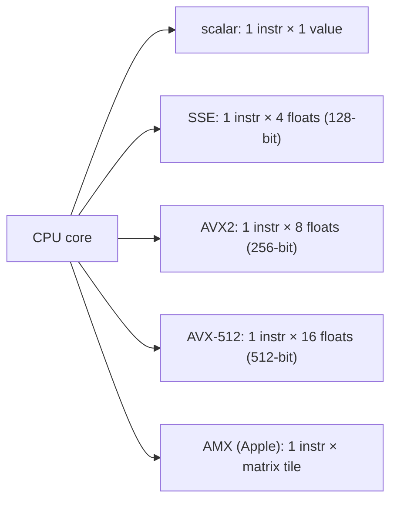

# SIMD

## TL;DR

- **SIMD** = Single Instruction, Multiple Data. One CPU instruction operates on a whole vector of values. **AVX-512 does 16 FP32 ops per cycle; ARM SVE2 is similar; Apple AMX adds matrix-shaped ops.**
- It's a third level of parallelism *below* threads and processes — same core, multiple lanes per instruction.
- **Compilers auto-vectorize** simple loops with `-O3 -march=native`. They struggle with: pointer aliasing, conditional branches, non-trivial reductions. Anything they don't vectorize, you write intrinsics for.
- **Pyodide / numpy / `__builtin_*` intrinsics** are the layered API. Numpy's array operations dispatch to SIMD-optimized C; Eigen / xsimd / highway / std::experimental::simd give portable C++ access.
- For ML on CPU: `llama.cpp`'s NEON / AVX-512 paths are the production reference. SIMD is what makes "decode a 7B Q4_K_M on a phone" runnable.

## Why this matters

When the GPU isn't an option (mobile, edge, CPU-only training, serverless inference), SIMD is the difference between "0.5 tok/s on this Raspberry Pi" and "5 tok/s." llama.cpp's CPU performance is essentially "carefully written SIMD"; PyTorch's CPU kernels are "MKL-DNN compiled with AVX-512." **Knowing SIMD is the price of admission for any non-GPU AI work** — and a useful debugging skill even for GPU work because the same locality discipline applies.

## Mental model



Wider registers = more lanes per instruction = more throughput per cycle. The progression: scalar → 128-bit → 256 → 512 → matrix tiles.

## Concrete walkthrough

### Auto-vectorization

```cpp
void scale(float* x, float s, size_t n) {
    for (size_t i = 0; i < n; ++i) {
        x[i] *= s;
    }
}
```

Compile with `g++ -O3 -mavx2`: the compiler emits AVX2 code processing 8 floats per iteration. With `-mavx512f`: 16 floats per iteration. **Free 8–16× speedup** if the loop is simple enough.

What blocks auto-vectorization:
- **Pointer aliasing**: if `x` and `y` could overlap, the compiler can't reorder reads/writes safely. Mark with `__restrict__` to help.
- **Conditional branches inside the loop**: `if (cond) y[i] = a; else y[i] = b;` may force scalar fallback. Predication / select intrinsics fix this.
- **Reductions with floating-point order constraints**: `sum += x[i]` is technically reordered by SIMD, which changes results. Use `-ffast-math` if you accept that.
- **Indirect addressing**: `y[i] = x[idx[i]]` is hard to vectorize without gather instructions (AVX2 has them but they're slow).

Always check what the compiler did:

```bash
g++ -O3 -march=native -fopt-info-vec-all scale.cpp 2>&1 | head -10
# Reports which loops vectorized and which didn't (with reasons).
```

Or look at the assembly directly: `objdump -d` and search for `vmul`, `vfma`, etc.

### When you write intrinsics

Some loops the compiler won't vectorize. Write the SIMD by hand:

```cpp
#include <immintrin.h>

void scale_avx2(float* x, float s, size_t n) {
    __m256 vs = _mm256_set1_ps(s);            // broadcast s into 8 lanes
    size_t i = 0;
    for (; i + 8 <= n; i += 8) {
        __m256 v = _mm256_loadu_ps(x + i);    // load 8 floats
        v = _mm256_mul_ps(v, vs);              // multiply 8 floats in parallel
        _mm256_storeu_ps(x + i, v);            // store back
    }
    for (; i < n; ++i) x[i] *= s;             // scalar tail for non-multiple-of-8
}
```

Same effect as the compiler-vectorized version, but you control:
- Which registers / instructions get used.
- How the loop is unrolled.
- Cache prefetching (`_mm_prefetch`).
- Tail handling.

For production-quality SIMD code (cuBLAS, oneMKL, OpenBLAS, llama.cpp, Eigen), every hot loop is hand-vectorized and aggressively tuned.

### Portable SIMD — Highway, xsimd, std::experimental::simd

Intrinsics are non-portable: AVX-512 doesn't run on ARM. Wrappers fix this:

```cpp
#include <hwy/highway.h>          // Google's portable SIMD library
namespace hn = hwy::HWY_NAMESPACE;

template<typename D>
void scale(D d, float* x, float s, size_t n) {
    auto vs = hn::Set(d, s);
    size_t i = 0;
    for (; i + hn::Lanes(d) <= n; i += hn::Lanes(d)) {
        auto v = hn::LoadU(d, x + i);
        v = hn::Mul(v, vs);
        hn::StoreU(v, d, x + i);
    }
    for (; i < n; ++i) x[i] *= s;
}
```

Compiles to AVX-512 on x86, NEON on ARM, scalar on platforms without SIMD. C++26 standardizes this as `std::simd`.

### Apple AMX and matrix-shaped instructions

Apple's M-series chips include **AMX** — undocumented matrix-multiply instructions that operate on 32×32 tile blocks. Apple's Accelerate framework (and llama.cpp on macOS) use AMX for FP16 GEMM, achieving ~3× the throughput of vanilla NEON. **Not officially exposed** but reverse-engineered and integrated where it matters.

Intel's AMX (Advanced Matrix Extensions, separately) on Sapphire Rapids+ also adds matrix-tile instructions. Intel's oneDNN uses them for INT8 GEMM at high throughput. **The pattern of "add matrix instructions to the CPU"** is universal in 2024+ silicon — the CPU is converging on what tensor cores started.

### Numpy / SciPy under the hood

When you write `np.dot(x, y)`, numpy calls into BLAS (OpenBLAS, MKL, Apple Accelerate). BLAS calls hand-optimized SIMD GEMM. **The 1000× gap between `for i in range: y += x[i]*w[i]` (Python) and `y = x @ w` (numpy) is mostly SIMD plus parallel threads.**

Same for PyTorch CPU kernels. Pure-Python perception of "Python is slow" is mostly "Python is slow when it's not calling SIMD-optimized C."

### llama.cpp's SIMD strategy

`ggml-cpu.c` in llama.cpp has separate hot-loop implementations for:
- AVX-512 (newest Intel server / Zen 4+ AMD)
- AVX2 (most x86)
- NEON / Apple AMX (M-series Macs and ARM phones)
- Pure scalar fallback

Each is hand-tuned. The matmul kernels for K-quants do unpack-on-the-fly + multiply at SIMD speed. **It's the canonical reference for how to write fast SIMD AI kernels in C.**

## Run it in your browser — SIMD-style operations via numpy

<RunInBrowser
  description="Compare scalar (Python loop) vs vectorized (numpy) on the same operation. Numpy dispatches to SIMD-optimized C internally."
  code={`import numpy as np, time

N = 1_000_000
x = np.random.randn(N).astype(np.float32)
y = np.random.randn(N).astype(np.float32)

# Scalar: pure Python loop (no SIMD, no vectorization)
def scalar_dot(x, y):
    s = 0.0
    for i in range(len(x)):
        s += x[i] * y[i]
    return s

# Vectorized: numpy uses BLAS / SIMD under the hood
def numpy_dot(x, y):
    return float(x @ y)

def benchmark(label, fn, iters=5):
    t0 = time.perf_counter()
    for _ in range(iters): fn(x, y)
    return (time.perf_counter() - t0) * 1000 / iters

scalar_t = benchmark('scalar', scalar_dot, iters=2)
numpy_t  = benchmark('numpy',  numpy_dot)
print(f"scalar dot product (Python loop):  {scalar_t:>8.1f} ms")
print(f"numpy dot product (BLAS + SIMD):    {numpy_t:>8.1f} ms")
print(f"speedup:                            {scalar_t / numpy_t:>5.0f}×")
print()
print("Most of the 1000× gap is SIMD + cache-friendly C + threading.")
print("Pure SIMD alone (no threading) is typically 8-16× on AVX-512.")
`}
/>

The output is the canonical lesson: a "for i in range" loop in Python is hundreds of times slower than `x @ y` not because Python is slow, but because Python skips both SIMD and BLAS.

## Quick check

<FillIn
  prompt="The 512-bit-wide SIMD instruction set on Intel and AMD CPUs that processes 16 FP32 values per instruction:"
  answer="AVX-512"
  accept={["AVX512", "Intel AVX-512"]}
  hint="Acronym + bit width."
  explanation="AVX-512 = Advanced Vector Extensions, 512-bit wide. 16 FP32 lanes per instruction (or 8 doubles, 32 INT16, etc.). Standard on 2017+ Intel server and 2022+ AMD server / consumer CPUs. The widest x86 SIMD available pre-AMX."
/>

<Quiz
  question="A team's CPU inference is at 5% of theoretical peak FP32. The most likely missing piece:"
  options={[
    'Buy more cores.',
    'Auto-vectorization isn\'t firing — the hot loops have aliasing or branches that prevent SIMD. Verify with -fopt-info-vec or write intrinsics; expect 4–16× speedup.',
    'Switch to Java.',
    'Use multiprocessing.',
  ]}
  answer={1}
  explanation={`5% of peak FP32 on a modern CPU is essentially "no SIMD at all" — scalar code achieves ~6% of an AVX-512 chip's peak. The diagnostic: compile with -fopt-info-vec; check assembly for vmul, vfma instructions. If they're not there, the loop didn't vectorize. Add __restrict__, eliminate aliasing, or write intrinsics. 4–16× recovery is typical.`}
/>

## Key takeaways

1. **SIMD = parallelism within one core.** AVX-512: 16 FP32 per cycle. NEON / SVE: similar.
2. **Compilers auto-vectorize simple loops.** `-O3 -march=native` and check the report. Aliasing and branches block them.
3. **Hand-write intrinsics for hot loops** the compiler can't reach. Use Highway / xsimd / std::simd for portability.
4. **Apple AMX, Intel AMX, ARM SME** are the matrix-tile instructions — CPU converging on tensor-core-shaped ops.
5. **Numpy / BLAS / llama.cpp internalize all this.** When you can't reach for those, write SIMD.

## Go deeper

<Resources
  items={[
    { kind: 'docs', href: 'https://www.intel.com/content/www/us/en/docs/intrinsics-guide/index.html', title: 'Intel Intrinsics Guide', note: 'The reference. Search by instruction name; copy idiomatic usage.' },
    { kind: 'docs', href: 'https://developer.arm.com/documentation/102102/0103/Overview', title: 'ARM Neon Programmer\'s Guide', note: 'ARM\'s official guide. Cleaner than Intel\'s docs; same model.' },
    { kind: 'blog', href: 'https://en.algorithmica.org/hpc/simd/', title: 'Algorithmica HPC — SIMD', note: 'Best free SIMD intro on the web. Examples + measured speedups.' },
    { kind: 'blog', href: 'https://justine.lol/matmul/', title: 'Justine Tunney — Matrix Multiplication on CPU', note: 'Why llama.cpp\'s CPU matmul beats OpenBLAS on Apple Silicon. SIMD + microkernel design at production quality.' },
    { kind: 'docs', href: 'https://github.com/google/highway', title: 'Google Highway', note: 'Portable C++ SIMD library. The Lanes(d) abstraction is the future.' },
    { kind: 'docs', href: 'https://en.cppreference.com/w/cpp/numeric/simd', title: 'std::simd (C++26 / experimental)', note: 'Portable SIMD coming to the C++ standard. The cleanest API.' },
    { kind: 'repo', href: 'https://github.com/ggerganov/llama.cpp/blob/master/ggml/src/ggml-cpu.c', title: 'llama.cpp — ggml-cpu.c', note: 'Production-quality SIMD AI kernels. Read for the per-arch hot-loop discipline.' },
  ]}
/>

<LessonComplete />
