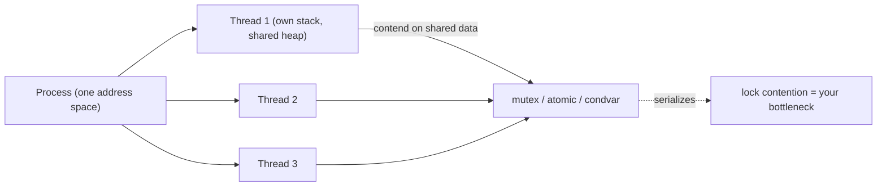

# Threading

<Mode is="learn">

A **thread** is the unit of execution the OS hands you when you say "run this in parallel." Multiple threads inside the same process share one address space — they all see the same heap, the same global variables, the same files — but each has its own stack and its own slot in the CPU scheduler.

That sounds great. The catch is that "share memory" is a euphemism for "fight over memory." Two threads writing to the same counter, or two threads using two counters that happen to live in the same 64-byte cache line, or one thread holding a <Term name="mutex">mutex</Term> while seven others queue up behind it — these are how you turn a multi-core machine into a slightly-slower single-core machine.

This lesson is about the cost of a thread (~10 microseconds to spawn), the cost of contention, and the patterns that make multi-threaded code actually use the cores you paid for.

## TL;DR

- A **thread** is a kernel-scheduled unit of execution sharing the address space of a process. **Creating one costs ~10 μs**; switching between two costs ~1–10 μs depending on cache thrashing.
- **Don't fan out to one thread per task.** Use a thread pool sized to the core count; queue tasks. The thread-per-task model dies under any real workload.
- **Synchronization primitives**: <Term name="atomic variable">atomics</Term> (cheapest, lock-free), <Term name="mutex">mutexes</Term> (general-purpose), condvars (wait/signal), semaphores (counters), barriers (group sync). Pick by the data structure, not the syntax.
- **<Term name="lock contention">Lock contention</Term>** is the silent killer. Two threads fighting over one mutex serialize each other; you've added overhead with no parallelism. The fix is usually: shard the data, use lock-free structures, or relax the consistency requirement.
- The Python <Term name="gil">GIL</Term> **prevents true CPU parallelism in pure Python** — but releases for C extensions (NumPy, PyTorch, etc.). For Python-heavy work use multiprocessing; for C-heavy work threading is fine.

## Mental model



Threads share memory; coordinating that sharing is where threading complexity (and cost) lives.

## Cost of a thread

```cpp
auto t = std::thread([] { do_work(); });
// ... main does other work ...
t.join();
```

- Spawn: ~10 μs (kernel allocates stack, registers thread, schedules).
- Context switch: 1–10 μs depending on whether the new thread's stack is in cache.
- Memory: ~8 MB stack per thread by default (just virtual memory; physical pages are lazy).

For tasks that take under 100 μs, the spawn cost dominates. **Never spawn a thread per request, per token, per pixel.** Use a thread pool.

## Thread pool — the right pattern

```cpp
class ThreadPool {
    std::vector<std::thread> workers;
    std::queue<std::function<void()>> tasks;
    std::mutex mu;
    std::condition_variable cv;
    bool stop = false;
public:
    ThreadPool(size_t n) {
        for (size_t i = 0; i < n; ++i) workers.emplace_back([this]{
            while (true) {
                std::function<void()> task;
                {
                    std::unique_lock lk(mu);
                    cv.wait(lk, [this]{ return stop || !tasks.empty(); });
                    if (stop && tasks.empty()) return;
                    task = std::move(tasks.front()); tasks.pop();
                }
                task();
            }
        });
    }
    template<class F> void enqueue(F&& f) {
        { std::lock_guard lk(mu); tasks.push(std::forward<F>(f)); }
        cv.notify_one();
    }
    ~ThreadPool() {
        { std::lock_guard lk(mu); stop = true; }
        cv.notify_all();
        for (auto& t : workers) t.join();
    }
};
```

Pool size: typically `std::thread::hardware_concurrency()` (logical cores) for compute-bound work, or 2–4× that for I/O-bound. Anything more is just context-switch overhead.

Production frameworks: oneTBB, Intel TBB, libdispatch (Apple), Folly, Boost.Asio, Tokio (Rust), C++ standard executors (proposed, partially shipped). Don't roll your own beyond a quick prototype.

## Atomics — the cheapest primitive

The cheapest synchronization primitive:

```cpp
std::atomic<int> counter{0};

// Two threads can do this concurrently safely:
counter.fetch_add(1, std::memory_order_relaxed);
```

A relaxed atomic increment is ~2–10 cycles on x86 (a `lock add` instruction). Sequentially-consistent (default) is more like 30 cycles. **Use `relaxed` for counters and stats; sequentially-consistent for happens-before relationships.**

When you need more than one atomic value, you usually need a mutex. Atomics compose poorly — `counter1.fetch_add(1); counter2.fetch_add(1)` doesn't atomically update both.

## Mutexes

```cpp
std::mutex mu;
{
    std::lock_guard lk(mu);
    shared_data.update();
}
```

Cost when uncontended: ~10–30 cycles. Cost when contended: depends on contention level — at high contention, a mutex can be 10× slower than the protected work itself.

`std::shared_mutex` (reader-writer): cheaper for read-heavy workloads. Multiple concurrent readers; one writer.

## <Term name="lock contention">Lock contention</Term> — the silent killer

A mutex held by thread A blocks thread B *and* costs B a context switch (so B can do other work or sleep until A releases). On a hot mutex with high contention:

```
Thread 1: do_work_locked() → lock → critical_section_5us → unlock
Thread 2:                     → lock(blocks) → wakes 5us later → critical_section_5us → unlock
Thread 3:                                        → blocks 10us → ...
```

8 threads serializing through one critical section ≈ 1 thread doing 8× the work. Your parallelism just disappeared.

Fixes:
- **Shard the data**: 16 buckets, 16 mutexes; thread X locks `bucket_hash(key) & 15`. Contention drops to 1/16.
- **Use lock-free structures**: `std::atomic` queues, hazard pointers, RCU (Linux kernel pattern). Hard to write; libraries (folly, concurrent_queue) ship them.
- **Use copy-on-write / per-thread accumulators**: each thread updates its own; merge at the end.

## Condition variables

```cpp
std::mutex mu;
std::condition_variable cv;
std::queue<Task> tasks;

// Producer
{ std::lock_guard lk(mu); tasks.push(t); }
cv.notify_one();

// Consumer
{
    std::unique_lock lk(mu);
    cv.wait(lk, [&]{ return !tasks.empty(); });   // sleeps until notified + predicate true
    auto t = std::move(tasks.front()); tasks.pop();
}
```

The `cv.wait(lk, pred)` form handles spurious wakeups correctly. Always use the predicate form.

## The Python <Term name="gil">GIL</Term>

In CPython, a global lock (the **Global Interpreter Lock**) prevents two threads from running Python bytecode simultaneously. This means:

- **Pure Python threading is single-core.** `threading.Thread` runs concurrently for I/O but not CPU.
- **`multiprocessing` does run parallel** (separate processes, separate GILs).
- **C extensions release the GIL** during heavy compute. NumPy, PyTorch, llama.cpp all release; their threads do real parallel work.

For ML: PyTorch's CUDA / CPU kernels release the GIL, so threading.Thread + DataLoader workers do work. For pure-Python orchestration, multiprocessing is the right tool.

CPython 3.13 (2024) introduced an experimental "no-GIL" mode (`--disable-gil`); production rollout is 2025–2026. **Worth tracking** as it changes the threading vs multiprocessing tradeoff for Python-side work.

## Run it in your browser — thread pool sizing

<RunInBrowser
  description="Compute optimal thread pool size for compute-bound vs I/O-bound work."
  code={`import time
from concurrent.futures import ThreadPoolExecutor

def cpu_bound(n=1_000_000):
    """Pure-Python CPU work — limited by GIL."""
    return sum(i*i for i in range(n))

def io_simulated(latency_ms=10):
    """Simulate an I/O wait."""
    time.sleep(latency_ms / 1000)
    return 'ok'

def benchmark(label, fn, n_threads, n_tasks=20):
    t0 = time.perf_counter()
    with ThreadPoolExecutor(max_workers=n_threads) as ex:
        list(ex.map(lambda _: fn(), range(n_tasks)))
    return (time.perf_counter() - t0) * 1000

print("=== Pure-Python CPU work (GIL-bound) ===")
print(f"{'pool size':>10} {'wall (ms)':>12}")
for n in (1, 2, 4, 8, 16):
    t = benchmark('cpu', cpu_bound, n_threads=n)
    print(f"{n:>10} {t:>12.0f}")
print("→ No speedup beyond 1 thread. GIL serializes Python bytecode.")
print()

print("=== Simulated I/O (releases GIL via time.sleep) ===")
print(f"{'pool size':>10} {'wall (ms)':>12}")
for n in (1, 2, 4, 8, 16, 32):
    t = benchmark('io', io_simulated, n_threads=n)
    print(f"{n:>10} {t:>12.0f}")
print("→ Linear speedup until pool >= n_tasks. Threading wins for I/O.")
`}
/>

The output is the canonical Python lesson: threads don't speed up pure-Python CPU code (GIL); they *do* speed up I/O-bound code dramatically. For ML, your compute is in C extensions that release the GIL, so threading still works for kernel launches and dataloading.

## Quick check

<FillIn
  prompt="The CPython mechanism that prevents two threads from executing Python bytecode simultaneously:"
  answer="GIL"
  accept={["Global Interpreter Lock", "the GIL"]}
  hint="Three letters; the reason multiprocessing exists in Python."
  explanation="The GIL = Global Interpreter Lock. It serializes Python bytecode execution. C extensions can release it during heavy compute. CPython 3.13 introduced experimental no-GIL mode."
/>

<Quiz
  question="A team's CPU dataloader uses 32 threads on a 16-core machine. They see no speedup vs 16 threads. Most likely cause:"
  options={[
    'GIL is fully blocking them.',
    'They\'re past the core count; extra threads add context-switch overhead without adding parallelism. Drop to 16 (or fewer).',
    'Their disk is the bottleneck.',
    'Need more memory.',
  ]}
  answer={1}
  explanation={`Once thread count exceeds physical cores (or 2× for SMT), adding more threads doesn't add parallelism — they share cores via context switches. For compute-bound C-extension work, pool size = hardware_concurrency. For I/O-bound, you can go higher because threads spend most time sleeping. Disk being the bottleneck is also possible — confirm with iostat — but the canonical "thread count > cores" antipattern is the first thing to check.`}
/>

## Key takeaways

1. **A thread costs ~10 μs to spawn and ~1–10 μs to switch.** Use thread pools sized to core count.
2. **Atomics, mutexes, condvars, barriers** — pick by data structure, not by intuition.
3. **Lock contention serializes parallelism.** Shard data, use lock-free structures, or rethink the design.
4. **Python GIL prevents pure-Python parallelism**, but C extensions (NumPy, PyTorch) release it. Use multiprocessing for Python-heavy work.
5. **Production frameworks ship thread pools.** TBB, oneTBB, Folly, Boost.Asio. Don't roll your own beyond a prototype.

## Go deeper

<Resources
  items={[
    { kind: 'docs', href: 'https://en.cppreference.com/w/cpp/thread', title: 'cppreference — Thread Support', note: 'Canonical C++ threading API. Covers std::thread, mutex, atomic, condvar, future.' },
    { kind: 'video', href: 'https://www.youtube.com/watch?v=Cx2lWxc4n2c', title: 'Herb Sutter — atomic Weapons (CppCon)', note: 'The talk that demystified C++ atomics. Memory orderings explained well.' },
    { kind: 'docs', href: 'https://docs.python.org/3/library/threading.html', title: 'Python — threading module', note: 'Standard library reference. The "GIL" caveat in the intro is what matters.' },
    { kind: 'paper', href: 'https://www.kernel.org/doc/Documentation/RCU/whatisRCU.txt', title: 'Linux Kernel — What is RCU', note: 'The lock-free pattern that makes the kernel scale. Read once; come back when you need it.' },
    { kind: 'docs', href: 'https://oneapi-src.github.io/oneTBB/', title: 'oneTBB Documentation', note: 'Industrial-strength C++ thread pool + concurrent containers.' },
    { kind: 'blog', href: 'https://lwn.net/Articles/944295/', title: 'LWN — Python without the GIL', note: 'Best technical writeup of the no-GIL Python work. Useful for tracking what\'s coming.' },
  ]}
/>

</Mode>

<Mode is="reference">

## TL;DR

- A **thread** is a kernel-scheduled unit of execution sharing the address space of a process. **Creating one costs ~10 μs**; switching between two costs ~1–10 μs depending on cache thrashing.
- **Don't fan out to one thread per task.** Use a thread pool sized to the core count; queue tasks. The thread-per-task model dies under any real workload.
- **Synchronization primitives**: atomics (cheapest, lock-free), mutexes (general-purpose), condvars (wait/signal), semaphores (counters), barriers (group sync). Pick by the data structure, not the syntax.
- **Lock contention** is the silent killer. Two threads fighting over one mutex serialize each other; you've added overhead with no parallelism. The fix is usually: shard the data, use lock-free structures, or relax the consistency requirement.
- The Python GIL **prevents true CPU parallelism in pure Python** — but releases for C extensions (NumPy, PyTorch, etc.). For Python-heavy work use multiprocessing; for C-heavy work threading is fine.

## Why this matters

Every modern ML system is multi-threaded: the dataloader uses workers, the optimizer uses kernel launches, the serving stack uses async runtimes, the framework's allocator coordinates across threads. Knowing the cost of a thread, of a mutex, of a context switch — and the patterns that avoid each cost — is what separates "scales linearly to 32 cores" from "32 cores barely faster than 1." Threading mistakes don't blow up; they just make your code 10× slower than it should be.

## Mental model


Threads share memory; coordinating that sharing is where threading complexity (and cost) lives.

## Concrete walkthrough

### Cost of a thread

```cpp
auto t = std::thread([] { do_work(); });
// ... main does other work ...
t.join();
```

- Spawn: ~10 μs (kernel allocates stack, registers thread, schedules).
- Context switch: 1–10 μs depending on whether the new thread's stack is in cache.
- Memory: ~8 MB stack per thread by default (just virtual memory; physical pages are lazy).

For tasks that take under 100 μs, the spawn cost dominates. **Never spawn a thread per request, per token, per pixel.** Use a thread pool.

### Thread pool — the right pattern

```cpp
class ThreadPool {
    std::vector<std::thread> workers;
    std::queue<std::function<void()>> tasks;
    std::mutex mu;
    std::condition_variable cv;
    bool stop = false;
public:
    ThreadPool(size_t n) {
        for (size_t i = 0; i < n; ++i) workers.emplace_back([this]{
            while (true) {
                std::function<void()> task;
                {
                    std::unique_lock lk(mu);
                    cv.wait(lk, [this]{ return stop || !tasks.empty(); });
                    if (stop && tasks.empty()) return;
                    task = std::move(tasks.front()); tasks.pop();
                }
                task();
            }
        });
    }
    template<class F> void enqueue(F&& f) {
        { std::lock_guard lk(mu); tasks.push(std::forward<F>(f)); }
        cv.notify_one();
    }
    ~ThreadPool() {
        { std::lock_guard lk(mu); stop = true; }
        cv.notify_all();
        for (auto& t : workers) t.join();
    }
};
```

Pool size: typically `std::thread::hardware_concurrency()` (logical cores) for compute-bound work, or 2–4× that for I/O-bound. Anything more is just context-switch overhead.

Production frameworks: oneTBB, Intel TBB, libdispatch (Apple), Folly, Boost.Asio, Tokio (Rust), C++ standard executors (proposed, partially shipped). Don't roll your own beyond a quick prototype.

### Atomics

The cheapest synchronization primitive:

```cpp
std::atomic<int> counter{0};

// Two threads can do this concurrently safely:
counter.fetch_add(1, std::memory_order_relaxed);
```

A relaxed atomic increment is ~2–10 cycles on x86 (a `lock add` instruction). Sequentially-consistent (default) is more like 30 cycles. **Use `relaxed` for counters and stats; sequentially-consistent for happens-before relationships.**

When you need more than one atomic value, you usually need a mutex. Atomics compose poorly — `counter1.fetch_add(1); counter2.fetch_add(1)` doesn't atomically update both.

### Mutexes

```cpp
std::mutex mu;
{
    std::lock_guard lk(mu);
    shared_data.update();
}
```

Cost when uncontended: ~10–30 cycles. Cost when contended: depends on contention level — at high contention, a mutex can be 10× slower than the protected work itself.

`std::shared_mutex` (reader-writer): cheaper for read-heavy workloads. Multiple concurrent readers; one writer.

### Lock contention — the silent killer

A mutex held by thread A blocks thread B *and* costs B a context switch (so B can do other work or sleep until A releases). On a hot mutex with high contention:

```
Thread 1: do_work_locked() → lock → critical_section_5us → unlock
Thread 2:                     → lock(blocks) → wakes 5us later → critical_section_5us → unlock
Thread 3:                                        → blocks 10us → ...
```

8 threads serializing through one critical section ≈ 1 thread doing 8× the work. Your parallelism just disappeared.

Fixes:
- **Shard the data**: 16 buckets, 16 mutexes; thread X locks `bucket_hash(key) & 15`. Contention drops to 1/16.
- **Use lock-free structures**: `std::atomic` queues, hazard pointers, RCU (Linux kernel pattern). Hard to write; libraries (folly, concurrent_queue) ship them.
- **Use copy-on-write / per-thread accumulators**: each thread updates its own; merge at the end.

### Condition variables

```cpp
std::mutex mu;
std::condition_variable cv;
std::queue<Task> tasks;

// Producer
{ std::lock_guard lk(mu); tasks.push(t); }
cv.notify_one();

// Consumer
{
    std::unique_lock lk(mu);
    cv.wait(lk, [&]{ return !tasks.empty(); });   // sleeps until notified + predicate true
    auto t = std::move(tasks.front()); tasks.pop();
}
```

The `cv.wait(lk, pred)` form handles spurious wakeups correctly. Always use the predicate form.

### The Python GIL

In CPython, a global lock (the **Global Interpreter Lock**) prevents two threads from running Python bytecode simultaneously. This means:

- **Pure Python threading is single-core.** `threading.Thread` runs concurrently for I/O but not CPU.
- **`multiprocessing` does run parallel** (separate processes, separate GILs).
- **C extensions release the GIL** during heavy compute. NumPy, PyTorch, llama.cpp all release; their threads do real parallel work.

For ML: PyTorch's CUDA / CPU kernels release the GIL, so threading.Thread + DataLoader workers do work. For pure-Python orchestration, multiprocessing is the right tool.

CPython 3.13 (2024) introduced an experimental "no-GIL" mode (`--disable-gil`); production rollout is 2025–2026. **Worth tracking** as it changes the threading vs multiprocessing tradeoff for Python-side work.

## Run it in your browser — thread pool sizing

<RunInBrowser
  description="Compute optimal thread pool size for compute-bound vs I/O-bound work."
  code={`import time
from concurrent.futures import ThreadPoolExecutor

def cpu_bound(n=1_000_000):
    """Pure-Python CPU work — limited by GIL."""
    return sum(i*i for i in range(n))

def io_simulated(latency_ms=10):
    """Simulate an I/O wait."""
    time.sleep(latency_ms / 1000)
    return 'ok'

def benchmark(label, fn, n_threads, n_tasks=20):
    t0 = time.perf_counter()
    with ThreadPoolExecutor(max_workers=n_threads) as ex:
        list(ex.map(lambda _: fn(), range(n_tasks)))
    return (time.perf_counter() - t0) * 1000

print("=== Pure-Python CPU work (GIL-bound) ===")
print(f"{'pool size':>10} {'wall (ms)':>12}")
for n in (1, 2, 4, 8, 16):
    t = benchmark('cpu', cpu_bound, n_threads=n)
    print(f"{n:>10} {t:>12.0f}")
print("→ No speedup beyond 1 thread. GIL serializes Python bytecode.")
print()

print("=== Simulated I/O (releases GIL via time.sleep) ===")
print(f"{'pool size':>10} {'wall (ms)':>12}")
for n in (1, 2, 4, 8, 16, 32):
    t = benchmark('io', io_simulated, n_threads=n)
    print(f"{n:>10} {t:>12.0f}")
print("→ Linear speedup until pool >= n_tasks. Threading wins for I/O.")
`}
/>

The output is the canonical Python lesson: threads don't speed up pure-Python CPU code (GIL); they *do* speed up I/O-bound code dramatically. For ML, your compute is in C extensions that release the GIL, so threading still works for kernel launches and dataloading.

## Quick check

<FillIn
  prompt="The CPython mechanism that prevents two threads from executing Python bytecode simultaneously:"
  answer="GIL"
  accept={["Global Interpreter Lock", "the GIL"]}
  hint="Three letters; the reason multiprocessing exists in Python."
  explanation="The GIL = Global Interpreter Lock. It serializes Python bytecode execution. C extensions can release it during heavy compute. CPython 3.13 introduced experimental no-GIL mode."
/>

<Quiz
  question="A team's CPU dataloader uses 32 threads on a 16-core machine. They see no speedup vs 16 threads. Most likely cause:"
  options={[
    'GIL is fully blocking them.',
    'They\'re past the core count; extra threads add context-switch overhead without adding parallelism. Drop to 16 (or fewer).',
    'Their disk is the bottleneck.',
    'Need more memory.',
  ]}
  answer={1}
  explanation={`Once thread count exceeds physical cores (or 2× for SMT), adding more threads doesn't add parallelism — they share cores via context switches. For compute-bound C-extension work, pool size = hardware_concurrency. For I/O-bound, you can go higher because threads spend most time sleeping. Disk being the bottleneck is also possible — confirm with iostat — but the canonical "thread count > cores" antipattern is the first thing to check.`}
/>

## Key takeaways

1. **A thread costs ~10 μs to spawn and ~1–10 μs to switch.** Use thread pools sized to core count.
2. **Atomics, mutexes, condvars, barriers** — pick by data structure, not by intuition.
3. **Lock contention serializes parallelism.** Shard data, use lock-free structures, or rethink the design.
4. **Python GIL prevents pure-Python parallelism**, but C extensions (NumPy, PyTorch) release it. Use multiprocessing for Python-heavy work.
5. **Production frameworks ship thread pools.** TBB, oneTBB, Folly, Boost.Asio. Don't roll your own beyond a prototype.

## Go deeper

<Resources
  items={[
    { kind: 'docs', href: 'https://en.cppreference.com/w/cpp/thread', title: 'cppreference — Thread Support', note: 'Canonical C++ threading API. Covers std::thread, mutex, atomic, condvar, future.' },
    { kind: 'video', href: 'https://www.youtube.com/watch?v=Cx2lWxc4n2c', title: 'Herb Sutter — atomic Weapons (CppCon)', note: 'The talk that demystified C++ atomics. Memory orderings explained well.' },
    { kind: 'docs', href: 'https://docs.python.org/3/library/threading.html', title: 'Python — threading module', note: 'Standard library reference. The "GIL" caveat in the intro is what matters.' },
    { kind: 'paper', href: 'https://www.kernel.org/doc/Documentation/RCU/whatisRCU.txt', title: 'Linux Kernel — What is RCU', note: 'The lock-free pattern that makes the kernel scale. Read once; come back when you need it.' },
    { kind: 'docs', href: 'https://oneapi-src.github.io/oneTBB/', title: 'oneTBB Documentation', note: 'Industrial-strength C++ thread pool + concurrent containers.' },
    { kind: 'blog', href: 'https://lwn.net/Articles/944295/', title: 'LWN — Python without the GIL', note: 'Best technical writeup of the no-GIL Python work. Useful for tracking what\'s coming.' },
  ]}
/>

</Mode>

<LessonComplete />
