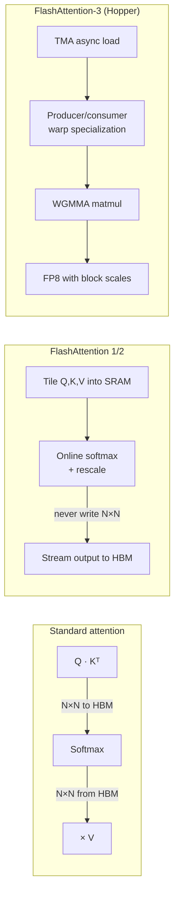

# FlashAttention-3

## TL;DR

- **Standard attention writes the $N \times N$ matrix to HBM**, then reads it back. That's $O(N^2)$ memory traffic and is *the* bottleneck — not the FLOPs.
- **FlashAttention-1/2** tile the computation, never materialize the full $N \times N$ matrix in HBM, and use the **online softmax** trick to fuse softmax with matmul.
- **FlashAttention-3 (2024)** rewrites for Hopper: TMA async copies, warp-specialized producer/consumer, FP8 with block-scaled accumulation. **~75% of H100 peak** for fp16/bf16, and FP8 throughput nearly doubles that.
- Net effect on inference: same model, same numbers — **2–4× faster** attention layer, longer contexts feasible, lower memory pressure.

## Why this matters

A naive attention kernel reads from and writes to HBM (the GPU's main memory) something like $20 \times$ more bytes than the math actually requires. HBM bandwidth, not FLOPs, is what bottlenecks LLM inference. FlashAttention is the single biggest kernel-level win of the last 5 years — it's why long-context models exist at scale.

If you're going to read one ML systems paper, this family is it. Then re-read it after touching CUDA for a month.

## Mental model — three regimes



The conceptual leap is FA-1: **never materialize the $N \times N$ attention matrix.** Everything since is engineering on top of that.

## Concrete walkthrough — why it's actually faster

### Standard attention's memory traffic

For sequence length $N$, head dim $d$:

```
Q, K, V        →  3 × N × d   bytes loaded
Q · Kᵀ → S     →  N × N       bytes written, then read back
softmax(S)     →  N × N       written + read again
P · V → O      →  N × d       written
```

Total HBM traffic: $\approx 4N^2 + 8Nd$ bytes (in fp16/bf16). At $N = 8192, d = 128$ that's **268 MB per attention call** — read and written across HBM. Per layer. Per token in decode. The math takes ~1 µs; the memory reads take 5–10 µs.

### FlashAttention's tiling

Instead, split Q into blocks of $B_r$ rows, K and V into blocks of $B_c$ columns. For each Q-block, stream over all K/V blocks, keep a running max and sum for the softmax, never write the intermediate $N \times N$.

The **online softmax** keeps $(m, \ell)$ — running max and sum of exponentials — and rescales the partial output as new K-blocks arrive:

$$
m^{(j)} = \max(m^{(j-1)}, \tilde m^{(j)}), \quad
\ell^{(j)} = e^{m^{(j-1)} - m^{(j)}} \ell^{(j-1)} + e^{\tilde m^{(j)} - m^{(j)}} \tilde \ell^{(j)}
$$

After the last K-block, divide by $\ell$. Mathematically identical to standard softmax; numerically stable; never stores the full attention matrix.

### What FlashAttention-3 added on Hopper

| Mechanism | What it does | Why it helps |
| --- | --- | --- |
| **TMA** (Tensor Memory Accelerator) | Async bulk copies HBM↔SRAM with one instruction | Frees the SMs to compute while data moves |
| **Warp specialization** | Some warps do TMA loads (producer), others do WGMMA matmul (consumer) | Compute and IO overlap perfectly within a CTA |
| **WGMMA** | Hopper's warpgroup matmul instruction | Higher throughput than mma.sync for big tiles |
| **FP8 with block scaling** | E4M3 inputs, FP32 accumulation, per-block scale factors | ~2× throughput vs BF16 with negligible quality loss |

Result: **~75% of H100 BF16 peak**, **~85% of FP8 peak** in published numbers.

## Run it in your browser

A pure-Python toy that demonstrates the online softmax — exactly how FlashAttention's inner loop accumulates without materializing the full attention matrix:

<RunInBrowser
  description="Online vs standard softmax — proves they're identical, but online uses O(d) memory."
  code={`import math

def standard_softmax(scores):
    m = max(scores)
    exps = [math.exp(s - m) for s in scores]
    Z = sum(exps)
    return [e / Z for e in exps]

def online_softmax_running(scores):
    """Single-pass: running max + running sum, rescaling as new scores arrive."""
    m = -float('inf')
    ell = 0.0
    out = []  # we'll fill this incrementally
    for s in scores:
        m_new = max(m, s)
        ell = ell * math.exp(m - m_new) + math.exp(s - m_new)
        m = m_new
    # second pass to normalize (FlashAttention does this online too via output rescaling)
    return [math.exp(s - m) / ell for s in scores]

scores = [3.1, 1.5, 4.2, 0.7, 2.9, -1.0, 5.5, 2.0]
print("standard:", [round(x, 5) for x in standard_softmax(scores)])
print("online:  ", [round(x, 5) for x in online_softmax_running(scores)])
print("identical?", all(abs(a-b) < 1e-9 for a, b in zip(standard_softmax(scores), online_softmax_running(scores))))
`}
/>

The ~7 lines of running-max-and-sum logic is the *entire mathematical insight* of FlashAttention. Everything else is GPU engineering.

## Run it on real hardware

<ColabLink
  href="https://colab.research.google.com/github/your-github/mosaic-notebooks/blob/main/flash-attention.ipynb"
  description="Benchmark naive PyTorch attention vs torch.nn.functional.scaled_dot_product_attention (which calls FA-2 under the hood) on a Colab T4. Watch HBM traffic drop."
/>

## Quick check

<Quiz
  question="Standard attention's bottleneck is most accurately described as:"
  options={[
    'FLOPs — the model has too many multiplications.',
    'HBM bandwidth — reading and writing the N×N attention matrix dominates total runtime.',
    'Register pressure — too many live values in the kernel.',
    'Synchronization overhead between the GPU and CPU.',
  ]}
  answer={1}
  explanation="Naive attention is memory-bound: the FLOPs take ~1 µs while reading/writing the N×N matrix to HBM takes 5-10 µs. FlashAttention's whole reason for being is fusing softmax+matmul into a single tiled pass that never materializes the N×N matrix — saving HBM bandwidth, not compute."
/>

## Key takeaways

1. **Attention is memory-bound, not compute-bound.** This is the single fact that makes the FlashAttention family the right thing.
2. **Online softmax** = running max + running sum + output rescale. Mathematically equal to standard softmax, but doesn't need the full attention matrix in memory.
3. **FA-2 was great on A100; FA-3 is the Hopper-specific rewrite.** TMA + warp specialization + WGMMA + FP8 stacked together. Don't use FA-1/2 on H100 if you can avoid it.
4. **`torch.nn.functional.scaled_dot_product_attention` already calls FA under the hood** in modern PyTorch — you usually don't write the kernel yourself.
5. **The sweet spot is large $N$.** For $N < 512$, naive attention is fine; the tiling overhead doesn't pay back.

## Go deeper

<Resources
  items={[
    { kind: 'paper', href: 'https://arxiv.org/abs/2205.14135', title: 'FlashAttention: Fast and Memory-Efficient Exact Attention with IO-Awareness', author: 'Dao, Fu, Ermon, Rudra, Ré (2022)', note: 'The original. Required reading. The IO-awareness framing changed how the field thinks about kernels.' },
    { kind: 'paper', href: 'https://arxiv.org/abs/2307.08691', title: 'FlashAttention-2: Faster Attention with Better Parallelism and Work Partitioning', author: 'Tri Dao (2023)', note: 'The cleaner re-derivation. Better warp partitioning, simpler online softmax statement.' },
    { kind: 'paper', href: 'https://arxiv.org/abs/2407.08608', title: 'FlashAttention-3: Fast and Accurate Attention with Asynchrony and Low-Precision', author: 'Shah, Bikshandi, Ye, Bradbury, Tillet, Salvi, Dao (2024)', note: 'Hopper-specific rewrite. TMA, warp specialization, FP8 with block scaling.' },
    { kind: 'video', href: 'https://www.youtube.com/watch?v=zEuwuCTEf_0', title: 'Tri Dao — FlashAttention-3 talk', author: 'Tri Dao at Hazy Research', note: 'Author walking through why FA-3 looks the way it does on Hopper.' },
    { kind: 'blog', href: 'https://tridao.me/blog/2024/flash3/', title: 'FlashAttention-3 — author\'s blog post', author: 'Tri Dao', note: 'The most accessible writeup of the FA-3 architecture. Read before the paper.' },
    { kind: 'repo', href: 'https://github.com/Dao-AILab/flash-attention', title: 'Dao-AILab/flash-attention', note: 'Reference implementation. Read `csrc/flash_attn/` for the actual CUDA.' },
    { kind: 'blog', href: 'https://www.thonking.ai/p/flashattention-2-by-tri-dao', title: 'FlashAttention-2 explained', author: 'Horace He / Thonking AI', note: 'Best non-author explainer I\'ve found. Diagrams beat the paper for intuition.' },
    { kind: 'paper', href: 'https://arxiv.org/abs/2407.10671', title: 'ThunderKittens: Simple, Fast, and Adorable AI Kernels', author: 'Spector, Dao, Re et al. (Hazy Research, 2024)', note: 'A different DSL for writing FA-3-class kernels with less code. Worth reading after the FA-3 paper.' },
  ]}
/>

<LessonComplete />
