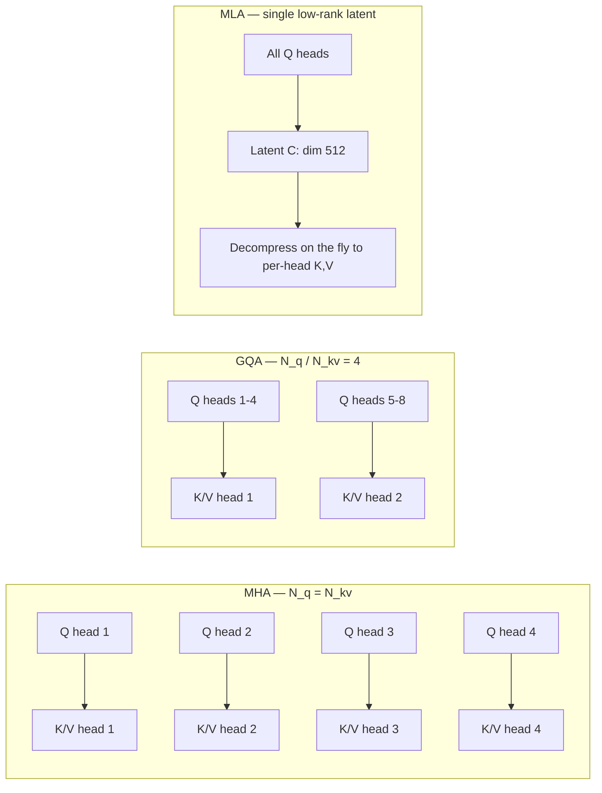

# GQA, MQA & MLA

<Mode is="learn">

> **Prereq:** [Multi-Head Attention](./mha) — every variant on this page is a way to *not* store one (K, V) pair per Q head. If MHA isn't in your head, read that first.

When you load a Llama-3-70B checkpoint, one line in the config file says `num_key_value_heads: 8`. Set against the 64 query heads, that field is the difference between a model that fits on one H100 and one that needs a node. Behind that single integer is the entire <Term name="kv cache">KV-cache</Term>-compression literature of the last five years.

This lesson is about three points on the same axis. **Multi-Query Attention** (MQA) shares one K/V across every Q head — extreme compression, real quality cost, mostly abandoned. **Grouped-Query Attention** (GQA) shares K/V within groups — Llama 3, Mistral, Qwen, Gemma all use it. **Multi-head Latent Attention** (MLA) doesn't store K/V at all; it stores a small latent vector per token and reconstructs K/V on the fly — DeepSeek-V3, ~50× smaller cache than MHA at the same quality.

The math of attention doesn't change. The softmax is still a softmax. What changes is **what gets cached**, and that is the binding constraint of modern LLM serving.

## TL;DR

- **MHA** has one K/V head per Q head — every token's KV cache scales with $H$ heads. Memory bottleneck.
- **MQA** (Shazeer, 2019): one K/V head shared across all Q heads. Cache shrinks $H\times$. Quality drops noticeably at scale.
- **GQA** (Ainslie et al., 2023): groups of Q heads share K/V. **Default** in Llama-3, Mistral, Qwen-2.5 — cache shrinks 4–8×, quality matches MHA.
- **MLA** (DeepSeek-V2/V3, 2024): K/V projected into a low-rank **latent** space, decompressed only when needed. Cache shrinks **another 5–10×** vs GQA, with quality matching or exceeding MHA.
- **The tradeoff** is always cache size vs quality. As of April 2026, GQA is the floor and MLA is the frontier — DeepSeek-V3 (Dec 2024) and Kimi-style follow-ups have proven MLA at 600B+ scale, and other open-frontier labs are evaluating it for their next-gen long-context models.

## Why the cache is the bottleneck

For a 70B model at 32K context with batch 16, naive MHA would need ~80 GB of KV cache alone — more than the weights themselves. **GQA cuts that to 10 GB. MLA cuts it to ~1 GB.** That's not a marginal optimization; it's the difference between fitting on one H100 and needing a whole node.

Frontier model architecture choices in 2024–2026 are increasingly cache-driven, not compute-driven. Compute is cheap; HBM bandwidth and capacity are the bottlenecks. Every architectural decision past 2023 — GQA, MLA, sliding-window attention, sparse mixers — is a way to spend less HBM per token.

## Mental model



Each step removes redundancy: MHA stores per-head K,V; GQA shares within groups; MLA stores a *compressed* representation and reconstructs per-head K,V at attention time.

## MHA cache size

$$
\text{cache} = 2 \times L \times H \times d_{\text{head}} \times T \times \text{bytes}
$$

For a hypothetical Llama-1 65B-class config ($H = 64, d_h = 128, L = 80$) at $T = 8192$, BF16, **if it had used MHA at this size**:

$$
2 \times 80 \times 64 \times 128 \times 8192 \times 2 \approx 21\text{ GB / sequence}
$$

That's the kind of number that kept pre-2023 models below 4K context. Llama-2 70B was the inflection — it shipped with GQA precisely to dodge this wall.

## GQA fixes most of this

Llama-3 70B uses $H = 64$ Q heads but only $H_{\text{kv}} = 8$ K/V heads (group size 8). Cache becomes:

$$
2 \times 80 \times 8 \times 128 \times 8192 \times 2 \approx 2.6\text{ GB / sequence}
$$

8× reduction. Quality is essentially indistinguishable from MHA on standard benchmarks. Cost: a tiny extra matmul to repeat K/V across the group.

```python
# GQA forward sketch
def gqa(x, q_proj, k_proj, v_proj, n_q_heads=64, n_kv_heads=8, d_head=128):
    B, T, _ = x.shape
    Q = q_proj(x).view(B, T, n_q_heads, d_head)         # full heads
    K = k_proj(x).view(B, T, n_kv_heads, d_head)        # 1/8 heads
    V = v_proj(x).view(B, T, n_kv_heads, d_head)
    # Repeat K, V across each group's Q heads (no extra storage; broadcast at compute time)
    K = K.repeat_interleave(n_q_heads // n_kv_heads, dim=2)
    V = V.repeat_interleave(n_q_heads // n_kv_heads, dim=2)
    return scaled_dot_product_attention(Q, K, V)
```

In production (FA-3, vLLM), the `repeat_interleave` is fused into the kernel — no extra memory traffic.

## MQA — the extreme corner

MQA = GQA with $H_{\text{kv}} = 1$. Maximum compression, lowest quality. Used in PaLM (2022). Mostly abandoned for GQA at scale because the quality gap is real — group size 1 is too aggressive and you lose enough fidelity in the K/V representation that benchmarks notice. Group size 4–8 turns out to be the sweet spot.

## MLA — DeepSeek's latent compression

The trick: don't store K and V at all. Store a **shared latent** $c_t \in \mathbb{R}^{d_c}$ per token (e.g., $d_c = 512$), and reconstruct K and V per-head from $c_t$ on demand:

$$
c_t = W_{DKV} \cdot h_t, \quad K_t^{(i)} = W_{UK}^{(i)} \cdot c_t, \quad V_t^{(i)} = W_{UV}^{(i)} \cdot c_t
$$

For DeepSeek-V3 (MLA + 128 Q heads, $d_c = 512$, 61 layers), per-token cache is one $c_t$ vector + a small RoPE-K vector — about **~70 KB per token**, vs **~330 KB per token** for an 80-layer GQA model with $H_{kv}=8, d_h=128$. **~5× smaller than GQA per token; ~50× smaller than the equivalent MHA**, quality on par or better.

The catch: the decompression is real compute. MLA trades cache memory for FLOPs at attention time. On H100, this is the right trade — FLOPs are abundant, HBM bandwidth is scarce.

```python
# MLA forward sketch (simplified; real impl interleaves with RoPE)
def mla(x, W_dkv, W_uk_per_head, W_uv_per_head, ...):
    c = x @ W_dkv                          # (B, T, d_c=512)
    # Cache only c — small!
    k_per_head = c @ W_uk_per_head         # decompress to (B, T, H, d_head) on the fly
    v_per_head = c @ W_uv_per_head
    return scaled_dot_product_attention(q, k_per_head, v_per_head)
```

DeepSeek showed (V2, May 2024) and confirmed (V3, Dec 2024) that MLA matches or beats MHA on long-context benchmarks while keeping the cache an order of magnitude smaller than MHA — and ~5× smaller than GQA. Frontier labs running their own latent-compression experiments through 2025–2026 is the trend to watch; expect at least one major Western open-weight model to ship MLA-style attention before end-2026.

## Real-world adoption (April 2026)

| Model family | Attention | $H_q / H_{kv}$ |
| --- | --- | --- |
| Llama-1 7B / 65B | MHA | 32 / 32, 64 / 64 |
| Llama-2 7B | MHA | 32 / 32 |
| Llama-2 70B | GQA | 64 / 8 |
| **Llama-3 / 3.1 70B** | **GQA** | 64 / 8 |
| **Mistral 7B / Mixtral** | **GQA** | 32 / 8 |
| **Qwen-2.5 / Qwen-3** | **GQA** | varies, typ. group=4–8 |
| Gemma-2 9B / 27B | GQA + sliding window | varies |
| **DeepSeek-V2 / V3** | **MLA** | 128 Q + latent $d_c=512$ |
| Llama-4 Scout / Maverick | GQA + iRoPE / chunked attn | 2025 long-context via interleaved-RoPE, not MLA |

GQA is the universal floor. MLA is the open frontier; iRoPE / chunked attention is the parallel, RoPE-side path Meta took.

## Run it in your browser — see the cache shrink

<RunInBrowser
  description="Compute KV-cache size per sequence for MHA vs GQA vs MLA across model sizes."
  code={`def cache_bytes(L, H_q, H_kv, d_head, T, dtype_bytes=2, mode='gqa', d_c=512):
    if mode == 'mha' or mode == 'gqa':
        return 2 * L * H_kv * d_head * T * dtype_bytes
    if mode == 'mla':
        # latent c_t plus a small RoPE-key shared across heads
        return L * (d_c + d_head) * T * dtype_bytes

# Llama 70B-class config (varies slightly across families)
configs = [
    ('MHA  (no sharing)        H_kv=64', 'mha', 80, 64, 64, 128),
    ('GQA  (group=8)           H_kv=8',  'gqa', 80, 64, 8,  128),
    ('GQA  (group=4)           H_kv=16', 'gqa', 80, 64, 16, 128),
    ('MLA  (DeepSeek-V3 style) d_c=512', 'mla', 80, 64, 8,  128),
]

print(f"{'config':<40} {'cache @ 8K':>12}  {'cache @ 32K':>12}  {'cache @ 128K':>12}")
print('-' * 80)
for label, mode, L, H_q, H_kv, d_head in configs:
    sizes = []
    for T in (8_192, 32_768, 131_072):
        gb = cache_bytes(L, H_q, H_kv, d_head, T, mode=mode) / 1024**3
        sizes.append(f"{gb:>9.2f} GB")
    print(f"{label:<40} {sizes[0]:>12}  {sizes[1]:>12}  {sizes[2]:>12}")
`}
/>

You should see GQA cut MHA by ~8× and MLA cut another ~10× on top — the headline numbers from the DeepSeek-V3 paper.

## Quick check

<FillIn
  prompt="The reciprocal of compression. If Llama-3 70B uses 64 query heads and 8 KV heads, the GQA group size is:"
  answer="8"
  hint="64 / 8."
  explanation="Group size = n_query_heads / n_kv_heads. Each KV head is shared across 8 query heads."
/>

<Quiz
  question="DeepSeek-V3 ships with MLA. What's the *primary* tradeoff this introduces vs GQA?"
  options={[
    'Higher training compute — the latent must be learned end-to-end.',
    'Slower attention per step — extra matmul to decompress K/V from the latent.',
    'Lower quality on short-context benchmarks.',
    'Incompatible with FlashAttention — kernels must be rewritten from scratch.',
  ]}
  answer={1}
  explanation="MLA trades HBM bandwidth for FLOPs. The cache shrinks 10×+, but every attention step now also runs the decompression matmul from latent → per-head K,V. On H100, where FLOPs are abundant and HBM bandwidth is scarce, this is the right trade. Quality matches or beats MHA on standard benchmarks; FlashAttention has been adapted with custom kernels (DeepSeek released their kernels)."
/>

## Key takeaways

1. **GQA is the universal default.** If a 2024+ model isn't using it, that's a deliberate research choice, not an oversight.
2. **MQA is essentially deprecated** for serious models — GQA gets ~all the savings without the quality regression.
3. **MLA is the frontier** of cache compression. DeepSeek-V3 showed it works at 600B+ scale; expect more frontier models to adopt it through 2026.
4. **The metric to watch is "KV bytes per token per layer."** Lower is better. MHA: $2 \cdot H \cdot d_h$. GQA: $2 \cdot H_{kv} \cdot d_h$. MLA: $\approx d_c$.
5. **None of this changes attention's mathematical behavior.** Same softmax, same gradients. Just different representations of K, V.

## Go deeper

<Resources
  items={[
    { kind: 'paper', href: 'https://arxiv.org/abs/1911.02150', title: 'Fast Transformer Decoding: One Write-Head is All You Need (MQA)', author: 'Shazeer (2019)', note: 'The original MQA paper. 6 pages, foundational.' },
    { kind: 'paper', href: 'https://arxiv.org/abs/2305.13245', title: 'GQA: Training Generalized Multi-Query Transformer Models', author: 'Ainslie et al. (Google, 2023)', note: 'Why every modern model uses GQA.' },
    { kind: 'paper', href: 'https://arxiv.org/abs/2405.04434', title: 'DeepSeek-V2: Multi-head Latent Attention (MLA)', author: 'DeepSeek-AI (May 2024)', note: 'First detailed MLA writeup.' },
    { kind: 'paper', href: 'https://arxiv.org/abs/2412.19437', title: 'DeepSeek-V3 Technical Report', author: 'DeepSeek-AI (December 2024)', note: 'MLA at 671B-MoE scale, plus FP8 training. The most-discussed open-model paper of late 2024.' },
    { kind: 'blog', href: 'https://www.lesswrong.com/posts/dD2Qt9LM39NTJWAGy/deepseek-v3-an-engineering-marvel', title: 'DeepSeek-V3 — engineering marvel', note: 'Best non-author explainer of the V3 architecture as a whole.' },
    { kind: 'video', href: 'https://www.youtube.com/watch?v=ECXKFYpr_Ik', title: 'Andrej Karpathy — Deep Dive into LLMs', author: 'Andrej Karpathy', note: 'Long form. The attention section motivates GQA / MLA cleanly.' },
    { kind: 'repo', href: 'https://github.com/deepseek-ai/DeepSeek-V3', title: 'deepseek-ai/DeepSeek-V3', note: 'Reference implementation. Read `inference/model.py` for the cleanest MLA forward I\'ve seen.' },
    { kind: 'paper', href: 'https://arxiv.org/abs/2502.07864', title: 'A Survey on Attention Mechanisms (post-MLA, 2025)', note: 'Most recent literature review covering the GQA/MLA/sparse zoo as of early 2025.' },
  ]}
/>

</Mode>

<Mode is="reference">

> **Prereq:** [Multi-Head Attention](./mha) — every variant on this page is a way to *not* store one (K, V) pair per Q head. If MHA isn't in your head, read that first.

## TL;DR

- **MHA** has one K/V head per Q head — every token's KV cache scales with $H$ heads. Memory bottleneck.
- **MQA** (Shazeer, 2019): one K/V head shared across all Q heads. Cache shrinks $H\times$. Quality drops noticeably at scale.
- **GQA** (Ainslie et al., 2023): groups of Q heads share K/V. **Default** in Llama-3, Mistral, Qwen-2.5 — cache shrinks 4–8×, quality matches MHA.
- **MLA** (DeepSeek-V2/V3, 2024): K/V projected into a low-rank **latent** space, decompressed only when needed. Cache shrinks **another 5–10×** vs GQA, with quality matching or exceeding MHA.
- **The tradeoff** is always cache size vs quality. As of April 2026, GQA is the floor and MLA is the frontier — DeepSeek-V3 (Dec 2024) and Kimi-style follow-ups have proven MLA at 600B+ scale, and other open-frontier labs are evaluating it for their next-gen long-context models.

## Why this matters

The KV cache is the binding memory constraint in LLM serving (see [KV Cache Basics](../kv-cache/kv-basics)). For a 70B model at 32K context with batch 16, naive MHA would need ~80 GB of cache alone — more than weights. GQA cuts that to 10 GB. MLA cuts it to ~1 GB.

That's not a marginal optimization. It's the difference between "fits on one H100" and "needs a node".

Frontier model architecture choices in 2024–2026 are increasingly cache-driven, not compute-driven. Understanding this hierarchy is core ML systems literacy.

## Mental model


Each step removes redundancy: MHA stores per-head K,V; GQA shares within groups; MLA stores a *compressed* representation and reconstructs per-head K,V at attention time.

## Concrete walkthrough

### MHA cache size

$$
\text{cache} = 2 \times L \times H \times d_{\text{head}} \times T \times \text{bytes}
$$

For a hypothetical Llama-1 65B-class config ($H = 64, d_h = 128, L = 80$) at $T = 8192$, BF16, **if it had used MHA at this size**:

$$
2 \times 80 \times 64 \times 128 \times 8192 \times 2 \approx 21\text{ GB / sequence}
$$

That's the kind of number that kept pre-2023 models below 4K context. Llama-2 70B was the inflection — it shipped with GQA precisely to dodge this wall.

### GQA fixes most of this

Llama-3 70B uses $H = 64$ Q heads but only $H_{\text{kv}} = 8$ K/V heads (group size 8). Cache becomes:

$$
2 \times 80 \times 8 \times 128 \times 8192 \times 2 \approx 2.6\text{ GB / sequence}
$$

8× reduction. Quality is essentially indistinguishable from MHA on standard benchmarks. Cost: a tiny extra matmul to repeat K/V across the group.

```python
# GQA forward sketch
def gqa(x, q_proj, k_proj, v_proj, n_q_heads=64, n_kv_heads=8, d_head=128):
    B, T, _ = x.shape
    Q = q_proj(x).view(B, T, n_q_heads, d_head)         # full heads
    K = k_proj(x).view(B, T, n_kv_heads, d_head)        # 1/8 heads
    V = v_proj(x).view(B, T, n_kv_heads, d_head)
    # Repeat K, V across each group's Q heads (no extra storage; broadcast at compute time)
    K = K.repeat_interleave(n_q_heads // n_kv_heads, dim=2)
    V = V.repeat_interleave(n_q_heads // n_kv_heads, dim=2)
    return scaled_dot_product_attention(Q, K, V)
```

In production (FA-3, vLLM), the repeat_interleave is fused into the kernel — no extra memory traffic.

### MQA — the extreme corner

MQA = GQA with $H_{\text{kv}} = 1$. Maximum compression, lowest quality. Used in PaLM (2022). Mostly abandoned for GQA at scale because the quality gap is real.

### MLA — DeepSeek's latent compression

The trick: don't store K and V at all. Store a **shared latent** $c_t \in \mathbb{R}^{d_c}$ per token (e.g., $d_c = 512$), and reconstruct K and V per-head from $c_t$ on demand:

$$
c_t = W_{DKV} \cdot h_t, \quad K_t^{(i)} = W_{UK}^{(i)} \cdot c_t, \quad V_t^{(i)} = W_{UV}^{(i)} \cdot c_t
$$

For DeepSeek-V3 (MLA + 128 Q heads, $d_c = 512$, 61 layers), per-token cache is one $c_t$ vector + a small RoPE-K vector — about **~70 KB per token**, vs **~330 KB per token** for an 80-layer GQA model with $H_{kv}=8, d_h=128$. **~5× smaller than GQA per token; ~50× smaller than the equivalent MHA**, quality on par or better.

The catch: the decompression is real compute. MLA trades cache memory for FLOPs at attention time. On H100, this is the right trade — FLOPs are abundant, HBM bandwidth is scarce.

```python
# MLA forward sketch (simplified; real impl interleaves with RoPE)
def mla(x, W_dkv, W_uk_per_head, W_uv_per_head, ...):
    c = x @ W_dkv                          # (B, T, d_c=512)
    # Cache only c — small!
    k_per_head = c @ W_uk_per_head         # decompress to (B, T, H, d_head) on the fly
    v_per_head = c @ W_uv_per_head
    return scaled_dot_product_attention(q, k_per_head, v_per_head)
```

DeepSeek showed (V2, May 2024) and confirmed (V3, Dec 2024) that MLA matches or beats MHA on long-context benchmarks while keeping the cache an order of magnitude smaller than MHA — and ~5× smaller than GQA. Frontier labs running their own latent-compression experiments through 2025–2026 is the trend to watch; expect at least one major Western open-weight model to ship MLA-style attention before end-2026.

## Real-world adoption (April 2026)

| Model family | Attention | $H_q / H_{kv}$ |
| --- | --- | --- |
| Llama-1 7B / 65B | MHA | 32 / 32, 64 / 64 |
| Llama-2 7B | MHA | 32 / 32 |
| Llama-2 70B | GQA | 64 / 8 |
| **Llama-3 / 3.1 70B** | **GQA** | 64 / 8 |
| **Mistral 7B / Mixtral** | **GQA** | 32 / 8 |
| **Qwen-2.5 / Qwen-3** | **GQA** | varies, typ. group=4–8 |
| Gemma-2 9B / 27B | GQA + sliding window | varies |
| **DeepSeek-V2 / V3** | **MLA** | 128 Q + latent $d_c=512$ |
| Llama-4 Scout / Maverick | GQA + iRoPE / chunked attn | 2025 long-context via interleaved-RoPE, not MLA |

GQA is the universal floor. MLA is the open frontier; iRoPE / chunked attention is the parallel, RoPE-side path Meta took.

## Run it in your browser — see the cache shrink

<RunInBrowser
  description="Compute KV-cache size per sequence for MHA vs GQA vs MLA across model sizes."
  code={`def cache_bytes(L, H_q, H_kv, d_head, T, dtype_bytes=2, mode='gqa', d_c=512):
    if mode == 'mha' or mode == 'gqa':
        return 2 * L * H_kv * d_head * T * dtype_bytes
    if mode == 'mla':
        # latent c_t plus a small RoPE-key shared across heads
        return L * (d_c + d_head) * T * dtype_bytes

# Llama 70B-class config (varies slightly across families)
configs = [
    ('MHA  (no sharing)        H_kv=64', 'mha', 80, 64, 64, 128),
    ('GQA  (group=8)           H_kv=8',  'gqa', 80, 64, 8,  128),
    ('GQA  (group=4)           H_kv=16', 'gqa', 80, 64, 16, 128),
    ('MLA  (DeepSeek-V3 style) d_c=512', 'mla', 80, 64, 8,  128),
]

print(f"{'config':<40} {'cache @ 8K':>12}  {'cache @ 32K':>12}  {'cache @ 128K':>12}")
print('-' * 80)
for label, mode, L, H_q, H_kv, d_head in configs:
    sizes = []
    for T in (8_192, 32_768, 131_072):
        gb = cache_bytes(L, H_q, H_kv, d_head, T, mode=mode) / 1024**3
        sizes.append(f"{gb:>9.2f} GB")
    print(f"{label:<40} {sizes[0]:>12}  {sizes[1]:>12}  {sizes[2]:>12}")
`}
/>

You should see GQA cut MHA by ~8× and MLA cut another ~10× on top — the headline numbers from the DeepSeek-V3 paper.

## Quick check

<FillIn
  prompt="The reciprocal of compression. If Llama-3 70B uses 64 query heads and 8 KV heads, the GQA group size is:"
  answer="8"
  hint="64 / 8."
  explanation="Group size = n_query_heads / n_kv_heads. Each KV head is shared across 8 query heads."
/>

<Quiz
  question="DeepSeek-V3 ships with MLA. What's the *primary* tradeoff this introduces vs GQA?"
  options={[
    'Higher training compute — the latent must be learned end-to-end.',
    'Slower attention per step — extra matmul to decompress K/V from the latent.',
    'Lower quality on short-context benchmarks.',
    'Incompatible with FlashAttention — kernels must be rewritten from scratch.',
  ]}
  answer={1}
  explanation="MLA trades HBM bandwidth for FLOPs. The cache shrinks 10×+, but every attention step now also runs the decompression matmul from latent → per-head K,V. On H100, where FLOPs are abundant and HBM bandwidth is scarce, this is the right trade. Quality matches or beats MHA on standard benchmarks; FlashAttention has been adapted with custom kernels (DeepSeek released their kernels)."
/>

## Key takeaways

1. **GQA is the universal default.** If a 2024+ model isn't using it, that's a deliberate research choice, not an oversight.
2. **MQA is essentially deprecated** for serious models — GQA gets ~all the savings without the quality regression.
3. **MLA is the frontier** of cache compression. DeepSeek-V3 showed it works at 600B+ scale; expect more frontier models to adopt it through 2026.
4. **The metric to watch is "KV bytes per token per layer."** Lower is better. MHA: $2 \cdot H \cdot d_h$. GQA: $2 \cdot H_{kv} \cdot d_h$. MLA: $\approx d_c$.
5. **None of this changes attention's mathematical behavior.** Same softmax, same gradients. Just different representations of K, V.

## Go deeper

<Resources
  items={[
    { kind: 'paper', href: 'https://arxiv.org/abs/1911.02150', title: 'Fast Transformer Decoding: One Write-Head is All You Need (MQA)', author: 'Shazeer (2019)', note: 'The original MQA paper. 6 pages, foundational.' },
    { kind: 'paper', href: 'https://arxiv.org/abs/2305.13245', title: 'GQA: Training Generalized Multi-Query Transformer Models', author: 'Ainslie et al. (Google, 2023)', note: 'Why every modern model uses GQA.' },
    { kind: 'paper', href: 'https://arxiv.org/abs/2405.04434', title: 'DeepSeek-V2: Multi-head Latent Attention (MLA)', author: 'DeepSeek-AI (May 2024)', note: 'First detailed MLA writeup.' },
    { kind: 'paper', href: 'https://arxiv.org/abs/2412.19437', title: 'DeepSeek-V3 Technical Report', author: 'DeepSeek-AI (December 2024)', note: 'MLA at 671B-MoE scale, plus FP8 training. The most-discussed open-model paper of late 2024.' },
    { kind: 'blog', href: 'https://www.lesswrong.com/posts/dD2Qt9LM39NTJWAGy/deepseek-v3-an-engineering-marvel', title: 'DeepSeek-V3 — engineering marvel', note: 'Best non-author explainer of the V3 architecture as a whole.' },
    { kind: 'video', href: 'https://www.youtube.com/watch?v=ECXKFYpr_Ik', title: 'Andrej Karpathy — Deep Dive into LLMs', author: 'Andrej Karpathy', note: 'Long form. The attention section motivates GQA / MLA cleanly.' },
    { kind: 'repo', href: 'https://github.com/deepseek-ai/DeepSeek-V3', title: 'deepseek-ai/DeepSeek-V3', note: 'Reference implementation. Read `inference/model.py` for the cleanest MLA forward I\'ve seen.' },
    { kind: 'paper', href: 'https://arxiv.org/abs/2502.07864', title: 'A Survey on Attention Mechanisms (post-MLA, 2025)', note: 'Most recent literature review covering the GQA/MLA/sparse zoo as of early 2025.' },
  ]}
/>

</Mode>

<LessonComplete />
