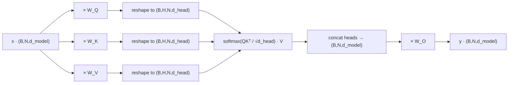

# Multi-Head Attention

## TL;DR

- An attention head is a triplet `(Q, K, V)` of projections from `d_model → d_head`. **MHA runs `H` of them in parallel and concatenates the outputs.**
- The whole thing is one big matmul, one reshape, one scaled-dot-product, one concat, one matmul. There is no separate code path per head — heads are an *axis*, not a module.
- The scale factor `1/√d_k` exists so the softmax doesn't saturate as `d_head` grows; without it, training a wide head diverges.
- Per-token cost is `O(N · d_model²)` for the projections and `O(N² · d_model)` for attention. **The N² term is what you spend the rest of this track learning to tame** (GQA, KV cache, FlashAttention, paged, chunked prefill, MLA).

## Why this matters

Multi-head attention is the only learned subroutine in a transformer that mixes information *across* token positions — every other op (FFN, RMSNorm, residuals) is point-wise. Get this layer right and the rest is bookkeeping; get it wrong and your model can't reason about context. Every optimization in production inference — flash attention, KV caching, GQA, MLA, paged attention, chunked prefill — is a transformation of *exactly the math on this page*. If you can't write MHA from scratch in numpy, you'll plateau at "I tweak `model.config.num_attention_heads`" and nothing else.

## Mental model



The whole layer is **one tensor pipeline with a head-axis bolted on by a reshape**. There is no per-head loop in any production implementation. If the diagram makes you think "heads are independent networks," delete that picture — they share the same big matmul, they're just sliced differently after it.

## Concrete walkthrough

### The shapes, with numbers

For a sequence of `N` tokens and a model width of `d_model`, MHA uses three weight matrices `W_Q, W_K, W_V` of shape `(d_model, d_model)` and an output projection `W_O` of shape `(d_model, d_model)`. The "heads" appear when you take the resulting `(B, N, d_model)` tensor and reshape it to `(B, N, H, d_head)` where `H · d_head = d_model`, then transpose to `(B, H, N, d_head)` so the head axis is adjacent to the batch.

| Model           | d_model | H   | d_head | Param count, MHA layer |
|-----------------|---------|-----|--------|-----------------------|
| GPT-2 small     | 768     | 12  | 64     | 4 · 768²  ≈ 2.36 M    |
| GPT-3 175B      | 12288   | 96  | 128    | 4 · 12288² ≈ 604 M    |
| Llama-3.1 8B    | 4096    | 32  | 128    | 4 · 4096² ≈ 67 M *    |
| Llama-3.1 405B  | 16384   | 128 | 128    | 4 · 16384² ≈ 1.07 B * |
| DeepSeek-V3     | 7168    | 128 | 128    | uses MLA, not MHA †   |

\* Llama-3.1 actually uses GQA — the K and V projections are smaller. The number above is what *plain* MHA would cost at the same `(d_model, H)`. The next lesson, [GQA, MQA & MLA](./gqa-mqa-mla), is exactly the story of how to shrink that.
† DeepSeek-V3 uses Multi-head Latent Attention. Different shapes, same idea.

### The math, in one screen

Given input `x` of shape `(B, N, d_model)`:

```python
# 1. Project. Three (d_model, d_model) matmuls.
Q = x @ W_Q                  # (B, N, d_model)
K = x @ W_K                  # (B, N, d_model)
V = x @ W_V                  # (B, N, d_model)

# 2. Split into heads. This is purely a reshape — zero FLOPs.
Q = Q.reshape(B, N, H, d_head).transpose(0, 2, 1, 3)   # (B, H, N, d_head)
K = K.reshape(B, N, H, d_head).transpose(0, 2, 1, 3)
V = V.reshape(B, N, H, d_head).transpose(0, 2, 1, 3)

# 3. Scaled dot-product attention, per head, in parallel.
scores = Q @ K.transpose(-1, -2) / sqrt(d_head)        # (B, H, N, N)
if causal: scores = mask_upper_triangular(scores)      # decoder
weights = softmax(scores, axis=-1)                     # (B, H, N, N)
ctx = weights @ V                                      # (B, H, N, d_head)

# 4. Concat heads back. Another reshape.
ctx = ctx.transpose(0, 2, 1, 3).reshape(B, N, d_model)

# 5. Output projection.
y = ctx @ W_O                                          # (B, N, d_model)
```

Five steps. Three projections, one attention, one output. Production kernels (FlashAttention) fuse step 3 — they never materialize the `(N, N)` `scores` matrix in HBM — but the math is identical.

### Why divide by √d_head

`Q` and `K` are independent random vectors of dimension `d_head`. Their dot product has variance `d_head` (sum of `d_head` independent unit-variance products). Without scaling, larger heads push softmax inputs into the saturating tail; gradients vanish and training diverges. Dividing by `√d_head` normalizes the variance back to 1. This is not optional — every implementation does it.

### Where the FLOPs go

Per layer, ignoring batch:

| Step              | FLOPs                  | Notes                                  |
|-------------------|------------------------|----------------------------------------|
| Q,K,V projections | `3 · 2 · N · d_model²` | Three matmuls. Compute-heavy, **not** N². |
| QKᵀ               | `2 · H · N² · d_head`  | This is the N² term. Same as `2 · N² · d_model`. |
| softmax · V       | `2 · H · N² · d_head`  | Another `2 · N² · d_model`.            |
| Output projection | `2 · N · d_model²`     | One matmul.                            |

Total: `8 · N · d_model² + 4 · N² · d_model`. The crossover where attention dominates the projections is at `N ≈ 2 · d_model`. For Llama-3.1 8B (`d_model = 4096`) that's around 8K tokens — exactly where most production workloads sit. **Long context is N²-bound by definition.**

## Run it in your browser

Two cells, sharing the same Python namespace via `group="mha"`. Run them in order; the second cell uses arrays the first cell defined.

<RunInBrowser
  group="mha"
  description="Cell 1 — set up the model dims and the input. Run me first."
  code={`import numpy as np

# GPT-2 small dims
B, N = 1, 16            # batch, sequence length
d_model, H = 768, 12
d_head = d_model // H   # = 64
print(f"d_head = {d_head}, H · d_head = {H * d_head} = d_model {d_model}")

rng = np.random.default_rng(0)
x = rng.standard_normal((B, N, d_model)).astype(np.float32)
W_Q = rng.standard_normal((d_model, d_model)).astype(np.float32) / np.sqrt(d_model)
W_K = rng.standard_normal((d_model, d_model)).astype(np.float32) / np.sqrt(d_model)
W_V = rng.standard_normal((d_model, d_model)).astype(np.float32) / np.sqrt(d_model)
W_O = rng.standard_normal((d_model, d_model)).astype(np.float32) / np.sqrt(d_model)

print(f"x:   {x.shape}")
print(f"W_Q: {W_Q.shape}  (same for W_K, W_V, W_O)")
`}
/>

<RunInBrowser
  group="mha"
  description="Cell 2 — full forward pass. Variables x, W_Q, W_K, W_V, W_O, B, N, H, d_head, d_model are inherited from cell 1."
  code={`def softmax(z, axis=-1):
    z = z - z.max(axis=axis, keepdims=True)         # numerical stability
    e = np.exp(z)
    return e / e.sum(axis=axis, keepdims=True)

def mha(x):
    Q = x @ W_Q                                                      # (B,N,d_model)
    K = x @ W_K
    V = x @ W_V

    # Split heads: reshape + transpose. Zero FLOPs.
    def split(t):
        return t.reshape(B, N, H, d_head).transpose(0, 2, 1, 3)      # (B,H,N,d_head)
    Q, K, V = split(Q), split(K), split(V)

    # Scaled dot-product attention, all heads at once.
    scores = Q @ K.transpose(0, 1, 3, 2) / np.sqrt(d_head)           # (B,H,N,N)

    # Causal mask: every position only attends to itself and earlier.
    mask = np.tril(np.ones((N, N), dtype=bool))
    scores = np.where(mask, scores, -1e9)

    weights = softmax(scores, axis=-1)                               # (B,H,N,N)
    ctx = weights @ V                                                # (B,H,N,d_head)

    # Concat heads back.
    ctx = ctx.transpose(0, 2, 1, 3).reshape(B, N, d_model)
    return ctx @ W_O                                                 # (B,N,d_model)

y = mha(x)
print(f"y shape: {y.shape}")
print(f"y[0,0,:5] = {y[0,0,:5].round(3)}")

# Sanity check: causal attention should mean y[t] does not depend on x[t+1:].
# Perturb the future and verify y[0] is unchanged.
x2 = x.copy()
x2[0, 10:] += 1.0
y2 = mha(x2)
diff = np.abs(y - y2).max(axis=-1)[0]    # max diff per position
print("\\nMax abs diff at each position after perturbing positions 10+:")
print(diff.round(4))
print("Positions 0–9 should be exactly 0 (causal mask works).")
`}
/>

If the second cell prints zeros for positions 0–9, your causal mask is wired correctly. If it doesn't, you forgot the `tril`.

## Quick check

<FillIn
  prompt="The scaling factor inside the softmax that keeps gradients sane as d_head grows."
  prefix="scores = Q @ K.transpose(-1, -2) / "
  answer="np.sqrt(d_head)"
  accept={["sqrt(d_head)", "math.sqrt(d_head)", "d_head ** 0.5", "d_head**0.5"]}
  hint="It cancels the variance growth of a d_head-dimensional dot product."
  explanation="QKᵀ has variance d_head; dividing by √d_head normalizes it to 1, keeping softmax in its responsive regime."
/>

<Quiz
  question="GPT-3 175B has d_model = 12288 and 96 heads. A practitioner doubles H to 192 (and halves d_head to 64) without changing anything else. What changes?"
  options={[
    'Parameter count drops by ~50%.',
    'Parameter count is unchanged; only the head-axis dimension changes.',
    'FLOPs increase by 2×.',
    'Attention output is shape (B, 192, N, d_head) — the rest of the model breaks.',
  ]}
  answer={1}
  explanation="W_Q, W_K, W_V, W_O are all (d_model, d_model). The reshape that creates H heads is parameter-free. So splitting into more, narrower heads changes neither parameter count nor FLOPs — it only changes how the d_model axis is partitioned for the attention sum. (Whether quality improves is a separate empirical question; modern models tend to use d_head ∈ {64, 96, 128}.)"
/>

## Key takeaways

1. **MHA is one matmul pipeline with a reshape in the middle**, not `H` independent attention modules. Every production implementation treats heads as an axis.
2. `H · d_head = d_model` always. Doubling `H` halves `d_head` and changes neither parameter count nor FLOPs.
3. The `1/√d_head` scale is non-negotiable. It exists for variance, not for "stability" or "intuition."
4. Per-layer cost is `8 · N · d_model² + 4 · N² · d_model`. The N² term dominates above `N ≈ 2 · d_model`.
5. **Everything else in this module — GQA, MLA, KV cache, FlashAttention, paged attention, chunked prefill — is a transformation of these five steps.** Hold this picture in your head before reading the next four lessons.

## Go deeper

<Resources
  items={[
    { kind: 'paper', href: 'https://arxiv.org/abs/1706.03762', title: 'Attention Is All You Need', author: 'Vaswani et al., 2017', note: 'The original. Sections 3.1–3.2.2 cover scaled dot-product attention and the multi-head construction. Worth re-reading once a year.' },
    { kind: 'video', href: 'https://www.youtube.com/watch?v=eMlx5fFNoYc', title: 'Let\'s build GPT: from scratch, in code, spelled out', author: 'Andrej Karpathy', note: 'The reference. Implements MHA in PyTorch live and explains every line. Watching this once will save you ten hours of confusion.' },
    { kind: 'blog', href: 'https://jalammar.github.io/illustrated-transformer/', title: 'The Illustrated Transformer', author: 'Jay Alammar', note: 'Best diagrams on the open web for the per-head intuition. Pair with the math here.' },
    { kind: 'blog', href: 'https://magazine.sebastianraschka.com/p/understanding-and-coding-self-attention', title: 'Understanding and Coding Self-Attention, Multi-Head Attention, ...', author: 'Sebastian Raschka, 2024', note: 'Side-by-side numpy → PyTorch → flash kernel walkthrough.' },
    { kind: 'repo', href: 'https://github.com/karpathy/nanoGPT/blob/master/model.py', title: 'karpathy/nanoGPT — model.py', note: 'The canonical 250-line GPT. The `CausalSelfAttention` class is exactly the math on this page in PyTorch.' },
    { kind: 'repo', href: 'https://github.com/Dao-AILab/flash-attention', title: 'Dao-AILab/flash-attention', note: 'Where MHA goes when it grows up. Read kvcache.py to see how the KV cache (next module) hooks in.' },
  ]}
/>

<LessonComplete />
