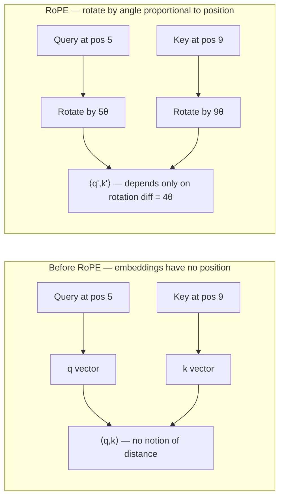

# RoPE + YaRN / LongRoPE

## TL;DR

- **RoPE** (Rotary Positional Embedding, Su et al., 2021) encodes position by *rotating* query and key vectors in 2D pairs by an angle proportional to position. The dot product $\langle q_m, k_n \rangle$ then depends only on the *relative* position $m - n$.
- It's the de facto standard in 2024–2026: Llama family, Mistral, Qwen, DeepSeek, Gemma all use it.
- **The base wavelength $\theta$ controls how far the model can extrapolate.** Standard $\theta = 10{,}000$ caps at ~4–8K tokens. Beyond that, attention scores collapse.
- **NTK-aware / YaRN / LongRoPE** are the three rescaling techniques that extend a model's context to 32K → 128K → 1M tokens with light continued pretraining.
- For inference, **PI (Position Interpolation)**, **NTK-by-parts**, and **YaRN** are the three you'll see in real configs. **LongRoPE** (2024) is the current frontier for 2M+ token contexts.

## Why this matters

Position is information. Without it, attention is a permutation-invariant set operation — "the cat sat on the mat" and "the mat sat on the cat" are identical to the model. Every Transformer needs *some* positional signal.

For a long time we used learned absolute embeddings, then sinusoidal, then ALiBi, then RoPE. RoPE won because:

1. It's purely **relative** — `attention(q_m, k_n)` depends only on `m - n`, not absolute positions.
2. It composes cleanly with attention's existing math — no extra parameters.
3. It's straightforward to scale to longer contexts than training saw, with the right tricks.

If you can't read a RoPE config (`theta = 500000`, `factor = 8.0`, `original_max_position = 8192`), you can't operate on a long-context model.

## Mental model



The math is **rotation in pairs of dimensions**. For each pair $(2i, 2i+1)$ of the head dim, rotate by an angle $m \cdot \theta_i$, where $\theta_i = 10000^{-2i/d}$. Different dimension pairs rotate at very different frequencies — high-frequency pairs encode short-range distinctions, low-frequency pairs encode long-range.

## Concrete walkthrough

### The math

For a vector $x \in \mathbb{R}^d$ at position $m$, treat each pair $(x_{2i}, x_{2i+1})$ as a complex number and multiply by $e^{i m \theta_i}$:

$$
\begin{pmatrix} x'_{2i} \\ x'_{2i+1} \end{pmatrix} =
\begin{pmatrix} \cos(m\theta_i) & -\sin(m\theta_i) \\ \sin(m\theta_i) & \cos(m\theta_i) \end{pmatrix}
\begin{pmatrix} x_{2i} \\ x_{2i+1} \end{pmatrix}
$$

with $\theta_i = \theta_{\text{base}}^{-2i/d}$ for $i = 0, 1, \ldots, d/2 - 1$.

The crucial property: after rotating $q_m$ by $m\theta$ and $k_n$ by $n\theta$, the dot product is

$$
\langle q'_m, k'_n \rangle = q_m^\top R_{n-m} k_n = \langle q_m, k_n \rangle_{\text{rotated by } (n - m)\theta}
$$

— purely relative.

### Why it breaks at long context

At training time, the model sees positions up to $T_{\text{train}}$ (say 4K). The high-frequency dimensions cycle many times — `cos(4096 · θ_0)` has gone around hundreds of revolutions. The model has *learned* what those wrapping patterns mean.

At inference, if you go to $T = 100{,}000$, the high-frequency pairs are now in *unseen* phase regions. Attention scores degrade. The model produces garbage past ~8K.

### The four rescaling techniques

**1. Position Interpolation (PI)** — Chen et al., 2023. Linearly compress positions: replace $m$ with $m / s$ where $s = T_{\text{new}} / T_{\text{train}}$. Effectively makes all wavelengths longer. Quick, requires fine-tuning to recover quality. Now superseded.

**2. NTK-aware** — bloc97 (LocalLLaMA, 2023). Scale $\theta_{\text{base}}$ by $s^{d/(d-2)}$ so that high-frequency pairs are barely touched and low-frequency pairs interpolate smoothly. Better than PI; minimal fine-tuning.

**3. YaRN** (Yet another RoPE extensioN) — Peng et al., 2023. The current production default in many open models (Code Llama, Yi, Qwen-2.5 long-context variants). YaRN is **NTK-by-parts** — different scaling for different frequency bands plus an attention-temperature correction. Often used with ~100M tokens of continued pretraining.

**4. LongRoPE** — Ding et al., Microsoft, 2024. Search for *non-uniform* rescaling factors per dimension via evolutionary algorithms. Pushed Llama-2 7B from 4K → 2M tokens with minimal fine-tuning. The current frontier; reflected in 2025 model configs targeting >1M context.

### Real configs you'll see in 2026

```jsonc
// Llama-3.1 70B (8K → 128K via post-training)
"rope_scaling": {
  "type": "llama3",
  "factor": 8.0,
  "original_max_position_embeddings": 8192,
  "low_freq_factor": 1.0,
  "high_freq_factor": 4.0
}

// Qwen2.5-7B-Instruct-1M
"rope_scaling": { "type": "yarn", "factor": 4.0, "original_max_position_embeddings": 262144 }

// DeepSeek-V3 (4K base, 128K via YaRN)
"rope_scaling": { "type": "yarn", "factor": 40.0, "beta_fast": 32, "beta_slow": 1, "mscale": 0.707 }

// LongRoPE-tuned (custom per-dim factors)
"rope_scaling": { "type": "longrope", "long_factor": [2.5, 2.7, 3.1, 3.3, ...], "short_factor": [...] }
```

You read a model card by checking `rope_scaling`. That tells you the maximum honest context length and which technique was used.

## Run it in your browser — visualize the rotation

<RunInBrowser
  description="Rotate a vector by RoPE at three different positions. Watch the angle change with position and dimension."
  code={`import math

def rope_freqs(dim, base=10000.0):
    """Per-dim frequencies for RoPE. dim must be even."""
    return [base ** (-2 * i / dim) for i in range(dim // 2)]

def rotate(x, position, freqs):
    """Apply RoPE to a vector x at the given position."""
    out = []
    for i, theta in enumerate(freqs):
        angle = position * theta
        c, s = math.cos(angle), math.sin(angle)
        x0, x1 = x[2*i], x[2*i + 1]
        out.append(c*x0 - s*x1)
        out.append(s*x0 + c*x1)
    return out

# Toy 8-dim head
freqs = rope_freqs(8, base=10000.0)
print("Per-dim frequencies (theta_i):", [f"{f:.4f}" for f in freqs])

x = [1.0, 0.0, 1.0, 0.0, 1.0, 0.0, 1.0, 0.0]  # unit vector for clarity

for pos in [0, 1, 100, 4096]:
    rotated = rotate(x, pos, freqs)
    print(f"\\npos={pos:>5}:  {[f'{v:+.3f}' for v in rotated]}")
    # The first two dims (highest freq) wrap quickly with position;
    # the last two dims (lowest freq) barely move.
`}
/>

You'll see: at `pos=0`, identity. At `pos=1`, slight rotation. At `pos=4096`, the high-frequency pairs have wrapped many times; the low-frequency pairs barely budged. **That's why RoPE encodes both fine local and coarse global position.**

## Quick check

<Quiz
  question="A model trained with RoPE at 4K context produces gibberish past 8K tokens. Which technique is *most appropriate* to push it to 128K with light fine-tuning?"
  options={[
    'Re-train from scratch with longer position embeddings.',
    'Apply linear Position Interpolation (PI), no fine-tuning.',
    'Apply YaRN scaling and continue-pretrain on a long-context corpus for ~100M tokens.',
    'Use ALiBi instead of RoPE.',
  ]}
  answer={2}
  explanation="YaRN with light continued pretraining is the production-default path: it's better than PI (which loses quality) and dramatically cheaper than re-training from scratch. ALiBi has different tradeoffs and would require switching architectures. LongRoPE would be even better but is more involved."
/>

## Key takeaways

1. **RoPE = rotate in 2D pairs by an angle proportional to position.** Every modern Transformer except a few outliers uses it.
2. **Different dimension pairs rotate at very different rates.** This is what gives RoPE both fine and coarse positional information.
3. **`rope_scaling` in a model config tells you everything.** Type (`yarn`, `llama3`, `longrope`), factor, base. Read it before assuming a context length.
4. **Beyond 4× extrapolation requires fine-tuning.** Pure inference-time scaling stops working past ~32K from a 4K base.
5. **LongRoPE pushed the boundary to 2M tokens.** Expect this and successors to be the dominant long-context approach through 2026.

## Go deeper

<Resources
  items={[
    { kind: 'paper', href: 'https://arxiv.org/abs/2104.09864', title: 'RoFormer: Enhanced Transformer with Rotary Position Embedding', author: 'Su et al. (2021)', note: 'The original RoPE paper. Surprisingly readable.' },
    { kind: 'paper', href: 'https://arxiv.org/abs/2306.15595', title: 'Extending Context Window of Large Language Models via Positional Interpolation', author: 'Chen et al. (Meta, 2023)', note: 'PI — historical baseline, but the framing is foundational.' },
    { kind: 'paper', href: 'https://arxiv.org/abs/2309.00071', title: 'YaRN: Efficient Context Window Extension of Large Language Models', author: 'Peng, Quesnelle, Fan, Shippole (2023)', note: 'NTK-by-parts plus attention temperature. The most-deployed extension technique through 2024-2026.' },
    { kind: 'paper', href: 'https://arxiv.org/abs/2402.13753', title: 'LongRoPE: Extending LLM Context Window Beyond 2 Million Tokens', author: 'Ding et al. (Microsoft, 2024)', note: 'Per-dim factors found by evolutionary search. Frontier of long-context.' },
    { kind: 'blog', href: 'https://blog.eleuther.ai/yarn/', title: 'YaRN — explained by EleutherAI', note: 'The author-adjacent walkthrough. Best non-paper YaRN explainer.' },
    { kind: 'video', href: 'https://www.youtube.com/watch?v=oM4VmoabDAI', title: 'Eleuther — RoPE deep dive', author: 'Yannic Kilcher / EleutherAI', note: 'A whiteboard walk through the math.' },
    { kind: 'repo', href: 'https://github.com/jzhang38/EasyContext', title: 'jzhang38/EasyContext', note: 'Open implementations of every major RoPE-extension technique. Read for clean reference code.' },
    { kind: 'docs', href: 'https://huggingface.co/blog/rope-scaling', title: 'Hugging Face — RoPE scaling explained', note: 'How `rope_scaling` is interpreted across the major model families. Pragmatic.' },
  ]}
/>

<LessonComplete />
