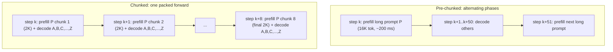

# Chunked Prefill

<Mode is="learn">

> **Prereqs:** [KV Cache Basics](../kv-cache/kv-basics), [PagedAttention](../kv-cache/paged-attention). This lesson is about *what runs in each forward pass on the GPU*, given a queue of prefills and decodes that all want to make progress.

When you start a vLLM server with the default `max_num_batched_tokens=2048`, you've quietly opted into the most important scheduling change in modern LLM serving. Pre-2024 inference engines had a simple rule: each step is **either** a prefill (process a whole prompt) **or** a decode (one token for each active user). It's an obvious split — until a 16K-token prompt arrives, prefill takes ~200 ms, and *every other user's* chat UI freezes for that entire window. The post-2024 answer is **chunked prefill**: slice the long prompt into 2K-token chunks and pack each chunk into the *same* forward pass as ongoing decode tokens. One kernel call processes the prompt's chunk *and* one decode token from each of 256 other users. Everyone makes progress on every step.

The reason this works comes down to one fact about modern GPUs: a matmul is FLOP-bound only above a certain size. A pure decode batch (1 token × 256 users = 256 tokens) is too small — the tensor cores sit idle waiting for the weights to stream in from HBM. Pad it out with 1792 prefill tokens and the *same* weight load now does 8× the useful work. The decoders finish in essentially the same time, the prefill chunk rides along free, and the long-prompt tail-latency monster disappears. **vLLM v1 was rebuilt around this primitive** — there is no longer a "prefill phase" or "decode phase" in the engine, only "the next batch."

## TL;DR

- Pre-2024 servers ran prefill and decode as **separate, alternating phases**. A 16K-token prefill stalled every decoder behind it for hundreds of milliseconds.
- **Chunked prefill** slices each prefill into fixed-size chunks (e.g., 2048 tokens) and **packs them into the same forward pass as ongoing decodes**. The GPU runs one big batched matmul; everyone makes progress.
- **vLLM v1 was rebuilt around this primitive.** It is the *default* scheduling mode — there is no longer a "prefill phase" or a "decode phase," only "the next batch."
- Net effect: **<Term name="tpot">TPOT</Term> becomes stable** (no more decode stutter when a long prompt arrives), **<Term name="ttft">TTFT</Term> degrades gracefully** (long prompts pay slightly more by being chunked), throughput holds within ~5% of pure-prefill.
- Disaggregation ([disaggregated serving](../kv-cache/disaggregated)) is the *split-into-two-pools* answer; chunked prefill is the *one-pool-done-right* answer. They're complements, not competitors — small fleets use chunked; big fleets disaggregate and chunk inside each pool.

## Mental model



Old: long prefill *blocks* everyone else.
New: long prefill *shares the bus* — its chunks ride along with decode steps.

## What gets packed

Each forward pass is now a heterogeneous batch:

| Slot | Sequence type | What the model sees |
|------|---------------|---------------------|
| 0    | new prompt P, chunk 3 of 8 | tokens [4096..6143] of P, attending over P's earlier KV (chunks 1–2 already in cache) |
| 1    | active decode A | one new token, attending over A's full KV |
| 2    | active decode B | one new token, attending over B's full KV |
| ...  | active decode N | one new token, attending over N's full KV |

The kernel sees a flat list of `(sequence_id, token_position, KV_block_pointers)`. PagedAttention handles the variable-length attention. As far as the matmul is concerned, it's just a big sequence with a custom mask.

## The token-budget knob

Chunked prefill is governed by **one number**: the per-step token budget (`max_num_batched_tokens`, in vLLM speak). Default in v1 is 2048–8192 depending on hardware. Each step:

1. Greedily admit decoding sequences (each costs 1 token).
2. Fill the remaining budget with the next prefill chunk(s).
3. Run one forward pass.

A higher budget means longer per-step latency but lower per-prompt prefill cost. A lower budget means tighter TPOT but more per-prompt overhead. The sweet spot is **set the budget to ≈ the GPU's compute-bound crossover** — the smallest batch where the matmul is FLOP-bound, not bandwidth-bound. For H100 at FP8 that's ~2048 tokens; for B200 it's ~4096.

```python
# Sketch of the v1-style scheduler step.
def schedule_step(running_decodes, prefill_queue, max_tokens):
    batch = []
    used = 0

    # Decodes go first — they're cheap and bound TPOT.
    for seq in running_decodes:
        batch.append((seq.id, [seq.next_position], seq.kv_blocks))
        used += 1
        if used >= max_tokens:
            return batch

    # Then fill with prefill chunks until the budget is gone.
    while prefill_queue and used < max_tokens:
        seq = prefill_queue[0]
        chunk_len = min(seq.remaining_prefill, max_tokens - used)
        batch.append((seq.id, seq.next_chunk(chunk_len), seq.kv_blocks))
        used += chunk_len
        if seq.prefill_done():
            prefill_queue.popleft()
    return batch
```

The producer side (where prefill chunks come from) and the consumer side (the kernel) don't care that some tokens are "prefill" and others are "decode" — they're just tokens with different attention patterns over PagedAttention blocks.

## Why this works on GPUs

A modern GPU's matmul is FLOP-bound for any batch ≥ ~1024 tokens at FP8 (H100) or ~2048 (B200). Below that, you're paying weight-load bandwidth and not utilizing the tensor cores. **Chunked prefill exploits this**: a single decode step (1 token × 256 sequences = 256 tokens) is bandwidth-bound; pad it with 1792 prefill tokens and the *same* weight load now does 8× the work. The decoders finish in essentially the same time, and the prefill chunk rides along free.

This is why "throughput within 5% of pure prefill" — there is no real cost to packing decode tokens into a prefill-scale forward, as long as the budget is above the FLOP-bound threshold.

## Knobs you'll actually tune

| Knob                         | Default     | When to change                          |
|------------------------------|-------------|------------------------------------------|
| `max_num_batched_tokens`     | 2048–8192   | Raise for higher throughput; lower for tighter TPOT SLO. |
| `max_num_seqs`               | 256–1024    | Concurrent users in the engine. Hard cap on decode batch. |
| `enable_chunked_prefill`     | True (v1)   | Always on in v1. Off only for legacy v0 behavior. |
| `long_prefill_token_threshold` | None      | Force chunking for prompts above this length even if the budget would allow a single chunk. |
| Mixed precision for the chunk attention | FP8 / BF16 | Bandwidth-bound prefill chunks benefit from FP8. |

In practice you change `max_num_batched_tokens` first, watch the TPOT P99, and stop tweaking once it stabilizes.

## Run it in your browser

A scheduler simulator. Watch how long prefills get sliced and decodes coast along.

<RunInBrowser
  description="Simulates one engine for 100 steps with mixed prefill/decode traffic."
  code={`from collections import deque
import random

random.seed(0)

class Sequence:
    _next_id = 0
    def __init__(self, prompt_len, output_len):
        self.id = Sequence._next_id; Sequence._next_id += 1
        self.prompt_len = prompt_len
        self.prefilled = 0                 # tokens of prompt processed
        self.decoded = 0                   # output tokens produced
        self.output_len = output_len
        self.first_decode_step = None      # for TTFT
        self.last_decode_step = None       # for TPOT
    def prefill_done(self): return self.prefilled >= self.prompt_len
    def done(self): return self.decoded >= self.output_len

def schedule(prefill_q, running, max_tokens):
    batch = []
    used = 0
    for s in running[:]:
        if used >= max_tokens: break
        batch.append(('decode', s, 1))
        used += 1
    while prefill_q and used < max_tokens:
        s = prefill_q[0]
        chunk = min(s.prompt_len - s.prefilled, max_tokens - used)
        batch.append(('prefill', s, chunk))
        s.prefilled += chunk
        used += chunk
        if s.prefill_done():
            prefill_q.popleft()
            running.append(s)
    return batch, used

def run(max_batched, steps=100, lam=0.4):
    prefill_q = deque()
    running = []
    completed = []
    ttft = []
    tpot_samples = []
    for step in range(steps):
        # Random arrivals — Poisson(lam) per step. ~30% are long prompts.
        for _ in range(int(random.expovariate(1/lam) > 0.5)):
            plen = random.choice([500, 1000, 2000, 4000, 8000, 16000])
            prefill_q.append(Sequence(plen, output_len=128))
        batch, _ = schedule(prefill_q, running, max_batched)
        # Update bookkeeping; mark TTFT when the *last* prefill chunk lands.
        for kind, s, n in batch:
            if kind == 'prefill' and s.prefill_done() and s.first_decode_step is None:
                s.first_decode_step = step + 1   # decode starts next step
            elif kind == 'decode':
                if s.last_decode_step is not None:
                    tpot_samples.append(step - s.last_decode_step)
                s.last_decode_step = step
                s.decoded += 1
                if s.done():
                    completed.append(s)
                    running.remove(s)
                    ttft.append(s.first_decode_step - 0)   # since arrival is 0 here, simplified
    return completed, ttft, tpot_samples

for budget in (256, 1024, 2048, 8192):
    completed, ttft, tpot = run(max_batched=budget)
    avg_ttft = sum(ttft)/max(1,len(ttft))
    p99_tpot = sorted(tpot)[int(len(tpot)*0.99)] if tpot else 0
    print(f"budget={budget:>5}  completed={len(completed):>3}  "
          f"avg-TTFT(steps)={avg_ttft:>5.1f}  P99-TPOT={p99_tpot:>3}")
`}
/>

You should see TTFT shrink as the budget grows (each prefill chunk is bigger), but TPOT P99 grow once the budget is large enough that decodes wait for fat prefill steps. The right answer is in the middle.

## Quick check

<FillIn
  prompt="The single knob that governs chunked-prefill behaviour:"
  answer="max_num_batched_tokens"
  accept={["batch_token_budget", "token budget", "max_tokens_per_step"]}
  hint="It's the per-step token budget — sum of decode tokens (1 per active sequence) and prefill chunk sizes."
  explanation="Raise it for throughput, lower it for tighter TPOT. Sweet spot is around the GPU's FLOP-bound crossover (≈ 2048 on H100, ≈ 4096 on B200)."
/>

<Quiz
  question="A chat server is using vLLM v0 (no chunked prefill). P99 TPOT is great when prompts are short, but spikes to ~250 ms whenever a 16K-token prompt arrives. What's the *cheapest* fix?"
  options={[
    'Halve the model size.',
    'Switch to vLLM v1 and leave chunked prefill at its default.',
    'Add another GPU.',
    'Switch to disaggregated serving.',
  ]}
  answer={1}
  explanation="The TPOT spike is the textbook chunked-prefill failure mode in v0: a long prefill blocks every decoder behind it. v1 enables chunked prefill by default; the long prompt now runs as 8 chunks of 2K each, riding along with ongoing decodes. Disaggregation also fixes this but is a much bigger architectural change. Adding a GPU doesn't help — the problem is scheduler structure, not capacity."
/>

## Key takeaways

1. **One forward pass, mixed traffic.** Decode tokens and prefill chunks share the same kernel call. The matmul doesn't care.
2. **`max_num_batched_tokens` is the only knob you really tune.** Set it near the FLOP-bound crossover for your hardware.
3. **TPOT becomes stable, TTFT degrades gracefully.** Tail latency stops being a function of "what else is in the queue."
4. **vLLM v1 = chunked prefill on by default.** The architectural shift between v0 and v1 is exactly this primitive.
5. **Chunked prefill and disaggregation are complements.** Single pool: chunk inside it. Multi-pool: disaggregate, then chunk inside each pool.

## Go deeper

<Resources
  items={[
    { kind: 'paper', href: 'https://arxiv.org/abs/2308.16369', title: 'SARATHI: Efficient LLM Inference by Piggybacking Decodes with Chunked Prefills', author: 'Agrawal et al., 2023', note: 'The original. The mental model in section 3 is almost identical to what vLLM v1 ships.' },
    { kind: 'paper', href: 'https://arxiv.org/abs/2403.02310', title: 'Taming Throughput-Latency Tradeoff in LLM Inference (Sarathi-Serve)', author: 'Agrawal et al., MLSys 2024', note: 'Adds the per-step token-budget formulation. Read alongside the vLLM v1 blog.' },
    { kind: 'blog', href: 'https://blog.vllm.ai/2025/01/27/v1-alpha-release.html', title: 'vLLM v1 Alpha — A Major Upgrade to vLLM\'s Core Architecture', note: 'Authoritative announcement. Section on the new scheduler is exactly this lesson.' },
    { kind: 'docs', href: 'https://docs.vllm.ai/en/latest/usage/optimization.html', title: 'vLLM — Optimizing Inference', note: 'Production knobs (`max_num_batched_tokens`, `max_num_seqs`) and how they interact.' },
    { kind: 'blog', href: 'https://lmsys.org/blog/2024-12-04-sglang-v0-4/', title: 'SGLang v0.4 — Zero-Overhead Batch Scheduler', author: 'LMSYS, 2024', note: 'The other major server\'s take on the same idea, with different tradeoffs.' },
    { kind: 'repo', href: 'https://github.com/vllm-project/vllm', title: 'vllm-project/vllm', note: 'See `vllm/v1/core/sched/scheduler.py` — `_schedule_running` and `_schedule_waiting` are the chunked-prefill loop.' },
  ]}
/>

</Mode>

<Mode is="reference">

> **Prereqs:** [KV Cache Basics](../kv-cache/kv-basics), [PagedAttention](../kv-cache/paged-attention). This lesson is about *what runs in each forward pass on the GPU*, given a queue of prefills and decodes that all want to make progress.

## TL;DR

- Pre-2024 servers ran prefill and decode as **separate, alternating phases**. A 16K-token prefill stalled every decoder behind it for hundreds of milliseconds.
- **Chunked prefill** slices each prefill into fixed-size chunks (e.g., 2048 tokens) and **packs them into the same forward pass as ongoing decodes**. The GPU runs one big batched matmul; everyone makes progress.
- **vLLM v1 was rebuilt around this primitive.** It is the *default* scheduling mode — there is no longer a "prefill phase" or a "decode phase," only "the next batch."
- Net effect: **TPOT becomes stable** (no more decode stutter when a long prompt arrives), **TTFT degrades gracefully** (long prompts pay slightly more by being chunked), throughput holds within ~5% of pure-prefill.
- Disaggregation ([disaggregated serving](../kv-cache/disaggregated)) is the *split-into-two-pools* answer; chunked prefill is the *one-pool-done-right* answer. They're complements, not competitors — small fleets use chunked; big fleets disaggregate and chunk inside each pool.

## Why this matters

The pre-2024 vLLM scheduler had a hard rule: a step is **either** a prefill **or** a decode batch, never both. That rule is what made it simple to write but it has a brutal failure mode — when a 16K-token prompt arrives, the next ~200 ms of decode tokens for *everyone else* are stuck waiting. Users see the chat UI freeze. Engineers stare at a tail-latency graph and curse.

Chunked prefill is the fix. After it landed, vLLM's tail TPOT (P99 time-per-output-token) on mixed workloads went from "depends on what else is in the queue" to "≈ steady-state." That single change is why vLLM v1 is a different product than v0.

## Mental model


Old: long prefill *blocks* everyone else.
New: long prefill *shares the bus* — its chunks ride along with decode steps.

## Concrete walkthrough

### What gets packed

Each forward pass is now a heterogeneous batch:

| Slot | Sequence type | What the model sees |
|------|---------------|---------------------|
| 0    | new prompt P, chunk 3 of 8 | tokens [4096..6143] of P, attending over P's earlier KV (chunks 1–2 already in cache) |
| 1    | active decode A | one new token, attending over A's full KV |
| 2    | active decode B | one new token, attending over B's full KV |
| ...  | active decode N | one new token, attending over N's full KV |

The kernel sees a flat list of `(sequence_id, token_position, KV_block_pointers)`. PagedAttention handles the variable-length attention. As far as the matmul is concerned, it's just a big sequence with a custom mask.

### The token-budget knob

Chunked prefill is governed by **one number**: the per-step token budget (`max_num_batched_tokens`, in vLLM speak). Default in v1 is 2048–8192 depending on hardware. Each step:

1. Greedily admit decoding sequences (each costs 1 token).
2. Fill the remaining budget with the next prefill chunk(s).
3. Run one forward pass.

A higher budget means longer per-step latency but lower per-prompt prefill cost. A lower budget means tighter TPOT but more per-prompt overhead. The sweet spot is **set the budget to ≈ the GPU's compute-bound crossover** — the smallest batch where the matmul is FLOP-bound, not bandwidth-bound. For H100 at FP8 that's ~2048 tokens; for B200 it's ~4096.

```python
# Sketch of the v1-style scheduler step.
def schedule_step(running_decodes, prefill_queue, max_tokens):
    batch = []
    used = 0

    # Decodes go first — they're cheap and bound TPOT.
    for seq in running_decodes:
        batch.append((seq.id, [seq.next_position], seq.kv_blocks))
        used += 1
        if used >= max_tokens:
            return batch

    # Then fill with prefill chunks until the budget is gone.
    while prefill_queue and used < max_tokens:
        seq = prefill_queue[0]
        chunk_len = min(seq.remaining_prefill, max_tokens - used)
        batch.append((seq.id, seq.next_chunk(chunk_len), seq.kv_blocks))
        used += chunk_len
        if seq.prefill_done():
            prefill_queue.popleft()
    return batch
```

The producer side (where prefill chunks come from) and the consumer side (the kernel) don't care that some tokens are "prefill" and others are "decode" — they're just tokens with different attention patterns over PagedAttention blocks.

### Why this works on GPUs

A modern GPU's matmul is FLOP-bound for any batch ≥ ~1024 tokens at FP8 (H100) or ~2048 (B200). Below that, you're paying weight-load bandwidth and not utilizing the tensor cores. **Chunked prefill exploits this**: a single decode step (1 token × 256 sequences = 256 tokens) is bandwidth-bound; pad it with 1792 prefill tokens and the *same* weight load now does 8× the work. The decoders finish in essentially the same time, and the prefill chunk rides along free.

This is why "throughput within 5% of pure prefill" — there is no real cost to packing decode tokens into a prefill-scale forward, as long as the budget is above the FLOP-bound threshold.

### Knobs you'll actually tune

| Knob                         | Default     | When to change                          |
|------------------------------|-------------|------------------------------------------|
| `max_num_batched_tokens`     | 2048–8192   | Raise for higher throughput; lower for tighter TPOT SLO. |
| `max_num_seqs`               | 256–1024    | Concurrent users in the engine. Hard cap on decode batch. |
| `enable_chunked_prefill`     | True (v1)   | Always on in v1. Off only for legacy v0 behavior. |
| `long_prefill_token_threshold` | None      | Force chunking for prompts above this length even if the budget would allow a single chunk. |
| Mixed precision for the chunk attention | FP8 / BF16 | Bandwidth-bound prefill chunks benefit from FP8. |

In practice you change `max_num_batched_tokens` first, watch the TPOT P99, and stop tweaking once it stabilizes.

## Run it in your browser

A scheduler simulator. Watch how long prefills get sliced and decodes coast along.

<RunInBrowser
  description="Simulates one engine for 100 steps with mixed prefill/decode traffic."
  code={`from collections import deque
import random

random.seed(0)

class Sequence:
    _next_id = 0
    def __init__(self, prompt_len, output_len):
        self.id = Sequence._next_id; Sequence._next_id += 1
        self.prompt_len = prompt_len
        self.prefilled = 0                 # tokens of prompt processed
        self.decoded = 0                   # output tokens produced
        self.output_len = output_len
        self.first_decode_step = None      # for TTFT
        self.last_decode_step = None       # for TPOT
    def prefill_done(self): return self.prefilled >= self.prompt_len
    def done(self): return self.decoded >= self.output_len

def schedule(prefill_q, running, max_tokens):
    batch = []
    used = 0
    for s in running[:]:
        if used >= max_tokens: break
        batch.append(('decode', s, 1))
        used += 1
    while prefill_q and used < max_tokens:
        s = prefill_q[0]
        chunk = min(s.prompt_len - s.prefilled, max_tokens - used)
        batch.append(('prefill', s, chunk))
        s.prefilled += chunk
        used += chunk
        if s.prefill_done():
            prefill_q.popleft()
            running.append(s)
    return batch, used

def run(max_batched, steps=100, lam=0.4):
    prefill_q = deque()
    running = []
    completed = []
    ttft = []
    tpot_samples = []
    for step in range(steps):
        # Random arrivals — Poisson(lam) per step. ~30% are long prompts.
        for _ in range(int(random.expovariate(1/lam) > 0.5)):
            plen = random.choice([500, 1000, 2000, 4000, 8000, 16000])
            prefill_q.append(Sequence(plen, output_len=128))
        batch, _ = schedule(prefill_q, running, max_batched)
        # Update bookkeeping; mark TTFT when the *last* prefill chunk lands.
        for kind, s, n in batch:
            if kind == 'prefill' and s.prefill_done() and s.first_decode_step is None:
                s.first_decode_step = step + 1   # decode starts next step
            elif kind == 'decode':
                if s.last_decode_step is not None:
                    tpot_samples.append(step - s.last_decode_step)
                s.last_decode_step = step
                s.decoded += 1
                if s.done():
                    completed.append(s)
                    running.remove(s)
                    ttft.append(s.first_decode_step - 0)   # since arrival is 0 here, simplified
    return completed, ttft, tpot_samples

for budget in (256, 1024, 2048, 8192):
    completed, ttft, tpot = run(max_batched=budget)
    avg_ttft = sum(ttft)/max(1,len(ttft))
    p99_tpot = sorted(tpot)[int(len(tpot)*0.99)] if tpot else 0
    print(f"budget={budget:>5}  completed={len(completed):>3}  "
          f"avg-TTFT(steps)={avg_ttft:>5.1f}  P99-TPOT={p99_tpot:>3}")
`}
/>

You should see TTFT shrink as the budget grows (each prefill chunk is bigger), but TPOT P99 grow once the budget is large enough that decodes wait for fat prefill steps. The right answer is in the middle.

## Quick check

<FillIn
  prompt="The single knob that governs chunked-prefill behaviour:"
  answer="max_num_batched_tokens"
  accept={["batch_token_budget", "token budget", "max_tokens_per_step"]}
  hint="It's the per-step token budget — sum of decode tokens (1 per active sequence) and prefill chunk sizes."
  explanation="Raise it for throughput, lower it for tighter TPOT. Sweet spot is around the GPU's FLOP-bound crossover (≈ 2048 on H100, ≈ 4096 on B200)."
/>

<Quiz
  question="A chat server is using vLLM v0 (no chunked prefill). P99 TPOT is great when prompts are short, but spikes to ~250 ms whenever a 16K-token prompt arrives. What's the *cheapest* fix?"
  options={[
    'Halve the model size.',
    'Switch to vLLM v1 and leave chunked prefill at its default.',
    'Add another GPU.',
    'Switch to disaggregated serving.',
  ]}
  answer={1}
  explanation="The TPOT spike is the textbook chunked-prefill failure mode in v0: a long prefill blocks every decoder behind it. v1 enables chunked prefill by default; the long prompt now runs as 8 chunks of 2K each, riding along with ongoing decodes. Disaggregation also fixes this but is a much bigger architectural change. Adding a GPU doesn't help — the problem is scheduler structure, not capacity."
/>

## Key takeaways

1. **One forward pass, mixed traffic.** Decode tokens and prefill chunks share the same kernel call. The matmul doesn't care.
2. **`max_num_batched_tokens` is the only knob you really tune.** Set it near the FLOP-bound crossover for your hardware.
3. **TPOT becomes stable, TTFT degrades gracefully.** Tail latency stops being a function of "what else is in the queue."
4. **vLLM v1 = chunked prefill on by default.** The architectural shift between v0 and v1 is exactly this primitive.
5. **Chunked prefill and disaggregation are complements.** Single pool: chunk inside it. Multi-pool: disaggregate, then chunk inside each pool.

## Go deeper

<Resources
  items={[
    { kind: 'paper', href: 'https://arxiv.org/abs/2308.16369', title: 'SARATHI: Efficient LLM Inference by Piggybacking Decodes with Chunked Prefills', author: 'Agrawal et al., 2023', note: 'The original. The mental model in section 3 is almost identical to what vLLM v1 ships.' },
    { kind: 'paper', href: 'https://arxiv.org/abs/2403.02310', title: 'Taming Throughput-Latency Tradeoff in LLM Inference (Sarathi-Serve)', author: 'Agrawal et al., MLSys 2024', note: 'Adds the per-step token-budget formulation. Read alongside the vLLM v1 blog.' },
    { kind: 'blog', href: 'https://blog.vllm.ai/2025/01/27/v1-alpha-release.html', title: 'vLLM v1 Alpha — A Major Upgrade to vLLM\'s Core Architecture', note: 'Authoritative announcement. Section on the new scheduler is exactly this lesson.' },
    { kind: 'docs', href: 'https://docs.vllm.ai/en/latest/usage/optimization.html', title: 'vLLM — Optimizing Inference', note: 'Production knobs (`max_num_batched_tokens`, `max_num_seqs`) and how they interact.' },
    { kind: 'blog', href: 'https://lmsys.org/blog/2024-12-04-sglang-v0-4/', title: 'SGLang v0.4 — Zero-Overhead Batch Scheduler', author: 'LMSYS, 2024', note: 'The other major server\'s take on the same idea, with different tradeoffs.' },
    { kind: 'repo', href: 'https://github.com/vllm-project/vllm', title: 'vllm-project/vllm', note: 'See `vllm/v1/core/sched/scheduler.py` — `_schedule_running` and `_schedule_waiting` are the chunked-prefill loop.' },
  ]}
/>

</Mode>

<LessonComplete />
